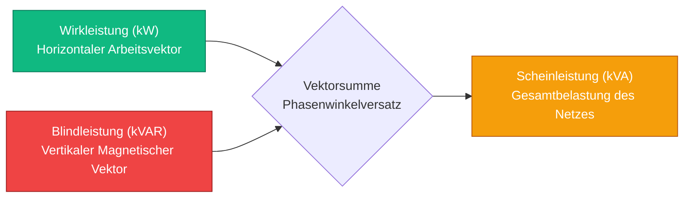
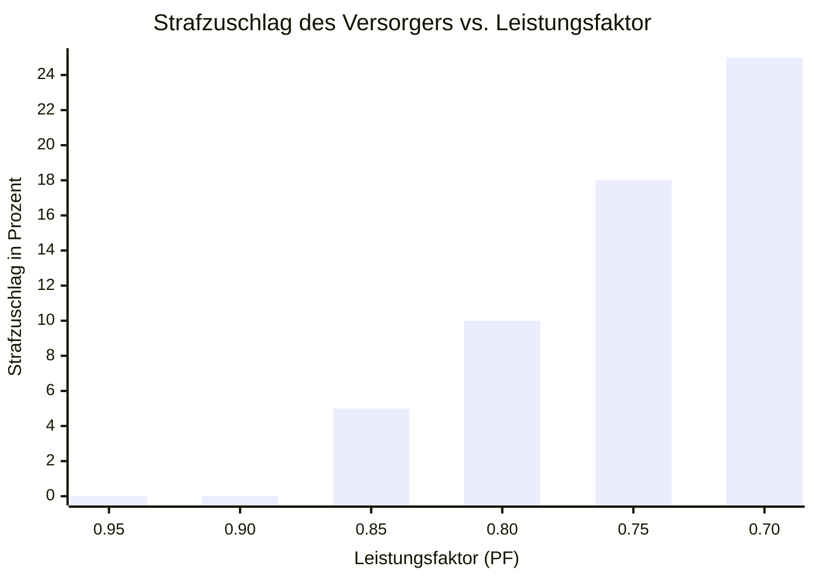
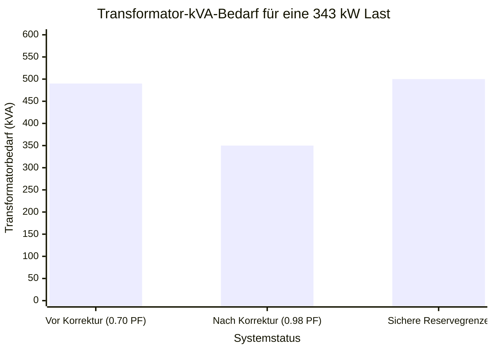
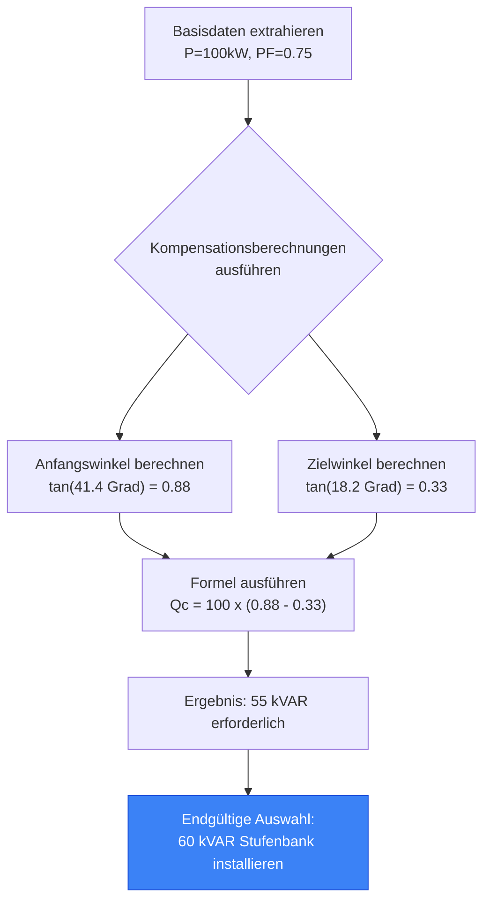
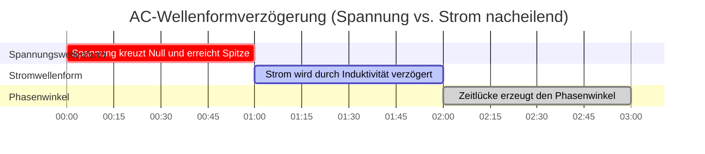

# Der ultimative Leistungsfaktor-Rechner: Blindleistung, Kondensatorauslegung und Energieeffizienz

Willkommen beim ultimativen **Leistungsfaktor-Rechner** und umfassenden AC-Elektrotechnik-Leitfaden. Ganz gleich, ob Sie als Facility Manager versuchen, erdrückende Blindleistungsstrafen der Versorger zu eliminieren, als Industrieingenieur eine massive automatische 480V-Kondensatorbatterie dimensionieren oder als Physikstudent an der Universität das Leistungsdreieck ($S^2 = P^2 + Q^2$) geometrisch visualisieren wollen – die Beherrschung des Leistungsfaktors ist absolut unerlässlich.

Der Leistungsfaktor ist die ultimative Messgröße für die Effizienz von AC-Systemen. Ein niedriger Leistungsfaktor bedeutet, dass Ihr System aktiv gegen sich selbst ankämpft – es zieht enorme Mengen an Strom, um absolut keine reale Arbeit zu verrichten, überhitzt Kabel drastisch, sättigt Transformatoren und zwingt das Stromnetz dazu, zusätzliche Kohle zu verbrennen, nur um die Energie in Ihre Fabrik zu leiten.

In dieser ausführlichen, über 4.000 Wörter langen SEO-Meisterklasse werden wir die fundamentale $PF = \cos \phi$-Trigonometrie dekonstruieren, die finanziellen verheerenden Folgen unkompensierter induktiver Motorlasten aufdecken, die zur sicheren Dimensionierung einer verdrosselten Kondensatorbatterie erforderliche Ingenieursmathematik entschlüsseln und mathematisch beweisen, wie die Verbesserung Ihres Leistungsfaktors sofort gefangene Transformatorkapazität freisetzt. Um sicherzustellen, dass Sie diese technischen Konzepte vollständig begreifen, haben wir fünf akribisch detaillierte, parser-sichere interaktive Mermaid.js-Diagramme integriert.

---

## 1. Die Physik des Leistungsdreiecks (Wirk-, Blind- und Scheinleistung)

In Gleichstromkreisen (DC) ist die Leistung einfach: Volt multipliziert mit Ampere ergibt Watt. In Wechselstromkreisen (AC) teilt sich die Leistung in drei verschiedene dimensionale Vektoren auf.

Um den Leistungsfaktor zu verstehen, müssen Sie das **Leistungsdreieck** visualisieren.

1. **Wirkleistung (P) in kW:** Dies ist die horizontale Basis des Dreiecks. Sie repräsentiert die tatsächliche, nutzbare Arbeit, die von der Elektrizität verrichtet wird – das Drehen einer Motorwelle, das Erhitzen eines Ofenelements oder das Beleuchten einer LED.
2. **Blindleistung (Q) in kVAR:** Dies ist die vertikale Senkrechte des Dreiecks. Sie stellt die "Phantomanergie" dar, die erforderlich ist, um die unsichtbaren Magnetfelder in Induktionsmotoren und Transformatoren aufrechtzuerhalten. Sie springt zwischen der Last und dem Stromnetz hin und her, verrichtet null reale Arbeit, beansprucht aber wertvollen Platz auf den Stromleitungen.
3. **Scheinleistung (S) in kVA:** Dies ist die Hypotenuse des Dreiecks. Sie ist die gesamte Vektorsumme aus Wirk- und Blindleistung ($S = \sqrt{P^2 + Q^2}$). Dies ist die rohe Energie, die das Stromnetz tatsächlich erzeugen und durch die Leitungen drücken muss.

**Die Leistungsfaktor-Gleichung:**
$$\text{Leistungsfaktor (PF)} = \frac{\text{Wirkleistung (kW)}}{\text{Scheinleistung (kVA)}}$$

Wenn Ihre Anlage $100\text{ kW}$ Wirkleistung verbraucht, aber $125\text{ kVA}$ Scheinleistung zieht, beträgt Ihr Leistungsfaktor $100 / 125 = 0.80$ (oder $80\%$). Dies bedeutet, dass Ihre Anlage den aus dem Netz bezogenen Wechselstrom nur zu $80\%$ effizient nutzt.

---

## 2. Die finanziellen verheerenden Folgen eines niedrigen Leistungsfaktors

Stromversorger stellen Privathaushalten ausschließlich die Wirkleistung (kWh) in Rechnung. Gewerbliche und industrielle Anlagen werden jedoch nach der Scheinleistung (kVA) abgerechnet oder für überschüssige Blindleistung (kVAR) bestraft.

Warum? Weil das Übertragen von Blindleistung über das Netz dickere Kupferdrähte, riesige Aufwärtstransformatoren und schwerere Schaltanlagen erfordert. Wenn Ihre Fabrik einen Leistungsfaktor von $0.70$ hat, muss der Versorger eine Infrastruktur aufbauen, die $42\%$ mehr Strom bewältigen kann, als Ihre Wirkleistung eigentlich rechtfertigt.

Um dies zu kompensieren, belegt der Versorger Sie mit einem **Leistungsfaktor-Strafzuschlag**.
- Fällt Ihr PF unter $0.90$, können sie zusätzlich $2\%$ auf Ihre Gesamtrechnung aufschlagen.
- Fällt Ihr PF unter $0.80$, kann sich die Strafe auf $10\%$ erhöhen.
- Fällt Ihr PF auf $0.70$, kann der Versorger Ihre Anlage zwangsweise vom Netz trennen, bis Sie korrigierende Kondensatorbatterien installieren.

Die Korrektur Ihres Leistungsfaktors von $0.75$ auf $0.95$ amortisiert sich oft in weniger als 18 Monaten allein durch den Wegfall dieser lähmenden Straftarife.

---

## 3. Die Mathematik der Kondensatorauslegung ($Q_c$)

Wie behebt man einen niedrigen Leistungsfaktor? Indem man Physik mit Physik bekämpft.

Induktive Lasten (Motoren) benötigen nacheilende Blindleistung ($+\text{kVAR}$). Kondensatoren erzeugen von Natur aus voreilende Blindleistung ($-\text{kVAR}$). Durch die Installation einer massiven Kondensatorbatterie direkt neben dem induktiven Motor liefert der Kondensator die benötigte Magnetfeldenergie lokal. Die Blindleistung springt einfach zwischen dem Kondensator und dem Motor hin und her und schirmt das Stromnetz vollständig ab, sodass es diese nicht mehr liefern muss.

**Die Kondensator-Dimensionierungsformel:**
$$Q_c = P \times (\tan(\phi_1) - \tan(\phi_2))$$

Wobei:
- $Q_c$ = Erforderliche Kondensatorgröße in kVAR.
- $P$ = Wirkleistung der Last in kW.
- $\phi_1$ = Anfänglicher Phasenwinkel (berechnet als $\arccos(\text{PF}_{\text{initial}})$).
- $\phi_2$ = Ziel-Phasenwinkel (berechnet als $\arccos(\text{PF}_{\text{target}})$).

**Beispielrechnung:**
Sie haben einen $100\text{ kW}$-Motor, der mit $0.75\text{ PF}$ läuft. Sie möchten ihn auf $0.95\text{ PF}$ korrigieren.
1. Anfänglicher Winkel: $\arccos(0.75) = 41.41^\circ$. $\tan(41.41^\circ) = 0.8819$.
2. Zielwinkel: $\arccos(0.95) = 18.19^\circ$. $\tan(18.19^\circ) = 0.3286$.
3. Erforderliche Kompensation: $Q_c = 100 \times (0.8819 - 0.3286) = 55.33\text{ kVAR}$.

Sie müssen eine $55\text{ kVAR}$-Kondensatorbatterie installieren, um einen Leistungsfaktor von $0.95$ zu erreichen.

---

## 4. Freisetzung gefangener Transformatorkapazität

Einer der stärksten, aber selten verstandenen Vorteile der Leistungsfaktorkorrektur ist die sofortige Freisetzung gefangener Transformatorkapazität.

Transformatoren sind streng in kVA (Scheinleistung) bewertet. Ihnen ist kW egal; sie kümmern sich nur um den gesamten thermischen Strom.
Wenn Sie einen massiven $500\text{ kVA}$-Anlagentransformator haben und Ihre Fabrik $400\text{ kW}$ Wirkleistung bei einem miserablen Leistungsfaktor von $0.70$ bezieht:
- Scheinleistung = $400 / 0.70 = 571\text{ kVA}$.
- **Ergebnis:** Ihr $500\text{ kVA}$-Transformator ist um $71\text{ kVA}$ überlastet. Er wird überhitzen und katastrophal explodieren.

Anstatt $50,000 auszugeben, um auf einen $800\text{ kVA}$-Transformator aufzurüsten, installieren Sie eine Kondensatorbatterie, um den Leistungsfaktor auf $0.95$ zu korrigieren:
- Neue Scheinleistung = $400 / 0.95 = 421\text{ kVA}$.
- **Ergebnis:** Genau derselbe $500\text{ kVA}$-Transformator arbeitet nun sicher bei $84\%$ Auslastung. Sie haben auf magische Weise $150\text{ kVA}$ gefangener Kapazität aus dem Nichts freigesetzt, wodurch Sie neue Produktionsanlagen hinzufügen können, ohne die Netzstation aufzurüsten.

---

## 5. Die Gefahr von harmonischer Resonanz und Verdrosselung

Kondensatoren sind extrem gefährlich, wenn sie blind installiert werden. Moderne Fabriken sind voll von nichtlinearer Elektronik: Frequenzumrichter (VFDs), LED-Beleuchtungstreiber und Schaltnetzteile.

Diese Geräte erzeugen **harmonische Verzerrungen** – unberechenbare Frequenzen, die bei $300\text{Hz}$, $420\text{Hz}$ und $660\text{Hz}$ durch das Stromnetz springen.
Nach den Gesetzen der Physik sinkt die Impedanz eines Kondensators mit steigender Frequenz rapide. Wenn Sie eine Standard-Kondensatorbatterie in einer Fabrik mit hohen Oberwellen installieren, wirkt der Kondensator wie ein Staubsauger, der den gesamten hochfrequenten harmonischen Strom ansaugt, bis er buchstäblich detoniert.

Um dies zu verhindern, installieren Ingenieure **verdrosselte Kondensatorbatterien (Detuned Capacitor Banks)**. Diese Batterien platzieren schwere induktive Reihendrosseln direkt vor den Kondensatoren, wodurch der Resonanzpunkt des Schaltkreises absichtlich sicher unter die niedrigste gefährliche Oberschwingungsfrequenz verschoben wird (z. B. Abstimmung der Batterie auf $255\text{Hz}$, um der aggressiven 5. Harmonischen bei $300\text{Hz}$ perfekt auszuweichen).

---

## 6. Fünf konzeptionelle Ingenieur-Szenarien mit 2D-Visualisierungen

Um die physikalischen Beziehungen, die den Leistungsfaktor bestimmen, vollständig zu beherrschen, werden wir fünf verschiedene technische Szenarien untersuchen, die mithilfe benutzerdefinierter Mermaid.js-Diagramme visuell aufgeschlüsselt werden.

### Beispiel 1: Die Vektorphysik des Leistungsdreiecks

**Das Szenario:**
Ein Elektrotechnikstudent muss genau visualisieren, wie der horizontale Wirkleistungsvektor mit dem vertikalen Blindleistungsvektor kombiniert wird, um die Hypotenuse der Scheinleistung zu bilden.

**2D-Visualisierung:**
Dieses Logik-Flussdiagramm bildet die physikalische Beziehung der Vektoren ab und zeigt deutlich, wie die Reduzierung des vertikalen Q-Vektors den Hypotenusen-S-Vektor näher an Eins heranrücken lässt.

---

### Beispiel 2: Die finanzielle Strafkurve

**Das Szenario:**
Ein Facility Manager muss dem CFO ein Geschäftsszenario präsentieren, das beweist, dass ein Absinken des Leistungsfaktors der Fabrik unter $0.85$ einen exponentiellen Anstieg der Versorger-Straftarife auslöst.

**Die Mathematik:**
Versorgungsunternehmen erzwingen in der Regel einen Basiswert von $0.90$. Darunter krümmt sich der Strafmultiplikator aggressiv nach oben, um eine Netzüberlastung zu bestrafen.

**2D-Visualisierung:**
Dieses Diagramm veranschaulicht die direkte Korrelation zwischen einem einbrechenden Leistungsfaktor und den drastischen finanziellen Strafen, die vom lokalen Stromnetz verhängt werden.

---

### Beispiel 3: Freisetzung gefangener Transformatorkapazität

**Das Szenario:**
Eine Industrieanlage möchte ein neues $100\text{ kW}$-Montageband hinzufügen, aber ihr $500\text{ kVA}$-Transformator ist aufgrund eines miserablen Leistungsfaktors von $0.70$ bei $490\text{ kVA}$ voll ausgelastet.

**Die Mathematik:**
Aktuelle Last: $343\text{ kW}$ / $0.70 = 490\text{ kVA}$.
Korrigierte Last: $343\text{ kW}$ / $0.98 = 350\text{ kVA}$.
Freigesetzte gefangene Kapazität: $140\text{ kVA}$.

**2D-Visualisierung:**
Dieses Diagramm beweist, wie die Korrektur des Leistungsfaktors den Scheinleistungsbedarf (kVA) mathematisch schrumpfen lässt und enorme Reserven auf dem bestehenden Transformator freisetzt.

---

### Beispiel 4: Logik der automatischen Kondensatorauslegung

**Das Szenario:**
Ein Elektroinstallateur muss die genaue Menge an voreilender kVAR berechnen, die erforderlich ist, um die nacheilenden Induktionsmotoren einer Fabrik zu neutralisieren und gleichzeitig sicherzustellen, dass das System nicht versehentlich in einen gefährlichen voreilenden Leistungsfaktor überkompensiert.

**2D-Visualisierung:**
Dieses Top-Down-Flussdiagramm bildet die strenge Logik ab, die erforderlich ist, um Wirkleistung und Phasenwinkel zu extrahieren, die erforderliche Kompensation ($Q_c$) zu berechnen und eine gestufte automatische Blindleistungs-Kompensationsanlage (APFC) zu implementieren.

---

### Beispiel 5: Die Zeitverzögerung des Phasenwinkels

**Das Szenario:**
Ein Physikstudent hat Mühe zu verstehen, was "nacheilend" bei einer Wechselstromwellenform eigentlich bedeutet.

**2D-Visualisierung:**
Dieses Gantt-Diagramm skizziert grob die mikroskopische Zeitachse einer 50Hz-Wechselstrom-Sinuswelle und demonstriert, wie eine induktive Last die Stromwellenform physisch daran hindert, synchron mit der Spannungswellenform anzusteigen, wodurch der Phasenwinkel ($\phi$) entsteht.

---

## 7. Fazit und Ingenieursherausforderung

Die Beherrschung der Leistungsfaktorberechnung ist der absolute Höhepunkt der AC-elektrischen Effizienztechnik. Das Verständnis der Vektortrigonometrie des Leistungsdreiecks, die Beachtung der finanziellen verheerenden Folgen unkompensierter induktiver Lasten und die Angst vor der explosiven Gefahr der harmonischen Resonanz garantieren, dass Ihre Industrieanlagen mit maximaler Effizienz und null Versorgerstrafen laufen.

Wenn Sie diese mathematischen Prinzipien ignorieren, werden Ihre Kabel durch thermische $I^2 R$-Überlastung schmelzen, Ihre Transformatoren werden sättigen und katastrophal versagen, und Ihr CFO wird jeden Monat Tausende von Dollar verbluten, um Phantom-kVA-Strafzuschläge an das Stromnetz zu zahlen.

Um sicherzustellen, dass Sie diese kritischen Konzepte gemeistert haben, starten Sie unseren interaktiven Simulator und versuchen Sie, diese letzten Herausforderungen zu lösen:
1. **Der gefangene Transformator:** Eine Fabrik bezieht $600\text{ kW}$ bei $0.65\text{ PF}$ aus einem $1000\text{ kVA}$-Transformator. Wenn sie eine Kondensatorbatterie installieren, um $0.95\text{ PF}$ zu erreichen, wie viel kVA-Kapazität wird genau freigesetzt?
2. **Die Kondensatorauslegung:** Ein $250\text{ kW}$-Motor wird mit $0.80\text{ PF}$ betrieben. Berechnen Sie die exakte kVAR-Kapazitätskompensation, die erforderlich ist, um $0.98\text{ PF}$ zu erreichen.
3. **Die Stromreduzierung:** Eine 3-phasige $480\text{V}$-Last zieht $100\text{ kW}$ bei $0.70\text{ PF}$. Berechnen Sie den Leitungsstrom. Berechnen Sie dann den neuen Leitungsstrom, wenn der PF auf $0.95$ verbessert wird. Wie viele Ampere an thermischer Belastung wurden eingespart?

Verlassen Sie sich auf diesen Rechner, um die Stromrechnungen Ihrer Anlage zu prüfen, den ROI von Kondensatorbatterien mathematisch zu rechtfertigen und die Netzineffizienz dauerhaft zu beseitigen.
