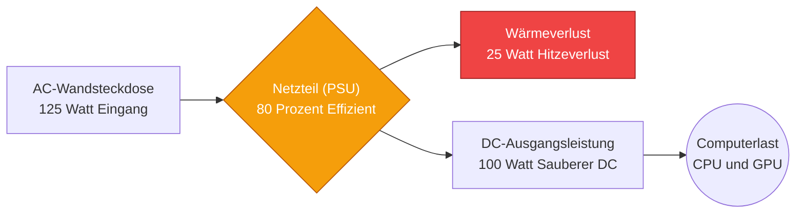
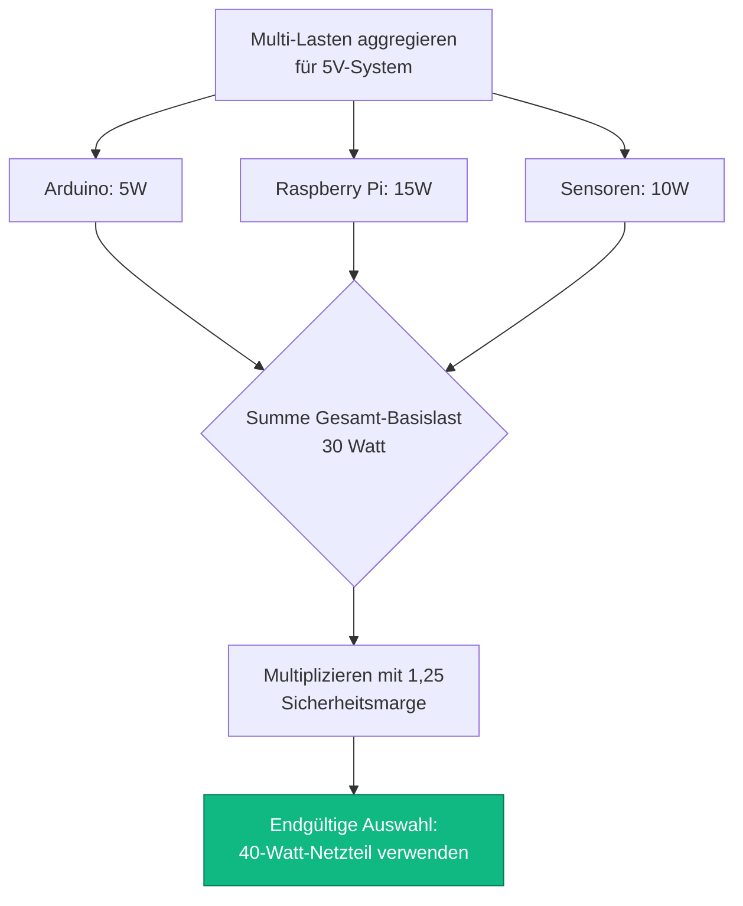
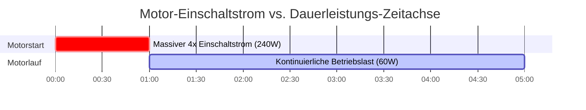

# Der ultimative Netzteil-Rechner: Wattzahl, Reserven und Systemeffizienz

Willkommen beim ultimativen **Netzteil-Rechner** und umfassenden Leitfaden zum Management elektrischer Lasten. Egal, ob Sie ein IT-Systemintegrator sind, der ein massives Dual-PSU-Server-Chassis entwirft, ein Hardcore-PC-Bauer, der versucht, die transienten Leistungsspitzen einer RTX 4090 mathematisch zu bändigen, oder ein Ingenieur für Industrieautomatisierung, der eine $24\text{V}$-DIN-Schienenstromversorgung für ein Array hungriger Gleichstrommotoren dimensioniert – die Beherrschung der Netzteil-Physik ist unverzichtbar.

Ein Netzteil (Power Supply Unit, PSU) ist das schlagende Herzstück jedes elektronischen Systems. Wenn Sie es zu klein dimensionieren, wird Ihre Ausrüstung massiv abstürzen, Spannungsabfälle erleiden oder eine thermische Abschaltung auslösen. Wenn Sie die Effizienzkurve ignorieren, werden Sie Tausende von Euro verschwenden, indem Sie AC-Netzstrom in nutzlose, schädliche Wärme umwandeln.

In dieser ausführlichen, 4.000+ Wörter umfassenden SEO-Masterclass werden wir die fundamentale Leistungsgleichung $P = V \times I$ dekonstruieren, die kritische technische Notwendigkeit der 25% Sicherheitsmarge aufzeigen, die finanziellen Realitäten der 80-Plus-Effizienzstandards entschlüsseln und die furchteinflößende Physik von Motoranlaufströmen analysieren. Um sicherzustellen, dass Sie diese technischen Konzepte vollständig verstehen, haben wir fünf detaillierte, parser-sichere interaktive Mermaid.js-Diagramme beigefügt.

---

## 1. Die Physik der Netzteil-Pipeline

Ein modernes Schaltnetzteil (SMPS) führt eine heftige elektrische Umwandlung durch. Es nimmt hochspannigen Wechselstrom (AC) aus der Steckdose auf, richtet ihn gleich, zerhackt ihn in hochfrequente Impulse, wandelt ihn über einen Transformator herunter und filtert ihn zu perfekt glattem Gleichstrom (DC).

**Die grundlegende Leistungsgleichung:**
$$P_{\text{last}} = V \times I$$
*(Leistung in Watt = Spannung in Volt $\times$ Strom in Ampere).*

Wenn Sie eine $12\text{V}$-CCTV-Kamera haben, die $2\text{ Ampere}$ zieht, benötigt diese genau $24\text{ Watt}$ Leistung, um zu funktionieren.

Aber das Netzteil selbst ist nicht perfekt. Aufgrund von internem elektrischem Widerstand, Schaltverlusten und Transformator-Ineffizienzen muss das Netzteil **mehr** Leistung aus der Steckdose ziehen, als es an die Kamera liefert. Diese verschwendete Leistung wird als Wärme abgegeben.

---

## 2. Die 25% Sicherheitsmarge-Regel

Der häufigste Fehler, den unerfahrene Ingenieure machen, ist, ein Netzteil exakt auf die Gesamtlast auszulegen.
Wenn Ihre kombinierte Systemlast $400\text{ Watt}$ beträgt und Sie ein $400\text{W}$-Netzteil kaufen, haben Sie ein System entworfen, das zum Scheitern verurteilt ist.

Ein Netzteil mit 100 % Kapazität zu betreiben, ist identisch damit, ein Auto ständig mit 100 % seiner Höchstgeschwindigkeit zu fahren. Die internen Kondensatoren werden kochen, der Lüfter wird auf maximaler Drehzahl schreien, und die Siliziumkomponenten werden thermisch degradieren, wodurch die Lebensdauer des Geräts von 10 Jahren auf 2 Jahre drastisch sinkt.

**Der empfohlene technische Standard:**
$$P_{\text{empfohlen}} = P_{\text{gesamtlast}} \times 1,25$$

Sie müssen *immer* eine **Sicherheitsmarge von mindestens 25 %** hinzufügen.
Wenn Ihre Systemlast $400\text{W}$ beträgt: $400 \times 1,25 = 500\text{W}$. Sie müssen ein $500\text{W}$-Netzteil kaufen.

Diese Reserve bietet drei entscheidende Vorteile:
1. **Thermische Lebensdauer:** Die PSU arbeitet kühler und leiser.
2. **Transiente Spitzen:** Sie bietet eine Reservekapazität, um plötzliche mikrosekundenschnelle Leistungsspitzen abzufangen, die von modernen GPUs und CPUs bei Statuswechseln erzeugt werden.
3. **Optimaler Wirkungsgrad (Sweet Spot):** Netzteile sind mathematisch am effizientesten, wenn sie zwischen 50 % und 80 % ihrer Gesamtkapazität betrieben werden.

---

## 3. Die Mathematik der Effizienz (Der 80-Plus-Standard)

Da die Leistungsumwandlung Wärme erzeugt, hat die Elektronikindustrie die **80-Plus-Zertifizierung** eingeführt, um die Effizienz von Netzteilen zu bewerten.

Ein "80 Plus Bronze"-Gerät garantiert $85\%$ Effizienz bei $50\%$ Auslastung.
Ein "80 Plus Titanium"-Gerät garantiert $94\%$ Effizienz bei $50\%$ Auslastung.

**Die Eingangsleistungsgleichung:**
$$P_{\text{eingang}} = \frac{P_{\text{last}}}{\text{Effizienz \%}}$$

**Beispiel: Eine 500W-Last, die an einem 80% effizienten Netzteil betrieben wird vs. einem 94% Titanium-Netzteil.**
- **80% effizientes Netzteil:** $500 / 0,80 = 625\text{W}$ werden aus der Steckdose gezogen. ($125\text{W}$ als Wärme verschwendet).
- **94% effizientes Netzteil:** $500 / 0,94 = 531\text{W}$ werden aus der Steckdose gezogen. ($31\text{W}$ als Wärme verschwendet).

In einer 24/7-Serverumgebung wird dieser Unterschied von $94\text{W}$ an verschwendeter Wärme der Einrichtung Hunderte von Euro an direkten Stromkosten sowie indirekten Klimatisierungskosten zur Kühlung des Serverraums sparen.

---

## 4. Die Gefahr von Einschaltströmen (Surge-Multiplikatoren)

Bestimmte elektrische Komponenten, insbesondere Gleichstrommotoren, Wasserpumpen und schwere Lüfter, gehorchen beim ersten Einschalten nicht den grundlegenden Leistungsgesetzen.

Wenn sich ein Motor im absoluten Stillstand befindet, erzeugt er null Gegen-EMK (elektromotorische Kraft). In den ersten Millisekunden des Starts wirkt der Motor fast wie ein totaler Kurzschluss und zieht massive Strommengen, um die physikalische Trägheit des Rotors zu brechen.

Dies wird als **Einschaltstrom** (Inrush Current) oder Spitzenleistung (Surge Power) bezeichnet.
- Ein $12\text{V}$, $2\text{A}$ ($24\text{W}$) DC-Motor kann während des Starts für eine halbe Sekunde $8\text{A}$ ($96\text{W}$) ziehen.
- Ein Standard-Netzteil, das streng für $24\text{W}$ ausgelegt ist, löst sofort seinen Überstromschutz (OCP) aus und schaltet sich ab.

*Technische Regel:* Wenn Sie ein Netzteil für Motoren oder Pumpen dimensionieren, müssen Sie die Dauerlast mit einem Surge-Faktor von $3,0\times$ bis $4,0\times$ multiplizieren, um sicherzustellen, dass das Netzteil die transiente Spitze beim Start übersteht.

---

## 5. PC- und Server-Leistungsarchitekturen

Moderne ATX-Computer-Netzteile sind hochspezialisiert. Obwohl sie $3,3\text{V}$, $5\text{V}$ und $12\text{V}$ ausgeben, beziehen die meisten modernen PC-Komponenten (CPU und GPU) ihren Strom ausschließlich über die $12\text{V}$-Schiene.

Bei der Dimensionierung eines PC-Netzteils müssen Sie sicherstellen, dass die Kapazität der spezifischen $12\text{V}$-Schiene groß genug ist, um die kombinierte TDP (Thermal Design Power) Ihrer Prozessoren zu bewältigen, zuzüglich der massiven transienten Spitzen (die für einige Mikrosekunden das 2,5-fache der Nennleistung erreichen können).

In Enterprise-Servern verwenden Ingenieure die **N+1-Redundanz**. Wenn ein Server $800\text{W}$ Leistung benötigt, ist er mit zwei $800\text{W}$-Netzteilen ausgestattet. Sie teilen sich die Last mit jeweils $400\text{W}$. Wenn ein Netzteil ausfällt, fährt das andere sofort auf 100 % Kapazität ($800\text{W}$) hoch und verhindert so, dass der Server abstürzt.

---

## 6. Fünf konzeptionelle Konstruktionsszenarien mit 2D-Visualisierungen

Um die physikalischen Beziehungen, die die Netzteil-Dimensionierung bestimmen, vollständig zu beherrschen, werden wir fünf verschiedene technische Szenarien untersuchen, die mithilfe von benutzerdefinierten Mermaid.js-Diagrammen visuell aufgeschlüsselt werden.

### Beispiel 1: Die Pipeline der Leistungsumwandlung

**Das Szenario:**
Ein IT-Student muss visualisieren, wie ein Netzteil rohe Wechselstromenergie (AC) aus der Steckdose aufnimmt, thermische Verluste erleidet und nutzbare Gleichstromenergie (DC) an das Motherboard liefert.

**2D-Visualisierung:**
Dieses Logik-Flussdiagramm bildet den physikalischen Weg der Energie ab, die durch ein SMPS fließt, und zeigt explizit den Effizienzverlust, bei dem elektrische Energie als Wärme verloren geht.



---

### Beispiel 2: Vergleich des 80-Plus-Effizienz-Wärmeverlusts

**Das Szenario:**
Ein Rechenzentrumsmanager muss entscheiden, ob er einen Aufpreis für 80-Plus-Titanium-Netzteile zahlt oder bei günstigen 80-Plus-White-Geräten für ein massives Server-Array bleibt, das $1000\text{W}$ zieht.

**Die Mathematik:**
Bei $1000\text{W}$ Ausgangsleistung verschwendet ein zu 80 % effizientes Netzteil $250\text{W}$ an Wärme. Ein zu 94 % effizientes Netzteil verschwendet nur $63\text{W}$ an Wärme.

**2D-Visualisierung:**
Dieses Balkendiagramm veranschaulicht aggressiv die massiven thermischen Nachteile, die einem Serverraum durch die Verwendung von Netzteilen mit niedriger Effizienzstufe zugefügt werden.

```mermaid
xychart-beta
    title "Verschwendete Wärme (Watt) bei 1000W DC-Ausgangslast"
    x-axis "80-Plus-Effizienzstufe" [White 80%, Bronze 85%, Gold 90%, Titanium 94%]
    y-axis "Verschwendete Wärme (Watt)" 0 --> 300
    bar [250, 176, 111, 63]
```

---

### Beispiel 3: Die 25% Sicherheitsmarge (Headroom)

**Das Szenario:**
Ein Custom-PC-Bauer hat alle Komponenten tabellarisch erfasst und ist auf eine Gesamtsystemlast von $600\text{W}$ gekommen. Er muss visuell nachvollziehen können, warum der Kauf eines $600\text{W}$-Netzteils gefährlich ist.

**Die Mathematik:**
$600\text{W} \times 1,25 = 750\text{W}$ Empfohlen.

**2D-Visualisierung:**
Dieses Diagramm vergleicht die genaue Gesamtlast mit dem katastrophalen Null-Margen-Schwellenwert und beweist die Notwendigkeit des empfohlenen $750\text{W}$-Schwellenwerts.

```mermaid
xychart-beta
    title "Netzteilkapazität vs. Sicherheitsmarge (Headroom)"
    x-axis "Design-Schwellenwerte" [Tatsächliche Systemlast, Null-Marge (Gefahr), Empfohlene 25% Marge]
    y-axis "Benötigte Wattzahl (W)" 0 --> 800
    bar [600, 600, 750]
```

---

### Beispiel 4: Multi-Load-System-Dimensionierungsalgorithmus

**Das Szenario:**
Eine Automatisierungsingenieurin baut einen Schaltkasten, der einen Arduino ($5\text{V}$, $1\text{A}$), einen Raspberry Pi ($5\text{V}$, $3\text{A}$) und ein Sensor-Array ($5\text{V}$, $2\text{A}$) enthält. Sie muss ein einzelnes $5\text{V}$-DIN-Schienen-Netzteil dimensionieren.

**2D-Visualisierung:**
Dieses Top-Down-Flussdiagramm skizziert die strikte Logik, die erforderlich ist, um unabhängige DC-Lasten zu aggregieren und die Sicherheitsmarge mathematisch anzuwenden, um das endgültige Industrie-Netzteil auszuwählen.



---

### Beispiel 5: Motor-Einschaltstrom (Der Startup-Spike)

**Das Szenario:**
Ein Techniker schließt eine $12\text{V}$, $5\text{A}$ ($60\text{W}$) Wasserpumpe an ein $12\text{V}$, $10\text{A}$ ($120\text{W}$) Netzteil an. Trotz einer 100-prozentigen Sicherheitsmarge schaltet sich das Netzteil sofort ab und setzt sich bei jedem Startversuch der Pumpe zurück.

**2D-Visualisierung:**
Dieses Gantt-Diagramm skizziert auf brutale Weise die mikroskopische Zeitachse des Motor-Einschaltstroms und demonstriert, wie ein $60\text{W}$-Motor tatsächlich $240\text{W}$ für die ersten 500 Millisekunden zieht und dabei den Überstromschutz des Netzteils gewaltsam auslöst.



---

## 7. Fazit und Ingenieurs-Herausforderung

Die Beherrschung der Netzteilberechnung ist das fundamentale Fundament aller stabilen elektronischen Systeme. Das Verständnis für die absolute Notwendigkeit der 25% Sicherheitsmarge, der Respekt vor den finanziellen Auswirkungen der 80-Plus-Effizienz-Wärmeverluste und die Beachtung der furchteinflößenden Physik von Motor-Einschaltströmen garantieren, dass Ihre Systeme unter Druck niemals abstürzen.

Wenn Sie diese mathematischen Prinzipien ignorieren, werden Ihre Server unter schwerer Last spontan neu starten, Ihre Netzteile werden thermisch degradieren und ihre Kondensatoren platzen lassen, und Ihre industriellen Steuerkästen werden wiederholt ihre Schutzschaltungen auslösen.

Um sicherzustellen, dass Sie diese kritischen Konzepte beherrschen, starten Sie unseren interaktiven Simulator und versuchen Sie, diese letzten Herausforderungen zu lösen:
1. **Das Server-Upgrade:** Ein Server zieht eine Gesamtlast von $550\text{W}$. Berechnen Sie die exakte empfohlene Netzteil-Wattzahl unter Verwendung einer strikten $25\%$-Sicherheitsmarge.
2. **Die thermische Verschwendung:** Sie ziehen $400\text{W}$ aus einem $85\%$ effizienten Bronze-Netzteil. Wie viel Watt genau ziehen Sie aus der Steckdose und wie viel Watt genau werden als Wärme verschwendet?
3. **Der Pumpenstoß:** Ein industrieller $24\text{V}$-DC-Lüfter hat eine Dauerbetriebslast von $3\text{ Ampere}$. Welche absolute Mindestwattzahl muss das Netzteil haben, um zu garantieren, dass es einen $3\times$-Einschaltstromstoß beim Start überlebt?

Verlassen Sie sich auf diesen Rechner, um Ihre PC-Builds zu prüfen, komplexe Mehrgerätelasten zu berechnen und Ihre Elektronik stets mathematisch vor Unterversorgung zu schützen.
