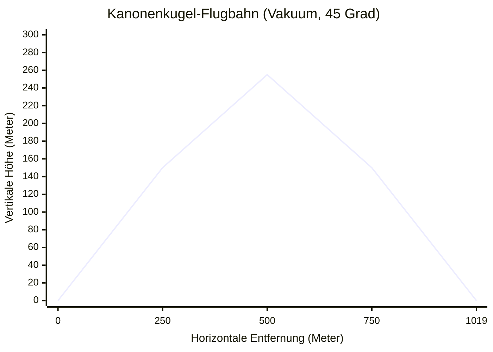
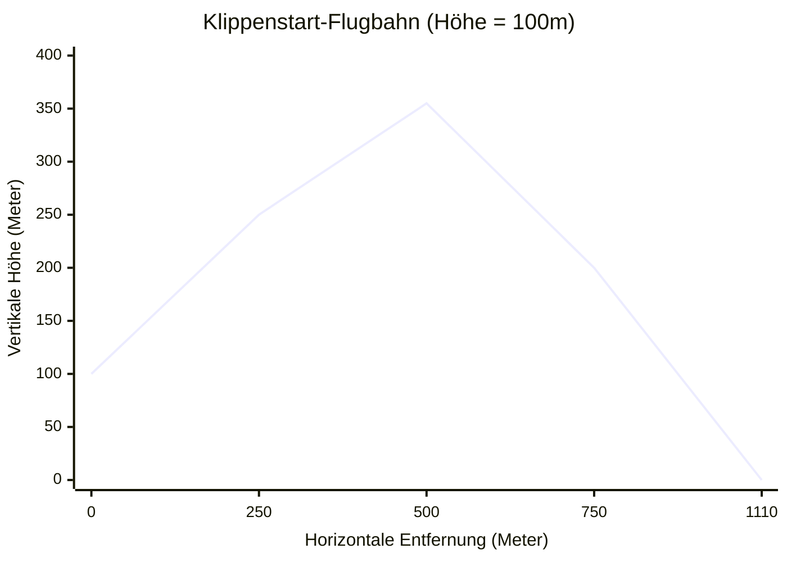
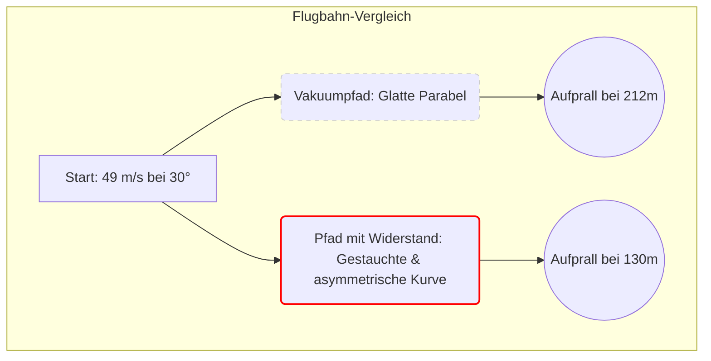
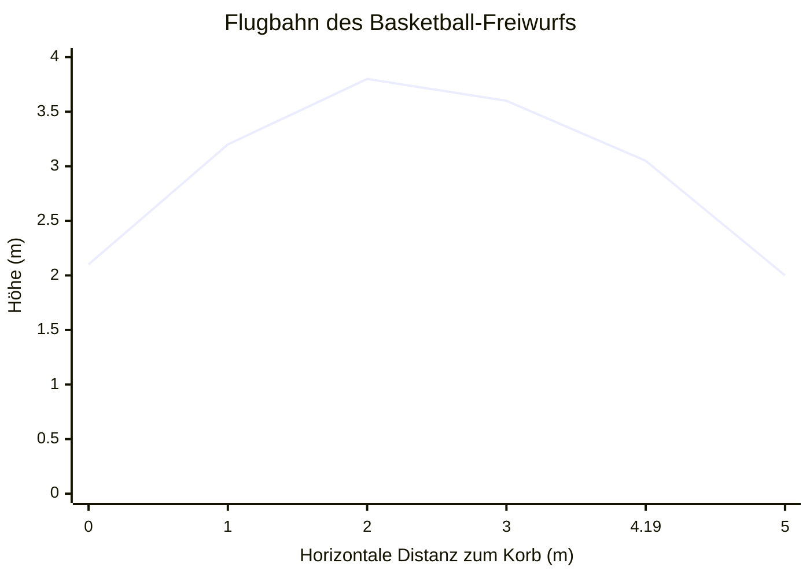
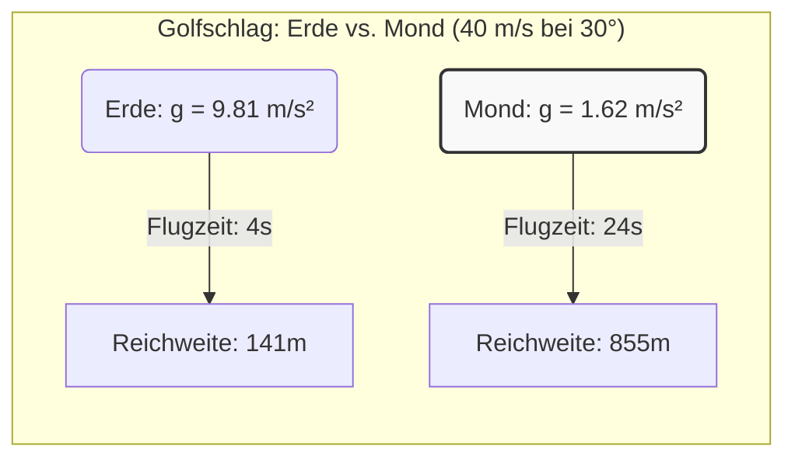

# Projektilbewegungs-Rechner: Der ultimative Leitfaden für Kinematik und Ballistik

Haben Sie jemals einen Baseball geworfen, einen Stein über einen stillen Teich hüpfen lassen oder ein Feuerwerk am Nachthimmel beobachtet und sich über die unsichtbaren mathematischen Regeln gewundert, die ihren Flug bestimmen? Jedes Mal, wenn ein Objekt in die Luft geworfen oder geschossen wird, wird es zu einem **Projektil**. In dem Moment, in dem es Ihre Hand oder den Lauf einer Waffe verlässt, wird sein Schicksal den fundamentalen Kräften des Universums übergeben, hauptsächlich der Schwerkraft und dem Luftwiderstand.

Zu verstehen, wie sich diese Objekte bewegen, ist nicht nur eine mathematische Übung; es ist das eigentliche Fundament der klassischen Mechanik. Es ist die Wissenschaft, die es Ingenieuren ermöglicht, Rover auf dem Mars zu landen, Athleten, ihre Freiwürfe zu optimieren, und Videospielentwicklern, realistische Physik-Engines zu erstellen.

Willkommen zum definitiven Leitfaden über Projektilbewegungen. Egal, ob Sie ein Physikschüler sind, der mit kinematischen Gleichungen kämpft, ein Maschinenbauingenieur, der eine pneumatische Abschussvorrichtung entwirft, oder einfach ein neugieriger Geist, der die Welt verstehen möchte – dieser Leitfaden, zusammen mit unserem fortschrittlichen **Projektilbewegungs-Rechner**, wird Ihnen die vollständige Beherrschung von 2D-Flugbahnen vermitteln.

---

## 1. Das menschliche Konzept der Projektilbewegung: Eine tiefe Erklärung

Um die Projektilbewegung wirklich zu verstehen, müssen wir zunächst ein häufiges Missverständnis verlernen. Jahrhundertelang glaubten antike Philosophen wie Aristoteles, dass ein in die Luft geworfenes Objekt in einer geraden Linie fliegt, bis ihm die "Kraft" (oder der *Impetus*) ausgeht, woraufhin es direkt zu Boden fallen würde. Wenn Sie ein sich schnell bewegendes Objekt wie eine Kugel beobachten, könnte es tatsächlich so aussehen, als würde es in einer geraden Linie fliegen.

Im späten 16. und frühen 17. Jahrhundert veränderte jedoch **Galileo Galilei** die Welt für immer, als er erkannte, dass der Weg eines Projektils in Wirklichkeit eine glatte, symmetrische Kurve ist, die in der Mathematik als **Parabel** bekannt ist.

Galileos Genialität bestand darin zu erkennen, dass die Bewegung eines Projektils nicht eine einzige komplexe Bewegung ist, sondern **zwei einfache und völlig unabhängige Bewegungen, die gleichzeitig stattfinden**.

### Die zwei Säulen der 2D-Kinematik

Wenn eine Kanonenkugel horizontal von einer Klippe abgefeuert wird, tut sie zwei Dinge gleichzeitig:
1. **Sich vorwärts bewegen** (Horizontale Bewegung)
2. **Nach unten fallen** (Vertikale Bewegung)

Galileos Prinzip der **Unabhängigkeit der Bewegungen** besagt, dass sich diese beiden Dimensionen nicht gegenseitig beeinflussen. Die horizontale Vorwärtsgeschwindigkeit kümmert es nicht, dass das Objekt fällt, und die vertikale Fallgeschwindigkeit kümmert es nicht, dass sich das Objekt vorwärts bewegt.

#### Horizontale Bewegung: Die Trägheitsphase
Stellen Sie sich vor, Sie schieben einen Puck über eine Schicht perfekten, reibungslosen Eises. Sobald Sie ihn anstoßen, gleitet er mit der gleichen Geschwindigkeit ewig weiter. Es gibt keine Kraft mehr, die ihn vorwärts schiebt, aber es gibt auch keine Kraft, die ihn abbremst. Das ist Newtons Erstes Bewegungsgesetz (Trägheit).

In einem idealen physikalischen Vakuum (wo wir so tun, als gäbe es keine Luft) ist die horizontale Bewegung eines Projektils genau wie dieser Puck. Sobald das Objekt abgeschossen ist, wirken keine horizontalen Kräfte auf es ein. Daher bleibt seine **horizontale Geschwindigkeit perfekt konstant** und seine horizontale Beschleunigung ist null ($a_x = 0$).

#### Vertikale Bewegung: Die Fallphase
Stellen Sie sich nun vor, Sie lassen einen Apfel aus Ihrer Hand fallen. Er beginnt mit der Geschwindigkeit null, aber die Schwerkraft zieht ihn nach unten, wodurch er beschleunigt. Jede Sekunde, die er fällt, nimmt seine Geschwindigkeit um etwa $9.81 \text{ m/s}$ zu.

Bei einem Projektil geschieht genau das Gleiche. Egal wie schnell es sich vorwärts bewegt, die Schwerkraft zieht es unerbittlich mit einer konstanten vertikalen Beschleunigung nach unten ($a_y = -9.81 \text{ m/s}^2$ auf der Erde).

Wenn Sie eine konstante Vorwärtsgeschwindigkeit mit einer nach unten beschleunigenden Fallgeschwindigkeit kombinieren, ist der resultierende, durch den Raum gezogene Pfad ein perfekter parabolischer Bogen.

### Die Mathematik des Vakuums

Um die genaue Position eines Projektils zu einer bestimmten Sekunde vorherzusagen, verwenden wir die standardmäßigen kinematischen Gleichungen.

**1. Aufschlüsselung des Starts (Vektorzerlegung)**
Wenn ein Projektil mit einer Anfangsgeschwindigkeit ($v_0$) und einem bestimmten Winkel ($\theta$) relativ zum Boden abgeschossen wird, besteht der erste Schritt darin, diese Geschwindigkeit mithilfe der Trigonometrie in ihre horizontalen und vertikalen Komponenten aufzuteilen.
*   **Initiale horizontale Geschwindigkeit:** $v_{x0} = v_0 \cdot \cos(\theta)$
*   **Initiale vertikale Geschwindigkeit:** $v_{y0} = v_0 \cdot \sin(\theta)$

**2. Berechnung der Position über die Zeit**
Da sich die horizontale Geschwindigkeit (im Vakuum) nie ändert, ist das Finden der horizontalen Entfernung ($x$) zu einer beliebigen Zeit ($t$) eine einfache Multiplikation:
*   **Horizontale Position:** $x(t) = v_{x0} \cdot t$

Die vertikale Position ($y$) ist etwas komplexer, da die Schwerkraft die Geschwindigkeit ständig ändert. Wir müssen die Anfangshöhe ($h_0$), die anfängliche Aufwärtsgeschwindigkeit und den abwärts gerichteten Zug der Schwerkraft ($g$) berücksichtigen:
*   **Vertikale Position:** $y(t) = h_0 + (v_{y0} \cdot t) - \frac{1}{2}g \cdot t^2$

Indem diese beiden Gleichungen durch die Zeitvariable ($t$) miteinander verknüpft werden, kann unser Rechner sofort die exakte Flugbahn jedes Objekts im Universum aufzeichnen.

---

## 2. Umfassende Gebrauchsanweisung: Den Simulator meistern

Unser **Projektilbewegungs-Rechner** ist nicht nur ein einfacher Gleichungslöser; er ist eine vollständige 2D-Physik-Engine. Hier erfahren Sie, wie Sie sein volles Potenzial freisetzen.

### Schritt 1: Einrichten Ihrer Anfangsparameter
*   **Anfangsgeschwindigkeit (Launch Speed):** Dies ist die reine Geschwindigkeit, mit der das Objekt die Abschussvorrichtung verlässt. Sie können diese in Metern pro Sekunde (m/s), Kilometern pro Stunde (km/h), Meilen pro Stunde (mph) oder Fuß pro Sekunde (ft/s) eingeben.
*   **Abschusswinkel:** Geben Sie den Höhenwinkel ein. $0^\circ$ bedeutet, dass perfekt horizontal geschossen wird. $90^\circ$ bedeutet, dass direkt in die Luft geschossen wird. $45^\circ$ ist traditionell der Winkel für die maximale Reichweite im Vakuum.
*   **Anfangshöhe:** Wenn Sie einen Ball von einer 50-Meter-Klippe werfen, geben Sie hier 50 ein. Wenn Sie einen Fußball vom Boden aus schießen, belassen Sie es bei 0.

### Schritt 2: Die Umgebung wählen
*   **Schwerkraft-Voreinstellungen:** Die Schwerkraft der Erde ist die Standardeinstellung ($9.81 \text{ m/s}^2$). Sie können jedoch das Dropdown-Menü verwenden, um Starts auf dem Mond, dem Mars, dem Jupiter oder sogar tief im Weltraum befindlichen Asteroiden zu simulieren. Beobachten Sie, wie die Flugbahn in die Höhe explodiert, wenn Sie den Mond auswählen!
*   **Luftwiderstand (Drag):** Hier wechselt der Rechner von High-School-Physik zu Ingenieurwesen auf Universitätsniveau. Durch Aktivieren von "Enable Air Resistance" wechselt der Simulator von einfachen algebraischen Gleichungen zu einer komplexen numerischen Integrations-Engine nach dem **Runge-Kutta-Verfahren 4. Ordnung (RK4)**. Sie müssen die Masse, die Querschnittsfläche und den Strömungswiderstandskoeffizienten ($C_d$) des Objekts angeben. Wir bieten Voreinstellungen für gängige Objekte wie Baseballs, Golfbälle und Kugeln an.

### Schritt 3: Der Zieltreffer-Simulator
Versuchen Sie, ein bestimmtes Fenster zu treffen, eine bestimmte Mauer zu überwinden oder in einem bestimmten Graben zu landen?
*   Aktivieren Sie den **Zieltreffer-Simulator (Target Hit Simulator)**.
*   Geben Sie die X- (horizontale Entfernung) und Y-Koordinaten (vertikale Höhe) Ihres Ziels ein.
*   Auf dem interaktiven Diagramm erscheint ein Fadenkreuz. Sie können dann den Abschusswinkel und die Geschwindigkeit so lange anpassen, bis sich Ihre Flugbahnkurve perfekt mit dem Zielfadenkreuz schneidet.

### Schritt 4: Analyse der Ausgangsdaten
Sobald Sie Ihre Parameter eingegeben haben, generiert der Rechner sofort die Flugdaten:
*   **Maximale Höhe (Apex):** Der höchste erreichte vertikale Punkt, bevor die Schwerkraft ihn nach unten zieht.
*   **Horizontale Reichweite:** Die gesamte am Boden zurückgelegte Entfernung vor dem Aufprall.
*   **Flugzeit:** Die gesamten Sekunden, die das Objekt in der Luft bleibt.
*   **Aufprallgeschwindigkeit:** Die genaue Geschwindigkeit und der Winkel, mit denen das Projektil auf den Boden trifft.

Sie können mit der Maus über das interaktive Flugbahndiagramm fahren, um die genauen X/Y-Koordinaten und Geschwindigkeitsvektoren zu jedem beliebigen Sekundenbruchteil während des Fluges zu sehen.

---

## 3. Fünf konzeptionelle Beispiele mit 2D-Visualisierungen

Um die Projektilbewegung wirklich zu meistern, müssen wir über abstrakte Gleichungen hinausgehen und uns konkrete Beispiele aus der realen Welt ansehen. Im Folgenden finden Sie fünf verschiedene Szenarien, die veranschaulichen, wie die Änderung einer einzigen Variablen die Flugbahn drastisch verändert.

### Beispiel 1: Die klassische Kanonenkugel (Ideales Vakuum, flaches Gelände)
**Das Szenario:** Sie kommandieren eine Artilleriebesatzung aus dem 17. Jahrhundert auf einer perfekt flachen, endlosen Ebene. Wir werden den Luftwiderstand für diese rein mathematische Basislinie ignorieren. Sie feuern eine Kanonenkugel mit einer Anfangsgeschwindigkeit von $100 \text{ m/s}$ in einem Winkel von $45^\circ$ ab.

**Die physikalische Aufschlüsselung:**
Da wir uns auf flachem Gelände ($h_0 = 0$) in einem Vakuum befinden, ist die Flugbahn eine perfekt symmetrische Parabel. Ein Winkel von $45^\circ$ teilt die Anfangsgeschwindigkeit perfekt gleichmäßig zwischen dem horizontalen und dem vertikalen Vektor auf ($v_{x0} = 70.7 \text{ m/s}$, $v_{y0} = 70.7 \text{ m/s}$).
*   **Zeit bis zum Erreichen des Scheitelpunkts:** $70.7 / 9.81 = 7.21 \text{ Sekunden}$.
*   **Gesamte Flugzeit:** $7.21 \times 2 = 14.42 \text{ Sekunden}$ (perfekte Symmetrie).
*   **Horizontale Reichweite:** $70.7 \text{ m/s} \times 14.42 \text{ s} = 1019.5 \text{ Meter}$.

**2D-Visualisierung (Flugbahnkarte):**

*Beachten Sie die perfekte Spiegelsymmetrie der Kurve. Der Aufstieg dauert genau so lange und legt die exakt gleiche horizontale Strecke zurück wie der Abstieg.*

---

### Beispiel 2: Der Klippenstart (Anfangshöhe > 0)
**Das Szenario:** Jetzt verteidigen Sie eine Burg, die am Rande einer vertikalen 100-Meter-Klippe gebaut ist. Sie feuern dieselbe Kanonenkugel mit $100 \text{ m/s}$ ab, experimentieren dieses Mal aber mit dem Winkel.

**Die physikalische Aufschlüsselung:**
Beim Start aus einer Höhe ist $45^\circ$ **nicht mehr der optimale Winkel für die maximale Reichweite**. Warum? Weil das Projektil zusätzliche Zeit damit verbringt, von der 100-Meter-Klippe auf den Boden mit der Höhe null zu fallen. Wenn Sie einen etwas flacheren Winkel (z. B. $40^\circ$) verwenden, widmen Sie mehr Ihrer Anfangsenergie der horizontalen Vorwärtsgeschwindigkeit ($v_x$). Die zusätzliche Fallstrecke liefert die Flugzeit, die diese schnellere horizontale Geschwindigkeit benötigt, um mehr Boden abzudecken.
*   Bei einem Schuss mit $45^\circ$ beträgt die Reichweite $1110 \text{ Meter}$.
*   Bei einem Schuss mit $40^\circ$ erhöht sich die Reichweite auf $1115 \text{ Meter}$.

**2D-Visualisierung (Die Asymmetrie von erhöhten Starts):**

*Hier ist die Symmetrie gebrochen. Das Projektil erreicht seinen Scheitelpunkt relativ früh auf seiner horizontalen Reise, und die rechte Seite der Parabel dehnt sich aus, wenn sie unter die Starthöhe fällt.*

---

### Beispiel 3: Der Baseball-Homerun (Die Realität des Luftwiderstands)
**Das Szenario:** Wir verlassen das theoretische Vakuum und betreten die reale Welt. Ein Spieler der Major League Baseball trifft einen Ball mit einer Austrittsgeschwindigkeit von $49 \text{ m/s}$ (etwa 110 mph) in einem Abschusswinkel von $30^\circ$. Ein Baseball hat eine Masse von $0.145 \text{ kg}$ und einen Widerstandskoeffizienten ($C_d$) von etwa $0.3$.

**Die physikalische Aufschlüsselung:**
Der Luftwiderstand ändert alles. Während sich der Ball durch die Luft drückt, stoßen Millionen von atmosphärischen Molekülen auf ihn und erzeugen eine Widerstandskraft, die seiner Bewegung entgegenwirkt. Diese Widerstandskraft wächst exponentiell mit der Geschwindigkeit ($F_d \propto v^2$).
*   **Im Vakuum:** Der Ball würde unglaubliche **212 Meter** (695 Fuß) fliegen und das Stadion komplett verlassen.
*   **Mit Luftwiderstand:** Der Luftwiderstand entzieht schnell die horizontale Geschwindigkeit. Der Ball erreicht früher seinen Scheitelpunkt und fällt viel steiler ab. Die tatsächliche Reichweite verringert sich auf etwa **130 Meter** (426 Fuß) – ein Standard-Homerun.

**2D-Visualisierung (Vakuum vs. Luftwiderstand):**

*Wenn der Luftwiderstand berücksichtigt wird, ist die Flugbahn keine Parabel mehr. Sie ähnelt einer Tropfenform. Der Abstiegswinkel ist viel steiler als der Abschusswinkel, da die Vorwärtsgeschwindigkeit durch den Widerstand größtenteils zunichte gemacht wurde.*

---

### Beispiel 4: Der Basketball-Freiwurf (Einen festen Zielpunkt treffen)
**Das Szenario:** Ein Basketballspieler wirft einen Freiwurf. Der Spieler lässt den Ball aus einer Höhe von $2.1 \text{ Metern}$ los. Die Mitte des Korbs ist exakt $4.19 \text{ Meter}$ horizontal entfernt und exakt $3.05 \text{ Meter}$ hoch.

**Die physikalische Aufschlüsselung:**
Dies ist ein Problem der inversen Kinematik. Anstatt zu fragen "Wo wird er landen?", verlangen wir, dass die Flugbahn eine bestimmte Koordinate schneidet: $(X = 4.19, Y = 3.05)$.
Der Spieler wirft im Allgemeinen in einem Winkel von etwa $50^\circ$, um dem Ball einen hohen Bogen zu geben, sodass er sauber durch das Netz fallen kann. Unter Verwendung der Flugbahngleichung beträgt die Anfangsgeschwindigkeit, die erforderlich ist, um die Mitte des Korbes bei einem Winkel von $50^\circ$ aus einer Abwurfhöhe von $2.1\text{m}$ perfekt zu treffen, exakt **$7.28 \text{ m/s}$**. Wenn der Spieler mit $7.5 \text{ m/s}$ wirft, trifft er das hintere Eisen. Wenn er mit $7.0 \text{ m/s}$ wirft, berührt der Ball nicht einmal den Korb (Airball).

**2D-Visualisierung (Ziel-Schnittpunkt):**

*Die mathematische Präzision, die im Sport erforderlich ist, ist atemberaubend. Das menschliche Gehirn fungiert als ballistischer Echtzeitcomputer und berechnet intuitiv die $v_0$ und $\theta$, die benötigt werden, um die Flugbahnlinie die Koordinate $(4.19, 3.05)$ schneiden zu lassen.*

---

### Beispiel 5: Golf spielen auf dem Mond (Umgebungen mit geringer Schwerkraft)
**Das Szenario:** 1971 schlug der Apollo-14-Astronaut Alan Shepard mit einem behelfsmäßigen 6er-Eisen einen Golfball auf die Mondoberfläche. Nehmen wir eine Amateur-Schwunggeschwindigkeit von $40 \text{ m/s}$ und einen Abschusswinkel von $30^\circ$ an.

**Die physikalische Aufschlüsselung:**
Der Mond ist eine radikal andere physikalische Umgebung.
1.  **Kein Luftwiderstand:** Es gibt keine Atmosphäre, daher verwenden wir die reinen Vakuumgleichungen. Der Golfball wird sich weder krümmen noch langsamer werden.
2.  **Geringe Schwerkraft:** Die Anziehungskraft beträgt nur $1.62 \text{ m/s}^2$ (etwa 1/6 der Schwerkraft der Erde).

Da die Schwerkraft den Ball mit 6-mal weniger Kraft nach unten zieht, bleibt der Ball 6-mal länger in der Luft. Da er 6-mal länger in der Luft ist, trägt ihn seine konstante horizontale Geschwindigkeit 6-mal weiter.
*   **Reichweite auf der Erde:** $141 \text{ Meter}$
*   **Reichweite auf dem Mond:** $855 \text{ Meter}$ (Mehr als eine halbe Meile!)

**2D-Visualisierung (Schwerkraftskalierung):**

*Durch Änderung der fundamentalen Schwerkraftkonstanten ($g$) führt der exakt gleiche anfängliche Energieaufwand zu einer massiv verstärkten kinematischen Leistung.*

---

## 4. Fortgeschrittene Themen & Ingenieurwesen in der realen Welt

Während das Werfen von Baseballs und Schlagen von Golfbällen hervorragende pädagogische Werkzeuge sind, bildet die Projektilbewegung die Grundlage für fortgeschrittenes Ingenieurwesen und militärische Anwendungen.

### Orbitale Mechanik: Newtons Kanonenkugel
Isaac Newton schlug ein berühmtes Gedankenexperiment vor: Was wäre, wenn wir eine Kanone auf die Spitze eines Berges stellen würden, der so unmöglich hoch ist, dass er über die Erdatmosphäre hinausragt (wodurch der Luftwiderstand beseitigt wird)?
Wenn die Kanonenkugel mit Standardgeschwindigkeiten abgefeuert wird, folgt sie einer normalen Parabel und trifft den Boden. Aber wenn sie schnell genug abgefeuert wird (etwa $7.900 \text{ m/s}$), passiert etwas Wundersames.
Die Kanonenkugel fällt aufgrund der Schwerkraft in Richtung Erde, aber da die Erde eine Kugel ist, *krümmt sich die Oberfläche des Planeten* mit genau derselben Geschwindigkeit weg, mit der die Kugel fällt. Die Kanonenkugel befindet sich in einem ständigen Zustand des freien Falls und verfehlt ständig den Boden.
Das ist es, was ein **Orbit** ist. Die Internationale Raumstation (ISS) ist technisch gesehen nur ein Projektil, das sich horizontal so schnell bewegt, dass sein parabolischer Bogen perfekt mit der Krümmung der Erde übereinstimmt.

### Artillerie und der Coriolis-Effekt
Für militärische Scharfschützen und Artilleriebesatzungen mit großer Reichweite ist die grundlegende Gleichung $R = \frac{v_0^2 \sin(2\theta)}{g}$ unzureichend. Wenn ein Projektil kilometerweit abgefeuert wird, müssen Ingenieure Folgendes berücksichtigen:
1.  **Variable Luftdichte:** Die Luft ist am Scheitelpunkt der Flugbahn dünner als am Abschusspunkt, wodurch sich der Widerstandskoeffizient während des Fluges dynamisch ändert.
2.  **Der Coriolis-Effekt:** Die Erde rotiert unter dem Projektil, während es sich in der Luft befindet. Wenn ein Artilleriegeschoss auf der Nordhalbkugel nach Norden abgefeuert wird, bewegt sich das Ziel schneller nach Osten als der Startpunkt. Das Projektil scheint sich nach rechts zu krümmen. Ballistische Computer müssen diese fiktive Kraft berechnen, um Genauigkeit zu gewährleisten.

### Sportwissenschaft: Der Magnus-Effekt
In unserem Simulator behandeln wir Objekte als nicht rotierende Punktmassen. In der Realität drehen sich Kugeln wie Tennisbälle, Fußbälle und Baseballs schnell.
Wenn sich ein Ball dreht, während er sich durch die Luft bewegt, zieht er eine Grenzschicht aus Luft mit sich. Ein Ball mit **Backspin** (Rückwärtsdrall) (wie ein Fastball oder ein geschlagener Golfball) drückt die Luft nach unten. Nach Newtons drittem Gesetz drückt die Luft den Ball nach oben. Dies erzeugt eine Auftriebskraft, die als **Magnus-Effekt** bekannt ist.
Dies ist der Grund, warum ein Golfball, der mit starkem Backspin geschlagen wird, in der realen Welt tatsächlich *weiter* fliegen kann als in einem reinen Vakuum: Der aerodynamische Auftrieb hält ihn lange genug in der Luft, um der aerodynamischen Verlangsamung entgegenzuwirken.

---

## Fazit: Die Schönheit vorhersehbarer Physik

Die Magie der Projektilbewegung liegt in ihrem absoluten Determinismus. Sobald ein Objekt den Launcher verlässt, ist sein Schicksal vollständig durch die Gesetze der Physik besiegelt. Indem wir die Anfangsgeschwindigkeit, den Abschusswinkel und die Umgebungskräfte der Schwerkraft und des Luftwiderstands verstehen, können wir in die Zukunft blicken und genau vorhersagen, wo und wann das Objekt landen wird.

Wir empfehlen Ihnen dringend, etwas Zeit damit zu verbringen, mit dem obigen **Projektilbewegungs-Simulator** zu experimentieren. Ändern Sie die Abschusswinkel. Schalten Sie den Luftwiderstand ein und aus. Sehen Sie, was passiert, wenn Sie einen Baseball auf Jupiter abschießen. Durch das Spielen mit den Variablen werden sich die abstrakten Gleichungen der Kinematik in ein intuitives, visuelles Verständnis der Mechanik verwandeln, die unser Universum regiert.
