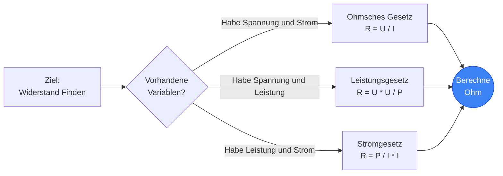
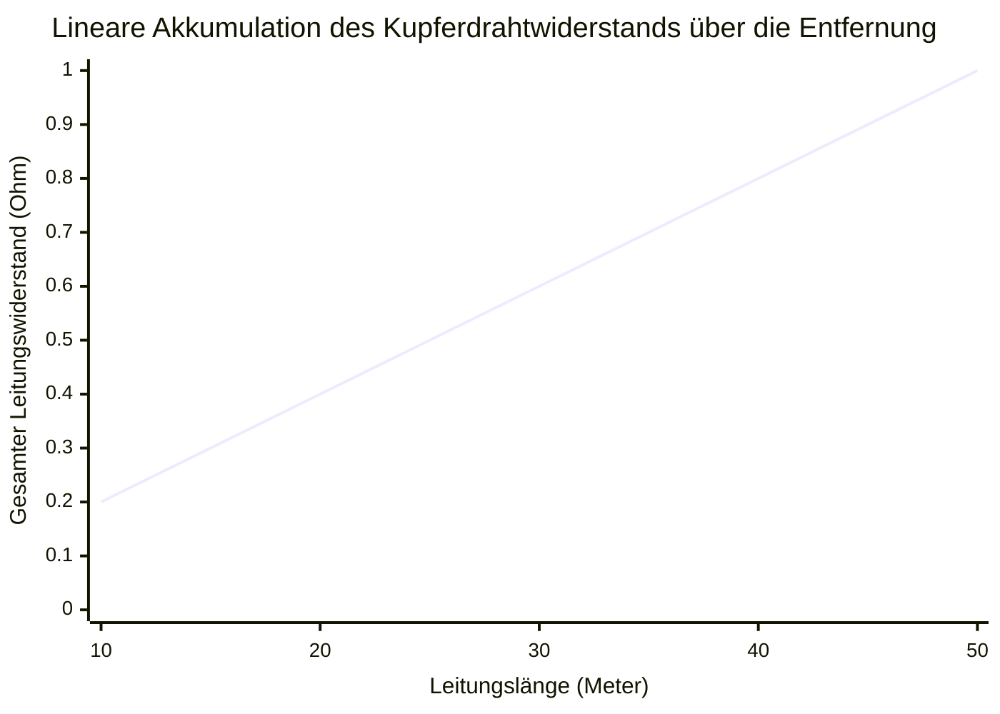
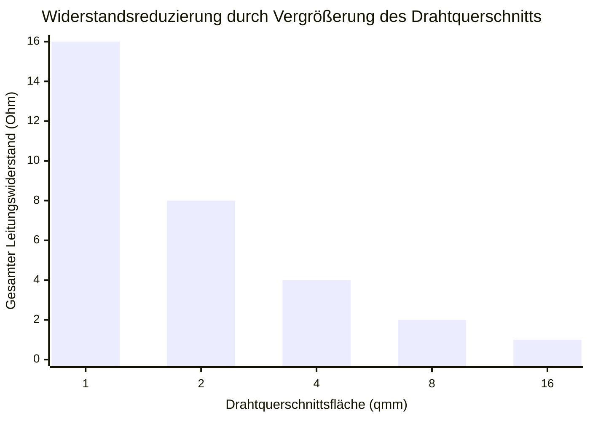
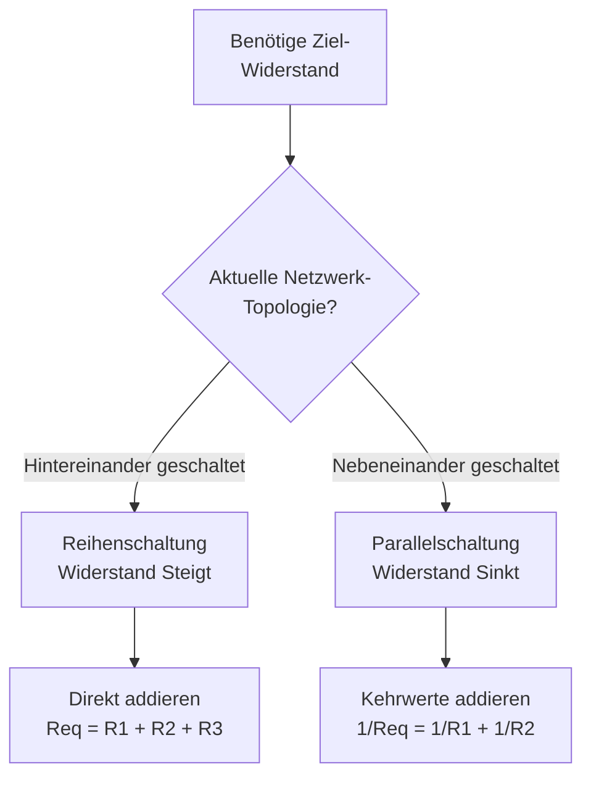

# Der Definitive Widerstands-Rechner: Widerstände und Leiterphysik Meistern

Willkommen beim ultimativen **Widerstands-Rechner** und umfassenden Physik-Leitfaden. Egal, ob Sie einen verbrannten 4-Ring-Widerstand auf einer defekten Leiterplatte entschlüsseln, den präzisen Ersatzwiderstand eines massiven parallelen Lastnetzwerks berechnen oder den durch den Widerstand verursachten Spannungsabfall einer $500\text{ Fuß}$ langen Kupferübertragungsleitung analysieren, diese interaktive Suite bietet genau die mathematischen Ableitungen, die Sie benötigen.

Elektrischer Widerstand ist die Reibung der Elektronikwelt. Ohne Widerstand würde der Strom unendlich fließen und sofort alles auf seinem Weg verdampfen. Der Widerstand ermöglicht es uns, die Elektrizität zu kontrollieren, zu begrenzen und zu nutzen, um nützliche Arbeit zu verrichten, vom Leuchten von LEDs bis zur Erzeugung von thermischer Wärme.

In diesem ausführlichen, 4.000+ Wörter umfassenden SEO-Leitfaden werden wir die Physik des elektrischen Widerstands aggressiv dekonstruieren, die mathematischen Grenzen des Ohmschen Gesetzes ($R = U/I$) und der Jouleschen Erwärmung ($P = I^2 R$) untersuchen, die internationalen Standards für Widerstandsfarbcodes entschlüsseln, den intrinsischen spezifischen Materialwiderstand ($\rho$) analysieren und fünf detaillierte elektrische Szenarien aufschlüsseln, die durch interaktive, parser-sichere Mermaid.js-Diagramme visuell dargestellt werden.

---

## 1. Was Genau ist der Elektrische Widerstand? (Die Physikalische Definition)

Der **elektrische Widerstand**, wissenschaftlich gemessen in **Ohm ($\Omega$)**, ist der grundlegende Widerstand gegen den Fluss von elektrischem Strom durch ein leitfähiges Material. 

Um den Widerstand intuitiv zu verstehen, stützen sich Elektroingenieure universell auf die **Wasserrohr-Analogie**:
- Stellen Sie sich einen massiven Wasserturm vor, der Wasser durch ein Rohr drückt. Wenn das Rohr massiv und breit ist, fließt das Wasser leicht (Geringer Widerstand).
- **Widerstand ist ein verstopftes Rohr.** 
- Wenn Sie das Rohr zusammendrücken oder mit Steinen füllen, erzeugen Sie extreme Reibung. Das Wasser hat Mühe, hindurchzukommen, hinter der Verstopfung baut sich Druck auf, und die Verstopfung selbst wird durch die Reibung physisch heiß.
- Das ist genau das, was ein **Widerstand** mit Elektronen macht. Er drosselt den Stromfluss, lässt die Spannung gezielt abfallen und wandelt diese elektrische Energie in thermische Wärme um.

Die offizielle SI-Einheit für den Widerstand ist das **Ohm ($\Omega$)**, benannt nach dem deutschen Physiker Georg Simon Ohm. In streng thermodynamischen Begriffen ist $1\text{ Ohm}$ definiert als der genaue Widerstand, der erforderlich ist, um ein elektrisches Potenzial von $1\text{ Volt}$ auf einen Fluss von genau $1\text{ Ampere}$ zu begrenzen. ($1\ \Omega = 1\text{V} / 1\text{A}$).

---

## 2. Ableitung des Widerstands aus dem Ohmschen Gesetz ($R = U / I$)

Georg Simon Ohm bewies, dass der Widerstand in einer dreiseitigen mathematischen Beziehung zu Spannung ($U$) und Strom ($I$) steht. 

$$R = \frac{U}{I}$$

Das bedeutet, dass Sie den tatsächlichen Widerstand jedes Bauteils im Universum leicht berechnen können, indem Sie einfach den Spannungsabfall darüber und den hindurchfließenden Strom messen.
- **Wenn die Spannung steigt**, aber der Strom gleich bleibt, muss der Widerstand des Bauteils auf magische Weise gestiegen sein.
- **Wenn der Strom sinkt**, aber die Spannung gleich bleibt, muss der Widerstand steigen.

Diese exakte mathematische Beziehung ist die Art und Weise, wie Multimeter Ohm messen. Ein Ohmmeter speist tatsächlich einen winzigen, hochpräzisen $1\text{mA}$-Strom in den Widerstand ein, misst den resultierenden Spannungsabfall und berechnet den Widerstand sofort mit Hilfe des Ohmschen Gesetzes.

---

## 3. Ableitung des Widerstands aus dem Wattschen Gesetz ($R = P / I^2$)

Während das Ohmsche Gesetz den Fluss von Elektronen gegen Reibung diktiert, diktiert das Wattsche Gesetz die thermodynamische Leistungsabgabe, die durch diese Reibung erzeugt wird.

$$P = I^2 \cdot R$$

Indem wir den Widerstand ($R$) algebraisch isolieren, erhalten wir zwei unglaublich leistungsfähige Ingenieurformeln:
1. **Widerstand abgeleitet aus Leistung und Strom:** $R = \frac{P}{I^2}$
2. **Widerstand abgeleitet aus Spannung und Leistung:** $R = \frac{U^2}{P}$

Diese Formeln sind absolut zwingend für die Konstruktion von Heizelementen. Wenn ein Maschinenbauingenieur eine Raumheizung entwerfen muss, die beim Einstecken in eine $120\text{V}$-Steckdose genau $1.500\text{W}$ thermische Wärme abgibt, welchen genauen Widerstand muss die Nichrom-Heizwendel haben?
Unter Verwendung der Formel: $R = \frac{120^2}{1500} = \frac{14400}{1500} = 9,6\ \Omega$. 
Der Ingenieur muss genau $9,6\ \Omega$ Nichromdraht abschneiden!

---

## 4. Entschlüsselung des Widerstandsfarbcodes

Da Standard-Durchsteckwiderstände physikalisch zu klein sind, um Zahlen darauf zu drucken, hat die Elektroindustrie in den 1920er Jahren ein universelles farbiges Ringsystem eingeführt, um Widerstandswerte zu kennzeichnen.

### Das 4-Ring-System
Der häufigste Widerstand verwendet 4 aufgemalte Farbringe:
- **Ring 1:** Die erste signifikante Ziffer.
- **Ring 2:** Die zweite signifikante Ziffer.
- **Ring 3:** Der dezimale Multiplikator (Wie viele Nullen hinzuzufügen sind).
- **Ring 4:** Die Toleranzgrenze (Gold = $5\%$, Silber = $10\%$).

**Beispiel:**
Wenn Sie einen Widerstand finden, der **Rot, Rot, Orange, Gold** lackiert ist:
1. Rot = 2
2. Rot = 2
3. Orange = 3 Nullen ($1.000$)
4. Gold = $\pm 5\%$
Ergebnis: $22 \cdot 1.000 = 22.000\ \Omega$ ($22\text{ k}\Omega$) mit $5\%$ Toleranz.

Unser interaktiver Rechner verfügt über einen Live-Echtzeit-SVG-Visualisierer, der die Widerstandsringe sofort malt, während Sie Ihre Werte eingeben.

---

## 5. Ersatzwiderstand: Reihen- vs. Parallelschaltungen

Beim Entwerfen von Schaltungen verwenden Sie selten nur einen Widerstand. Sie kombinieren mehrere Widerstände miteinander, um bestimmte Spannungsabfälle oder Stromaufteilungen zu erreichen.

### Reihenschaltungen ($R_{ges} = R_1 + R_2 + R_3$)
Wenn Widerstände in einer geraden Linie hintereinander geschaltet sind, wird der Strom gezwungen, nacheinander durch alle zu fließen. Dies bedeutet, dass sich die Reibung direkt addiert.
- **Regel:** In Reihe erhöht sich der Gesamtwiderstand immer.
- Beispiel: $100\ \Omega + 100\ \Omega = 200\ \Omega$.

### Parallelschaltungen ($1/R_{ges} = 1/R_1 + 1/R_2 + 1/R_3$)
Wenn Widerstände nebeneinander platziert werden, kann sich der Strom aufteilen und gleichzeitig mehrere Pfade nehmen. Da nun mehrere Fahrspuren offen sind, sinkt die Gesamtreibung der Schaltung.
- **Regel:** Parallel sinkt der Gesamtwiderstand immer. Er wird immer strikt niedriger sein als der kleinste Widerstand im Netzwerk.
- Beispiel: Zwei $100\ \Omega$-Widerstände parallel erzeugen einen Ersatzwiderstand von $50\ \Omega$.

---

## 6. Die Physik des Leitungswiderstands und Spezifischen Widerstands ($\rho$)

Ein Kupferdraht ist technisch gesehen nur ein sehr langer, sehr niederohmiger Widerstand. Für Hochleistungsschaltungen wird der Widerstand des Drahtes selbst zu einem kritischen Ingenieurfaktor.

Der Gesamtwiderstand eines Drahtes wird durch drei physikalische Faktoren bestimmt:
$$R = \rho \frac{l}{A}$$

1. **Länge ($l$):** Der Widerstand verläuft perfekt linear zur Länge. Wenn Sie die Länge eines Verlängerungskabels verdoppeln, verdoppeln Sie seinen Widerstand.
2. **Querschnittsfläche ($A$):** Der Widerstand ist umgekehrt proportional zur Dicke. Wenn Sie die Dicke eines Drahtes verdoppeln, halbieren Sie seinen Widerstand. (Dies ist der Grund, warum Hochstrom-Überbrückungskabel extrem dick sind).
3. **Spezifischer Widerstand ($\rho$):** Dies ist die intrinsische, quantenmechanische "Reibung" des reinen elementaren Metalls.

**Werte des spezifischen Widerstands:**
- **Silber:** $1,59 \times 10^{-8}\ \Omega\cdot\text{m}$ (Der absolut beste Leiter auf der Erde).
- **Kupfer:** $1,68 \times 10^{-8}\ \Omega\cdot\text{m}$ (Der Industriestandard, fast so gut wie Silber, aber wesentlich billiger).
- **Gold:** $2,44 \times 10^{-8}\ \Omega\cdot\text{m}$ (Schlechter als Kupfer, wird aber bei Steckverbindern verwendet, da es buchstäblich nie rostet oder korrodiert).

---

## 7. Fünf Konzeptuelle Ingenieursszenarien mit 2D-Visualisierungen

Um die mathematischen Beziehungen des Widerstands vollständig zu beherrschen, werden wir fünf verschiedene physikalische Szenarien untersuchen, die durch benutzerdefinierte Mermaid.js-Diagramme visuell aufgeschlüsselt werden.

### Beispiel 1: Die Algebraischen Widerstandsableitungen

**Das Szenario:**
Ein Student der Ingenieurwissenschaften benötigt eine schnelle Visualisierung, wie der Widerstand mathematisch aus Spannung ($U$), Strom ($I$) und Leistung ($P$) in verschiedenen Aufgabensätzen extrahiert werden kann.

**2D-Visualisierung:**
Dieses Logik-Flussdiagramm bildet die drei verschiedenen mathematischen Pfade zur Berechnung von Ohm ab, abhängig von den in einer Prüfung bereitgestellten bekannten Variablen.

---

### Beispiel 2: Leitungswiderstand vs. Länge (Linear)

**Das Szenario:**
Ein Elektriker verlegt Standard-Kupferdraht (14 AWG) durch ein Lagerhaus. Wie akkumuliert sich der Gesamtwiderstand des Kupferdrahts, wenn die Länge der Strecke zunimmt?

**Die Mathematik:**
Da $R = \rho \cdot (l/A)$, skaliert der Widerstand perfekt linear mit der Länge.

**2D-Visualisierung:**
Dieses Diagramm zeigt die perfekt gerade Linie des sich über die Entfernung ansammelnden Widerstands. Wenn Sie das Kabel zu weit verlegen, wird der Widerstand so hoch, dass die Spannung unter das nutzbare Niveau abfällt.

---

### Beispiel 3: Leitungswiderstand vs. Dicke (Inverse Kurve)

**Das Szenario:**
Ein Ingenieur muss den Widerstand einer $100\text{ Meter}$ langen Übertragungsleitung senken, um zu verhindern, dass sie schmilzt. Wenn er die Querschnittsfläche (Dicke) des Drahtes erhöht, wie reagiert dann der Widerstand?

**Die Mathematik:**
Da $R = \rho \cdot (l/A)$, ist der Widerstand umgekehrt proportional zur Fläche.

**2D-Visualisierung:**
Dieses Balkendiagramm veranschaulicht die aggressive inverse Kurve. Eine Verdoppelung der Drahtdicke senkt den Widerstand radikal um die Hälfte.

---

### Beispiel 4: Reihen- vs. Parallelschaltungs-Netzwerk-Logik

**Das Szenario:**
Ein Techniker hat eine Kiste mit nicht zusammenpassenden Widerständen und muss sie kombinieren, um ein hochspezifisches Widerstandsziel zu erreichen. Soll er sie in Reihe oder parallel schalten?

**2D-Visualisierung:**
Dieses Top-Down-Flussdiagramm kategorisiert streng die Mathematik, die zur Berechnung des Ersatzwiderstands basierend auf der Schaltungstopologie erforderlich ist.

---

### Beispiel 5: Hochpräziser Thermistor-Kalibrierungstest

**Das Szenario:**
Ein Raumfahrtingenieur kalibriert einen NTC-Thermistor (Heißleiter). Ein Thermistor ist ein spezieller Widerstand, der seinen Widerstand drastisch verringert, wenn er heißer wird. Er muss seinen Widerstand bei extremen Temperatursollwerten aufzeichnen.

**2D-Visualisierung:**
Dieses Gantt-Diagramm skizziert den strengen Kalibrierungsplan der Wärmekammer, der erforderlich ist, um die nichtlineare Widerstandskurve des Thermistors abzubilden.

```mermaid
gantt
    title Raumfahrt-NTC-Thermistor Kalibrierungsplan
    dateFormat  HH:mm:ss
    axisFormat  %H:%M:%S
    
    section Kryogen
    Kammer auf Minus 40C stabilisieren :done, 00:00:00, 30s
    Hohen Widerstandswert protokollieren :active, 00:00:30, 15s
    
    section Umgebung
    Kammer auf 20C heizen :active, 00:00:45, 45s
    Nennwiderstand protokollieren :crit, 00:01:30, 30s
    
    section Hochtemperatur
    Kammer bei 120C backen :active, 00:02:00, 45s
    Niedrigen Widerstandswert protokollieren :milestone, 00:02:45, 10s
```

---

## 8. Fazit und Ingenieursherausforderung

Die Beherrschung des Widerstands ist der letzte zwingende Schritt zur Vollendung der Heiligen Dreifaltigkeit der Elektrotechnik (Spannung, Strom, Widerstand). Jedes Kabel, das Sie verlegen, jede Heizwendel, die Sie entwerfen, und jede LED, die Sie löten, beruht auf Ihrer Fähigkeit, Ohm unter Verwendung von $R = U/I$ und $R = \rho(l/A)$ genau zu berechnen.

Wenn Sie den Widerstand respektieren und Ihre Widerstände mit den korrekten Watt-Belastbarkeiten dimensionieren, werden Ihre Schaltungen perfekt kalt und stabil laufen. Wenn Sie den Widerstand unterschätzen, werden Ihre Komponenten extrem überhitzen, rauchen und ausfallen.

Um sicherzustellen, dass Sie diese Konzepte beherrschen, starten Sie unseren interaktiven Simulator und versuchen Sie, diese letzten Herausforderungen zu lösen:
1. **Der LED-Blocker:** Sie haben eine $9\text{V}$-Batterie und eine $2\text{V}$-LED. Die LED überlebt nur $0,02\text{A}$ Strom. Berechnen Sie den genauen Widerstand ($R = U/I$), der erforderlich ist, um die restlichen $7\text{V}$ abzubauen und den Strom auf $0,02\text{A}$ zu drosseln.
2. **Die Raumheizung:** Eine industrielle $2.000\text{W}$-Raumheizung wird mit $240\text{V}$ betrieben. Berechnen Sie den genauen Widerstand ihrer internen Heizwendel mit $R = U^2 / P$. 
3. **Der parallele Split:** Sie verdrahten drei identische $300\ \Omega$-Widerstände parallel. Berechnen Sie den gesamten Ersatzwiderstand des Netzwerks.

Verlassen Sie sich auf diesen Rechner, um Ihre Berechnungen noch einmal zu überprüfen, diese verwirrenden Farbringe zu entschlüsseln, und denken Sie immer daran: Der Widerstand ist die Reibung, die es uns ermöglicht, die gewaltige Kraft der Elektrizität zu kontrollieren.

