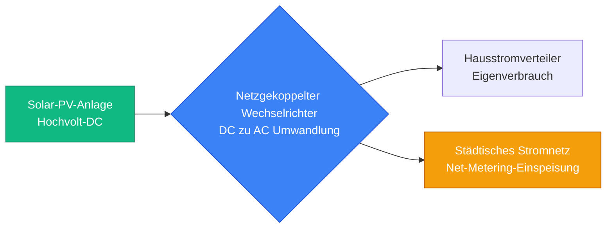
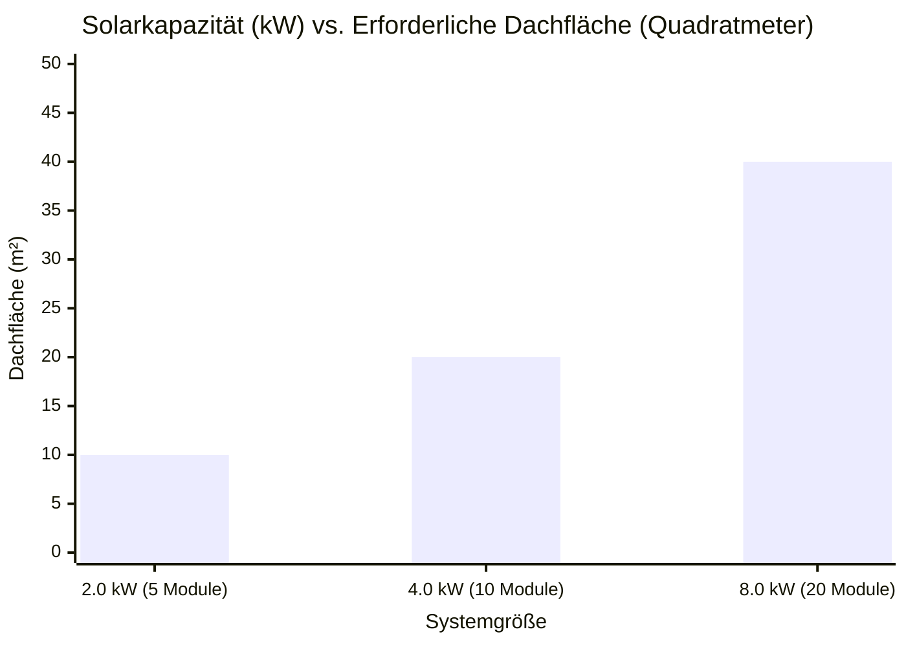
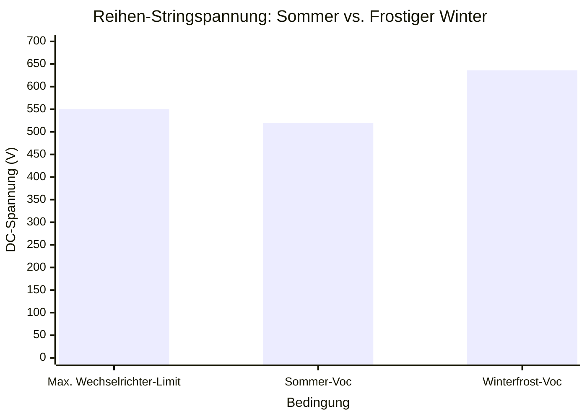
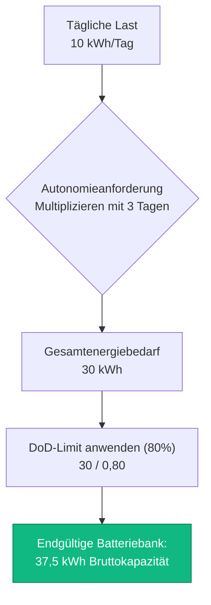
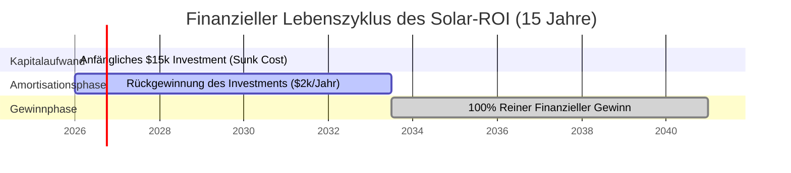

# Der ultimative Solarpanel-Rechner: Dimensionierung, MPPT-Verschaltung und finanzieller ROI

Willkommen zum ultimativen **Solarpanel-Rechner** und umfassenden Leitfaden zur Photovoltaik-Technik (PV). Ganz gleich, ob Sie als Hausbesitzer versuchen, eine enorme monatliche Stromrechnung zu eliminieren, als Erbauer einer netzunabhängigen Hütte eine unabhängige Energieinsel entwerfen oder als Facility Manager die 25-jährige finanzielle Rentabilität (ROI) einer 50.000-Dollar-Dachsolaranlage berechnen – die Beherrschung der Solarphysik ist absolut unerlässlich.

Ein Solarkraftwerk ist eine unglaublich komplexe Matrix interdependenter Variablen. Wenn Sie Ihren täglichen kWh-Bedarf falsch berechnen, kaufen Sie zu wenige Module und zahlen weiterhin an den Stromversorger. Wenn Sie die Physik der Leerlaufspannung (Voc) bei Frostwetter falsch verstehen, werden Sie zu viele Module in Reihe schalten und Ihren teuren MPPT-Wechselrichter dauerhaft zerstören. Wenn Sie das Konzept der Sonnenhöchststunden ignorieren, werden Sie Ihre Energieproduktion drastisch überschätzen.

In diesem ausführlichen, über 4.000 Wörter umfassenden SEO-Meisterkurs werden wir die grundlegende Mathematik der Solarenergieproduktion aufschlüsseln, die verborgenen Gefahren temperaturabhängiger Spannungsspitzen aufdecken, mathematisch beweisen, wie ein netzgekoppeltes Net-Metering-System (Nettomessung) die Amortisation beschleunigt, und die genauen Formeln entschlüsseln, die für die Dimensionierung einer Batteriebank für vollständige netzunabhängige Autonomie erforderlich sind. Um ein absolutes Verständnis zu gewährleisten, haben wir fünf sorgfältig detaillierte, parser-sichere interaktive Mermaid.js-Diagramme beigefügt.

---

## 1. Die Physik der Solardimensionierung (Sonnenhöchststunden & Effizienz)

Das absolut kritischste Konzept in der Solartechnik ist das Verständnis, dass ein 400-W-Solarmodul NICHT den ganzen Tag über 400 W Leistung erzeugt. 

Die Solarproduktion wird durch die **Sonnenhöchststunden (Peak Sun Hours, PSH)** bestimmt. 
- PSH bedeutet nicht "wie lange die Sonne am Himmel steht" (Tageslichtstunden).
- PSH ist eine technische Messgröße, die die gesamte an einem Tag empfangene Sonnenenergie quantifiziert, ausgedrückt als Stunden voller $1000\text{ W/m}^2$ Sonneneinstrahlung.
- In Arizona haben Sie vielleicht 6,5 Sonnenhöchststunden. In London haben Sie im Winter vielleicht 2,5 Sonnenhöchststunden.

**Die Produktionsgleichung:**
$$\text{Tägliche Energie (kWh)} = \text{Anlagengröße (kWp)} \times \text{Sonnenhöchststunden} \times \text{Systemeffizienz}$$

**Systemeffizienz (Derating-Faktor):**
Solarmodule arbeiten in der realen Welt nie mit $100\%$ Effizienz. Ein Standard-netzgekoppeltes System arbeitet mit etwa $80\%$ bis $85\%$ Effizienz aufgrund von:
- **Temperatur-Derating ($10\%$ Verlust):** Solarmodule verlieren an Leistung, wenn sie sich unter der Sonne erhitzen.
- **Wechselrichter-Umwandlung ($4\%$ Verlust):** Die Umwandlung von DC zu AC verschwendet Energie als Wärme.
- **Spannungsabfall in der Verkabelung ($2\%$ Verlust):** Kupferkabel widerstehen auf natürliche Weise dem Stromfluss.
- **Staub und Verschmutzung ($4\%$ Verlust):** Pollen und Schmutz blockieren das Sonnenlicht.

**Beispielrechnung:**
Wenn Sie eine Solaranlage mit $5\text{ kWp}$ an einem Ort mit $5,0$ Sonnenhöchststunden installieren und eine Effizienz von $80\%$ annehmen:
$5\text{ kW} \times 5,0\text{ Stunden} \times 0,80 = \mathbf{20\text{ kWh/Tag}}$ nutzbare elektrische AC-Energie.

---

## 2. Entmystifizierung der MPPT-Reihenschaltung (Voc vs Vmp)

Der häufigste Fehler von DIY-Solarinstallateuren besteht darin, ihren Solarladeregler zu zerstören, indem sie die maximale Eingangsspannung überschreiten.

Solarmodule haben zwei kritische Spannungswerte:
1. **Vmp (Voltage at Maximum Power / Spannung bei maximaler Leistung):** Die Betriebsspannung, wenn das Modul unter Last die volle Leistung erzeugt (z. B. $40\text{V}$).
2. **Voc (Open Circuit Voltage / Leerlaufspannung):** Die maximal mögliche Spannung, die das Modul erzeugt, wenn keine Last angeschlossen ist (z. B. $50\text{V}$).

Wenn Sie Solarmodule in **Reihe** verdrahten (Verbindung des Pluskabels eines Moduls mit dem Minuskabel des nächsten), **addiert sich die Spannung**, während der Strom (Ampere) gleich bleibt.
- $10$ Module in Reihe mit einer Voc von $50\text{V}$ = $\mathbf{500\text{V} \text{ DC}}$ Gesamtstringspannung.

**Die Frostwetter-Gefahr:**
Die Spannung von Solarmodulen verhält sich kontraintuitiv: Wenn die physikalische Temperatur der Siliziumzelle sinkt, STEIGT die Spannung. Wenn Ihr Wechselrichter eine maximale MPPT-Eingangsgrenze von $500\text{V}$ hat und Sie einen String entwerfen, der im Sommer genau $490\text{V}$ erzeugt, werden Sie Ihren Wechselrichter am ersten frostigen Wintermorgen zerstören, wenn das kalte Silizium die Voc auf $530\text{V}$ drückt. 

Ingenieure schreiben strikt die Verwendung des **Temperaturkoeffizienten der Voc** (z. B. $-0,3\%/^\circ\text{C}$) vor, um die absolute maximale Worst-Case-Spannung bei der historisch niedrigsten gemessenen Temperatur für den Installationsort zu berechnen.

---

## 3. Finanzieller ROI, Net Metering und Amortisationszeit

Für netzgekoppelte Hausbesitzer ist die Installation einer Solaranlage eine finanzielle Investition, die anhand ihrer **Amortisationszeit** und ihres **Return on Investment (ROI)** bewertet wird.

**Net Metering (NEM / Nettomessung):**
Net Metering ist eine Abrechnungsvereinbarung mit dem Versorgungsunternehmen, bei der sich Ihr Stromzähler physisch rückwärts dreht, wenn Ihre Solarmodule mehr Strom erzeugen, als Ihr Haus verbraucht. 
- Tagsüber erzeugen Sie überschüssigen Solarstrom und speisen ihn ins Netz ein, wofür Sie eine Gutschrift erhalten.
- Nachts, wenn die Sonne untergegangen ist, beziehen Sie Strom aus dem Netz und verbrauchen Ihre Gutschriften.
- Wenn Ihr System für einen $100\%$-igen Ausgleich dimensioniert ist, sinkt Ihre jährliche Stromrechnung theoretisch auf $0.

**Die einfache Amortisationsformel:**
$$\text{Amortisationszeit (Jahre)} = \frac{\text{Netto-Installationskosten des Systems}}{\text{Jährliche Stromkosteneinsparungen}}$$

Wenn ein $6\text{ kW}$-System nach Steuerrückvergütungen $\$15.000$ kostet und eine jährliche Stromrechnung von $\$2.000$ eliminiert, amortisiert sich das System in exakt $7,5\text{ Jahren}$. Da hochwertige Tier-1-Solarmodule eine Garantie von 25 Jahren haben, stellen die verbleibenden $17,5\text{ Jahre}$ reinen, unversteuerten finanziellen Gewinn dar.

---

## 4. Dimensionierung für netzunabhängige Batterieautonomie

Wenn Sie eine netzunabhängige Hütte bauen, haben Sie nicht den Luxus, das städtische Stromnetz als riesige unendliche Batterie zu nutzen. Sie müssen genügend Energie in Deep-Cycle-Batterien physisch speichern, um bewölkte Tage und dunkle Nächte zu überstehen.

**Die Autonomieformel:**
$$\text{Batteriebank (kWh)} = \frac{\text{Tägliche Last (kWh)} \times \text{Tage der Autonomie}}{\text{Entladetiefe (DoD)} \times \text{Wechselrichter-Effizienz}}$$

- **Tage der Autonomie:** Die Anzahl der aufeinanderfolgenden Tage, an denen die Batteriebank das Haus mit absolut null Solareinspeisung versorgen kann (meistens $2$ bis $3$ Tage).
- **Entladetiefe (Depth of Discharge, DoD):** Sie können eine Batterie niemals auf $0\%$ entladen. Blei-Säure-Batterien sollten nur bis zu $50\%$ DoD entladen werden. Lithium-Eisenphosphat-Batterien (LiFePO4) können sicher auf $80\%$ DoD entladen werden.

Wenn Ihre Hütte $10\text{ kWh/Tag}$ verbraucht und Sie $2\text{ Tage}$ Autonomie unter Verwendung einer Lithium-Batteriebank ($80\%$ DoD) und eines zu $90\%$ effizienten Wechselrichters wünschen:
$\text{Erforderliche Batteriekapazität} = (10 \times 2) / (0,80 \times 0,90) = \mathbf{27,7\text{ kWh}}$.
Sie benötigen eine massive $48\text{V} \ 600\text{Ah}$-Batteriebank, um den Winter zu überstehen.

---

## 5. Fünf konzeptionelle technische Szenarien mit 2D-Visualisierungen

Um die physikalischen Beziehungen, die Solar-PV-Systeme regeln, vollständig zu beherrschen, werden wir fünf verschiedene technische Szenarien untersuchen, die visuell mithilfe von benutzerdefinierten Mermaid.js-Diagrammen aufgeschlüsselt sind.

### Beispiel 1: Die netzgekoppelte Energie-Pipeline

**Das Szenario:**
Ein Hausbesitzer muss den physischen Energiefluss von der Sonne durch den Wechselrichter hinaus in das städtische Stromnetz verstehen.

**2D-Visualisierung:**
Dieses Logikflussdiagramm bildet den übergeordneten Energieumwandlungsprozess ab und zeigt, wie der Hybrid-Wechselrichter als intelligenter Verkehrspolizist agiert, der den Strom zuerst in das Haus und danach in das Netz leitet.

---

### Beispiel 2: Anlagengröße vs. Dachfläche

**Das Szenario:**
Ein Architekt teilt Dachfläche für eine Solaranlage zu und muss genau wissen, wie viel physische Fläche verbraucht wird, wenn die Kilowatt-Kapazität der Anlage skaliert wird.

**Die Mathematik:**
Ein modernes $400\text{W}$-Solarmodul misst etwa $2,0$ Quadratmeter. Um $4\text{ kW}$ zu erzeugen, benötigen Sie $10$ Module, wofür $20$ Quadratmeter unbeschattetes, nach Süden ausgerichtetes Dach erforderlich sind.

**2D-Visualisierung:**
Dieses Diagramm zeigt die direkte lineare Korrelation zwischen der gewünschten elektrischen Kapazität und dem erforderlichen physischen Platzangebot.

---

### Beispiel 3: Die Gefahr der MPPT-Spannungsüberlastung

**Das Szenario:**
Ein DIY-Installateur verdrahtet zwölf $50\text{V}$ (Voc) Solarmodule in Reihe. Der Wechselrichter hat ein striktes Limit für die maximale Eingangsspannung von $550\text{V}$. Im Sommer läuft die Anlage einwandfrei. Bei einem Frost von $-10^\circ\text{C}$ im Winter schnellt die Spannung in die Höhe und zerstört den Wechselrichter.

**Die Mathematik:**
Sommerspannung: $12 \times 46\text{V} = 552\text{V}$ (Bereits gefährlich nah).
Winterspannung mit $-0,3\%$ Temperaturkoeffizient: $12 \times 53\text{V} = 636\text{V}$ (Katastrophaler Ausfall).

**2D-Visualisierung:**
Dieses Diagramm beweist grafisch die Notwendigkeit, Solar-Strings für die kälteste historisch mögliche Temperatur zu dimensionieren.

---

### Beispiel 4: Architektur der netzunabhängigen Batteriedimensionierung

**Das Szenario:**
Ein Solaringenieur berechnet die erforderliche Batteriebankkapazität, um eine netzunabhängige medizinische Klinik während eines Monsuns 3 Tage lang autark am Laufen zu halten.

**2D-Visualisierung:**
Dieses Top-Down-Flussdiagramm bildet die strikte Mathematik ab, die erforderlich ist, um die tägliche Last zu bewerten, mit den Autonomietagen zu multiplizieren und durch das Entladetiefen-Limit (DoD) zu dividieren, um die endgültige Batteriegröße zu erhalten.

---

### Beispiel 5: Der finanzielle ROI und die Amortisationszeitlinie

**Das Szenario:**
Ein Hausbesitzer zahlt $\$15.000$ in bar für ein Solarsystem, das jährlich $\$2.000$ an Stromkosten einspart. Er möchte den genauen Moment visualisieren, ab dem das System über einen Zeitraum von 15 Jahren reiner Gewinn wird.

**2D-Visualisierung:**
Dieses Gantt-Diagramm visualisiert den finanziellen Lebenszyklus einer Solaranlage und stellt den Break-Even-Punkt nach 7,5 Jahren und die darauffolgenden Jahrzehnte unversteuerter Einsparungen bei den Nebenkosten dar.

---

## 7. Fazit und technische Herausforderung

Die Beherrschung der Dimensionierung von Solarmodulen ist das fundamentale Grundgerüst jeglicher Ingenieurskunst im Bereich der erneuerbaren Energien. Das Verständnis des Unterschieds zwischen Tageslichtstunden und Sonnenhöchststunden, die Beachtung der brutalen Realität kältebedingter Spannungsspitzen und die mathematische Modellierung des finanziellen ROI garantieren, dass Ihr Solarsystem in den nächsten 25 Jahren exakt wie geplant funktioniert.

Wenn Sie diese mathematischen Prinzipien ignorieren, wird Ihre Anlage im Winter massiv unterproduzieren, Ihre in Reihe geschalteten Strings werden die Spannungsgrenzen des Wechselrichters überschreiten und Ihre Garantie aufheben, und Ihrer netzunabhängigen Hütte wird jeden Abend um 20:00 Uhr der Batteriestrom ausgehen.

Um sicherzustellen, dass Sie diese kritischen Konzepte beherrschen, starten Sie unseren interaktiven Simulator und versuchen Sie, diese letzten Herausforderungen zu lösen:
1. **Die Flächenbeschränkung:** Sie haben exakt $30\text{ m}^2$ unbeschattete Dachfläche. Angenommen, Sie verwenden $400\text{W}$-Module, die jeweils $2,0\text{ m}^2$ messen, was ist die absolute maximale kWp-Kapazität, die Sie physisch installieren können?
2. **Die Spannungsfalle:** Sie schalten $40\text{V}$ (Voc) Module in Reihe an einen Laderegler mit einem absoluten maximalen Limit von $250\text{V}$. Unter Annahme eines Kaltwetter-Multiplikators von $1,15\times$, was ist die absolute maximale Anzahl von Modulen, die Sie sicher in einem einzigen String verdrahten können?
3. **Die Amortisationsberechnung:** Ihr System kostet $\$24.000$. Es produziert $10.000\text{ kWh/Jahr}$. Ihr Stromversorger berechnet $\$0,30\text{ pro kWh}$. Wie viele Jahre dauert es genau, bis sich das System amortisiert hat?

Verlassen Sie sich auf diesen Rechner, um die Angebote Ihres Installateurs zu prüfen, Batterie-Upgrades mathematisch zu rechtfertigen und Ihre Stromrechnung dauerhaft zu eliminieren.
