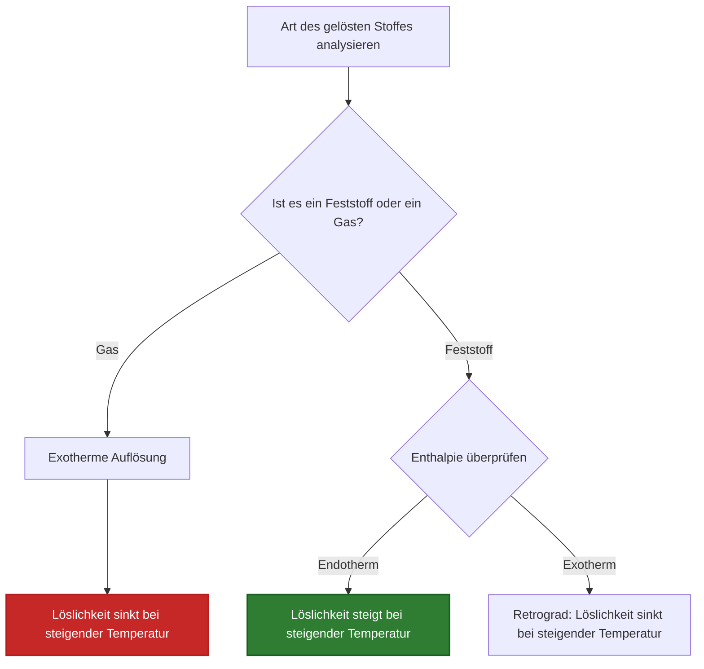

# Leitfaden für Labor- und analytische Chemie zum Löslichkeitsgleichgewicht

In der analytischen, Umwelt-, physikalischen und pharmazeutischen Chemie quantifiziert die **Löslichkeit** die maximale Gleichgewichtskonzentration eines gelösten Stoffes in einem Lösungsmittel bei einer bestimmten Temperatur und einem bestimmten Druck:

$$\text{Massenlöslichkeit } S_{\text{mass}} \, (\text{g/L}) = S_{\text{molar}} \, (\text{mol/L}) \times M \, (\text{g/mol})$$

$$S_{\text{g/100 mL}} = \frac{S_{\text{g/L}}}{10}$$

$$\text{Maximal gelöste Masse } m_{\text{max}} = S_{\text{mass}} \, (\text{g/L}) \times V \, (\text{L})$$

$$\text{Sättigungsverhältnis } R_{\text{sat}} = \frac{C_{\text{current}}}{S_{\text{max}}} \quad \begin{cases} R_{\text{sat}} < 1 & \implies \text{Ungesättigt (Löst sich vollständig)} \\ R_{\text{sat}} = 1 & \implies \text{Gesättigt (Gleichgewicht)} \\ R_{\text{sat}} > 1 & \implies \text{Übersättigt (Ausfällung begünstigt)} \end{cases}$$

---

## 1. Referenzmatrix der klassischen chemischen Verbindungs-Löslichkeit

| Verbindung | Formel | Molmasse | $20^\circ\text{C}$ Massenlöslichkeit | $20^\circ\text{C}$ Molare Löslichkeit | Typ |
| :--- | :--- | :--- | :--- | :--- | :--- |
| **Kaliumnitrat** | $\text{KNO}_3$ | **101.10 g/mol** | **$316 \text{ g/L}$ ($31.6 \text{ g/100 mL}$)** | **$3.125 \text{ mol/L}$** | Endothermer Feststoff |
| **Natriumchlorid** | $\text{NaCl}$ | **58.44 g/mol** | **$360 \text{ g/L}$ ($36.0 \text{ g/100 mL}$)** | **$6.160 \text{ mol/L}$** | Flacher Feststoff |
| **Silberchlorid** | $\text{AgCl}$ | **143.32 g/mol** | **$0.00191 \text{ g/L}$** | **$1.33 \cdot 10^{-5} \text{ mol/L}$** | Schwerlöslich ($K_{sp}$) |
| **Calciumfluorid** | $\text{CaF}_2$ | **78.07 g/mol** | **$0.0160 \text{ g/L}$** | **$2.05 \cdot 10^{-4} \text{ mol/L}$** | Schwerlöslich ($K_{sp}$) |
| **Cer(III)-sulfat**| $\text{Ce}_2(\text{SO}_4)_3$| **568.42 g/mol** | **$101 \text{ g/L}$** | **$0.178 \text{ mol/L}$** | Retrograder Feststoff |
| **Sauerstoffgas** | $\text{O}_2$ | **32.00 g/mol** | **$0.0091 \text{ g/L}$ ($9.1 \text{ mg/L}$)** | **$2.84 \cdot 10^{-4} \text{ mol/L}$** | Gas (Henry-Gesetz) |

---

## 2. Standardprotokolle zur Löslichkeitsberechnung

```
1. g/L in mol/L umrechnen: S_molar = S_mass / Molmasse
2. mol/L in g/L umrechnen: S_mass = S_molar * Molmasse
3. g/100 mL in g/L umrechnen: g/L = (g/100 mL) * 10
4. Maximal gelöste Masse: m_max = S_mass * Lösungsmittelvolumen (L)
5. Sättigungsverhältnis: R = AktuelleKonz / MaxLöslichkeit (R > 1 -> Übersättigt)
```

---

## 3. Haftungsausschluss für Bildung & Laborsicherheit
*Dieser Löslichkeitsrechner bietet theoretische Gleichgewichtsberechnungen für Bildungszwecke, Laborforschung und AP-Chemie-Anwendungen. Die experimentelle Löslichkeit hängt von Temperatur, Druck bei Gasen, pH-Wert, Ionenstärke und der Zusammensetzung des Lösungsmittels ab.*

## 4. Der vollständige Leitfaden zur chemischen Löslichkeit

Willkommen zum ultimativen Handbuch zur **chemischen Löslichkeit**. Egal, ob Sie versuchen, eine riesige Menge Kaliumnitrat ($\text{KNO}_3$) für eine Pyrotechnik-Demonstration aufzulösen, die toxische Grenze von Schwermetallabflüssen im Grundwasser zu berechnen oder den gelösten Sauerstoff in einem beheizten Aquarium aufrechtzuerhalten, die Löslichkeit bestimmt die absoluten Grenzen der physikalischen Chemie.

In diesem ausführlichen Leitfaden mit über 4000 Wörtern werden wir die Thermodynamik erklären, warum sich Dinge auflösen. Wir werden den entscheidenden mathematischen Unterschied zwischen Massenlöslichkeit (wie viele Gramm passen in ein Becherglas) und Molarer Löslichkeit (die genaue Molarität einer gesättigten Lösung) erläutern. Darüber hinaus werden wir fünf strenge chemische Ableitungen aus der Praxis durchgehen, komplett mit schrittweiser Algebra und hochkonformen visuellen Mermaid-Diagrammen.

### 4.1 Was ist Löslichkeit eigentlich?

**Löslichkeit** ist die maximale theoretische Menge eines bestimmten gelösten Stoffes, die sich bei einer bestimmten Temperatur in einem bestimmten Lösungsmittel auflösen kann. 

Wenn Sie Kochsalz ($\text{NaCl}$) in Wasser gießen, greifen die polaren Wassermoleküle sofort das Kristallgitter an und reißen $\text{Na}^+$- und $\text{Cl}^-$-Ionen heraus. Je mehr Ionen in das Wasser gelangen, desto häufiger kollidieren sie unweigerlich und kristallisieren wieder. 

Die Löslichkeit ist erreicht, wenn das System ein **dynamisches Gleichgewicht** erreicht. Die genaue Auflösungsrate entspricht perfekt der Rekristallisationsrate. An diesem Punkt gilt die Lösung als **gesättigt**. Wenn Sie mehr Salz hineinschütten, fällt es einfach auf den Boden des Becherglases; das Wasser kann physikalisch nicht mehr gelöste Ionen aufnehmen.

### 4.2 Massenlöslichkeit vs. Molare Löslichkeit

Da die Chemie eine Brücke schlägt zwischen der makroskopischen physikalischen Welt (Dinge, die wir wiegen können) und der mikroskopischen atomaren Welt (Moleküle), verwenden wir zwei unterschiedliche Einheiten für die Löslichkeit:

*   **Massenlöslichkeit ($S_{\text{mass}}$):** Ausgedrückt in Gramm pro Liter ($\text{g/L}$) oder Gramm pro 100 Milliliter ($\text{g/100 mL}$). Dies ist das, was Sie verwenden, wenn Sie Pulver physikalisch auf einer Laborwaage abwiegen.
*   **Molare Löslichkeit ($S_{\text{molar}}$):** Ausgedrückt in Mol pro Liter ($\text{mol/L}$ oder Molarität, M). Dies ist das, was Sie verwenden, wenn Sie Reaktionsstöchiometrie durchführen oder thermodynamische Gleichgewichtskonstanten wie $K_{sp}$ berechnen.

Sie müssen sie mithilfe der Molmasse der Verbindung ($M$ in $\text{g/mol}$) sofort ineinander umwandeln können:

$$ S_{\text{molar}} = \frac{S_{\text{mass}}}{M} \quad \text{und} \quad S_{\text{mass}} = S_{\text{molar}} \times M $$

### 4.3 Die drei Zustände der Sättigung

Indem wir die *aktuelle* Konzentration einer Lösung mit ihrer *maximale theoretische Löslichkeit* vergleichen, können wir drei unterschiedliche physikalische Zustände definieren:

1.  **Ungesättigt ($R_{\text{sat}} < 1$):** Die aktuelle Konzentration liegt unter der maximalen Löslichkeit. Wenn Sie mehr Feststoff hinzufügen, wird er sich schnell auflösen.
2.  **Gesättigt ($R_{\text{sat}} = 1$):** Die Lösung enthält genau die maximale Menge, die von der Thermodynamik zugelassen wird. Jeder zusätzlich hinzugefügte Feststoff bleibt ungelöst.
3.  **Übersättigt ($R_{\text{sat}} > 1$):** Ein höchst instabiler, vorübergehender Zustand, in dem die Lösung *mehr* gelösten Stoff enthält, als physikalisch möglich sein sollte. Dies wird erreicht, indem man bei Siedetemperaturen eine riesige Menge gelösten Stoffes auflöst und die Flüssigkeit dann extrem langsam ohne Bewegung abkühlt. Ein Klopfen gegen das Glas oder das Hineinfallen eines einzigen "Impfkristalls" führt dazu, dass der überschüssige gelöste Stoff heftig und augenblicklich aus der Lösung kristallisiert.

### 4.4 Die Thermodynamik von Temperatur und Löslichkeit

Wie beeinflusst eine Änderung der Wassertemperatur die Löslichkeit? Es hängt vollständig von der Enthalpie ($\Delta H$) des Auflösungsprozesses ab.

*   **Endotherme Feststoffe (Die meisten Salze):** Das Aufbrechen des Kristallgitters erfordert mehr Energie, als freigesetzt wird, wenn Wasser die Ionen hydratisiert. Das Auflösen absorbiert Wärme. Nach dem Prinzip von Le Chatelier pumpt eine Temperaturerhöhung Wärme in das System und treibt das Gleichgewicht stark nach vorne. Somit **steigt die Löslichkeit mit zunehmender Temperatur** (z.B. $\text{KNO}_3$ oder Zucker).
*   **Exotherme Gase:** Gasmoleküle sind bereits frei. Das Auflösen eines Gases in Wasser erfordert das Einschließen in einen flüssigen Käfig, wodurch Wärme freigesetzt wird ($\Delta H < 0$). Eine Temperaturerhöhung treibt das Gleichgewicht rückwärts, wodurch das Gas aus dem Wasser kocht. Somit **sinkt die Gaslöslichkeit mit zunehmender Temperatur** (weshalb warme Limonade schnell schal wird).

---

## 5. Bedienungsanleitung: Den Löslichkeitsrechner beherrschen

Unser Rechner fungiert als universelle Umrechnungs- und Vorhersagemaschine.

### 5.1 Modus: Massen-/Molar-Umrechnungen

1.  **Modus auswählen:** Wählen Sie "Massen- in molare Löslichkeit umrechnen".
2.  **Parameter eingeben:** Geben Sie die Massenlöslichkeit in $\text{g/L}$ und die Molmasse der Verbindung ein.
3.  **Ausgabe ablesen:** Das Tool gibt sofort die molare Löslichkeit ($\text{mol/L}$) aus und macht sie so bereit für stöchiometrische Berechnungen.

### 5.2 Modus: Maximal gelöste Masse

1.  **Modus auswählen:** Wählen Sie "Maximal gelöste Masse".
2.  **Parameter eingeben:** Geben Sie die bekannte Löslichkeit ($\text{g/L}$) und das physikalische Volumen Ihres Lösungsmittelbehälters ein (z.B. $2.5\text{ Liter}$).
3.  **Ausführen:** Das Tool berechnet $m = S \times V$ und teilt Ihnen explizit mit, wie viele Gramm Pulver Sie genau hineingießen können, bevor es aufhört, sich aufzulösen.

### 5.3 Modus: Sättigungsanalysator

1.  **Modus auswählen:** Wählen Sie "Sättigungsverhältnis-Analysator".
2.  **Parameter eingeben:** Geben Sie die absolute maximale Löslichkeit der Verbindung und die aktuelle Konzentration Ihrer Laborlösung ein.
3.  **Ausführen:** Das Tool berechnet das Sättigungsverhältnis $R$ und deklariert explizit den thermodynamischen Zustand (ungesättigt, gesättigt oder übersättigt).

---

## 6. Fünf praxisnahe Beispiele aus der analytischen Chemie

Lassen Sie uns diese Theorie festigen, indem wir fünf rigorose, praktische Löslichkeitsszenarien lösen.

### Beispiel 1: Umrechnung von Massen- in Molare Löslichkeit ($\text{KNO}_3$)

**Szenario:** 
Kaliumnitrat ($\text{KNO}_3$, Molmasse $101.10\text{ g/mol}$) ist in Wasser unglaublich gut löslich. Bei $20^\circ\text{C}$ beträgt seine Massenlöslichkeit erstaunliche $316\text{ g/L}$. Wie hoch ist die genaue Molarität einer gesättigten $\text{KNO}_3$-Lösung?

**Mathematische Ableitung:**

1.  **Bekannte Größen identifizieren:**
    $S_{\text{mass}} = 316\text{ g/L}$
    $M = 101.10\text{ g/mol}$
2.  **Umrechnungsformel anwenden:**
    $$ S_{\text{molar}} = \frac{S_{\text{mass}}}{M} $$
3.  **Berechnen:**
    $$ S_{\text{molar}} = \frac{316\text{ g/L}}{101.10\text{ g/mol}} $$
    $$ S_{\text{molar}} = 3.125\text{ mol/L} $$

**Fazit:** Eine gesättigte Lösung von Kaliumnitrat bei Raumtemperatur hat eine Molarität von $3.125\text{ M}$.

### Beispiel 2: Bestimmung der maximal gelösten Masse ($\text{NaCl}$)

**Szenario:**
Sie bereiten eine Solelösung in einem großen $5.00\text{ Liter}$-Eimer vor. Die Löslichkeit von Natriumchlorid ($\text{NaCl}$) beträgt $360\text{ g/L}$ bei Raumtemperatur. Was ist die absolute maximale Masse an Salz, die Sie im Eimer auflösen können, bevor es sich am Boden ansammelt?

**Mathematische Ableitung:**

1.  **Bekannte Größen identifizieren:**
    $S_{\text{mass}} = 360\text{ g/L}$
    $V = 5.00\text{ L}$
2.  **Massengleichung aufstellen:**
    $$ m_{\text{max}} = S_{\text{mass}} \times V $$
3.  **Berechnen:**
    $$ m_{\text{max}} = 360\text{ g/L} \times 5.00\text{ L} $$
    $$ m_{\text{max}} = 1800\text{ g} $$
    $$ m_{\text{max}} = 1.80\text{ kg} $$

**Fazit:** Sie können genau $1.80\text{ kg}$ Salz im $5\text{-Liter}$-Eimer auflösen. Alles darüber hinaus bleibt ungelöster Feststoff.

### Beispiel 3: Analyse der Übersättigung ($R_{\text{sat}}$)

**Szenario:**
Natriumacetat ($\text{NaCH}_3\text{COO}$) wird in wiederverwendbaren Handwärmern verwendet. Seine Gleichgewichtslöslichkeit bei $20^\circ\text{C}$ beträgt $464\text{ g/L}$. Durch kochendes Wasser gelingt es Ihnen, $800\text{ g}$ davon in $1\text{ Liter}$ Wasser aufzulösen und es dann vorsichtig auf $20^\circ\text{C}$ abzukühlen, ohne dass es kristallisiert. Berechnen Sie das Sättigungsverhältnis.

**Mathematische Ableitung:**

1.  **Bekannte Größen identifizieren:**
    $C_{\text{current}} = 800\text{ g/L}$
    $S_{\text{max}} = 464\text{ g/L}$
2.  **Formel für das Sättigungsverhältnis anwenden:**
    $$ R_{\text{sat}} = \frac{C_{\text{current}}}{S_{\text{max}}} $$
3.  **Berechnen:**
    $$ R_{\text{sat}} = \frac{800}{464} = 1.72 $$
4.  **Auswerten:**
    Da $R_{\text{sat}} > 1$, ist die Lösung massiv **übersättigt**.

**Fazit:** Die Lösung enthält das 1,72-fache der maximal zulässigen Menge an gelöstem Stoff. In dem Moment, in dem Sie die Metallscheibe im Handwärmer knicken, werden $336\text{ g}$ Feststoff augenblicklich kristallisieren und eine massive Welle exothermer Wärme freisetzen.

**Visualisierung: Die Thermodynamik der Übersättigung**

```mermaid
gantt
    title Der Zeitplan für Übersättigung und Kristallisation
    dateFormat  HH:mm:ss
    axisFormat  %H:%M
    section Aufheizphase
    Überschüssigen gelösten Stoff bei 100C auflösen :00:00:00, 00:20:00
    section Abkühlphase
    Vorsichtiges Abkühlen auf 20C :00:20:00, 00:40:00
    Metastabiler übersättigter Zustand :crit, 00:40:00, 01:00:00
    section Auslöser-Ereignis
    Impfkristall hineingeworfen :01:00:00, 01:01:00
    Heftige exotherme Kristallisation :active, 01:01:00, 01:05:00
```


*Dieser Zeitplan veranschaulicht die prekäre Natur der Übersättigung. Eine Lösung kann stundenlang in einem metastabilen Zustand gefangen bleiben, bis ein physikalischer Auslöser eine schnelle, heftige Kristallisation erzwingt.*

### Beispiel 4: Gaslöslichkeit und das Henry-Gesetz

**Szenario:**
Wasserlebewesen sind auf gelösten Sauerstoff ($\text{O}_2$) angewiesen. Bei $20^\circ\text{C}$ beträgt die Löslichkeit von $\text{O}_2$ in Süßwasser etwa $9.1\text{ mg/L}$. Wandeln Sie diese kritische Umweltkennzahl in die molare Löslichkeit um. (Molmasse von $\text{O}_2$ = $32.00\text{ g/mol}$).

**Mathematische Ableitung:**

1.  **mg in Gramm umrechnen:**
    $9.1\text{ mg/L} = 0.0091\text{ g/L}$
2.  **Formel zur molaren Umrechnung anwenden:**
    $$ S_{\text{molar}} = \frac{0.0091\text{ g/L}}{32.00\text{ g/mol}} $$
3.  **Berechnen:**
    $$ S_{\text{molar}} = 0.000284\text{ mol/L} $$
    $$ S_{\text{molar}} = 2.84 \times 10^{-4}\text{ M} $$

**Fazit:** Die Molarität des gelösten Sauerstoffs in einem gesunden Fluss ist unglaublich gering, nur $2.84 \times 10^{-4}\text{ M}$. Erwärmt sich der Fluss durch thermische Verschmutzung, verschiebt sich dieses exotherme Löslichkeitsgleichgewicht rückwärts, treibt das $\text{O}_2$ aus dem Wasser und lässt die Fische ersticken.

### Beispiel 5: Retrograde Löslichkeit (Die Ausnahme)

**Szenario:**
Cer(III)-sulfat ($\text{Ce}_2(\text{SO}_4)_3$) ist einer der seltenen Feststoffe, die *retrograde Löslichkeit* aufweisen. Seine Auflösung ist stark exotherm. Bei $0^\circ\text{C}$ beträgt seine Löslichkeit $101\text{ g/L}$. Erhitzt man das Wasser auf $100^\circ\text{C}$, sinkt die Löslichkeit auf $25\text{ g/L}$. Was passiert, wenn Sie eine gesättigte 1-Liter-Lösung bei $0^\circ\text{C}$ haben und diese kochen?

**Mathematische Ableitung:**

1.  **Anfangsmasse bestimmen:**
    Bei $0^\circ\text{C}$ enthält das Becherglas genau $101\text{ g}$ gelöstes Cersulfat.
2.  **Endkapazität bestimmen:**
    Bei $100^\circ\text{C}$ kann das Wasser physikalisch nur $25\text{ g}$ des gelösten Stoffes halten.
3.  **Ausfällung berechnen:**
    $$ \text{Ausgefällte Masse} = \text{Anfangsmasse} - \text{Endkapazität} $$
    $$ \text{Ausgefällte Masse} = 101\text{ g} - 25\text{ g} = 76\text{ g} $$

**Fazit:** Im Gegensatz zu Zucker oder Salz, die sich in heißem Wasser besser auflösen, führt das Kochen einer Lösung von Cersulfat dazu, dass $76\text{ g}$ festes Gestein plötzlich aus der klaren Flüssigkeit ausfallen. 

**Visualisierung: Vorhersage von Temperaturtrends**


*Dieses Flussdiagramm ermöglicht es Ihnen, sofort vorherzusagen, wie sich die Temperatur auf die Löslichkeitsgrenze eines beliebigen chemischen Stoffes auswirkt.*

---

## 7. Deep-Dive FAQ und erweiterte Fehlerbehebung

**F: Kann man zwei verschiedene Salze im selben Becherglas auflösen?**
**A:** Ja, aber sie können interagieren. Wenn Sie $\text{NaCl}$ und $\text{KNO}_3$ auflösen, verhalten sie sich bis zu einem gewissen Punkt weitgehend unabhängig voneinander. Wenn sie jedoch ein gemeinsames Ion aufweisen (z.B. das Auflösen von $\text{NaCl}$ und $\text{KCl}$), steigt die Gesamtchloridkonzentration stark an, was die Löslichkeit beider Salze im Vergleich zu reinem Wasser aufgrund des gleichionigen Effekts erheblich verringert.

**F: Warum löst Rühren Zucker schneller auf, erhöht aber nicht seine maximale Löslichkeit?**
**A:** Rühren ist ein *kinetischer* Prozess. Es bewegt neu gelöste Ionen schnell von der Kristalloberfläche weg und legt frischen Feststoff gegenüber sauberem Wasser frei, was die Auflösungsgeschwindigkeit erhöht. Es ändert jedoch nichts am *thermodynamischen* Gleichgewichtspunkt. Sie erreichen genau dasselbe maximale $g/L$-Limit, Sie erreichen es nur viel schneller.

**F: Hat der Druck Einfluss auf die Löslichkeit?**
**A:** Bei Feststoffen und Flüssigkeiten hat der Druck praktisch keine Auswirkungen. Bei Gasen (wie $\text{CO}_2$ in einer Getränkedose) ist der Druck jedoch die dominierende Variable. Gemäß dem Henry-Gesetz ($C = kP$) erhöht die Erhöhung des Drucks des Gases direkt über der Flüssigkeit proportional die Löslichkeit des Gases in der Flüssigkeit.

Indem Sie die mathematische Umrechnung zwischen Massen- und molaren Einheiten beherrschen, die tiefgreifenden Auswirkungen der Temperatur auf die endotherme im Vergleich zur exothermen Auflösung verstehen und die Sättigungsverhältnisse korrekt berechnen, besitzen Sie die theoretische Fähigkeit, chemische Phasenübergänge zu steuern. Ob Sie pharmazeutische Kristalle isolieren oder aquatische Ökosysteme konstruieren, verlassen Sie sich auf diesen Löslichkeitsrechner für sofortige, analytische Präzision!
