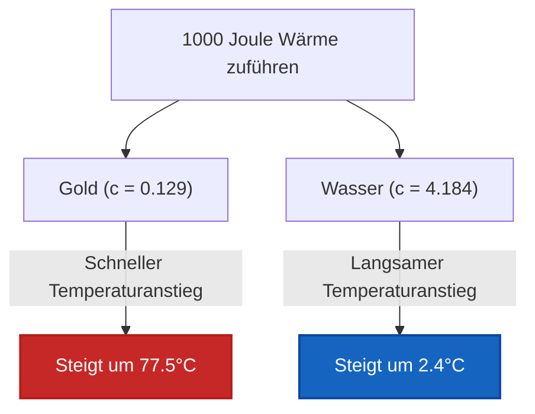

# Der vollständige Leitfaden für das Labor & die Industrie zur spezifischen Wärmekapazität und zu thermischen Materialeigenschaften

In der physikalischen Chemie, den Materialwissenschaften und der chemischen Verfahrenstechnik definiert die **spezifische Wärmekapazität ($c$)** die intrinsische Fähigkeit von Materie zur thermischen Energiespeicherung:

$$c = \frac{q}{m \cdot \Delta T} \quad \left(\text{Formel für die spezifische Wärmekapazität}\right)$$

$$q = m \cdot c \cdot \left(T_{\text{end}} - T_{\text{anfang}}\right) \quad \left(\text{Übertragung fühlbarer Wärme}\right)$$

$$C = m \cdot c \quad \left(\text{Extensive Wärmekapazität}\right)$$

$$\Delta T = \frac{q}{m \cdot c} \quad \left(\text{Temperaturanstieg}\right)$$

---

## 1. Referenzwerte der spezifischen Wärmekapazitäten gängiger Materialien

| Material | Physikalischer Zustand | Spezifische Wärmekapazität $c$ ($\text{J/g}\cdot^\circ\text{C}$) | Spezifische Wärmekapazität $c$ ($\text{J/kg}\cdot\text{K}$) |
| :--- | :--- | :--- | :--- |
| **Wasser (flüssig)** | **Flüssig** | **4.184** | **4184** |
| **Ethanol** | **Flüssig** | **2.440** | **2440** |
| **Eis (fest)** | **Fest** | **2.090** | **2090** |
| **Dampf (gasförmig)** | **Gasförmig** | **2.010** | **2010** |
| **Aluminium** | **Festes Metall** | **0.897** | **897** |
| **Glas** | **Festes Nichtmetall** | **0.840** | **840** |
| **Eisen / Stahl** | **Festes Metall** | **0.449** | **449** |
| **Kupfer** | **Festes Metall** | **0.385** | **385** |
| **Silber** | **Festes Metall** | **0.235** | **235** |
| **Gold** | **Festes Metall** | **0.129** | **129** |
| **Blei** | **Festes Metall** | **0.128** | **128** |

---

## 2. Variablen-Löser & Matrix der Materialidentifikations-Engine

```
1. Spezifische Wärme berechnen: c = q / (m * (T_end - T_anfang))
2. Übertragene Wärme berechnen: q = m * c * ΔT
3. Probenmasse berechnen: m = q / (c * ΔT)
4. Temperaturänderung berechnen: ΔT = q / (m * c)
5. Endtemperatur berechnen: T_end = T_anfang + q / (m * c)
6. Gesamtwärmekapazität berechnen: C = m * c
7. Identifikation unbekannter Materialien: Finde min |c_calc - c_ref| in der Datenbank
```

---

*Dieser Rechner für die spezifische Wärme liefert theoretische Vorhersagen zu thermischen Eigenschaften für Anwendungen in Bildung, physikalischer chemischer Forschung und Werkstofftechnik. Bei realen thermischen Messungen sollten die temperaturabhängige spezifische Wärme $c(T)$, Phasenübergänge sowie die Wärmekapazität der Kalorimeter-Hardware berücksichtigt werden.*

## 4. Der vollständige Leitfaden zur spezifischen Wärmekapazität und Materialthermodynamik

Willkommen beim definitiven Handbuch für Materialwissenschaften und physikalische Chemie zur **spezifischen Wärmekapazität ($c$)**. Warum verbrennt eine Sitzgurtschnalle aus Metall an einem heißen Sommertag Ihre Haut, während sich der Stoffgurt daneben völlig normal anfühlt, obwohl beide stundenlang in der exakt gleichen Sonne lagen? Die Antwort ist die spezifische Wärmekapazität.

In diesem umfassenden Leitfaden mit über 4000 Wörtern werden wir die mikroskopische Physik der Speicherung thermischer Energie analysieren, insbesondere untersuchen, warum durch Wasserstoffbrückenbindungen gebundenes flüssiges Wasser eine fast ungewöhnlich hohe Kapazität besitzt, Wärme zu absorbieren, im Vergleich zu Übergangsmetallen wie Eisen und Gold. Wir werden die algebraische Umformung der Formel für die fühlbare Wärme ($q = mc\Delta T$) beherrschen, um unbekannte Variablen zu isolieren, unbekannte Materialien in forensischen Labors zu identifizieren und fünf anspruchsvolle thermodynamische Ingenieur-Szenarien aus der Praxis zu lösen.

### 4.1 Die Physik der spezifischen Wärmekapazität

Die **spezifische Wärmekapazität ($c$)** ist eine *intensive* physikalische Eigenschaft. Sie ist definiert als die exakte Menge an thermischer kinetischer Energie (gemessen in Joule), die erforderlich ist, um die Temperatur von exakt $1\text{ Gramm}$ eines bestimmten Materials um exakt $1^\circ\text{C}$ (oder $1\text{ Kelvin}$) zu erhöhen.

*   **Niedrige spezifische Wärme (Metalle):** Metalle wie Gold ($0.129\text{ J/g}^\circ\text{C}$) und Kupfer ($0.385\text{ J/g}^\circ\text{C}$) haben sehr geringe Kapazitäten. Sie können nicht viel Wärme "speichern". Wenn man auch nur eine winzige Menge Wärme ($q$) in sie pumpt, beginnen ihre Atome sofort wild zu vibrieren, was zu einem massiven Anstieg der Temperatur ($\Delta T$) führt.
*   **Hohe spezifische Wärme (Wasser):** Flüssiges Wasser ($4.184\text{ J/g}^\circ\text{C}$) hat eine der höchsten spezifischen Wärmekapazitäten in der Natur. Bevor Wassermoleküle schneller vibrieren können (was als Temperaturanstieg registriert wird), muss die einströmende Wärmeenergie zunächst das riesige Netzwerk intermolekularer **Wasserstoffbrückenbindungen** dehnen und belasten, das die Flüssigkeit zusammenhält. Diese massive Energiesenke ermöglicht es Wasser, enorme Mengen an Wärme bei kaum einer Temperaturänderung zu absorbieren und fungiert so als globaler Klimaregulator der Erde.

### 4.2 Intensiv ($c$) vs Extensiv ($C$)

Es ist entscheidend, die spezifische Wärmekapazität ($c$) nicht mit der Gesamtwärmekapazität ($C$) zu verwechseln:
*   **Intensiv ($c$):** Die spezifische Wärme ($c = \text{J/g}^\circ\text{C}$) hängt NUR von der Materialidentität ab. Ein einziger Wassertropfen und ein massiver Ozean haben beide dieselbe spezifische Wärme: $4.184\text{ J/g}^\circ\text{C}$.
*   **Extensiv ($C$):** Die Gesamtwärmekapazität ($C = m \cdot c$) hängt von der vorhandenen physikalischen Masse ab. Ein massiver Ozean hat eine unvorstellbar größere Gesamtwärmekapazität ($C$) als ein Wassertropfen.

### 4.3 Identifikation unbekannter Materialien

Da die spezifische Wärme ($c$) eine intensive Eigenschaft ist, die einzigartig für die Molekularstruktur eines Stoffes ist, fungiert sie wie ein thermischer Fingerabdruck.
Indem forensische Wissenschaftler ein erhitztes unbekanntes Metall in ein Kalorimeter fallen lassen, die übertragene Wärme ($q$) messen, die Masse ($m$) wiegen und den Temperaturabfall ($\Delta T$) verfolgen, können sie $c$ isolieren:
$$ c = \frac{q}{m\Delta T} $$
Indem man dieses berechnete $c$ mit einer Referenzdatenbank abgleicht, kann das unbekannte Metall mit hoher Präzision identifiziert werden!

---

## 5. Benutzerhandbuch: Beherrschung des Rechners für die spezifische Wärme

Unser Rechner fungiert als universeller algebraischer Löser für Wärmeübertragung für physikalisch-chemische Labore.

### 5.1 Modus: Identifikation unbekannter Materialien

1.  **Ziel auswählen:** Wählen Sie "Spezifische Wärmekapazität ($c$) berechnen & Material identifizieren".
2.  **Labordaten eingeben:** Geben Sie die experimentelle übertragene Wärme ($q$), die Masse der unbekannten Probe ($m$) und die gemessene Temperaturänderung ($\Delta T$) ein.
3.  **Ausführen:** Die Engine isoliert mathematisch $c$. Sie durchsucht dann die interne thermodynamische Referenzdatenbank, um das am besten übereinstimmende Material zu finden (z. B. Abgleich von $0.89\text{ J/g}^\circ\text{C}$ auf Aluminium) und zeigt den prozentualen Fehler an.

### 5.2 Modus: Vorhersage der Endtemperatur

1.  **Ziel auswählen:** Wählen Sie "Endtemperatur ($T_f$) berechnen".
2.  **Parameter eingeben:** Wählen Sie Ihr Material aus (z. B. Kupfer), geben Sie dessen Masse, die Anfangstemperatur und die von Ihrem Heizgerät zugeführte Wärmeenergie ($q$) ein.
3.  **Ausführen:** Das Tool berechnet genau, wie heiß das Objekt basierend auf seinem thermischen Widerstand gegenüber Temperaturänderungen wird.

---

## 6. Fünf rigorose Herleitungen zur Wärmekapazität

Lassen Sie uns die Gleichung der fühlbaren Wärme ($q = mc\Delta T$) beherrschen, indem wir alle fünf Variablen in fünf realen Ingenieur-Szenarien algebraisch isolieren.

### Beispiel 1: Lösen nach der übertragenen Wärme ($q$)

**Szenario:**
Ein Ingenieur entwirft ein Kühlsystem für einen massiven $50.0\text{ kg}$ schweren Eisenmotorblock ($c_{\text{Fe}} = 0.449\text{ J/g}^\circ\text{C}$). Der Motor muss von $150.0^\circ\text{C}$ auf $80.0^\circ\text{C}$ abgekühlt werden. Wie viel Wärme muss das Kühlsystem entziehen?

**Mathematische Herleitung:**

1.  **Masse in Gramm umrechnen:**
    $m = 50.0\text{ kg} = 50.000\text{ g}$
2.  **Temperaturänderung ($\Delta T$) bestimmen:**
    $\Delta T = T_{\text{end}} - T_{\text{anfang}} = 80.0 - 150.0 = -70.0^\circ\text{C}$
3.  **Gleichung für fühlbare Wärme anwenden:**
    $$ q = m \cdot c \cdot \Delta T $$
    $$ q = 50000 \times 0.449 \times (-70.0) $$
4.  **Berechnen:**
    $$ q = -1.571.500\text{ Joule} = -1571.5\text{ kJ} $$

**Fazit:** Der Motor gibt $1571.5\text{ kJ}$ an thermischer Energie ab. Das Kühlsystem muss exakt für diese Menge ausgelegt sein. (Das negative Vorzeichen zeigt einfach einen exothermen Wärmeverlust an).

### Beispiel 2: Forensische Materialidentifikation ($c$ isolieren)

**Szenario:**
Ein forensisches Labor stellt einen unbekannten $150.0\text{ g}$ schweren Metallblock sicher. Sie führen ihm exakt $+3.000\text{ J}$ Wärme zu, und seine Temperatur steigt von $25.0^\circ\text{C}$ auf $47.3^\circ\text{C}$. Identifizieren Sie das Metall.

**Mathematische Herleitung:**

1.  **Temperaturänderung ($\Delta T$) bestimmen:**
    $\Delta T = 47.3 - 25.0 = +22.3^\circ\text{C}$
2.  **Spezifische Wärme ($c$) isolieren:**
    $$ q = m \cdot c \cdot \Delta T \implies c = \frac{q}{m \cdot \Delta T} $$
3.  **$c$ berechnen:**
    $$ c = \frac{3000}{150.0 \times 22.3} $$
    $$ c = \frac{3000}{3345} = 0.8968\text{ J/g}^\circ\text{C} $$
4.  **Datenbank-Suche:**
    Ein Blick auf die Referenztabelle zeigt, dass Aluminium eine spezifische Wärme von $0.897\text{ J/g}^\circ\text{C}$ hat.

**Fazit:** Das unbekannte Metall ist höchstwahrscheinlich Aluminium.

### Beispiel 3: Vorhersage der Endtemperatur ($T_f$)

**Szenario:**
Sie lassen einen $250.0\text{ g}$ Becher mit flüssigem Wasser ($c = 4.184\text{ J/g}^\circ\text{C}$), ursprünglich bei $20.0^\circ\text{C}$, in einer Mikrowelle. Die Mikrowelle bestrahlt es mit $+15.000\text{ J}$ an Wärme. Was ist die Endtemperatur des Wassers?

**Mathematische Herleitung:**

1.  **$\Delta T$ isolieren:**
    $$ \Delta T = \frac{q}{m \cdot c} $$
2.  **Temperaturanstieg berechnen:**
    $$ \Delta T = \frac{15000}{250.0 \times 4.184} = \frac{15000}{1046} = 14.34^\circ\text{C} $$
3.  **Nach $T_{\text{end}}$ auflösen:**
    $$ T_{\text{end}} = T_{\text{anfang}} + \Delta T $$
    $$ T_{\text{end}} = 20.0 + 14.34 = 34.34^\circ\text{C} $$

**Fazit:** Aufgrund des massiven thermischen Widerstands von Wasser schafft es ein starker Schwall von $15\text{ kJ}$ nur, die Temperatur auf lauwarme $34.3^\circ\text{C}$ zu erhöhen.

**Visualisierung: Erwärmungsdynamik von Metallen im Vergleich zu Wasser**


*Dieses Flussdiagramm verdeutlicht die tiefgreifenden Auswirkungen der spezifischen Wärmekapazität auf eine 10-Gramm-Probe. Dieselbe Wärmezufuhr, die Gold zum Kochen bringt, erwärmt Wasser kaum!*

### Beispiel 4: Isolieren der physikalischen Masse ($m$)

**Szenario:**
Ein Juwelier möchte eine Charge aus reinem Gold ($c = 0.129\text{ J/g}^\circ\text{C}$) schmelzen. Er weiß, dass sein Ofen exakt $+2.580\text{ J}$ Wärme auf das Gold übertragen hat, wodurch es vor dem Schmelzen von $25.0^\circ\text{C}$ auf $125.0^\circ\text{C}$ gestiegen ist. Wie viel Gold war in der Charge?

**Mathematische Herleitung:**

1.  **Temperaturänderung ($\Delta T$) bestimmen:**
    $\Delta T = 125.0 - 25.0 = 100.0^\circ\text{C}$
2.  **Masse ($m$) isolieren:**
    $$ q = m \cdot c \cdot \Delta T \implies m = \frac{q}{c \cdot \Delta T} $$
3.  **Masse berechnen:**
    $$ m = \frac{2580}{0.129 \times 100.0} $$
    $$ m = \frac{2580}{12.9} = 200.0\text{ g} $$

**Fazit:** Der Juwelier arbeitete mit exakt $200.0\text{ Gramm}$ Gold.

### Beispiel 5: Kalibrierung der extensiven Wärmekapazität ($C$)

**Szenario:**
Ein Chemieingenieur kalibriert einen großen maßgeschneiderten Reaktionsbehälter aus Edelstahl. Er pumpt $+50.000\text{ J}$ Wärme in das leere Gefäß, und dessen Temperatur steigt um exakt $3.50^\circ\text{C}$. Was ist die extensive Gesamtwärmekapazität ($C$) des gesamten Behälters?

**Mathematische Herleitung:**

1.  **Extensives $C$ verstehen:**
    Da der Ingenieur die genaue physikalische Masse des Stahlbehälters nicht kennt, kann er das intensive $c$ nicht verwenden. Er muss nach dem kombinierten $C = m \cdot c$ auflösen.
2.  **Die Wärmegleichung modifizieren:**
    $$ q = C \cdot \Delta T $$
3.  **Gesamtwärmekapazität ($C$) isolieren:**
    $$ C = \frac{q}{\Delta T} $$
4.  **Berechnen:**
    $$ C = \frac{50000\text{ J}}{3.50^\circ\text{C}} = 14285.7\text{ J/}^\circ\text{C} = 14.28\text{ kJ/}^\circ\text{C} $$

**Fazit:** Der riesige Stahlbehälter benötigt $14.28\text{ kJ}$ an Energie, um seine Umgebungstemperatur um ein einziges Grad zu erhöhen. Diese Konstante $C_{\text{Kalorimeter}}$ ist nun dauerhaft für zukünftige Bombenkalorimetrien kalibriert!

---

## 7. Tiefergehendes FAQ und erweiterte Fehlerbehebung

**F: Warum verwendet die Formel manchmal Kelvin ($K$) und manchmal Celsius ($^\circ\text{C}$)?**
**A:** Weil die spezifische Wärme einen *Temperaturunterschied* ($\Delta T$) beinhaltet, sind Kelvin und Celsius mathematisch identisch! Ein Temperaturanstieg von $10^\circ\text{C}$ entspricht exakt einem Temperaturanstieg von $10\text{ K}$. (Rechnen Sie den Wert $\Delta T$ NICHT um, indem Sie 273.15 addieren, sondern rechnen Sie nur absolute Temperaturen um!).

**F: Sind spezifische Wärmekapazitäten absolut konstant?**
**A:** Nein. Die spezifische Wärme ($c$) schwankt tatsächlich leicht, je nach der Temperatur des Materials. Zum Beispiel ändert sich die spezifische Wärme von Wasser zwischen $20^\circ\text{C}$ und $90^\circ\text{C}$ geringfügig. Für Anwendungen an Gymnasien und in der allgemeinen Technik gehen wir jedoch davon aus, dass $c$ eine statische Konstante ist.

**F: Kann die spezifische Wärmekapazität negativ sein?**
**A:** Niemals. Die spezifische Wärme ($c$) ist eine absolute physikalische Eigenschaft von Materie (man kann keine negative Masse haben, man kann keine negative spezifische Wärme haben). Wenn Ihre Mathematik ein negatives $c$ ergibt, bedeutet dies, dass Sie die Vorzeichen von $q$ und $\Delta T$ fälschlicherweise vertauscht haben. Wenn ein Objekt Wärme verliert ($q$ ist negativ), muss seine Temperatur sinken ($\Delta T$ ist negativ). Die beiden negativen Werte heben sich immer auf, um ein positives $c$ zu ergeben.

Indem Sie die algebraische Umformung von $q = mc\Delta T$ beherrschen, erwerben Sie die Fähigkeit, thermische Schäden vorherzusagen, massive Kühltürme zu entwerfen und anonyme Metalle forensisch zu identifizieren. Verlassen Sie sich auf diesen Rechner für die spezifische Wärme, um die Isolierung thermischer Variablen sofort zu automatisieren!
