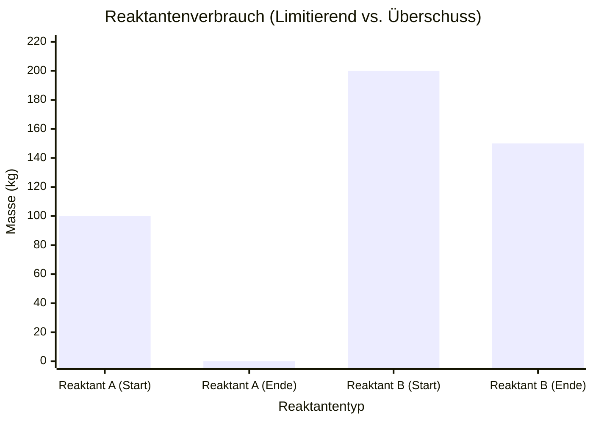
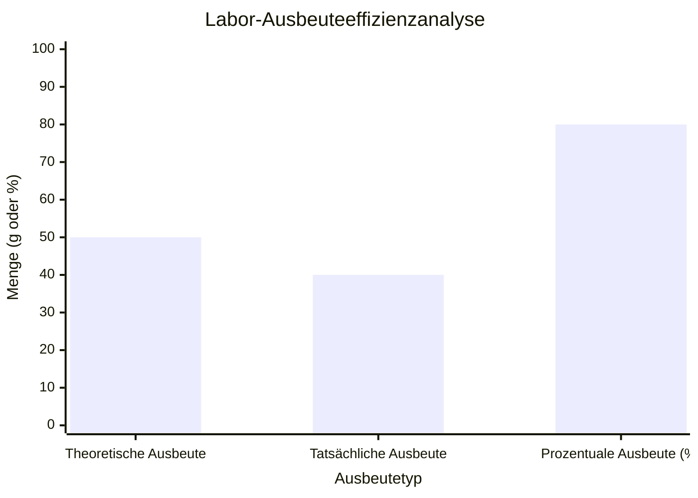
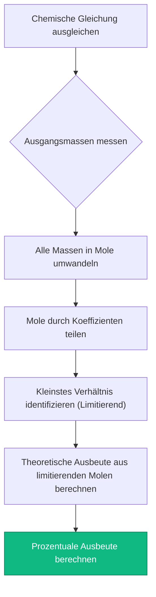
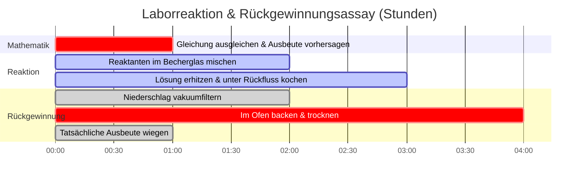

# Der ultimative Stöchiometrie-Rechner: Gleichungen, Ausbeuten und Massengrenzen

Willkommen beim ultimativen **Stöchiometrie-Rechner** und umfassenden Leitfaden zur Analyse chemischer Reaktionen. Egal, ob Sie ein AP-Chemie-Schüler sind, der den grundlegenden Masse-zu-Masse-Umwandlungsplan lernt, ein pharmazeutischer Chemieingenieur, der die prozentuale Ausbeute für millionenschwere Medikamentensynthesen optimiert, oder ein Labortechniker, der exakte Titrantenvolumina für die Lösungsstöchiometrie berechnet – die Beherrschung der mathematischen Verhältnisse chemischer Reaktionen ist der absolute Kern der quantitativen Chemie.

Chemie ist nicht nur das Mischen zufälliger Mengen von Pulvern und die Hoffnung auf eine Reaktion. Es ist eine präzise mathematische Disziplin, die den strengen Gesetzen der Thermodynamik und der Erhaltung der Masse unterliegt. Jedes einzelne Atom, das in ein Reaktionsgefäß gelangt, muss bei Beendigung der Reaktion perfekt abgerechnet werden.

In dieser ausführlichen SEO-Meisterklasse mit über 4.000 Wörtern werden wir die Stöchiometrie-Umwandlungsalgorithmen vollständig dekonstruieren, die Identifizierung limitierender Reaktanten mathematisch beweisen, die Thermodynamik der theoretischen und tatsächlichen Ausbeute entschlüsseln und die fatalsten Berechnungsfehler im Labor aufdecken. Um ein absolutes Verständnis zu gewährleisten, haben wir fünf sorgfältig detaillierte, parser-sichere interaktive Mermaid.js-Diagramme integriert.

---

## 1. Die Kernphysik: Das Gesetz zur Erhaltung der Masse

Bevor Sie Molverhältnisse manipulieren oder Produktausbeuten berechnen, müssen Sie die grundlegende Physik einer chemischen Reaktion begreifen.

Im Jahr 1789 entdeckte Antoine Lavoisier das **Gesetz zur Erhaltung der Masse**. Er bewies, dass Materie während einer chemischen Reaktion weder erzeugt noch zerstört wird. Atome trennen sich einfach voneinander und ordnen sich zu neuen molekularen Strukturen neu an.

**Die goldene Regel der Stöchiometrie:**
$$(\text{Gesamtmasse der Reaktanten}) = (\text{Gesamtmasse der Produkte})$$

Wenn Sie genau $16,04\text{ g}$ Methan ($\text{CH}_4$) mit $64,00\text{ g}$ Sauerstoff ($\text{O}_2$) verbrennen, enthält das Reaktionsgefäß exakt $80,04\text{ g}$ Materie. Wenn die Verbrennung abgeschlossen ist und Kohlendioxid ($\text{CO}_2$) und Wasser ($\text{H}_2\text{O}$) entstehen, muss die Gesamtmasse der gasförmigen Produkte *genau* $80,04\text{ g}$ wiegen. Kein einziges Proton oder Elektron geht verloren.

Diese strikte mathematische Realität bedeutet, dass wir perfekt vorhersagen können, wie viel Produkt eine Reaktion erzeugen wird, vorausgesetzt, wir beginnen mit einer **ausgeglichenen chemischen Gleichung**.

---

## 2. Die ausgeglichene Gleichung und Molverhältnisse

Eine chemische Gleichung ist ein Rezept. Genau wie ein Rezept vorschreibt, dass "2 Eier + 1 Tasse Mehl = 4 Pfannkuchen", schreibt eine chemische Gleichung die exakten molekularen Verhältnisse vor, die für eine Reaktion erforderlich sind.

Nehmen wir die Synthese von Ammoniak (Das Haber-Bosch-Verfahren):
$$\text{N}_2 + 3\text{H}_2 \rightarrow 2\text{NH}_3$$

Die Zahlen vor den Molekülen sind **stöchiometrische Koeffizienten**. Sie diktieren die **Molverhältnisse**.
- Es braucht genau $1\text{ Mol}$ Stickstoffgas ($\text{N}_2$), um mit genau $3\text{ Mol}$ Wasserstoffgas ($\text{H}_2$) zu reagieren.
- Diese Reaktion liefert genau $2\text{ Mol}$ Ammoniak ($\text{NH}_3$).

**Die fatale Laborfalle:** Molverhältnisse gelten *nur* für Mole (die Anzahl der Teilchen), NICHT für die Masse (Gramm). Sie können nicht $1\text{ Gramm}$ Stickstoff und $3\text{ Gramm}$ Wasserstoff mischen. Da verschiedene Atome sehr unterschiedliche Massen haben (Stickstoff ist 14-mal schwerer als Wasserstoff), müssen Sie Ihre physikalischen Labormassen immer in Mole umwandeln, bevor Sie die Rezeptverhältnisse anwenden.

---

## 3. Die stöchiometrische Roadmap: Masse-zu-Masse-Umwandlungen

Da Laborwaagen Masse (Gramm) messen, chemische Gleichungen jedoch in Molen sprechen, muss jeder analytische Chemiker den 3-stufigen Masse-zu-Masse-Stöchiometrie-Algorithmus ausführen.

**Das Szenario:** Wie viele Gramm Ammoniak ($\text{NH}_3$) können aus $28,02\text{ g}$ Stickstoffgas ($\text{N}_2$) hergestellt werden?

### Schritt 1: Masse in Mol (Das Eingangsportal)
Teilen Sie die Ausgangsmasse durch ihre molare Masse.
- $\text{N}_2\text{ Molare Masse} = 28,02\text{ g/mol}$
- $\text{Mole von N}_2 = \frac{28,02\text{ g}}{28,02\text{ g/mol}} = \mathbf{1,00\text{ Mol N}_2}$

### Schritt 2: Mol in Mol (Das Kernverhältnis)
Multiplizieren Sie mit dem stöchiometrischen Verhältnis ($\frac{\text{Zielkoeffizient}}{\text{Startkoeffizient}}$).
- Verhältnis = $\frac{2\text{ NH}_3}{1\text{ N}_2}$
- $\text{Mole von NH}_3 = 1,00\text{ Mol N}_2 \times \frac{2}{1} = \mathbf{2,00\text{ Mol NH}_3}$

### Schritt 3: Mol in Masse (Das Ausgangsportal)
Multiplizieren Sie die neuen Mole mit der molaren Masse des Zielprodukts.
- $\text{NH}_3\text{ Molare Masse} = 17,03\text{ g/mol}$
- $\text{Masse von NH}_3 = 2,00\text{ Mol} \times 17,03\text{ g/mol} = \mathbf{34,06\text{ g NH}_3}$

---

## 4. Der limitierende Reaktant und die theoretische Ausbeute

In der realen Welt mischen Chemiker Reaktanten selten in perfekten, exakten stöchiometrischen Verhältnissen. Meistens ist eine Chemikalie billig (wie Sauerstoff in der Luft) und eine Chemikalie extrem teuer (wie ein Platinkatalysator oder ein synthetisierter Medikamentenvorläufer).

**Der limitierende Reaktant:** Die Chemikalie, die als erste vollständig verbraucht wird. In dem Moment, in dem sie ausgeht, stoppt die Reaktion sofort. Sie bestimmt die absolute maximale Produktmenge, die gebildet werden kann (die theoretische Ausbeute).
**Der überschüssige Reaktant:** Die Chemikalie, die übrig bleibt und nach Beendigung der Reaktion nutzlos im Becherglas schwimmt.

### Wie man den limitierenden Reaktanten findet
1. Wandeln Sie alle Ausgangsmassen in Mole um.
2. Teilen Sie die Mole jedes Reaktanten durch seinen stöchiometrischen Koeffizienten in der ausgeglichenen Gleichung.
3. Die kleinste resultierende Zahl ist Ihr limitierender Reaktant.
4. *Verwerfen Sie die anderen Zahlen.* Sie müssen die ursprünglichen Mole des limitierenden Reaktanten verwenden, um alle Produktausbeuten zu berechnen.

### Prozentuale Ausbeute vs. theoretische Ausbeute
Ihre Mathematik hat berechnet, dass Sie genau $34,06\text{ g}$ Ammoniak erhalten sollten. Dies ist Ihre **theoretische Ausbeute** – eine perfekte, makellose Realität, die eine 100%ige Effizienz annimmt.

In einem tatsächlichen Labor verschütten Sie ein paar Tropfen. Etwas Gas entweicht aus dem Kolben. Etwas Produkt bleibt im Filterpapier stecken. Sie wiegen Ihr Endprodukt und gewinnen nur $25,00\text{ g}$ zurück. Das ist Ihre **tatsächliche Ausbeute**.

**Gleichung der prozentualen Ausbeute:**
$$\text{Prozentuale Ausbeute} = \left( \frac{\text{Tatsächliche Ausbeute}}{\text{Theoretische Ausbeute}} \right) \times 100\%$$
$$\text{Prozentuale Ausbeute} = \left( \frac{25,00}{34,06} \right) \times 100\% = \mathbf{73,4\%}$$

---

## 5. Fünf konzeptionelle Ingenieursszenarien mit 2D-Visualisierungen

Um die mechanischen Algorithmen, die stöchiometrische Matrixumwandlungen, Ausbeutegrenzen und Laborprotokolle regeln, vollständig zu beherrschen, werden wir fünf verschiedene Szenarien der analytischen Chemie untersuchen, die mithilfe benutzerdefinierter Mermaid.js-Diagramme visuell aufgeschlüsselt werden.

### Beispiel 1: Das Flussdiagramm des Masse-zu-Masse-Algorithmus

**Das Szenario:**
Ein AP-Chemie-Schüler kartiert den strikten, unzerbrechlichen 3-stufigen mathematischen Weg, der erforderlich ist, um Gramm eines Ausgangsreaktanten in Gramm eines Endprodukts umzuwandeln.

**2D-Visualisierung:**
Dieses Flussdiagramm visualisiert den strikten Zwang, durch das "Molportal" zu gehen. Masse kann nicht direkt in Masse umgewandelt werden.

---

### Beispiel 2: Limitierender vs. verbleibender überschüssiger Reaktant

**Das Szenario:**
Ein Industrieingenieur belädt einen Reaktor mit $100\text{ kg}$ Reaktant A und $200\text{ kg}$ Reaktant B. Reaktant A wird vollständig verbraucht (limitierend), während große Mengen von Reaktant B verbleiben (Überschuss).

**2D-Visualisierung:**
Dieses Diagramm beweist grafisch, wie der limitierende Reaktant auf absolut Null fällt, während der überschüssige Reaktant eine signifikante nicht reagierte Masse behält.

---

### Beispiel 3: Ausbeuteeffizienzanalyse

**Das Szenario:**
Ein pharmazeutisches Labor analysiert die Effizienz einer teuren Medikamentensynthese. Sie berechneten eine theoretische Ausbeute von $50,0\text{ g}$, gewannen aber nur $40,0\text{ g}$ zurück.

**2D-Visualisierung:**
Dieses Vergleichsdiagramm stellt visuell den Unterschied zwischen mathematischer Perfektion (Theoretisch) und physikalischer Realität (Tatsächlich) dar und demonstriert eine prozentuale Ausbeute von $80\%$.

---

### Beispiel 4: Das Stöchiometrie-Laborprotokoll

**Das Szenario:**
Ein Labortechniker erstellt das strikte Standardarbeitsanweisung (SOP), das gesetzlich vorgeschrieben ist, um eine Reaktionsausbeuteberechnung für die industrielle Berichterstattung zu zertifizieren.

**2D-Visualisierung:**
Dieses Top-Down-Flussdiagramm fungiert als striktes chemisches Rezept und erzwingt die absolute Abfolge mathematischer Aktionen, die erforderlich sind, um Berechnungsfehler zu vermeiden.

---

### Beispiel 5: Zeitleiste für die Reaktionsausbeute-Rückgewinnung

**Das Szenario:**
Ein analytischer Chemiker führt ein mehrstündiges Synthese-, Filtrations- und Trocknungsprotokoll aus, um die endgültige tatsächliche Ausbeute eines festen Niederschlags korrekt zu berechnen.

**2D-Visualisierung:**
Dieses Gantt-Diagramm visualisiert die chronologische Abfolge eines physikalischen Assays und beweist, dass Ausbeuteberechnungen erst stattfinden können, wenn das Produkt physikalisch gereinigt und getrocknet ist.

---

## 6. Fazit und stöchiometrische Herausforderung

Die Beherrschung von Stöchiometrie-Algorithmen ist die nicht verhandelbare Zugangsvoraussetzung für den Eintritt in jedes industrielle, biologische oder chemische Labor. Das Verständnis der mathematischen Strenge der Massenerhaltung, der Notwendigkeit, alle Berechnungen durch das "Molportal" zu leiten, und die Identifizierung limitierender Reaktanten garantieren, dass Ihre industriellen Scale-ups und Laborassays genau wie beabsichtigt ablaufen.

Wenn Sie diese Algorithmen nicht beherrschen, werden Ihre Chemieanlagen Millionen von Dollar an nicht reagierten überschüssigen Reagenzien verschwenden, Ihre pharmazeutischen Dosierungen werden tödlich falsch sein, und Ihre experimentellen Daten werden durch menschliche Fehler völlig korrumpiert sein.

Um sicherzustellen, dass Sie diese kritischen Konzepte gemeistert haben, starten Sie unseren interaktiven Simulator und versuchen Sie, diese abschließenden analytischen Herausforderungen zu lösen:
1. **Die Verbrennungs-Herausforderung:** Gleichen Sie die Gleichung für die Verbrennung von Propan aus ($\text{C}_3\text{H}_8 + \text{O}_2 \rightarrow \text{CO}_2 + \text{H}_2\text{O}$). Wie viele Gramm Kohlendioxid entstehen durch die Verbrennung von $44,1\text{ g}$ Propan?
2. **Die Limitierungs-Herausforderung:** Sie mischen $10,0\text{ g}$ Wasserstoffgas ($\text{H}_2$) mit $10,0\text{ g}$ Sauerstoffgas ($\text{O}_2$), um Wasser herzustellen. Welches Gas geht zuerst aus? Wie viele Gramm Wasser werden gebildet?
3. **Die Ausbeute-Herausforderung:** Sie berechnen eine theoretische Ausbeute von $120,0\text{ g}$ Aspirin. Nach Synthese, Filtration und Trocknung wiegen Sie genau $90,0\text{ g}$ reines Aspirin. Wie hoch ist Ihre prozentuale Ausbeute und welche chemischen Faktoren könnten die fehlende Masse erklären?

Verlassen Sie sich auf diesen universellen Stöchiometrie-Rechner, um Ihre Laborprotokolle zu überprüfen, limitierende Reaktanten sofort zu identifizieren und die Thermodynamik der quantitativen chemischen Analyse dauerhaft zu meistern.

