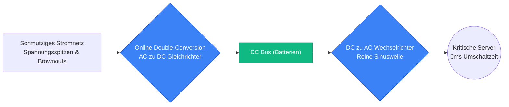
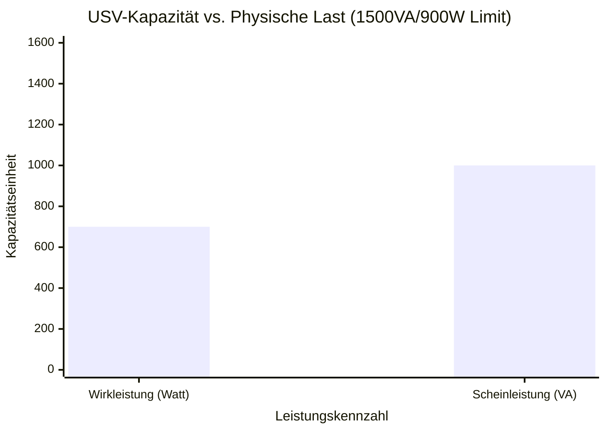
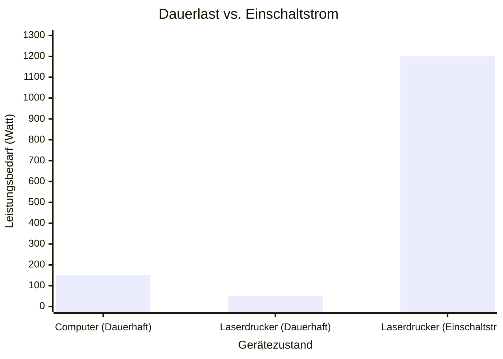
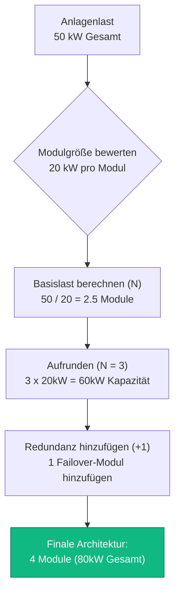
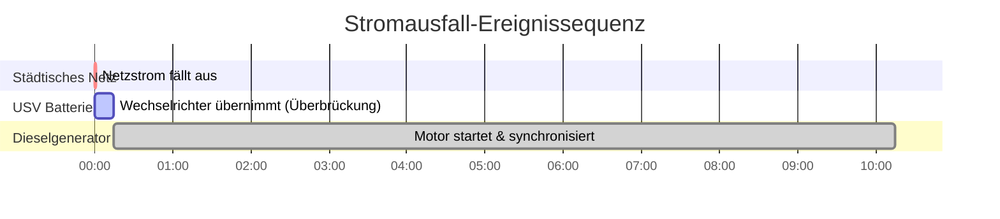

# Der definitive USV-Rechner: Dimensionierung, Laufzeit und N+1-Redundanz

Willkommen beim ultimativen **USV-Rechner** und umfassenden Handbuch für unterbrechungsfreie Stromversorgungenstechnik. Egal, ob Sie als IT-Administrator ein massives $40\text{kVA}$ N+1-Modul-Rack für ein Rechenzentrum dimensionieren, als Elektriker die Kompatibilität von Notstromaggregaten bewerten oder als Gamer versuchen, einen $1000\text{W}$ PC vor Spannungsabfällen zu schützen – das Beherrschen der USV-Elektrophysik ist absolut unerlässlich.

Eine USV (Unterbrechungsfreie Stromversorgung) ist nicht einfach nur eine einfache Batterie in einer Plastikbox. Es handelt sich um eine hochkomplexe elektromechanische Brücke, die entwickelt wurde, um empfindliche Halbleiter vor heftigen Spannungsspitzen, harmonischen Verzerrungen und dem totalen Ausfall des Stromnetzes zu schützen. Wenn Sie den Unterschied zwischen **Wirkleistung (Watt)** und **Scheinleistung (VA)** falsch berechnen, werden Sie den Wechselrichter dauerhaft überlasten. Wenn Sie den Unterschied zwischen Offline- und Online Double-Conversion-Topologien falsch verstehen, werden Ihre Server während der $4\text{ms}$ Umschaltverzögerung brutal neu starten.

In dieser umfassenden, 4.000+ Wörter langen SEO-Meisterklasse werden wir die fundamentale Watt-vs.-VA-Trigonometrie dekonstruieren, die Gefahren von Laserdrucker-Einschaltströmen aufdecken, die Ingenieurmathematik entschlüsseln, die zur Berechnung präziser Batterie-Backup-Laufzeiten erforderlich ist, und das Konzept der N+1-fehlertoleranten Redundanz mathematisch beweisen. Um sicherzustellen, dass Sie diese technischen Konzepte vollständig begreifen, haben wir fünf minutiös detaillierte, parser-sichere interaktive Mermaid.js-Diagramme eingefügt.

---

## 1. Die Physik der USV-Dimensionierung (Watt vs. VA)

Das absolut kritischste Konzept in der USV-Technik ist zu verstehen, warum elektrische Lasten zwei unterschiedliche Leistungswerte haben: **Watt (W)** und **Volt-Ampere (VA)**.

1. **Wirkleistung (Watt):** Dies repräsentiert die tatsächliche, reale Arbeit, die vom Gerät geleistet wird. Sie erzeugt Wärme und Rechenleistung.
2. **Scheinleistung (VA):** Dies repräsentiert den gesamten elektrischen Bedarf, der an den USV-Wechselrichter gestellt wird. Aufgrund der Physik des Wechselstroms (AC) und des **Leistungsfaktors (PF)** zwingen induktive und kapazitive Lasten die USV, "Phantom"-Blindleistung zu schieben und zu ziehen.

**Die Leistungsfaktor-Gleichung:**
$$\text{Leistungsfaktor (PF)} = \frac{\text{Wirkleistung (Watt)}}{\text{Scheinleistung (VA)}}$$

Daher:
$$\text{Scheinleistung (VA)} = \frac{\text{Watt}}{\text{Leistungsfaktor}}$$

**Warum ist das wichtig?**
Eine USV ist strikt für BEIDE Maximalwerte bemessen, für maximale Watt und maximale VA. Sie dürfen keine der beiden Grenzen überschreiten.
Zum Beispiel ist eine gängige Büro-USV für $1500\text{ VA}$ und $900\text{ Watt}$ ausgelegt.
- Wenn Sie einen $950\text{W}$ Heizlüfter einstecken (der einen $1.0\text{ PF}$ hat, also $950\text{ VA}$), haben Sie das $1500\text{ VA}$-Limit nicht überschritten, aber Sie HABEN das $900\text{ W}$-Limit überschritten. Die USV wird piepen und sich abschalten.
- Wenn Sie mehrere alte Leuchtstoffröhren einstecken, die $800\text{W}$ mit einem furchtbaren $0.50\text{ PF}$ ziehen, beträgt die VA $1600\text{ VA}$ ($800 / 0.50$). Sie haben das $900\text{ W}$-Limit nicht überschritten, aber Sie HABEN das $1500\text{ VA}$-Limit überschritten. Die USV wird piepen und sich abschalten.

*Technischer Hinweis:* Moderne Computer mit "Active PFC"-Netzteilen haben einen exzellenten Leistungsfaktor von $0.95$ bis $0.99$. Das bedeutet, dass ihre Watt- und VA-Werte nahezu identisch sind.

---

## 2. Sicherheitsmarge (Headroom) und Einschaltströme

Bei der Berechnung Ihrer gesamten Gerätelast dürfen Sie die USV nicht exakt auf Ihre mathematische Summe dimensionieren. Sie müssen eine **Sicherheitsmarge (Headroom Margin)** einplanen.

1. **Die $20\%$-Regel:** Der Industriestandard besagt, dass eine USV nicht mit mehr als $80\%$ ihrer maximalen Nennkapazität betrieben werden sollte. Dies bietet einen $20\%$-Sicherheitspuffer, um leichte Spannungsschwankungen des Stromnetzes, Batteriealterung und das Hinzufügen kleinerer USB-Geräte auszugleichen.
2. **Einschaltstrom (Inrush Current):** Elektromotoren, Kühlschrankkompressoren und schwere Netzteilkondensatoren ziehen in der genauen Millisekunde, in der sie eingeschaltet werden, massive Stromstöße. Ein $200\text{W}$-Kühlschrank kann für eine halbe Sekunde $1000\text{W}$ ziehen. Ein $500\text{W}$ Gaming-PC kann beim Booten $650\text{W}$ ziehen.
3. **Die Laserdrucker-Falle:** Schließen Sie niemals einen Laserdrucker an die Batterie-Backup-Seite einer USV an. Laserdrucker verwenden Fixierheizelemente, die beim Starten des Drucks sofort $1000\text{W}$ bis $1500\text{W}$ ziehen. Dieser plötzliche Stromstoß wird $99\%$ der Verbraucher-USV-Einheiten sofort überlasten und auslösen. Schließen Sie Laserdrucker ausschließlich an die "Surge Only"-Steckdosen (nur Überspannungsschutz) an.

---

## 3. Entmystifizierung von USV-Topologien: Offline vs. Line-Interactive vs. Online

Nicht alle USV-Einheiten sind gleich gebaut. Die interne Schaltung (Topologie) bestimmt, wie die USV mit dem Netzstrom umgeht und wie schnell sie bei einem Stromausfall auf die Batterie umschaltet.

### 1. Offline / Standby USV
Dies ist die billigste und häufigste Heim-USV. Unter normalen Bedingungen leitet sie den rohen AC-Netzstrom einfach direkt an Ihren Computer weiter. Wenn das Netz ausfällt, schaltet ein mechanisches Relais auf den Batteriewechselrichter um.
- **Umschaltzeit:** $4\text{ bis }10\text{ Millisekunden}$. (Schnell genug für einen PC, aber ein empfindlicher Netzwerk-Switch könnte neu starten).
- **Spannungsregelung:** Keine. Wenn die Wandspannung auf $105\text{V}$ fällt, erhält Ihr Computer $105\text{V}$.

### 2. Line-Interactive USV
Der Mittelklasse-Standard für Büroserver und Gaming-PCs. Sie enthält einen massiven Transformator, der als Automatic Voltage Regulator (AVR) bekannt ist. Wenn die Spannung im Stromnetz abfällt (ein Brownout), erhöht die AVR die Spannung mathematisch wieder auf $120\text{V}$, ohne die interne Batterie zu entladen. (Für Europa wären das $230\text{V}$, aber das Prinzip bleibt gleich).
- **Umschaltzeit:** $2\text{ bis }4\text{ Millisekunden}$.
- **Spannungsregelung:** Exzellent. Verlängert die Lebensdauer der Batterie erheblich, indem unnötige Entladungen während kleinerer Spannungsabfälle vermieden werden.

### 3. Online Double-Conversion USV
Der Goldstandard für Rechenzentren und Krankenhäuser. Eingehender AC-Netzstrom wird aggressiv in DC-Strom umgewandelt. Dieser DC-Strom lädt die Batterie auf UND speist gleichzeitig den Wechselrichter. Der Wechselrichter wandelt den DC-Strom wieder in mathematisch perfekten, chirurgisch sauberen AC-Strom um. Ihre Geräte sind physisch vom städtischen Stromnetz isoliert.
- **Umschaltzeit:** $0\text{ Millisekunden}$. (Es gibt keinen Schalter. Der Wechselrichter läuft immer).
- **Spannungsregelung:** Perfekt.

---

## 4. Berechnung der Batterie-Backup-Laufzeit

Eine USV ist so konzipiert, dass sie genügend Laufzeit bietet, um Ihre Arbeit sicher zu speichern und ordnungsgemäß herunterzufahren, oder um die Zeit zu überbrücken, bis ein Dieselgenerator hochfährt. Sie ist nicht dafür gedacht, ein Haus 12 Stunden lang zu betreiben.

**Die Laufzeit-Formel:**
$$\text{Geschätzte Laufzeit (Stunden)} = \frac{\text{Batteriespannung} \times \text{Batterie Ah} \times \text{Entladetiefe (DoD)}}{\frac{\text{Last in Watt}}{\text{Wechselrichter-Effizienz}}}$$

Die meisten Verbraucher-USV-Einheiten enthalten kleine versiegelte Blei-Säure-Batterien (SLA).
Zum Beispiel enthält eine Standard-$1500\text{ VA}$ USV typischerweise zwei $12\text{V}$ $9\text{Ah}$ Batterien, die in Reihe geschaltet sind ($24\text{V}$).
- Gesamte Energie = $24\text{V} \times 9\text{Ah} = 216\text{ Wattstunden}$.
- Nutzbare Energie (unter Berücksichtigung von Hochgeschwindigkeitsentladungs-Peukert-Verlusten und Wechselrichtereffizienz) beträgt etwa $130\text{Wh}$.
- Eine $400\text{W}$ PC-Last wird diese USV in etwa $20\text{ Minuten}$ entladen.

---

## 5. Rechenzentrums N+1 Modulare Redundanz

In der Enterprise-IT stellt eine einzelne USV einen Single Point of Failure (SPOF) dar. Wenn der interne Wechselrichter der USV ausfällt, verliert das gesamte Server-Rack die Stromversorgung.

Um dies zu lösen, setzen Rechenzentren **N+1 redundante modulare USV-Arrays** ein.
- **N** repräsentiert die minimale Anzahl unabhängiger USV-Module, die erforderlich sind, um die volle Last der Anlage zu tragen.
- **+1** repräsentiert ein zusätzliches, identisches Standby-Modul.

Wenn ein Server-Rack $30\text{ kW}$ zieht und Sie $10\text{ kW}$ USV-Module verwenden:
- Benötigen Sie $N = 3$ Module, um die $30\text{ kW}$-Last zu tragen.
- Fügen Sie $+1$ Redundanzmodul hinzu, was die Gesamtzahl auf $4$ Module bringt.
- Wenn IRGENDEIN einzelnes Modul Feuer fängt, übernehmen die verbleibenden 3 Module nahtlos die $30\text{ kW}$-Last mit null Ausfallzeit.

---

## 6. Fünf konzeptionelle Ingenieurszenarien mit 2D-Visualisierungen

Um die physikalischen Beziehungen, die USV-Systeme steuern, vollständig zu beherrschen, werden wir fünf verschiedene Ingenieurszenarien untersuchen, die visuell mithilfe benutzerdefinierter Mermaid.js-Diagramme aufgeschlüsselt werden.

### Beispiel 1: Die Topologien im Vergleich (Offline vs. Online)

**Das Szenario:**
Ein IT-Direktor muss den massiven Preisunterschied zwischen einer Offline-USV und einer Online Double-Conversion-USV rechtfertigen.

**2D-Visualisierung:**
Dieses Logik-Flussdiagramm bildet den physikalischen Energiefluss ab und zeigt deutlich, wie eine Online-USV als Firewall zwischen dem schmutzigen städtischen Netz und den empfindlichen Servern fungiert.

---

### Beispiel 2: Der Kapazitätsengpass (Watt vs. VA)

**Das Szenario:**
Ein Heimanwender kann nicht verstehen, warum seine $1500\text{VA} / 900\text{W}$ USV eine Überlastungswarnung ausgibt, wenn er Elektronik mit niedrigem Leistungsfaktor im Wert von $1000\text{VA}$ anschließt, die nur $700\text{W}$ zieht.

**Die Mathematik:**
Die Last ($700\text{W}$, $1000\text{VA}$) liegt innerhalb der $900\text{W}$-Grenze, kommt der Scheinleistungsgrenze von $1500\text{VA}$ jedoch gefährlich nahe, wenn man eine Sicherheitsmarge von $20\%$ berücksichtigt (was $1200\text{VA}$ Anforderung bedeutet).

**2D-Visualisierung:**
Dieses Diagramm stellt die doppelten Grenzen der USV grafisch der physischen Last gegenüber und beweist, dass die Scheinleistung (VA) genauso wichtig ist wie die Wirkleistung (Watt).

---

### Beispiel 3: Die Gefahr des Laserdruckers

**Das Szenario:**
Eine Empfangsdame steckt einen $1200\text{W}$ Laserdrucker in die Batterie-Backup-Steckdose einer $600\text{W}$ Büro-USV. Die USV löst sofort aus und tötet den benachbarten Desktop-Computer.

**Die Mathematik:**
Die Dauerbelastung eines Druckers beträgt $50\text{W}$. Der Einschaltstrom des Fixierers beträgt $1200\text{W}$ für 1 Sekunde. Der Wechselrichter kann physisch keine $1200\text{W}$ schieben.

**2D-Visualisierung:**
Dieses Diagramm zeigt die brutale Realität des Einschaltstroms (Inrush Surge Current) und beweist, warum mechanische Motoren und Heizfixierer den USV-Batteriewechselrichter umgehen müssen.

---

### Beispiel 4: Berechnung der N+1 Modularen Redundanz

**Das Szenario:**
Ein Rechenzentrumsarchitekt muss genügend $20\text{ kW}$ USV-Module bereitstellen, um eine $50\text{ kW}$ Server-Suite zu schützen, und gleichzeitig vollständige Fehlertoleranz gegenüber einem katastrophalen Modulausfall aufrechterhalten.

**2D-Visualisierung:**
Dieses Top-Down-Flussdiagramm bildet die strikte Mathematik ab, die erforderlich ist, um die Lastabdeckung zu bewerten, die N-Anforderung zu definieren und das $+1$ Failover-Modul hinzuzufügen.

---

### Beispiel 5: Die Zeitachse der Überbrückung eines Stromausfalls

**Das Szenario:**
Ein Ingenieur muss die genaue Abfolge von Ereignissen verstehen, wenn das städtische Netz ausfällt, der USV-Wechselrichter übernimmt und der Backup-Dieselgenerator versucht, sich zu synchronisieren.

**2D-Visualisierung:**
Dieses Gantt-Diagramm skizziert brutal die mikroskopische Zeitachse eines Stromausfalls und demonstriert, wie die USV als kritische Brücke fungiert, die die 15-sekündige Lücke überspannt, bevor der Dieselgenerator stabilen Strom liefern kann.

---

## 7. Fazit und Ingenieursherausforderung

Das Beherrschen der USV-Dimensionierung ist das fundamentale Fundament aller Enterprise-IT- und Anlagenbautechnik. Wenn Sie die Vektortrigonometrie verstehen, die Watt und VA trennt, die brutale Realität von Einschaltströmen respektieren und fehlertolerante N+1-Architekturen entwerfen, wird sichergestellt, dass Ihre Systeme jeden städtischen Stromausfall überstehen.

Wenn Sie diese mathematischen Prinzipien ignorieren, werden Ihre Wechselrichter bei Drucker-Einschaltströmen überlastet und herunterfahren, Ihre Server werden während Line-Interactive-Umschaltverzögerungen spontan neu starten, und Ihre Einzelmodul-USV wird zum Single Point of Failure, der Ihr gesamtes Rechenzentrum zum Absturz bringt.

Um zu garantieren, dass Sie diese kritischen Konzepte gemeistert haben, starten Sie unseren interaktiven Simulator und versuchen Sie, diese letzten Herausforderungen zu lösen:
1. **Die Überlastungs-Falle:** Sie haben eine $2000\text{VA} / 1200\text{W}$ USV. Sie schließen zehn $150\text{W}$ alte AC-Motoren mit einem $0.60\text{ PF}$ an. Überschreiten Sie den Watt-Wert oder den VA-Wert?
2. **Die Modulanzahl:** Ihr Serverraum zieht $75\text{ kW}$. Sie kaufen $25\text{ kW}$ modulare USV-Einheiten. Wie viele Module müssen Sie insgesamt installieren, um eine N+1-Redundanz zu erreichen?
3. **Die Batterie-Brücke:** Eine $1000\text{W}$-Last ist an eine USV angeschlossen, die vier in Reihe geschaltete $12\text{V}$ $7\text{Ah}$ Batterien enthält. Gehen Sie von einer Wechselrichtereffizienz von $85\%$ und einer Entladung von $100\%$ aus. Berechnen Sie die exakte maximale theoretische Laufzeit in Minuten bis zur vollständigen Abschaltung.

Verlassen Sie sich auf diesen Rechner, um Ihre Server-Racks zu auditieren, N+1-Infrastruktur-Upgrades mathematisch zu begründen und Ausfallzeiten dauerhaft zu eliminieren.
