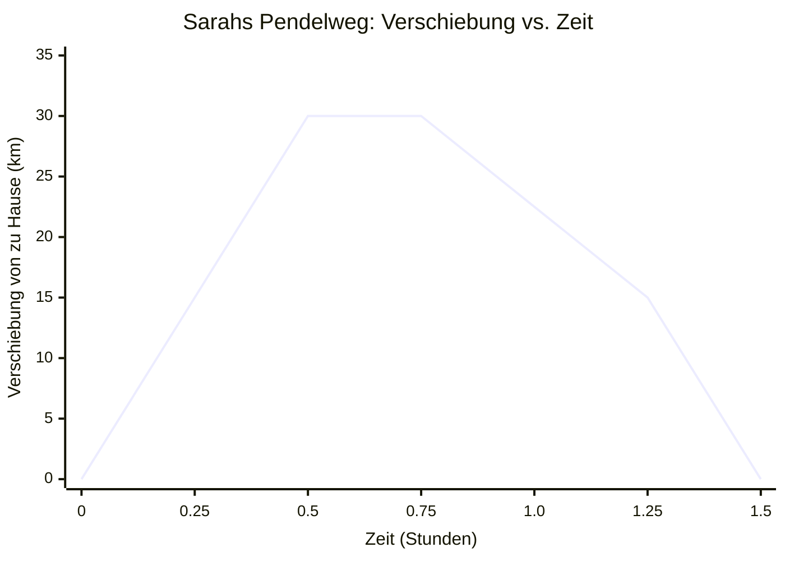
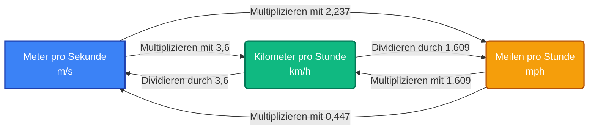
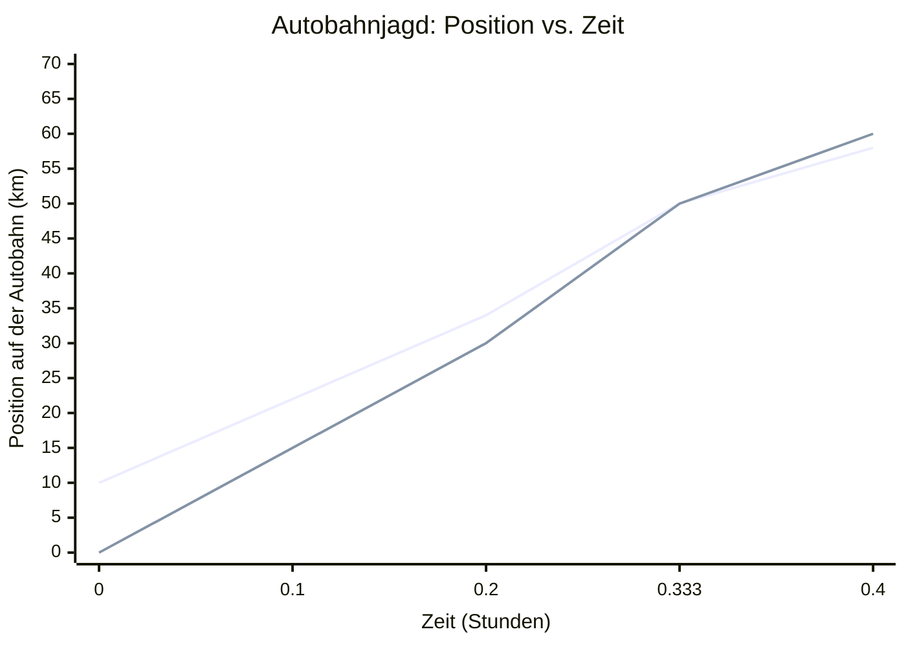
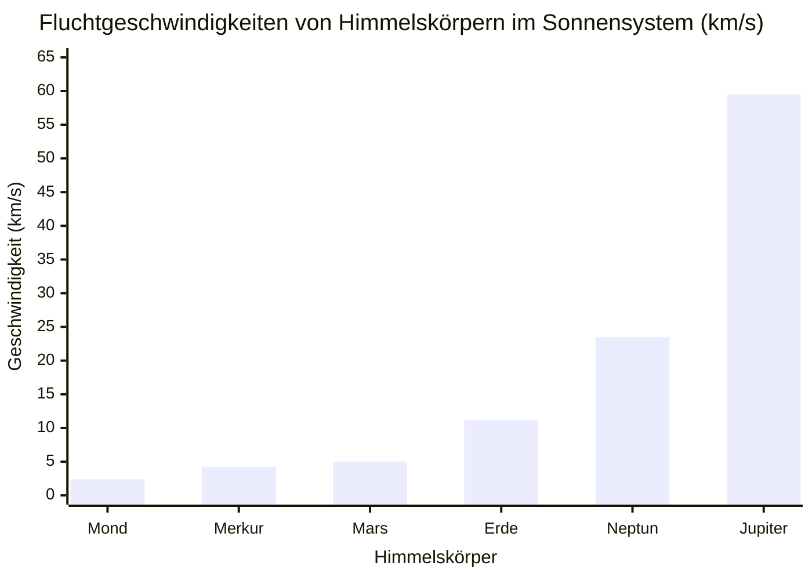

# Der ultimative Geschwindigkeitsrechner: Tempo, Strecke, Zeit und 1D-Kinematik meistern

Willkommen beim umfassendsten, tiefgreifend interaktiven und mathematisch robusten **Geschwindigkeitsrechner** und Leitfaden, der heute verfügbar ist. Egal, ob Sie ein Physikschüler der Oberstufe sind, der seine ersten kinematischen Probleme angeht, ein Ingenieur, der Transitflussraten berechnet, ein Athlet, der sein Sprint-Pacing optimiert, oder einfach ein neugieriger Geist, der sich fragt, wie man die Geschwindigkeit eines fallenden Objekts misst, dieser Leitfaden ist für Sie gemacht. 

Die Geschwindigkeit ist der Herzschlag der Bewegung. Sie bestimmt, wie lange es dauert, bis uns das Licht der Sonne erreicht, wie Flugzeuge durch atmosphärische Strömungen navigieren und wie Autos sicher an Kreuzungen bremsen. In diesem definitiven Leitfaden mit über 4.000 Wörtern werden wir die komplexe Mathematik der Geschwindigkeit aufschlüsseln, die kritischen Unterschiede zwischen Tempo (Speed) und Geschwindigkeit (Velocity) untersuchen, eine umfassende Bedienungsanleitung für unseren Rechner bereitstellen und fünf detaillierte, visualisierte konzeptionelle Beispiele mit 2D-Diagrammen durchgehen. 

---

## 1. Das menschliche Konzept der Geschwindigkeit: Eine tiefgründige Erklärung

Seit den Anfängen der menschlichen Zivilisation war das Verständnis von Bewegung eine Frage des Überlebens, der Erforschung und des Fortschritts. Antike Jäger mussten die Geschwindigkeit ihrer Beute und ihrer Projektile abschätzen. Frühe polynesische Navigatoren berechneten Durchschnittsgeschwindigkeiten über riesige Ozeane nur anhand der Sterne und des Rhythmus der Wellen. Aber erst durch die wissenschaftliche Revolution – angeführt von Persönlichkeiten wie Galileo Galilei und Sir Isaac Newton – wurde das Konzept der Geschwindigkeit in den strengen mathematischen Rahmen gefasst, den wir heute verwenden.

### Tempo (Speed) vs. Geschwindigkeit (Velocity): Das große Missverständnis

In Alltagsgesprächen hört man die Leute oft sagen: "Das Tempo des Autos beträgt 60 Meilen pro Stunde" und "Die Geschwindigkeit des Autos beträgt 60 Meilen pro Stunde", und zwar austauschbar. Im Bereich der Physik ist dieser Fehler jedoch so, als würde man Gewicht mit Masse verwechseln – es sind grundlegend verschiedene Konzepte.

**Tempo ist eine skalare Größe.**
Eine skalare Größe ist ein Maß, das nur einen Betrag (eine Zahl und eine Einheit) hat. Es sagt Ihnen, "wie schnell" sich ein Objekt bewegt, aber es sagt Ihnen absolut nichts darüber, wohin dieses Objekt fährt. Wenn Sie mit verbundenen Augen in einem Auto sitzen, das mit 100 km/h fährt, kennen Sie Ihr Tempo, aber nicht Ihr Ziel. 

**Geschwindigkeit ist eine vektorielle Größe.**
Eine vektorielle Größe enthält sowohl Betrag *als auch* Richtung. Sie sagt Ihnen, "wie schnell" UND "in welche Richtung". Wenn ein Auto mit 100 km/h in Richtung Norden fährt, ist das seine Geschwindigkeit. Wenn das Auto um eine Kurve fährt und beginnt, mit 100 km/h nach Osten zu fahren, ist sein *Tempo* völlig konstant geblieben, aber seine *Geschwindigkeit* hat sich grundlegend geändert, weil sich die Richtung geändert hat. 

Diese Unterscheidung wird unglaublich wichtig bei der Berechnung von Durchschnittswerten. Wenn Sie eine Runde auf einer 400-Meter-Rundbahn in 60 Sekunden laufen und genau dort enden, wo Sie angefangen haben:
- Ihr **Durchschnittstempo** (Average Speed) ist Strecke / Zeit = 400 m / 60 s = 6,67 m/s.
- Ihre **Durchschnittsgeschwindigkeit** (Average Velocity) ist Verschiebung / Zeit = 0 m / 60 s = 0 m/s. 

Da Ihre Start- und Endposition exakt gleich sind, ist Ihre Nettoverschiebung null und somit ist Ihre Durchschnittsgeschwindigkeit über die gesamte Strecke null!

### Die Kerngleichungen der Bewegung

Auf der grundlegendsten Ebene wird die Durchschnittsgeschwindigkeit ($v$) berechnet, indem man die Positionsänderung (Verschiebung, $\Delta x$) durch die Änderung der Zeit ($\Delta t$) dividiert.

**Die grundlegende Gleichung:**
$$ v = \frac{\Delta x}{\Delta t} = \frac{x_{final} - x_{initial}}{t_{final} - t_{initial}} $$

Aus dieser einzigen, eleganten algebraischen Beziehung können wir die beiden anderen Kernvariablen ableiten. Wenn Sie wissen, wie schnell Sie sind und wie lange Sie reisen, können Sie die Strecke berechnen:
**Streckengleichung:**
$$ d = v \times t $$

Wenn Sie wissen, wie weit Sie reisen müssen und wie schnell Sie unterwegs sind, können Sie die dafür benötigte Zeit berechnen:
**Zeitgleichung:**
$$ t = \frac{d}{v} $$

### Momentangeschwindigkeit vs. Durchschnittsgeschwindigkeit

Wenn Sie von New York nach Boston fahren (etwa 215 Meilen) in 4 Stunden, beträgt Ihre Durchschnittsgeschwindigkeit ungefähr 53,75 mph in Richtung Nordosten. Es ist jedoch höchst unwahrscheinlich, dass Sie vier Stunden lang exakt 53,75 mph gefahren sind. Sie haben an roten Ampeln angehalten (0 mph), auf der Autobahn beschleunigt (70 mph) und für den Verkehr gebremst. 

Der Tachometer in Ihrem Auto zeigt nicht die Durchschnittsgeschwindigkeit an; er zeigt das **Momentantempo** – Ihr Tempo in diesem exakten, unendlich kleinen Bruchteil einer Sekunde. In der Infinitesimalrechnung ist die Momentangeschwindigkeit definiert als die Ableitung der Position nach der Zeit:
$$ v(t) = \lim_{\Delta t \to 0} \frac{\Delta x}{\Delta t} = \frac{dx}{dt} $$

Unser Geschwindigkeitsrechner wurde entwickelt, um Durchschnittsgeschwindigkeiten und Szenarien mit konstanter Geschwindigkeit zu verarbeiten und bietet ein solides Fundament, bevor es an die beschleunigte Kinematik geht.

---

## 2. Umfassende Bedienungsanleitung: So verwenden Sie den Geschwindigkeitsrechner

Unser interaktiver Geschwindigkeitsrechner ist so intuitiv wie ein Taschenrechner, aber so leistungsstark wie eine Physik-Engine. Hier ist eine Schritt-für-Schritt-Anleitung zur Maximierung seiner Funktionen.

### Schritt 1: Wählen Sie Ihre Zielvariable
Oben im Rechner-Dashboard finden Sie Optionen zur Berechnung von **Geschwindigkeit**, **Strecke** oder **Zeit**. 
- Wenn Sie herausfinden möchten, wie schnell etwas war, wählen Sie **Geschwindigkeit**. Sie werden aufgefordert, Strecke und Zeit einzugeben.
- Wenn Sie wissen möchten, wie weit ein Zug bei gegebener Geschwindigkeit und Fahrtdauer fährt, wählen Sie **Strecke**. 
- Wenn Sie einen Roadtrip planen und wissen müssen, wie lange die Fahrt zu Ihrem Ziel bei Ihrer Durchschnittsgeschwindigkeit dauert, wählen Sie **Zeit**.

### Schritt 2: Geben Sie Ihre bekannten Werte ein und wählen Sie Einheiten aus
Der Rechner verfügt über eine robuste, automatische Einheitenumrechnung. Sie müssen Ihre Eingaben nicht manuell umrechnen, bevor Sie das Tool verwenden. 
- Für **Strecke** können Sie Werte in Metern (m), Kilometern (km), Zentimetern (cm), Millimetern (mm), Meilen (mi), Yards (yd), Fuß (ft), Zoll (in) oder sogar Seemeilen (nmi) eingeben.
- Für **Zeit** können Sie Werte in Sekunden (s), Millisekunden (ms), Minuten (min), Stunden (h), Tagen oder sogar Jahren eingeben.
- Für **Geschwindigkeit** akzeptiert das Tool Meter pro Sekunde (m/s), Kilometer pro Stunde (km/h), Meilen pro Stunde (mph), Fuß pro Sekunde (ft/s), Knoten und Mach (Schallgeschwindigkeit).

Geben Sie einfach Ihre Zahlen in die Felder ein und verwenden Sie die Dropdown-Menüs, um Ihre Einheiten auszuwählen. Die interne Engine konvertiert sofort alles in Standard-SI-Einheiten (Meter und Sekunden) für die Berechnung, was perfekte Genauigkeit garantiert, und übersetzt das Ergebnis dann wieder in das von Ihnen gewünschte Ausgabeformat.

### Schritt 3: Interpretieren Sie das Ergebnis-Dashboard
In dem Moment, in dem Sie Ihre zweite Variable eingeben, aktualisiert der Rechner sofort das **Ergebnis-Dashboard**. Sie erhalten nicht nur eine einzelne Zahl; das Dashboard bietet:
- Das primäre berechnete Ergebnis in der von Ihnen angeforderten Einheit.
- Eine Tabelle mit äquivalenten Werten (z. B. wenn Sie 100 km/h berechnen, zeigt es gleichzeitig 62,1 mph, 27,7 m/s und 91,1 ft/s an).
- Die kinetische Energie des Objekts (wenn Sie zur Registerkarte "Erweitert" wechseln und eine Masse eingeben).

### Schritt 4: Entdecken Sie die interaktiven Visualisierungen
Scrollen Sie nach unten zur **Bewegungs-Zeitachse**. Dieses interaktive Diagramm stellt die Verschiebung des Objekts über die Zeit visuell dar. Wenn Sie die Geschwindigkeit berechnet haben, repräsentiert die Steigung der Linie in diesem Diagramm das Tempo. Eine steilere Steigung bedeutet eine höhere Geschwindigkeit. Sie können den Schieberegler verwenden, um durch die Zeitachse zu blättern und genau zu sehen, wo sich das Objekt zu einer bestimmten Sekunde befand.

### Schritt 5: Nutzen Sie die Vergleichsmatrix
Haben Sie sich jemals gefragt, wie Ihre berechnete Geschwindigkeit im Vergleich zu einem Geparden, einem Passagierjet oder der Schallgeschwindigkeit abschneidet? Die **Vergleichsmatrix** am Ende des Tools nimmt Ihr Ergebnis und stellt es auf einer logarithmischen Skala bekannten Benchmarks gegenüber, was Ihnen einen greifbaren, realen Kontext für die Zahlen bietet, die Sie verarbeiten.

---

## 3. Fünf konzeptionelle Beispiele mit 2D-Visualisierungen

Um die Kinematik wirklich zu beherrschen, muss man über das Einsetzen von Zahlen in Gleichungen hinausgehen und beginnen, die Bewegung zu visualisieren. Im Folgenden präsentieren wir fünf detaillierte konzeptionelle Beispiele. Jedes Beispiel beleuchtet einen anderen Aspekt der Geschwindigkeit, komplett mit mathematischen Aufschlüsselungen und Mermaid.js-2D-Visualisierungen.

### Beispiel 1: Das Dilemma des Pendlers (Berechnung von Durchschnittstempo vs. Durchschnittsgeschwindigkeit)

**Das Szenario:**
Sarah pendelt jeden Tag zur Arbeit. Ihr Büro liegt 30 Kilometer genau östlich von ihrem Zuhause. Am Morgen gibt es nur leichten Verkehr, und sie braucht 0,5 Stunden (30 Minuten), um das Büro zu erreichen. Am Abend ist der Berufsverkehr schrecklich, und die Rückfahrt dauert 1,0 Stunde (60 Minuten). Was ist ihr Durchschnittstempo für die gesamte Hin- und Rückfahrt, und was ist ihre Durchschnittsgeschwindigkeit?

**Die Mathematik:**
- **Hinfahrt am Morgen:** Strecke = 30 km, Zeit = 0,5 h. Tempo = 30 / 0,5 = 60 km/h.
- **Rückfahrt am Abend:** Strecke = 30 km, Zeit = 1,0 h. Tempo = 30 / 1,0 = 30 km/h.
- **Gesamte Hin- und Rückfahrt (Strecke):** 30 km + 30 km = 60 km.
- **Gesamte Hin- und Rückfahrt (Zeit):** 0,5 h + 1,0 h = 1,5 h.
- **Durchschnittstempo:** Gesamtstrecke / Gesamtzeit = 60 km / 1,5 h = 40 km/h.

Beachten Sie, dass das Durchschnittstempo (40 km/h) NICHT einfach der Durchschnitt der beiden Tempi ist ((60+30)/2 = 45 km/h), weil sie doppelt so viel Zeit mit dem langsameren Tempo verbracht hat!

- **Durchschnittsgeschwindigkeit:** Gesamtverschiebung / Gesamtzeit.
Da sie zu Hause gestartet ist und zu Hause angekommen ist, beträgt ihre Gesamtverschiebung 0 km. 
Durchschnittsgeschwindigkeit = 0 km / 1,5 h = 0 km/h.

**2D-Visualisierung:**
Das folgende Diagramm visualisiert Sarahs Verschiebung über die Zeit. Beachten Sie, wie die Steigung auf dem Weg zur Arbeit steil ist und auf dem Weg nach Hause weniger steil (und negativ).

---

### Beispiel 2: Der Leichtathletik-Sprint (Einheiten umrechnen für den Kontext)

**Das Szenario:**
Im Jahr 2009 stellte Usain Bolt den Weltrekord im 100-Meter-Lauf mit einer Zeit von 9,58 Sekunden auf. Während 9,58 Sekunden unglaublich schnell sind, ist "Meter pro Sekunde" für den Durchschnittsbürger, der ein Auto fährt, das in mph oder km/h gemessen wird, nicht immer intuitiv verständlich. Lassen Sie uns seine Durchschnittsgeschwindigkeit berechnen und umrechnen.

**Die Mathematik:**
- Strecke ($d$) = 100 m
- Zeit ($t$) = 9,58 s
- **Geschwindigkeit in m/s:** $v = d / t = 100 / 9,58 = 10,44 \text{ m/s}$.

Nun lassen Sie uns dies in Kilometer pro Stunde (km/h) und Meilen pro Stunde (mph) umrechnen.
- **In km/h:** Multiplizieren Sie mit 3,6. 
  $10,44 \times 3,6 = 37,58 \text{ km/h}$.
- **In mph:** Multiplizieren Sie mit 2,237.
  $10,44 \times 2,237 = 23,35 \text{ mph}$.

Während seine *durchschnittliche* Geschwindigkeit 23,35 mph betrug, erreichte sein *Momentantempo in der Spitze* während des 60-80-Meter-Abschnitts tatsächlich erstaunliche 27,78 mph (44,72 km/h)!

**2D-Visualisierung:**
Das folgende Flussdiagramm veranschaulicht die Umrechnungs-Pipeline zwischen den gängigen Geschwindigkeitseinheiten und dient als visuelle Referenz für die Backend-Logik unseres Rechners.

---

### Beispiel 3: Die Autobahnjagd (Relativgeschwindigkeit)

**Das Szenario:**
Ein Bankräuber flüchtet vom Tatort auf einer geraden Autobahn in Richtung Osten mit einer konstanten Geschwindigkeit von 120 km/h. Ein Polizeiauto fährt 10 Kilometer hinter dem Räuber auf die Autobahn auf und verfolgt ihn in Richtung Osten mit einer konstanten Geschwindigkeit von 150 km/h. Wie lange wird es dauern, bis die Polizei den Räuber fängt, und wie weit wird die Polizei in dieser Zeit gefahren sein?

**Die Mathematik:**
Dieses Problem erfordert das Konzept der **Relativgeschwindigkeit**. Da sich beide Fahrzeuge in dieselbe Richtung bewegen, ist die Rate, mit der das Polizeiauto die Lücke schließt, die Differenz zwischen ihren Geschwindigkeiten.

- $v_{raeuber} = 120 \text{ km/h}$
- $v_{polizei} = 150 \text{ km/h}$
- Anfänglicher Abstand ($d$) = 10 km
- **Relativgeschwindigkeit ($v_{rel}$):** $150 \text{ km/h} - 120 \text{ km/h} = 30 \text{ km/h}$.

Das Polizeiauto verringert den Abstand mit einer Rate von 30 km/h. 
- **Zeit bis zum Einholen ($t$):** $t = d / v_{rel} = 10 \text{ km} / 30 \text{ km/h} = 0,333 \text{ Stunden}$ (was exakt 20 Minuten entspricht).

Um herauszufinden, wie weit die Polizei in diesen 20 Minuten gefahren ist:
- $d_{polizei} = v_{polizei} \times t = 150 \text{ km/h} \times 0,333 \text{ h} = 50 \text{ km}$.

Die Polizei wird den Räuber einholen, nachdem sie 50 Kilometer zurückgelegt hat.

**2D-Visualisierung:**
Dieses Diagramm zeigt die absolute Position beider Fahrzeuge über die Zeit. Der Punkt, an dem sich die beiden Linien schneiden, ist der Moment der Festnahme.

*(Hinweis: Die erste Linie repräsentiert den Räuber, der bei 10 km startet, die zweite Linie repräsentiert die Polizei, die bei 0 km startet. Sie schneiden sich genau bei 0,333 Stunden an der 50-km-Marke).*

---

### Beispiel 4: Das Gewitter (Streckenberechnung mit Schall und Licht)

**Das Szenario:**
Sie sitzen auf Ihrer Veranda und sehen einen Blitz. Genau 4,5 Sekunden später hören Sie den Donnerschlag. Angenommen, die Schallgeschwindigkeit bei der aktuellen Lufttemperatur beträgt 343 Meter pro Sekunde, wie weit entfernt hat der Blitz eingeschlagen? 

**Die Mathematik:**
Licht reist mit etwa $300.000 \text{ km/s}$. Für Entfernungen auf der Erde ist die Zeit, die das Licht benötigt, um Ihre Augen zu erreichen, so unendlich klein, dass wir sie als augenblicklich (null Sekunden) betrachten können. Daher ist die Verzögerung von 4,5 Sekunden vollständig auf die Reisezeit der Schallwellen zurückzuführen.

- Schallgeschwindigkeit ($v$) = 343 m/s
- Zeitverzögerung ($t$) = 4,5 s
- **Strecke ($d$):** $d = v \times t = 343 \text{ m/s} \times 4,5 \text{ s} = 1543,5 \text{ Meter}$.

In Kilometer umgerechnet, hat der Blitz ungefähr **1,54 Kilometer** entfernt eingeschlagen (oder etwas weniger als 1 Meile). Dies ist die wissenschaftliche Grundlage für die alte Faustregel "Zähle die Sekunden und teile durch 3 für Kilometer" ($4,5 / 3 = 1,5$).

**2D-Visualisierung:**
Diese Zeitachsen-Visualisierung repräsentiert die Verzögerung zwischen dem Ereignis (dem Einschlag), dem Eintreffen des Lichts und der Ausbreitung der Schallwelle.

```mermaid
gantt
    title Zeitachse des Beobachters eines Blitzeinschlags
    dateFormat  s
    axisFormat %S
    section Das Ereignis
    Blitzeinschlag      :crit, active, 0, 1s
    section Ausbreitung
    Licht erreicht Augen (sofort) : milestone, 0, 0s
    Schallwelle reist (343 m/s) : active, 0, 4.5s
    section Beobachtung
    Donner gehört       : milestone, 4.5, 0s
```

---

### Beispiel 5: Weltraumforschung und Fluchtgeschwindigkeit

**Das Szenario:**
Wenn Ingenieure Raketen entwerfen, um Sonden zum Mars oder in das äußere Sonnensystem zu senden, berechnen sie nicht nur die Standardgeschwindigkeit; sie müssen die **Fluchtgeschwindigkeit** erreichen. Dies ist die exakte Geschwindigkeit, die erforderlich ist, damit ein Objekt die Anziehungskraft eines Planeten überwindet und sich in den unendlichen Weltraum wagt, ohne wieder zurückzufallen. Wenn ein Raumfahrzeug von der Erde startet, welche Geschwindigkeit muss es erreichen? Was wäre, wenn es vom Mond starten würde?

**Die Mathematik:**
Die Formel für die Fluchtgeschwindigkeit ($v_e$) wird aus der Energieerhaltung abgeleitet, indem kinetische Energie und gravitative potentielle Energie gleichgesetzt werden:
$$ v_e = \sqrt{\frac{2GM}{R}} $$
Wobei $G$ die universelle Gravitationskonstante ist, $M$ die Masse des Planeten und $R$ der Radius des Planeten. 

Für die Erde:
- Masse ($M$) $\approx 5,97 \times 10^{24} \text{ kg}$
- Radius ($R$) $\approx 6,37 \times 10^6 \text{ m}$
- $v_e \approx 11,2 \text{ km/s}$ (etwa 40.270 km/h oder 25.000 mph).

Für den Mond:
- Masse ($M$) $\approx 7,34 \times 10^{22} \text{ kg}$
- Radius ($R$) $\approx 1,74 \times 10^6 \text{ m}$
- $v_e \approx 2,38 \text{ km/s}$ (etwa 8.500 km/h oder 5.300 mph).

Da der Mond deutlich weniger massereich ist, beträgt seine Fluchtgeschwindigkeit weniger als ein Viertel derjenigen der Erde. Deshalb konnte die Apollo-Mondlandefähre mit einem relativ winzigen Aufstiegstriebwerk zurück ins All starten, während die gigantische Saturn-V-Rakete, die erforderlich war, um die Erde zu verlassen, Tausende von Gallonen Treibstoff pro Sekunde verbrannte.

**2D-Visualisierung:**
Das folgende Balkendiagramm vergleicht die Fluchtgeschwindigkeiten verschiedener Himmelskörper im Sonnensystem und unterstreicht die immense Energie, die erforderlich ist, um größere Körper wie Jupiter zu verlassen.

---

## 4. Die Anatomie der Kinematik: Warum ist die Geschwindigkeit wichtig?

Das Verständnis der Geschwindigkeit ist nicht nur eine akademische Übung, die auf Physikklassenzimmer beschränkt ist; sie ist die grundlegende Metrik, die menschliche Logistik, Sicherheit und technologischen Fortschritt bestimmt. 

### Transport und Logistik
In der globalen Lieferkette ist Zeit Geld. Logistikunternehmen verwenden fortschrittliche Geschwindigkeitsberechnungen, um Schifffahrtsrouten über Ozeane und Autobahnen hinweg zu optimieren. Wenn ein Frachtschiff von Shanghai nach Los Angeles (ca. 10.400 km) fährt, verkürzt eine Geschwindigkeitssteigerung von 18 Knoten auf 22 Knoten die Transitzeit um fast vier Tage. Allerdings diktiert die Strömungsmechanik, dass der Wasserwiderstand mit dem Quadrat der Geschwindigkeit zunimmt, was bedeutet, dass eine Erhöhung der Geschwindigkeit um 22 % möglicherweise eine Erhöhung des Treibstoffverbrauchs um 50 % erfordert. Transporttechnik ist ein ständiges Optimierungs-Puzzle, das die Geschwindigkeit gegen die Kosten abwägt.

### Automobilsicherheit und kinetische Energie
Warum sind Schulzonen strikt auf 20 mph (32 km/h) festgelegt, während auf Autobahnen 70 mph (112 km/h) erlaubt sind? Es läuft alles auf Geschwindigkeit und kinetische Energie hinaus. Die kinetische Energie ($E_k$) eines sich bewegenden Objekts wird berechnet als:
$$ E_k = \frac{1}{2} m v^2 $$
Beachten Sie, dass die Geschwindigkeit ($v$) quadriert wird. Wenn Sie Ihr Tempo im Auto verdoppeln, verdoppeln Sie Ihre kinetische Energie nicht – Sie **vervierfachen** sie. 

Wenn ein Auto mit 20 mph einen Bremsweg von 40 Fuß bis zum vollständigen Stillstand hat, wird dasselbe Auto bei 40 mph etwa 160 Fuß benötigen, um anzuhalten, und ein Auto bei 80 mph benötigt erstaunliche 640 Fuß. Diese nichtlineare Beziehung ist der Grund, warum Geschwindigkeitsüberschreitungen extrem gefährlich sind; die Energie, die von Ihren Bremsen (oder von den Knautschzonen bei einem Aufprall) abgebaut werden muss, skaliert exponentiell mit der Geschwindigkeit.

### Luftfahrt und die Schallgeschwindigkeit
Luftfahrtingenieure befassen sich mit der Geschwindigkeit in drei Dimensionen, unter Berücksichtigung von Fluggeschwindigkeit, Geschwindigkeit über Grund und Seitenwinden. Die berühmteste Geschwindigkeitsbarriere in der Luftfahrt ist die **Schallmauer** (Mach 1). 
Wenn ein Flugzeug auf die Schallgeschwindigkeit beschleunigt (ca. 343 m/s auf Meereshöhe), können die Luftmoleküle vor ihm nicht schnell genug aus dem Weg räumen. Sie komprimieren sich und bilden eine massive Schockwelle. Als Chuck Yeager 1947 in der Bell X-1 die Schallmauer durchbrach, war dies ein Triumph der Ingenieurskunst bei der Überwindung des extremen Luftwiderstands und der Turbulenzen, die mit transsonischen Geschwindigkeiten einhergehen. Heute enthält unser Geschwindigkeitsrechner "Mach" als Einheit, damit Sie alltägliche Geschwindigkeiten mit dieser historischen Schwelle vergleichen können.

### Relativistische Geschwindigkeit: Das universelle Tempolimit
In der klassischen Newtonschen Mechanik addieren sich Geschwindigkeiten einfach. Wenn Sie in einem Zug sitzen, der mit 100 km/h fährt, und einen Baseball mit 50 km/h nach vorne werfen, sieht ein Beobachter auf dem Boden, dass sich der Baseball mit 150 km/h bewegt. 

Wenn wir uns jedoch der Lichtgeschwindigkeit nähern ($c = 299.792.458 \text{ m/s}$), bricht diese klassische Addition zusammen. Nach Albert Einsteins spezieller Relativitätstheorie ist die Lichtgeschwindigkeit absolut. Wenn Sie sich auf einem Raumschiff befinden, das mit 99 % der Lichtgeschwindigkeit reist, und eine nach vorne gerichtete Taschenlampe einschalten, reist das Licht nicht mit 199 % der Lichtgeschwindigkeit. Es reist exakt mit Lichtgeschwindigkeit. Um dies auszugleichen, dehnt sich die Zeit selbst (sie verlangsamt sich) und die Länge kontrahiert für den bewegten Beobachter. Während sich unser Rechner an die klassische Kinematik hält, ist es ehrfurchtgebietend zu wissen, dass die Geschwindigkeit das Gefüge der Raumzeit grundlegend verzerrt.

---

## 5. Häufig gestellte Fragen (FAQ) – Deep Dive

Wir haben die häufigsten Fragen zu Geschwindigkeit, Tempo und deren Anwendungen zusammengestellt. Dieser Abschnitt erweitert die kurzen Definitionen, die im Schnellreferenzbereich des Rechners bereitgestellt werden.

**F: Kann man ein negatives Tempo haben?**
**A:** Nein. Das Tempo ist eine skalare Größe, was bedeutet, dass es ein absoluter Betrag ist. Man kann nicht mit -10 mph fahren. Sie können jedoch eine negative *Geschwindigkeit* (Velocity) haben. Da die Geschwindigkeit ein Vektor ist, zeigt ein negatives Vorzeichen einfach die Richtung relativ zu einem gewählten Koordinatensystem an. Wenn Sie "Norden" als positiv definieren, würde das Fahren in Richtung "Süden" mit 10 mph mathematisch als eine Geschwindigkeit von -10 mph ausgedrückt werden.

**F: Was ist die Endgeschwindigkeit, und warum hört ein fallendes Objekt auf, sich zu beschleunigen?**
**A:** Wenn Sie einen Penny in einem perfekten Vakuum von einem Wolkenkratzer fallen lassen, wird er endlos mit 9,81 m/s² beschleunigen, bis er auf dem Boden aufschlägt. Auf der Erde drückt die Atmosphäre jedoch dagegen. Wenn ein Objekt schneller fällt, nimmt der Luftwiderstand, der nach oben drückt, zu. Schließlich entspricht die nach oben gerichtete Kraft des Luftwiderstands genau der nach unten gerichteten Kraft der Schwerkraft. Die resultierende Kraft wird null, was bedeutet, dass die Beschleunigung null wird. Das Objekt wird nicht mehr schneller und fällt mit einer konstanten, maximalen Geschwindigkeit, die als Endgeschwindigkeit bekannt ist. Für einen menschlichen Fallschirmspringer, der mit dem Bauch voran fällt, beträgt diese etwa 120 mph (193 km/h). Für ein kompaktes, schweres Objekt wie eine Bowlingkugel ist die Endgeschwindigkeit viel höher.

**F: Wenn sich die Erde dreht und die Sonne umkreist, warum spüren wir die Geschwindigkeit nicht?**
**A:** Menschen können Geschwindigkeit nicht spüren; wir können nur *Beschleunigung* (Änderungen der Geschwindigkeit) spüren. Wenn Sie in einem Verkehrsflugzeug sitzen, das ruhig mit 500 mph fliegt, können Sie sich problemlos eine Tasse Wasser einschenken, weil sich Ihr Körper und das Flugzeug mit konstanter Geschwindigkeit bewegen. Sie spüren nur, dass Sie in Ihren Sitz gedrückt werden, wenn das Flugzeug auf der Startbahn beschleunigt. Ebenso rotiert die Erde am Äquator mit etwa 1.000 mph und umkreist die Sonne mit erstaunlichen 67.000 mph. Wir spüren diese kosmische Geschwindigkeit nicht, weil es eine nahezu konstante Geschwindigkeit ist und wir uns genau mit ihr bewegen.

**F: Wie messen Radar-Pistolen der Polizei die Geschwindigkeit eines Autos?**
**A:** Polizei-Radar-Pistolen nutzen den **Doppler-Effekt**. Die Pistole feuert ein Mikrowellen-Funksignal mit einer bestimmten Frequenz auf ein fahrendes Auto. Das Signal prallt vom Auto ab und kehrt zur Pistole zurück. Wenn sich das Auto auf die Pistole zubewegt, werden die zurückkehrenden Wellen komprimiert (höhere Frequenz). Wenn sich das Auto wegbewegt, werden die Wellen gedehnt (niedrigere Frequenz). Der interne Computer der Radar-Pistole berechnet die exakte Frequenzdifferenz, um die Geschwindigkeit des Fahrzeugs augenblicklich zu bestimmen.

**F: Warum verwenden Astronomen "Lichtjahre" anstelle von Kilometern?**
**A:** Ein Lichtjahr ist tatsächlich ein Maß für *Entfernung*, nicht für Zeit. Es ist durch die Geschwindigkeit definiert: speziell die Entfernung, die Licht (mit 299.792 km/s) in einem Erdenjahr zurücklegt. Ein Lichtjahr entspricht etwa 9,46 Billionen Kilometern. Das Universum ist so unvorstellbar groß, dass die Messung der Entfernung zu anderen Sternen in Kilometern zu Zahlen führen würde, die zu groß sind, um praktikabel zu sein. Der unserem Sonnensystem am nächsten gelegene Stern, Proxima Centauri, ist 4,24 Lichtjahre entfernt. Wenn wir ihn durch ein Teleskop betrachten, sehen wir das Licht, das ihn vor 4,24 Jahren verlassen hat; wir blicken buchstäblich in die Zeit zurück, alles dank der endlichen Geschwindigkeit des Lichts.

---

## 6. Nutzung des Geschwindigkeitsrechners für die Bildung

Für Pädagogen und Schüler dient dieser Rechner als interaktiver Sandkasten. Hier sind ein paar Übungen zum Ausprobieren:
1. **Die Schildkröte und der Hase:** Geben Sie eine sehr niedrige Geschwindigkeit ein (wie 0,05 m/s für eine Schildkröte) und berechnen Sie, wie lange es dauert, um 1 Kilometer zurückzulegen. Berechnen Sie dann die Zeit für einen Hasen (15 m/s). 
2. **Globale Geographie:** Der Umfang der Erde beträgt ungefähr 40.075 km. Verwenden Sie den Rechner, um zu bestimmen, wie lange es dauern würde, bei konstanten 100 km/h um den Äquator zu fahren (angenommen, es gäbe eine magische Brücke). 
3. **Schall vs. Licht:** Stellen Sie die Entfernung auf 5.000 Meter ein. Berechnen Sie die Zeit, die das Licht benötigt, um diese Strecke zurückzulegen (v = 300.000.000 m/s), und berechnen Sie dann die Zeit für den Schall (v = 343 m/s). Dieser krasse Unterschied veranschaulicht anschaulich die Verzögerung zwischen Blitz und Donner.

Durch die Beherrschung der Beziehungen zwischen Strecke, Zeit und Geschwindigkeit erwerben Sie ein grundlegendes Werkzeugset zur Entschlüsselung der physischen Welt. Ob Sie eine Physikprüfung bestehen wollen oder einfach versuchen, Ihre Ankunftszeit auf einem Roadtrip vorherzusagen, die Geschwindigkeit ist der Schlüssel, der die Mechanik unseres bewegten Universums entschlüsselt. Verwenden Sie diesen Rechner häufig, experimentieren Sie mit den Umrechnungen und beobachten Sie die visuellen Zeitachsen, um ein intuitives, dauerhaftes Verständnis der Kinematik aufzubauen.
