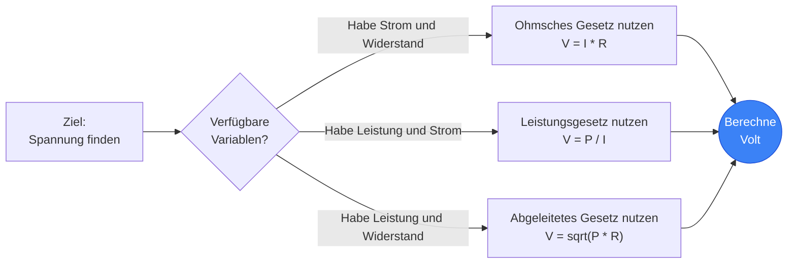
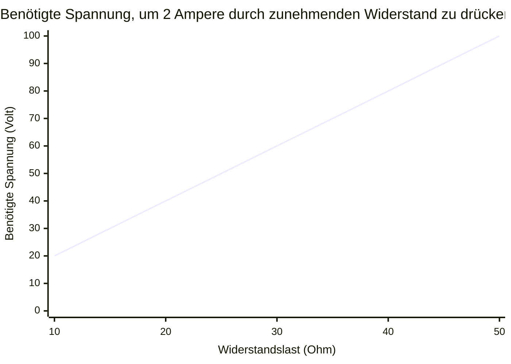
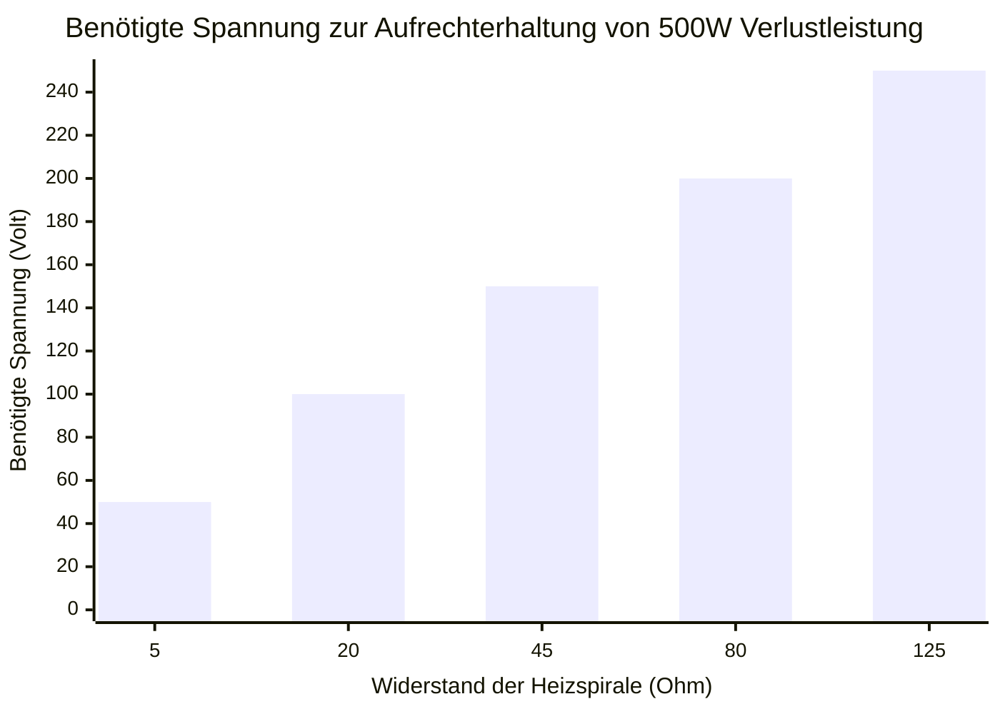
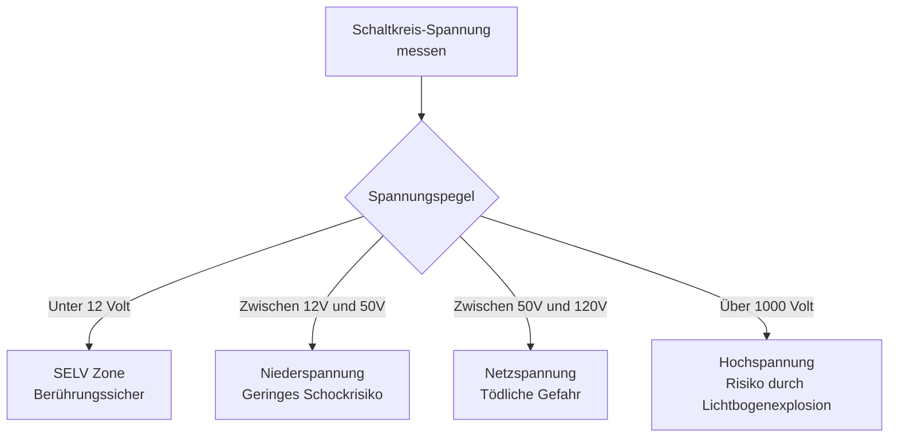

# Der ultimative Spannungsrechner: Beherrschung des elektrischen Potentials und des Schaltungsdrucks

Willkommen beim ultimativen **Spannungsrechner** und umfassenden Physikleitfaden. Ganz gleich, ob Sie ein Ingenieur für eingebettete Systeme sind, der versucht, eine verrauschte industrielle $24\text{V}$-Versorgung für einen empfindlichen $5\text{V}$-Mikrocontroller herunterzutransformieren, ein Elektromeister, der den Abfall im $120\text{V}$-Netz überprüft, oder ein Bastler, der den Ladezustand eines LiPo-Akkus kontrolliert – diese interaktive Suite liefert die exakten mathematischen Ableitungen, die Sie benötigen.

Die Spannung ist die grundlegende treibende Kraft in der gesamten Elektronik. Ohne Spannung bewegen sich keine Elektronen, fließt kein Strom und es wird niemals Leistung übertragen. 

In diesem umfassenden 4.000+ Wörter umfassenden SEO-Leitfaden werden wir die Physik der elektrischen Potentialdifferenz rigoros entschlüsseln, die mathematischen Grenzen des Ohmschen Gesetzes ($U = I \cdot R$) und der Leistungsformel ($U = P/I$) erforschen, die internationalen Sicherheitsstandards für Hochspannung (HV) entschlüsseln und fünf detaillierte elektrische Szenarien analysieren, die visuell durch interaktive, parser-sichere Mermaid.js-Diagramme dargestellt werden.

---

## 1. Was genau ist Spannung? (Die physikalische Definition)

**Spannung**, wissenschaftlich als *elektrische Potentialdifferenz* oder *elektromotorische Kraft (EMK)* bezeichnet, ist der grundlegende "Druck", der elektrische Ladungen durch eine leitende Schleife drückt. 

Um Spannung intuitiv zu verstehen, verlassen sich Elektroingenieure weltweit auf die **Wasserrohr-Analogie**:
- Stellen Sie sich einen massiven Wasserturm vor. Die physische Höhe des Wasserturms bestimmt den Wasserdruck durch die Schwerkraft unten.
- **Spannung ist der Wasserdruck.** 
- Wenn Sie eine massive $500.000\text{V}$ Übertragungsleitung haben, gibt es einen erstaunlichen elektrischen "Druck", der gewaltsam versucht, Elektronen durch jeden verfügbaren Pfad zur Erde zu drücken.
- Wenn Sie eine winzige $1,5\text{V}$ AA-Batterie haben, haben Sie einen sehr geringen Druck, der nur in der Lage ist, ein Rinnsal von Elektronen durch eine kleine LED zu schieben.

Die offizielle SI-Einheit für Spannung ist das **Volt ($\text{V}$)**, benannt nach dem wegweisenden italienischen Physiker Alessandro Volta. Streng thermodynamisch definiert ist $1\text{ Volt}$ die Menge an elektrischem Potential, die genau $1\text{ Joule}$ Arbeit erfordert, um genau $1\text{ Coulomb}$ elektrischer Ladung zu bewegen. ($1\text{V} = 1\text{J} / 1\text{C}$).

---

## 2. Ableitung der Spannung aus dem Ohmschen Gesetz ($U = I \cdot R$)

Georg Simon Ohm bewies, dass die Spannung mathematisch in einer Dreiecksbeziehung mit Stromstärke ($I$) und Widerstand ($R$) fest verknüpft ist. 

$$U = I \cdot R$$

Das bedeutet, dass Sie den Spannungsabfall an jedem Bauteil leicht berechnen können, wenn Sie den durchfließenden Strom und seinen Eigenwiderstand kennen.
- **Wenn der Widerstand steigt**, aber der Strom gleich bleibt, muss der Spannungsabfall an diesem Bauteil gestiegen sein.
- **Wenn der Strom steigt**, aber der Widerstand gleich bleibt, muss der Spannungsabfall proportional steigen.

Diese exakte mathematische Beziehung ist die Art und Weise, wie "Spannungsteiler" funktionieren. Indem Sie zwei Widerstände in Reihe schalten, können Sie absichtlich einen bestimmten Betrag der Spannung über dem ersten Widerstand "abfallen" lassen, sodass für den Rest Ihrer Schaltung eine perfekt niedrigere, heruntergeteilte Spannung zur Verfügung steht.

---

## 3. Ableitung der Spannung aus der elektrischen Leistung ($U = P / I$)

Während das Ohmsche Gesetz den Fluss der Elektronen bestimmt, bestimmt das Leistungsgesetz die thermodynamische Leistungsabgabe.

$$P = U \cdot I$$

Indem wir die Spannung ($U$) algebraisch isolieren, erhalten wir zwei unglaublich leistungsstarke Ingenieursformeln:
1. **Spannung abgeleitet aus Leistung und Stromstärke:** $U = \frac{P}{I}$
2. **Spannung abgeleitet aus Leistung und Widerstand:** $U = \sqrt{P \cdot R}$

Diese Formeln sind von entscheidender Bedeutung für die Berechnung der Betriebsspannung von Geräten, wenn Sie nur deren Leistung in Watt kennen. Wenn Sie beispielsweise wissen, dass ein massiver industrieller Heizer $4.600\text{ Watt}$ Wärme ableitet und seine interne Heizspirale genau $50\ \Omega$ Widerstand aufweist, können Sie sofort berechnen, dass er für den Betrieb ein $480\text{V}$ Industrienetz benötigt: $U = \sqrt{4600 \cdot 50} = \sqrt{230000} \approx 480\text{V}$.

---

## 4. AC vs. DC Spannung verstehen

Spannung manifestiert sich je nach Stromerzeugungsquelle in zwei völlig unterschiedlichen Formaten:

### Gleichspannung (DC - Direct Current)
In DC-Systemen (Batterien, Solarmodule, USB-Ladegeräte) ist die Spannung konstant. Sie wirkt wie eine Wasserpumpe, die beständig in eine einzige Richtung drückt. Eine $12\text{V}$-Autobatterie wird kontinuierlich $12\text{V}$ auf einer perfekt flachen Linie abgeben, bis sich die Chemie der Batterie physisch erschöpft.

### Wechselspannung (AC - Alternating Current)
In AC-Systemen (Steckdosen, Strommasten, Lichtmaschinen) ist die Spannung hochdynamisch. Sie verhält sich wie ein Kolben, der drückt und zieht. Die Spannung steigt kontinuierlich auf einen positiven Spitzenwert, fällt auf Null und kehrt sich dann auf einen negativen Spitzenwert um, üblicherweise $50$- bis $60$-mal jede Sekunde ($50\text{Hz}$ / $60\text{Hz}$).
Da sich die AC-Spannung ständig ändert, verwenden Ingenieure den **Effektivwert (RMS - Root Mean Square)**, um sie zu beschreiben. Wenn Sie eine Lampe in eine US-Standard-Steckdose mit "$120\text{V}$" einstecken, sind $120\text{V}$ lediglich der RMS-Durchschnitt. Die tatsächliche AC-Spannungswelle spitzt sich ständig auf einen gewaltigen Spitzenwert von fast $170\text{V}$ zu!

---

## 5. Die internationalen Spannungssicherheitsstufen

Spannung ist es, was den natürlichen elektrischen Widerstand der menschlichen Haut durchbricht. Je höher die Spannung, desto leichter kann ein tödlicher Strom durch Ihre Epidermis dringen und Ihr Herz stoppen. Aus diesem Grund kategorisieren internationale Aufsichtsbehörden die Spannungspegel streng:

1. **SELV (Sicherheitskleinspannung - unter $12\text{V}$):** Dieser Spannung fehlt der Druck, um menschliche Haut zu durchdringen. Sie können die Anschlüsse einer $9\text{V}$-Batterie oder eines $5\text{V}$-USB-Kabels ohne jegliche Gefahr eines Stromschlags physisch berühren.
2. **Niederspannung ($50\text{V}$ bis $1.000\text{V}$):** Dies deckt Ihre üblichen $120\text{V}$- und $230\text{V}$-Haushaltssteckdosen ab. Es hat definitiv genug Druck, um in die Haut einzudringen und tödliche Ströme zu liefern. Eine schwere Gummiisolierung ist gesetzlich vorgeschrieben.
3. **Hochspannung ($1.000\text{V}$ bis $35.000\text{V}$):** Wird in lokalen Verteilungsleitungen verwendet. Diese Spannung ist so hoch, dass sie tatsächlich "Überspringen" oder einen Lichtbogen durch die Luft bilden kann. Sie müssen den Draht nicht einmal berühren; wenn Sie auf wenige Zentimeter herankommen, wird die Spannung die Luft ionisieren und Sie wie ein Blitz treffen.
4. **Höchstspannung (über $35.000\text{V}$):** Wird in massiven Überlandstrommasten verwendet (oft $500.000\text{V}$). Die Lichtbogendistanz ist beängstigend und erfordert massive Glasisolatoren und extreme Turmhöhen, um zu verhindern, dass die Spannung direkt in den Boden springt.

---

## 6. Umfassendes Benutzerhandbuch: Maximierung des Rechners

Unser interaktiver Spannungsrechner fungiert als fortschrittliches Digitalmultimeter und ermöglicht Ihnen den nahtlosen Wechsel zwischen Ableitungen des Ohmschen Gesetzes und der Leistungsformel.

### Schritt 1: Wählen Sie Ihre bekannten Variablen
Verwenden Sie die oberen Navigationsregisterkarten, um auszuwählen, welche Variablen Sie derzeit haben:
- **Gegebene Stromstärke & Widerstand ($U = I \cdot R$):** Perfekt für das Standard-Leiterplattendesign.
- **Gegebene Leistung & Stromstärke ($U = P / I$):** Perfekt zur Dimensionierung von Netzteilen.
- **Gegebene Leistung & Widerstand ($U = \sqrt{P \cdot R}$):** Ideal zur Analyse von Heizelementen.

### Schritt 2: Nutzen Sie die Batterie- & System-Voreinstellungen
Wenn Sie einen Stromkreis um eine echte, standardisierte Stromquelle entwerfen, klicken Sie einfach auf eine unserer 13 Voreinstellungen. Die Auswahl der **$12\text{V}$ Autobatterie** oder des **$20\text{V}$ USB-C PD Ladegeräts** lädt sofort die genauen Spannungsparameter vor und ordnet die dynamischen Ausgangskurven als Referenz zu.

### Schritt 3: Beobachten Sie das animierte digitale Voltmeter
Während Sie die Eingaben anpassen, sehen Sie, wie das digitale LCD-Multimeter-Display dynamisch reagiert. Die integrierte Nadelanzeige ist stark farbcodiert basierend auf den internationalen Sicherheitsstufen. Wenn Ihre berechnete Spannung $50\text{V}$ überschreitet, wechselt die Anzeige in die orange/roten Gefahrenzonen, wodurch Sie visuell gewarnt werden, dass der Stromkreis strenge OSHA-Sicherheitsrichtlinien und schwere Drahtisolierungen erfordert.

---

## 7. Fünf konzeptionelle Ingenieur-Szenarien mit 2D-Visualisierungen

Um die mathematischen Beziehungen der Spannung vollständig zu beherrschen, werden wir fünf unterschiedliche physikalische Szenarien untersuchen, die visuell anhand von benutzerdefinierten Mermaid.js-Diagrammen aufgeschlüsselt sind.

### Beispiel 1: Die algebraischen Spannungsableitungen

**Das Szenario:**
Ein Elektrotechnik-Student benötigt eine schnelle Visualisierung, wie Spannung mathematisch aus Stromstärke ($I$), Widerstand ($R$) und Leistung ($P$) in verschiedenen Aufgabensätzen abgeleitet werden kann.

**2D-Visualisierung:**
Dieses Logik-Flussdiagramm ordnet die drei verschiedenen mathematischen Pfade zur Berechnung der Spannung zu, abhängig von den bekannten Variablen, die in einer Prüfung bereitgestellt werden.

---

### Beispiel 2: Lineare Spannung vs. Widerstand (konstanter Strom)

**Das Szenario:**
Sie haben einen LED-Treiber mit Konstantstrom, der unabhängig von der Last genau $2\text{A}$ Strom durch einen Stromkreis drückt. Wie viel Spannungsdruck muss das Netzteil erzeugen, wenn Sie verschiedene Widerstände austauschen, um diesen Durchfluss von $2\text{A}$ aufrechtzuerhalten?

**Die Mathematik:**
Da $I = 2$, $U = 2 \cdot R$.
- Bei $10\ \Omega$: $U = 2 \cdot 10 = 20\text{V}$
- Bei $50\ \Omega$: $U = 2 \cdot 50 = 100\text{V}$

**2D-Visualisierung:**
Dieses Diagramm zeigt die perfekt geradlinige Kennlinie einer Konstantstromquelle, die gewaltsam die Spannung hochfährt, um den steigenden Widerstand zu überwinden.

---

### Beispiel 3: Die Quadratwurzel-Spannungskurve (konstante Leistung)

**Das Szenario:**
Sie entwerfen eine Industrieheizung, die genau $500\text{W}$ Wärmeleistung abgeben muss. Sie testen verschiedene Widerstandsheizspulen. Welche Spannung ist für jede Spule erforderlich, um genau $500\text{W}$ zu erreichen?

**Die Mathematik:**
Wir verwenden die abgeleitete Formel $U = \sqrt{P \cdot R}$. Da $P = 500$, ist $U = \sqrt{500 \cdot R}$.
- Bei $5\ \Omega$: $U = \sqrt{2500} = 50\text{V}$
- Bei $20\ \Omega$: $U = \sqrt{10000} = 100\text{V}$

**2D-Visualisierung:**
Im Gegensatz zum linearen Diagramm des Ohmschen Gesetzes zeigt dieses Balkendiagramm die aggressive Quadratwurzelkurve, die erforderlich ist, um eine konstante Wattzahl bei sich änderndem Widerstand aufrechtzuerhalten.

---

### Beispiel 4: Spannungssicherheit und Isolationsklassifizierung

**Das Szenario:**
Ein Sicherheitsinspektor der Industrie kategorisiert verschiedene Stromsysteme innerhalb einer Fabrik, um zu bestimmen, welche Leitungen eine schwere Gummiisolierung und Warnschilder erfordern.

**2D-Visualisierung:**
Dieses Top-Down-Flussdiagramm kategorisiert gängige elektrische Systeme streng nach ihrem Stromschlagrisikopotenzial.

---

### Beispiel 5: Zeitplan für die Prüfung des Spannungsabfalls in der Fabrik

**Das Szenario:**
Ein Elektromeister wurde beauftragt, eine riesige Fabrik auf "Spannungsabfall" zu prüfen. Wenn Drähte über Hunderte von Metern verlegt werden, verursacht der innere Widerstand des Kupferdrahtes selbst einen Spannungsabfall, bevor der Strom überhaupt die Maschinen erreicht.

**2D-Visualisierung:**
Dieses Gantt-Diagramm skizziert den strengen Prüfplan für Feldtests, um den Spannungsabfall von der Hauptschalttafel bis zum am weitesten entfernten Roboterarm am Fließband zu messen.

```mermaid
gantt
    title Zeitplan für Fabrik-Spannungsabfallprüfung
    dateFormat  HH:mm:ss
    axisFormat  %H:%M:%S
    
    section Panel Audit
    Spannung am Hauptschalter messen :done, 00:00:00, 30s
    Basislinie bei 480V protokollieren :active, 00:00:30, 15s
    
    section Feld Audit
    Zum entferntesten Roboter gehen :active, 00:00:45, 45s
    Spannung am Roboter-Eingang messen :crit, 00:01:30, 30s
    
    section Analyse
    Gesamten Kabelwiderstand berechnen :active, 00:02:00, 30s
    Bestimmen ob Abfall unter 3 Prozent liegt :milestone, 00:02:30, 10s
```

---

## 8. Fazit und Ingenieurs-Herausforderung

Die Beherrschung der Spannung ist der erste obligatorische Schritt zur Vorherrschaft in der Elektrotechnik. Jede Batterie, die Sie verwenden, jedes USB-Kabel, das Sie einstecken, und jede Steckdose, mit der Sie interagieren, arbeitet nach den strengen, unerbittlichen mathematischen Gesetzen der elektrischen Potentialdifferenz. 

Wenn Sie die Spannung respektieren und Ihre Parameter genau berechnen, laufen Ihre Schaltkreise perfekt kühl und effizient. Wenn Sie die Spannung unterschätzen, riskieren Sie durchgebrannte Kondensatoren, geschmolzenes Silizium und ein katastrophales thermisches Durchgehen (Thermal Runaway).

Um sicherzustellen, dass Sie diese Konzepte verinnerlicht haben, starten Sie unseren interaktiven Simulator und versuchen Sie, diese abschließenden Herausforderungen zu lösen:
1. **Das lange Verlängerungskabel:** Ein Bauunternehmer verwendet ein massives $300\text{ Fuß}$ langes Verlängerungskabel mit einem inneren Gesamtwiderstand von $4\ \Omega$. Seine Kreissäge zieht einen starken Strom von $15\text{A}$. Berechnen Sie den exakten Spannungsabfall, der an das Kabel verloren geht ($U = I \cdot R$). Wird seine Säge noch genug Spannung aus der $120\text{V}$-Steckdose übrig haben, um zu laufen?
2. **Die Raumheizung:** Eine industrielle $4.600\text{W}$ Raumheizung hat eine Heizspirale mit genau $50\ \Omega$ Widerstand. Berechnen Sie die benötigte Spannung, um sie zu betreiben, indem Sie $U = \sqrt{P \cdot R}$ verwenden. 
3. **Der Mikrocontroller:** Sie haben einen $5\text{V}$-Arduino-Mikrocontroller, der $0,25\text{W}$ Leistung verbraucht. Berechnen Sie genau, wie viel Stromstärke ($I$) er aus dem USB-Anschluss zieht.

Verlassen Sie sich auf diesen Rechner, um Ihre Mathematik zu überprüfen, respektieren Sie die internationalen Sicherheitsgrenzwerte und denken Sie immer daran: Die Spannung ist der Druck, der Ihre Schaltkreise zum Leben erweckt.
