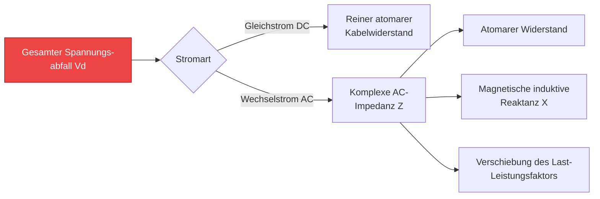
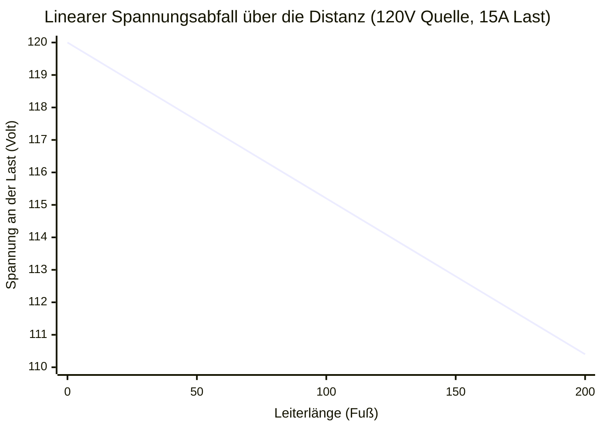
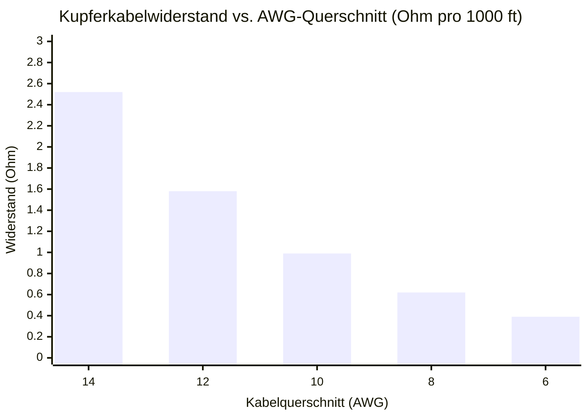
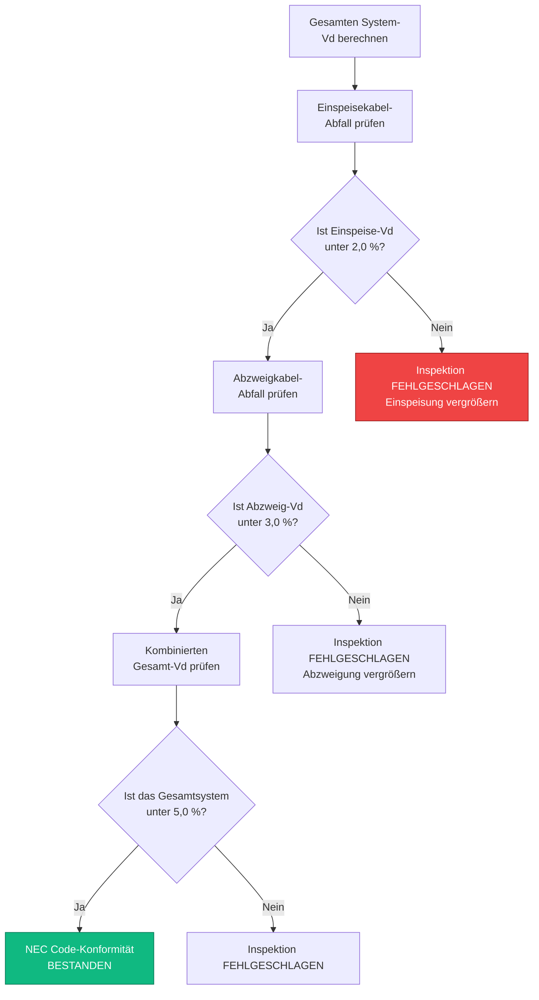
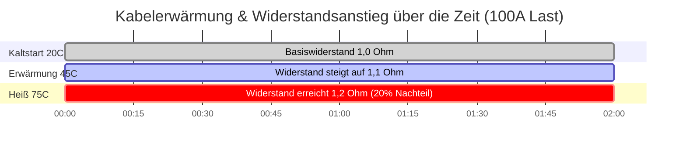

# Der ultimative Spannungsabfall-Rechner: Kabeldimensionierung, NEC-Konformität und AC/DC-Physik

Willkommen beim ultimativen **Spannungsabfall-Rechner** und Ingenieur-Meisterkurs. Egal, ob Sie als Elektriker versuchen, Einspeisekabel richtig zu dimensionieren, um die strengen Beschränkungen des National Electrical Code (NEC) Artikel 210 zu erfüllen, als Solar-PV-Ingenieur lange DC-Stränge entwerfen, um die Verluste des Ladereglers zu minimieren, oder als Kfz-Techniker eine fehlerhafte 12V-Seilwindenverkabelung überprüfen – die Beherrschung der Physik des Spannungsabfalls ist unerlässlich.

Der Spannungsabfall ist der stille Killer von elektrischen Systemen. Er drosselt Anlassermotoren, löst Unterspannungsabschaltungen von Wechselrichtern aus, erzeugt gefährliche thermische Hitze in Wänden und verringert aggressiv die Effizienz von Beleuchtungssystemen.

In diesem ausführlichen 4.000+ Wörter umfassenden SEO-Leitfaden werden wir die Physik des $V_{drop}$ aggressiv dekonstruieren, die gravierenden Unterschiede zwischen dem DC-Widerstand und der AC-induktiven Reaktanz untersuchen, die mathematischen Auswirkungen der Leitertemperatur ($75^\circ\text{C}$ vs. $90^\circ\text{C}$) detailliert beschreiben und die genaue Logik hinter den NEC-Schwellenwerten von 3 % und 5 % für die Einhaltung der Konformität entschlüsseln. Um diese Konzepte zu festigen, haben wir fünf akribisch detaillierte, Parser-sichere interaktive Mermaid.js-Diagramme eingefügt.

---

## 1. Was genau ist der Spannungsabfall?

**Spannungsabfall** ($V_{drop}$) ist der messbare Verlust an elektrischem Potenzial (Volt), wenn Strom von einer Stromquelle zu einer Last fließt.

Nach der fundamentalen Physik ist kein Kabel ein perfekter Leiter. Selbst reines Kupfer und Silber besitzen einen inneren atomaren Widerstand. Wenn elektrischer Strom (Ampere) durch diesen inneren Widerstand (Ohm) gezwungen wird, diktiert das Ohmsche Gesetz, dass eine Spannung verbraucht wird:
$$V = I \cdot R$$

Wenn Ihre Stromquelle $120\text{V}$ ausgibt und die $100\text{ Fuß}$ lange Kupferleitung, die sie mit Ihrer Last verbindet, $4\text{V}$ Potenzial verbraucht, um die Elektronen anzutreiben, erhält Ihr Gerät nur $116\text{V}$.

Die im Kabel verlorene Energie verschwindet nicht einfach; sie wird gemäß der Physik der Jouleschen Erwärmung gewaltsam in thermische Energie (Wärme) umgewandelt ($P_{loss} = I^2 \cdot R$). Wenn der Spannungsabfall zu stark ist, schmilzt das Kabel seine eigene Isolierung und löst einen elektrischen Brand aus.

---

## 2. Die universellen Formeln für den Spannungsabfall

Die für die Berechnung des Kabelverlusts erforderliche Mathematik hängt vollständig von der Art des Stromkreises ab. Gleichstromkreise (DC) haben nur mit atomarem Widerstand zu kämpfen, während Wechselstromkreise (AC) zusätzlich gegen die elektromagnetische induktive Reaktanz ($X$) und die Phasenverschiebungen des Leistungsfaktors ($\cos\phi$) ankämpfen müssen.

### 2-Leiter-DC-Stromkreise
Bei Batteriekabeln, Solarmodulen und Kfz-Verkabelungen besteht der Stromkreis aus zwei Leitern (positiv und negativ). Daher muss der Strom die volle Distanz *zweimal* zurücklegen (hin und zurück).
$$V_{drop} = 2 \cdot I \cdot R_{\text{one-way}}$$

### 1-Phasen-AC-Stromkreise (120V / 240V)
Für Standard-Wandsteckdosen und Haushaltsgeräte müssen wir die AC-Impedanz ($Z$) des Kabels einkalkulieren, die den DC-Widerstand mit dem magnetischen Widerstand des Wechselstroms kombiniert, der sich $60\text{ Mal}$ pro Sekunde abwechselt.
$$V_{drop} = 2 \cdot I \cdot L \cdot (R \cos\phi + X \sin\phi)$$

### 3-Phasen-AC-Stromkreise (480V L-L)
Bei massiven gewerblichen und industriellen Motorlasten führt die 3-Phasen-Mathematik die Konstante der Quadratwurzel aus 3 ein.
$$V_{drop} = \sqrt{3} \cdot I \cdot L \cdot (R \cos\phi + X \sin\phi)$$

*(Wobei $L$ die Distanz ist, $R$ der Widerstand pro Längeneinheit, $X$ die Reaktanz pro Längeneinheit und $\cos\phi$ der Leistungsfaktor der Last).*

---

## 3. Die Grenzwerte zur Einhaltung des National Electrical Code (NEC)

Der NEC verlangt aus Sicherheitsgründen keine strengen Grenzwerte für den Spannungsabfall (die Regeln zur Strombelastbarkeit von Kabeln regeln die Brandsicherheit), jedoch empfiehlt er aus Effizienz- und Langlebigkeitsgründen für Geräte nachdrücklich strenge Grenzen.

### Die NEC 3 % / 5 % Regel (Informativer Hinweis 210.19)
- **Abzweigstromkreise:** Der maximal zulässige Spannungsabfall für den Abzweigstromkreis (das Kabel vom Sicherungskasten zur Wandsteckdose) sollte **3,0 %** nicht überschreiten.
- **Gesamtsystem (Einspeisung + Abzweig):** Der gesamte Spannungsabfall vom Hauptzähler über die Zuleitungen des Unterverteilers bis hin zur endgültigen Steckdose sollte **5,0 %** nicht überschreiten.

**Beispiel:**
Für eine standardmäßige $120\text{V}$-Haushaltssteckdose bedeutet ein Spannungsabfall-Limit von $3\%$ (bzw. $3\,\%$), dass das Kabel nicht mehr als $3,6\text{V}$ verlieren darf. Das Gerät muss mindestens $116,4\text{V}$ erhalten, um effizient zu arbeiten.

Wenn Sie einen $20\text{A}$-Stromkreis zu einer $150\text{ Fuß}$ entfernten, freistehenden Garage verlegen, wird das Standard-12-AWG-Kabel diese Anforderung gnadenlos verfehlen. Sie werden mathematisch gezwungen sein, den Kabelquerschnitt auf dicke 10 AWG oder sogar 8 AWG zu erhöhen, nur um die 3%-Grenze für den Spannungsabfall zu erfüllen.

---

## 4. Die extreme Gefahr von 12V-Kfz- und Solarsystemen

Der Spannungsabfall ist in Niederspannungs-DC-Systemen (wie 12V-Wohnmobilbatterien und Kfz-Verkabelungen) deutlich gefährlicher als in Hochspannungs-120V-Systemen für den Haushalt.

**Die Mathematik des proportionalen Verlusts:**
Der Verlust von $3\text{V}$ an Potenzial auf einer $120\text{V}$-Leitung ist ein mikroskopischer Verlust von **2,5 %**. Das Licht wird kaum merklich dunkler.
Der Verlust von $3\text{V}$ an Potenzial bei einer $12\text{V}$-Kfz-Seilwinde ist ein massiver Verlust von **25,0 %**!

Wenn ein 12V-Anlassermotor nur $9\text{V}$ erhält, verliert er sein magnetisches Drehmoment, zieht zum Ausgleich exponentiell höhere Ampere und verbrennt in kurzer Zeit seine internen Kupferwicklungen. Aus diesem Grund sind Kfz-Batterie-Starthilfekabel so unglaublich dick (2 AWG oder 0 AWG); sie müssen den Widerstand bei $300\text{ Ampere}$ Strom minimieren.

---

## 5. Temperaturkorrekturfaktor des Leiters ($\alpha$)

Elektriker ignorieren routinemäßig die Temperatur und gehen davon aus, dass der Kabelwiderstand statisch ist. Dies ist ein kritischer Konstruktionsfehler.
Wenn sich ein Kupferkabel unter hoher Last oder in einem heißen Dachboden ($90^\circ\text{C}$) erwärmt, behindern die atomaren Schwingungen im Metall physisch den Elektronenfluss und erhöhen den Widerstand des Kabels drastisch.

**Die Formel für den thermischen Widerstand:**
$$R_{hot} = R_{cold} \cdot [1 + \alpha (T_{hot} - T_{cold})]$$
Für Kupfer beträgt der Temperaturkoeffizient ($\alpha$) $0,00393$.

Ein Kupferkabel, das in einem Schutzrohr bei sengenden $75^\circ\text{C}$ betrieben wird, hat einen **21 % höheren Widerstand** als ein Kabel, das sich bei kühlen $20^\circ\text{C}$ Raumtemperatur befindet. Unser fortschrittlicher Rechner bezieht diesen thermischen Nachteil konsequent mit ein, um sicherzustellen, dass Ihre Kabel nicht bei sommerlichen Spitzenlasten versagen.

---

## 6. Fünf konzeptionelle Ingenieursszenarien mit 2D-Visualisierungen

Um die mathematischen Beziehungen, die den Spannungsverlust bestimmen, vollständig zu beherrschen, werden wir fünf verschiedene elektrische Szenarien untersuchen, die mit benutzerdefinierten Mermaid.js-Diagrammen visuell aufgeschlüsselt werden.

### Beispiel 1: Die Physik des Spannungsabfalls

**Das Szenario:**
Ein Elektrikerlehrling muss genau verstehen, wie das elektrische Potenzial durch physikalische Phänomene im Inneren des Kabels zerstört wird.

**2D-Visualisierung:**
Dieses logische Flussdiagramm trennt den atomaren DC-Widerstand von der komplexeren elektromagnetischen AC-Reaktanz und den Nachteilen des Leistungsfaktors.

---

### Beispiel 2: Spannungsabfall über die Distanz

**Das Szenario:**
Ein Solarinstallateur verlegt ein 10 AWG Kabel über $200\text{ Fuß}$ zu einer abgelegenen Brunnenpumpe. Er muss visualisieren, wie schnell die Spannung abfällt, wenn das Kabel länger wird.

**Die Mathematik:**
Da $V_{drop} = I \cdot R$ und der Widerstand direkt proportional zur Länge ist, fällt die Spannung über die Distanz perfekt linear ab.

**2D-Visualisierung:**
Dieses Diagramm zeigt die perfekte gerade Linie des Spannungsabfalls, während sich die Kabelstrecke von $0$ auf $200\text{ Fuß}$ verlängert.

---

### Beispiel 3: AWG-Querschnitt vs. Leiterwiderstand

**Das Szenario:**
Ein Ingenieur versucht, einen Kunden davon zu überzeugen, von einem 12 AWG Kabel auf ein viel dickeres 8 AWG Kabel umzusteigen, um ein gravierendes Problem mit dem Spannungsabfall zu lösen.

**Die Mathematik:**
Das American Wire Gauge (AWG)-System ist logarithmisch. Kleinere Zahlen bedeuten radikal dickere Kabel und einen deutlich geringeren Widerstand.

**2D-Visualisierung:**
Dieses Balkendiagramm veranschaulicht den massiven, umgekehrten Abfall von Ohm pro $1000\text{ Fuß}$, wenn Sie die Kabeldicke von dünnen 14 AWG auf dicke 6 AWG erhöhen.

---

### Beispiel 4: Logik zur Einhaltung der NEC-Vorschriften

**Das Szenario:**
Ein Elektroinspektor überprüft Baupläne, um sicherzustellen, dass ein neuer gewerblicher Abzweigstromkreis und eine Unterverteiler-Einspeisung die strengen NEC-$210.19$-Grenzwerte einhalten.

**2D-Visualisierung:**
Dieses Top-Down-Flussdiagramm bildet die genauen mathematischen Überprüfungen ab, die erforderlich sind, um eine elektrische Inspektion auf maximale Effizienz zu bestehen.

---

### Beispiel 5: Ansammlung des thermischen Widerstands

**Das Szenario:**
Ein Motor mit hoher Stromstärke zieht viel Strom, wodurch sich das Kupferkabel im Inneren eines geschlossenen Schutzrohrs langsam von kalten $20^\circ\text{C}$ auf sengende $75^\circ\text{C}$ erhitzt.

**2D-Visualisierung:**
Dieses Gantt-Diagramm skizziert den stetigen, beängstigenden Anstieg des Spannungsabfalls, da die thermische Wärme den atomaren Widerstand des Kupfers über mehrere Stunden kontinuierlicher Belastung erhöht.

---

## 7. Fazit und Ingenieurs-Herausforderung

Die Beherrschung der Physik des Spannungsabfalls ist der absolute Schlüssel zum Entwurf sicherer, codekonformer und hocheffizienter elektrischer Systeme. Wenn Sie die Mathematik des Kabelwiderstands ignorieren, werden Ihre Motoren überhitzen, Ihre LED-Leuchten werden flackern, Ihre Solarmodule werden ihre Ausbeute verschwenden und Ihre Sicherungskästen werden wie riesige Heizlüfter wirken.

Denken Sie immer daran: Die Erhöhung Ihres Kabelquerschnitts ist eine Vorabinvestition, die sich langfristig durch eine massive Energieeffizienz und eine längere Lebensdauer der Geräte auszahlt.

Um sicherzustellen, dass Sie diese Konzepte beherrschen, starten Sie unseren interaktiven Simulator und versuchen Sie, diese letzten Herausforderungen zu lösen:
1. **Der lange Weg:** Sie müssen $15\text{A}$ bei $120\text{V}$ zu einem Schuppen in $250\text{ Fuß}$ Entfernung leiten. Berechnen Sie den genauen prozentualen Spannungsabfall mit einem 10 AWG Kabel. Erfüllt es die NEC 3%-Regel?
2. **Die Seilwinde:** Eine 12V-Jeep-Seilwinde zieht bei maximaler Belastung $400\text{A}$. Wenn die Batterie $6\text{ Fuß}$ entfernt ist ($12\text{ Fuß}$ Gesamtschleife), welches AWG-Kabel wird benötigt, um den Spannungsabfall unter $0,5\text{V}$ zu halten?
3. **Der thermische Nachteil:** Ein gewerbliches Kupfer-Einspeisekabel verliert bei Raumtemperatur ($20^\circ\text{C}$) $4,0\text{V}$. Berechnen Sie den Abfall neu, wenn das Kabel seine maximale Nenntemperatur von $90^\circ\text{C}$ erreicht.

Verlassen Sie sich auf diesen Rechner, um Ihre Berechnungen zu überprüfen, Ihre Kabeldimensionierung zu kontrollieren und immer sicherzustellen, dass Ihre elektrischen Lasten die Leistung erhalten, die sie mathematisch verdienen.
