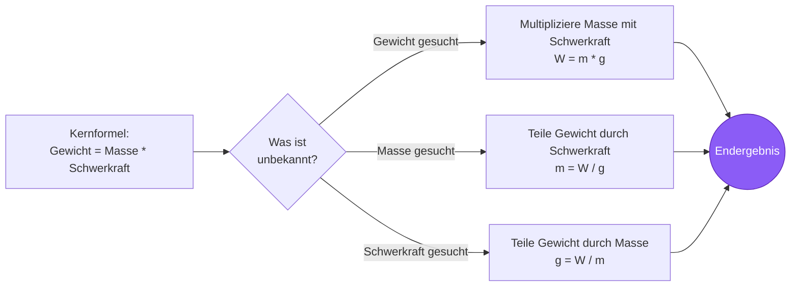
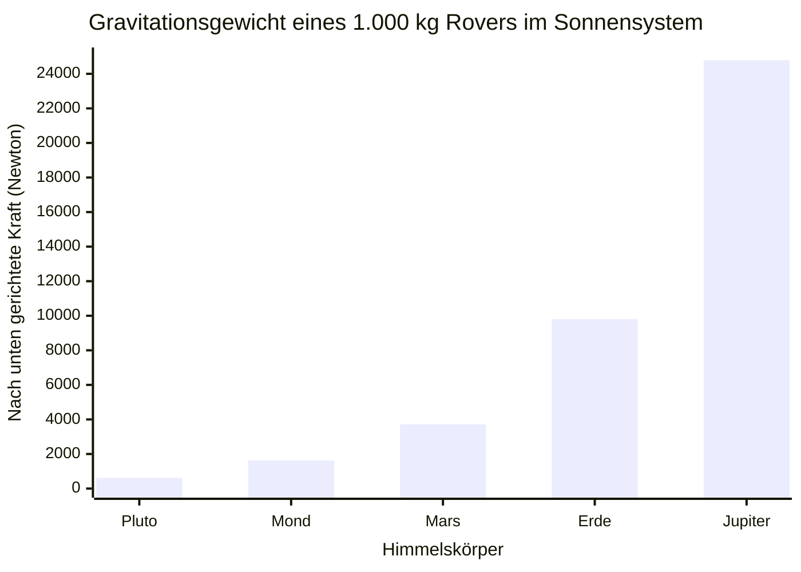
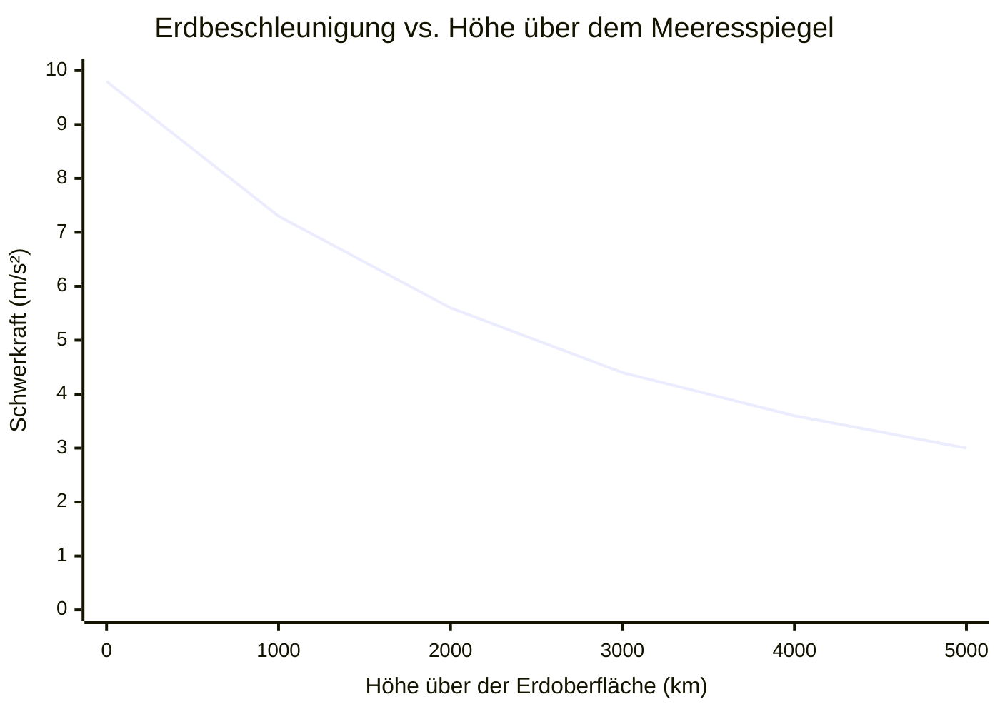

# Der ultimative Gewichtsrechner: Schwerkraft, Masse und planetare Kräfte meistern

Willkommen beim ultimativen **Gewichtsrechner** und umfassenden Astrophysik-Leitfaden. Egal, ob Sie ein Physikschüler sind, der versucht, den grundlegenden Unterschied zwischen Masse und Gewicht zu verstehen, ein Luft- und Raumfahrtingenieur, der das Schub-zu-Gewicht-Verhältnis der Nutzlast für eine Mondlandung berechnet, oder ein Astronomie-Enthusiast, der sich fragt, wie schwer er sich bei einem Spaziergang auf dem Jupiter fühlen würde – dieses Tool liefert genau die exakten physikalischen Umrechnungen, die Sie benötigen.

Das Gewicht ($W$) ist eines der am meisten missverstandenen Konzepte im Alltag. Wenn wir auf eine Personenwaage steigen, sagen wir, dass wir unser „Gewicht“ in Kilogramm messen. In der strengen, unerbittlichen Welt der klassischen Physik ist dies jedoch völlig falsch. Masse und Gewicht sind zwei radikal unterschiedliche physikalische Eigenschaften.

In diesem ausführlichen, für SEO optimierten Leitfaden mit über 4.000 Wörtern werden wir die Gewichtsformel ($W = mg$) detailliert dekonstruieren. Wir werden die invariante Natur der Masse untersuchen, Newtons allgemeines Gravitationsgesetz entschlüsseln, die erdrückende Schwerkraft des Jupiter und der Sonne berechnen und fünf detaillierte konzeptionelle Physikszenarien analysieren, die durch interaktive Mermaid.js-Diagramme visuell dargestellt werden.

---

## 1. Das Gewicht definieren: Die nach unten gerichtete Kraft der Schwerkraft

In der klassischen Newtonschen Mechanik ist das **Gewicht** ($W$) streng definiert als die nach unten gerichtete vektorielle Kraft, die von einem lokalen Gravitationsfeld auf die Masse eines Objekts ausgeübt wird.

$$ W = m \cdot g $$

### Masse vs. Gewicht: Der ultimative Unterschied
Um dies intuitiv zu begreifen, müssen Sie die „Menge des Materials“ von der „Zugkraft auf das Material“ trennen.
- **Masse ($m$):** Eine intrinsische skalare Eigenschaft, die die Gesamtmenge an Materie in einem Objekt misst. Sie ändert sich niemals, egal wo im Universum Sie sich befinden. Ein $70\text{ kg}$ schwerer Mensch wiegt auf der Erde, auf dem Mars, auf dem Mond und schwebend im tiefen interstellaren Raum exakt $70\text{ kg}$.
- **Gewicht ($W$):** Eine variable vektorielle Kraft. Sie hängt vollständig von der Erdbeschleunigung ($g$) des Planeten ab, auf dem Sie stehen. Das Gewicht ändert sich sofort, wenn Sie zwischen Himmelskörpern reisen.

### Standard-SI-Einheiten für das Gewicht
Da das Gewicht eine *Kraft* ist, ist seine korrekte Standard-SI-Einheit das **Newton** ($\text{N}$), benannt nach Sir Isaac Newton.
$$ 1\text{ Newton} = 1\text{ kg} \cdot 1\text{ m/s}^2 $$

Wenn Sie sich auf eine in Kilogramm kalibrierte Personenwaage stellen, misst die Waage eigentlich die nach unten gerichtete Kraft (Newton), die Ihr Körper auf ihre internen Federn ausübt. Sie dividiert diese Kraft dann heimlich durch die Standard-Erdschwerkraft ($9,81\text{ m/s}^2$), um Ihre Masse in Kilogramm auf dem digitalen Bildschirm anzuzeigen.
Wenn Sie exakt dieselbe Personenwaage mit auf den Mond nehmen würden, würde sie Ihnen sagen, dass Sie ungefähr $11\text{ kg}$ „wiegen“ – was physikalisch inkorrekt ist. Ihre Masse beträgt immer noch $70\text{ kg}$; die Gravitationskraft, die Sie auf die Waage zieht, ist einfach sechsmal schwächer!

---

## 2. Erdschwerkraft vs. Planetare Schwerkraft

Die Standard-Schwerkraft auf der Erdoberfläche ($g_0$) ist international festgelegt als:
$$ g = 9.80665\text{ m/s}^2 $$
Für fast alle Anwendungen in den Ingenieurwissenschaften und Physik-Hausaufgaben wird dies auf **$9,81\text{ m/s}^2$** gerundet.

### Berechnung der planetaren Schwerkraft
Woher kommen diese $9,81$? Sie leiten sich direkt aus **Newtons allgemeinem Gravitationsgesetz** ab. Die Schwerkraft auf der Oberfläche jedes kugelförmigen Himmelskörpers hängt vollständig von zwei Faktoren ab: der Masse des Planeten ($M$) und dem Radius des Planeten ($r$).

$$ g = \frac{G \cdot M}{r^2} $$
*(Wobei $G = 6,674 \times 10^{-11}\text{ N}\cdot\text{m}^2/\text{kg}^2$)*

Da der Jupiter unvorstellbar massiv ist, beträgt seine Oberflächenschwerkraft rund $24,79\text{ m/s}^2$ (das $2,5$-Fache der Erde). Da der Mond klein und relativ leicht ist, beträgt seine Oberflächenschwerkraft nur $1,62\text{ m/s}^2$ ($1/6$ der Erde).

---

## 3. Scheinbares Gewicht und Aufzugsphysik

Ihr „wahres Gewicht“ ($W = mg$) ändert sich nie, solange Sie auf der Erdoberfläche bleiben. Ihr **scheinbares Gewicht** – wie schwer Sie sich *fühlen* – kann sich jedoch aufgrund Ihrer vertikalen Beschleunigung dramatisch ändern.

Das scheinbare Gewicht ist einfach die *Normalkraft* ($F_N$), die nach oben gegen Ihre Füße drückt. 
- **Stillstehen:** $F_N = m \cdot g$. Sie fühlen sich normal.
- **Aufzug beschleunigt nach oben:** Der Boden drückt härter gegen Ihre Füße, um Ihre Masse nach oben zu beschleunigen. $F_N = m(g + a)$. Sie fühlen sich vorübergehend schwerer.
- **Aufzug beschleunigt nach unten:** Der Boden sinkt unter Ihren Füßen weg. $F_N = m(g - a)$. Sie fühlen sich vorübergehend leichter.
- **Freier Fall (Kabel reißen):** Der Aufzug fällt mit $g$. $F_N = m(g - g) = 0$. Sie erleben Zero-G-Schwerelosigkeit, obwohl die Schwerkraft immer noch an Ihnen zieht!

Genau aus diesem Grund fühlen sich Astronauten auf der Internationalen Raumstation schwerelos. Sie befinden sich nicht in der „Schwerelosigkeit“ – die Erdschwerkraft in dieser Höhe ist immer noch zu $90\%$ so stark wie auf Meereshöhe! Sie bewegen sich nur so schnell seitwärts ($17.500\text{ mph}$), dass die Erde unter ihnen wegkrümmt, während sie auf die Erde zufallen. Sie befinden sich in einem Zustand ständigen, kontinuierlichen freien Falls.

---

## 4. Umfassende Bedienungsanleitung: Den Rechner optimal nutzen

Unser interaktiver Gewichtsrechner funktioniert wie ein robuster Astrophysik-Simulator.

### Schritt 1: Wählen Sie Ihr Berechnungsziel
Verwenden Sie die obere Navigation, um Ihre unbekannte Variable auszuwählen:
- **Gewicht ($W$):** Sie kennen Masse und Schwerkraft. (Standard-Newtonsche Mechanik).
- **Masse ($m$):** Sie kennen Gewicht und Schwerkraft. (Ermitteln der Masse aus einer Kraftbelastung).
- **Schwerkraft ($g$):** Sie kennen Masse und Gewicht. (Berechnung des Gravitationsfeldes eines unbekannten Planeten).

### Schritt 2: Nutzen Sie den Astronauten-Planeten-Voreinstellungsmodus
Überspringen Sie die manuelle Eingabe der Schwerkraft, indem Sie aus unseren 10 integrierten Sonnensystem-Voreinstellungen wählen. Möchten Sie genau wissen, wie viel ein $5.000\text{ kg}$ schwerer Mars-Rover wiegen wird, wenn er im Jezero-Krater landet? Wählen Sie im Dropdown-Menü „Mars“ aus, und der Rechner fügt sofort $g = 3,71\text{ m/s}^2$ ein, um die Marskraft zu berechnen.

### Schritt 3: Interpretieren Sie das logarithmische Gewichtsmessgerät
Unsere radiale Kraftskala setzt Ihr Ergebnis sofort in den richtigen Kontext:
- **Mikrokräfte:** $0\text{N}$ bis $1.000\text{N}$ (Menschen, Rucksäcke, Kleingeräte).
- **Makrokräfte:** $1\text{kN}$ bis $1.000\text{kN}$ (Autos, Lastwagen, Elefanten, Kleinflugzeuge).
- **Megakräfte:** $1\text{MN}$ bis $100\text{MN}$+ (Wolkenkratzer, Kreuzfahrtschiffe, Saturn-V-Raketen).

---

## 5. Fünf konzeptionelle Ingenieursszenarien mit 2D-Visualisierungen

Um die Beziehungen zwischen Masse, Kraft, Schwerkraft und Kinematik vollständig zu meistern, werden wir fünf verschiedene Physikszenarien untersuchen, die mithilfe von benutzerdefinierten Mermaid.js-Diagrammen visuell aufgeschlüsselt werden.

### Beispiel 1: Die Logik der W=mg-Formel (Lösen nach Variablen)

**Das Szenario:**
Ein Physikstudent im ersten Semester muss die algebraischen Permutationen der Gewichtsformel ($W = mg$) schnell visualisieren, um drei verschiedene Testfragen zu lösen.

**2D-Visualisierung:**
Dieses logische Flussdiagramm veranschaulicht die klassische Technik zur Variablenisolierung.



---

### Beispiel 2: Das interplanetare Gewichtsspektrum

**Das Szenario:**
Sie entwerfen einen Rover mit Druckkabine. Er hat eine statische, invariante Masse von $1.000\text{ kg}$. Sie müssen die Federung entwerfen. Wie viel Gravitationskraft werden diese Federn auf verschiedenen Planeten in unserem Sonnensystem erfahren?

**2D-Visualisierung:**
Dieses Balkendiagramm zeigt die extremen Schwankungen der Gewichtskraft auf fünf Himmelskörpern für genau denselben $1.000\text{ kg}$ schweren Rover. Beachten Sie das erdrückende Gewicht auf dem Jupiter im Vergleich zur federleichten Präsenz auf dem Pluto!



---

### Beispiel 3: Physik des scheinbaren Gewichts im Aufzug

**Das Szenario:**
Eine $80\text{ kg}$ schwere Person steht auf einer Waage in einem Wolkenkratzeraufzug. Wir müssen genau darstellen, was die Waage anzeigt (ihr scheinbares Gewicht), abhängig vom Beschleunigungszustand der Aufzugskabine.

**2D-Visualisierung:**
Dieses Flussdiagramm visualisiert die Vektoraddition von Schwerkraft und Aufzugsbeschleunigung, um die endgültige Normalkraft ($F_N$) zu bestimmen, die die Person spürt.

```mermaid
flowchart TD
    A[80 kg Person im<br/>Aufzug] --> B{Aufzugs-<br/>zustand}
    
    B -->|Beschleunigt nach oben (+a)| C[F_N = m(g + a)<br/>Waage zeigt > 784 N]
    B -->|Konstante Geschwindigkeit| D[F_N = m(g)<br/>Waage zeigt = 784 N]
    B -->|Beschleunigt nach unten (-a)| E[F_N = m(g - a)<br/>Waage zeigt < 784 N]
    B -->|Kabel reißen (a = -g)| F[F_N = m(g - g)<br/>Waage zeigt = 0 N]
    
    C --> G((Fühlt sich<br/>schwer an))
    D --> H((Fühlt sich<br/>normal an))
    E --> I((Fühlt sich<br/>leicht an))
    F --> J((Schwereloser<br/>freier Fall))
    
    style G fill:#ef4444,color:#fff
    style H fill:#10b981,color:#fff
    style I fill:#f59e0b,color:#fff
    style J fill:#6366f1,color:#fff
```

---

### Beispiel 4: Gravitationsabfallkurve (Umlaufbahn vs. Oberfläche)

**Das Szenario:**
Viele Menschen glauben fälschlicherweise, dass es im Weltraum „keine Schwerkraft“ gibt. Nach Newtons Gesetz ($g \propto 1/r^2$) nimmt die Schwerkraft sanft ab, je weiter man sich vom Erdmittelpunkt entfernt; sie schaltet sich nicht einfach ab. Betrachten wir die Erdschwerkraft an der Oberfläche ($r = 6.371\text{ km}$) im Vergleich zur Höhe.

**Die Mathematik:**
- Oberfläche ($0\text{ km}$): $g = 9,81\text{ m/s}^2$
- ISS-Umlaufbahn ($400\text{ km}$): $g = 8,69\text{ m/s}^2$ (immer noch $89\%$ der Oberflächenschwerkraft!)
- Hoher Orbit ($5.000\text{ km}$): $g = 3,08\text{ m/s}^2$

**2D-Visualisierung:**
Dieses Diagramm stellt die reziprok quadratische Abnahme der Erdbeschleunigung bei zunehmender Höhe dar.



---

### Beispiel 5: Startsequenz einer Weltraumrakete (Schub vs. Gewicht)

**Das Szenario:**
Eine massive SpaceX-Rakete steht auf der Startrampe. Sie hat eine Masse von $1.000.000\text{ kg}$, was ihr ein Gravitationsgewicht von $9.810.000\text{ Newton}$ verleiht. Um den Boden zu verlassen, müssen die Triebwerke eine Schubkraft erzeugen, die diesen massiven Gewichtsvektor strikt übersteigt. Während der Treibstoff verbrennt, nimmt die Masse ab, wodurch der Gewichtsvektor schrumpft, was die Beschleunigung massiv erhöht.

**2D-Visualisierung:**
Dieses Gantt-Diagramm skizziert die chronologische physikalische Zeitleiste einer Rakete, die den Startturm passiert und in Max-Q drängt.

```mermaid
gantt
    title Start einer Orbitalrakete: Schub-vs-Gewicht-Sequenz
    dateFormat s
    axisFormat %S
    section Vor dem Start
    Triebwerkszündung :active, 0, 5s
    Schub baut sich auf, aber Schub < Gewicht :active, 5s, 8s
    section Abheben
    Schub übersteigt Gewicht (T over W Greater Than 1) :crit, done, 8s, 10s
    Turm passiert (beschleunigt) :done, 10s, 15s
    section Flug
    Treibstoffverbrennung (Gewicht nimmt schnell ab) :active, 15s, 40s
    Maximaler aerodynamischer Druck (Max-Q) :milestone, 40s, 45s
```

---

## 6. Häufig gestellte Fragen (FAQ) im Detail

**F: Warum fallen Dinge unabhängig von ihrem Gewicht mit derselben Geschwindigkeit?**
**A:** Dies wurde bekanntermaßen von Galileo und später vom Apollo-15-Astronauten David Scott bewiesen, der einen Hammer und eine Feder auf dem Mond fallen ließ. Obwohl die Schwerkraft *stärker* an einer schweren Bowlingkugel zieht als an einer leichten Murmel, hat die Bowlingkugel auch viel mehr *Masse* (Trägheit), was es schwieriger macht, sie zu beschleunigen. Das genaue Verhältnis von Kraft zu Masse entspricht immer $9,81\text{ m/s}^2$. Daher fallen im Vakuum ohne Luftwiderstand alle Objekte mit exakt der gleichen Geschwindigkeit!

**F: Wie wiegen wir die Erde?**
**A:** Wir „wiegen“ die Erde nicht (weil es nichts gibt, worauf sie sitzen könnte), aber wir können ihre *Masse* berechnen. Da wir die Erdschwerkraft ($9,81$), den Erdradius ($6.371\text{ km}$) und die Gravitationskonstante ($G$) kennen, können wir mithilfe der Formel $g = GM/r^2$ algebraisch nach $M$ auflösen. Die Masse der Erde beträgt atemberaubende $5,972 \times 10^{24}\text{ kg}$!

**F: Wenn der Jupiter vollständig aus Gas besteht, wie hat er dann Schwerkraft?**
**A:** Schwerkraft wird durch *Masse* erzeugt, unabhängig davon, ob diese Masse aus festem Gestein, flüssigem Wasser oder Wasserstoffgas besteht. Der Jupiter enthält so viel stark komprimiertes Wasserstoff- und Heliumgas, dass seine Gesamtmasse $318$-mal größer ist als die der Erde, was eine immense Gravitationsanziehung erzeugt.

**F: Kann die Schwerkraft jemals negativ sein?**
**A:** In der klassischen Standardphysik nicht. Die Schwerkraft ist strikt eine anziehende Kraft, die durch positive Masse erzeugt wird. In der modernen Kosmologie wirkt das Konzept der „Dunklen Energie“ jedoch als abstoßende Kraft, die die beschleunigte Expansion des Universums vorantreibt und mathematisch wie eine Antigravitation auf galaktischer Ebene funktioniert.

**F: Was ist eine Kilogramm-Kraft (kgf)?**
**A:** Es handelt sich um eine veraltete, Nicht-SI-Einheit der Kraft. Eine Kilogramm-Kraft ist definiert als die Gravitationskraft, die durch die Standard-Erdschwerkraft auf ein Kilogramm Masse ausgeübt wird. Daher ist $1\text{ kgf} = 9,80665\text{ Newton}$. Das moderne Ingenieurwesen verwendet ausschließlich Newton, um eine Verwechslung von Masse und Kraft zu vermeiden.

---

## 7. Fazit und Ingenieurs-Herausforderung

Das Gewicht ist die unsichtbare Leine, die uns an die Erde fesselt. Es bestimmt die strukturelle Gestaltung jedes Gebäudes, die Triebwerksdimensionierung jedes Flugzeugs und die Orbitalmechanik des Kosmos.

Um diese physikalischen Konzepte wirklich zu meistern, nutzen Sie unseren Gewichtsrechner, um die folgenden konzeptionellen Herausforderungen zu lösen:

1. **Der interplanetare Tourist:** Sie stellen sich auf der Erde auf eine Personenwaage, die $80\text{ kg}$ anzeigt. Sie reisen zum Mars ($g = 3,71\text{ m/s}^2$). Was wird exakt dieselbe Waage anzeigen, wenn Sie sich in der Marswüste darauf stellen?
2. **Der Asteroiden-Sprung:** Sie landen mit Ihrem Raumschiff auf dem Asteroiden Ceres ($g = 0,28\text{ m/s}^2$). Ihr Raumanzug und Ihr Körper haben zusammen eine Masse von $150\text{ kg}$. Wie groß ist Ihre gesamte nach unten gerichtete Gewichtskraft in Newton auf Ceres?
3. **Der fallende Aufzug:** Die Kabel einer leeren, $500\text{ kg}$ schweren Aufzugskabine reißen, und sie fällt frei. Wie groß ist die gesamte Normalkraft, die zwischen dem Boden des Aufzugs und einer $10\text{ kg}$ schweren Kiste, die sich darin befindet, wirkt?

Experimentieren Sie mit dem Simulator, analysieren Sie die planetaren Variationen und verlassen Sie sich auf diesen Rechner, um die entscheidende Unterscheidung zwischen invarianter Masse und der mächtigen Vektorkraft des Gewichts dauerhaft zu klären.
