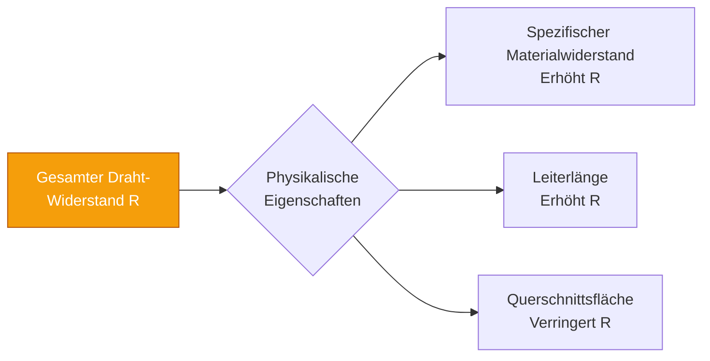
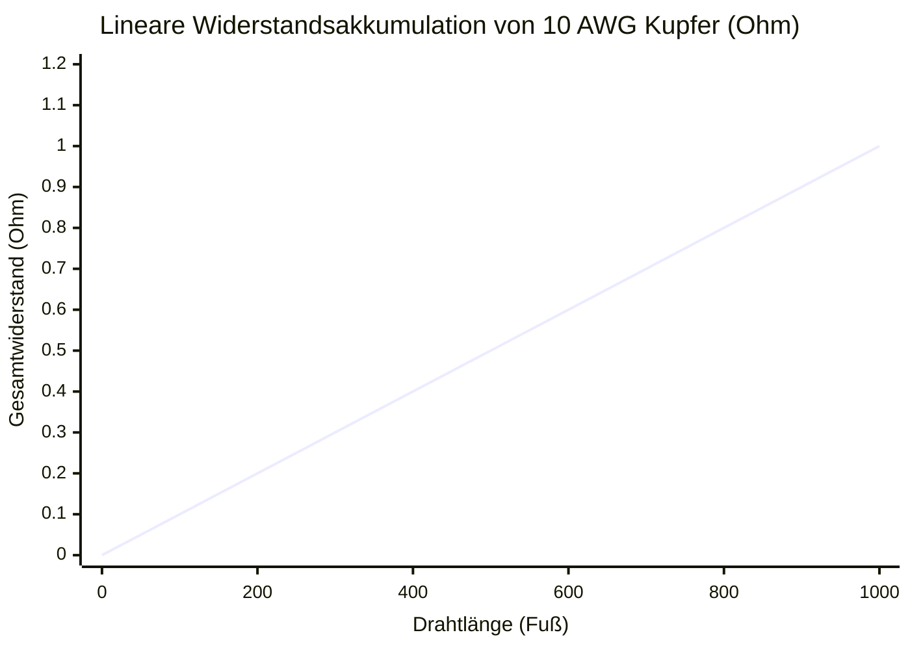
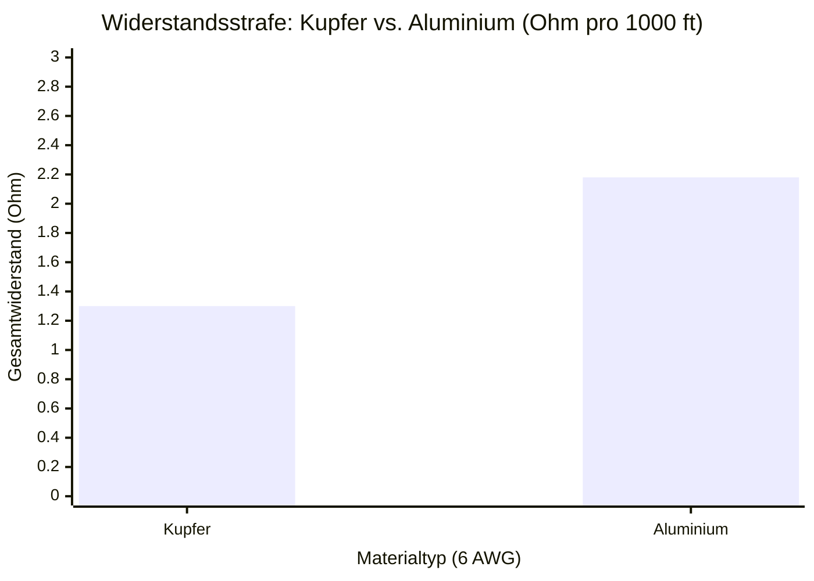
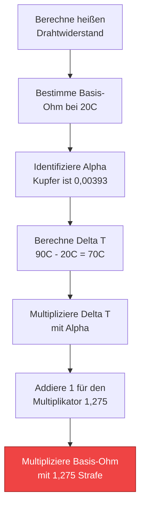
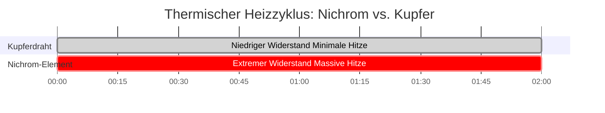

# Der definitive Leitungswiderstands-Rechner: R = ρL/A, AWG-Mathematik und thermische Verluste

Willkommen beim ultimativen **Leitungswiderstands-Rechner** und umfassenden Physik-Leitfaden. Egal, ob Sie als Elektroingenieur 4/0 AWG Kupferzuleitungen für einen Industriemotor dimensionieren, als Solartechniker die verheerenden DC-Leitungsverluste in langen String-Verläufen berechnen oder als Materialwissenschaftsstudent den thermischen Ausfall von Aluminiumleitern untersuchen – die Beherrschung der Physik des Leitungswiderstands ist nicht verhandelbar.

Der elektrische Widerstand ist kein theoretisches Konzept; er ist ein physikalisches Hindernis. Er wandelt Ihre teure elektrische Energie in ungenutzte thermische Wärme ($P = I^2 \cdot R$) um, zerstört die Systemeffizienz, verursacht katastrophale Spannungsabfälle und löst, wenn ignoriert, elektrische Brände aus.

In dieser ausführlichen, 4.000+ Wörter umfassenden SEO-Meisterklasse werden wir die fundamentale $R = \rho L/A$ Gleichung dekonstruieren, die gravierenden Unterschiede zwischen Kupfer und Aluminium mathematisch aufzeigen, das logarithmische American Wire Gauge (AWG) System entschlüsseln und die bedrohlichen Auswirkungen der Leitererwärmung (den Temperaturkoeffizienten $\alpha$) tiefgehend analysieren. Um diese kritischen technischen Konzepte zu festigen, haben wir fünf minutiös detaillierte, parser-sichere interaktive Mermaid.js-Diagramme eingefügt.

---

## 1. Was genau ist der Leitungswiderstand?

Der **Leitungswiderstand** ($R$, mathematisch gemessen in Ohm $\Omega$) ist der strikte physikalische Widerstand, den ein metallischer Leiter dem Fluss des elektrischen Stroms (Elektronen) entgegensetzt.

Selbst die leitfähigsten Metalle der Erde – Silber und Kupfer – sind nicht perfekt. Wenn Billionen von Elektronen durch eine Spannungsquelle gewaltsam durch einen Kupferdraht geschoben werden, kollidieren sie heftig mit den vibrierenden Kupferatomen im metallischen Gitter. Jede einzelne Kollision vernichtet einen winzigen Bruchteil der Vorwärtsbewegung des Elektrons und wandelt diese kinetische Energie direkt in thermische Wärme um.

Diese kollektive, mikroskopische Reibung ist das, was wir als **elektrischen Widerstand** messen.

---

## 2. Die universelle Widerstandsgleichung ($R = \rho L / A$)

Der Widerstand jedes physikalischen Objekts wird von drei unveränderlichen geometrischen und materiellen Faktoren bestimmt, die in der grundlegenden Gleichung der Elektrophysik perfekt zusammengefasst sind:

$$R = \frac{\rho \cdot L}{A}$$

### Die drei Faktoren:
1. **Spezifischer Materialwiderstand ($\rho$):** Der intrinsische, chemische Widerstand des Metalls selbst. Silber hat den niedrigsten spezifischen Widerstand und ist daher der beste Leiter. Kupfer liegt an zweiter Stelle. Aluminium ist ein weit entfernter Dritter und Eisen ist schrecklich. Der spezifische Widerstand wird in Ohm-Metern ($\Omega\cdot m$) gemessen.
2. **Leiterlänge ($L$):** Der Widerstand ist streng proportional zur Distanz. Wenn man die Länge eines Drahtes verdoppelt, zwingt man die Elektronen, doppelt so viele atomare Kollisionen zu durchlaufen. Daher verdoppelt sich der Widerstand exakt.
3. **Querschnittsfläche ($A$):** Der Widerstand ist streng *umgekehrt* proportional zur Dicke des Drahtes. Wenn man die physikalische Fläche des Drahtes verdoppelt, bietet man doppelt so viele Pfade für die Elektronen an, was den Widerstand effektiv halbiert.

---

## 3. Die Ingenieursdebatte: Kupfer vs. Aluminium

Beim Entwurf riesiger Stromnetze sind Ingenieure gezwungen, zwischen den beiden primären Leitern zu wählen: **Kupfer (Cu)** und **Aluminium (Al)**.

### Die Physik von Kupfer
Kupfer ist der Goldstandard der elektrischen Verkabelung (ironischerweise ist es tatsächlich ein besserer Leiter als Gold). Sein spezifischer Widerstand ($\rho$) ist unglaublich niedrig und beträgt $1,68 \times 10^{-8} \ \Omega\cdot m$. Es ist physikalisch stark, sehr oxidationsbeständig und lässt sich biegen, ohne zu brechen.

### Die Physik von Aluminium
Aluminium ist der König der Übertragungsleitungen von Energieversorgern. Sein spezifischer Widerstand beträgt $2,82 \times 10^{-8} \ \Omega\cdot m$. Da sein spezifischer Widerstand deutlich höher ist, **hat ein Aluminiumdraht etwa 68% mehr elektrischen Widerstand als ein Kupferdraht der exakt gleichen Größe.**

Warum nutzt das Stromnetz dann Aluminium? **Gewicht und Kosten.**
Aluminium ist radikal billiger als Kupfer und exponentiell leichter ($2,70 \text{ g/cm}^3$ vs. $8,96 \text{ g/cm}^3$). Bei Hochspannungs-Freileitungsmasten, die sich über Meilen erstrecken, wäre ein Kupferkabel so schwer, dass es die Stahlmasten, die es tragen, physikalisch zerbrechen würde.

*Ingenieur-Faustregel:* Um exakt den gleichen elektrischen Widerstand wie ein Kupferdraht zu erreichen, muss ein Aluminiumdraht um zwei AWG-Größen dicker gewählt werden (z. B. ersetzen Sie 10 AWG Kupfer durch 8 AWG Aluminium).

---

## 4. Die logarithmische Mathematik des AWG-Systems

Das **American Wire Gauge (AWG)** System ist für neue Ingenieure oft zutiefst verwirrend, da es mathematisch rückwärts und streng logarithmisch aufgebaut ist.

Im AWG-System steht eine **kleinere** Zahl für einen **dickeren** Draht mit **niedrigerem** Widerstand.
- 14 AWG ist ein dünner Draht, der für stromsparende $15\text{A}$ Beleuchtungskreise verwendet wird.
- 4 AWG ist ein massives, dickes Kabel, das für schwere $60\text{A}$ Elektroauto-Ladegeräte verwendet wird.

Da das System logarithmisch ist, verdoppelt sich jedes Mal, wenn die AWG-Zahl um 3 sinkt (z. B. von 10 AWG auf 7 AWG), die Querschnittsfläche des Drahtes exakt und sein elektrischer Widerstand wird exakt halbiert.

---

## 5. Die thermische Widerstandsstrafe ($\alpha$)

Dies ist der Punkt, an dem Amateur-Ingenieure scheitern. Der elektrische Widerstand ist **nicht statisch**. Er ändert sich drastisch basierend auf der Temperatur des Drahtes.

Wenn sich ein Kupferdraht erwärmt (entweder durch heiße Sommersonne oder durch die innere thermische Reibung, wenn er starken Strom führt), vibrieren die Kupferatome viel aggressiver. Diese aggressiven Vibrationen führen dazu, dass Elektronen viel häufiger kollidieren, was den elektrischen Widerstand des Drahtes weiter in die Höhe treibt.

### Die thermische Korrekturformel:
$$R_{\text{heiß}} = R_{\text{kalt}} \cdot [1 + \alpha (T_{\text{heiß}} - T_{\text{kalt}})]$$

Wobei $\alpha$ der Temperaturkoeffizient des Widerstands ist. Für Kupfer gilt $\alpha = 0,00393 \ /^\circ\text{C}$.

**Die Gefahr:**
Wenn Sie Ihren Leitungswiderstand in einem angenehm klimatisierten $20^\circ\text{C}$ Raum berechnen, diesen Draht aber auf einem brühend heißen $75^\circ\text{C}$ Dachboden installieren, wird der Draht einen um **21% höheren Widerstand** aufweisen, als Ihre Baupläne vorsahen. Diese massive Strafe wird zu schweren Spannungsabfällen und unerwartetem Auslösen von Schutzschaltern führen.

---

## 6. Fünf konzeptionelle Ingenieursszenarien mit 2D-Visualisierungen

Um die physikalischen Beziehungen, die den Leitungswiderstand bestimmen, vollständig zu beherrschen, werden wir fünf verschiedene Ingenieursszenarien untersuchen, die mithilfe maßgeschneiderter Mermaid.js-Diagramme visuell aufgeschlüsselt werden.

### Beispiel 1: Die Physik des Widerstands

**Das Szenario:**
Ein Ingenieurstudent muss visualisieren, wie die drei physikalischen Eigenschaften (Länge, Querschnitt, Material) mathematisch zusammenwirken, um den gesamten ohmschen Widerstand zu erzeugen.

**2D-Visualisierung:**
Dieses Logik-Flussdiagramm trennt die grundlegenden Komponenten der $R = \rho L / A$ Gleichung und zeigt, welche Elemente den Gesamtwiderstand erhöhen oder verringern.

---

### Beispiel 2: Widerstand vs. Drahtlänge (Lineare Akkumulation)

**Das Szenario:**
Ein Techniker wickelt $1000\text{ Fuß}$ eines 10 AWG Kupferdrahtes ab und muss verstehen, wie sich der Widerstand über extreme Entfernungen aufbaut.

**Die Mathematik:**
Da $R$ streng proportional zu $L$ ist, fügt jeder Fuß Draht exakt die gleiche mikroskopische Menge an Widerstand hinzu und bildet eine perfekte lineare Steigung.

**2D-Visualisierung:**
Dieses Diagramm stellt die perfekt gerade Linie des sich aufbauenden Widerstands dar, während sich der 10 AWG Kupferdraht von $0$ bis $1000\text{ Fuß}$ erstreckt.

---

### Beispiel 3: Kupfer vs. Aluminium Widerstandsstrafe

**Das Szenario:**
Ein Auftragnehmer möchte Geld sparen, indem er 6 AWG Kupferzuleitungen gegen billigere 6 AWG Aluminiumzuleitungen austauscht. Er muss die exakte Widerstandsstrafe dieser Entscheidung sehen.

**Die Mathematik:**
Aluminium hat einen spezifischen Widerstand von $2,82 \times 10^{-8} \ \Omega\cdot m$ im Vergleich zu Kupfers $1,68 \times 10^{-8} \ \Omega\cdot m$. Dies führt zu einem massiven Widerstandsanstieg von 68% bei gleicher physikalischer Dicke.

**2D-Visualisierung:**
Dieses Balkendiagramm veranschaulicht drastisch die schwere Widerstandsstrafe bei identischen AWG-Größen im Vergleich von Kupfer zu Aluminium.

---

### Beispiel 4: Logik der thermischen Widerstandsstrafe

**Das Szenario:**
Ein Hochstrom-Industriemotor wird in einem abgedichteten Rohr betrieben und erhitzt den Kupferdraht von $20^\circ\text{C}$ auf $90^\circ\text{C}$. Der Inspektor muss die thermische Widerstandsstrafe berechnen.

**2D-Visualisierung:**
Dieses Top-Down-Flussdiagramm bildet die exakten mathematischen Schritte ab, die erforderlich sind, um den drastischen thermischen Widerstandsmultiplikator mithilfe des Temperaturkoeffizienten ($\alpha$) zu berechnen.

---

### Beispiel 5: Heizzyklus von Nichrom vs. Kupfer

**Das Szenario:**
Vergleich der absichtlichen Widerstandserwärmung eines Nichrom-Toasterelements mit der unabsichtlichen Widerstandserwärmung eines Kupfer-Verlängerungskabels während eines 2-stündigen Schwerlastzyklus.

**2D-Visualisierung:**
Dieses Gantt-Diagramm skizziert das sehr unterschiedliche thermische Verhalten von hochohmigem Nichrom (das entwickelt wurde, um extreme Hitze zu erzeugen) im Vergleich zu niederohmigem Kupfer.

---

## 7. Fazit und Ingenieursherausforderung

Die Beherrschung der physikalischen Parameter des Leitungswiderstands ($R = \rho L / A$) ist das Fundament der gesamten Elektrotechnik. Wenn Sie den spezifischen Widerstand von Materialien respektieren, Ihre AWG-Stärke für lange Strecken großzügig dimensionieren und Ihre thermischen Temperaturstrafen immer mathematisch berechnen, werden Ihre Stromkreise eiskalt und unendlich effizient laufen.

Wenn Sie diese Physik ignorieren, werden Ihre Drähte heftige Joulesche Wärme ($I^2 \cdot R$) erzeugen, die das Spannungspotential zerstört und die Isolierung schmilzt.

Um sicherzustellen, dass Sie diese Konzepte gemeistert haben, starten Sie unseren interaktiven Simulator und versuchen Sie, diese letzten Herausforderungen zu lösen:
1. **Der Aluminium-Tausch:** Sie haben $500\text{ Fuß}$ 8 AWG Kupferdraht. Wenn Sie diesen gegen 8 AWG Aluminiumdraht austauschen, wie hoch ist die exakte numerische Zunahme des ohmschen Widerstands?
2. **Die thermische Kernschmelze:** Ein 4 AWG Kupferdraht hat einen Basiswiderstand von $0,815 \ \Omega$ bei $20^\circ\text{C}$. Berechnen Sie seinen exakten Widerstand, wenn er sich auf einem Dachboden auf $75^\circ\text{C}$ erhitzt.
3. **Die Flächen-Mathematik:** Wenn Sie von 12 AWG auf 9 AWG wechseln, was genau passiert mit der physikalischen Querschnittsfläche, und was genau passiert mit dem Widerstand?

Verlassen Sie sich auf diesen Rechner, um Ihre Mathematik zu überprüfen, Ihre Drahtdimensionierung zu kontrollieren und immer sicherzustellen, dass Ihre elektrischen Leiter ihre thermischen Umgebungen überstehen.
