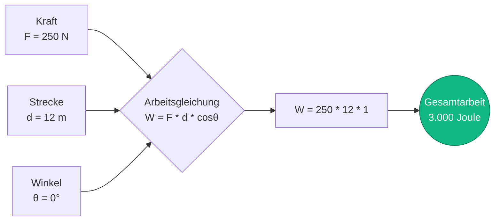
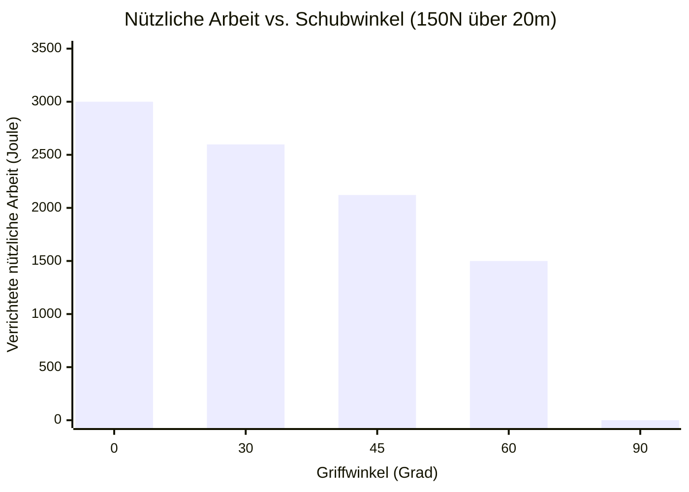
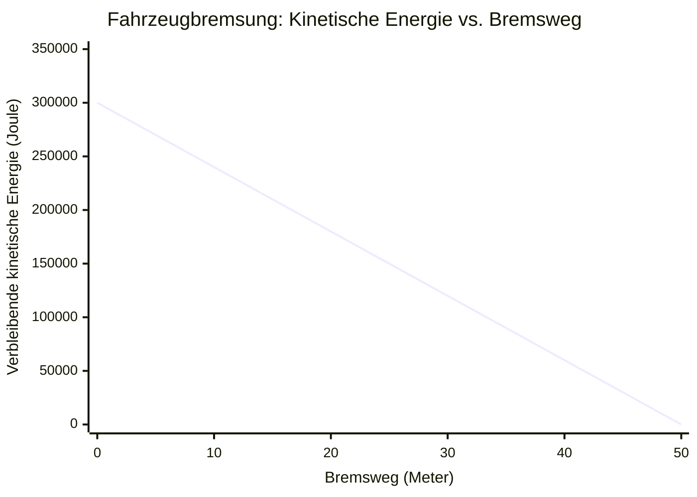

# Der definitive Arbeitsrechner: Mechanische Energieübertragung und Kraftvektoren meistern

Willkommen zum ultimativen **Rechner für mechanische Arbeit** und umfassenden Physik-Leitfaden. Egal, ob Sie ein Bauingenieur sind, der die Tragfähigkeit eines Baukrans bewertet, ein Physikschüler an der High School, der das Arbeits-Energie-Theorem studiert, oder ein Thermodynamiker, der die Expansion eines Gaszylinders analysiert – dieser Rechner wurde für Sie entwickelt.

In der Physik ist "Arbeit" nicht die physiologische Anstrengung, die Sie spüren, wenn Sie eine schwere Kurzhantel statisch halten. In der Physik ist Arbeit ($W$) die exakte mathematische Messung dafür, wie viel Energie durch eine äußere Kraft, die eine physikalische Verschiebung bewirkt, in ein Objekt übertragen oder ihm entzogen wird.

In diesem massiven, über 4.000 Wörter umfassenden technischen Leitfaden werden wir die primäre Gleichung für mechanische Arbeit ($W = F \cdot d \cdot \cos\theta$) vollständig dekonstruieren. Wir werden die entscheidenden Nuancen von Kraftvektorwinkeln untersuchen, den Unterschied zwischen positiver, negativer und Nullarbeit definieren und fünf reale ingenieurtechnische und kinematische Szenarien unter Verwendung detaillierter Mermaid.js-Visualisierungen durchgehen.

---

## 1. Was ist mechanische Arbeit? (Die physikalische Definition)

In der klassischen Newtonschen Mechanik ist Arbeit das skalare Skalarprodukt des Kraftvektors ($\vec{F}$) und des Verschiebungsvektors ($\vec{d}$).

Da es sich um Vektoren (sie haben sowohl einen Betrag als auch eine bestimmte Richtung) handelt, können wir ihre bloßen Zahlen nicht einfach miteinander multiplizieren. Wir müssen den Winkel zwischen ihnen mithilfe der Trigonometrie, genauer gesagt der Kosinusfunktion, berücksichtigen.

Die grundlegende Formel lautet:
$$W = F \cdot d \cdot \cos\theta$$

Wobei:
- **$W$ (Arbeit):** Gemessen in Joule ($\text{J}$). Ein Joule entspricht einem Newtonmeter ($\text{N}\cdot\text{m}$).
- **$F$ (Kraft):** Der Betrag des Drückens oder Ziehens, gemessen in Newton ($\text{N}$).
- **$d$ (Verschiebung/Strecke):** Die geradlinige Strecke, um die sich das Objekt bewegt hat, gemessen in Metern ($\text{m}$).
- **$\theta$ (Theta):** Der Winkel zwischen der Richtung, in die die Kraft drückt, und der Richtung, in die sich das Objekt tatsächlich bewegt.

### Das Joule: Die SI-Einheit der Energie
Arbeit ist ein Maß für die Energieübertragung. Daher teilt sie ihre Einheit mit der Energie: das Joule ($\text{J}$).
$$ 1\text{ Joule} = 1\text{ Newton} \times 1\text{ Meter} = 1\text{ kg} \cdot \text{m}^2/\text{s}^2 $$
Wenn Sie genau $1\text{ Newton}$ Kraft (etwa das Gewicht eines kleinen Apfels) aufwenden, um einen Block genau $1\text{ Meter}$ über einen reibungsfreien Tisch zu schieben, haben Sie genau $1\text{ Joule}$ an mechanischer Arbeit verrichtet.

---

## 2. Die entscheidende Rolle des Kosinuswinkels ($\cos\theta$)

Der Winkel $\theta$ ist die am häufigsten missverstandene Variable im Grundkurs Physik. Um Arbeit zu verstehen, müssen Sie verstehen, wie $\cos\theta$ den Kraftvektor modifiziert.

### Positive Arbeit ($0^\circ \le \theta < 90^\circ$)
Wenn Sie einen Einkaufswagen horizontal vorwärts schieben ($0^\circ$), geht Ihre gesamte Kraft in die Vorwärtsbewegung.
- $\cos(0^\circ) = 1$
- **Ergebnis:** $W = F \cdot d$. Sie haben die maximal positive Arbeit verrichtet. Sie haben dem Wagen kinetische Energie zugeführt.

### Nullarbeit ($\theta = 90^\circ$)
Wenn Sie eine schwere $50\text{-kg}$-Kiste anheben und sie mit konstanter Geschwindigkeit horizontal durch einen Raum tragen, zeigt Ihre Hubkraft direkt nach OBEN ($90^\circ$ relativ zur Vorwärts-Gehbewegung).
- $\cos(90^\circ) = 0$
- **Ergebnis:** $W = 0$. Obwohl Ihre Muskeln brennen und physiologische Kalorien verbrennen (metabolische Arbeit), haben Sie aus rein physikalischer Sicht genau NULL mechanische Arbeit an der Kiste verrichtet, da Sie ihre kinetische Energie oder Höhe nicht verändert haben.

### Negative Arbeit ($90^\circ < \theta \le 180^\circ$)
Wenn ein fahrendes Auto voll bremst, drückt die Reibungskraft der Reifen nach hinten ($180^\circ$), während das Auto weiterhin nach vorne rutscht.
- $\cos(180^\circ) = -1$
- **Ergebnis:** $W = -F \cdot d$. Die Straße hat die maximal negative Arbeit verrichtet. Negative Arbeit bedeutet, dass dem Objekt Energie *entzogen* wird (in diesem Fall wird kinetische Energie abgebaut und in Wärme und Schall umgewandelt).

---

## 3. Das Arbeits-Energie-Theorem

Das Konzept der mechanischen Arbeit ist untrennbar mit dem **Arbeits-Energie-Theorem** verbunden, das besagt:
*Die an einem Objekt von allen kombinierten Kräften verrichtete Nettoarbeit ist exakt gleich der Änderung seiner kinetischen Energie.*

$$ W_{net} = \Delta KE = \frac{1}{2} m v_f^2 - \frac{1}{2} m v_i^2 $$

Wenn Sie die Nettoarbeit berechnen, die an einem Objekt verrichtet wird, und das Ergebnis $+500\text{ J}$ lautet, bedeutet das, dass das Objekt genau $500\text{ J}$ kinetische Energie gewonnen hat (es ist schneller geworden). Wenn die Nettoarbeit $-500\text{ J}$ beträgt, hat das Objekt $500\text{ J}$ an kinetischer Energie verloren (es ist langsamer geworden). Wenn die Nettoarbeit $0$ ist, hat das Objekt eine konstante Geschwindigkeit beibehalten.

---

## 4. Umfassende Bedienungsanleitung: Das Maximale aus dem Rechner herausholen

Unser interaktiver Arbeitsrechner ermöglicht es Ihnen, jede fehlende Variable in der Gleichung für mechanische Arbeit dynamisch zu berechnen.

### Schritt 1: Wählen Sie Ihr Berechnungsziel
Verwenden Sie die oberen Navigations-Tabs, um auszuwählen, was Sie berechnen möchten:
- **Arbeit ($W$):** Berechnen Sie die gesamte übertragene Energie bei gegebener Kraft, Strecke und Winkel.
- **Kraft ($F$):** Rekonstruieren Sie die erforderliche Kraft, um ein bestimmtes Arbeitsziel über eine Strecke zu erreichen.
- **Strecke ($d$):** Bestimmen Sie, wie weit sich ein Objekt bei einem vorgegebenen Energiebudget und Kraftlimit bewegt.
- **Winkel ($\theta$):** Berechnen Sie den geometrischen Winkel des Kraftvektors basierend auf der Energieabgabe.

### Schritt 2: Nutzen Sie den Kraftrichtungs-Simulator
Wenn Sie die Arbeit berechnen, verwenden Sie den interaktiven Winkel-Schieberegler (von $0^\circ$ bis $180^\circ$). Beobachten Sie, wie die resultierende Arbeit von $100\%$ Effizienz bei $0^\circ$ auf $0\%$ bei $90^\circ$ skaliert und sich in den negativen Bereich stürzt, wenn Sie sich $180^\circ$ nähern.

### Schritt 3: Erweiterte Einheitenumrechnungen handhaben
Der Rechner verarbeitet komplexe metrische Skalierungen automatisch:
- **Energie:** Joule ($\text{J}$), Kilojoule ($\text{kJ}$), Megajoule ($\text{MJ}$), Wattstunden ($\text{Wh}$), Kilowattstunden ($\text{kWh}$).
- **Kraft:** Newton ($\text{N}$), Kilonewton ($\text{kN}$).
- **Strecke:** Meter ($\text{m}$), Kilometer ($\text{km}$), Fuß ($\text{ft}$).

---

## 5. Fünf konzeptionelle Ingenieursszenarien mit 2D-Visualisierungen

Um die Kinematik der mechanischen Arbeit vollständig zu begreifen, werden wir fünf detaillierte physikalische Szenarien untersuchen und Mermaid.js verwenden, um die Mathematik und die Bewegungskurven visuell zu dekonstruieren.

### Beispiel 1: Die grundlegende physikalische Gleichung (Kinematischer Logikfluss)

**Das Szenario:**
Ein Bauarbeiter schiebt eine schwere Kiste über den Boden eines Lagerhauses. Er drückt mit einer Kraft von $250\text{ N}$ direkt nach vorne. Er bewegt die Kiste um $12\text{ Meter}$. Wie viel mechanische Arbeit hat er verrichtet?

**Die Mathematik:**
Wir verwenden die Grundgleichung $W = F \cdot d \cdot \cos\theta$.
Da er direkt nach vorne drückt, ist $\theta = 0^\circ$ und $\cos(0^\circ) = 1$.
$$ W = 250\text{ N} \cdot 12\text{ m} \cdot 1 $$
$$ W = 3.000\text{ Joule} = 3\text{ kJ} $$

**2D-Visualisierung:**
Der folgende Logikbaum veranschaulicht die unkomplizierte Multiplikation der drei Kernvariablen.



---

### Beispiel 2: Der Rasenmäher (Winkel-Effizienz-Kurve)

**Das Szenario:**
Ein Hausbesitzer schiebt einen Rasenmäher mit $150\text{ N}$ Kraft über eine Distanz von $20\text{ Metern}$ durch seinen Garten. Allerdings drückt er in einem Winkel *nach unten* auf den Griff. Lassen Sie uns analysieren, wie sich der Winkel des Griffs auf die tatsächliche *nützliche* horizontale Arbeit auswirkt, die verrichtet wird.

**Die Mathematik:**
- Wäre der Griff flach ($0^\circ$): $W = 150 \cdot 20 \cdot 1 = 3.000\text{ J}$
- Ist der Griff bei $30^\circ$: $W = 150 \cdot 20 \cdot \cos(30^\circ) = 3.000 \cdot 0,866 = 2.598\text{ J}$
- Ist der Griff bei $45^\circ$: $W = 150 \cdot 20 \cdot \cos(45^\circ) = 3.000 \cdot 0,707 = 2.121\text{ J}$
- Ist der Griff bei $60^\circ$: $W = 150 \cdot 20 \cdot \cos(60^\circ) = 3.000 \cdot 0,500 = 1.500\text{ J}$
- Zeigt der Griff gerade nach unten ($90^\circ$): $W = 150 \cdot 20 \cdot 0 = 0\text{ J}$ (Der Mäher würde sich nicht vorwärts bewegen).

**2D-Visualisierung:**
Dieses Balkendiagramm zeigt anschaulich, wie steile Winkel angewandte Kraft drastisch verschwenden und die auf den Mäher übertragene nützliche mechanische Arbeit verringern.



---

### Beispiel 3: Der Autobremsentest (Arbeits-Energie-Theorem)

**Das Szenario:**
Ein $1.500\text{-kg}$-Auto fährt mit $20\text{ m/s}$ ($72\text{ km/h}$). Der Fahrer macht eine Vollbremsung. Die Reibung von der Straße übt eine konstante rückwärts gerichtete Kraft von $-6.000\text{ N}$ aus. Wie weit wird das Auto rutschen, bevor es vollständig zum Stehen kommt?

**Die Mathematik:**
Zuerst ermitteln wir die anfängliche kinetische Energie des Autos:
$$ KE = 0,5 \cdot 1.500\text{ kg} \cdot (20\text{ m/s})^2 = 300.000\text{ Joule} $$

Um das Auto zu stoppen ($KE = 0$), müssen die Bremsen genau $-300.000\text{ J}$ an negativer Arbeit verrichten.
Die Reibungskraft wirkt genau entgegengesetzt zur Bewegung, also ist $\theta = 180^\circ$ ($\cos 180^\circ = -1$).
$$ W = F \cdot d \cdot \cos\theta $$
$$ -300.000 = 6.000 \cdot d \cdot (-1) $$
$$ -300.000 = -6.000 \cdot d $$
$$ d = 50\text{ Meter} $$

Das Auto wird genau $50\text{ Meter}$ rutschen, bevor es anhält.

**2D-Visualisierung:**
Dieses Diagramm zeigt die lineare Beziehung zwischen der von den Bremsen verrichteten negativen Arbeit und der verbleibenden kinetischen Energie des Fahrzeugs über die Strecke.



---

### Beispiel 4: Das Arbeits-Energie-Theorem (Logische Aufschlüsselung)

**Das Szenario:**
Das Arbeits-Energie-Theorem ist im Maschinenbau von größter Bedeutung. Lassen Sie uns den logischen Ablauf visualisieren, wie Arbeit mit der Geschwindigkeit zusammenhängt. Wenn eine Nettokraft Arbeit an einem Objekt verrichtet, ändert sich die kinetische Energie dieses Objekts, was mathematisch eine Änderung seiner Geschwindigkeit erzwingt.

**2D-Visualisierung:**
Dieses Top-Down-Flussdiagramm dekonstruiert die konzeptionelle Kette, die die angewandte Kraft bis zur Endgeschwindigkeit verbindet.

```mermaid
flowchart TD
    A[Nettokraft F über Strecke d anwenden] --> B(Nettoarbeit berechnen: W = F * d)
    B --> C{Arbeits-Energie-Theorem}
    C -->|W = ΔKE| D(Änderung der kinetischen Energie)
    D --> E[End-KE = Anfangs-KE + W]
    E --> F[Geschwindigkeit extrahieren: v_f = sqrt(2 * KE / m)]
```

---

### Beispiel 5: Der thermodynamische Motor (p-V-Arbeit Gantt-Diagramm)

**Das Szenario:**
Bei mechanischer Arbeit geht es nicht nur darum, Kisten zu schieben; so funktionieren auch Automotoren und Kraftwerke! In der Thermodynamik drückt ein Gas, das sich in einem Zylinder ausdehnt, gegen einen Kolben. Dies wird Druck-Volumen-Arbeit ($p-V$-Arbeit) genannt ($W = P \cdot \Delta V$). Lassen Sie uns den 4-Takt-Zyklus eines Verbrennungsmotors aufzeichnen, um genau zu sehen, wann die nützliche Arbeit generiert wird.

**Die Mathematik:**
In einem Automotor *verbrauchen* Ansaug-, Verdichtungs- und Auspufftakt tatsächlich kleine Mengen an Arbeit aus dem Impuls des Motors. Die gesamte Leistungsabgabe des Autos stammt ausschließlich aus der gewaltigen Expansion während des **Arbeitstaktes**, der am Kolben massive positive Arbeit verrichtet.

**2D-Visualisierung:**
Dieses Gantt-Diagramm bildet die Millisekunden eines 4-Takt-Motorzyklus ab und hebt den entscheidenden Moment hervor, in dem chemische Energie in mechanische Arbeit umgewandelt wird.

```mermaid
gantt
    title 4-Takt-Motorzyklus (Mechanische Arbeitserzeugung)
    dateFormat s
    axisFormat %S
    section Motorzyklus
    Ansaugtakt (Negative Arbeit) :active, 0, 1s
    Verdichtungstakt (Negative Arbeit) :active, 1s, 2s
    Zündung & Arbeitstakt (Massive Positive Arbeit) :crit, done, 2s, 3s
    Auspufftakt (Negative Arbeit) :active, 3s, 4s
```
*(Hinweis: Zeitrahmen sind illustrativ. In einem echten Motor bei 3.000 U/min dauert dieser gesamte 4-Takt-Zyklus 0,04 Sekunden!)*

---

## 6. Häufig gestellte Fragen (FAQ) – Ein tiefer Einblick

**F: Kann Arbeit negativ sein?**
**A:** Ja! Negative Arbeit bedeutet einfach, dass die Kraft in die der Bewegung entgegengesetzte Richtung wirkt. Die Kraft *entzieht* dem Objekt Energie. Reibung verrichtet immer negative Arbeit, sie zehrt kinetische Energie auf und wandelt sie in Wärme um.

**F: Wenn ich ein schweres $50\text{-kg}$-Gewicht 5 Minuten lang über meinem Kopf halte, verrichte ich dann Arbeit?**
**A:** Im streng physikalischen Sinne, nein. Da die Verschiebung ($d$) null ist, beträgt die mechanische Arbeit ($W = F \cdot 0$) null Joule. Ihre Muskeln verbrennen Energie, weil menschliche Muskelfasern ständig zucken und ATP verbrauchen (metabolische Arbeit), aber Sie übertragen keine mechanische Energie auf die Kurzhantel.

**F: Wie reduziert ein Flaschenzugsystem die Kraft?**
**A:** Ein Flaschenzug ist eine einfache Maschine, die auf der Arbeitsgleichung ($W = F \cdot d$) beruht. Die gesamte Arbeit, die erforderlich ist, um eine Kiste um $1\text{ Meter}$ anzuheben, kann sich nicht ändern. Ein Flaschenzugsystem kann jedoch erfordern, dass Sie an $4\text{ Metern}$ Seil ziehen ($d$ vervierfacht sich). Da $W$ konstant ist und $d$ zunimmt, sinkt die erforderliche Kraft ($F$) um $75\%$. Sie tauschen Strecke gegen Kraft!

**F: Ist Arbeit ein Vektor oder ein Skalar?**
**A:** Arbeit ist ein **Skalar**. Sie hat einen Betrag (wie $500\text{ J}$ oder $-200\text{ J}$), aber keine Richtung. Die Kraft und die Verschiebung sind Vektoren, aber ihr Skalarprodukt ergibt einen skalaren Energiewert.

**F: Was ist der Unterschied zwischen Arbeit und Leistung?**
**A:** Arbeit ist die Gesamtmenge an übertragener Energie (Joule). Leistung ist, wie *schnell* diese Arbeit verrichtet wurde (Watt). Wenn Sie eine Treppe hinaufgehen oder eine Treppe hinaufsprinten, haben Sie genau dieselbe mechanische Arbeit verrichtet ($W = mgh$). Das Sprinten hat jedoch weniger Zeit in Anspruch genommen, was bedeutet, dass Sie weitaus mehr Leistung generiert haben ($P = W / t$).

---

## 7. Fazit und Ingenieurs-Herausforderung

Mechanische Arbeit ist die universelle Währung der Energieübertragung. Vom Bremsen eines Hochgeschwindigkeitszuges durch Reibung bis hin zur thermodynamischen Expansion der Düse eines Raketentriebwerks – die Gleichung $W = F \cdot d \cdot \cos\theta$ bestimmt das mechanische Universum.

Um diese Konzepte wirklich zu beherrschen, nutzen Sie unseren Rechner für mechanische Arbeit, um die folgenden konzeptionellen Physik-Herausforderungen zu lösen:
1. **Das Skischleppseil:** Das Schleppseil eines Skigebiets zieht einen $80\text{-kg}$-Skifahrer mit konstanter Geschwindigkeit $200\text{ Meter}$ eine verschneite Steigung von $15^\circ$ hinauf. Wie viel mechanische Arbeit hat der Schleppseilmotor unter Vernachlässigung der Reibung gegen die Schwerkraft verrichtet?
2. **Pfeil und Bogen:** Ein Bogenschütze zieht eine Bogensehne mit einer durchschnittlichen Kraft von $150\text{ N}$ um $0,6\text{ Meter}$ zurück. Wie viel Arbeit wurde als elastische potenzielle Energie in den Bogenarmen gespeichert?
3. **Der Flugzeug-Luftwiderstand:** Ein kommerzieller Jet, der mit konstanter Reisegeschwindigkeit fliegt, legt $10\text{ km}$ ($10.000\text{ m}$) zurück, während er einem aerodynamischen Luftwiderstand von $50.000\text{ N}$ ausgesetzt ist. Wie viel negative Arbeit hat die Atmosphäre am Flugzeug verrichtet, und wie viel positive Arbeit mussten die Triebwerke leisten, um die Geschwindigkeit aufrechtzuerhalten?

Experimentieren Sie mit dem Simulator, analysieren Sie die aggressiven Winkel-Effizienz-Kurven und verlassen Sie sich auf diesen Rechner, um die massiven mechanischen Energieübertragungen, die überall um Sie herum stattfinden, zu beleuchten.
