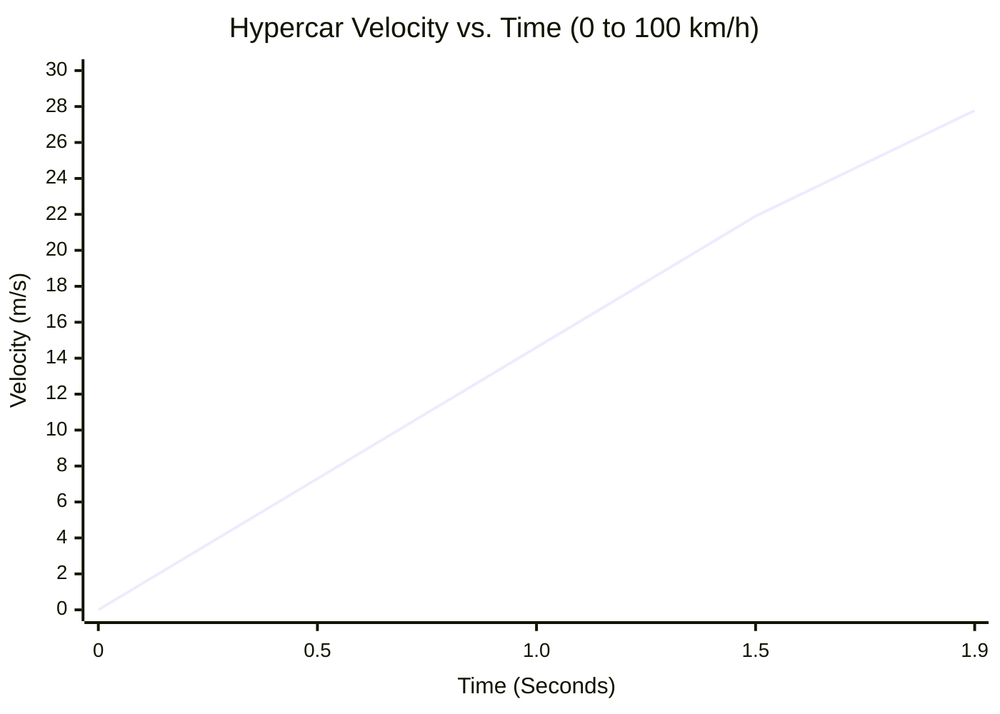
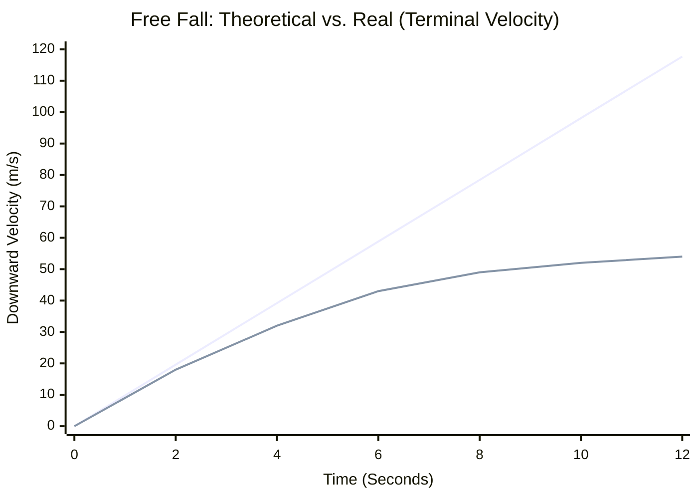
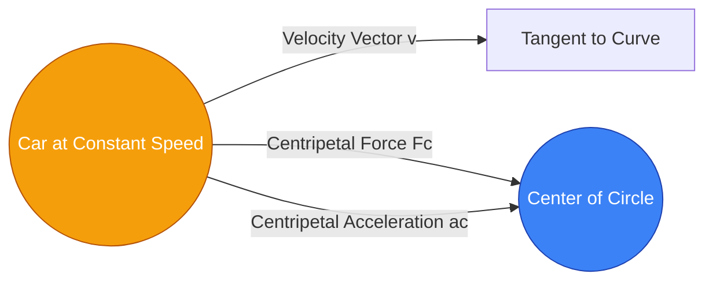

# The Ultimate Acceleration Calculator: Mastering G-Force, Velocity Change, and Kinematics

Welcome to the definitive **Acceleration Calculator** and comprehensive physics guide. Whether you are an automotive engineer trying to calculate the 0-60 mph sprint of a hypercar, a student preparing for an AP Physics kinematics exam, or an aviation enthusiast curious about the crushing G-forces experienced by fighter pilots, this tool is designed for you.

Acceleration is the engine of change in the physical world. It is the thrilling push you feel in your chest during a roller coaster launch and the violent braking force that saves your life in a car crash. In this massive, 4,000+ word guide, we will completely demystify acceleration. We will explore the mathematical foundations of kinematics, dissect the difference between uniform and variable acceleration, guide you through utilizing our interactive calculator, and walk through five real-world conceptual examples visualized with detailed Mermaid.js diagrams.

---

## 1. The Human Experience of Acceleration

Before we dive into the mathematics, it is crucial to understand how humans experience acceleration. As biological organisms, we are entirely blind to constant velocity. If you are sitting in a bullet train traveling at a perfectly smooth 300 km/h with the windows closed, you could easily pour a cup of coffee. Your body feels as though it is completely stationary. 

What humans *can* feel is **acceleration**—the rate of change in that velocity. When the bullet train departs the station, you feel pushed back into your seat. When it brakes, you lurch forward. Our inner ear (the vestibular system) is essentially a highly sensitive, three-dimensional biological accelerometer. 

### Why Acceleration Matters in Engineering
In the engineering world, managing acceleration is often more important than managing top speed. 
- **Automotive:** Designing anti-lock braking systems (ABS) is an exercise in maximizing negative acceleration (deceleration) without breaking static friction.
- **Aerospace:** A space shuttle must reach 28,000 km/h to orbit the Earth, but if it accelerates too quickly (above 3g), the astronauts will black out, and the immense aerodynamic pressure (Max Q) will tear the vehicle apart.
- **Architecture:** Skyscrapers and suspension bridges are designed not just to hold weight, but to resist lateral acceleration caused by gale-force winds and earthquakes.

---

## 2. The Core Mathematics: Scalars, Vectors, and Equations

In physics, acceleration ($a$) is defined as the rate at which an object changes its velocity over time. Because velocity is a **vector** (meaning it has both a magnitude and a direction), acceleration is also a vector. 

This leads to a critical realization: **You can accelerate without ever changing your speed.**
If you drive your car in a perfect circle at a constant speed of 30 mph, your velocity is constantly changing because your *direction* is constantly changing. Therefore, you are in a state of continuous acceleration (specifically, centripetal acceleration pushing you toward the center of the circle).

### The Fundamental Equation of Average Acceleration
The most basic algebraic definition of average acceleration is the change in velocity ($\Delta v$) divided by the change in time ($\Delta t$):

$$ a = \frac{v_f - v_i}{t} $$

Where:
- **$a$** = Acceleration
- **$v_f$** = Final Velocity
- **$v_i$** = Initial Velocity
- **$t$** = Time duration

### The Four Kinematic Equations (For Uniform Acceleration)
When acceleration is constant (uniform), such as an object in free-fall near the Earth's surface (ignoring air resistance), we can use the four classic kinematics equations to solve for any missing variable:

1. **Solving for Final Velocity:**
   $$ v_f = v_i + a \cdot t $$
2. **Solving for Displacement (Distance) without Final Velocity:**
   $$ d = v_i \cdot t + \frac{1}{2} a \cdot t^2 $$
3. **The Timeless Equation (Solving for Final Velocity without Time):**
   $$ v_f^2 = v_i^2 + 2 \cdot a \cdot d $$
4. **Solving for Displacement without Acceleration:**
   $$ d = \left(\frac{v_i + v_f}{2}\right) \cdot t $$

Our advanced calculator utilizes all of these equations dynamically. You simply input the variables you know, and the calculator's backend engine determines which equation to apply to find the missing data.

---

## 3. Comprehensive Usage Guide: Maximizing the Calculator

Our interactive Acceleration Calculator is built with a dual-mode interface to accommodate both quick everyday calculations and complex physics homework. Here is how to use it effectively.

### Step 1: Select Your Calculation Target
At the top of the dashboard, choose what you want to solve for:
- **Acceleration (a):** Select this if you know how fast an object started, how fast it finished, and how long it took.
- **Final Velocity (vf):** Select this if you know a vehicle's starting speed, its acceleration rate, and the time elapsed.
- **Initial Velocity (vi):** Select this if you know the final speed and want to work backward to find out how fast it was going originally.
- **Time (t):** Select this if you need to know how long it will take a vehicle to reach a target speed at a specific acceleration rate.

### Step 2: Input Values and Manage Units
Unlike traditional calculators, you do not need to convert your units beforehand. 
- You can enter initial velocity in **mph**, final velocity in **km/h**, and time in **minutes**. 
- The calculator's conversion engine instantly normalizes all inputs to SI units (meters and seconds), performs the physics calculation, and outputs the result.
- Output units for acceleration include $m/s^2$, $ft/s^2$, $km/h/s$, and **G-Force ($g$)**.

### Step 3: Interpret the G-Force Arc Gauge
Once a calculation is complete, the **G-Force Arc Gauge** immediately updates. 
- A standard Earth gravity (1g) is approximately $9.81\text{ m/s}^2$. 
- The visual arc gauge provides intuitive color-coding: Green for safe human limits (0 to 2g), Yellow for intense limits (3g to 5g, like a fighter jet), and Red for dangerous limits (6g+). 
- If your acceleration is negative (deceleration), the gauge swings to the left, indicating braking force.

### Step 4: Utilize the Motion Simulator and Graphs
By toggling **Advanced Mode**, you gain access to the Recharts interactive graphs. 
- The **Velocity vs. Time graph** plots the speed trajectory. For constant acceleration, this will be a straight sloped line.
- The **Position vs. Time graph** will show a curved parabola, demonstrating how displacement increases exponentially under acceleration.

---

## 4. Five Conceptual Examples with 2D Visualizations

To bridge the gap between mathematical theory and real-world application, let's explore five detailed examples of acceleration, utilizing Mermaid.js to visualize the physics.

### Example 1: The Hypercar 0-100 km/h Sprint (Calculating Basic Acceleration)

**The Scenario:**
A high-performance electric hypercar boasts that it can accelerate from a standstill (0 km/h) to 100 km/h in just 1.9 seconds. What is its average acceleration in $m/s^2$, and how many G-forces is the driver experiencing?

**The Mathematics:**
- Initial Velocity ($v_i$) = 0 km/h = 0 m/s
- Final Velocity ($v_f$) = 100 km/h. To convert to m/s, divide by 3.6: $100 / 3.6 = 27.78\text{ m/s}$.
- Time ($t$) = 1.9 s

Using the fundamental equation:
$$ a = \frac{v_f - v_i}{t} = \frac{27.78 - 0}{1.9} = 14.62\text{ m/s}^2 $$

To find the G-force, divide the acceleration by Earth's gravity ($9.81\text{ m/s}^2$):
$$ \text{G-Force} = \frac{14.62}{9.81} = 1.49g $$

The driver is experiencing nearly 1.5 times their own body weight pushing them back into the seat!

**2D Visualization:**
The velocity vs. time graph below demonstrates this rapid, linear increase in speed.



---

### Example 2: The Emergency Stop (Deceleration and Displacement)

**The Scenario:**
A driver is cruising on the highway at 120 km/h (33.3 m/s). Suddenly, a deer jumps into the road. The driver slams on the brakes, and the car's anti-lock braking system applies a constant deceleration of $-8.5\text{ m/s}^2$. How long does it take the car to come to a complete stop, and what is the braking distance?

**The Mathematics:**
- $v_i$ = 33.3 m/s
- $v_f$ = 0 m/s (complete stop)
- $a$ = -8.5 $m/s^2$

First, calculate the time required to stop:
$$ t = \frac{v_f - v_i}{a} = \frac{0 - 33.3}{-8.5} = 3.92\text{ seconds} $$

Next, calculate the braking distance ($d$) using the displacement equation:
$$ d = v_i \cdot t + \frac{1}{2} a \cdot t^2 $$
$$ d = (33.3 \times 3.92) + 0.5 \times (-8.5) \times (3.92)^2 $$
$$ d = 130.54 - 65.31 = 65.23\text{ meters} $$

The car will travel over 65 meters (more than half a football field) before coming to a complete halt.

**2D Visualization:**
This flowchart visualizes the sequence of kinematics utilized by our calculator's backend to resolve missing variables when deceleration is involved.

```mermaid
flowchart TD
    A[Input Variables:<br/>vi = 33.3 m/s<br/>vf = 0 m/s<br/>a = -8.5 m/s²] --> B{Calculate Time}
    B -->|t = (vf - vi) / a| C[Time = 3.92 s]
    C --> D{Calculate Distance}
    A --> D
    D -->|d = vi*t + 0.5*a*t²| E[Distance = 65.23 m]
    style A fill:#3b82f6,stroke:#1e40af,color:#fff
    style C fill:#10b981,stroke:#047857,color:#fff
    style E fill:#ef4444,stroke:#b91c1c,color:#fff
```

---

### Example 3: The Falling Object and Terminal Velocity

**The Scenario:**
A skydiver jumps from an airplane. If we ignore air resistance, gravity dictates they will accelerate downward at $9.81\text{ m/s}^2$. What is their velocity after 5 seconds of free fall?

**The Mathematics (Without Air Resistance):**
- $v_i$ = 0 m/s
- $a$ = 9.81 $m/s^2$
- $t$ = 5 s
$$ v_f = 0 + (9.81 \times 5) = 49.05\text{ m/s} \text{ (approx 176 km/h)} $$

**The Reality (With Air Resistance):**
In the real world, as the skydiver's velocity increases, the aerodynamic drag pushing upward also increases. Eventually, the upward drag force perfectly equals the downward gravitational force. The net force becomes zero ($F = 0$), which means acceleration becomes zero ($a = 0$). The skydiver ceases to accelerate and continues falling at a constant maximum speed known as **Terminal Velocity** (roughly 54 m/s for a human).

**2D Visualization:**
This chart plots the theoretical velocity (a straight line) against the actual velocity (a curve flattening out as it approaches terminal velocity).


*(Line 1: Theoretical Vacuum. Line 2: Real atmosphere curving to flatline at terminal velocity).*

---

### Example 4: The Space Rocket Staging Timeline

**The Scenario:**
A multi-stage orbital launch vehicle does not experience constant acceleration. As fuel is rapidly burned, the mass of the rocket decreases dramatically. According to $a = F/m$, if the thrust force ($F$) remains constant while the mass ($m$) decreases, the acceleration ($a$) must continually increase. 

When the rocket drops an empty fuel stage (staging), the mass instantly changes, creating a massive jolt in acceleration. 

**2D Visualization:**
The Gantt chart below illustrates a simplified rocket launch timeline, mapping the mission events to the rapidly shifting acceleration environments experienced by the crew.

```mermaid
gantt
    title Orbital Rocket Launch Acceleration Profile
    dateFormat  m
    axisFormat %M
    section Stage 1 (Boost)
    Ignition (1.5g) :active, 0, 1m
    Max Q Throttling (2.0g) : 1m, 2m
    Pre-MECO Peak (3.5g) :crit, 2m, 3m
    section Stage 2 (Orbital)
    Stage Separation (0g Jolt) :milestone, 3, 0m
    Second Stage Burn (1.2g to 3g) :active, 3m, 7m
    section Coast
    Engine Cut-Off (Zero G) :milestone, 7, 0m
    Orbital Coast (0g) : 7m, 10m
```

---

### Example 5: Centripetal Acceleration (The Cornering Force)

**The Scenario:**
A Formula 1 car is navigating a long, sweeping circular corner with a radius of 50 meters. The driver maintains a perfectly constant speed of 100 km/h (27.7 m/s) through the entire corner. Since the speed is constant, is the car accelerating?

**The Mathematics:**
Yes! Velocity is a vector. By turning the steering wheel, the driver is constantly changing the *direction* of the velocity vector. Changing a velocity vector requires force and results in acceleration. This specific type is called **Centripetal Acceleration** ($a_c$), and it points directly toward the center of the circle.

The formula for centripetal acceleration is:
$$ a_c = \frac{v^2}{r} $$
Where $v$ is the velocity and $r$ is the radius of the turn.

- $v$ = 27.7 m/s
- $r$ = 50 m
$$ a_c = \frac{27.7^2}{50} = \frac{767.29}{50} = 15.34\text{ m/s}^2 $$

In terms of G-force:
$$ \text{G-Force} = \frac{15.34}{9.81} = 1.56g $$
The driver's neck must support 1.56 times the weight of their own head pushing outward (due to inertia, often mistakenly called centrifugal force) against the turn.

**2D Visualization:**
The diagram below shows the vector relationship in circular motion.



---

## 5. Frequently Asked Questions (FAQ) Deep Dive

**Q: Can you have a negative acceleration but be speeding up?**
**A:** Yes, absolutely! This is one of the most common stumbling blocks in kinematics. A negative sign in physics simply indicates direction relative to a chosen axis. If you define "Right" as positive and "Left" as negative, a car reversing to the "Left" and stepping on the gas is speeding up, but its velocity is becoming *more negative* (e.g., from -10 m/s to -20 m/s). Because the change in velocity is negative, the acceleration is negative, even though the car is speeding up in the reverse direction!

**Q: What is "Jerk" in physics?**
**A:** If velocity is the rate of change of position, and acceleration is the rate of change of velocity, then **Jerk** is the rate of change of acceleration! Mathematically, it is the third derivative of position. When you ride a poorly designed elevator and feel a sudden, uncomfortable lurch in your stomach when it starts moving, you are feeling high *jerk*. Elevator engineers carefully control jerk to ensure the acceleration ramps up smoothly, prioritizing human comfort.

**Q: How does mass affect acceleration?**
**A:** According to Newton's Second Law ($a = F / m$), acceleration is inversely proportional to mass. If you push a 1,000 kg car with 5,000 Newtons of force, it will accelerate at $5\text{ m/s}^2$. If you apply that exact same 5,000 Newtons of force to a massive 10,000 kg semi-truck, it will only accelerate at $0.5\text{ m/s}^2$. This is why heavy vehicles require immensely powerful engines just to keep up with highway traffic, and why they require drastically longer braking distances to stop.

**Q: Is it possible to travel at a high speed with zero acceleration?**
**A:** Yes. In fact, if you are reading this on Earth, you are currently hurtling around the Sun at approximately 67,000 mph (107,000 km/h). However, because that velocity is relatively constant and the radius of our orbit is so massive, the centripetal acceleration we feel is near zero, so we don't notice it. Zero acceleration simply means your current speed and direction are perfectly stable.

**Q: What is the highest acceleration a human can survive?**
**A:** Human tolerance to G-forces depends entirely on the direction of the force and the duration. 
- **Vertical G-forces (Head to Toe):** Blood drains from the brain, causing a blackout (G-LOC). Fighter pilots wearing specialized compression G-suits and practicing straining maneuvers can sustain 9g for a few seconds.
- **Horizontal G-forces (Chest to Back):** Humans are much more resilient to "eyeballs in" acceleration. Astronauts on the Space Shuttle experienced 3g for minutes during launch. In 1954, Dr. John Stapp rode a rocket sled and decelerated at 46.2g for a fraction of a second, proving humans could survive massive instant impacts, though he suffered severe bruising and temporary blindness.

---

## 6. Conclusion and Classroom Exercises

The concepts of kinematics and acceleration provide the mathematical framework required to engineer everything from roller coasters to interplanetary rockets. 

To test your understanding using our interactive calculator, try the following practical exercises:
1. **The Quarter Mile Drop:** Calculate how long it takes an object in free-fall ($a = 9.81\text{ m/s}^2$) to drop a quarter mile (402 meters) starting from rest ($v_i = 0$). 
2. **The F1 Brake Test:** A Formula 1 car decelerates from 300 km/h to 80 km/h in just 1.5 seconds entering a tight chicane. Use the calculator to find the deceleration in $m/s^2$ and convert it to G-force.
3. **The Lunar Lander:** The Apollo Lunar Module used a descent engine to land on the Moon, where gravity is only $1.62\text{ m/s}^2$. Calculate the braking force needed to counter lunar gravity.

Keep exploring the visualizations, test the extreme edge cases, and rely on this calculator to solve your most complex 1D kinematics problems with absolute precision.
