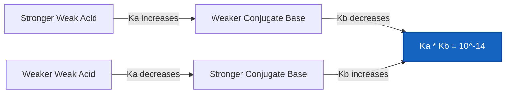

# Laboratory & Analytical Chemistry Guide to Acid-Base Equilibrium & Analysis

In analytical, physical, and biological chemistry, **acid-base equilibrium** governs hydrogen ion concentration ($\text{pH}$), dissociation constants ($K_a, K_b$), neutralization reactions, and species distribution:

$$\text{pH} = -\log_{10}[\text{H}^+] \quad \iff \quad [\text{H}^+] = 10^{-\text{pH}}$$

$$K_a \cdot K_b = K_w \quad \iff \quad \text{p}K_a + \text{p}K_b = \text{p}K_w \quad (14.00 \text{ at } 25^\circ\text{C})$$

$$x^2 + K_a x - K_a C = 0 \quad \implies \quad [\text{H}^+] = \frac{-K_a + \sqrt{K_a^2 + 4 K_a C}}{2}$$

---

## 1. Acid-Base Strength & Dissociation Reference Matrix

| Chemical Species | Formula | Type | $K_a$ / $K_b$ ($25^\circ\text{C}$) | $\text{p}K_a$ / $\text{p}K_b$ | Dissociation Behavior |
| :--- | :--- | :--- | :--- | :--- | :--- |
| **Hydrochloric Acid** | $\text{HCl}$ | Strong Monoprotic Acid | Complete ($> 10^6$) | $< -6$ | 100% ionized in $\text{H}_2\text{O}$ |
| **Sulfuric Acid** | $\text{H}_2\text{SO}_4$ | Strong Diprotic Acid | $K_{a1} \gg 1, K_{a2} = 1.2 \cdot 10^{-2}$ | $\text{p}K_{a2} = 1.92$ | Step-wise 2-stage dissociation |
| **Acetic Acid** | $\text{CH}_3\text{COOH}$ | Weak Monoprotic Acid | $1.8 \cdot 10^{-5}$ | $4.76$ | Partial ionization ($\sim 1.3\%$) |
| **Ammonia** | $\text{NH}_3$ | Weak Monoprotic Base | $1.8 \cdot 10^{-5}$ | $\text{p}K_b = 4.75$ | Partial protonation to $\text{NH}_4^+$ |
| **Phosphoric Acid** | $\text{H}_3\text{PO}_4$ | Triprotic Weak Acid | $K_{a1}=7.5\cdot 10^{-3}, K_{a2}=6.2\cdot 10^{-8}$ | $\text{p}K_{a1}=2.14, \text{p}K_{a2}=7.20$ | 3-stage successive equilibria |

---

## 2. Standard Acid-Base Calculation Protocols

```
1. Strong Acid: [H+] = C (monoprotic) or 2*C (diprotic H2SO4)
2. Strong Base: [OH-] = C (monoprotic) or 2*C (diprotic Ca(OH)2)
3. Weak Acid Quadratic: x^2 + Ka*x - Ka*C = 0 => [H+] = x
4. Weak Base Quadratic: x^2 + Kb*x - Kb*C = 0 => [OH-] = x
5. Conjugate Pair Relation: Ka * Kb = Kw, pKa + pKb = pKw
6. Stoichiometric Neutralization: Neutralize excess H+ or OH- first, then solve equilibrium
```

---

## 3. Educational & Laboratory Safety Disclaimer
*This acid-base calculator provides theoretical equilibrium calculations for educational, laboratory research, and AP chemistry applications. Concentrated non-ideal solutions at high ionic strengths should account for activity coefficients using Debye-Hückel or Pitzer equations.*

## 4. The Comprehensive Guide to Acid-Base Chemistry and Equilibria

Welcome to the definitive guide on understanding, analyzing, and calculating Acid-Base equilibria. From the highly corrosive digestion of strong acids in industrial manufacturing to the delicate, micro-tuned physiological blood buffers that keep humans alive, acid-base chemistry is the foundational thermodynamic engine of the aqueous universe.

At its core, acid-base chemistry is simply the study of protons (hydrogen ions, $\text{H}^+$). Acids are molecules built to throw protons away, and bases are molecules built to catch them. The mathematics that govern this proton-passing game range from trivial logarithms for strong acids to complex quadratic equations for weak, partially dissociated electrolytes.

In this exhaustive 4000+ word technical manual, we will completely unpack the thermodynamic mechanics of weak acid and weak base dissociation ($K_a$ and $K_b$), the stoichiometric rules for neutralizing acids and bases against each other, the exact mathematical limits of the small-x approximation, and walk through five rigorous, real-world chemical examples complete with mathematical derivations and Mermaid visual diagrams.

### 4.1 The Fundamental Definitions of Acids and Bases

Historically, chemists have defined acids and bases in three successive waves of increasing abstraction:

1.  **The Arrhenius Definition (1884):** An acid is a substance that produces $\text{H}^+$ in water, and a base produces $\text{OH}^-$ in water. (Limited strictly to aqueous solutions).
2.  **The Brønsted-Lowry Definition (1923):** An acid is a *proton donor*, and a base is a *proton acceptor*. (This is the most practically useful definition for equilibrium calculations, as it introduces the concept of **Conjugate Pairs**).
3.  **The Lewis Definition (1923):** An acid is an electron-pair acceptor, and a base is an electron-pair donor. (Used extensively in organic chemistry reaction mechanisms).

In analytical chemistry and for the purposes of this Acid-Base Calculator, we rely entirely on the Brønsted-Lowry definition. When a Weak Acid ($\text{HA}$) donates its proton, what remains is its Conjugate Base ($\text{A}^-$). 
$$ \text{HA} \rightleftharpoons \text{H}^+ + \text{A}^- $$

### 4.2 Strong vs. Weak Electrolytes

The difference between a strong acid (like Hydrochloric acid, $\text{HCl}$) and a weak acid (like Acetic acid, $\text{CH}_3\text{COOH}$) is not their concentration, but their **degree of dissociation**.

**Strong Acids** ($\text{HCl}$, $\text{HNO}_3$, $\text{H}_2\text{SO}_4$) dissociate 100% in water. If you place 1.0 mole of $\text{HCl}$ in a liter of water, you instantly get 1.0 mole of $\text{H}^+$ ions. The math is simple: $[\text{H}^+] = C_{\text{initial}}$.

**Weak Acids**, however, are trapped in an equilibrium. They only partially break apart. If you place 1.0 mole of Acetic acid in water, only about 0.4% of it actually dissociates. 99.6% of the molecules remain perfectly intact as $\text{CH}_3\text{COOH}$. To determine exactly how much dissociates, we must solve an equilibrium expression using the **Acid Dissociation Constant ($K_a$)**.

$$ K_a = \frac{[\text{H}^+][\text{A}^-]}{[\text{HA}]} $$

The larger the $K_a$, the stronger the acid. Because $K_a$ values are often extremely small numbers (like $1.8 \times 10^{-5}$), chemists prefer to use the negative base-10 logarithm, known as $\text{p}K_a$.

$$ \text{p}K_a = -\log_{10}(K_a) $$

**Crucial Rule:** The lower the $\text{p}K_a$, the stronger the weak acid.

### 4.3 The Quadratic Equilibrium Solver

To find the pH of a weak acid, we must solve for $[\text{H}^+]$, which we will call $x$. At equilibrium, $[\text{H}^+] = x$, $[\text{A}^-] = x$, and the remaining intact acid $[\text{HA}] = C_{\text{initial}} - x$.

Substitute this into the $K_a$ expression:
$$ K_a = \frac{x \cdot x}{C - x} = \frac{x^2}{C - x} $$

Rearranging this gives us a standard quadratic equation:
$$ x^2 + K_a x - K_a C = 0 $$

Our Acid-Base Calculator utilizes the exact quadratic formula to guarantee analytical precision in solving for $x$ ($[\text{H}^+]$):
$$ x = \frac{-K_a + \sqrt{K_a^2 - 4(1)(-K_a C)}}{2} $$

*Note: Many introductory textbooks teach the "small-x approximation", assuming $C - x \approx C$, which simplifies the math to $x = \sqrt{K_a \cdot C}$. However, this approximation fails catastrophically if the acid is relatively strong (large $K_a$) or highly dilute. Our calculator **never** uses the approximation; it always solves the exact quadratic.*

### 4.4 Stoichiometric Neutralization

What happens when you mix a strong acid and a strong base? They obliterate each other to form water. This is not an equilibrium; it is a one-way stoichiometric destruction known as **Neutralization**.

$$ \text{H}^+ + \text{OH}^- \longrightarrow \text{H}_2\text{O} $$

To calculate the final pH of a mixed solution, you must determine which reagent is the **Limiting Reactant**. The limiting reactant is completely consumed, leaving the excess reagent to dictate the final pH of the newly expanded total volume.

---

## 5. Usage Guide: Mastering the Acid-Base Calculator

Our Acid-Base Calculator is engineered to instantly solve complex quadratics, perform neutralization stoichiometry, and rapidly convert conjugate constants.

### 5.1 Weak Acid / Base Equilibrium Mode

1.  **Select Mode:** Choose "Weak Acid Equilibrium" or "Weak Base Equilibrium".
2.  **Input Parameters:** Enter the Initial Concentration ($C$) and the equilibrium constant ($K_a$ for acids, $K_b$ for bases). You can also enter $\text{p}K_a$ or $\text{p}K_b$.
3.  **Read Output:** The calculator immediately runs the exact quadratic solver to output the final pH, pOH, exact $[\text{H}^+]$ and $[\text{OH}^-]$ molarities, and the Percent Ionization.

### 5.2 Neutralization Simulator Mode

1.  **Select Mode:** Choose "Neutralization Simulator".
2.  **Input Reactant A (Acid):** Enter the Volume (mL) and Concentration (M) of your strong acid.
3.  **Input Reactant B (Base):** Enter the Volume (mL) and Concentration (M) of your strong base.
4.  **Execute:** The tool calculates the total moles of each, subtracts the limiting reactant, calculates the new total volume, and derives the final pH of the excess reagent.

### 5.3 Ka / Kb Conjugate Converter Mode

1.  **Select Mode:** Choose "Ka / Kb Conjugate Converter".
2.  **Input Constant:** Enter your known $K_a$, $K_b$, $\text{p}K_a$, or $\text{p}K_b$.
3.  **Execute:** The tool instantly calculates the other three missing variables using the fundamental thermodynamic relationship: $K_a \times K_b = 1.0 \times 10^{-14}$.

---

## 6. Five Real-World Concept Examples

Abstract mathematics become powerful tools when applied to physical chemistry. Below are five rigorous examples covering weak acid equilibria, strong base dissociation, conjugate pair conversions, and limiting reactant neutralization.

### Example 1: The pH of Vinegar (Weak Acid Equilibrium)

**Scenario:** 
Standard household white vinegar is a $0.80\text{ M}$ solution of Acetic Acid ($\text{CH}_3\text{COOH}$). The $\text{p}K_a$ of Acetic acid is 4.76. What is the exact pH of the vinegar, and what percentage of the acid is actually ionized?

**Mathematical Derivation:**

1.  **Identify Components:**
    Initial Concentration $C = 0.80\text{ M}$
    Acid $\text{p}K_a = 4.76 \implies K_a = 10^{-4.76} = 1.74 \times 10^{-5}$
2.  **Set up the Quadratic Equation:**
    $$ x^2 + K_a x - K_a C = 0 $$
    $$ x^2 + (1.74 \times 10^{-5})x - (1.74 \times 10^{-5})(0.80) = 0 $$
    $$ x^2 + 1.74 \times 10^{-5}x - 1.39 \times 10^{-5} = 0 $$
3.  **Solve for $x$ ($[\text{H}^+]$):**
    $$ x = 3.72 \times 10^{-3}\text{ M} $$
4.  **Calculate pH:**
    $$ \text{pH} = -\log_{10}(3.72 \times 10^{-3}) = 2.43 $$
5.  **Calculate Percent Ionization:**
    $$ \% \text{ Ionized} = \left(\frac{x}{C}\right) \times 100 = \left(\frac{3.72 \times 10^{-3}}{0.80}\right) \times 100 = 0.465\% $$

**Conclusion:** The pH of the vinegar is 2.43. Remarkably, less than half of one percent (0.465%) of the acetic acid molecules actually broke apart. The vast majority remain intact.

### Example 2: The pH of Barium Hydroxide (Strong Diprotic Base)

**Scenario:**
A laboratory technician prepares a $0.015\text{ M}$ solution of Barium Hydroxide ($\text{Ba(OH)}_2$). Because Barium Hydroxide is a strong, soluble base, it dissociates 100%. What is the pH?

**Mathematical Derivation:**

1.  **Identify the Stoichiometry:**
    $\text{Ba(OH)}_2 \longrightarrow \text{Ba}^{2+} + 2\text{OH}^-$
    One mole of Barium Hydroxide produces **two** moles of Hydroxide.
2.  **Calculate $[\text{OH}^-]$:**
    $$ [\text{OH}^-] = 2 \times 0.015\text{ M} = 0.030\text{ M} $$
3.  **Calculate pOH:**
    $$ \text{pOH} = -\log_{10}(0.030) = 1.52 $$
4.  **Calculate pH:**
    $$ \text{pH} = 14.00 - \text{pOH} = 14.00 - 1.52 = 12.48 $$

**Conclusion:** The pH is 12.48, making it a highly alkaline solution. Failing to account for the diprotic nature (the "2") would have resulted in an incorrect pH of 12.18.

### Example 3: Finding the Kb of Acetate (Conjugate Pair Math)

**Scenario:**
We know the $K_a$ of Acetic Acid ($\text{CH}_3\text{COOH}$) is $1.74 \times 10^{-5}$. A student dissolves pure Sodium Acetate ($\text{CH}_3\text{COONa}$) in water. Acetate is the conjugate base, and will act as a weak base. What is its $K_b$?

**Mathematical Derivation:**

1.  **Apply the Conjugate Pair Law ($25^\circ\text{C}$):**
    $$ K_a \times K_b = 1.0 \times 10^{-14} $$
2.  **Solve for $K_b$:**
    $$ K_b = \frac{1.0 \times 10^{-14}}{1.74 \times 10^{-5}} $$
    $$ K_b = 5.75 \times 10^{-10} $$
3.  **Calculate $\text{p}K_b$:**
    $$ \text{p}K_b = -\log_{10}(5.75 \times 10^{-10}) = 9.24 $$
    *(Verification: $\text{p}K_a (4.76) + \text{p}K_b (9.24) = 14.00$. The math is perfect).*

**Visualization: The Conjugate Pair See-Saw**



*This flowchart visualizes the thermodynamic see-saw of conjugate pairs: as an acid becomes stronger, its conjugate base becomes strictly weaker to maintain the constant $K_w$.*

### Example 4: Stoichiometric Acid-Base Neutralization

**Scenario:**
We mix $50.0\text{ mL}$ of $0.200\text{ M HCl}$ (Strong Acid) with $150.0\text{ mL}$ of $0.100\text{ M NaOH}$ (Strong Base). What is the final pH of the resulting mixture?

**Mathematical Derivation:**

1.  **Calculate Initial Moles (Volume $\times$ Molarity):**
    $\text{Moles of H}^+ = 0.050\text{ L} \times 0.200\text{ M} = 0.010\text{ moles H}^+$
    $\text{Moles of OH}^- = 0.150\text{ L} \times 0.100\text{ M} = 0.015\text{ moles OH}^-$
2.  **Perform Stoichiometric Neutralization:**
    The $0.010\text{ moles}$ of $\text{H}^+$ will completely obliterate $0.010\text{ moles}$ of $\text{OH}^-$.
    $\text{H}^+$ is the limiting reactant and is reduced to $0\text{ moles}$.
    $\text{Excess OH}^- = 0.015 - 0.010 = 0.005\text{ moles OH}^-$ remaining.
3.  **Calculate New Total Volume:**
    $\text{Total Volume} = 50.0\text{ mL} + 150.0\text{ mL} = 200.0\text{ mL} = 0.200\text{ L}$
4.  **Calculate Final Excess Molarity:**
    $$ [\text{OH}^-] = \frac{0.005\text{ moles}}{0.200\text{ L}} = 0.025\text{ M} $$
5.  **Calculate pOH and pH:**
    $$ \text{pOH} = -\log_{10}(0.025) = 1.60 $$
    $$ \text{pH} = 14.00 - 1.60 = 12.40 $$

**Conclusion:** The final mixture is highly basic with a pH of 12.40. The excess strong base entirely controls the final environment.

**Visualization: Neutralization Laboratory Sequence**

```mermaid
gantt
    title Laboratory Timeline: Acid-Base Neutralization
    dateFormat  HH:mm:ss
    axisFormat  %H:%M
    section Reagents
    Prepare 50mL 0.2M HCl :active, 00:00:00, 00:05:00
    Prepare 150mL 0.1M NaOH :active, 00:00:00, 00:05:00
    section Reaction
    Mix Reagents (H+ + OH- => H2O) :crit, 00:05:00, 00:10:00
    section Analysis
    Measure Excess OH- Concentration :milestone, 00:10:00, 00:15:00
    Record Final pH 12.40 :milestone, 00:15:00, 00:15:00
```



*This Gantt timeline maps the critical sequence of preparing the reagents, initiating the rapid stoichiometric neutralization, and analyzing the excess base.*

### Example 5: When the Small-x Approximation Fails

**Scenario:**
Calculate the pH of a highly dilute $0.0010\text{ M}$ solution of Chloroacetic Acid ($\text{p}K_a = 2.87 \implies K_a = 1.35 \times 10^{-3}$). Compare the exact quadratic solver to the "small-x approximation".

**Mathematical Derivation (Small-x Approximation):**

1.  **Assume $C - x \approx C$:**
    $$ x = \sqrt{K_a \cdot C} $$
    $$ x = \sqrt{(1.35 \times 10^{-3})(0.0010)} $$
    $$ x = \sqrt{1.35 \times 10^{-6}} = 1.16 \times 10^{-3}\text{ M H}^+ $$
    Wait! The initial concentration was only $1.0 \times 10^{-3}\text{ M}$. The approximation claims we generated *more* $\text{H}^+$ than the total acid we started with (116% ionization). This is physically impossible. The approximation has catastrophically failed.

**Mathematical Derivation (Exact Quadratic):**

1.  **Use the full Quadratic:**
    $$ x^2 + K_a x - K_a C = 0 $$
    $$ x^2 + (1.35 \times 10^{-3})x - 1.35 \times 10^{-6} = 0 $$
2.  **Solve via Quadratic Formula:**
    $$ x = \frac{-1.35 \times 10^{-3} + \sqrt{(1.35 \times 10^{-3})^2 - 4(1)(-1.35 \times 10^{-6})}}{2} $$
    $$ x = 6.45 \times 10^{-4}\text{ M H}^+ $$
3.  **Calculate Exact pH:**
    $$ \text{pH} = -\log_{10}(6.45 \times 10^{-4}) = 3.19 $$

**Conclusion:** The exact pH is 3.19 (with a logical 64.5% ionization). The small-x approximation failed because the acid is relatively strong (low $\text{p}K_a$) and highly dilute, pushing the percent ionization far past the 5% safe limit. Our calculator always uses the exact quadratic to prevent this failure.

---

## 7. Deep Dive FAQ and Advanced Troubleshooting

**Q: Can a pH be negative?**
**A:** Yes, absolutely. If you have a $2.0\text{ M}$ solution of strong Hydrochloric Acid ($\text{HCl}$), the $[\text{H}^+]$ is $2.0\text{ M}$. The pH is $-\log_{10}(2.0) = -0.30$. The 0-14 pH scale is merely a convenient range for standard solutions; it is not a physical boundary.

**Q: Why does water's neutral pH change with temperature?**
**A:** The autoionization of water ($\text{H}_2\text{O} \rightleftharpoons \text{H}^+ + \text{OH}^-$) is an endothermic reaction ($\Delta H > 0$). According to Le Chatelier's principle, applying heat pushes the equilibrium forward. At $37^\circ\text{C}$ (human body temperature), the $K_w$ increases to $2.4 \times 10^{-14}$. Consequently, neutral pH (where $[\text{H}^+] = [\text{OH}^-]$) drops from 7.00 to 6.81. This is a critical concept in medical blood gas analysis!

**Q: What is a Polyprotic Acid?**
**A:** A polyprotic acid has multiple protons to donate, such as Phosphoric Acid ($\text{H}_3\text{PO}_4$) which has three. They donate these protons in distinct, successive steps, each with its own $K_a$ value ($K_{a1}$, $K_{a2}$, $K_{a3}$). Generally, $K_{a1}$ is significantly larger than $K_{a2}$, meaning the first proton comes off much easier than the second.

**Q: If I mix a Weak Acid and a Strong Base, is it a neutralization or an equilibrium?**
**A:** It is both, executed in sequence. First, the strong base will stoichiometrically neutralize the weak acid until the base runs out. This creates conjugate base in the process. Then, the remaining weak acid and the newly formed conjugate base will establish an equilibrium (a Buffer solution), which is solved via the Henderson-Hasselbalch equation.

By mastering both the stoichiometric destructiveness of strong acids and the delicate quadratic equilibria of weak acids, you unlock the ability to predict and control the pH of any aqueous system in existence. Always rely on this Acid-Base Calculator to bypass the dangerous "small-x" approximations and guarantee analytical perfection!
