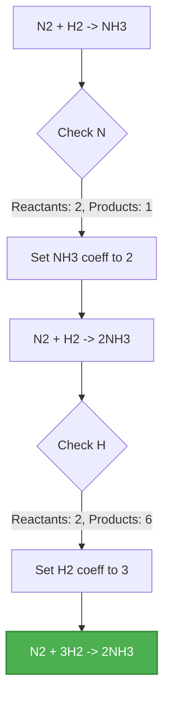

# Laboratory & Analytical Chemistry Guide to Chemical Equation Balancing

In quantitative stoichiometry and chemical engineering, **Balancing Chemical Equations** enforces the **Law of Conservation of Mass**:

$$\sum \text{Reactant Atoms} = \sum \text{Product Atoms} \quad \text{for every element } E$$

$$\mathbf{A} \cdot \mathbf{x} = \mathbf{0} \implies \text{Null-Space Solution Reduced to Smallest Integers}$$

---

## 1. Standard Chemical Reaction Types & Examples

| Reaction Type | Unbalanced Equation | Balanced Equation | Stoichiometric Ratio |
| :--- | :--- | :--- | :--- |
| **Water Synthesis** | $\text{H}_2 + \text{O}_2 \to \text{H}_2\text{O}$ | $2\text{H}_2 + \text{O}_2 \to 2\text{H}_2\text{O}$ | $2 : 1 : 2$ |
| **Methane Combustion** | $\text{CH}_4 + \text{O}_2 \to \text{CO}_2 + \text{H}_2\text{O}$ | $\text{CH}_4 + 2\text{O}_2 \to \text{CO}_2 + 2\text{H}_2\text{O}$ | $1 : 2 : 1 : 2$ |
| **Propane Combustion** | $\text{C}_3\text{H}_8 + \text{O}_2 \to \text{CO}_2 + \text{H}_2\text{O}$ | $\text{C}_3\text{H}_8 + 5\text{O}_2 \to 3\text{CO}_2 + 4\text{H}_2\text{O}$ | $1 : 5 : 3 : 4$ |
| **Iron Rusting** | $\text{Fe} + \text{O}_2 \to \text{Fe}_2\text{O}_3$ | $4\text{Fe} + 3\text{O}_2 \to 2\text{Fe}_2\text{O}_3$ | $4 : 3 : 2$ |
| **Single Replacement** | $\text{Al} + \text{HCl} \to \text{AlCl}_3 + \text{H}_2$ | $2\text{Al} + 6\text{HCl} \to 2\text{AlCl}_3 + 3\text{H}_2$ | $2 : 6 : 2 : 3$ |

---

## 2. Standard Equation Balancing Protocol

```
   Step 1: Write the correct chemical formulas for all reactants and products.
   Step 2: Count the number of atoms of each element on both sides of the equation.
   Step 3: Insert integer coefficients before formulas to balance elements one by one.
   Step 4: NEVER change formula subscripts (e.g. changing H2O to H2O2 is forbidden).
   Step 5: Reduce coefficients by dividing by their Greatest Common Divisor (GCD).
   Step 6: Verify that total Reactant Atoms = Total Product Atoms for all elements.
```

---

## 3. Educational & Laboratory Safety Disclaimer
*This chemical equation balancer provides automated stoichiometric calculations for educational, laboratory research, and AP chemistry applications. Complex industrial reaction mechanisms should be verified against standard scientific references.*

## 4. The Comprehensive Guide to Balancing Chemical Equations

Welcome to the ultimate resource on understanding, mastering, and automatically solving chemical equations. Whether you are a high school student learning the foundational Law of Conservation of Mass, an AP Chemistry scholar tackling complex redox half-reactions, or a professional chemical engineer scaling up an industrial synthesis, balancing equations is the bedrock of chemical mathematics.

At its heart, chemistry is about transformation. Reactants collide, bonds break, atoms rearrange, and new products form. However, because matter cannot be created or destroyed, every single atom that enters a reaction must exit it. This immutable principle dictates that chemical equations must be perfectly balanced.

In this exhaustive guide, we will dive deep into the mechanics of stoichiometry, explore the powerful linear algebra algorithms used by our calculator to solve any reaction, and walk through five highly detailed, real-world examples complete with mathematical derivations and 2D visual flowcharts.

### 4.1 The Law of Conservation of Mass

In 1789, Antoine Lavoisier established the Law of Conservation of Mass, which states that in a closed system, mass is neither created nor destroyed by chemical reactions or physical transformations. 

When applied to chemical equations, this means the mass of the reactants must equal the mass of the products. More specifically, the exact number of atoms for every individual element on the left side of the reaction arrow (reactants) must perfectly match the number of atoms on the right side (products). 

If you write a skeletal equation like $\text{H}_2 + \text{O}_2 \to \text{H}_2\text{O}$, you can see that there are two oxygen atoms on the left, but only one on the right. This represents an impossible scenario where an oxygen atom simply vanished from existence. To fix this, we must balance the equation.

### 4.2 Coefficients vs. Subscripts

The golden rule of balancing equations is to **never alter the subscripts** of a chemical formula. 
*   **Subscripts** (the small numbers at the bottom right of an element symbol) dictate the actual chemical identity of a substance. For example, changing the subscript in $\text{H}_2\text{O}$ to $\text{H}_2\text{O}_2$ changes the substance from life-giving water to toxic hydrogen peroxide.
*   **Coefficients** (the large numbers placed directly in front of the chemical formulas) dictate the quantity or molar ratio of that specific molecule in the reaction.

To balance $\text{H}_2 + \text{O}_2 \to \text{H}_2\text{O}$, we place a coefficient of 2 in front of water to balance the oxygen, and a 2 in front of hydrogen gas to re-balance the hydrogen, yielding: $2\text{H}_2 + \text{O}_2 \to 2\text{H}_2\text{O}$.

### 4.3 The Linear Algebra Matrix Method

While simple equations can be balanced by inspection (trial and error), highly complex redox reactions or combustion equations with massive hydrocarbons can be frustratingly difficult to solve manually. 

Our Balancing Chemical Equations Calculator utilizes advanced **linear algebra and matrix mathematics**. It treats every element as a row and every molecule as a column in a matrix. The algorithm then sets up a system of linear equations representing the conservation of each element and solves for the null-space of the matrix. 

Because fractional molecules don't exist in standard stoichiometry, the algorithm then calculates the lowest common multiple to scale the matrix solution into the smallest possible positive whole-number integers (the Greatest Common Divisor reduction step). This ensures 100% mathematical accuracy for any valid chemical equation you input.

---

## 5. Usage Guide: Mastering the Equation Balancer

Our Balancing Chemical Equations Calculator is designed with an intuitive "Interactive Cockpit" that provides both instantaneous answers and deep pedagogical insights.

### 5.1 Basic Operation

1.  **Enter your Skeletal Equation:** Use standard chemical notation. For example, type `C6H12O6 + O2 -> CO2 + H2O`. You do not need to worry about formatting subscripts; the parser handles it automatically.
2.  **Use Proper Syntax:** Always capitalize the first letter of an element (e.g., `Na` for sodium, not `na` or `NA`). Use `->`, `=`, or `=>` to separate reactants from products.
3.  **Click "Balance Equation":** The engine will instantly calculate the coefficients.

### 5.2 Advanced Features and Modes

*   **Atom Conservation Matrix:** Below the balanced output, you will find a matrix that tallies the exact number of atoms of each element on both sides of the equation. This acts as a mathematical proof that the equation is balanced.
*   **Redox and Charge Balancing:** If you are inputting ionic equations (e.g., `Cu + Ag+ -> Cu2+ + Ag`), the calculator will not only balance the atoms but also ensure that the net electrical charge is conserved on both sides.
*   **Net Ionic Equation Tool:** This mode allows you to input complete ionic equations. The calculator will identify "spectator ions" (ions that appear identically on both sides) and automatically cross them out to provide the simplified net ionic equation.

---

## 6. Five Real-World Concept Examples

To truly master chemical stoichiometry, you must see these principles applied to distinct types of chemical reactions. Below are five detailed examples representing different reaction classifications, complete with visual derivations.

### Example 1: The Combustion of Propane

**Scenario:** 
Propane ($\text{C}_3\text{H}_8$) is commonly used in outdoor grills and home heating. When it burns in the presence of oxygen ($\text{O}_2$), it produces carbon dioxide ($\text{CO}_2$) and water vapor ($\text{H}_2\text{O}$). We need to balance this combustion reaction.

**Unbalanced Equation:**
$\text{C}_3\text{H}_8 + \text{O}_2 \to \text{CO}_2 + \text{H}_2\text{O}$

**Step-by-Step Derivation:**

1.  **Balance Carbon (C):** There are 3 carbons on the left, so we place a 3 in front of $\text{CO}_2$.
    *   $\text{C}_3\text{H}_8 + \text{O}_2 \to 3\text{CO}_2 + \text{H}_2\text{O}$
2.  **Balance Hydrogen (H):** There are 8 hydrogens on the left, so we place a 4 in front of $\text{H}_2\text{O}$.
    *   $\text{C}_3\text{H}_8 + \text{O}_2 \to 3\text{CO}_2 + 4\text{H}_2\text{O}$
3.  **Balance Oxygen (O):** On the right, we have $(3 \times 2) = 6$ oxygen atoms from $\text{CO}_2$ and $(4 \times 1) = 4$ oxygen atoms from water. Total = 10. To get 10 oxygens on the left, we place a 5 in front of $\text{O}_2$.
    *   $\text{C}_3\text{H}_8 + 5\text{O}_2 \to 3\text{CO}_2 + 4\text{H}_2\text{O}$

**Visualization: Atom Tally Matrix**

| Element | Reactants | Products | Status |
| :--- | :--- | :--- | :--- |
| **Carbon (C)** | $1 \times 3 = 3$ | $3 \times 1 = 3$ | Balanced |
| **Hydrogen (H)** | $1 \times 8 = 8$ | $4 \times 2 = 8$ | Balanced |
| **Oxygen (O)** | $5 \times 2 = 10$ | $6 + 4 = 10$ | Balanced |

*This table confirms that the Law of Conservation of Mass is strictly upheld.*

### Example 2: The Haber-Bosch Process (Synthesis)

**Scenario:**
The Haber-Bosch process is one of the most important industrial reactions in history, synthesizing ammonia ($\text{NH}_3$) from nitrogen ($\text{N}_2$) and hydrogen ($\text{H}_2$) gases to produce agricultural fertilizers.

**Unbalanced Equation:**
$\text{N}_2 + \text{H}_2 \to \text{NH}_3$

**Step-by-Step Derivation:**

1.  **Balance Nitrogen (N):** There are 2 nitrogens on the left. Place a 2 in front of $\text{NH}_3$.
    *   $\text{N}_2 + \text{H}_2 \to 2\text{NH}_3$
2.  **Balance Hydrogen (H):** Now there are $(2 \times 3) = 6$ hydrogens on the right. Place a 3 in front of $\text{H}_2$ to balance it.
    *   $\text{N}_2 + 3\text{H}_2 \to 2\text{NH}_3$

**Visualization: Algorithmic Logic Flow**



*This flowchart mimics the algorithmic "inspection" logic used for simpler synthesis equations.*

### Example 3: Photosynthesis (Complex Biological Reaction)

**Scenario:**
Plants capture solar energy to convert carbon dioxide and water into glucose and oxygen gas. This is a massive, multi-step biochemical process, but the overall net chemical equation must still be balanced.

**Unbalanced Equation:**
$\text{CO}_2 + \text{H}_2\text{O} \to \text{C}_6\text{H}_{12}\text{O}_6 + \text{O}_2$

**Step-by-Step Derivation:**

1.  **Balance Carbon:** Place a 6 in front of $\text{CO}_2$.
    *   $6\text{CO}_2 + \text{H}_2\text{O} \to \text{C}_6\text{H}_{12}\text{O}_6 + \text{O}_2$
2.  **Balance Hydrogen:** Place a 6 in front of $\text{H}_2\text{O}$.
    *   $6\text{CO}_2 + 6\text{H}_2\text{O} \to \text{C}_6\text{H}_{12}\text{O}_6 + \text{O}_2$
3.  **Balance Oxygen:** The left side now has $(6 \times 2) = 12$ from $\text{CO}_2$ and $(6 \times 1) = 6$ from water, totaling 18 oxygen atoms. The right side has 6 in the glucose. We need 12 more from the $\text{O}_2$ gas, so we place a 6 in front of it.
    *   $6\text{CO}_2 + 6\text{H}_2\text{O} \to \text{C}_6\text{H}_{12}\text{O}_6 + 6\text{O}_2$

### Example 4: Single Replacement and Charge Conservation

**Scenario:**
A solid piece of aluminum metal is dropped into a solution of copper(II) sulfate. The more reactive aluminum replaces the copper, precipitating solid copper out of the solution.

**Unbalanced Equation:**
$\text{Al} + \text{CuSO}_4 \to \text{Al}_2(\text{SO}_4)_3 + \text{Cu}$

**Step-by-Step Derivation:**

1.  Instead of balancing Individual S and O atoms, treat the polyatomic sulfate ion ($\text{SO}_4$) as a single unit because it does not break apart.
2.  **Balance Sulfate ($\text{SO}_4$):** There are 3 sulfates on the right. Place a 3 in front of $\text{CuSO}_4$.
    *   $\text{Al} + 3\text{CuSO}_4 \to \text{Al}_2(\text{SO}_4)_3 + \text{Cu}$
3.  **Balance Copper (Cu):** Place a 3 in front of the Cu on the right.
    *   $\text{Al} + 3\text{CuSO}_4 \to \text{Al}_2(\text{SO}_4)_3 + 3\text{Cu}$
4.  **Balance Aluminum (Al):** Place a 2 in front of the Al on the left.
    *   $2\text{Al} + 3\text{CuSO}_4 \to \text{Al}_2(\text{SO}_4)_3 + 3\text{Cu}$

### Example 5: Decomposition of Sodium Azide (Airbags)

**Scenario:**
In automotive airbags, a rapid chemical decomposition must inflate the bag in milliseconds. Sodium azide ($\text{NaN}_3$) is electrically ignited to rapidly decompose into solid sodium and nitrogen gas.

**Unbalanced Equation:**
$\text{NaN}_3 \to \text{Na} + \text{N}_2$

**Step-by-Step Derivation:**

1.  **Balance Nitrogen:** We have 3 nitrogens on the left and 2 on the right. The lowest common multiple is 6. So we need 6 nitrogens on both sides.
2.  Place a 2 in front of $\text{NaN}_3$ and a 3 in front of $\text{N}_2$.
    *   $2\text{NaN}_3 \to \text{Na} + 3\text{N}_2$
3.  **Balance Sodium:** Place a 2 in front of the Na on the right.
    *   $2\text{NaN}_3 \to 2\text{Na} + 3\text{N}_2$

**Visualization: Airbag Deployment Timeline**

```mermaid
gantt
    title Reaction Timeline: Airbag Deployment
    dateFormat  HH:mm:ss
    axisFormat  %S.%L
    section Initiation
    Impact Sensor Triggered :active, 00:00:00, 00:00:01
    Electrical Ignition :crit, 00:00:01, 00:00:02
    section Decomposition
    2NaN3 Decomposition :active, 00:00:02, 00:00:04
    Nitrogen Gas (3N2) Expansion :done, 00:00:03, 00:00:05
    section Inflation
    Full Airbag Deployment :milestone, 00:00:05, 00:00:05
```



*This Gantt chart shows the real-time physical application of the balanced reaction. The large coefficient of 3 for nitrogen gas ensures massive, rapid volume expansion to protect the passenger.*

---

## 7. Deep Dive FAQ and Advanced Troubleshooting

**Q: The calculator says "Impossible Equation". What does this mean?**
**A:** This occurs when your equation violates the Law of Conservation of Mass at a fundamental level. For example, if you input $\text{Na} \to \text{Cl}_2$, the calculator will flag this as impossible because matter cannot transmute from sodium to chlorine. You are missing a chlorine source in your reactants, or a sodium product.

**Q: Do I have to write the state symbols (s, l, g, aq)?**
**A:** Our calculator ignores state symbols for the purpose of stoichiometric balancing. You may include them, but the matrix algorithm only analyzes the elemental composition to generate the coefficients.

**Q: Can I use fractional coefficients?**
**A:** Mathematically, yes (e.g. $\text{H}_2 + 0.5\text{O}_2 \to \text{H}_2\text{O}$ is perfectly balanced). This is common in thermodynamics to show the formation of 1 mole of a substance. However, our calculator defaults to standard IUPAC conventions, which demand the lowest whole-number integers. If the linear algebra matrix yields a fraction, the calculator automatically multiplies the entire equation to eliminate it.

**Q: How does this calculator handle spectator ions?**
**A:** When using the Net Ionic tool, the algorithm breaks apart all aqueous (soluble) compounds into their constituent ions. It then compares the left and right sides. Any ion that exists in the exact same state and charge on both sides is mathematically canceled out, leaving only the active participants of the reaction.

**Q: Is balancing equations related to moles?**
**A:** Absolutely. The coefficients in a balanced equation represent the molar ratios of the substances involved. In the equation $2\text{H}_2 + \text{O}_2 \to 2\text{H}_2\text{O}$, it tells you that 2 moles of hydrogen gas react with 1 mole of oxygen gas to produce 2 moles of water. This is the foundation of all stoichiometric calculations. (For more details, visit our [Mole Calculator](/mole-calculator) or [Stoichiometry Calculator](/stoichiometry-calculator)).

By understanding the mathematical rigor behind balancing chemical equations, you are equipping yourself with the most important analytical tool in chemistry. Ensure you use this calculator to verify your homework, laboratory pre-labs, and complex redox derivations!
