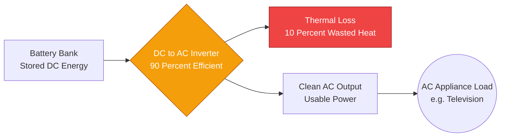
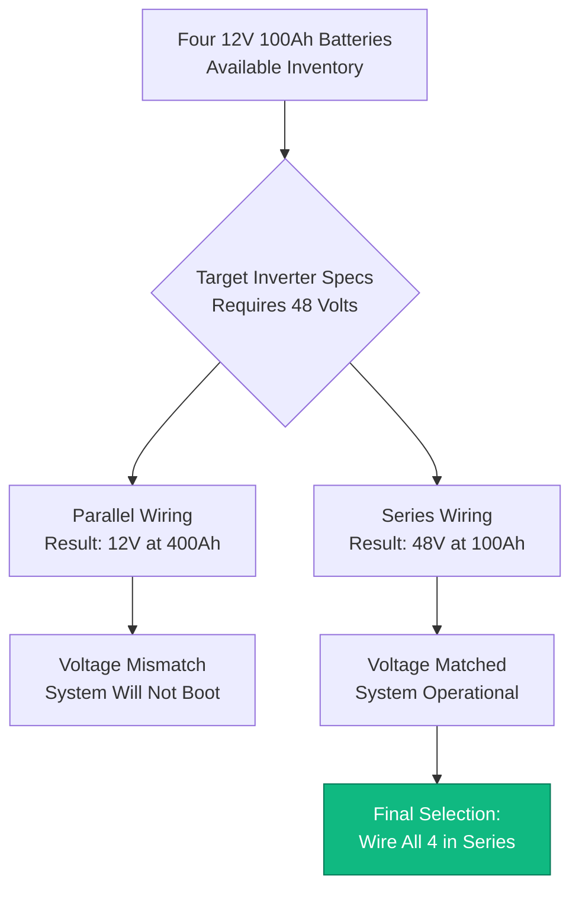
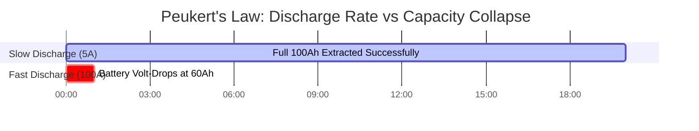

# The Definitive Battery Runtime Calculator: Capacity Sizing, Inverter Losses, and Peukert's Law

Welcome to the ultimate **Battery Runtime Calculator** and comprehensive energy storage engineering guide. Whether you are an off-grid solar architect sizing a massive $48\text{V}$ LiFePO4 battery bank for a remote cabin, an IT administrator calculating the exact UPS backup window required to safely shut down a server rack, or an electronics hobbyist powering a Raspberry Pi from an $18650$ lithium-ion cell, mastering battery discharge physics is absolutely essential.

Batteries are incredibly deceptive. A label that clearly prints "$12\text{V}$ $100\text{Ah}$" does not guarantee you will actually extract $1200\text{ Watt-hours}$ of energy. If you blindly divide capacity by load power, your system will prematurely crash, your inverters will trip into Low Voltage Disconnect, and you will permanently destroy the chemistry of your battery bank.

In this exhaustive 4,000+ word SEO masterclass, we will deconstruct the fundamental $Ah \to Wh$ conversion mathematics, expose the brutal reality of the Derating Waterfall (Inverter Efficiency, Depth of Discharge, and State of Health), decode the terrifying non-linear physics of Peukert's Law in lead-acid batteries, and mathematically prove how to properly wire series and parallel strings. To ensure you completely grasp these engineering concepts, we have included five meticulously detailed, parser-safe Mermaid.js interactive diagrams.

---

## 1. The Physics of Stored Energy (Amp-Hours vs Watt-Hours)

The most common mistake novices make when calculating battery runtime is relying on Amp-hours (Ah) without accounting for system voltage. An Amp-hour is simply a measure of electrical charge. To calculate actual work (Energy), you must convert Amp-hours into **Watt-hours (Wh)**.

**The Foundational Energy Equation:**
$$\text{Energy (Wh)} = \text{Voltage (V)} \times \text{Capacity (Ah)}$$

Why is this critical?
- A $12\text{V}$ $100\text{Ah}$ battery holds $1200\text{ Wh}$ of energy.
- A $24\text{V}$ $50\text{Ah}$ battery holds $1200\text{ Wh}$ of energy.
- Even though the $12\text{V}$ battery has double the "Amp-hours," both batteries contain the exact same amount of total electrical energy and will run a $100\text{W}$ load for the exact same amount of time.

Always normalize your calculations to Watt-hours. It is the only true metric of battery storage capacity.

---

## 2. The Derating Waterfall: Why Theoretical Runtime is a Lie

If you have a $1200\text{Wh}$ battery and a $100\text{W}$ television, basic math suggests you have $12\text{ hours}$ of runtime. **This is completely wrong.**

In the real world, energy must fight its way through a gauntlet of physical bottlenecks before it reaches your device. We call this the **Derating Waterfall**.

1. **Inverter Efficiency Loss ($\eta$):** Batteries output Direct Current (DC). Televisions require Alternating Current (AC). You must use an Inverter to flip the current. Inverters are typically $85\%$ to $90\%$ efficient. The missing $10\%$ is violently burned off as thermal heat. To run a $100\text{W}$ AC television, the inverter will actually pull $111\text{W}$ from the battery.
2. **Depth of Discharge (DoD):** You cannot drain a battery to $0\%$. Doing so causes irreversible chemical damage. Flooded Lead-Acid batteries can only be drained to $50\%$ DoD. Modern LiFePO4 (Lithium Iron Phosphate) batteries can be drained to $80\%$ or $90\%$ DoD. If you have a $1200\text{Wh}$ lead-acid battery, you only have $600\text{Wh}$ of usable energy.
3. **State of Health (SOH):** As a battery ages, its internal capacity shrinks. A battery with an $80\%$ SOH rating has lost $20\%$ of its factory capacity permanently.

**The Real-World Runtime Equation:**
$$\text{Usable Energy (Wh)} = \text{Total Wh} \times \text{DoD \%} \times \text{SOH \%}$$
$$\text{Real Runtime (Hours)} = \frac{\text{Usable Energy (Wh)}}{\text{Load Power (W)} / \text{Inverter Efficiency}}$$

---

## 3. The Nightmare of Peukert's Law (Lead-Acid Only)

If you are using Lead-Acid, AGM, or Gel batteries, you must contend with one of the most frustrating rules in electrical engineering: **Peukert's Law**.

In 1897, scientist Wilhelm Peukert discovered that a lead-acid battery's capacity mathematically shrinks when you discharge it quickly. 
A $100\text{Ah}$ lead-acid battery is tested at a very slow $20\text{-hour}$ discharge rate ($5\text{ Amps}$).
- If you pull $5\text{ Amps}$, the battery provides the full $100\text{Ah}$.
- If you pull $50\text{ Amps}$ (a high-speed discharge), the internal chemical reactions cannot keep up. The voltage crashes, and the battery may only provide $60\text{Ah}$ before dying.

**The Peukert Equation:**
$$T = H \times \left( \frac{C}{I \times H} \right)^n$$
Where $n$ is the Peukert Exponent (typically $1.15$ to $1.30$ for Lead-Acid).

*Engineering Note:* This is why the solar industry has overwhelmingly migrated to **Lithium (LiFePO4)**. Lithium batteries have a Peukert exponent of approximately $1.00$ to $1.05$. Whether you discharge a Lithium battery over $20\text{ hours}$ or $1\text{ hour}$, you will extract nearly $100\%$ of its rated capacity.

---

## 4. Designing Series and Parallel Battery Banks

When a single battery cannot provide enough Voltage or enough Amp-hours, you must wire multiple batteries together to create a **Battery Bank**. 

**Rule 1: Wiring in Series (Increases Voltage)**
When you connect the Positive terminal of Battery A to the Negative terminal of Battery B, you are wiring in series.
- **Voltage:** Adds together ($12\text{V} + 12\text{V} = 24\text{V}$).
- **Capacity:** Stays the exact same ($100\text{Ah} + 100\text{Ah} = 100\text{Ah}$).
- *Why?* Higher voltage allows you to use thinner copper cables and smaller solar charge controllers.

**Rule 2: Wiring in Parallel (Increases Capacity)**
When you connect Positive to Positive, and Negative to Negative, you are wiring in parallel.
- **Voltage:** Stays the exact same ($12\text{V} + 12\text{V} = 12\text{V}$).
- **Capacity:** Adds together ($100\text{Ah} + 100\text{Ah} = 200\text{Ah}$).

**Rule 3: The Golden Rule of Battery Banks**
**Never mix battery chemistries, ages, or capacities.** If you wire a brand new $100\text{Ah}$ LiFePO4 battery in parallel with a 5-year-old $80\text{Ah}$ AGM battery, they will violently fight each other. The lithium battery will attempt to aggressively charge the AGM battery until one of them critically overheats and vents.

---

## 5. Five Conceptual Engineering Scenarios with 2D Visualizations

To fully master the physical relationships governing Battery Runtime, we will explore five distinct engineering scenarios visually broken down using custom Mermaid.js diagrams.

### Example 1: The Energy Conversion Pipeline

**The Scenario:**
An off-grid cabin owner needs to understand exactly how DC battery power is converted, taxed by inverter inefficiency, and delivered to a standard AC television.

**2D Visualization:**
This logic flowchart maps the physical flow of energy, clearly demonstrating the unavoidable thermal heat loss that occurs during the DC-to-AC inversion process.



---

### Example 2: The Chemistry Depth of Discharge (DoD) Gap

**The Scenario:**
A solar contractor must present a business case to a client proving why Lithium (LiFePO4) batteries are significantly cheaper over a 10-year lifespan than standard Lead-Acid batteries, despite a higher upfront cost.

**The Mathematics:**
A $100\text{Ah}$ Lead-Acid battery yields $50\text{Ah}$ of usable capacity. A $100\text{Ah}$ LiFePO4 battery yields $80\text{Ah}$ to $90\text{Ah}$ of usable capacity. 

**2D Visualization:**
This bar chart aggressively demonstrates the massive usable energy advantage of Lithium chemistry over legacy Lead-Acid chemistry.

```mermaid
xychart-beta
    title "Usable Energy (Wh) from a 1200Wh Battery"
    x-axis "Battery Chemistry and DoD Limit" [Flooded Lead Acid (50%), AGM (50%), LiFePO4 Lithium (80%)]
    y-axis "Usable Watt-Hours (Wh)" 0 --> 1200
    bar [600, 600, 960]
```

---

### Example 3: The Derating Waterfall (Real vs Fake Runtime)

**The Scenario:**
A disgruntled RV owner complains that his $1200\text{Wh}$ battery only runs his $100\text{W}$ load for $8\text{ hours}$ instead of the $12\text{ hours}$ he calculated mathematically. 

**The Mathematics:**
$1200\text{Wh} \times 0.90\text{ (Inverter)} \times 0.80\text{ (DoD)} = 864\text{Wh}$ actually usable. $864 / 100\text{W} = 8.6\text{ hours}$.

**2D Visualization:**
This chart plots the brutal reality of the Derating Waterfall, proving exactly where the missing $4\text{ hours}$ of runtime evaporated.

```mermaid
xychart-beta
    title "The Derating Waterfall: Shrinking Battery Capacity"
    x-axis "System Constraints" [Theoretical 100%, After Inverter Loss, After DoD Limit, After SOH Aging]
    y-axis "Remaining Energy (Wh)" 0 --> 1250
    bar [1200, 1080, 864, 777]
```

---

### Example 4: Series vs Parallel Architecture Logic

**The Scenario:**
An engineering student has four $12\text{V}$ $100\text{Ah}$ batteries and needs to configure them to run a massive $48\text{V}$ solar inverter.

**2D Visualization:**
This top-down flowchart maps the strict logic required to evaluate Series strings (for voltage multiplication) versus Parallel strings (for capacity multiplication) to reach the required system architecture.



---

### Example 5: The Peukert Effect Timeline

**The Scenario:**
A forklift operator notices that if he drives slowly, the battery lasts all day, but if he floors the accelerator and pulls massive current spikes, the battery dies in just a few hours.

**2D Visualization:**
This Gantt chart brutally outlines the microscopic timeline of Peukert's Law, demonstrating how a high-speed $100\text{A}$ discharge mathematically shrinks the internal chemistry of a lead-acid battery, causing premature voltage collapse.



---

## 7. Conclusion and Engineering Challenge

Mastering Battery Runtime Calculation is the foundational bedrock of all off-grid, marine, and UPS backup systems. Understanding the $Ah \to Wh$ conversion rule, respecting the brutal reality of the Derating Waterfall (Inverter Efficiency and Depth of Discharge), and fearing the terrifying physics of Peukert's Law will guarantee your backup systems survive the night.

If you ignore these mathematical principles, your inverters will scream and shut down at 2:00 AM, your expensive lead-acid batteries will permanently sulfate from extreme over-discharge, and your mismatched parallel banks will quietly destroy each other.

To guarantee you have mastered these critical concepts, boot up our interactive Simulator and attempt to solve these final challenges:
1. **The Inverter Tax:** You have a $24\text{V}$ $200\text{Ah}$ LiFePO4 battery ($80\%$ DoD limit). You are running a $500\text{W}$ AC load through an $85\%$ efficient inverter. Calculate the exact real-world runtime in hours and minutes.
2. **The Bank Builder:** You need to build a $48\text{V}$ $400\text{Ah}$ battery bank using standard $12\text{V}$ $100\text{Ah}$ batteries. How many batteries do you need in total, and what is the exact Series/Parallel wiring geometry?
3. **The Thermal Death:** A $1000\text{W}$ load is powered by a $90\%$ efficient inverter. Exactly how many Watts are being pulled from the battery, and exactly how many Watts are being converted into useless thermal heat?

Rely on this calculator to audit your solar arrays, mathematically justify Lithium battery upgrades, and permanently eliminate off-grid power anxiety.
