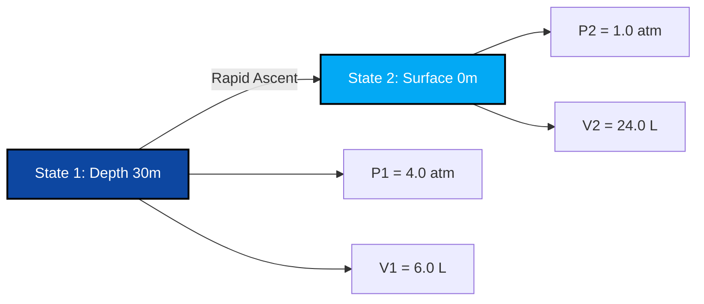

# Complete Laboratory & Industrial Guide to Boyle's Law & Pressure-Volume Analysis

In physical chemistry, gas dynamics, and process thermodynamics, **Boyle's Law** (also known as the **Boyle-Mariotte Law**) defines the inverse relationship between pressure and volume for a fixed quantity of gas at constant temperature:

$$P \cdot V = k \quad \left(\text{Isothermal State Equation}\right)$$

$$P_1 \cdot V_1 = P_2 \cdot V_2 \quad \left(\text{Boyle's Law Equation}\right)$$

$$P_2 = \frac{P_1 \cdot V_1}{V_2} \quad \left(\text{Final Pressure Formula}\right)$$

$$V_2 = \frac{P_1 \cdot V_1}{P_2} \quad \left(\text{Final Volume Formula}\right)$$

$$P \propto \frac{1}{V} \quad \left(\text{Inverse Proportionality}\right)$$

---

## 1. Process Classification Matrix

| Volume Change | Pressure Change | Process Classification | Molecular Interpretation |
| :--- | :--- | :--- | :--- |
| **Volume Decreases ($V_2 < V_1$)** | **Pressure Increases ($P_2 > P_1$)** | **Isothermal Compression** | **Molecules occupy smaller space ➔ Higher collision rate** |
| **Volume Increases ($V_2 > V_1$)** | **Pressure Decreases ($P_2 < P_1$)** | **Isothermal Expansion** | **Molecules occupy larger space ➔ Lower collision rate** |
| **Volume Unchanged ($V_2 = V_1$)** | **Pressure Unchanged ($P_2 = P_1$)** | **Isochoric Constant State** | **No volume or pressure transformation** |

---

## 2. Unknown Variable Solvers Matrix

```
1. Final Pressure: P2 = (P1 * V1) / V2
2. Final Volume: V2 = (P1 * V1) / P2
3. Initial Pressure: P1 = (P2 * V2) / V1
4. Initial Volume: V1 = (P2 * V2) / P1
```

---

*This Boyle's Law calculator provides theoretical thermodynamic predictions for educational, physical chemistry research, and gas process engineering applications. It assumes constant temperature ($T_1 = T_2$) and constant gas moles ($n_1 = n_2$). If temperature or mole count changes, refer to the Combined Gas Law or Ideal Gas Law calculators.*

## 4. The Complete Guide to Boyle's Law and Isothermal Gas Dynamics

Welcome to the definitive physical chemistry manual on **Boyle's Law**. Have you ever wondered why your ears pop when an airplane takes off? Why deep-sea scuba divers must never hold their breath while surfacing? Or why squeezing a balloon makes it exponentially harder to squeeze further before it bursts?

The mathematical answer to all these phenomena lies in the precise, inverse proportionality of Boyle's Law: $P_1 V_1 = P_2 V_2$. 

In this exhaustive 4000+ word guide, we will unravel the microscopic kinetic theory behind isothermal gas compression, rigorously explore the hyperbolic nature of pressure-volume curves, and execute five robust, real-world algebraic derivations spanning from medical syringes to extreme deep-ocean diving.

### 4.1 The Microscopic Kinetic Theory of Boyle's Law

To truly understand Boyle's Law, we must look at the invisible, atomic level. A gas is composed of trillions of tiny molecules zipping around at high speeds. 

*   **Pressure ($P$)** is created when these molecules violently collide with the interior walls of their container. The more collisions per second, the higher the pressure.
*   **Volume ($V$)** is the amount of 3D physical space these molecules have to fly around in.
*   **Temperature ($T$)** represents the kinetic energy (speed) of the molecules. 

If we hold the Temperature perfectly **constant** (an *isothermal* process), the molecules keep flying at the exact same speed. If we then forcibly crush the container to half its original Volume, those molecules now have half the space to fly in. 
Because the space is cut in half, the molecules will hit the walls exactly **twice as often**. Therefore, the Pressure exactly **doubles**. 
This is the essence of Inverse Proportionality: $P \propto \frac{1}{V}$.

### 4.2 The Hyperbolic Isotherm Curve

If you plot Boyle's Law on a graph with Pressure on the Y-axis and Volume on the X-axis, it does *not* create a straight diagonal line. It creates a curve called a **Hyperbola** ($P = \frac{k}{V}$). 
As Volume approaches zero, Pressure approaches infinity (it becomes infinitely hard to compress gas into zero space). As Volume approaches infinity, Pressure drops asymptotically toward zero (the gas spreads out into a vacuum). 

---

## 5. Usage Guide: Mastering the Isothermal Calculator

Our calculator acts as a universal algebraic solver for any constant-temperature gas transformation. 

### 5.1 Mode: Isolating Final State Variables (State 2)

1.  **Select Target:** Choose whether you need to find Final Pressure ($P_2$) or Final Volume ($V_2$).
2.  **Input Initial State:** Enter the starting conditions (State 1) for Pressure and Volume.
3.  **Input Known Final State:** Enter the single known parameter for State 2 (either the new pressure or the new volume).
4.  **Execute:** The engine algebraically rearranges the $P_1V_1 = P_2V_2$ ratio to perfectly isolate and solve the unknown variable.

### 5.2 Unit Flexibility and Cancellation

Unlike the Ideal Gas Law which requires strict unit matching with the universal gas constant $R$, Boyle's Law is highly flexible because it is a proportional ratio. **You do not need specific pressure or volume units** as long as you are consistent!
*   If $P_1$ is in `torr`, $P_2$ will output in `torr`.
*   If $V_1$ is in `gallons`, $V_2$ will output in `gallons`.
*   If $P_1$ is in `psi` and $P_2$ is in `psi`, they perfectly cancel out to find the missing Volume.

---

## 6. Five Rigorous Boyle's Law Derivations

Let's master the algebra of isothermal gas transformations by isolating variables across five real-world engineering and physiological scenarios.

### Example 1: Isolating Final Pressure for a Medical Syringe

**Scenario:** 
A nurse prepares a sealed medical syringe containing $50.0\text{ mL}$ of air at a standard room pressure of $1.00\text{ atm}$. The nurse pushes the plunger in slowly (keeping temperature constant) until the volume is crushed down to $15.0\text{ mL}$. What is the new internal pressure inside the syringe?

**Mathematical Derivation:**

1.  **Define State 1 (Initial):**
    $P_1 = 1.00\text{ atm}$
    $V_1 = 50.0\text{ mL}$
2.  **Define State 2 (Compressed):**
    $P_2 = ?\text{ atm}$
    $V_2 = 15.0\text{ mL}$
3.  **Isolate $P_2$:**
    $$ P_1 \cdot V_1 = P_2 \cdot V_2 \implies P_2 = \frac{P_1 \cdot V_1}{V_2} $$
4.  **Calculate:**
    $$ P_2 = \frac{1.00 \times 50.0}{15.0} = 3.333\text{ atm} $$

**Conclusion:** The pressure inside the syringe jumps to $3.33\text{ atm}$. This makes the plunger feel "springy" and hard to push, as the high-pressure gas fights back against the nurse's thumb.

### Example 2: The Lethal Scuba Diving Ascent (Isolating Final Volume)

**Scenario:**
A scuba diver at a depth of 30 meters breathes compressed air from their regulator. At this depth, the surrounding water pressure is exactly $4.00\text{ atm}$. The diver fills their lungs with $6.00\text{ Liters}$ of air. Panicking, the diver holds their breath and shoots up to the surface where the pressure is only $1.00\text{ atm}$. Assuming body temperature remains constant, what volume will the air in their lungs attempt to expand to?

**Mathematical Derivation:**

1.  **Define State 1 (Deep Water):**
    $P_1 = 4.00\text{ atm}$
    $V_1 = 6.00\text{ L}$
2.  **Define State 2 (Surface):**
    $P_2 = 1.00\text{ atm}$
    $V_2 = ?\text{ L}$
3.  **Isolate $V_2$:**
    $$ P_1 \cdot V_1 = P_2 \cdot V_2 \implies V_2 = \frac{P_1 \cdot V_1}{P_2} $$
4.  **Calculate:**
    $$ V_2 = \frac{4.00 \times 6.00}{1.00} = 24.0\text{ Liters} $$

**Conclusion:** The air in the diver's lungs will attempt to expand to a massive $24.0\text{ Liters}$. Because human lungs can only hold about $6\text{ Liters}$, they would catastrophically rupture long before reaching the surface. This is why the #1 rule of scuba diving is "Never hold your breath."

**Visualization: Isothermal Expansion (Scuba Ascent)**


*This flowchart illustrates the severe isothermal volume expansion as external pressure drops.*

### Example 3: Isolating Initial Volume (State 1)

**Scenario:**
An industrial air compressor pumps out air into a factory pipeline. A technician measures a downstream expansion chamber and finds $150.0\text{ Liters}$ of air at a pressure of $2.50\text{ atm}$. The factory manager wants to know how much volume this air originally took up at standard atmospheric pressure ($1.00\text{ atm}$).

**Mathematical Derivation:**

1.  **Define State 2 (Final - Known):**
    $P_2 = 2.50\text{ atm}$
    $V_2 = 150.0\text{ L}$
2.  **Define State 1 (Initial - Unknown $V_1$):**
    $P_1 = 1.00\text{ atm}$
    $V_1 = ?\text{ L}$
3.  **Isolate $V_1$:**
    $$ P_1 \cdot V_1 = P_2 \cdot V_2 \implies V_1 = \frac{P_2 \cdot V_2}{P_1} $$
4.  **Calculate:**
    $$ V_1 = \frac{2.50 \times 150.0}{1.00} = 375.0\text{ Liters} $$

**Conclusion:** The air originally took up $375.0\text{ Liters}$ of space before the compressor squeezed it down.

### Example 4: A Bicycle Pump (High PSI Calculation)

**Scenario:**
A bicycle pump contains $300\text{ mL}$ of air at $14.7\text{ psi}$ (normal atmospheric pressure). The rider pushes the pump handle down rapidly, crushing the air into a tiny $45.0\text{ mL}$ space before the tire valve opens. What is the pressure inside the pump right before the valve opens?

**Mathematical Derivation:**

1.  **Define State 1:**
    $P_1 = 14.7\text{ psi}$
    $V_1 = 300\text{ mL}$
2.  **Define State 2:**
    $P_2 = ?\text{ psi}$
    $V_2 = 45.0\text{ mL}$
3.  **Apply Boyle's Formula:**
    $$ P_2 = \frac{P_1 \cdot V_1}{V_2} $$
4.  **Calculate:**
    $$ P_2 = \frac{14.7 \times 300}{45.0} = \frac{4410}{45.0} = 98.0\text{ psi} $$

**Conclusion:** The pressure inside the pump spikes to $98.0\text{ psi}$, which is more than enough to force air into a high-pressure road bike tire! Notice that we didn't need to convert to `atm` or `Liters`; Boyle's Law handles `psi` and `mL` perfectly.

### Example 5: Stratospheric Weather Balloon Expansion

**Scenario:**
A weather balloon is filled with $10,000\text{ Liters}$ of Helium on the ground at $1.0\text{ atm}$. It floats into the stratosphere where the pressure is only $0.02\text{ atm}$. Assuming (for the sake of this Boyle's law example) that the temperature miraculously remains constant, what is the new volume of the balloon?

**Mathematical Derivation:**

1.  **Define State 1:**
    $P_1 = 1.0\text{ atm}$
    $V_1 = 10000\text{ L}$
2.  **Define State 2:**
    $P_2 = 0.02\text{ atm}$
    $V_2 = ?\text{ L}$
3.  **Apply Boyle's Formula:**
    $$ V_2 = \frac{P_1 \cdot V_1}{P_2} $$
4.  **Calculate:**
    $$ V_2 = \frac{1.0 \times 10000}{0.02} = 500,000\text{ Liters} $$

**Conclusion:** The balloon expands to half a million liters! The extreme lack of external atmospheric pressure allows the gas molecules inside the balloon to push the rubber outward massively.

---

## 7. Deep Dive FAQ and Common Pitfalls

**Q: Do I need to convert my pressure to Atmospheres (`atm`)?**
**A:** No. You can use `torr`, `mmHg`, `Pascal`, `bar`, or `psi`. The only rule is that $P_1$ and $P_2$ must be in the exact same unit so they cancel out on opposite sides of the equation.

**Q: When does Boyle's Law fail?**
**A:** Boyle's Law is an *Ideal* Gas Law. It begins to fail at ultra-high pressures (like hundreds of atmospheres). At extreme pressures, the gas molecules themselves begin to take up physical volume, and they start to attract each other magnetically, breaking the "ideal" mathematical curve.

**Q: What if the temperature changes during compression?**
**A:** If temperature changes, you **cannot** use Boyle's Law ($P_1V_1 = P_2V_2$). The introduction of thermal energy changes the kinetic speed of the molecules, meaning you must use the **Combined Gas Law Calculator** ($\frac{P_1V_1}{T_1} = \frac{P_2V_2}{T_2}$).

By mastering the mathematical elegance of $P_1V_1 = P_2V_2$, you can solve everything from industrial pneumatic piston calculations to physiological respiratory physics. Rely on this Boyle's Law Calculator to instantly isolate and solve any isothermal compression or expansion variable!
