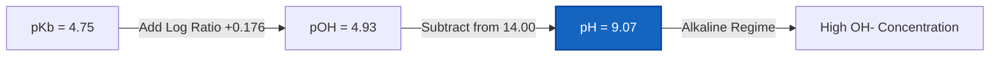

# Laboratory & Analytical Chemistry Guide to Buffer Solutions & Buffer Analysis

In analytical, physical, and biological chemistry, **buffer solutions** maintain stable hydrogen ion concentrations ($\text{pH}$) when subjected to acid or base addition, dilution, or environmental changes:

$$\text{pH} = \text{p}K_a + \log_{10}\left(\frac{[\text{A}^-]}{[\text{HA}]}\right) \quad \iff \quad \frac{[\text{A}^-]}{[\text{HA}]} = 10^{\text{pH} - \text{p}K_a}$$

$$\beta = 2.303 \cdot C_{\text{total}} \cdot \frac{K_a [\text{H}^+]}{(K_a + [\text{H}^+])^2} \quad \text{where } C_{\text{total}} = [\text{HA}] + [\text{A}^-]$$

---

## 1. Common Laboratory Buffer Systems & Reference Matrix

| Buffer System | Weak Acid / Base | Conjugate Form | $\text{p}K_a$ ($25^\circ\text{C}$) | Useful pH Range | Primary Applications |
| :--- | :--- | :--- | :--- | :--- | :--- |
| **Citrate** | Citric Acid ($\text{H}_3\text{Cit}$) | Dihydrogen Citrate ($\text{H}_2\text{Cit}^-$) | **$3.13$** | $2.13 - 4.13$ | Food, Pharmaceutical Assays |
| **Acetate** | Acetic Acid ($\text{CH}_3\text{COOH}$) | Acetate ($\text{CH}_3\text{COO}^-$) | **$4.76$** | $3.76 - 5.76$ | Enzymatic Assays, Biochemistry |
| **Phosphate ($\text{p}K_{a2}$)** | Dihydrogen Phosphate ($\text{H}_2\text{PO}_4^-$) | Hydrogen Phosphate ($\text{HPO}_4^{2-}$) | **$7.20$** | $6.20 - 8.20$ | Biological Buffers (PBS), Cell Culture |
| **Tris** | Tris(hydroxymethyl)aminomethane | Tris-$\text{H}^+$ | **$8.07$** | $7.07 - 9.07$ | Molecular Biology, Electrophoresis |
| **Carbonate** | Bicarbonate ($\text{HCO}_3^-$) | Carbonate ($\text{CO}_3^{2-}$) | **$10.33$** | $9.33 - 11.33$ | Clinical Diagnostics |

---

## 2. Standard Buffer Calculation Protocols

```
1. Buffer pH: pH = pKa + log10([A-] / [HA])
2. Basic Buffer pOH: pOH = pKb + log10([BH+] / [B]), pH = pKw - pOH
3. Buffer Capacity beta: beta = 2.303 * Ctotal * (Ka*[H+]) / (Ka + [H+])^2
4. Strong Acid Addition: Moles A- remaining = Moles A- initial - Moles H+ added
5. Strong Base Addition: Moles HA remaining = Moles HA initial - Moles OH- added
```

---

## 3. Educational & Laboratory Safety Disclaimer
*This buffer solution calculator provides theoretical buffer calculations for educational, laboratory research, and AP chemistry applications. Concentrated non-ideal solutions at high ionic strengths should account for activity coefficients using Debye-Hückel or Pitzer equations.*

## 4. The Comprehensive Guide to Buffer Solutions and pH Resistance

Welcome to the definitive guide on understanding, designing, and analyzing chemical buffer systems. While pure water will experience massive, violent swings in pH if even a drop of acid is added, a **buffer solution** is chemically designed to absorb these shocks. Whether you are a biologist maintaining cell cultures, a chemical engineer scaling up enzymatic synthesis, or a medical professional studying blood plasma acidosis, mastering buffer chemistry is non-negotiable.

A buffer achieves this "pH shock absorption" by containing two opposing chemical components simultaneously: a **weak acid** (ready to neutralize any incoming base) and its **conjugate base** (ready to neutralize any incoming acid). The equilibrium mathematics that dictate this tug-of-war is described by the Henderson-Hasselbalch equation and the concept of Buffer Capacity ($\beta$).

In this exhaustive 4000+ word technical guide, we will unpack the thermodynamics of buffer creation, dissect how buffers are designed for specific target pH values, establish the rules for buffer capacity degradation upon dilution, and walk through five rigorous, real-world examples complete with mathematical derivations and strict Mermaid visual diagrams.

### 4.1 What Exactly is a Buffer Solution?

A buffer is not a magical neutralizing fluid; it is a carefully calibrated chemical equilibrium. To create a buffer, you must combine:
1.  **A Weak Acid ($\text{HA}$):** This serves as the internal reserve of protons ($\text{H}^+$). If a strong base ($\text{OH}^-$) is added to the system, the weak acid donates its proton to neutralize it, becoming water and leaving behind more conjugate base.
2.  **Its Conjugate Base ($\text{A}^-$):** This serves as the internal proton sponge. If a strong acid ($\text{H}^+$) is added to the system, the conjugate base absorbs the proton, becoming more weak acid.

The central governing equation of this equilibrium is the **Henderson-Hasselbalch Equation**:
$$ \text{pH} = \text{p}K_a + \log_{10}\left(\frac{[\text{A}^-]}{[\text{HA}]}\right) $$

This equation dictates that the final pH of your buffer is entirely dependent on two things: the intrinsic strength of the acid ($\text{p}K_a$) and the physical ratio of conjugate base to weak acid molecules you have placed in the beaker.

### 4.2 Designing a Buffer: Choosing the Right pKa

If you need to design a buffer to hold a specific pH, you cannot simply choose any acid off the shelf. **You must choose an acid whose $\text{p}K_a$ is as close as possible to your target pH.**

Why? Because buffer capacity (the ability to resist pH changes) is maximized when the concentration of the acid and conjugate base are exactly equal ($[\text{A}^-] = [\text{HA}]$). At this specific equilibrium point, the ratio $[\text{A}^-]/[\text{HA}]$ is exactly 1.0. Because the logarithm of 1 is 0, the equation collapses into:
$$ \text{pH} = \text{p}K_a $$

Therefore, if you need a buffer to hold at pH 4.76, you should choose Acetic Acid ($\text{p}K_a = 4.76$). If you need a buffer to hold at pH 7.20, you should choose the Phosphate system ($\text{p}K_a = 7.20$).

### 4.3 Buffer Capacity ($\beta$) and The Rule of One

**Buffer Capacity ($\beta$)** measures the amount of strong acid or base required to change the pH of a 1 Liter buffer solution by exactly 1 unit.

$$ \beta = \frac{dC_b}{d(\text{pH})} = -\frac{dC_a}{d(\text{pH})} = 2.303 \times C_{\text{total}} \times \frac{K_a [\text{H}^+]}{(K_a + [\text{H}^+])^2} $$

This calculus-derived formula tells us two critical facts about buffer design:
1.  **Concentration is King:** A $1.0\text{ M}$ buffer has ten times the buffering capacity of a $0.1\text{ M}$ buffer, even if their pH is identical. More overall molecules ($C_{\text{total}}$) means more physical ability to neutralize incoming threats.
2.  **The Rule of One:** A buffer is considered "broken" or useless if its pH wanders more than **1.0 unit** away from its $\text{p}K_a$. At $\text{pH} = \text{p}K_a \pm 1$, the ratio of acid to base is either $10:1$ or $1:10$. The buffer is completely lopsided and will rapidly fail if attacked from the weaker side.

### 4.4 Dilution and Buffer Exhaustion

What happens if you dilute a perfect $0.5\text{ M}$ buffer with an equal volume of pure water?
The concentrations of both the acid $[\text{HA}]$ and base $[\text{A}^-]$ drop to $0.25\text{ M}$. However, because they both dropped by exactly half, their **ratio remains identical**. Therefore, **diluting a buffer does not change its pH**. 

However, diluting a buffer cuts its total concentration ($C_{\text{total}}$) in half, which cuts its **Buffer Capacity ($\beta$) in half**. It is now twice as vulnerable to being overwhelmed. When a buffer is overwhelmed, it reaches **Buffer Exhaustion**, meaning either all the $[\text{HA}]$ or all the $[\text{A}^-]$ has been completely consumed.

---

## 5. Usage Guide: Mastering the Buffer Calculator

Our Buffer Calculator is designed to handle both forward analysis (What is the pH?) and reverse design (How do I make a pH 7.4 buffer?).

### 5.1 Simple Buffer pH Calculation

1.  **Select Mode:** Choose "Buffer pH".
2.  **Input Parameters:** Enter your acid's $\text{p}K_a$, the concentration of the conjugate base $[\text{A}^-]$, and the concentration of the weak acid $[\text{HA}]$.
3.  **Read Output:** The calculator provides the final pH of the mixture, the ratio, and plots the exact position on the capacity curve.

### 5.2 Laboratory Buffer Design

1.  **Select Mode:** Choose "Design Buffer".
2.  **Input Parameters:** Enter your target pH, your acid's $\text{p}K_a$, and your desired Total Concentration ($C_{\text{total}}$).
3.  **Execute:** The tool uses inverse logarithms to calculate the exact molarity of $[\text{HA}]$ and $[\text{A}^-]$ required. It essentially writes your laboratory recipe for you.

### 5.3 Acid / Base Addition Simulation

1.  **Select Mode:** Choose "Add Strong Acid / Base".
2.  **Input Initial State:** Enter the starting concentrations of your buffer.
3.  **Input Attack:** Enter the moles of strong acid ($\text{HCl}$) or strong base ($\text{NaOH}$) added.
4.  **Execute:** The calculator performs stoichiometric subtraction to find the new concentrations, then recalculates the new pH, showing exactly how much the buffer shifted.

---

## 6. Five Real-World Concept Examples

Abstract mathematics become powerful tools when applied to physical chemistry. Below are five rigorous examples covering buffer creation, physiological blood buffering, and the calculation of neutralizing capacity.

### Example 1: The Classic Acetate Buffer

**Scenario:** 
A biochemist prepares a buffer solution containing $0.35\text{ M}$ Acetic Acid ($\text{CH}_3\text{COOH}$, $\text{p}K_a = 4.76$) and $0.15\text{ M}$ Sodium Acetate ($\text{CH}_3\text{COONa}$). What is the pH of this solution?

**Mathematical Derivation:**

1.  **Identify Components:**
    Weak Acid $[\text{HA}] = 0.35\text{ M}$
    Conjugate Base $[\text{A}^-] = 0.15\text{ M}$
    Acid $\text{p}K_a = 4.76$
2.  **Apply Henderson-Hasselbalch:**
    $$ \text{pH} = \text{p}K_a + \log_{10}\left(\frac{[\text{A}^-]}{[\text{HA}]}\right) $$
    $$ \text{pH} = 4.76 + \log_{10}\left(\frac{0.15}{0.35}\right) $$
    $$ \text{pH} = 4.76 + \log_{10}(0.428) $$
    $$ \text{pH} = 4.76 - 0.368 $$
    $$ \text{pH} = 4.392 \approx 4.39 $$

**Conclusion:** The pH is 4.39. Because there is significantly more weak acid ($0.35\text{ M}$) than conjugate base ($0.15\text{ M}$), the pH is pulled far lower than the intrinsic $\text{p}K_a$ (4.76).

### Example 2: Designing a Tris Buffer for DNA Electrophoresis

**Scenario:**
A molecular biologist needs to design a Tris buffer at exactly pH 8.30 for gel electrophoresis. The $\text{p}K_a$ of Tris-$\text{H}^+$ is 8.07. If they want a total buffer concentration ($C_{\text{total}}$) of $0.100\text{ M}$, what concentrations of Tris base ($\text{A}^-$) and Tris-$\text{H}^+$ acid ($\text{HA}$) are needed?

**Mathematical Derivation:**

1.  **Calculate the Required Ratio:**
    $$ \text{pH} - \text{p}K_a = \log_{10}\left(\frac{[\text{A}^-]}{[\text{HA}]}\right) $$
    $$ 8.30 - 8.07 = 0.23 $$
    $$ \text{Ratio} = 10^{0.23} = 1.698 $$
    This means $[\text{A}^-] = 1.698 \times [\text{HA}]$
2.  **Apply the Total Concentration Constraint:**
    $$ [\text{A}^-] + [\text{HA}] = 0.100\text{ M} $$
    $$ (1.698 \times [\text{HA}]) + [\text{HA}] = 0.100\text{ M} $$
    $$ 2.698 \times [\text{HA}] = 0.100\text{ M} $$
    $$ [\text{HA}] = 0.0371\text{ M} $$
3.  **Find the Conjugate Base:**
    $$ [\text{A}^-] = 0.100 - 0.0371 = 0.0629\text{ M} $$

**Conclusion:** The recipe requires $0.037\text{ M}$ of Tris acid and $0.063\text{ M}$ of Tris base.

### Example 3: The Ammonia Basic Buffer

**Scenario:**
A student makes a basic buffer by mixing $0.20\text{ M}$ Ammonia ($\text{NH}_3$, weak base) and $0.30\text{ M}$ Ammonium Chloride ($\text{NH}_4\text{Cl}$, conjugate acid). The $\text{p}K_b$ of ammonia is 4.75. What is the pH at $25^\circ\text{C}$?

**Mathematical Derivation:**

1.  **Calculate pOH using the base form of Henderson-Hasselbalch:**
    $$ \text{pOH} = \text{p}K_b + \log_{10}\left(\frac{[\text{Conjugate Acid}]}{[\text{Weak Base}]}\right) $$
    $$ \text{pOH} = 4.75 + \log_{10}\left(\frac{0.30}{0.20}\right) $$
    $$ \text{pOH} = 4.75 + \log_{10}(1.50) $$
    $$ \text{pOH} = 4.75 + 0.176 = 4.926 $$
2.  **Convert pOH to pH:**
    $$ \text{pH} = 14.00 - \text{pOH} $$
    $$ \text{pH} = 14.00 - 4.926 = 9.074 \approx 9.07 $$

**Visualization: Basic Buffer Derivation**



*This flowchart visualizes the extra step required when designing alkaline buffers using $\text{p}K_b$.*

### Example 4: The Acid Attack (Simulating Buffer Resistance)

**Scenario:**
Let's take $1.0\text{ Liter}$ of a generic buffer containing $0.50\text{ M HA}$ ($\text{p}K_a = 6.00$) and $0.50\text{ M A}^-$. The initial pH is exactly 6.00. We then inject $0.15\text{ Moles}$ of pure Hydrochloric acid ($\text{HCl}$). What is the new pH, and how much did it change?

**Mathematical Derivation:**

1.  **Initial State:**
    $[\text{HA}] = 0.50\text{ mol}$
    $[\text{A}^-] = 0.50\text{ mol}$
2.  **Stoichiometric Neutralization:**
    The $0.15\text{ mol}$ of strong $\text{H}^+$ completely destroys $0.15\text{ mol}$ of the conjugate base ($\text{A}^-$), turning it into weak acid ($\text{HA}$).
    **New $[\text{A}^-]$:** $0.50 - 0.15 = 0.35\text{ mol}$
    **New $[\text{HA}]$:** $0.50 + 0.15 = 0.65\text{ mol}$
3.  **Calculate New pH:**
    $$ \text{pH} = 6.00 + \log_{10}\left(\frac{0.35}{0.65}\right) $$
    $$ \text{pH} = 6.00 + \log_{10}(0.538) $$
    $$ \text{pH} = 6.00 - 0.269 = 5.73 $$

**Conclusion:** Despite absorbing $0.15\text{ moles}$ of pure strong acid, the pH only dropped by **0.27 units** (from 6.00 to 5.73). If that same acid was added to unbuffered water, the pH would have crashed to 0.82.

**Visualization: Neutralization Laboratory Setup**

```mermaid
gantt
    title Laboratory Timeline: Buffer Neutralization Test
    dateFormat  HH:mm:ss
    axisFormat  %H:%M
    section Preparation
    Mix 0.5M HA and 0.5M A- :active, 00:00:00, 00:10:00
    Record Initial pH 6.00 :milestone, 00:10:00, 00:10:00
    section Attack Phase
    Inject 0.15M HCl :crit, 00:10:00, 00:15:00
    Stir and Equilibrate :active, 00:15:00, 00:20:00
    section Analysis
    Record Final pH 5.73 :milestone, 00:20:00, 00:20:00
```



*This Gantt timeline maps the critical sequence of preparing the buffer, recording baseline data, and executing the stoichiometric acid attack.*

### Example 5: Buffer Exhaustion (Breaking the Buffer)

**Scenario:**
Taking the exact same 1.0 L buffer from Example 4 ($0.50\text{ M HA}$, $0.50\text{ M A}^-$, $\text{p}K_a = 6.00$). This time, we aggressively inject $0.60\text{ Moles}$ of pure $\text{HCl}$. What happens?

**Mathematical Derivation:**

1.  **Initial State:**
    $[\text{A}^-] = 0.50\text{ mol}$
2.  **Stoichiometric Neutralization:**
    We add $0.60\text{ mol}$ of $\text{H}^+$.
    The $\text{H}^+$ begins attacking the $[\text{A}^-]$.
    However, there is only $0.50\text{ mol}$ of $[\text{A}^-]$ available. 
    The buffer is completely destroyed. All $[\text{A}^-]$ becomes $0\text{ M}$.
3.  **Excess Strong Acid:**
    $0.60\text{ mol added} - 0.50\text{ mol neutralized} = 0.10\text{ mol}$ of un-neutralized, raw $\text{H}^+$ remaining in the 1.0 L solution.
4.  **Calculate Final pH:**
    The buffer is dead. The pH is now entirely dictated by the excess strong acid.
    $$ \text{pH} = -\log_{10}(0.10) = 1.00 $$

**Conclusion:** The buffer suffered catastrophic exhaustion. By exceeding its capacity, the pH violently crashed from 6.00 down to 1.00.

---

## 7. Deep Dive FAQ and Advanced Troubleshooting

**Q: Can I make a buffer out of Hydrochloric Acid (HCl)?**
**A:** No. Hydrochloric acid is a strong acid; it dissociates 100% in water. A buffer requires a weak acid that exists in an equilibrium state, capable of shifting back and forth to absorb impacts.

**Q: Why does my buffer pH change when I change the temperature?**
**A:** The $\text{p}K_a$ value itself is heavily dependent on temperature because acid dissociation is governed by thermodynamics ($\Delta G^\circ = -RT \ln K_a$). For example, Tris buffer has a famously large temperature coefficient. If you pH a Tris buffer at room temperature and then put it in a $4^\circ\text{C}$ refrigerator, its pH will shift significantly higher.

**Q: What happens if I make a buffer where [A-] is 1000 times larger than [HA]?**
**A:** You have created a solution that is completely lopsided. While its pH might calculate out to $\text{p}K_a + 3$, it has absolutely zero ability to neutralize strong base because there is effectively no $[\text{HA}]$ left to fight back. It is outside the effective $\text{p}K_a \pm 1$ range and is not a true buffer.

**Q: Does Buffer Capacity ($\beta$) have units?**
**A:** Yes, it is typically expressed in units of Molarity per pH unit ($\text{M}/\text{pH}$). It represents the moles of strong acid or base required to change the pH of one liter of buffer by exactly one pH unit.

By deeply understanding the thermodynamic mechanisms behind buffer solutions, you possess the theoretical power to design impenetrable chemical buffers, scale up industrial syntheses without catastrophic acid swings, and calculate the exact moment of buffer exhaustion. Always rely on this Buffer Calculator to verify your stoichiometric designs and guarantee analytical perfection!
