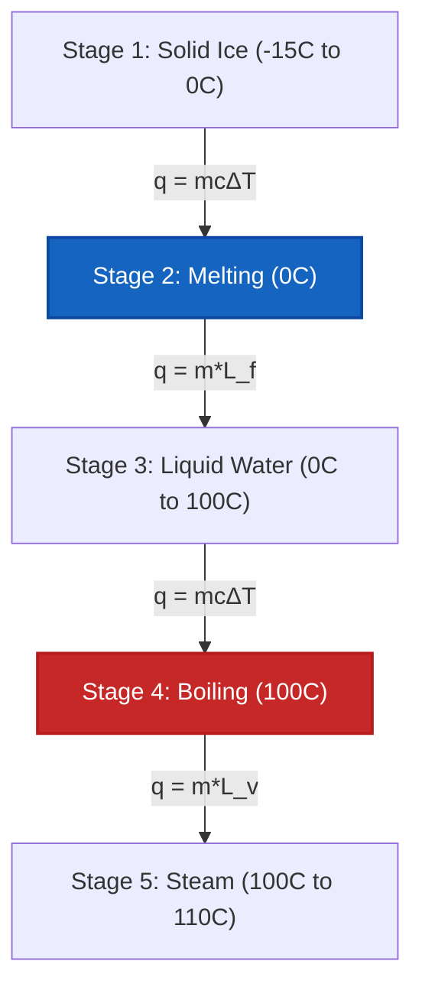

# Complete Laboratory & Industrial Guide to Calorimetry & Heat Transfer

In physical chemistry, thermodynamics, and chemical process engineering, **Calorimetry** measures thermal energy exchange in closed and isolated systems:

$$q = m \cdot c \cdot \Delta T \quad \left(\text{Sensible Heat Transfer}\right)$$

$$q_{\text{phase}} = m \cdot L \quad \left(\text{Latent Heat of Phase Change}\right)$$

$$m_1 c_1 (T_{\text{eq}} - T_1) + m_2 c_2 (T_{\text{eq}} - T_2) + C_{\text{cal}} (T_{\text{eq}} - T_{\text{cal,init}}) = 0$$

$$T_{\text{eq}} = \frac{m_1 c_1 T_1 + m_2 c_2 T_2}{m_1 c_1 + m_2 c_2} \quad \left(\text{Thermal Equilibrium Temperature}\right)$$

$$q_{\text{rxn}} = -\left(q_{\text{solution}} + q_{\text{calorimeter}}\right)$$

---

## 1. Calorimetry Equipment & Experiment Modes Comparison

| Mode | Operating Condition | Primary Equation | Measured Value |
| :--- | :--- | :--- | :--- |
| **Coffee-Cup Calorimeter** | **Constant Pressure ($P = \text{const}$)** | $q_{\text{rxn}} = -(m c \Delta T + C_{\text{cal}} \Delta T)$ | **Enthalpy Change ($\Delta H$)** |
| **Bomb Calorimeter** | **Constant Volume ($V = \text{const}$)** | $q_v = -C_{\text{cal}} \Delta T$ | **Internal Energy ($\Delta U$)** |
| **Thermal Equilibrium** | **Isolated System ($q_{\text{total}} = 0$)** | $T_{\text{eq}} = \frac{\sum m_i c_i T_i}{\sum m_i c_i}$ | **Equilibrium Temp ($T_{\text{eq}}$)** |
| **Phase Change** | **Constant Temperature ($T = \text{const}$)** | $q = m \cdot L_f$ or $q = m \cdot L_v$ | **Latent Heat ($L$)** |

---

## 2. Thermochemistry Calculation Methods Matrix

```
1. Sensible Heat Transferred: q = m * c * (T_final - T_initial)
2. Thermal Equilibrium: T_eq = (m1*c1*T1 + m2*c2*T2) / (m1*c1 + m2*c2)
3. Coffee-Cup Reaction Heat: q_rxn = -(q_sol + q_cal)
4. Bomb Calorimetry Heat: q_v = ΔU = -C_cal * ΔT
5. Latent Heat of Fusion: q_melt = m * L_f
6. Latent Heat of Vaporization: q_boil = m * L_v
7. Multi-Stage Heating Curve: q_total = q_solid + q_melt + q_liquid + q_boil + q_gas
```

---

*This Calorimetry calculator provides theoretical heat-transfer predictions for educational, physical chemistry research, and process engineering applications. Real calorimetric measurements should account for calorimeter heat capacity ($C_{\text{cal}}$), heat loss to surroundings, and non-ideal solution mixing.*

## 4. The Complete Guide to Calorimetry and Thermal Equilibrium

Welcome to the definitive physical chemistry manual on **Calorimetry and Heat Transfer**. In thermodynamics, energy cannot be created or destroyed, only transferred. Calorimetry is the rigorous mathematical science of tracking exactly where that thermal energy goes.

In this exhaustive 4000+ word guide, we will master the physics of specific heat capacity, the thermodynamic balance of isolated systems ($q_{\text{lost}} + q_{\text{gained}} = 0$), and the hidden thermal load of phase changes (Latent Heat). We will cover constant-pressure coffee-cup systems and constant-volume steel bombs. Finally, we will solve five rigorous, real-world heat transfer scenarios and visualize thermal dynamics using high-fidelity Mermaid diagrams.

### 4.1 Specific Heat vs Heat Capacity

*   **Specific Heat Capacity ($c$):** The energy required to raise $1\text{ gram}$ of a substance by $1^\circ\text{C}$. This is an intensive property (it depends only on the material). For liquid water, $c = 4.184\text{ J/g}^\circ\text{C}$.
*   **Heat Capacity ($C$):** The energy required to raise the temperature of an *entire object* (like a bomb calorimeter vessel) by $1^\circ\text{C}$. This is an extensive property. $C = m \cdot c$.

### 4.2 The Law of Thermal Equilibrium

When you drop a red-hot block of copper into a beaker of cold water, heat flows from the copper to the water until both reach the exact same final temperature. This is **Thermal Equilibrium ($T_{\text{eq}}$)**.

Assuming the beaker is perfectly isolated (no heat escapes to the room):
$$q_{\text{lost by copper}} + q_{\text{gained by water}} = 0$$
$$m_{\text{cu}}c_{\text{cu}}(T_{\text{eq}} - T_{\text{cu,init}}) + m_{\text{w}}c_{\text{w}}(T_{\text{eq}} - T_{\text{w,init}}) = 0$$

*Note: The $q_{\text{lost}}$ term will naturally evaluate to a negative number because $T_{\text{eq}} < T_{\text{init}}$, satisfying the algebraic balance.*

### 4.3 Sensible Heat vs Latent Heat

*   **Sensible Heat ($q = mc\Delta T$):** Heat transfer that causes a measurable change in temperature. You can "sense" it with a thermometer.
*   **Latent Heat ($q = mL$):** Heat transfer that causes a phase change (like melting ice or boiling water) at a *constant temperature*. The thermometer does not move! The energy is entirely consumed breaking intermolecular bonds. 

---

## 5. Usage Guide: Mastering the Calorimetry Calculator

Our calculator acts as a universal heat transfer solver for physics, chemistry, and mechanical engineering.

### 5.1 Mode: Thermal Equilibrium (Hot + Cold Mixing)

1.  **Select Mode:** Choose "Thermal Equilibrium Mixing".
2.  **Input Hot Object:** Enter the mass, specific heat, and initial temperature of the hot substance.
3.  **Input Cold Object:** Enter the mass, specific heat, and initial temperature of the cold substance.
4.  **Execute:** The tool applies the energy conservation algebra to solve for the final uniform $T_{\text{eq}}$.

### 5.2 Mode: Multi-Stage Heating Curve

1.  **Select Mode:** Choose "Multi-Step Heating Curve".
2.  **Input Initial State:** Enter the mass of the substance (e.g., Ice at $-20^\circ\text{C}$).
3.  **Input Target State:** Enter the target state (e.g., Steam at $150^\circ\text{C}$).
4.  **Execute:** The engine calculates all 5 stages of heat transfer: heating the solid, melting the solid (Latent Heat of Fusion), heating the liquid, boiling the liquid (Latent Heat of Vaporization), and heating the gas. 

---

## 6. Five Rigorous Heat Transfer Derivations

Let's ground this physics by solving five complex thermal scenarios.

### Example 1: Basic Sensible Heat ($q = mc\Delta T$)

**Scenario:** 
You want to heat $250\text{ g}$ of liquid water from $20.0^\circ\text{C}$ to $85.0^\circ\text{C}$ to make a cup of tea. How much energy is required? ($c_{\text{water}} = 4.184\text{ J/g}^\circ\text{C}$)

**Mathematical Derivation:**

1.  **Determine Temperature Change ($\Delta T$):**
    $\Delta T = 85.0 - 20.0 = +65.0^\circ\text{C}$
2.  **Apply Heat Equation:**
    $$ q = m \cdot c \cdot \Delta T $$
    $$ q = 250\text{ g} \times 4.184\text{ J/g}^\circ\text{C} \times 65.0^\circ\text{C} $$
3.  **Calculate:**
    $$ q = 67990\text{ Joules} = +67.99\text{ kJ} $$

**Conclusion:** It takes exactly $67.99\text{ kJ}$ of energy to heat the water for your tea.

### Example 2: Thermal Equilibrium (Hot Metal in Water)

**Scenario:**
You drop a $50.0\text{ g}$ block of hot iron ($c = 0.449\text{ J/g}^\circ\text{C}$) initially at $120.0^\circ\text{C}$ into $100.0\text{ g}$ of water ($c = 4.184\text{ J/g}^\circ\text{C}$) initially at $20.0^\circ\text{C}$. Assuming an isolated system, find the final thermal equilibrium temperature ($T_{\text{eq}}$).

**Mathematical Derivation:**

1.  **Set up Conservation of Energy:**
    $$ q_{\text{iron}} + q_{\text{water}} = 0 $$
    $$ [m_{\text{Fe}} \cdot c_{\text{Fe}} \cdot (T_{\text{eq}} - T_{\text{Fe,init}})] + [m_{\text{W}} \cdot c_{\text{W}} \cdot (T_{\text{eq}} - T_{\text{W,init}})] = 0 $$
2.  **Substitute Values:**
    $$ [50.0 \times 0.449 \times (T_{\text{eq}} - 120.0)] + [100.0 \times 4.184 \times (T_{\text{eq}} - 20.0)] = 0 $$
    $$ 22.45(T_{\text{eq}} - 120.0) + 418.4(T_{\text{eq}} - 20.0) = 0 $$
3.  **Distribute and Solve for $T_{\text{eq}}$:**
    $$ 22.45T_{\text{eq}} - 2694 + 418.4T_{\text{eq}} - 8368 = 0 $$
    $$ 440.85T_{\text{eq}} = 11062 $$
    $$ T_{\text{eq}} = \frac{11062}{440.85} = 25.09^\circ\text{C} $$

**Conclusion:** The iron drastically cools down, but the water only warms up by $5^\circ\text{C}$ due to water's massive specific heat capacity. Both settle at $25.09^\circ\text{C}$.

### Example 3: Phase Change (Latent Heat of Vaporization)

**Scenario:**
How much energy is required to completely boil away $50.0\text{ g}$ of water that is already at $100^\circ\text{C}$? The Latent Heat of Vaporization for water is $L_v = 2260\text{ J/g}$.

**Mathematical Derivation:**

1.  **Identify Phase Change:**
    Because the water is already at its boiling point, $\Delta T = 0$. We must use the Latent Heat equation.
2.  **Apply Latent Heat Equation:**
    $$ q = m \cdot L_v $$
    $$ q = 50.0\text{ g} \times 2260\text{ J/g} $$
3.  **Calculate:**
    $$ q = 113000\text{ Joules} = +113.0\text{ kJ} $$

**Conclusion:** It takes an absolutely massive $113.0\text{ kJ}$ just to break the hydrogen bonds and turn $50\text{g}$ of boiling water into steam.

### Example 4: The 5-Stage Heating Curve (Ice to Steam)

**Scenario:**
Calculate the total heat required to convert $10.0\text{ g}$ of ice at $-15.0^\circ\text{C}$ into steam at $110.0^\circ\text{C}$. 
Constants: $c_{\text{ice}} = 2.09\text{ J/g}^\circ\text{C}$, $L_f = 334\text{ J/g}$, $c_{\text{water}} = 4.184\text{ J/g}^\circ\text{C}$, $L_v = 2260\text{ J/g}$, $c_{\text{steam}} = 2.01\text{ J/g}^\circ\text{C}$.

**Mathematical Derivation:**

1.  **Stage 1 (Heat Ice from -15 to 0):**
    $q_1 = mc\Delta T = 10.0 \times 2.09 \times (0 - (-15)) = +313.5\text{ J}$
2.  **Stage 2 (Melt Ice at 0):**
    $q_2 = mL_f = 10.0 \times 334 = +3340\text{ J}$
3.  **Stage 3 (Heat Liquid from 0 to 100):**
    $q_3 = mc\Delta T = 10.0 \times 4.184 \times 100 = +4184\text{ J}$
4.  **Stage 4 (Boil Water at 100):**
    $q_4 = mL_v = 10.0 \times 2260 = +22600\text{ J}$
5.  **Stage 5 (Heat Steam from 100 to 110):**
    $q_5 = mc\Delta T = 10.0 \times 2.01 \times 10 = +201\text{ J}$
6.  **Total Heat:**
    $q_{\text{total}} = 313.5 + 3340 + 4184 + 22600 + 201 = 30638.5\text{ J} = 30.6\text{ kJ}$

**Conclusion:** The total thermal load is $30.6\text{ kJ}$, with boiling (Stage 4) demanding the vast majority of the energy.

**Visualization: The 5-Stage Heating Curve**


*This flowchart highlights the alternating nature of sensible heat (temperature change) and latent heat (phase change). Note that temperature NEVER changes during Stage 2 and Stage 4.*

### Example 5: Coffee-Cup Reaction Calorimetry

**Scenario:**
You dissolve $5.00\text{ g}$ of $\text{NH}_4\text{NO}_3$ (a cold pack chemical) in $50.0\text{ g}$ of water. The temperature drops from $25.0^\circ\text{C}$ to $18.5^\circ\text{C}$. Assuming $c_{\text{solution}} = 4.18\text{ J/g}^\circ\text{C}$, calculate the Heat of Reaction ($q_{\text{rxn}}$).

**Mathematical Derivation:**

1.  **Total Mass:**
    $m = 5.00 + 50.0 = 55.0\text{ g of solution}$
2.  **Calculate Heat Absorbed/Lost by Solution ($q_{\text{sol}}$):**
    $$ q_{\text{sol}} = m \cdot c \cdot \Delta T $$
    $$ q_{\text{sol}} = 55.0 \times 4.18 \times (18.5 - 25.0) $$
    $$ q_{\text{sol}} = 55.0 \times 4.18 \times (-6.5) = -1494\text{ J} $$
3.  **Determine Reaction Heat ($q_{\text{rxn}}$):**
    The water lost heat ($q_{\text{sol}}$ is negative) because the chemical reaction absorbed it to break ionic bonds.
    $$ q_{\text{rxn}} = -q_{\text{sol}} = +1494\text{ J} $$

**Conclusion:** The dissolution is highly endothermic, absorbing $1.49\text{ kJ}$ of thermal energy from the water.

---

## 7. Deep Dive FAQ and Advanced Troubleshooting

**Q: Why is the specific heat of water so high?**
**A:** Water's exceptionally high specific heat ($4.184\text{ J/g}^\circ\text{C}$) is due to extensive intermolecular hydrogen bonding. You must input a massive amount of thermal kinetic energy just to make the water molecules vibrate fast enough to overcome these bonds. This is why oceans regulate Earth's global climate!

**Q: If an object has a low specific heat, does it heat up faster?**
**A:** Yes! Metals like copper ($c = 0.385$) and iron ($c = 0.449$) require very little heat to change temperature. This is exactly why we use metals for frying pans, and water for engine coolants.

**Q: Can I use this calculator if the calorimeter itself absorbs heat?**
**A:** Yes! In advanced mode, input the Calorimeter Constant ($C_{\text{cal}}$). The energy conservation equation expands to: $q_{\text{lost}} + q_{\text{gained(water)}} + q_{\text{gained(calorimeter)}} = 0$.

Mastering calorimetry allows you to track every single Joule of thermal energy moving through a system. Whether you are balancing industrial heat exchangers, determining fuel efficiency in a bomb calorimeter, or designing instant chemical ice packs, rely on this Calorimetry Calculator for flawless thermal equilibrium mechanics!
