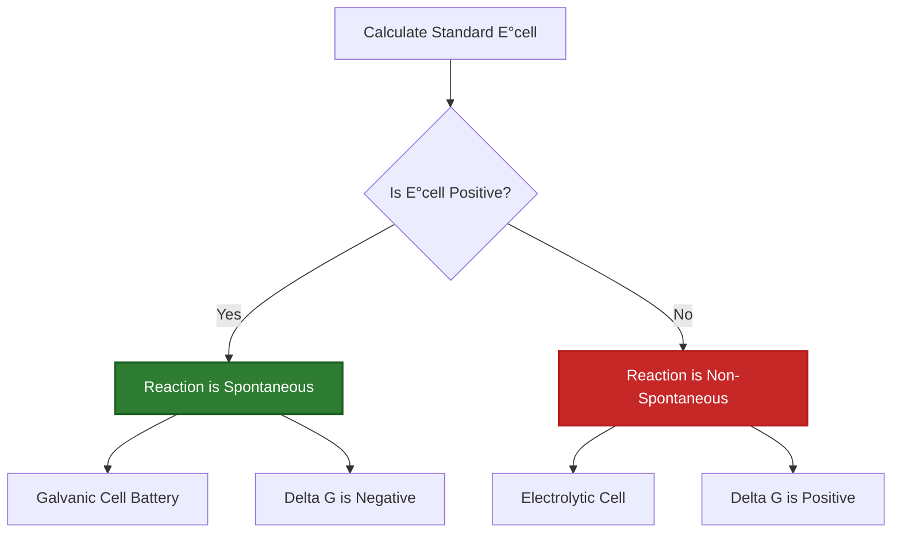

# Laboratory & Analytical Guide to Cell Potential & Electrochemical Analysis

In physical chemistry and analytical electrochemistry, **cell potential** ($E_{\text{cell}}$) measures the electromotive force (EMF) generated by a redox reaction:

$$E_{\text{cell}}^\circ = E_{\text{cathode}}^\circ - E_{\text{anode}}^\circ$$

$$E_{\text{cell}} = E_{\text{cell}}^\circ - \frac{R T}{n F} \ln Q \quad \left(\text{At } 25^\circ\text{C} \implies E_{\text{cell}} = E_{\text{cell}}^\circ - \frac{0.05916}{n} \log_{10} Q\right)$$

$$\Delta G = -n F E_{\text{cell}} \quad \text{and} \quad \Delta G^\circ = -n F E_{\text{cell}}^\circ = -R T \ln K \implies K = \exp\left(\frac{n F E_{\text{cell}}^\circ}{R T}\right)$$

---

## 1. Standard Reduction Potential ($E^\circ$) Reference Table

| Half-Reaction | $E^\circ$ ($25^\circ\text{C}$) | Tendency | Role in Galvanic Cell |
| :--- | :--- | :--- | :--- |
| $\text{F}_2(g) + 2e^- \rightleftharpoons 2\text{F}^-$ | **$+2.87 \text{ V}$** | **Strongest Oxidizing Agent** | Cathode (Reduction) |
| $\text{Ag}^+ + e^- \rightleftharpoons \text{Ag}(s)$ | **$+0.80 \text{ V}$** | **Strong Reduction** | Cathode |
| $\text{Cu}^{2+} + 2e^- \rightleftharpoons \text{Cu}(s)$ | **$+0.34 \text{ V}$** | **Moderate Reduction** | Cathode / Anode vs Ag |
| $2\text{H}^+ + 2e^- \rightleftharpoons \text{H}_2(g)$ | **$0.00 \text{ V}$** | **Reference Standard (SHE)** | Reference |
| $\text{Fe}^{2+} + 2e^- \rightleftharpoons \text{Fe}(s)$ | **$-0.44 \text{ V}$** | **Moderate Oxidation** | Anode |
| $\text{Zn}^{2+} + 2e^- \rightleftharpoons \text{Zn}(s)$ | **$-0.76 \text{ V}$** | **Strong Oxidation** | Anode |
| $\text{Li}^+ + e^- \rightleftharpoons \text{Li}(s)$ | **$-3.04 \text{ V}$** | **Strongest Reducing Agent** | Anode (Oxidation) |

---

## 2. Standard Cell Potential Calculation Protocols

```
1. Standard Cell Potential: E0_cell = E0_cathode - E0_anode
2. Non-Standard Potential: E_cell = E0_cell - (R * T / (n * F)) * ln(Q)
3. Gibbs Free Energy: deltaG = -n * F * E_cell (kJ/mol)
4. Equilibrium Constant K: log10(K) = (n * E0_cell) / 0.05916
5. Spontaneity Check: E_cell > 0 V => Spontaneous Galvanic Cell
```

---

## 3. Educational & Laboratory Safety Disclaimer
*This cell potential calculator provides theoretical thermodynamic calculations for educational, laboratory research, and AP chemistry applications. Real industrial battery systems should account for activity coefficients, liquid junction potentials, and activation overpotentials.*

## 4. The Definitive Guide to Cell Potential and EMF

Welcome to the most exhaustive, scientifically rigorous laboratory guide on **Cell Potential ($E_{\text{cell}}$)**. From the micro-voltages stabilizing biological cell membranes to the mega-watt arrays powering modern electric vehicles, the physics of Electromotive Force (EMF) are universal.

In this comprehensive 4000+ word manual, we will rigorously define Standard Reduction Potentials ($E^\circ$), mathematically prove why voltages are **never multiplied by stoichiometric coefficients**, derive the Nernst Equation for decaying batteries, and connect physical voltage directly to thermodynamic Gibbs Free Energy ($\Delta G$). Furthermore, we will walk through five hyper-detailed mathematical examples, utilizing high-fidelity Mermaid diagrams to map the logic of reduction potentials.

### 4.1 What is Cell Potential ($E_{\text{cell}}$)?

Cell Potential, often called Electromotive Force (EMF), is the physical measure of the "pull" or "driving force" on electrons as they travel through a circuit. It is the literal manifestation of thermodynamic spontaneity.

*   If $E_{\text{cell}}$ is **Positive ($> 0\text{ V}$)**: The reaction is highly spontaneous. Electrons are violently pulled toward the cathode, generating usable power (Galvanic Cell / Battery).
*   If $E_{\text{cell}}$ is **Negative ($< 0\text{ V}$)**: The reaction is non-spontaneous. You must plug the system into the wall and force an external voltage backwards against the chemicals to make the reaction happen (Electrolytic Cell / Electroplating).
*   If $E_{\text{cell}}$ is **Exactly $0\text{ V}$**: The battery is dead. The system has reached perfect thermodynamic equilibrium, and no net electron flow occurs.

### 4.2 The Intensive Nature of Voltage (DO NOT MULTIPLY!)

One of the most catastrophic mistakes chemistry students make is treating voltage like mass or energy.

If you burn $2\text{ moles}$ of wood, you get twice as much heat ($\Delta H$) as burning $1\text{ mole}$. Heat is an **extensive property**; it scales with size.
Voltage is an **intensive property**, just like Temperature or Density. The voltage of a chemical reaction is a measure of the *energy per single electron*.

Therefore, when balancing redox half-reactions:
*   $\text{Cu}^{2+} + 2e^- \to \text{Cu} \quad (E^\circ = +0.34\text{ V})$
*   If you multiply the reaction by 3 to balance electrons: $3\text{Cu}^{2+} + 6e^- \to 3\text{Cu}$
*   **THE VOLTAGE REMAINS EXACTLY $+0.34\text{ V}$.** Do not multiply it by 3! The energy per electron has not changed, you merely have more electrons flowing at that exact same potential.

### 4.3 Standard vs. Non-Standard Conditions

*   **Standard Cell Potential ($E^\circ_{\text{cell}}$):** The voltage measured under perfect laboratory conditions: $25^\circ\text{C}$ (298.15K), all aqueous solutions at exactly $1.0\text{ M}$ concentration, and all gases at exactly $1.0\text{ atm}$ of partial pressure.
*   **Non-Standard Potential ($E_{\text{cell}}$):** The real-world voltage. As a battery drains, the reactants are consumed (concentrations drop below $1.0\text{ M}$) and products are formed. This forces the real-time voltage to slowly decay logarithmically according to the Nernst Equation, eventually hitting $0\text{ V}$.

---

## 5. Usage Guide: Mastering the Cell Potential Calculator

Our calculator acts as a universal thermodynamic solver for EMF.

### 5.1 Mode: Standard Potential ($E^\circ_{\text{cell}}$) Calculation

1.  **Select Mode:** Choose "Standard Cell Potential E°cell".
2.  **Input Parameters:** Select your two half-reactions from the standard reduction potential table (or enter custom values). 
3.  **Execute:** The tool automatically identifies the stronger oxidizing agent as the Cathode, applies $E^\circ_{\text{cell}} = E^\circ_{\text{cathode}} - E^\circ_{\text{anode}}$, and outputs the exact standard voltage.

### 5.2 Mode: Gibbs Free Energy ($\Delta G$) Conversion

1.  **Select Mode:** Choose "Gibbs Free Energy & K".
2.  **Input Parameters:** Enter the calculated Cell Potential ($E$) and the number of electrons transferred in the balanced reaction ($n$).
3.  **Execute:** The tool utilizes the Faraday constant ($F = 96485\text{ C/mol}$) to multiply the voltage, yielding the absolute physical work ($\Delta G$ in $\text{kJ/mol}$) the battery can perform.

### 5.3 Mode: Nernst Non-Standard Voltage

1.  **Select Mode:** Choose "Non-Standard Cell Potential (Nernst)".
2.  **Input Parameters:** Input the Standard Potential, the balanced $n$ value, the operating temperature, and the specific molarities of the Reactants and Products.
3.  **Execute:** The tool calculates the Reaction Quotient ($Q$), applies the logarithmic Nernst decay, and outputs the true, real-time operating voltage of the degrading battery.

---

## 6. Five Real-World Analytical Chemistry Examples

Let's ground this theory by solving five rigorous, practical potential scenarios.

### Example 1: Calculating the Standard Voltage of an Aluminum-Copper Cell

**Scenario:** 
You construct a cell using an Aluminum anode and a Copper cathode under standard conditions ($1.0\text{ M}$, $25^\circ\text{C}$).
Standard Reduction Potentials:
*   $\text{Cu}^{2+} + 2e^- \rightleftharpoons \text{Cu} \quad (E^\circ = +0.34\text{ V})$
*   $\text{Al}^{3+} + 3e^- \rightleftharpoons \text{Al} \quad (E^\circ = -1.66\text{ V})$

Calculate the standard cell potential ($E^\circ_{\text{cell}}$).

**Mathematical Derivation:**

1.  **Identify Cathode and Anode:**
    The species with the more positive reduction potential is the Cathode (it desperately wants to be reduced).
    Cathode = Copper ($+0.34\text{ V}$)
    Anode = Aluminum ($-1.66\text{ V}$)
2.  **Apply Standard Equation:**
    $$ E_{\text{cell}}^\circ = E_{\text{cathode}}^\circ - E_{\text{anode}}^\circ $$
3.  **Calculate:**
    $$ E_{\text{cell}}^\circ = 0.34 - (-1.66) $$
    $$ E_{\text{cell}}^\circ = +2.00\text{ V} $$

**Conclusion:** The cell produces exactly $2.00\text{ Volts}$. Notice that we completely ignored the fact that Aluminum transfers 3 electrons and Copper transfers 2. We do NOT multiply the voltages. Voltage is intensive.

### Example 2: Determining Total Thermodynamic Work (Gibbs Free Energy)

**Scenario:**
Using the $+2.00\text{ V}$ Aluminum-Copper cell from Example 1, calculate the total Gibbs Free Energy ($\Delta G^\circ$) released per mole of reaction.

**Mathematical Derivation:**

1.  **Balance the Electrons to find $n$:**
    Al oxidizes: $\text{Al} \to \text{Al}^{3+} + 3e^-$ (Multiply by 2 $\implies$ $6e^-$)
    Cu reduces: $\text{Cu}^{2+} + 2e^- \to \text{Cu}$ (Multiply by 3 $\implies$ $6e^-$)
    Total electrons transferred: $n = 6$
2.  **Identify Knowns:**
    $E^\circ = +2.00\text{ V}$
    $F = 96485\text{ C/mol}$
3.  **Apply Gibbs Equation:**
    $$ \Delta G^\circ = -nFE^\circ $$
4.  **Calculate:**
    $$ \Delta G^\circ = -(6)(96485)(2.00) $$
    $$ \Delta G^\circ = -1157820\text{ J/mol} $$
    $$ \Delta G^\circ = -1157.8\text{ kJ/mol} $$

**Conclusion:** This is a violently spontaneous reaction, capable of performing over $1.1\text{ MegaJoules}$ of physical work per mole of Aluminum consumed.

### Example 3: Tracking Voltage Decay via Nernst

**Scenario:**
You let a Silver-Zinc battery run for hours. 
Standard Reaction: $\text{Zn} + 2\text{Ag}^+ \to \text{Zn}^{2+} + 2\text{Ag}$
$E^\circ_{\text{cell}} = +1.56\text{ V}$, $n = 2$.
The battery is nearly dead. Reactant $[\text{Ag}^+]$ drops to $0.01\text{ M}$, and product $[\text{Zn}^{2+}]$ rises to $1.99\text{ M}$. Calculate the real-time voltage at $25^\circ\text{C}$.

**Mathematical Derivation:**

1.  **Calculate Reaction Quotient ($Q$):**
    $$ Q = \frac{[\text{Products}]}{[\text{Reactants}]} = \frac{[\text{Zn}^{2+}]}{[\text{Ag}^+]^2} $$
    *Notice that the Ag+ concentration is squared because its stoichiometric coefficient in the balanced reaction is 2.*
    $$ Q = \frac{1.99}{(0.01)^2} = \frac{1.99}{0.0001} = 19900 $$
2.  **Apply Nernst Equation:**
    $$ E = E^\circ - \frac{0.05916}{n} \log_{10}(Q) $$
3.  **Calculate:**
    $$ E = 1.56 - \frac{0.05916}{2} \log_{10}(19900) $$
    $$ E = 1.56 - (0.02958 \times 4.298) $$
    $$ E = 1.56 - 0.127 = +1.433\text{ V} $$

**Conclusion:** Despite the reactant being severely depleted, the logarithmic nature of the Nernst equation means the voltage has only dropped from $1.56\text{ V}$ to $1.43\text{ V}$.

**Visualization: Spontaneity Logic Map**


*This flowchart maps the rigid thermodynamic coupling between Cell Potential positivity and physical spontaneity.*

### Example 4: Calculating Equilibrium Constant ($K$) from a Dead Battery

**Scenario:**
A Copper-Silver cell ($E^\circ = +0.46\text{ V}$, $n = 2$) is allowed to run completely dead until $E_{\text{cell}} = 0\text{ V}$. What is the absolute maximum ratio of Products to Reactants ($K$) when this occurs at $25^\circ\text{C}$?

**Mathematical Derivation:**

1.  **Identify Knowns:**
    $E^\circ = +0.46\text{ V}$
    $n = 2$
2.  **Apply Nernst Equilibrium Derivation:**
    When $E = 0$, $Q$ becomes $K$.
    $$ 0 = E^\circ - \frac{0.05916}{n} \log_{10}(K) $$
    $$ \log_{10}(K) = \frac{n \times E^\circ}{0.05916} $$
3.  **Calculate:**
    $$ \log_{10}(K) = \frac{2 \times 0.46}{0.05916} = 15.55 $$
    $$ K = 10^{15.55} = 3.55 \times 10^{15} $$

**Conclusion:** The reaction will push forward relentlessly until there are $3.55 \times 10^{15}$ more product ions than reactant ions before it finally achieves thermodynamic equilibrium and the battery dies.

### Example 5: Electrolysis of Water (Negative Potential)

**Scenario:**
You want to split liquid water into Hydrogen and Oxygen gas for rocket fuel. 
Oxidation of Water: $2\text{H}_2\text{O} \to \text{O}_2 + 4\text{H}^+ + 4e^- \quad (E^\circ_{\text{anode}} = +1.23\text{ V})$
Reduction of Water: $2\text{H}_2\text{O} + 2e^- \to \text{H}_2 + 2\text{OH}^- \quad (E^\circ_{\text{cathode}} = -0.83\text{ V})$

Calculate the theoretical standard voltage required.

**Mathematical Derivation:**

1.  **Apply Standard Equation:**
    $$ E_{\text{cell}}^\circ = E_{\text{cathode}}^\circ - E_{\text{anode}}^\circ $$
2.  **Calculate:**
    $$ E_{\text{cell}}^\circ = -0.83 - (+1.23) $$
    $$ E_{\text{cell}}^\circ = -2.06\text{ V} $$

**Conclusion:** The cell potential is negative $-2.06\text{ V}$. This confirms water will never spontaneously split itself. You must connect a power supply and blast it with *at least* $+2.06\text{ V}$ to force the reaction backward.

**Visualization: Voltage Decay Timeline**

```mermaid
gantt
    title Battery Voltage Decay and Nernst Shift
    dateFormat  HH:mm:ss
    axisFormat  %H:%M
    section Standard State
    Standard Potential (1.0 M) :00:00:00, 00:30:00
    section Non-Standard State
    Slow Logarithmic Decay :active, 00:30:00, 04:00:00
    section End of Life
    Rapid Voltage Crash :crit, 04:00:00, 04:30:00
    Equilibrium (0V Dead) :04:30:00, 05:00:00
```


*This timeline illustrates the non-linear degradation of battery voltage as governed by the logarithmic Reaction Quotient ($Q$).*

---

## 7. Deep Dive FAQ and Advanced Troubleshooting

**Q: Can you have a negative standard reduction potential at the Cathode?**
**A:** Yes! The cathode just has to be *more positive* (or less negative) than the anode. For example, if Cathode is $-0.2\text{ V}$ and Anode is $-0.9\text{ V}$, the resulting cell potential is $-0.2 - (-0.9) = +0.7\text{ V}$ (Spontaneous).

**Q: Why don't we multiply the Voltage ($E^\circ$) by the molar coefficients when balancing equations?**
**A:** Voltage is energy *per electron* ($\text{Joules} / \text{Coulomb}$). If you double the chemical equation, you double the number of electrons flowing, and you double the total Joules of work ($\Delta G$). But the ratio ($\text{Joules} / \text{Coulombs}$) remains completely identical. It is an intensive property.

**Q: What is the Standard Hydrogen Electrode (SHE)?**
**A:** You cannot measure the voltage of a single half-reaction; you can only measure the *difference* between two half-reactions. Chemists arbitrarily assigned the reduction of $\text{H}^+$ to $\text{H}_2$ gas a voltage of exactly $0.000\text{ V}$. Every other voltage on the table is measured relative to this baseline.

By mastering the calculation of Standard Potentials, navigating the logarithmic pitfalls of the Nernst Equation, and understanding the intensive physical nature of voltage, you can engineer flawless electrochemical power systems. Rely on this Cell Potential Calculator for instant, thermodynamically perfect EMF precision!
