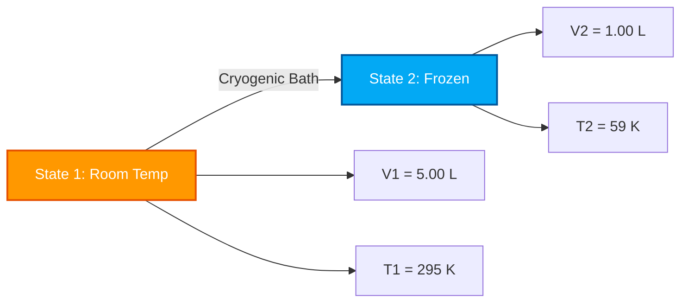

# Complete Laboratory & Industrial Guide to Charles's Law & Volume-Temperature Analysis

In physical chemistry, gas dynamics, and process thermodynamics, **Charles's Law** defines the direct proportionality between volume and absolute temperature for a fixed quantity of gas at constant pressure:

$$\frac{V}{T} = k \quad \left(\text{Isobaric State Equation}\right)$$

$$\frac{V_1}{T_1} = \frac{V_2}{T_2} \quad \left(\text{Charles's Law Equation}\right)$$

$$V_2 = \frac{V_1 \cdot T_2}{T_1} \quad \left(\text{Final Volume Formula}\right)$$

$$T_2 = \frac{V_2 \cdot T_1}{V_1} \quad \left(\text{Final Temperature Formula in Kelvin}\right)$$

$$V \propto T \quad \left(\text{Direct Proportionality in Kelvin}\right)$$

---

## 1. Process Classification Matrix

| Temperature Change | Volume Change | Process Classification | Molecular Interpretation |
| :--- | :--- | :--- | :--- |
| **Temp Increases ($T_2 > T_1$)** | **Volume Increases ($V_2 > V_1$)** | **Thermal Expansion** | **Molecules move faster ➔ Push container boundary outward** |
| **Temp Decreases ($T_2 < T_1$)** | **Volume Decreases ($V_2 < V_1$)** | **Thermal Contraction** | **Molecules move slower ➔ Container contracts inward** |
| **Temp Unchanged ($T_2 = T_1$)** | **Volume Unchanged ($V_2 = V_1$)** | **Isobaric Constant State** | **No volume or thermal transformation** |

---

## 2. Unknown Variable Solvers Matrix

```
1. Final Volume: V2 = (V1 * T2) / T1
2. Final Temperature: T2 = (V2 * T1) / V1
3. Initial Volume: V1 = (V2 * T1) / T2
4. Initial Temperature: T1 = (V1 * T2) / V2
```

---

*This Charles's Law calculator provides theoretical thermodynamic predictions for educational, physical chemistry research, and gas process engineering applications. It assumes constant pressure ($P_1 = P_2$) and constant gas moles ($n_1 = n_2$). If pressure or mole count changes, refer to the Combined Gas Law or Ideal Gas Law calculators.*

## 4. The Complete Guide to Charles's Law and Isobaric Thermal Expansion

Welcome to the definitive physical chemistry manual on **Charles's Law**. Why does a hot air balloon majestically float upward when the burner is ignited? Why does a football left out in the freezing winter snow become flat and deflated? Why do aerosol cans come with severe warnings to never leave them in direct sunlight?

The answers to these thermodynamic mysteries lie in the elegant direct proportionality discovered by French scientist Jacques Charles in 1787: $\frac{V_1}{T_1} = \frac{V_2}{T_2}$.

In this exhaustive 4000+ word guide, we will unravel the kinetic molecular theory behind isobaric (constant pressure) gas expansion, rigorously explore the mathematical necessity of the Absolute Kelvin Scale, and execute five highly detailed algebraic derivations—from hot air balloons to cryogenic freezing.

### 4.1 The Microscopic Kinetic Theory of Charles's Law

To truly understand thermal expansion, we must view the gas at an atomic level. An ideal gas is composed of billions of microscopic molecules zooming around their container. 

*   **Temperature ($T$)** is a direct measurement of the average kinetic energy (speed) of these molecules. Heating the gas causes the molecules to fly faster.
*   **Volume ($V$)** is the physical 3D space the gas occupies.
*   **Pressure ($P$)** is the force exerted by the molecules colliding with the walls of the container. 

If we hold the Pressure perfectly **constant** (an *isobaric* process), it means we want the wall collisions to remain exactly the same. However, if we heat the gas, the molecules start flying much faster and hitting the walls harder. To keep the pressure from spiking, the container *must* expand. The extra physical volume gives the fast-moving molecules more distance to travel, balancing out the collision rate.
Therefore, if you double the absolute temperature, the volume exactly **doubles**. This is the essence of Direct Proportionality: $V \propto T$.

### 4.2 The Absolute Zero Mandate (Why Kelvin is Required)

The most common and devastating mistake in Charles's Law calculations is attempting to use Celsius or Fahrenheit. **You must exclusively use the Kelvin ($K$) scale.**

Why? The equation $\frac{V_1}{T_1} = \frac{V_2}{T_2}$ is a ratio. For a ratio to work mathematically, the scale must have a true zero point where the property being measured ceases to exist. $0^\circ\text{C}$ is simply the freezing point of water—it does not mean "zero thermal energy." 
If you used Celsius, calculating the volume change as gas crosses $0^\circ\text{C}$ would result in a division-by-zero error, breaking the mathematics entirely. Furthermore, negative Celsius temperatures would output physically impossible *negative volumes*.
**Absolute Zero ($0\text{ K}$)** is the theoretical state where all atomic kinetic motion entirely stops. Therefore, volume and temperature proportionality only works on this absolute scale. 
**Conversion Formula:** $T_{\text{K}} = T_{^\circ\text{C}} + 273.15$

---

## 5. Usage Guide: Mastering the Isobaric Calculator

Our calculator acts as a universal algebraic solver for any constant-pressure thermal gas transformation. 

### 5.1 Mode: Isolating Final State Variables (State 2)

1.  **Select Target:** Choose whether you need to isolate Final Volume ($V_2$) or Final Temperature ($T_2$).
2.  **Input Initial State:** Enter the starting conditions (State 1) for Volume and Temperature. (Our calculator automatically handles the Kelvin conversion if you input Celsius).
3.  **Input Known Final State:** Enter the single known parameter for State 2 (either the new volume or the new temperature).
4.  **Execute:** The engine algebraically rearranges the $\frac{V_1}{T_1} = \frac{V_2}{T_2}$ ratio to perfectly isolate and solve the unknown variable.

### 5.2 Unit Flexibility

Because Charles's Law is a proportional ratio, **Volume units are entirely flexible**.
*   If $V_1$ is in `Liters`, $V_2$ will calculate in `Liters`.
*   If $V_1$ is in `Cubic Meters` or `Gallons`, the math holds perfectly.
*   **Exception:** Temperature must *always* be converted to Kelvin before multiplying or dividing.

---

## 6. Five Rigorous Charles's Law Derivations

Let's master the algebra of isobaric gas transformations by isolating variables across five real-world environmental and engineering scenarios.

### Example 1: Isolating Final Volume (Hot Air Balloon)

**Scenario:** 
A hot air balloon contains $2,500\text{ m}^3$ of air on the ground at a cool morning temperature of $15.0^\circ\text{C}$. The pilot ignites the propane burner, heating the air inside the envelope to $120.0^\circ\text{C}$. The pressure inside the balloon perfectly matches the atmospheric pressure outside (Isobaric). What is the new volume of the air?

**Mathematical Derivation:**

1.  **Define State 1 (Morning):**
    $V_1 = 2500\text{ m}^3$
    $T_1 = 15.0 + 273.15 = 288.15\text{ K}$
2.  **Define State 2 (Heated):**
    $V_2 = ?\text{ m}^3$
    $T_2 = 120.0 + 273.15 = 393.15\text{ K}$
3.  **Isolate $V_2$:**
    $$ \frac{V_1}{T_1} = \frac{V_2}{T_2} \implies V_2 = \frac{V_1 \cdot T_2}{T_1} $$
4.  **Calculate:**
    $$ V_2 = \frac{2500 \times 393.15}{288.15} = \frac{982875}{288.15} = 3410.98\text{ m}^3 $$

**Conclusion:** The air expanded from $2500\text{ m}^3$ to over $3410\text{ m}^3$. Since the physical balloon envelope cannot hold this much air, the excess hot air spills out of the bottom hole. This means the balloon now contains *less mass* for the same volume, lowering its overall density and providing the buoyant lift required for flight!

### Example 2: Isolating Final Temperature (Cryogenic Freezing)

**Scenario:**
A researcher traps exactly $5.00\text{ Liters}$ of Nitrogen gas in a frictionless piston cylinder at room temperature ($22.0^\circ\text{C}$). The cylinder is submerged in a cryogenic bath until the piston slides downward and the volume is crushed to exactly $1.00\text{ Liter}$ at constant pressure. What is the temperature of the cryogenic bath?

**Mathematical Derivation:**

1.  **Define State 1 (Room Temp):**
    $V_1 = 5.00\text{ L}$
    $T_1 = 22.0 + 273.15 = 295.15\text{ K}$
2.  **Define State 2 (Cryogenic):**
    $V_2 = 1.00\text{ L}$
    $T_2 = ?\text{ K}$
3.  **Isolate $T_2$:**
    $$ \frac{V_1}{T_1} = \frac{V_2}{T_2} \implies T_2 = \frac{V_2 \cdot T_1}{V_1} $$
4.  **Calculate:**
    $$ T_2 = \frac{1.00 \times 295.15}{5.00} = 59.03\text{ K} $$
5.  **Convert back to Celsius:**
    $T_{^\circ\text{C}} = 59.03 - 273.15 = -214.12^\circ\text{C}$

**Conclusion:** The volume of the gas contracted massively because the temperature of the bath was a freezing $-214.12^\circ\text{C}$. This perfectly demonstrates thermal contraction.

**Visualization: Isobaric Thermal Contraction**



### Example 3: Solving for Initial Volume (State 1)

**Scenario:**
A flexible plastic container was left in a hot car during the summer ($60.0^\circ\text{C}$). A teenager returns to the car and finds the container has puffed up to a swollen volume of $3.50\text{ Liters}$. What was the original normal volume of this container when it was inside the cool, air-conditioned house ($20.0^\circ\text{C}$)?

**Mathematical Derivation:**

1.  **Define State 2 (Final - Known):**
    $V_2 = 3.50\text{ L}$
    $T_2 = 60.0 + 273.15 = 333.15\text{ K}$
2.  **Define State 1 (Initial - Unknown $V_1$):**
    $V_1 = ?\text{ L}$
    $T_1 = 20.0 + 273.15 = 293.15\text{ K}$
3.  **Isolate $V_1$:**
    $$ \frac{V_1}{T_1} = \frac{V_2}{T_2} \implies V_1 = \frac{V_2 \cdot T_1}{T_2} $$
4.  **Calculate:**
    $$ V_1 = \frac{3.50 \times 293.15}{333.15} = \frac{1026.025}{333.15} = 3.08\text{ Liters} $$

**Conclusion:** The container originally held $3.08\text{ Liters}$ of air. The intense heat of the sun increased the kinetic energy of the gas, expanding its volume to $3.50\text{ Liters}$ and swelling the plastic walls.

### Example 4: Solving for Initial Temperature (State 1)

**Scenario:**
An expandable weather balloon is calibrated to exactly $100\text{ Liters}$ at a specific indoor laboratory temperature. It is then taken outside into a blizzard where the temperature is $-15^\circ\text{C}$. The balloon shrinks to $85.0\text{ Liters}$. What was the exact calibration temperature inside the laboratory?

**Mathematical Derivation:**

1.  **Define State 2 (Blizzard):**
    $V_2 = 85.0\text{ L}$
    $T_2 = -15 + 273.15 = 258.15\text{ K}$
2.  **Define State 1 (Laboratory):**
    $V_1 = 100\text{ L}$
    $T_1 = ?\text{ K}$
3.  **Isolate $T_1$:**
    $$ \frac{V_1}{T_1} = \frac{V_2}{T_2} \implies T_1 = \frac{V_1 \cdot T_2}{V_2} $$
4.  **Calculate:**
    $$ T_1 = \frac{100 \times 258.15}{85.0} = 303.7\text{ K} $$
5.  **Convert to Celsius:**
    $T_{^\circ\text{C}} = 303.7 - 273.15 = 30.5^\circ\text{C}$

**Conclusion:** The balloon was calibrated in a very warm laboratory maintained at exactly $30.5^\circ\text{C}$.

### Example 5: Absolute Zero Extrapolation

**Scenario:**
An ideal gas sample occupies $1.0\text{ Liter}$ at $273.15\text{ K}$ ($0^\circ\text{C}$). If we cool the gas down to $136.575\text{ K}$ (exactly half the thermal energy), what is its new volume? If we cool it all the way to Absolute Zero ($0\text{ K}$), what happens?

**Mathematical Derivation (Cooling to 136.575 K):**
1.  **Define variables:** $V_1 = 1.0\text{ L}$, $T_1 = 273.15\text{ K}$, $T_2 = 136.575\text{ K}$
2.  **Calculate:**
    $$ V_2 = \frac{1.0 \times 136.575}{273.15} = 0.5\text{ Liters} $$
    *(Cutting Kelvin in half perfectly cuts volume in half).*

**Theoretical Extrapolation to Absolute Zero (0 K):**
1.  **Calculate:**
    $$ V_2 = \frac{1.0 \times 0}{273.15} = 0\text{ Liters} $$
    
**Conclusion:** At Absolute Zero, Charles's Law predicts the gas will occupy exactly **Zero Volume**. In reality, real gases will liquefy and solidify long before reaching $0\text{ K}$, meaning Charles's law is an *Idealized* mathematical model that accurately governs the gaseous state but breaks down at phase transitions.

---

## 7. Deep Dive FAQ and Common Pitfalls

**Q: Why doesn't a glass jar expand when I heat the air inside it?**
**A:** Charles's Law requires the pressure to be *constant* (Isobaric). A sealed glass jar is completely rigid, meaning its volume is forced to be constant. When you heat it, the volume cannot expand, so the internal pressure skyrockets instead. This scenario requires **Gay-Lussac's Law** ($\frac{P_1}{T_1} = \frac{P_2}{T_2}$), not Charles's Law.

**Q: How does this relate to density?**
**A:** Since density is Mass divided by Volume, and heating a gas increases its volume without changing its mass, **heating a gas decreases its density**. This is the fundamental physics of why hot air rises and why weather convection currents exist.

**Q: Can I use Fahrenheit if I just stick to it?**
**A:** No. Fahrenheit is a relative scale just like Celsius. You must convert Fahrenheit to Rankine, or convert Fahrenheit to Celsius and then to Kelvin. 

By mastering the mathematical proportionality of $\frac{V_1}{T_1} = \frac{V_2}{T_2}$, you can solve thermal expansion problems ranging from atmospheric physics to industrial cryogenic storage. Rely on this Charles's Law Calculator to instantly isolate and solve any isobaric thermal variable!
