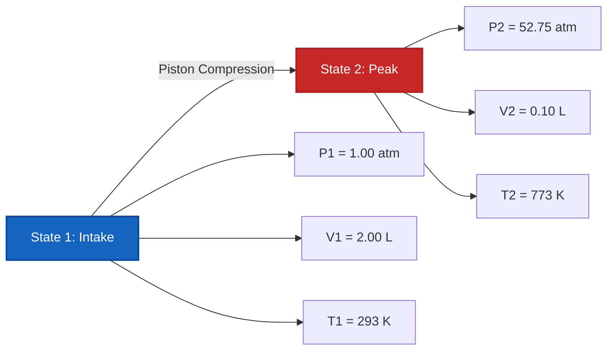

# Complete Laboratory & Industrial Guide to the Combined Gas Law & Two-State Analysis

In physical chemistry, gas dynamics, and chemical process engineering, the **Combined Gas Law** describes the interrelationship between pressure, volume, and absolute temperature across two equilibrium states of a fixed quantity of gas ($n_1 = n_2$):

$$\frac{P_1 \cdot V_1}{T_1} = \frac{P_2 \cdot V_2}{T_2} \quad \left(\text{Combined Gas Law Equation}\right)$$

$$P_2 = \frac{P_1 \cdot V_1 \cdot T_2}{T_1 \cdot V_2} \quad \left(\text{Final Pressure Formula}\right)$$

$$V_2 = \frac{P_1 \cdot V_1 \cdot T_2}{T_1 \cdot P_2} \quad \left(\text{Final Volume Formula}\right)$$

$$T_2 = \frac{P_2 \cdot V_2 \cdot T_1}{P_1 \cdot V_1} \quad \left(\text{Final Temperature Formula in Kelvin}\right)$$

$$\Delta P\% = \frac{P_2 - P_1}{P_1} \times 100\%, \quad \Delta V\% = \frac{V_2 - V_1}{V_1} \times 100\% \quad \left(\text{Percentage Changes}\right)$$

---

## 1. Reduction to Empirical Gas Laws

| Fixed Parameter | Mathematical Reduction | Gas Law Name | Process Classification |
| :--- | :--- | :--- | :--- |
| **Constant Temp ($T_1 = T_2$)** | **$P_1 \cdot V_1 = P_2 \cdot V_2$** | **Boyle's Law** | **Isothermal Process** |
| **Constant Pressure ($P_1 = P_2$)** | **$\frac{V_1}{T_1} = \frac{V_2}{T_2}$** | **Charles's Law** | **Isobaric Process** |
| **Constant Volume ($V_1 = V_2$)** | **$\frac{P_1}{T_1} = \frac{P_2}{T_2}$** | **Gay-Lussac's Law** | **Isochoric Process** |

---

## 2. Two-State Variable Solvers Matrix

```
1. Final Pressure: P2 = (P1 * V1 * T2) / (T1 * V2)
2. Final Volume: V2 = (P1 * V1 * T2) / (T1 * P2)
3. Final Temperature: T2 = (P2 * V2 * T1) / (P1 * V1)
4. Initial Pressure: P1 = (P2 * V2 * T1) / (T2 * V1)
5. Initial Volume: V1 = (P2 * V2 * T1) / (T2 * P1)
6. Initial Temperature: T1 = (P1 * V1 * T2) / (P2 * V2)
```

---

*This Combined Gas Law calculator provides theoretical thermodynamic predictions for educational, physical chemistry research, and gas process engineering applications. It assumes a fixed amount of gas ($n_1 = n_2$). For systems where gas molecules are added or removed, use the Ideal Gas Law Calculator ($P V = n R T$).*

## 4. The Complete Guide to the Combined Gas Law and Two-State Gas Transformations

Welcome to the definitive physical chemistry manual on the **Combined Gas Law**. How do scientists predict the exact volume of a weather balloon as it climbs through the freezing, low-pressure stratosphere? How do mechanical engineers calculate the intense heat generated inside a diesel engine cylinder during the compression stroke? 

The answers to these complex, multi-variable changes lie in the flawless ratio of the Combined Gas Law: $\frac{P_1 V_1}{T_1} = \frac{P_2 V_2}{T_2}$. 

In this exhaustive 4000+ word guide, we will unravel the thermodynamic symmetries of Boyle's, Charles's, and Gay-Lussac's laws, rigorously define the absolute necessity of the Kelvin temperature scale, and execute five robust, real-world algebraic derivations.

### 4.1 The Unification of the Empirical Gas Laws

Before the Ideal Gas Law ($PV=nRT$) was formalized, early experimental chemists discovered three separate proportionalities that governed gas behavior. The Combined Gas Law mathematically unifies all three:

1.  **Boyle's Law (Isothermal):** Discovered by Robert Boyle in 1662. If temperature is held perfectly constant ($T_1 = T_2$), pressure and volume are **inversely proportional** ($P_1 V_1 = P_2 V_2$). If you crush a gas into half its volume, the pressure doubles.
2.  **Charles's Law (Isobaric):** Discovered by Jacques Charles in 1787. If pressure is held constant ($P_1 = P_2$), volume and absolute temperature are **directly proportional** ($\frac{V_1}{T_1} = \frac{V_2}{T_2}$). If you heat a balloon, it expands.
3.  **Gay-Lussac's Law (Isochoric):** Discovered by Joseph Louis Gay-Lussac in 1808. If volume is held strictly constant ($V_1 = V_2$), pressure and absolute temperature are **directly proportional** ($\frac{P_1}{T_1} = \frac{P_2}{T_2}$). If you heat a rigid steel tank, the pressure spikes.

### 4.2 The Crucial Mandate of Absolute Kelvin ($K$)

The single most catastrophic failure in gas law calculations is using Celsius ($^\circ\text{C}$) or Fahrenheit ($^\circ\text{F}$). **You must strictly use Kelvin ($K$).**

Why? Because the Combined Gas Law relies on geometric ratios. If you attempt to use Celsius, crossing the $0^\circ\text{C}$ freezing point would result in a division by zero—mathematically breaking the equation. Worse, negative Celsius temperatures would calculate physically impossible *negative* volumes and pressures. 
The Kelvin scale fixes this by placing $0\text{ K}$ at **Absolute Zero**—the true theoretical state where all atomic kinetic motion ceases entirely.
**Conversion Formula:** $T_{\text{K}} = T_{^\circ\text{C}} + 273.15$

---

## 5. Usage Guide: Mastering the Two-State Calculator

Our calculator acts as a universal algebraic solver for any closed-system gas transformation. 

### 5.1 Mode: Isolating Final State Variables (State 2)

1.  **Select Target:** Choose whether you need to find Final Pressure ($P_2$), Final Volume ($V_2$), or Final Temperature ($T_2$).
2.  **Input Initial State:** Enter the starting conditions (State 1) for Pressure, Volume, and Temperature.
3.  **Input Known Final State:** Enter the two known parameters for State 2. 
4.  **Execute:** The engine algebraically rearranges the ratio to perfectly isolate and solve the unknown variable.

### 5.2 Unit Flexibility and Cancellation

Unlike the Ideal Gas Law which requires strict unit matching with the gas constant $R$, the Combined Gas Law is highly flexible. Because it is a ratio, **you do not need specific pressure or volume units** as long as you are consistent!
*   If $P_1$ is in `torr`, $P_2$ will output in `torr`.
*   If $V_1$ is in `gallons`, $V_2$ will output in `gallons`.
*   **Exception:** Temperature must *always* be in Kelvin.

---

## 6. Five Rigorous Combined Gas Law Derivations

Let's master the algebra of two-state gas transformations by isolating variables across five real-world engineering and environmental scenarios.

### Example 1: Isolating Final Volume for a Weather Balloon

**Scenario:** 
A high-altitude weather balloon is filled with $250.0\text{ Liters}$ of Helium at ground level where the pressure is $1.00\text{ atm}$ and the temperature is $25.0^\circ\text{C}$. The balloon is released and rises into the stratosphere, where the ambient pressure drops to $0.150\text{ atm}$ and the temperature plummets to $-50.0^\circ\text{C}$. What is the new volume of the balloon?

**Mathematical Derivation:**

1.  **Define State 1 (Ground Level):**
    $P_1 = 1.00\text{ atm}$
    $V_1 = 250.0\text{ L}$
    $T_1 = 25.0 + 273.15 = 298.15\text{ K}$
2.  **Define State 2 (Stratosphere):**
    $P_2 = 0.150\text{ atm}$
    $V_2 = ?\text{ L}$
    $T_2 = -50.0 + 273.15 = 223.15\text{ K}$
3.  **Isolate $V_2$:**
    $$ \frac{P_1 \cdot V_1}{T_1} = \frac{P_2 \cdot V_2}{T_2} \implies V_2 = \frac{P_1 \cdot V_1 \cdot T_2}{T_1 \cdot P_2} $$
4.  **Calculate:**
    $$ V_2 = \frac{1.00 \times 250.0 \times 223.15}{298.15 \times 0.150} $$
    $$ V_2 = \frac{55787.5}{44.7225} = 1247.4\text{ Liters} $$

**Conclusion:** Despite the massive drop in temperature (which would normally shrink the balloon), the extreme drop in pressure dominates the equation. The balloon expands to nearly $1250\text{ Liters}$.

### Example 2: Diesel Engine Compression (Isolating Final Pressure)

**Scenario:**
Inside a heavy-duty diesel engine, a cylinder intakes $2.00\text{ Liters}$ of air at $1.00\text{ atm}$ and $20.0^\circ\text{C}$. The piston violently compresses the air into a tiny clearance volume of $0.100\text{ Liters}$. The friction and rapid compression cause the temperature to spike to $500.0^\circ\text{C}$. What is the peak pressure right before fuel injection?

**Mathematical Derivation:**

1.  **Define State 1 (Intake):**
    $P_1 = 1.00\text{ atm}$
    $V_1 = 2.00\text{ L}$
    $T_1 = 20.0 + 273.15 = 293.15\text{ K}$
2.  **Define State 2 (Compression):**
    $P_2 = ?\text{ atm}$
    $V_2 = 0.100\text{ L}$
    $T_2 = 500.0 + 273.15 = 773.15\text{ K}$
3.  **Isolate $P_2$:**
    $$ P_2 = \frac{P_1 \cdot V_1 \cdot T_2}{T_1 \cdot V_2} $$
4.  **Calculate:**
    $$ P_2 = \frac{1.00 \times 2.00 \times 773.15}{293.15 \times 0.100} $$
    $$ P_2 = \frac{1546.3}{29.315} = 52.75\text{ atm} $$

**Conclusion:** The compression stroke multiplies the pressure to over $52\text{ atm}$. This extreme pressure and heat instantly auto-ignite the injected diesel fuel!

**Visualization: Two-State Cylinder Compression**



### Example 3: Deep Sea Diving Tank (Isolating Final Temperature)

**Scenario:**
A scuba tank contains exactly $15.0\text{ Liters}$ of compressed air at $200.0\text{ atm}$ in a dive shop at $30.0^\circ\text{C}$. The diver takes the tank deep underwater. The tank is completely rigid, meaning the volume cannot change ($V_1 = V_2$). The pressure gauge drops to $185.0\text{ atm}$ due to the freezing ocean temperatures. What is the temperature of the deep ocean?

**Mathematical Derivation:**

1.  **Define State 1 (Dive Shop):**
    $P_1 = 200.0\text{ atm}$
    $T_1 = 30.0 + 273.15 = 303.15\text{ K}$
2.  **Define State 2 (Deep Ocean):**
    $P_2 = 185.0\text{ atm}$
    $T_2 = ?\text{ K}$
3.  **Apply Gay-Lussac's Reduction:**
    Since volume is rigid, $V_1$ and $V_2$ cancel out.
    $$ \frac{P_1}{T_1} = \frac{P_2}{T_2} \implies T_2 = \frac{P_2 \cdot T_1}{P_1} $$
4.  **Calculate:**
    $$ T_2 = \frac{185.0 \times 303.15}{200.0} = 280.41\text{ K} $$
5.  **Convert back to Celsius:**
    $T_{^\circ\text{C}} = 280.41 - 273.15 = 7.26^\circ\text{C}$

**Conclusion:** The water temperature is a chilly $7.26^\circ\text{C}$. The pressure gauge dropped not because air was lost, but because the cold water slowed the kinetic energy of the gas molecules.

### Example 4: A Heated Aerosol Can (Explosion Risk)

**Scenario:**
An empty hairspray can has an internal pressure of $1.1\text{ atm}$ at $22^\circ\text{C}$. It is accidentally thrown into a campfire, where the temperature reaches $600^\circ\text{C}$. The can will rupture if the internal pressure exceeds $3.0\text{ atm}$. Will the can explode?

**Mathematical Derivation:**

1.  **Define State 1:**
    $P_1 = 1.1\text{ atm}$
    $T_1 = 22 + 273.15 = 295.15\text{ K}$
2.  **Define State 2:**
    $P_2 = ?\text{ atm}$
    $T_2 = 600 + 273.15 = 873.15\text{ K}$
3.  **Apply Isochoric Formula:**
    $$ P_2 = \frac{P_1 \cdot T_2}{T_1} $$
4.  **Calculate:**
    $$ P_2 = \frac{1.1 \times 873.15}{295.15} = 3.25\text{ atm} $$

**Conclusion:** Yes, the pressure reaches $3.25\text{ atm}$, exceeding the $3.0\text{ atm}$ limit. The can will catastrophically rupture. This perfectly demonstrates Gay-Lussac's Law and why aerosol cans carry severe heat warnings!

### Example 5: Solving for Initial Volume (State 1)

**Scenario:**
A scientist traps a sample of Neon gas. After cooling the gas to $-10.0^\circ\text{C}$ and expanding the container to exactly $5.00\text{ Liters}$, the final pressure reads $450\text{ mmHg}$. If the original laboratory conditions were $25.0^\circ\text{C}$ and $760\text{ mmHg}$, what was the original volume of the gas sample?

**Mathematical Derivation:**

1.  **Define State 2 (Final - Known):**
    $P_2 = 450\text{ mmHg}$
    $V_2 = 5.00\text{ L}$
    $T_2 = -10.0 + 273.15 = 263.15\text{ K}$
2.  **Define State 1 (Initial - Unknown $V_1$):**
    $P_1 = 760\text{ mmHg}$
    $V_1 = ?\text{ L}$
    $T_1 = 25.0 + 273.15 = 298.15\text{ K}$
3.  **Isolate $V_1$:**
    $$ \frac{P_1 \cdot V_1}{T_1} = \frac{P_2 \cdot V_2}{T_2} \implies V_1 = \frac{P_2 \cdot V_2 \cdot T_1}{T_2 \cdot P_1} $$
4.  **Calculate:**
    $$ V_1 = \frac{450 \times 5.00 \times 298.15}{263.15 \times 760} $$
    $$ V_1 = \frac{670837.5}{199994} = 3.35\text{ Liters} $$

**Conclusion:** The original trapped volume of Neon gas was $3.35\text{ Liters}$.

---

## 7. Deep Dive FAQ and Common Pitfalls

**Q: Can I use Celsius if both $T_1$ and $T_2$ are in Celsius?**
**A:** NO! Absolutely not. The ratio mathematically fails because the scale is not absolute. For example, if a gas goes from $10^\circ\text{C}$ to $20^\circ\text{C}$, the temperature did *not* double in absolute kinetic energy. It went from $283\text{ K}$ to $293\text{ K}$ (only a ~3.5% increase). Using Celsius ratios produces wildly incorrect answers.

**Q: When should I use the Combined Gas Law versus the Ideal Gas Law?**
**A:** Use the **Combined Gas Law** when a fixed, sealed amount of gas is undergoing a *change* from State 1 to State 2 (e.g., compressing, heating, expanding). Use the **Ideal Gas Law** ($PV=nRT$) when you only have a single static state and you need to solve for the exact number of moles or gas density.

**Q: Do I need to convert `torr` or `psi` to `atm`?**
**A:** No, as long as both $P_1$ and $P_2$ are in the exact same unit, the units mathematically cancel out. The same rule applies to Volume ($V_1$ and $V_2$).

Mastering the mathematical symmetries of the Combined Gas Law allows you to predict the outcome of any thermodynamic gas expansion or compression. Rely on this Two-State Gas Law Calculator to instantly isolate and solve any missing thermodynamic variable!
