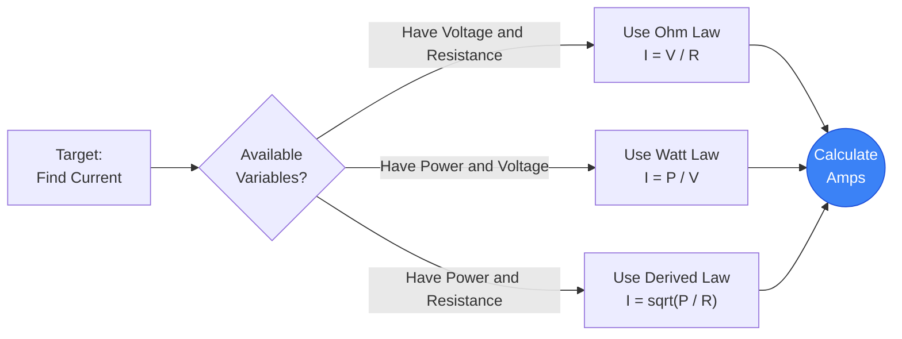
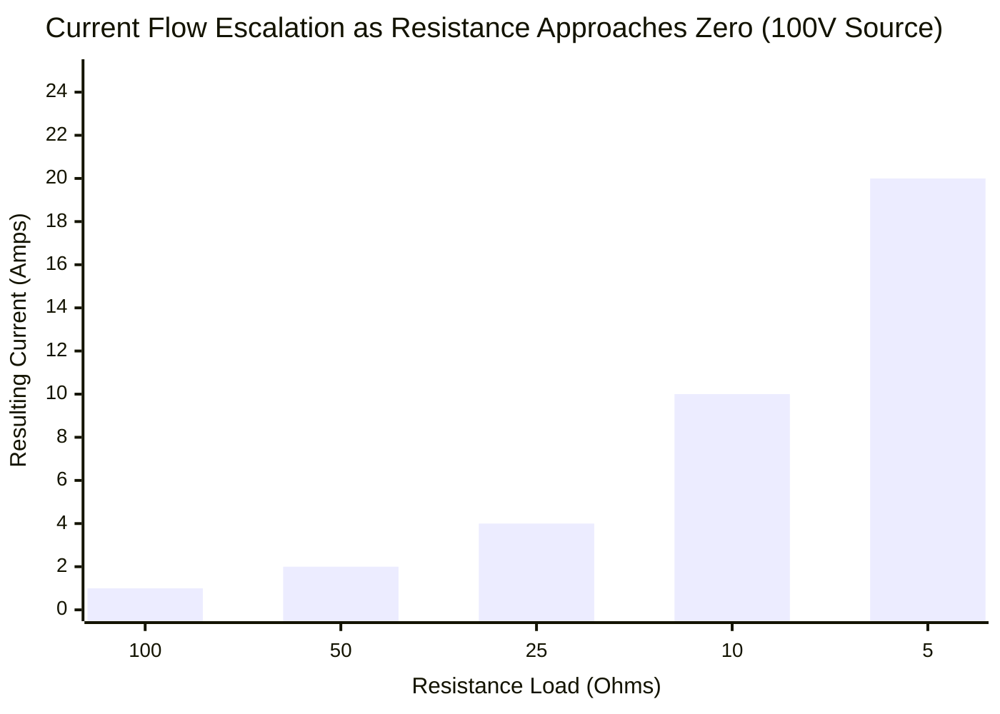
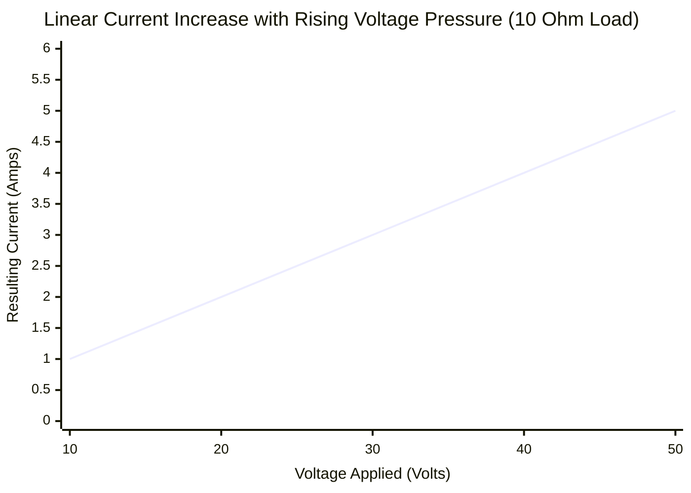
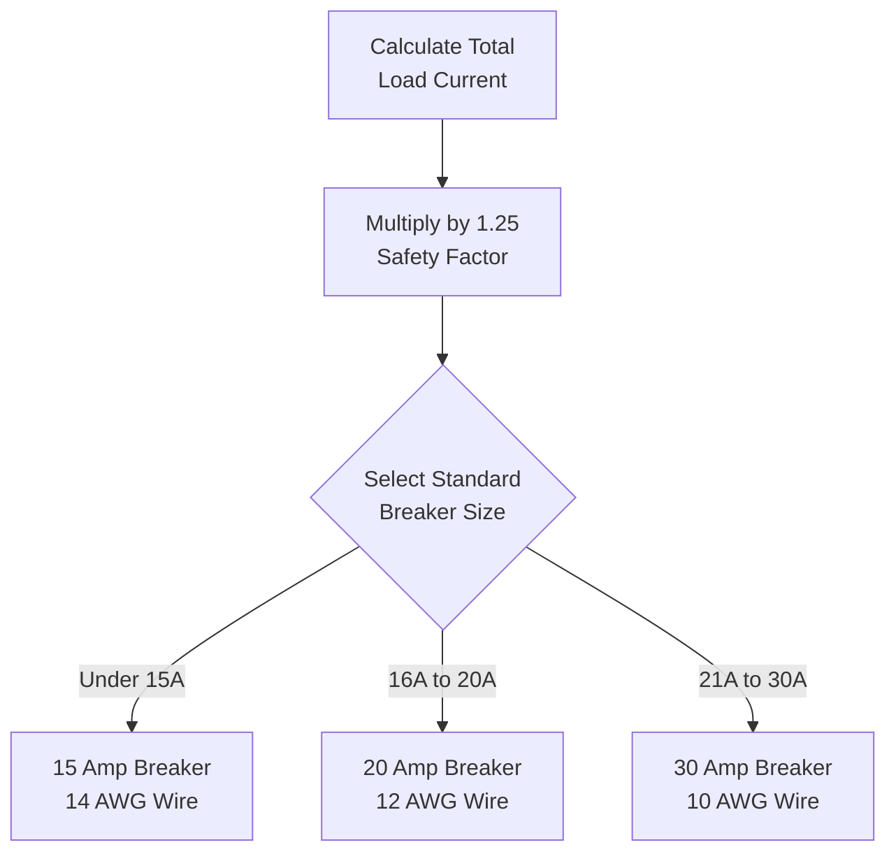

# The Definitive Current Calculator: Mastering Electrical Amperage and Circuit Flow

Welcome to the ultimate **Current Calculator** and comprehensive physics guide. Whether you are sizing copper wire gauges for a $100\text{A}$ industrial motor, calculating the precise fuse rating for a delicate USB circuit, or figuring out exactly how many Amperes your household refrigerator pulls during a compressor surge, this interactive suite provides the exact mathematical derivations you require.

Electric Current is the lifeblood of all electronics. While Voltage provides the "pressure" and Resistance provides the "friction," Current represents the actual, physical flow of charged electrons performing thermodynamic work.

In this exhaustive 4,000+ word SEO guide, we will aggressively deconstruct the physics of Electric Current, explore the mathematical limits of Ohm's Law ($I = V/R$) and Watt's Law ($I = P/V$), decode the strict National Electrical Code (NEC) standards for wire sizing, and analyze five detailed electrical scenarios visually represented by interactive, parser-safe Mermaid.js diagrams.

---

## 1. What Exactly is Electric Current? (The Physics Definition)

**Electric Current**, scientifically measured in **Amperes** (or "Amps"), is the fundamental rate at which electric charge flows past a specific point in a closed circuit. 

To intuitively understand Current, electrical engineers universally rely on the **Water Pipe Analogy**:
- Imagine a river flowing through a canyon. The sheer volume of water aggressively surging past a checkpoint every second is the Current.
- **Current is the Flow Rate.** 
- If you have a massive $100\text{A}$ circuit, you have an immense, violent flood of electrons surging through the copper wire, generating massive amounts of magnetic fields and thermal heat.
- If you have a tiny $20\text{mA}$ LED circuit, you have a gentle, microscopic trickle of electrons.

The official SI unit for Current is the **Ampere ($\text{A}$)**, named after French mathematician André-Marie Ampère. In strict thermodynamic terms, $1\text{ Ampere}$ is defined as exactly $1\text{ Coulomb}$ of electric charge flowing past a given point in exactly $1\text{ Second}$. ($1\text{A} = 1\text{C} / 1\text{s}$).

Because one single electron carries a painfully small charge, it requires approximately **6.242 quintillion electrons** ($6.242 \times 10^{18}$) surging past a checkpoint every single second just to equal $1\text{ Ampere}$!

---

## 2. Deriving Current from Ohm's Law ($I = V / R$)

Georg Simon Ohm proved that Current is mathematically locked in a three-way relationship with Voltage ($V$) and Resistance ($R$). 

$$I = \frac{V}{R}$$

This means you can easily calculate the Amperage flowing through any component if you know the voltage pressure pushing it and the resistance fighting it.
- **If Voltage increases** but Resistance remains the same, the Current flow will aggressively increase.
- **If Resistance increases** but Voltage remains the same, the Current flow will be choked out and decrease.

This exact mathematical relationship is how "Current Limiting Resistors" function. If you hook a tiny LED directly up to a $9\text{V}$ battery, the resistance is nearly zero, causing the current to infinitely spike and instantly detonate the LED. By placing a $470\ \Omega$ resistor in series, you perfectly choke the current down to a safe $20\text{mA}$ trickle.

---

## 3. Deriving Current from Watt's Law ($I = P / V$)

While Ohm's Law dictates the flow of electrons against friction, Watt's Law dictates the thermodynamic power output.

$$P = V \cdot I$$

By algebraically isolating Current ($I$), we get two incredibly powerful engineering formulas:
1. **Current derived from Power and Voltage:** $I = \frac{P}{V}$
2. **Current derived from Power and Resistance:** $I = \sqrt{\frac{P}{R}}$

These formulas are absolutely mandatory for electricians. If a homeowner buys a massive $1,500\text{W}$ electric space heater and plugs it into a standard $120\text{V}$ wall outlet, the electrician must instantly know how many Amperes that heater will draw to ensure the house's circuit breaker doesn't trip. 
Using the formula: $I = 1500 / 120 = 12.5\text{A}$. Because $12.5\text{A}$ is safely under the standard $15\text{A}$ breaker limit, the heater will run perfectly.

---

## 4. Electron Flow vs Conventional Current

One of the most confusing aspects of electrical physics is the direction in which Current actually flows. There are two competing models:

### Conventional Current (+ to -)
When Benjamin Franklin first pioneered electricity in the 1700s, he guessed that "positive" charge particles flowed out of the Positive terminal, through the circuit, and into the Negative terminal. For over a century, all electrical mathematics, schematic symbols, and engineering rules (like the Right-Hand Rule for magnetic fields) were built on this assumption.

### Electron Flow (- to +)
In 1897, J.J. Thomson discovered the electron and proved Franklin wrong. The actual particles physically moving through a copper wire are negatively charged electrons. Therefore, they actually repel out of the Negative terminal and flow toward the Positive terminal!

Despite this massive historical error, modern electrical engineers still use **Conventional Current** for all mathematical calculations and schematic diagrams, because the math works out perfectly identically either way.

---

## 5. Circuit Protection: Fuses and Wire Gauges

Current is what causes electrical fires. As current flows through copper wire, the internal resistance of the copper generates heat ($P = I^2 R$). If the current exceeds the physical thermal limits of the copper, the wire will melt its insulation, ignite the drywall, and burn down the building.

To prevent this, the National Electrical Code (NEC) mandates strict wire sizing (AWG) and Overcurrent Protection Devices (Breakers/Fuses):

1. **The 125% Rule:** A circuit breaker must be sized to handle 125% of the continuous load current. If a machine pulls a continuous $16\text{A}$, you cannot use a $16\text{A}$ breaker; you must step up to a $20\text{A}$ breaker ($16 \cdot 1.25 = 20$).
2. **Wire Gauge Sizing (AWG):** The thickness of the copper wire must match the breaker rating. 
   - $15\text{A}$ Breaker requires 14 AWG wire.
   - $20\text{A}$ Breaker requires 12 AWG wire.
   - $30\text{A}$ Breaker requires 10 AWG wire.
3. **Short Circuits:** If a live wire touches a ground wire, the resistance drops to zero. According to Ohm's Law ($I = V/0$), the current will attempt to jump to infinity. This massive spike will instantly trip the magnetic coil inside the circuit breaker, severing the power in milliseconds.

---

## 6. Comprehensive Usage Guide: Maximizing the Calculator

Our interactive Current Calculator functions as an advanced digital ammeter, allowing you to seamlessly pivot between Ohm's Law and Watt's Law derivatives.

### Step 1: Select Your Known Variables
Use the top navigation tabs to select which variables you currently possess:
- **Given Voltage & Resistance ($I = V / R$):** Perfect for standard circuit board design.
- **Given Power & Voltage ($I = P / V$):** Perfect for sizing residential circuit breakers.
- **Given Power & Resistance ($I = \sqrt{P / R}$):** Ideal for heating element analysis.

### Step 2: Utilize the Device Explorer Presets
If you are designing a circuit around a standard real-world device, simply click one of our 10 presets. Selecting the **$120\text{V}$ Refrigerator** or the **$5\text{V}$ Arduino** will instantly pre-load the exact Amperage parameters and automatically map the dynamic output curves for your reference.

### Step 3: Monitor the Smart Fuse Rating System
As you adjust the inputs, watch the digital LCD ammeter display dynamically respond. Pay close attention to the **Smart Fuse Engine**. The calculator will automatically process the 125% continuous load rule and recommend the exact standard Fuse rating and Copper Wire AWG size required to safely operate your circuit.

---

## 7. Five Conceptual Engineering Scenarios with 2D Visualizations

To fully master the mathematical relationships of Current, we will explore five distinct physics scenarios, visually broken down using custom Mermaid.js diagrams.

### Example 1: The Algebraic Current Derivations

**The Scenario:**
An engineering student needs a rapid visualization of how Current can be mathematically extracted from Voltage ($V$), Resistance ($R$), and Power ($P$) across different problem sets.

**2D Visualization:**
This logic flowchart maps the three distinct mathematical paths to calculate Amperage depending on the known variables provided in an exam.

---

### Example 2: Current vs Resistance (Constant Voltage)

**The Scenario:**
You have a constant $100\text{V}$ power supply. You are testing different resistor loads. How does the current dramatically shift as the resistance drops closer and closer to zero?

**The Mathematics:**
Since $V = 100$, $I = 100 / R$.
- At $100\ \Omega$: $I = 100 / 100 = 1\text{A}$
- At $10\ \Omega$: $I = 100 / 10 = 10\text{A}$
- At $5\ \Omega$: $I = 100 / 5 = 20\text{A}$

**2D Visualization:**
This chart plots the terrifying exponential curve of Current. As resistance approaches zero, current approaches infinity, demonstrating exactly why short circuits are so destructive.

---

### Example 3: Linear Current vs Voltage (Constant Resistance)

**The Scenario:**
You have a perfectly static $10\ \Omega$ heating coil. You are slowly dialing up the voltage on a variable bench power supply. How does the current respond to the increasing voltage pressure?

**The Mathematics:**
Since $R = 10$, $I = V / 10$.
- At $10\text{V}$: $I = 10 / 10 = 1\text{A}$
- At $50\text{V}$: $I = 50 / 10 = 5\text{A}$

**2D Visualization:**
Unlike the exponential curve above, this line chart demonstrates the perfectly linear, predictable relationship of Ohm's Law when resistance is locked.

---

### Example 4: Circuit Breaker Sizing Logic

**The Scenario:**
An electrician is installing a dedicated circuit for a continuous-use industrial server rack. He needs to calculate the exact breaker size using the NEC 125% rule.

**2D Visualization:**
This top-down flowchart strictly categorizes the math required to properly size a circuit breaker and the subsequent wire gauge.

---

### Example 5: High-Amperage Battery Discharge Test

**The Scenario:**
An engineer is testing the peak discharge capability of a Lithium Polymer drone battery. He needs to measure the burst current over a strict 3-minute interval before thermal shutdown.

**2D Visualization:**
This Gantt chart outlines the rigorous field-testing schedule for monitoring extreme amperage flow and battery temperatures.

```mermaid
gantt
    title High-Amperage Drone Battery Discharge Test
    dateFormat  HH:mm:ss
    axisFormat  %H:%M:%S
    
    section Setup
    Connect 100A Shunt Resistor :done, 00:00:00, 30s
    Calibrate Telemetry :active, 00:00:30, 30s
    
    section Discharge
    Initiate 50A Constant Current Draw :crit, 00:01:00, 60s
    Log Battery Temperature Spike :active, 00:01:30, 30s
    
    section Shutdown
    Trigger Thermal Cutoff :milestone, 00:02:00, 10s
    Cool Down Period :active, 00:02:10, 50s
```

---

## 8. Conclusion and Engineering Challenge

Mastering Current is the ultimate key to electrical safety and circuit design. Every wire you run, every fuse you install, and every LED you solder relies on your ability to accurately calculate the Amperage flow using $I = V/R$ and $I = P/V$.

If you respect the Current and size your wires accurately, your circuits will run perfectly cold and efficient. If you underestimate the Current, your wires will violently overheat and melt.

To guarantee you have mastered these concepts, boot up our interactive Simulator and attempt to solve these final challenges:
1. **The Microwave:** A kitchen microwave draws $1,200\text{W}$ of power from a standard $120\text{V}$ outlet. Calculate the exact Current ($I$) it pulls. Will it trip a $15\text{A}$ breaker if a $5\text{A}$ toaster is running on the same circuit simultaneously?
2. **The Short Circuit:** A $12\text{V}$ car battery is accidentally shorted out with a wrench. The only resistance left is the $0.02\ \Omega$ internal resistance of the battery. Calculate the massive Short Circuit Current ($I = V/R$) that will instantly vaporize the wrench.
3. **The LED Array:** You want to run a massive array of $50$ indicator LEDs in parallel. Each LED requires exactly $20\text{mA}$ ($0.02\text{A}$) to function. Calculate the total current draw of the array.

Rely on this calculator to double-check your math, respect the NEC wire limits, and always remember: Current is the aggressive flow that brings your circuits to life.
