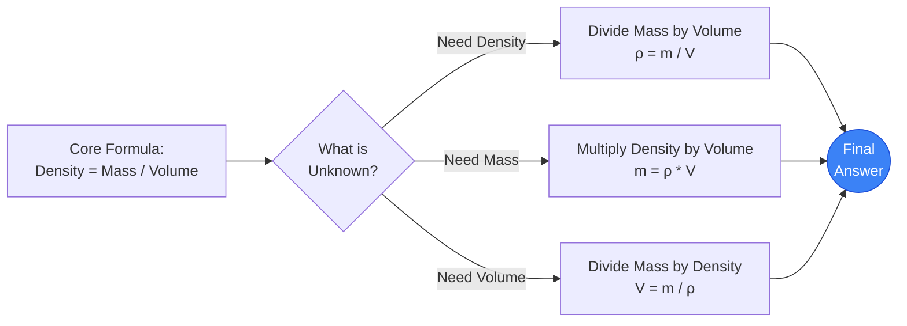
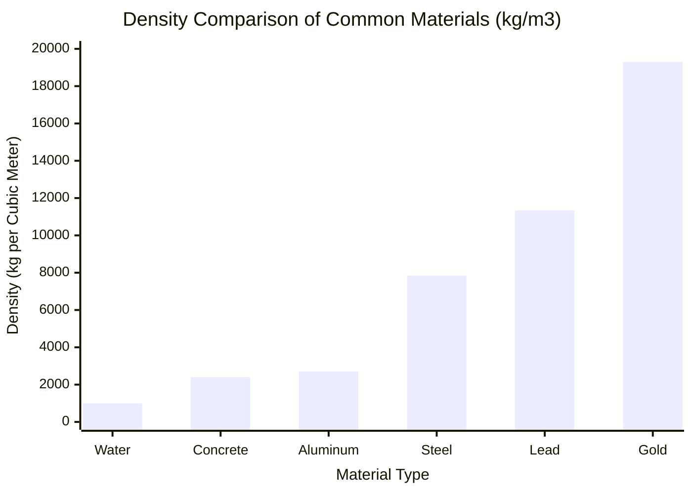
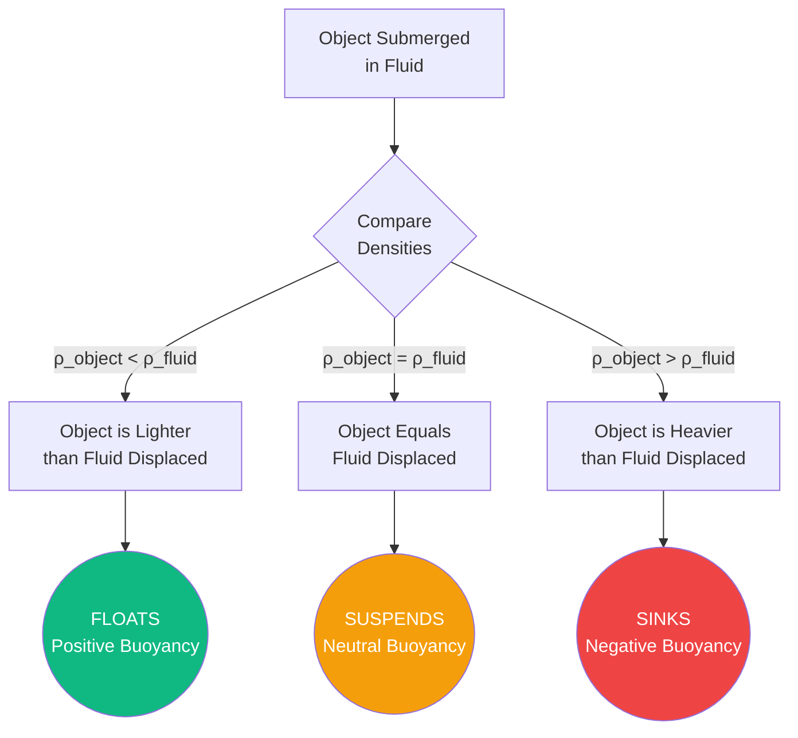
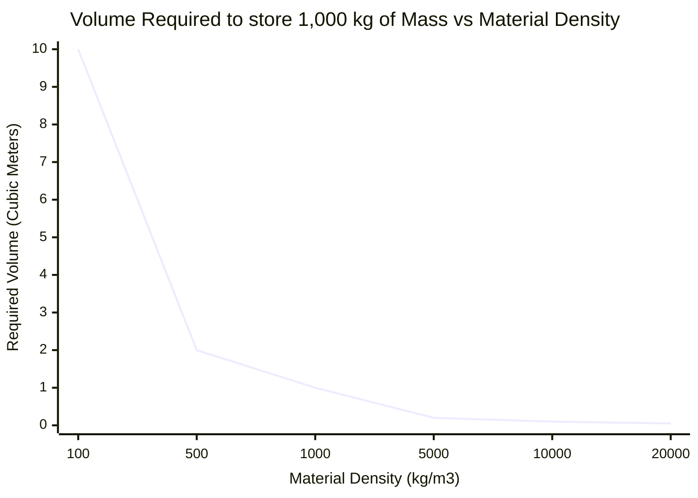

# The Definitive Density Calculator: Mastering Mass, Volume, and Archimedes' Principle

Welcome to the ultimate **Density Calculator** and comprehensive engineering physics guide. Whether you are a materials science student attempting to verify the purity of a gold ring, a structural engineer computing the dead load of a reinforced concrete pillar, or a naval architect designing the hull displacement of a $100,000\text{-ton}$ cruise ship, this tool provides the absolute exact physics conversions and conceptual frameworks you require.

Density ($\rho$) is one of the most fundamental intensive properties in the universe. It describes the precise relationship between how much matter (Mass) is packed into a specific amount of 3D space (Volume). By mastering density, you unlock the keys to understanding buoyancy, aerodynamics, hydrostatic pressure, and the core structural integrity of the physical world.

In this exhaustive 4,000+ word SEO guide, we will violently deconstruct the density formula ($\rho = m/V$). We will explore the nuances of Specific Gravity (SG), unravel the 2,000-year-old mystery of Archimedes' Principle, and analyze five detailed conceptual engineering scenarios visually represented by interactive Mermaid.js diagrams.

---

## 1. Defining Density: The Anatomy of Matter

In classical physics, **Density** (represented by the Greek letter $\rho$, *rho*) is defined as a substance's mass per unit volume. It is an *intensive* property, meaning it does not change regardless of how much of the substance you have. A single drop of pure water has the exact same density as an entire Olympic swimming pool of pure water.

$$ \rho = \frac{m}{V} $$

### The Pillow vs. The Lead Brick Analogy
To intuitively grasp density, imagine holding a standard bed pillow in your left hand, and a solid block of lead of the exact same physical dimensions (Volume) in your right hand. 
- The pillow is mostly filled with empty space and trapped air. It possesses very little mass within that volume. It has extremely **low density**.
- The solid lead block has its heavy atomic nuclei densely packed together in a tight crystalline lattice. It contains an immense amount of mass within the same exact volume. It has incredibly **high density** (and will likely break your wrist).

### Standard SI Units of Density
Because Mass is measured in Kilograms ($\text{kg}$) and Volume is measured in Cubic Meters ($\text{m}^3$), the standard SI unit for density is **Kilograms per cubic meter** ($\text{kg/m}^3$).
However, in laboratory chemistry, smaller units are frequently used:
- **Grams per cubic centimeter** ($\text{g/cm}^3$)
- **Grams per milliliter** ($\text{g/mL}$)

*Crucial Note: $1\text{ cm}^3$ is physically identical to $1\text{ mL}$. Therefore, $1\text{ g/cm}^3 = 1\text{ g/mL}$.*

To convert between laboratory units and engineering SI units, you simply multiply by $1,000$:
$$ 1\text{ g/cm}^3 = 1,000\text{ kg/m}^3 $$

---

## 2. Specific Gravity: The Universal Ratio

**Specific Gravity (SG)** (also known as *Relative Density*) is a brilliant mathematical shortcut used by engineers to avoid dealing with messy units. It is simply a dimensionless ratio comparing the density of your chosen material against the baseline density of pure liquid water at $4^\circ\text{C}$ ($1,000\text{ kg/m}^3$).

$$ \text{SG} = \frac{\rho_{\text{substance}}}{\rho_{\text{water}}} $$

Because it is a ratio of densities, the units cancel out, leaving a pure number.
- If a block of solid Aluminum has a density of $2,700\text{ kg/m}^3$, its Specific Gravity is precisely **$2.70$**.
- If a block of seasoned Oak wood has a density of $700\text{ kg/m}^3$, its Specific Gravity is precisely **$0.70$**.

This immediately tells us how a material will behave in water without doing any advanced calculus. If the $\text{SG} < 1$, it floats. If the $\text{SG} > 1$, it sinks.

---

## 3. Archimedes' Principle: The Physics of Buoyancy

Legend has it that in 250 BC, the Greek mathematician Archimedes was tasked by King Hiero II of Syracuse to determine if a goldsmith had stolen pure gold and replaced it with cheaper silver when forging a royal crown. Archimedes could not melt the crown down. While stepping into a bathtub, he noticed the water level rise in exact proportion to his submerged body volume. He realized he could measure the crown's volume by submerging it in water, divide its mass by that volume, and find its density to prove its purity. He allegedly ran naked through the streets shouting "Eureka!" (I have found it!).

This led to the formulation of **Archimedes' Principle**:
*"Any object, totally or partially immersed in a fluid, is buoyed up by a force equal to the weight of the fluid displaced by the object."*

$$ F_{\text{Buoyancy}} = \rho_{\text{fluid}} \cdot V_{\text{submerged}} \cdot g $$

### How Ships Float
A solid block of steel ($\text{SG} = 7.85$) will violently sink to the bottom of the ocean. How, then, does a massive steel aircraft carrier float?
By hammering the steel into a wide, hollow bowl shape (a hull), the ship encloses a massive volume of air ($\text{SG} = 0.001$). The *average* density of the entire ship structure (heavy steel + massive volume of light air) drops significantly below the density of seawater ($1,025\text{ kg/m}^3$). 
The ship displaces an amount of seawater equal to its own immense weight long before the water breaches the upper deck, allowing it to achieve buoyant equilibrium.

---

## 4. Comprehensive Usage Guide: Maximizing the Calculator

Our interactive Density Calculator operates as a robust thermodynamics and materials science workbench.

### Step 1: Select Your Calculation Target
Use the top navigation to select your unknown variable:
- **Density ($\rho$):** You know Mass and Volume. (Ideal for identifying unknown materials).
- **Mass ($m$):** You know Density and Volume. (Ideal for calculating structural weight loads).
- **Volume ($V$):** You know Density and Mass. (Ideal for sizing storage tanks).

### Step 2: Utilize the Material Database
Skip manual data entry by selecting from our 17+ embedded material presets. Need to know the exact mass of $5\text{ m}^3$ of liquid mercury? Select 'Mercury' from the dropdown, and the calculator instantly populates $\rho = 13,540\text{ kg/m}^3$.

### Step 3: Explore the Floating vs. Sinking Buoyancy Simulator
Once your density is calculated, check the Buoyancy Simulator panel. It cross-references your calculated density against five common fluids (Fresh Water, Saltwater, Cooking Oil, Ethanol, and Mercury) to instantly tell you if your object will float on the surface, achieve neutral suspension, or sink to the bottom.

---

## 5. Five Conceptual Engineering Scenarios with 2D Visualizations

To fully master the relationships between Mass, Volume, Density, and Buoyancy, we will explore five distinct physics scenarios, visually broken down using custom Mermaid.js diagrams.

### Example 1: The Density Formula Logic (Solving for Variables)

**The Scenario:**
A high school chemistry student needs to quickly visualize the algebraic permutations of the density formula ($\rho = m/V$) to solve three different test questions.

**2D Visualization:**
This logic flowchart illustrates the classic "Density Triangle" used to isolate variables. 

---

### Example 2: The Element Density Spectrum

**The Scenario:**
An engineer is designing a small counterweight for an aerospace drone. They have exactly $1,000\text{ cm}^3$ ($1\text{ Liter}$) of space available. They need to visualize how different materials will radically alter the mass of the counterweight.

**2D Visualization:**
This bar chart plots the staggering differences in density across common materials. Note how Gold is nearly 20 times denser than water, and over 7 times denser than Aluminum!

---

### Example 3: The Archimedes Buoyancy Decision Tree

**The Scenario:**
A marine biologist is designing a deep-sea submersible. They need to calculate exactly how the submersible will behave when placed in seawater ($1,025\text{ kg/m}^3$) based on its average structural density.

**2D Visualization:**
This flowchart visualizes the strict logical outcomes of Archimedes' Principle based on Specific Gravity (relative density).

---

### Example 4: The Inverse Volume Curve for Fixed Mass

**The Scenario:**
You have exactly $1,000\text{ kg}$ ($1\text{ Metric Ton}$) of material. How much physical space (Volume) will it take up? Because Volume = Mass / Density, as the density of the material increases, the required volume exponentially collapses toward zero.

**The Mathematics:**
- $1,000\text{ kg}$ of Air ($\rho = 1.225$) requires $816\text{ m}^3$ of space.
- $1,000\text{ kg}$ of Water ($\rho = 1,000$) requires $1.0\text{ m}^3$ of space.
- $1,000\text{ kg}$ of Gold ($\rho = 19,300$) requires just $0.051\text{ m}^3$ of space!

**2D Visualization:**
This chart plots the hyperbolic decay of required volume as material density increases for a fixed mass of $1,000\text{ kg}$.

---

### Example 5: The Metallurgical Gold Testing Process (Gantt)

**The Scenario:**
A jeweler receives a supposed "pure 24K gold" brick. They must use the Archimedes water displacement method to calculate its precise density and verify its purity without cutting into it.

**2D Visualization:**
This Gantt chart outlines the chronological laboratory process for calculating the density of an irregular solid.

```mermaid
gantt
    title Laboratory Density Testing Protocol (Water Displacement)
    dateFormat  HH:mm:ss
    axisFormat  %M:%S
    section Dry Measurements
    Calibrate Scale to Zero :crit, active, 00:00:00, 00:02:00
    Weigh Object in Air (Record Mass) :active, 00:02:00, 00:05:00
    section Wet Measurements
    Fill Graduated Cylinder with Water :00:05:00, 00:08:00
    Record Initial Water Volume (V1) :00:08:00, 00:10:00
    Submerge Object & Record Final Volume (V2) :crit, 00:10:00, 00:13:00
    section Calculations
    Calculate Displaced Volume (V2 - V1) :00:13:00, 00:15:00
    Calculate Density (Mass / Volume) :milestone, 00:15:00, 00:16:00
```

---

## 6. Frequently Asked Questions (FAQ) Deep Dive

**Q: Why does ice float on water if they are both just H₂O?**
**A:** This is a rare and beautiful anomaly of physics. When water freezes into ice, the hydrogen bonds force the molecules into a rigid, open hexagonal crystalline lattice. This lattice takes up roughly $9\%$ more physical space (Volume) than the chaotic tumbling of liquid water molecules. Because mass remains the same but volume increases, density drops. Ice ($\rho = 917\text{ kg/m}^3$) is less dense than liquid water ($\rho = 1,000\text{ kg/m}^3$), so it floats! If this didn't happen, oceans would freeze from the bottom up, killing all marine life.

**Q: What is the difference between Mass and Weight?**
**A:** Mass is the absolute amount of matter in an object (measured in $\text{kg}$), and it never changes unless you physically cut the object in half. Weight is the local force of gravity pulling on that mass (measured in Newtons, $W = m \cdot g$). An astronaut has the exact same mass and density on Earth as they do on the Moon, but their *weight* is six times lower on the Moon.

**Q: How does temperature affect density?**
**A:** With very few exceptions (like liquid water below $4^\circ\text{C}$), heating a substance adds thermal kinetic energy. The atoms vibrate violently and push each other apart, causing the material to undergo *thermal expansion*. Because the volume ($V$) increases while mass ($m$) stays constant, the density ($\rho$) decreases. This is precisely why hot air balloons rise—heating the air lowers its density below the surrounding ambient air, generating upward buoyancy!

**Q: What is the densest substance in the universe?**
**A:** On Earth, the densest naturally occurring element is Osmium ($\rho = 22,590\text{ kg/m}^3$). A standard $1$-gallon milk jug filled with Osmium would weigh nearly $190\text{ pounds}$! However, in astrophysics, a Neutron Star possesses densities approaching $10^{17}\text{ kg/m}^3$. A single teaspoon of neutron star material would weigh over $5.5\text{ Billion Metric Tons}$.

**Q: How do submarines dive and surface?**
**A:** Submarines utilize massive hollow chambers called Ballast Tanks. When cruising on the surface, the tanks are filled with air ($\text{SG} < 1$). To dive, they open vents, flooding the tanks with heavy seawater. This increases the total average density of the submarine until it exceeds the seawater, causing it to sink. To surface, they blast highly compressed air into the tanks, forcing the water out and restoring positive buoyancy.

---

## 7. Conclusion and Engineering Challenge

Density is the master variable connecting the macro-engineering of ships and skyscrapers to the micro-engineering of atomic lattice structures. By understanding how to manipulate mass and volume, engineers can craft concrete that floats, or metals that sink like stones.

To truly master these fluid dynamics and thermodynamics concepts, utilize our Density Calculator to solve the following conceptual physics challenges:
1. **The Lead Balloon:** You have a hollow sphere made of solid lead ($\rho = 11,340\text{ kg/m}^3$). It has an outer radius of $1\text{ meter}$, but the lead shell is incredibly thin, encasing a massive vacuum inside. If the total mass of the lead shell is only $500\text{ kg}$, will this lead balloon float or sink when placed in the ocean? (Hint: calculate the total volume of the $1\text{m}$ sphere, and find the *average* density).
2. **The Platinum Fraud:** A prospector sells you a small metallic cube that measures exactly $5\text{ cm}$ on all sides ($V = 125\text{ cm}^3$). They claim it is pure solid Platinum ($\rho = 21.45\text{ g/cm}^3$). You weigh the cube, and the scale reads $1,100\text{ grams}$. Did you just get scammed?
3. **The Oil Spill:** A cargo ship leaks $10,000\text{ kg}$ of crude oil ($\rho = 850\text{ kg/m}^3$) into a freshwater lake ($\rho = 1,000\text{ kg/m}^3$). How many cubic meters of oil slick will form on the surface, and why doesn't it sink?

Experiment with the simulator, analyze the intricate buoyancy of different material combinations, and rely on this calculator to unveil the hidden mass distributions governing our physical reality.
