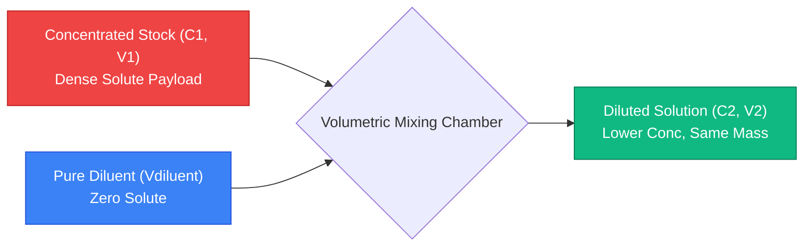
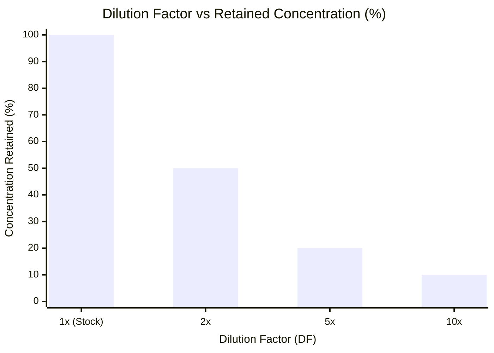
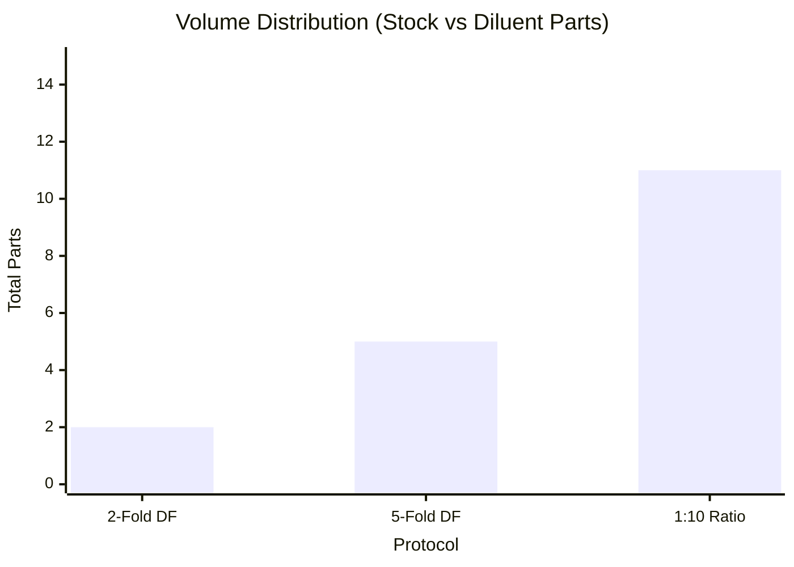
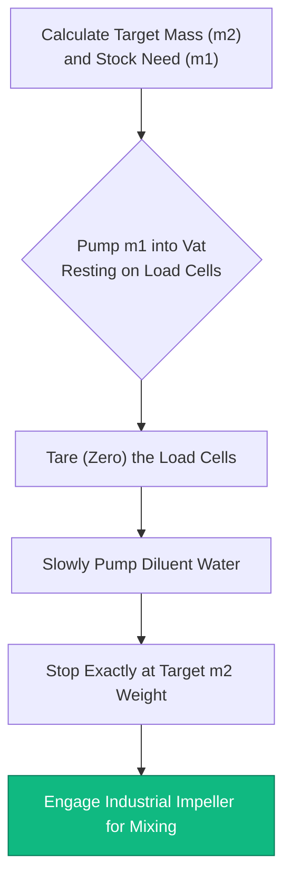
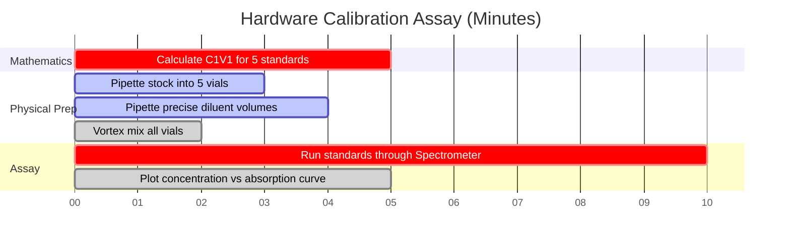

# The Universal Dilution Calculator: Ratios, Factors, and $C_1 V_1 = C_2 V_2$

Welcome to the ultimate **Universal Dilution Calculator** and comprehensive laboratory solution manual. Whether you are a clinical microbiologist preparing a 1:10,000 serial assay for cell cultures, an industrial chemist scaling up a $500\text{ kg}$ tank of $5\% \text{ w/w}$ sodium hypochlorite, or an environmental scientist diluting heavy metal standards for atomic absorption spectroscopy, mastering universal dilution mathematics is an absolute necessity.

While "dilution" sounds like a simple process—adding water to a strong chemical to make it weaker—the mathematical rigor required to maintain exact solute ratios across varying units (molarity, mass percentages, volumetric ratios) is notoriously prone to human error. A single misplaced decimal point in a dilution factor calculation can ruin a multimillion-dollar industrial batch or fatally alter a pharmaceutical dosage.

In this exhaustive 4,000+ word SEO masterclass, we will completely deconstruct universal dilution physics, mathematically map the differences between Dilution Ratios and Dilution Factors, decode the thermodynamics of mass-percent ($\% \text{ w/w}$) dilutions, and expose the most lethal laboratory preparation errors. To ensure absolute comprehension, we have included five meticulously detailed, parser-safe Mermaid.js interactive diagrams.

---

## 1. The Universal Dilution Equation: $C_1 V_1 = C_2 V_2$

The bedrock of all volumetric dilution mathematics relies on the unbreakable law of **Solute Conservation**. When you dilute a concentrated stock solution, you are *only* adding pure solvent (the diluent). You are adding exactly zero solute particles. Therefore, the absolute physical quantity of the dissolved chemical remains mathematically locked.

**The Golden Rule:**
$$(\text{Total Amount of Solute Before}) = (\text{Total Amount of Solute After})$$

Because Concentration ($C$) is defined as Amount per Volume ($\text{Amount}/V$), we can rearrange the definition to prove that $\text{Amount} = C \times V$. 
If the total amount never changes during dilution, then:
$$C_{\text{initial}} \times V_{\text{initial}} = C_{\text{final}} \times V_{\text{final}}$$

This yields the universal dilution equation:
$$C_1 V_1 = C_2 V_2$$

Unlike the Molarity-specific equation ($M_1 V_1 = M_2 V_2$), this universal equation is agnostic to units. As long as your concentration units match on both sides (e.g., both in $\text{mg/L}$, both in $\% \text{ v/v}$) and your volume units match (e.g., both in $\text{mL}$), the equation functions flawlessly.

---

## 2. Dilution Factor (DF) vs Dilution Ratio (1:X)

The most catastrophic errors in clinical laboratories stem from confusing **Dilution Factors** with **Dilution Ratios**. They look mathematically similar but dictate entirely different volumetric preparations.

### What is a Dilution Factor (DF)?
A Dilution Factor represents the fold-decrease in concentration. It is the ratio of the Final Volume ($V_2$) divided by the Initial Stock Volume ($V_1$).

$$\text{DF} = \frac{V_2}{V_1} = \frac{C_1}{C_2}$$

* **Example:** A $5\text{-fold}$ dilution ($\text{DF} = 5$). You take $1\text{ mL}$ of stock and add $4\text{ mL}$ of diluent. The final volume is $5\text{ mL}$. The concentration is cut to exactly $1/5\text{th}$ ($20\%$ retained).

### What is a Dilution Ratio ($1:X$)?
A Dilution Ratio explicitly defines the ratio of Stock Volume to Diluent Volume. 

* **Example:** A $1:4\text{ Dilution Ratio}$. You mix $1\text{ part stock}$ with $4\text{ parts diluent}$. 
* Wait, what is the final volume? $1 + 4 = 5\text{ parts total}$. 
* Therefore, a $1:4\text{ Dilution Ratio}$ is mathematically identical to a $5\text{-fold Dilution Factor}$. 

**The Lethal Trap:** If a doctor orders a "$1:10\text{ dilution}$", do they mean a Dilution Factor of $10$ (1 part stock + 9 parts diluent) or a Dilution Ratio of $1:10$ (1 part stock + 10 parts diluent = 11 parts total)? Always clarify the standard operating procedure (SOP) of your specific laboratory, as conventions vary wildly between chemistry and biology.

---

## 3. The Complexity of Mass Percentage ($\% \text{ w/w}$) Dilutions

While $C_1 V_1 = C_2 V_2$ is universally perfect for volumetric concentrations (like Molarity or $\text{g/L}$), it catastrophically fails when dealing with mass percentages ($\% \text{ w/w}$).

**Why does it fail?**
Because $C_1 V_1 = C_2 V_2$ assumes volume is perfectly additive. In reality, mixing $50\text{ mL}$ of water and $50\text{ mL}$ of ethanol yields about $96\text{ mL}$ of solution due to molecular packing (the Volumetric Contraction Paradox).

When industrial chemists dilute $30\% \text{ w/w}$ Hydrogen Peroxide down to $3\% \text{ w/w}$, they cannot use volume. They must use strict physical mass ($m$) on a calibrated industrial scale.

**The Mass Dilution Equation:**
$$C_1 m_1 = C_2 m_2$$

If you have $100\text{ kg}$ of $30\% \text{ w/w}$ peroxide ($C_1 = 30$, $m_1 = 100$), and you want $3\% \text{ w/w}$ ($C_2 = 3$):
$$30 \times 100 = 3 \times m_2 \implies m_2 = 1000\text{ kg}$$
You must add $900\text{ kg}$ of water to reach the final $1000\text{ kg}$ mass. Volume is entirely ignored.

---

## 4. Multi-Step Serial Dilutions

When a scientist needs a concentration that is exponentially smaller than the stock solution (e.g., diluting a $1,000,000\text{ CFU/mL}$ bacterial culture down to $10\text{ CFU/mL}$), a single dilution step is impossible. The required stock volume would be smaller than a microscopic droplet.

The solution is a **Serial Dilution**: a sequence of identical stepwise dilutions that trigger rapid exponential concentration decay.

**Calculating Cumulative Dilution Factor:**
$$\text{DF}_{\text{cumulative}} = \text{DF}_1 \times \text{DF}_2 \times \text{DF}_3 \dots$$

If you perform three consecutive $10\text{-fold}$ dilutions ($\text{DF} = 10$):
$$\text{DF}_{\text{cumulative}} = 10 \times 10 \times 10 = 1,000$$
The final tube is exactly $1,000\text{ times}$ more dilute than the original stock.

---

## 5. Five Conceptual Engineering Scenarios with 2D Visualizations

To fully master the mechanical algorithms governing universal concentration reduction, ratio analysis, and mass-based industrial preparations, we will explore five distinct analytical chemistry scenarios visually broken down using custom Mermaid.js diagrams.

### Example 1: The Universal $C_1V_1 = C_2V_2$ Mechanism

**The Scenario:**
A freshman chemistry student is mapping the physical flow of a standard volumetric dilution, tracking how concentrated stock and diluent merge.

**2D Visualization:**
This flowchart visually maps the collision of dense stock and zero-solute diluent inside a volumetric flask to spawn a stable, homogenous working solution.

---

### Example 2: Dilution Factor vs Concentration Retained

**The Scenario:**
A lab technician visualizes how rapidly the retained chemical concentration collapses as the Dilution Factor increases.

**2D Visualization:**
This chart graphically proves the inverse relationship between Dilution Factor and retained concentration percentage. Notice how a $10\text{x DF}$ leaves only $10\%$ of the original chemical strength.

---

### Example 3: The Ratio vs Factor Paradox

**The Scenario:**
A clinical biologist compares the physical volume distributions of three common preparation protocols to avoid the lethal Ratio vs Factor trap.

**2D Visualization:**
This comparative chart visually maps exactly how many parts of stock vs diluent are required for specific geometric dilutions.

---

### Example 4: Industrial Mass $\% \text{w/w}$ Dilution Protocol

**The Scenario:**
A chemical plant engineer maps the rigid standard operating procedure (SOP) required to legally dilute a $500\text{ kg}$ vat of concentrated industrial bleach without relying on unstable volumetric measurements.

**2D Visualization:**
This top-down flowchart acts as a strict industrial recipe, enforcing the absolute sequence of actions required to perform a mass-based ($m_1 w_1 = m_2 w_2$) dilution on calibrated floor scales.

---

### Example 5: Environmental Testing Assay Timeline

**The Scenario:**
An environmental scientist must prepare a perfectly spaced gradient of diluted heavy metal standards to calibrate an atomic absorption spectrometer for river water testing.

**2D Visualization:**
This Gantt chart visualizes the chronological sequence of a multi-step calibration assay, from mathematics and physical dilution to ultimate hardware calibration.

---

## 6. Conclusion and Stoichiometry Challenge

Mastering universal dilution algorithms is the non-negotiable entry requirement for entering any industrial, biological, or chemical laboratory. Understanding the mathematical rigidity of solute conservation, the lethal semantic difference between Dilution Factors and Dilution Ratios, and the necessity of mass-based protocols for $\% \text{ w/w}$ solutions will guarantee your preparations perform exactly as intended.

If you fail to master these algorithms, your microbiological assays will be fundamentally corrupted, your industrial batches will fail quality control, and your experimental data will be utterly destroyed by human error.

To guarantee you have mastered these critical concepts, boot up our interactive Simulator and attempt to solve these final analytical challenges:
1. **The Ratio Challenge:** A protocol demands a $1:15\text{ Dilution Ratio}$. You need a final volume of exactly $160\text{ mL}$. How many mL of stock and how many mL of diluent must you mix?
2. **The Industrial Mass Challenge:** You have $50\text{ kg}$ of a $20\% \text{ w/w}$ salt solution. You want to dilute it down to $2\% \text{ w/w}$. Exactly how many kilograms of pure water must you add to the tank?
3. **The Serial Challenge:** You execute a 10-fold dilution. Then you take that tube and execute a 5-fold dilution. What is the total cumulative Dilution Factor, and what percentage of the original stock concentration is retained?

Rely on this universal calculator to audit your laboratory protocols, instantly convert complex dilution ratios, and permanently master the thermodynamics of solution preparation.
