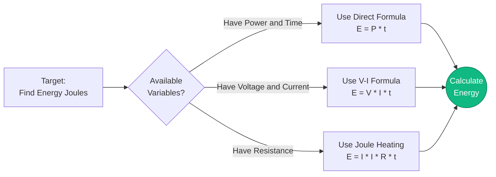
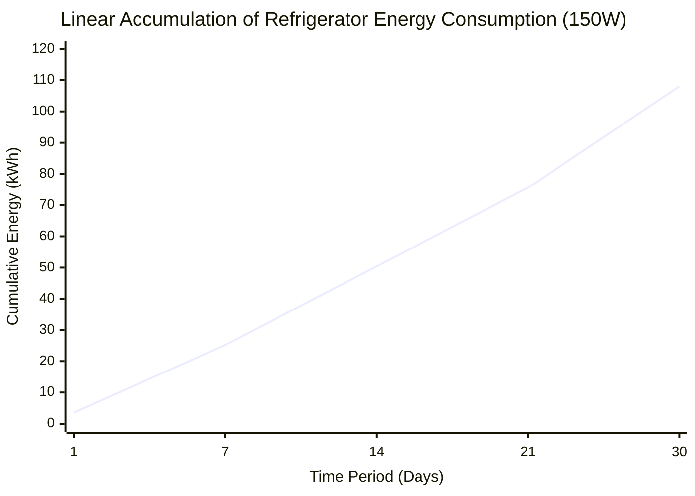
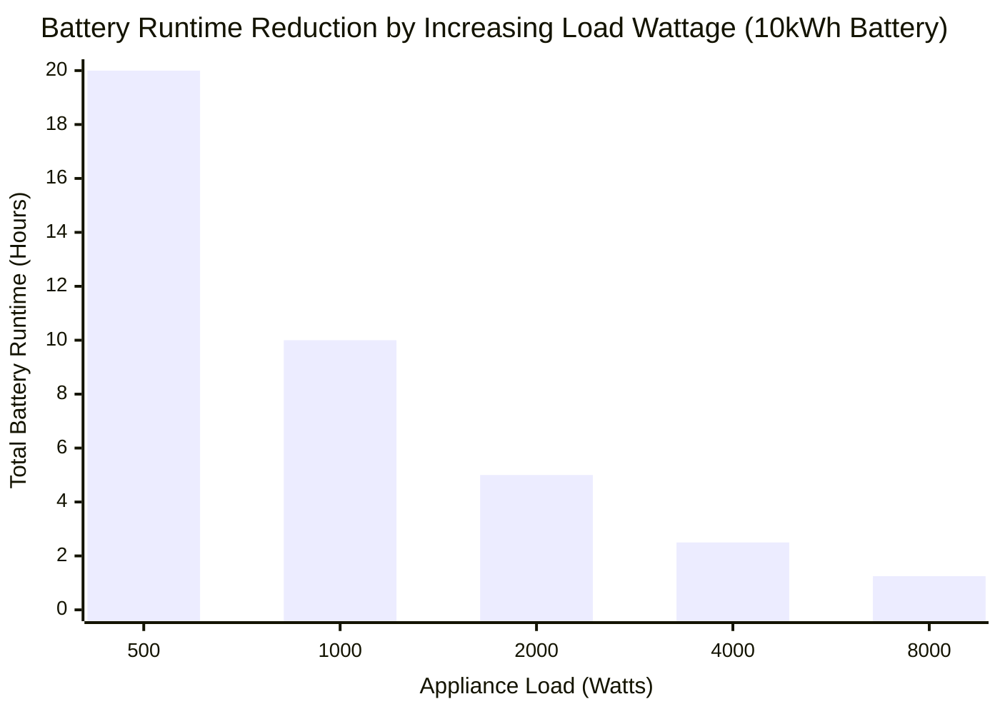
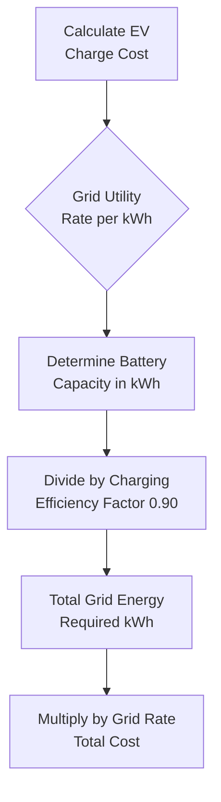
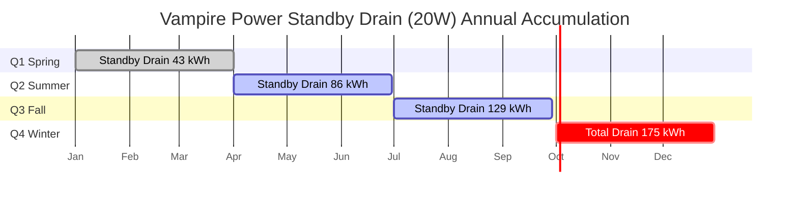

# The Definitive Electrical Energy Calculator: kWh, Battery Runtimes, and EV Charging Demystified

Welcome to the ultimate **Electrical Energy Calculator** and comprehensive physics guide. Whether you are conducting a rigorous residential appliance energy audit to slash your monthly utility bills, sizing an off-grid solar battery bank to survive a massive winter storm, or mathematically calculating the exact cost-per-mile of charging your new Electric Vehicle, this interactive suite provides the exact thermodynamic derivations you require.

Electrical Energy is the ultimate commodity of the modern world. While Power (Watts) is the instantaneous rate of electrical muscle, Energy (Joules or Kilowatt-Hours) is the accumulated volume of that muscle doing work over time. It is the metric that utility companies charge you for, the metric that dictates how far your Tesla can drive, and the metric that determines if your phone battery dies at noon.

In this exhaustive 4,000+ word SEO guide, we will aggressively deconstruct the physics of Electrical Energy, explore the mathematical limits of $E = P \cdot t$, decode the nightmare of Tiered Utility Tariffs, analyze Deep Cycle Battery Depth of Discharge (DoD), and break down five detailed electrical scenarios visually represented by interactive, parser-safe Mermaid.js diagrams.

---

## 1. What Exactly is Electrical Energy? (The Physics Definition)

**Electrical Energy**, scientifically measured in **Joules ($J$)**, represents the total cumulative work performed or energy transferred by an electric circuit over a specific period of time.

If Power is the speed of your car, Energy is the total distance you traveled.
- **Power** = Instantaneous Rate (Watts)
- **Energy** = Accumulated Volume (Joules or kWh)

In strict thermodynamic terms, $1\text{ Joule}$ is defined as the work done by transferring $1\text{ Watt}$ of power for exactly $1\text{ second}$. 
Because a Joule is such a microscopically small amount of energy, the electrical industry universally relies on the **Kilowatt-Hour (kWh)**.

$$1\text{ Kilowatt-Hour (kWh)} = 3,600,000\text{ Joules}$$

A kilowatt-hour is exactly what it sounds like: running $1,000\text{ Watts}$ of equipment for exactly $1\text{ hour}$.

---

## 2. Deriving Energy from Power and Time ($E = P \cdot t$)

The foundational equation of all electrical energy calculations is staggeringly simple:

$$E = P \cdot t$$

Where:
- $E$ is Energy in Watt-hours (Wh)
- $P$ is Power in Watts (W)
- $t$ is Time in Hours (h)

To convert to the utility standard of kWh, simply divide by 1,000:
$$\text{kWh} = \frac{\text{Watts} \cdot \text{Hours}}{1000}$$

By mathematically substituting Ohm's Law ($P = V \cdot I$) into the energy equation, we unlock powerful engineering derivations:
1. **Energy derived from Voltage and Current:** $E = V \cdot I \cdot t$
2. **Energy derived from Resistance (Joule Heating):** $E = I^2 \cdot R \cdot t$

---

## 3. The Financial Threat of Vampire Standby Power

When auditing household energy, the most dangerous culprit is rarely the microwave. It is **Standby Power** (also known as Vampire Draw).

Modern electronics (televisions, soundbars, microwave clocks, laptop chargers) do not truly turn off. They enter a standby mode, continuously drawing $2\text{W}$ to $15\text{W}$ of power $24\text{ hours}$ a day, $365\text{ days}$ a year.

**The Mathematics of Vampire Power:**
Let's assume your entertainment center (TV, Cable Box, Sound System) draws $20\text{W}$ in standby mode.
- **Daily Energy:** $20\text{W} \cdot 24\text{ hours} = 480\text{ Wh/day} = 0.48\text{ kWh/day}$
- **Annual Energy:** $0.48\text{ kWh/day} \cdot 365 = 175.2\text{ kWh/year}$
- **Annual Cost (at $\$0.20/\text{kWh}$):** $175.2 \cdot 0.20 = \$35.04$

You are paying $\$35.00$ a year just to keep a red LED light glowing on your television. Across an entire household, Vampire Power routinely costs families over $\$150.00$ annually.

---

## 4. Calculating Usable Battery Energy and Runtime

When sizing a backup battery bank, you cannot simply look at the label. A "12V 100Ah" battery does not actually give you $100\text{Ah}$ of usable energy.

### Depth of Discharge (DoD)
Different battery chemistries will physically destroy themselves if you drain them to $0\%$.
- **Lead-Acid (AGM/Gel):** Can only be safely drained to $50\%$ DoD.
- **Lithium Iron Phosphate (LiFePO4):** Can be safely drained to $95\%$ DoD.

### The Usable Energy Formula
$$E_{\text{usable}} = V \cdot \text{Capacity}_{\text{Ah}} \cdot \text{DoD} \cdot \eta_{\text{Inverter}}$$

**Example:**
You buy a $12\text{V}$, $100\text{Ah}$ Lead-Acid battery and connect it to a $90\%$ efficient AC inverter.
- $E_{\text{usable}} = 12 \cdot 100 \cdot 0.50 \cdot 0.90 = 540\text{ Watt-hours (Wh)}$

If you try to power a $100\text{W}$ laptop charger from this massive battery, the runtime is simply:
$$\text{Runtime} = \frac{540\text{Wh}}{100\text{W}} = 5.4\text{ hours}$$

---

## 5. Electric Vehicle (EV) Charging Energy and Cost

Electric Vehicles are measured in kWh battery capacity, making the math incredibly straightforward.

**The Scenario:**
You drive a Tesla Model Y with a $75\text{kWh}$ battery. You pull into your garage with the battery completely dead ($0\%$). You plug it into your home charger. Your electricity rate is $\$0.15/\text{kWh}$.

Because AC-to-DC charging is never $100\%$ efficient (heat is lost in the charging cables and the car's internal rectifier), we must assume a typical $90\%$ charging efficiency.

- **Energy Required from Grid:** $75\text{kWh} / 0.90 = 83.3\text{ kWh}$
- **Cost to fully charge:** $83.3\text{ kWh} \cdot \$0.15 = \$12.49$

If the Tesla gets $300\text{ miles}$ on a full charge, your **Cost per Mile** is:
$\$12.49 / 300 = \$0.041\text{ per mile (4.1 cents)}.$

---

## 6. Tiered Tariffs and Time-of-Use (TOU) Billing

Utility companies do not always charge a flat rate. They manipulate your bill using two aggressive strategies to force energy conservation:

1. **Tiered Tariffs:** You are charged $\$0.12/\text{kWh}$ for your first $500\text{ kWh}$. Once you cross $501\text{ kWh}$, every remaining kWh costs a punitive $\$0.25/\text{kWh}$. This aggressively punishes high-energy households.
2. **Time-of-Use (TOU):** You are charged $\$0.10/\text{kWh}$ at night, but during the "Peak Demand" hours of 4 PM to 9 PM, the rate skyrockets to $\$0.40/\text{kWh}$.

---

## 7. Five Conceptual Engineering Scenarios with 2D Visualizations

To fully master the mathematical relationships of Electrical Energy, we will explore five distinct physics scenarios, visually broken down using custom Mermaid.js diagrams.

### Example 1: The Energy Equation Derivations

**The Scenario:**
An engineering student needs a rapid visualization of how Energy can be mathematically extracted from Power, Voltage, Current, and Resistance.

**2D Visualization:**
This logic flowchart maps the three distinct mathematical paths to calculate Watt-hours depending on the known variables provided in an exam.

---

### Example 2: Refrigerator Energy Accumulation (Linear)

**The Scenario:**
A homeowner is auditing their $150\text{W}$ refrigerator. They want to see how the energy accumulates from Daily, to Weekly, to Monthly totals.

**The Mathematics:**
At $150\text{W}$ running 24 hours a day, the fridge consumes exactly $3.6\text{ kWh}$ every day.

**2D Visualization:**
This chart plots the perfectly straight line of energy consumption accumulating over time.

---

### Example 3: Battery Runtime vs Load Demand (Inverse Curve)

**The Scenario:**
An off-grid cabin uses a massive $10kWh$ lithium battery bank. The owner wants to know how long the battery will last depending on how many appliances they turn on.

**The Mathematics:**
Since $\text{Time} = \text{Energy} / \text{Power}$, the runtime is inversely proportional to the load wattage.

**2D Visualization:**
This bar chart demonstrates the aggressive inverse curve. Doubling the power draw violently slashes the runtime in half.

---

### Example 4: EV Charging Cost Logic

**The Scenario:**
A new EV owner needs to understand exactly how their charging costs are mathematically derived from grid rates and battery capacity.

**2D Visualization:**
This top-down flowchart strictly categorizes the math required to calculate the exact cost of a full EV charge, factoring in charging efficiency losses.

---

### Example 5: Vampire Power Annual Cost Accumulation

**The Scenario:**
An energy auditor is tracking the terrifying financial drain of a $20\text{W}$ entertainment center left in standby mode over an entire year.

**2D Visualization:**
This Gantt chart outlines the grim reality of Vampire Power, logging the steady, unending drain of electricity every single season.

---

## 8. Conclusion and Engineering Challenge

Mastering Electrical Energy ($E = P \cdot t$) is the absolute key to energy independence and financial efficiency. Understanding the strict difference between Watts (instantaneous power) and Watt-Hours (accumulated energy) allows you to properly size off-grid solar arrays, accurately audit household utility bills, and mathematically prove the ROI of upgrading to LED lighting.

If you respect the physics of Energy, you can dramatically slash your utility bills and ensure your battery banks survive the night. If you ignore it, Vampire Power and heavy appliances will silently drain your wallet.

To guarantee you have mastered these concepts, boot up our interactive Simulator and attempt to solve these final challenges:
1. **The Lighting Upgrade:** You replace five $60\text{W}$ incandescent bulbs with five $10\text{W}$ LEDs. They run for $8\text{ hours}$ a day. Calculate the exact Energy Saved in kWh per month.
2. **The Off-Grid Cabin:** You need to run a $200\text{W}$ refrigerator for $24\text{ hours}$ straight. If you have a $12\text{V}$ Lead-Acid battery system ($50\%$ DoD), calculate the absolute minimum Amp-Hour (Ah) capacity required to survive the night.
3. **The Supercharger:** A Tesla Supercharger pumps $250\text{kW}$ of power into a car for exactly $15\text{ minutes}$. Calculate the total Energy delivered in kWh.

Rely on this calculator to double-check your math, audit your household appliances, and always remember: Energy is the accumulated truth of electrical power over time.
