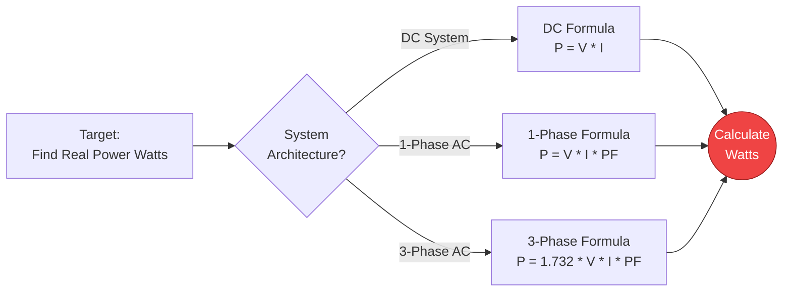
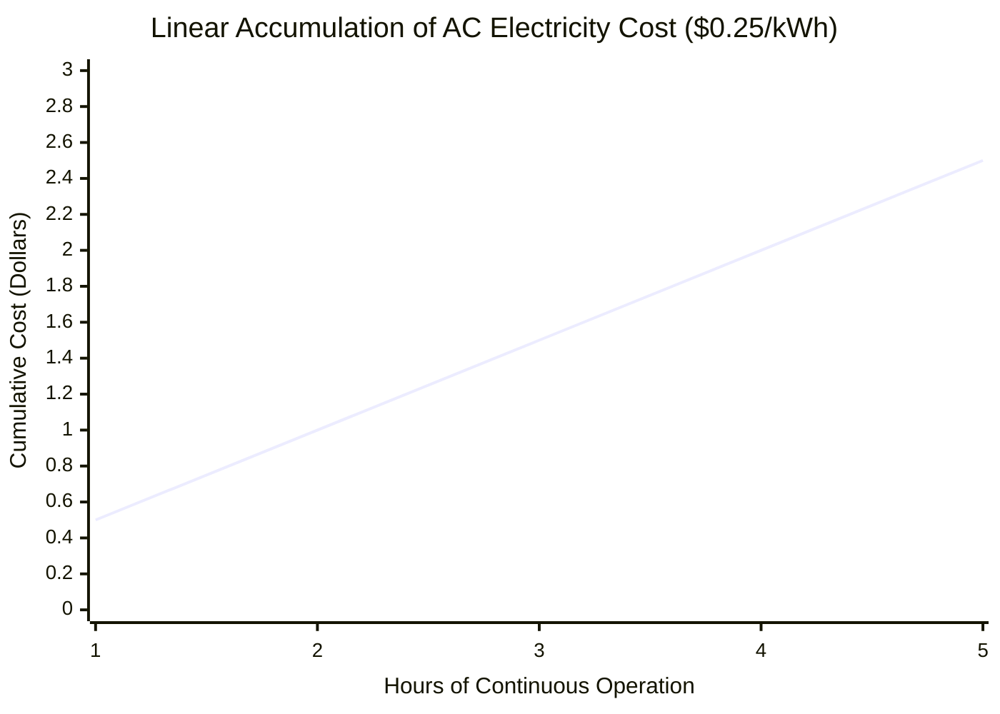
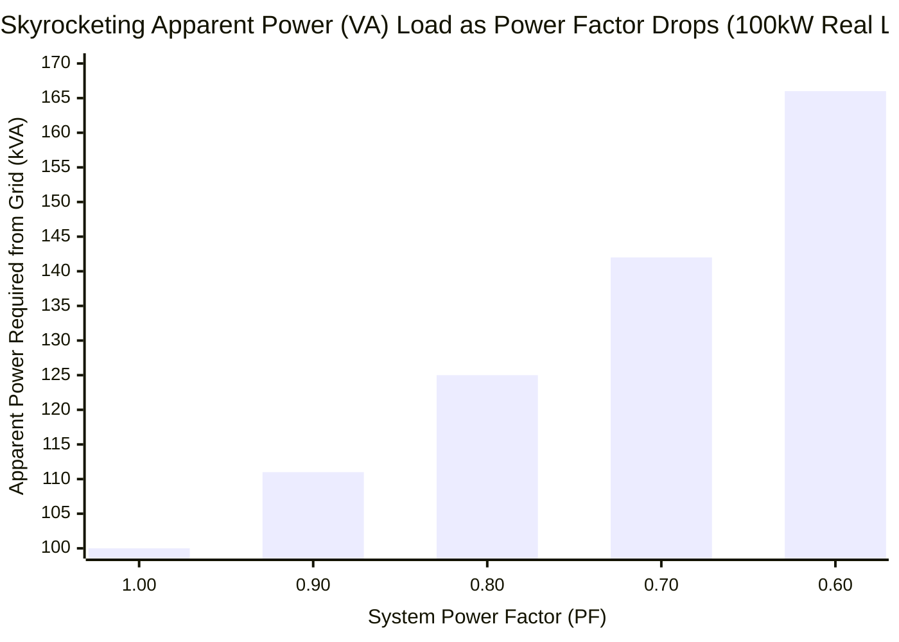
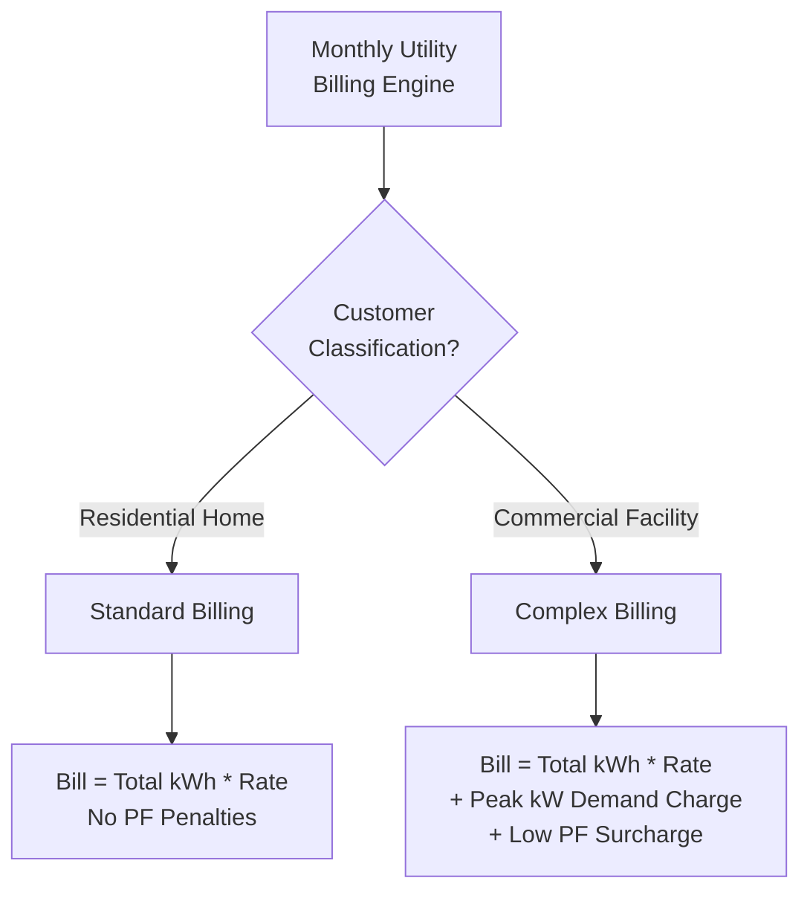

# The Definitive Electrical Power Calculator: Real, Apparent, and Reactive Power Demystified

Welcome to the ultimate **Electrical Power Calculator** and comprehensive physics guide. Whether you are sizing a massive 3-phase industrial generator, calculating the terrifying monthly electricity bill of an old air conditioning unit, or trying to understand why your commercial facility is being penalized for poor Power Factor, this interactive suite provides the exact mathematical clarity you need.

Electrical Power is the absolute rate at which electrical energy is doing work. While Voltage ($V$) is the pressure and Current ($I$) is the flow, Power ($P$, measured in Watts) is the actual resulting muscle. It is the heat radiating from your space heater, the torque spinning your Tesla motor, and the blinding light emitted from an LED.

In this exhaustive 4,000+ word SEO guide, we will aggressively break down the physics of DC Wattage, the complex trigonometry of AC Power Triangles, the harsh reality of Reactive Power (VARs), and the financial mathematics of kilowatt-hour (kWh) billing, complete with five meticulously designed, parser-safe Mermaid.js diagrams.

---

## 1. What Exactly is Electrical Power? (The Physics Definition)

**Electrical Power**, scientifically measured in **Watts ($W$)**, is the fundamental rate at which electrical energy is transferred, consumed, or dissipated by a circuit per second. 

In strict thermodynamic terms, $1\text{ Watt}$ is defined as the transfer of exactly $1\text{ Joule}$ of energy per second. 
- If you leave a $100\text{W}$ lightbulb on for exactly 1 second, it consumes $100\text{ Joules}$ of energy.
- If you leave it on for an hour ($3,600\text{ seconds}$), it consumes $360,000\text{ Joules}$. (This is why we bill in kWh, because Joules get astronomically huge very quickly!)

To find the raw power of any basic electrical component, you simply multiply the electrical pressure across it by the volume of electrons flowing through it:
$$P = V \cdot I$$

---

## 2. Deriving Power using Ohm's Law

Ohm's Law ($V = I \cdot R$) allows us to mathematically substitute variables in the power equation, giving us two incredibly useful engineering shortcuts:

1. **Power derived from Current and Resistance:** $P = I^2 \cdot R$
   - This formula represents **Joule Heating** (or $I^2R$ copper losses). This is the formula utility companies use to calculate how much power is wasted as raw heat along hundreds of miles of transmission lines.
2. **Power derived from Voltage and Resistance:** $P = \frac{V^2}{R}$
   - This formula is used by appliance designers. Since the wall voltage is always fixed at $120\text{V}$, an engineer can calculate exactly how many Ohms of heating coil to cut to produce a $1,500\text{W}$ toaster.

---

## 3. The Nightmare of AC Power: The Power Triangle

In DC (Direct Current) circuits, power is simple math. $P = V \cdot I$. End of story.

In AC (Alternating Current) circuits, the voltage and current are constantly oscillating in a sine wave. If the circuit contains Inductors (motors, transformers) or Capacitors, the current sine wave gets physically delayed or pushed forward, slipping out of sync with the voltage sine wave. This creates a terrifying engineering phenomenon known as **Phase Shift**, birthing the AC Power Triangle.

### Real Power ($P$, measured in Watts)
This is the actual, physical power doing useful work. It is the heat in the toaster and the torque in the motor. It is calculated by taking the raw power and multiplying it by the Power Factor (the cosine of the phase shift angle).
- **Formula:** $P = V \cdot I \cdot \cos\phi$

### Apparent Power ($S$, measured in Volt-Amperes or VA)
This is the total raw power that the utility company must generate and push down the wires to feed your facility. It ignores phase shift entirely.
- **Formula:** $S = V \cdot I$

### Reactive Power ($Q$, measured in VARs)
This is the "phantom" power. It is power that oscillates back and forth between the magnetic fields of your motors and the power grid. It does absolutely ZERO useful work, but it completely clogs up the power lines, causing extreme heat and inefficiency.
- **Formula:** $Q = V \cdot I \cdot \sin\phi$

---

## 4. Power Factor ($\text{PF}$) and Utility Penalties

**Power Factor ($\text{PF}$)** is the strict ratio of Real Power (useful work) to Apparent Power (total grid load).

$$\text{PF} = \frac{\text{Real Power (W)}}{\text{Apparent Power (VA)}}$$

- **$\text{PF} = 1.0$ (Perfect):** A pure resistive load like a space heater. $100\%$ of the power pulled from the grid is converted into heat.
- **$\text{PF} = 0.70$ (Terrible):** A massive industrial motor plant. Only $70\%$ of the power is doing physical work. The other $30\%$ is useless Reactive Power violently sloshing back and forth over the utility lines.

Because Reactive Power clogs the grid and burns down transformers, Utility companies actively monitor commercial Power Factors. If your factory drops below $\text{PF} 0.85$, the utility will hit you with devastating **Power Factor Penalty Surcharges** on your monthly bill.

To fix this, factories install massive racks of **Power Factor Correction Capacitors** to inject reactive power locally, keeping it off the utility grid.

---

## 5. Three-Phase AC Power ($1.732$)

For massive industrial loads, single-phase power is insufficient. The world runs on Three-Phase AC power, where three separate sine waves are transmitted simultaneously, offset by $120^\circ$. 

Because the three phases overlap, they provide mathematically constant, smooth power with zero gaps. To calculate the Real Power of a balanced 3-phase system, we must multiply by the square root of 3 ($\sqrt{3} \approx 1.732$).

**3-Phase Real Power Formula:**
$$P = \sqrt{3} \cdot V_{\text{line}} \cdot I_{\text{line}} \cdot \text{PF}$$

If you have a $480\text{V}$ 3-phase motor drawing $50\text{A}$ with a $\text{PF}$ of 0.85:
$P = 1.732 \cdot 480 \cdot 50 \cdot 0.85 = 35,332\text{ W}$ ($35.3\text{ kW}$).

---

## 6. Understanding Kilowatt-Hours (kWh) and Electricity Billing

Your utility company does not bill you for Watts (Power). They bill you for **Kilowatt-Hours (Energy)**.

A kilowatt-hour (kWh) is simply running $1,000\text{ Watts}$ of equipment for exactly $1\text{ hour}$.

### The kWh Formula:
$$\text{kWh} = \frac{\text{Watts} \cdot \text{Hours}}{1000}$$

**Example:**
If you leave a $1,500\text{W}$ space heater running for $12\text{ hours}$ a day, how much does it cost in a 30-day month if your electricity rate is $\$0.15$ per kWh?

1. **Calculate Daily kWh:** $\frac{1500 \cdot 12}{1000} = 18\text{ kWh/day}$
2. **Calculate Monthly kWh:** $18 \cdot 30 = 540\text{ kWh/month}$
3. **Calculate Cost:** $540 \cdot \$0.15 = \$81.00$

That single space heater is costing you **$\$81.00$ every single month!**

---

## 7. Five Conceptual Engineering Scenarios with 2D Visualizations

To fully master the mathematical relationships of Electrical Power, we will explore five distinct physics scenarios, visually broken down using custom Mermaid.js diagrams.

### Example 1: The Power Equation Topology

**The Scenario:**
An engineering student needs a rapid visualization of how to calculate Wattage across DC, Single-Phase, and Three-Phase systems.

**2D Visualization:**
This logic flowchart maps the three distinct mathematical paths to calculate Watts depending on the electrical architecture.

---

### Example 2: Residential Appliance Energy Cost Accumulation

**The Scenario:**
A homeowner wants to see exactly how fast a $2000\text{W}$ air conditioning unit drains their wallet over a 5-hour period at an exorbitant rate of $\$0.25$ per kWh.

**The Mathematics:**
At $2000\text{W}$, the AC unit consumes exactly $2\text{ kWh}$ every hour. At $\$0.25/\text{kWh}$, that is $\$0.50$ per hour, scaling perfectly linearly.

**2D Visualization:**
This chart plots the perfectly straight line of financial cost accumulating hour by hour.

---

### Example 3: The Threat of Poor Power Factor

**The Scenario:**
A factory manager is pulling $100\text{kW}$ of Real Power. They want to see how the Apparent Power (VA) grid load skyrockets as their Power Factor (efficiency) gets worse.

**The Mathematics:**
Since $\text{PF} = P / S$, as $\text{PF}$ drops, the Apparent Power ($S$) required to do the exact same amount of work drastically increases.

**2D Visualization:**
This bar chart demonstrates the aggressive inverse relationship. Even though the factory is only doing $100\text{kW}$ of actual work, at a $\text{PF}$ of 0.60, the grid must dangerously supply $166\text{kVA}$ of current to support the magnetic fields!

---

### Example 4: Residential vs Commercial Utility Billing Logic

**The Scenario:**
A business owner doesn't understand why their warehouse electric bill is mathematically different than their house bill, even though they consumed the same total kWh.

**2D Visualization:**
This top-down flowchart categorizes the harsh reality of Commercial billing, which introduces Demand Charges (Peak kW) and PF Surcharges that Residential homes are completely immune to.

---

### Example 5: Solar Inverter Startup and Grid Sync

**The Scenario:**
A 10kW residential Solar array wakes up in the morning. The DC power must be safely converted to AC power, synchronized with the chaotic 60Hz utility grid, and exported perfectly without causing a short circuit.

**2D Visualization:**
This Gantt chart outlines the rigorous, highly automated synchronization sequence a modern Grid-Tied Inverter must execute before allowing solar watts to flow into the home.

```mermaid
gantt
    title Solar Inverter Wake-Up and Grid Sync Sequence
    dateFormat  HH:mm:ss
    axisFormat  %H:%M:%S
    
    section DC Boot
    Detect Sufficient Solar MPPT Voltage :done, 00:00:00, 15s
    Boot Internal CPU and Diagnostics :active, 00:00:15, 15s
    
    section AC Sync
    Sample Grid Voltage and Frequency :active, 00:00:30, 10s
    Phase Lock Loop Sync to 60Hz :crit, 00:00:40, 10s
    
    section Export
    Close AC Relays :active, 00:00:50, 05s
    Ramp Up AC Watt Export :milestone, 00:00:55, 0s
```

---

## 8. Conclusion and Engineering Challenge

Mastering Electrical Power separates the hobbyists from the true electrical engineers. Understanding that Watts do the work, VARs build the magnetic fields, and VA is what melts the wires is the absolute key to designing safe, highly efficient electrical infrastructure.

If you respect the Power Triangle and actively correct your Power Factor, your industrial facilities will run perfectly cold and your utility bills will plummet. If you underestimate Reactive Power, your transformers will violently overheat, your breakers will trip, and you will be financially penalized by the utility grid.

To guarantee you have mastered these concepts, boot up our interactive Simulator and attempt to solve these final challenges:
1. **The Server Rack:** A massive crypto-mining rig pulls $30\text{A}$ continuously at $240\text{V}$ DC. Calculate the exact DC Power ($P = V \cdot I$) in kW.
2. **The Penalty Zone:** A commercial motor is drawing $50\text{kW}$ of Real Power but the Power Factor is a miserable 0.65. Calculate the terrifying Apparent Power ($S = P / \text{PF}$) in kVA that the grid is forced to supply.
3. **The Vampire Drain:** Your massive 85-inch television uses $15\text{W}$ of power *while turned off* in standby mode. If electricity is $\$0.20/\text{kWh}$, calculate exactly how much money you burn per year (8,760 hours) just leaving it plugged in.

Rely on this calculator to double-check your math, instantly map your Power Triangles, and always remember: Power is the ultimate measure of thermodynamic truth in the electrical world.
