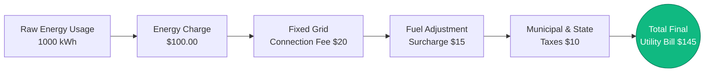
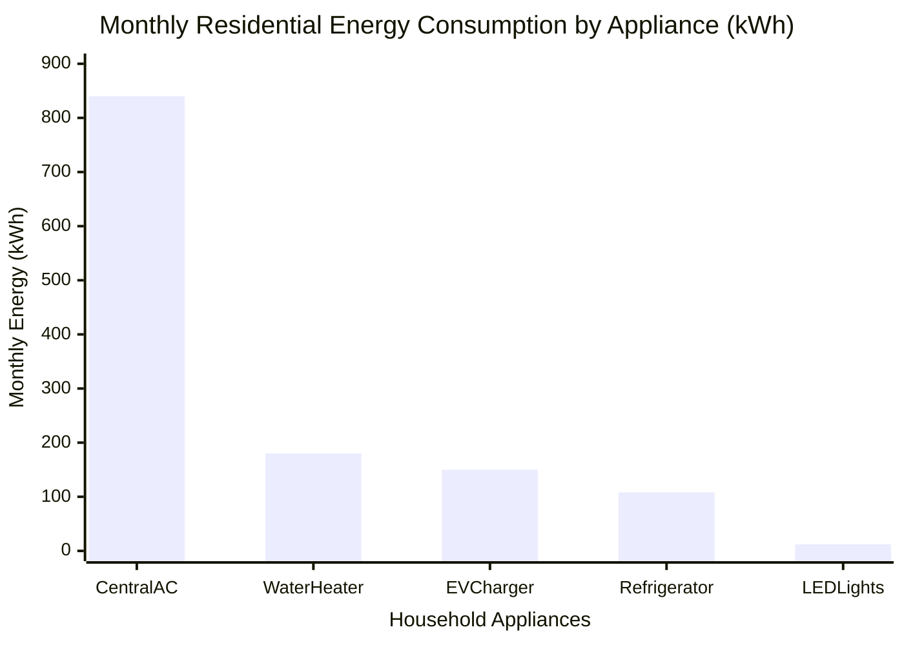
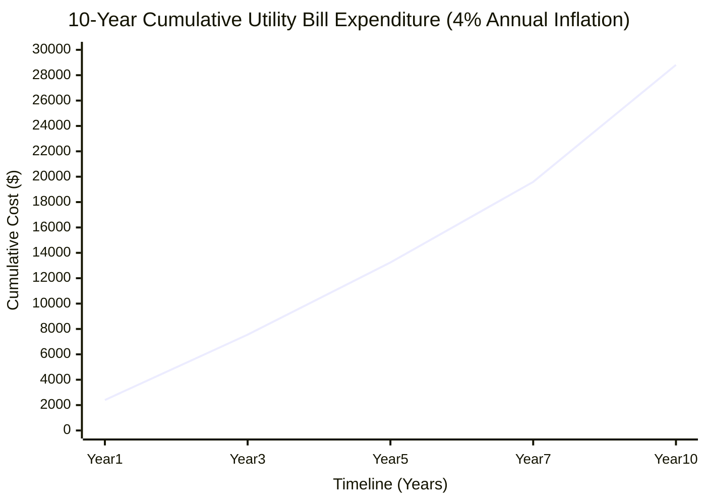
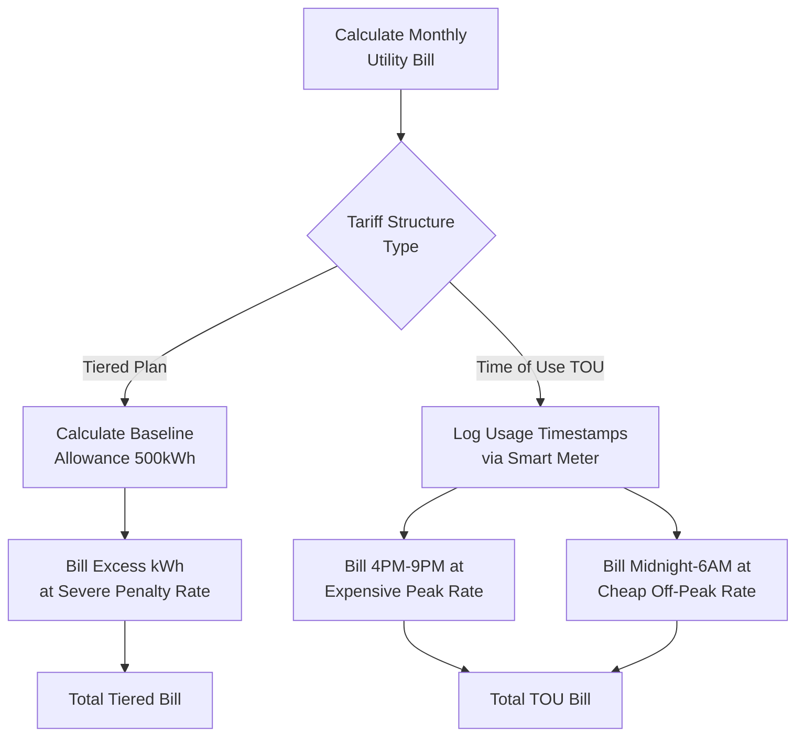
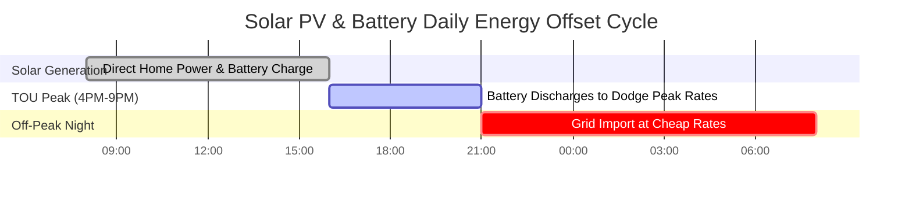

# The Definitive Electricity Cost Calculator: Utility Bills, Tariffs, and Appliance Energy Audits

Welcome to the ultimate **Electricity Cost Calculator** and comprehensive utility bill management guide. Whether you are a homeowner desperate to discover why your summer air conditioning bill skyrocketed to $\$400$, a commercial facility manager attempting to mathematically dodge punitive Demand Charges ($/kW), or a prospective Electric Vehicle (EV) owner calculating exactly how much charging at home will offset your gasoline budget, mastering the thermodynamics and financial algorithms of electricity cost is mandatory.

Your monthly electric bill is not a single, simple number. It is a complex, aggressively structured algorithm designed by utility companies to maximize revenue while forcing consumers to conserve energy during peak demand hours. It blends raw power consumption (Kilowatt-Hours), harsh Time-of-Use (TOU) multipliers, inescapable fixed service fees, and brutal fuel adjustment surcharges.

In this exhaustive 4,000+ word SEO masterclass, we will deconstruct the fundamental $kWh \times \text{Rate}$ equation, mathematically decode the terrifying reality of Tiered Billing structures, expose the financial bleeding caused by Vampire Standby Power, and project 10-year utility costs using realistic inflation rates. To ensure you completely grasp these financial concepts, we have engineered five meticulously detailed, parser-safe Mermaid.js interactive diagrams.

---

## 1. Deconstructing the Utility Bill Formula

The absolute foundation of electricity cost is the **Kilowatt-Hour (kWh)**. Utility companies do not charge you for instantaneous power (Watts); they charge you for the *accumulation* of that power over time (Energy).

**The Foundational Formula:**
$$\text{Cost} = \text{Total Energy (kWh)} \times \text{Tariff Rate (\$/kWh)}$$

To calculate the cost of a single appliance, you must first calculate its energy consumption:
$$\text{Energy (kWh)} = \frac{\text{Power (Watts)} \times \text{Time (Hours)}}{1000}$$

However, the final bill you receive in the mail is substantially more complex.

**The True Total Bill Equation:**
$$\text{Total Bill} = (\text{Energy kWh} \times \text{Rate}) + \text{Fixed Service Fee} + \text{Demand Charge} + \text{Taxes}$$

If you consume $1000\text{ kWh}$ at $\$0.15/\text{kWh}$, your energy charge is $\$150.00$. But once the utility company adds a $\$20.00$ grid connection fee, a $\$15.00$ fuel surcharge, and $8\%$ municipal taxes, your total bill swells to $\$199.80$. This creates an **Effective Rate** of $\$0.20/\text{kWh}$—which is the true number you must use when calculating appliance costs.

---

## 2. The Big Three: Understanding Utility Tariff Structures

Utility monopolies utilize three primary billing structures to charge residential and commercial customers.

### A. Flat Rate Billing
The simplest, but increasingly rare, tariff structure. Every single kilowatt-hour you consume, day or night, costs the exact same amount. 
*Example: $\$0.16$ per kWh, 24/7.*

### B. Tiered (Block) Tariffs
A punitive structure designed to brutally punish high-energy households. The utility gives you a "baseline" allowance at a cheap rate. Once you cross that threshold, the rate skyrockets.
*Example:* 
- Tier 1: $0 \to 500\text{ kWh}$ costs $\$0.12/\text{kWh}$.
- Tier 2: $501 \to 1000\text{ kWh}$ costs $\$0.22/\text{kWh}$.
- Tier 3: $1001+\text{ kWh}$ costs $\$0.35/\text{kWh}$.

If you run a heavy Air Conditioner and push your home into Tier 3, every additional hour of AC costs nearly triple the baseline rate.

### C. Time-of-Use (TOU) Pricing
The modern standard for smart-meter grids. The utility charges you based on *when* you use the power, not just how much.
- **Off-Peak (Midnight to 6 AM):** $\$0.08/\text{kWh}$ (Perfect for charging EVs).
- **Mid-Peak (Morning):** $\$0.15/\text{kWh}$.
- **On-Peak (4 PM to 9 PM):** $\$0.45/\text{kWh}$ (Grid is stressed by returning commuters).

Under a TOU plan, running your electric dryer at 6 PM is financial suicide.

---

## 3. The Appliance Energy Audit: Finding the Hogs

To lower your electric bill, you must ruthlessly audit your household appliances. Not all appliances are created equal. 

### The Heavy Hogs (Heating and Cooling)
Any appliance that changes temperature (air conditioners, space heaters, electric ovens, hot water heaters, clothes dryers) consumes massive amounts of power. 
- A central Air Conditioner draws roughly $3500\text{ Watts}$. Running it for $8\text{ hours}$ consumes $28\text{ kWh}$ a day. At $\$0.15/\text{kWh}$, that is $\$4.20$ every single day, or $\$126.00$ a month.

### The Silent Bleed (Vampire Power)
Modern electronics (TVs, soundbars, game consoles) never truly turn off. They enter "standby mode," pulling $10\text{W}$ to $20\text{W}$ constantly.
- A $20\text{W}$ entertainment center left in standby 24/7 consumes $14.4\text{ kWh}$ a month. Over a year, this costs you $\$26.00$ just to keep a red LED light glowing.

### The Efficiency Heroes (LED Lighting)
A traditional incandescent lightbulb draws $60\text{ Watts}$. An equivalent LED bulb draws $9\text{ Watts}$. By upgrading 10 bulbs that run 6 hours a day, you save roughly $90\text{ kWh}$ a month, immediately slashing $\$13.50$ off your bill.

---

## 4. Electric Vehicle (EV) Home Charging Costs

Gasoline is expensive; electrons are cheap. But how cheap?

To calculate the cost of a full EV charge, you need the battery capacity and the grid efficiency (since AC-to-DC conversion loses about 10% as heat).
$$\text{Charge Cost} = \frac{\text{Battery kWh}}{\text{Efficiency 0.90}} \times \text{Rate}$$

For a Tesla Model Y ($75\text{kWh}$ battery) charging at a $\$0.15/\text{kWh}$ flat rate:
- Grid energy required: $75 / 0.90 = 83.3\text{ kWh}$
- Total Cost: $83.3 \times 0.15 = \$12.49$ for a full "tank."

If that Tesla drives $300\text{ miles}$ on a full charge, your **Cost Per Mile** is a microscopic $\$0.04$ (4 cents). Compare that to a $25\text{ MPG}$ gas car at $\$3.50/\text{gallon}$, which costs $\$0.14$ per mile.

---

## 5. Ten-Year Projections and Utility Inflation

Electricity rates never go down. They historically inflate at an average of $3\%$ to $4\%$ per year due to grid maintenance, fuel costs, and inflation.

If your current monthly electric bill is $\$200$ ( $\$2,400$/year ), and your utility inflates rates by $4\%$ annually:
- Year 1: $\$2,400$
- Year 5: $\$2,807$
- Year 10: $\$3,415$

Over a 10-year period, you will pay the utility company a staggering **$\$28,814$**. This terrifying math is exactly why homeowners invest $\$15,000$ into Solar PV systems to lock in their energy costs and eliminate the inflation curve.

---

## 6. Five Conceptual Engineering Scenarios with 2D Visualizations

To fully master the financial algorithms of electricity billing, we will explore five distinct scenarios visually broken down using custom Mermaid.js diagrams.

### Example 1: The Anatomy of a Utility Bill

**The Scenario:**
A homeowner is confused why their energy calculation ($1000\text{ kWh} \times \$0.10$) equals $\$100$, but their actual bill is $\$145$. 

**2D Visualization:**
This logic flowchart deconstructs the hidden fees and taxes that utility companies stack on top of raw energy usage to generate the final bill.

---

### Example 2: Household Appliance Energy Hogs

**The Scenario:**
An energy auditor is breaking down a home's massive $\$300$ monthly bill to show the owners exactly which appliances are draining their wallet.

**The Mathematics:**
HVAC systems and water heaters universally dominate residential power consumption, while modern electronics barely register.

**2D Visualization:**
This bar chart aggressively ranks the top 5 household appliances by their monthly kWh consumption, exposing the true culprits of high bills.

---

### Example 3: 10-Year Cumulative Cost (With 4% Inflation)

**The Scenario:**
A solar salesperson is demonstrating the brutal reality of a $\$200$/month electric bill compounded over a decade with $4\%$ annual utility inflation.

**The Mathematics:**
Compound interest works against the consumer. $2400 \times (1.04)^n$ results in an exponential, unavoidable expenditure curve.

**2D Visualization:**
This chart plots the terrifying cumulative dollars handed over to the utility company across a 10-year timeline.

---

### Example 4: Tiered Billing vs Time-of-Use (TOU) Logic

**The Scenario:**
A customer is deciding whether to stay on their standard Tiered plan or switch to a modern Time-of-Use plan to charge their EV at night.

**2D Visualization:**
This top-down flowchart maps the strict algorithmic logic the utility company uses to bill the customer under both competing tariff structures.

---

### Example 5: Solar PV and Battery Grid Offset Cycle

**The Scenario:**
A homeowner installs a $10\text{kW}$ Solar array and a Tesla Powerwall. They need to visualize how the system dodges TOU Peak pricing and offsets grid imports.

**2D Visualization:**
This Gantt chart outlines the daily 24-hour cycle of energy generation, battery discharge during Peak hours, and grid reliance only during cheap Off-Peak night hours.

---

## 7. Conclusion and Financial Challenge

Mastering the calculation of Electricity Costs is the absolute key to financial efficiency and household budgeting. Understanding the difference between raw kWh rates and the Effective Rate, dodging Time-of-Use peak penalties, hunting down Vampire standby power, and acknowledging the compounding threat of utility inflation will save you tens of thousands of dollars over a decade.

If you blindly pay your bill every month without understanding the mathematics behind it, the utility company will aggressively maximize their revenue at your expense.

To guarantee you have mastered these financial concepts, boot up our interactive Simulator and attempt to solve these final challenges:
1. **The Tier Penalty:** You consume $1200\text{ kWh}$ this month. Tier 1 ($0-500\text{ kWh}$) is $\$0.10$. Tier 2 ($501-1000\text{ kWh}$) is $\$0.20$. Tier 3 ($1001+\text{ kWh}$) is $\$0.35$. Calculate the exact total energy charge.
2. **The Effective Rate:** Your energy charge is $\$120.00$ for $800\text{ kWh}$. The utility adds a $\$25.00$ connection fee and $\$15.00$ in taxes. Calculate your True Effective Rate per kWh.
3. **The ROI of LEDs:** You replace twenty $60\text{W}$ incandescent bulbs with twenty $10\text{W}$ LEDs. They run $5\text{ hours}$ a day. At $\$0.15/\text{kWh}$, exactly how many dollars will you save in a 30-day month?

Rely on this calculator to audit your appliances, model your EV charging costs, and always mathematically outsmart your utility company's billing algorithms.
