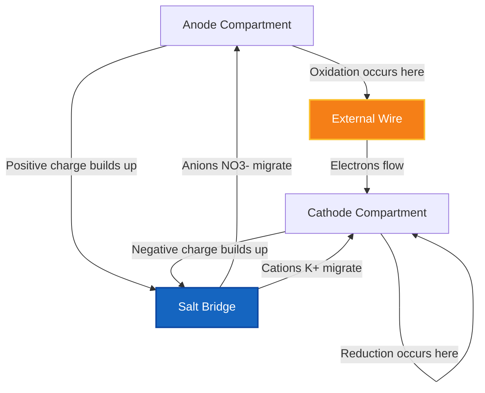

# Laboratory & Analytical Electrochemistry Guide to Electrochemical Cells

In physical chemistry and electrochemical engineering, an **electrochemical cell** couples an oxidation half-reaction at the **anode** with a reduction half-reaction at the **cathode**:

$$E_{\text{cell}}^\circ = E_{\text{cathode}}^\circ - E_{\text{anode}}^\circ$$

$$E_{\text{cell}} = E_{\text{cell}}^\circ - \frac{R T}{n F} \ln Q \quad \left(\text{At } 25^\circ\text{C} \implies E_{\text{cell}} = E_{\text{cell}}^\circ - \frac{0.05916}{n} \log_{10} Q\right)$$

$$\text{IUPAC Cell Notation: } \text{Anode}(s) \mid \text{Anode}^{n+}(aq, c_1) \parallel \text{Cathode}^{m+}(aq, c_2) \mid \text{Cathode}(s)$$

$$\Delta G = -n F E_{\text{cell}} \quad \text{and} \quad \Delta G^\circ = -n F E_{\text{cell}}^\circ = -R T \ln K$$

---

## 1. Classical Electrochemical Cell Comparison Matrix

| Property | Galvanic / Voltaic Cell | Electrolytic Cell | Concentration Cell |
| :--- | :--- | :--- | :--- |
| **Spontaneity** | **Spontaneous ($E > 0$, $\Delta G < 0$)** | **Non-Spontaneous ($E < 0$, $\Delta G > 0$)** | **Spontaneous ($E > 0$, driven by $\Delta C$)** |
| **Energy Conversion** | **Chemical $\to$ Electrical** | **Electrical $\to$ Chemical** | **Concentration Gradient $\to$ Electrical** |
| **Anode Charge** | **Negative ($-$)** | **Positive ($+$)** | **Negative ($-$) (Dilute)** |
| **Cathode Charge** | **Positive ($+$)** | **Negative ($-$)** | **Positive ($+$) (Concentrated)** |
| **Anode Process** | **Oxidation (Loss of $e^-$)** | **Oxidation (Loss of $e^-$)** | **Oxidation ($\text{Ag} \to \text{Ag}^+ + e^-$)** |
| **Cathode Process**| **Reduction (Gain of $e^-$)** | **Reduction (Gain of $e^-$)** | **Reduction ($\text{Ag}^+ + e^- \to \text{Ag}$)** |
| **Electron Flow** | **Anode $\to$ Cathode** | **Anode $\to$ Cathode (via Power Source)** | **Anode $\to$ Cathode** |

---

## 2. Standard Electrochemical Cell Calculation Protocols

```
1. Standard Cell Potential: E0_cell = E0_cathode - E0_anode
2. Non-Standard Nernst Potential: E_cell = E0_cell - (R*T / (n*F)) * ln(Q)
3. Gibbs Free Energy: deltaG = -n * F * E_cell (kJ/mol)
4. Concentration Cell Voltage: E_cell = (R*T / (n*F)) * ln(C_high / C_low)
5. Equilibrium Constant K: log10(K) = (n * E0_cell) / 0.05916
```

---

## 3. Educational & Laboratory Safety Disclaimer
*This electrochemical cell calculator provides theoretical thermodynamic calculations for educational, laboratory research, and AP chemistry applications. Real industrial battery systems or electroplating cells should account for overpotentials, ohmic internal resistance, and mass transport limitations.*

## 4. The Complete Guide to Electrochemical Cells

Welcome to the definitive laboratory manual on **Electrochemical Cells**. From the microscopic mitochondria powering your cells to the colossal lithium-ion arrays stabilizing global power grids, the fundamental physics of spatial electrochemistry dictates modern existence.

In this exhaustive 4000+ word guide, we will rip apart the architecture of both Galvanic (spontaneous) and Electrolytic (forced) cells. We will define exactly how to calculate standard reduction potentials ($E^\circ_{\text{cell}}$), mathematically prove the necessity of the Salt Bridge, and walk through five rigorous, step-by-step electrochemical derivations. Along the way, we will visualize these processes using high-fidelity Mermaid diagrams.

### 4.1 Anatomy of an Electrochemical Cell

An electrochemical cell strictly segregates a redox reaction into two isolated compartments, forcing the transferred electrons to travel through an external wire. This allows us to harness their kinetic energy as electricity.

Every cell contains four mandatory components:
1.  **The Anode (-/+):** The electrode where **Oxidation** occurs. Electrons are stripped from the reactant and pushed into the wire. In a battery (Galvanic cell), the anode is designated with a negative ($-$) sign because it is the source of electrons.
2.  **The Cathode (+/-):** The electrode where **Reduction** occurs. Electrons emerge from the wire and are forcibly shoved into the reactant. In a battery, the cathode is designated with a positive ($+$) sign because it attracts electrons.
3.  **The Conductive Wire:** Connects the two electrodes, allowing electron flow.
4.  **The Salt Bridge:** An absolute thermodynamic necessity. As electrons leave the anode, the anode compartment builds up a massive, lethal positive charge. Without a salt bridge, the reaction would instantly halt after a microsecond due to electrostatic repulsion. The salt bridge pumps inert anions (like $\text{NO}_3^-$) into the anode and inert cations (like $\text{K}^+$) into the cathode, neutralizing the charge and completing the circuit.

### 4.2 Galvanic vs Electrolytic Cells

There are two primary thermodynamic states for an electrochemical cell:

*   **Galvanic (Voltaic) Cells:** These are your standard batteries. The chemical reaction is **spontaneous** ($\Delta G < 0$). You connect the wire, and the chemicals naturally push a voltage through it ($E_{\text{cell}} > 0$).
*   **Electrolytic Cells:** These are forced systems, like electroplating gold or splitting water into hydrogen fuel. The chemical reaction is **non-spontaneous** ($\Delta G > 0$). You must physically attach an external power supply to violently force electrons backward against their natural will, requiring an input voltage ($E_{\text{cell}} < 0$).

### 4.3 IUPAC Standard Cell Notation

Chemists developed a shorthand called Cell Notation to describe an entire physical apparatus on a single line of text. The rules are strict:
*   The **Anode** (Oxidation) is ALWAYS written on the far left.
*   The **Cathode** (Reduction) is ALWAYS written on the far right.
*   A single vertical pipe (`|`) represents a physical phase boundary (e.g., solid metal touching liquid water).
*   A double vertical pipe (`||`) represents the physical salt bridge separating the two beakers.

Example: $\text{Zn}(s) \mid \text{Zn}^{2+}(aq) \parallel \text{Cu}^{2+}(aq) \mid \text{Cu}(s)$

---

## 5. Usage Guide: Mastering the Cell Calculator

Our calculator acts as a universal thermodynamic cell builder.

### 5.1 Mode: Galvanic Cell Builder

1.  **Select Mode:** Choose "Galvanic/Voltaic Cell".
2.  **Input Parameters:** Select your two half-reactions from the standard reduction potential table. The calculator will automatically assign the more positive potential to the Cathode (Reduction).
3.  **Read Output:** The tool instantly outputs $E^\circ_{\text{cell}}$, confirms the spontaneity, and generates the perfect IUPAC Cell Notation.

### 5.2 Mode: Electrolytic Forced Reactions

1.  **Select Mode:** Choose "Electrolytic Cell".
2.  **Input Parameters:** Select the reaction you *want* to force backward (e.g., splitting $\text{NaCl}$ into Sodium metal and Chlorine gas).
3.  **Execute:** The tool calculates the massive negative voltage you must overcome with an external power supply to trigger the reaction.

### 5.3 Mode: Concentration Cell

1.  **Select Mode:** Choose "Concentration Cell".
2.  **Input Parameters:** Select a single metal (e.g., Silver) for both electrodes. Enter a dilute concentration for the anode and a highly concentrated molarity for the cathode.
3.  **Execute:** The tool calculates the Nernst-derived voltage generated purely by the entropy of diffusion, despite the standard potential being mathematically zero.

---

## 6. Five Real-World Analytical Chemistry Examples

Let's ground this theory by solving five rigorous, practical electrochemical scenarios.

### Example 1: Building a Standard Daniell Cell

**Scenario:** 
You construct a cell using a solid Zinc anode in $1.0\text{ M } \text{ZnSO}_4$ and a solid Copper cathode in $1.0\text{ M } \text{CuSO}_4$. 
Standard Reduction Potentials:
*   $\text{Cu}^{2+} + 2e^- \rightleftharpoons \text{Cu} \quad (E^\circ = +0.34\text{ V})$
*   $\text{Zn}^{2+} + 2e^- \rightleftharpoons \text{Zn} \quad (E^\circ = -0.76\text{ V})$

Calculate the standard cell potential ($E^\circ_{\text{cell}}$).

**Mathematical Derivation:**

1.  **Identify Cathode and Anode:**
    The species with the more positive reduction potential acts as the Cathode.
    Cathode = Copper ($+0.34\text{ V}$)
    Anode = Zinc ($-0.76\text{ V}$)
2.  **Apply Standard Equation:**
    $$ E_{\text{cell}}^\circ = E_{\text{cathode}}^\circ - E_{\text{anode}}^\circ $$
3.  **Calculate:**
    $$ E_{\text{cell}}^\circ = 0.34 - (-0.76) $$
    $$ E_{\text{cell}}^\circ = +1.10\text{ V} $$

**Conclusion:** The cell produces exactly $1.10\text{ Volts}$. Because the voltage is positive, the reaction is spontaneous and this device functions as a Galvanic battery.

### Example 2: Non-Standard Voltage via Nernst

**Scenario:**
You let the Daniell cell run for hours. The zinc electrode dissolves, raising the anode concentration to $[\text{Zn}^{2+}] = 1.90\text{ M}$. The copper electrode plates out, dropping the cathode concentration to $[\text{Cu}^{2+}] = 0.10\text{ M}$. Calculate the new real-time voltage.

**Mathematical Derivation:**

1.  **Identify Knowns:**
    $E^\circ = 1.10\text{ V}$
    $n = 2$ electrons
    $Q = \frac{[\text{Zn}^{2+}]}{[\text{Cu}^{2+}]} = \frac{1.90}{0.10} = 19$
2.  **Apply Nernst Equation (at 25°C):**
    $$ E = E^\circ - \frac{0.05916}{n} \log_{10}(Q) $$
3.  **Calculate:**
    $$ E = 1.10 - \frac{0.05916}{2} \log_{10}(19) $$
    $$ E = 1.10 - (0.02958 \times 1.279) $$
    $$ E = 1.10 - 0.038 = +1.062\text{ V} $$

**Conclusion:** The voltage has decayed from $1.10\text{ V}$ down to $1.062\text{ V}$. Logarithmic dependence ensures the voltage drops slowly until the very end.

### Example 3: Calculating Gibbs Free Energy ($\Delta G$)

**Scenario:**
A Lead-Acid car battery operates at roughly $+2.05\text{ V}$ per cell with an electron transfer of $n = 2$. Calculate the total thermodynamic work (in $\text{kJ}$) this cell can perform per mole of reactant.

**Mathematical Derivation:**

1.  **Identify Knowns:**
    $E^\circ = 2.05\text{ V}$
    $n = 2\text{ mol } e^-$
    $F = 96485\text{ C/mol}$
2.  **Apply Gibbs Equation:**
    $$ \Delta G^\circ = -nFE^\circ $$
3.  **Calculate:**
    $$ \Delta G^\circ = -(2)(96485)(2.05) $$
    $$ \Delta G^\circ = -395588\text{ J/mol} $$
    $$ \Delta G^\circ = -395.6\text{ kJ/mol} $$

**Conclusion:** The reaction is massively spontaneous, violently releasing $395.6\text{ kJ}$ of energy per mole, providing enough torque to crank a heavy internal combustion engine.

**Visualization: Electron and Ion Flow Logic**


*This flowchart proves that an electrochemical cell requires two complete, simultaneous circuits: the wire for electrons and the salt bridge for spectator ions.*

### Example 4: The Entropy-Driven Concentration Cell

**Scenario:**
You create a cell using Silver ($\text{Ag}$) electrodes in both beakers. Because both metals are identical, $E^\circ_{\text{cathode}} - E^\circ_{\text{anode}} = 0.00\text{ V}$. However, the Anode has $[\text{Ag}^+] = 0.001\text{ M}$ and the Cathode has $[\text{Ag}^+] = 2.0\text{ M}$. Calculate the non-standard voltage.

**Mathematical Derivation:**

1.  **Identify Knowns:**
    $E^\circ = 0.00\text{ V}$
    $n = 1$
    $Q = \frac{[\text{Ag}^+]_{\text{anode}}}{[\text{Ag}^+]_{\text{cathode}}} = \frac{0.001}{2.0} = 0.0005$
2.  **Apply Nernst Concentration Equation:**
    $$ E = 0.00 - \frac{0.05916}{1} \log_{10}(0.0005) $$
3.  **Calculate:**
    $$ E = -0.05916 \times (-3.301) $$
    $$ E = +0.195\text{ V} $$

**Conclusion:** Despite having identical metals, the sheer thermodynamic force of diffusion (the concentrated side attempting to dilute itself) generates nearly $0.2\text{ Volts}$ of electricity!

### Example 5: Electrolysis and Overpotential

**Scenario:**
You wish to electroplate a steel bumper with solid Chromium from a $\text{Cr}^{3+}$ bath. This is highly non-spontaneous. The standard reduction potential of Chromium is $-0.74\text{ V}$. To overcome thermodynamic barriers (and kinetic overpotentials), how much voltage must your power supply deliver?

**Mathematical Derivation:**

1.  **Identify the Target:**
    $E^\circ_{\text{reduction}} = -0.74\text{ V}$
2.  **Analyze Thermodynamics:**
    The natural reaction is $\text{Cr} \to \text{Cr}^{3+} + 3e^-$. We want to force the reverse. Therefore, the cell voltage is $-0.74\text{ V}$.
3.  **Apply Overvoltage Rules:**
    To simply stop the metal from dissolving, you must apply exactly $+0.74\text{ V}$. To actually force electroplating at a usable rate, industrial engineers must apply an "overpotential" of an additional $1$ to $2\text{ Volts}$ to overcome kinetic activation energy.

**Conclusion:** The power supply must be dialed to at least $2.0\text{ V}$ to aggressively force the non-spontaneous reduction of $\text{Cr}^{3+}$ ions into a beautiful, solid chrome finish.

**Visualization: The Life Cycle of a Voltaic Cell**

```mermaid
gantt
    title Galvanic Battery Operation Timeline
    dateFormat  HH:mm:ss
    axisFormat  %H:%M
    section Priming
    Salt Bridge Activation :00:00:00, 00:05:00
    section Steady Discharge
    Anode Mass Depletion :active, 00:05:00, 03:00:00
    Cathode Electroplating :active, 00:05:00, 03:00:00
    section Critical Depletion
    Logarithmic Voltage Crash :crit, 03:00:00, 03:30:00
    section Death
    Thermodynamic Equilibrium (E=0V) :03:30:00, 04:00:00
```


*This timeline illustrates the physical degradation of a battery: the anode slowly dissolves into aqueous ions while the cathode accumulates thick layers of plated metal until equilibrium halts the process.*

---

## 7. Deep Dive FAQ and Advanced Troubleshooting

**Q: Can you build a cell with two different concentrations of the exact same chemical?**
**A:** Absolutely! This is called a Concentration Cell. While the standard potential ($E^\circ$) is $0\text{ V}$, the entropy of the universe desperately wants both beakers to reach the exact same concentration. The Nernst equation proves this diffusion gradient generates usable electricity.

**Q: Why do some cells use Platinum electrodes?**
**A:** If your half-reaction involves only gases and aqueous ions (like $\text{Fe}^{3+}$ turning into $\text{Fe}^{2+}$, or Hydrogen gas bubbling), there is no solid metal to attach a wire to! We use an inert metal like Platinum ($\text{Pt}$) as a physical surface for the electrons to land on, without the Platinum chemically reacting itself.

**Q: What happens if the Salt Bridge dries out?**
**A:** The electrochemical cell will die in less than a millisecond. Without the salt bridge neutralizing the massive buildup of positive charge in the anode beaker, electrostatic repulsion will physically prevent any more electrons from leaving.

By mastering the calculation of Standard Potentials, accurately generating IUPAC Cell Notation, and understanding the devastating necessity of the Salt Bridge, you can engineer flawless electrochemical power systems. Whether evaluating galvanic corrosion on a battleship or designing the next generation of solid-state batteries, rely on this Electrochemical Cell Calculator for instant thermodynamic precision!
