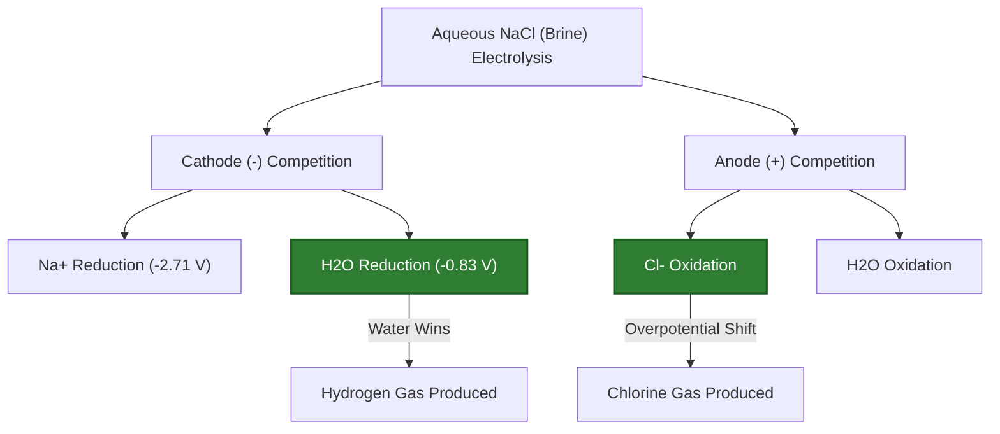

# Comprehensive Guide to Electrolysis & Electrolytic Cell Analysis

In analytical electrochemistry, industrial metallurgy, and hydrogen fuel technology, **Electrolysis** uses external electrical energy to force non-spontaneous chemical transformations:

$$2\text{H}_2\text{O}(l) \xrightarrow{\text{Electrical Energy}} 2\text{H}_2(g) + \text{O}_2(g)$$

$$m = \frac{M \cdot I \cdot t}{n \cdot F}$$

$$V_{\text{gas}} = \frac{n_{\text{gas}} \cdot R \cdot T}{P}$$

$$E_{\text{energy}} = V_{\text{applied}} \cdot I \cdot t \quad \left(\text{Joules or kWh}\right)$$

---

## 1. Sign Convention: Electrolytic vs. Galvanic Cells

| Feature | Galvanic (Voltaic) Cell | Electrolytic Cell |
| :--- | :--- | :--- |
| **Energy Conversion** | Chemical Energy $\to$ Electrical Energy | Electrical Energy $\to$ Chemical Energy |
| **Spontaneity** | Spontaneous ($\Delta G < 0, E^\circ_{\text{cell}} > 0$) | Non-spontaneous ($\Delta G > 0, E^\circ_{\text{cell}} < 0$) |
| **Anode Sign & Reaction** | **Negative (-)**, Oxidation | **Positive (+)**, Oxidation |
| **Cathode Sign & Reaction** | **Positive (+)**, Reduction | **Negative (-)**, Reduction |
| **Electron Flow** | Anode $\to$ Cathode (External Circuit) | Power Supply $\to$ Cathode $\to$ Solution $\to$ Anode |

---

## 2. Standard Preferential Discharge Series in Water

```
Cathodic Reduction Ease (Cathode -):
Ag+ > Cu2+ > H+ (Water) > Pb2+ > Fe2+ > Zn2+ > Al3+ > Mg2+ > Na+ > K+
(Note: Metals below H+ do NOT reduce in aqueous solution; H2 gas forms instead).

Anodic Oxidation Ease (Anode +):
I- > Br- > Cl- > OH- (Water) > SO4(2-) > NO3-
(Note: Halides oxidize to halogen gas; sulfate and nitrate remain in solution as oxygen gas forms).
```

---

## 3. Educational & Laboratory Safety Disclaimer
*This Electrolysis calculator provides theoretical thermodynamic and stoichiometric predictions for educational, chemical laboratory research, and industrial process modeling applications. Real industrial electrolysis cells should account for overpotential losses, bubble resistance, and concentration polarization.*

## 4. The Complete Guide to Applied Electrolysis

Welcome to the definitive laboratory and industrial guide on **Electrolysis**. From generating the clean hydrogen fuel of the future to extracting pure aluminum from raw bauxite ore, electrolysis is the industrial backbone of modern civilization.

In this exhaustive 4000+ word manual, we will rigorously define the physical differences between Aqueous and Molten electrolysis, break down the complex rules of **Preferential Discharge**, and map out exactly how to convert electrical Amperes into Liters of explosive gas. We will walk through five hyper-detailed industrial derivations, and visualize the electron pathways using high-fidelity Mermaid diagrams.

### 4.1 What is Electrolysis?

Electrolysis is the process of forcing a non-spontaneous ($\Delta G > 0$) chemical reaction to occur by violently blasting it with direct electrical current (DC). You plug a machine into a power supply, and use sheer voltage to rip electrons off one chemical and crush them into another.

*   **The Cathode (Negative):** Connected to the negative terminal of the battery. It acts as an electron cannon, firing electrons into the solution. **Reduction** (gain of electrons) happens here. Positive Cations are attracted to the negative cathode.
*   **The Anode (Positive):** Connected to the positive terminal of the battery. It acts as an electron vacuum. **Oxidation** (loss of electrons) happens here. Negative Anions are attracted to the positive anode.

### 4.2 Molten vs. Aqueous Electrolysis

**Molten Electrolysis:** You take a solid salt (like $\text{NaCl}$) and melt it into liquid lava at $800^\circ\text{C}$. There is no water. The only things in the bucket are $\text{Na}^+$ and $\text{Cl}^-$.
*   Cathode product: Pure Sodium metal ($\text{Na}^+ + e^- \to \text{Na}$).
*   Anode product: Toxic Chlorine gas ($2\text{Cl}^- \to \text{Cl}_2 + 2e^-$).

**Aqueous Electrolysis:** You dissolve the salt in water. Now you have a massive competition. In an aqueous $\text{NaCl}$ solution, the $\text{Na}^+$ and $\text{Cl}^-$ ions are competing directly against the $\text{H}_2\text{O}$ molecules for electrons!
*   Cathode: Water is *easier* to reduce than Sodium. The cathode ignores the Sodium and splits the water into Hydrogen gas ($2\text{H}_2\text{O} + 2e^- \to \text{H}_2 + 2\text{OH}^-$).
*   Anode: Depending on the concentration, the anode will either oxidize the Chlorine into $\text{Cl}_2$ gas, or oxidize the water into Oxygen gas.

### 4.3 The Rules of Preferential Discharge

When multiple ions are swimming around the electrode, which one wins the electron? The one that requires the *least amount of energy*.
*   **At the Cathode:** The species with the **most positive** standard reduction potential wins. Metals like Copper and Silver win easily. Active metals like Sodium and Potassium lose to water, generating Hydrogen gas.
*   **At the Anode:** The species with the **most negative** reduction potential wins (meaning it is easily oxidized). Halogens (Iodine, Bromine, Chlorine) usually win. Polyatomic oxyanions (Sulfate $\text{SO}_4^{2-}$, Nitrate $\text{NO}_3^-$) are impossible to oxidize; water will oxidize instead, generating Oxygen gas.

---

## 5. Usage Guide: Mastering the Electrolysis Calculator

Our calculator acts as a universal stoichiometric solver for complex electrolytic cells.

### 5.1 Mode: Predict Aqueous Products

1.  **Select Target:** Choose "Predict Aqueous Products".
2.  **Input Parameters:** Enter your dissolved salt (e.g., $\text{CuSO}_4$).
3.  **Execute:** The tool evaluates the standard potentials. It predicts Copper metal forms at the cathode (beating water) and Oxygen gas forms at the anode (beating sulfate).

### 5.2 Mode: Calculate Gas Volume

1.  **Select Target:** Choose "Calculate Gas Volume (V)".
2.  **Input Parameters:** Enter the Current ($I$), Time ($t$), Temperature ($T$), and Pressure ($P$).
3.  **Execute:** The tool calculates the total electrical charge, converts Coulombs to Moles of gas via Faraday's Law, and then uses the Ideal Gas Law to output the exact physical Liters of gas produced.

### 5.3 Mode: Energy Consumption

1.  **Select Target:** Choose "Calculate Electrical Energy".
2.  **Input Parameters:** Input the operating Voltage ($V$), Current ($I$), and Time ($t$).
3.  **Execute:** The tool calculates total Joules ($E = VIt$) and converts it to industrial kilowatt-hours ($\text{kWh}$), which dictates the factory's electricity bill.

---

## 6. Five Real-World Industrial Electrolysis Examples

Let's ground this theory by solving five rigorous, practical electrolysis scenarios.

### Example 1: Electrolysis of Molten Sodium Chloride (Downs Cell)

**Scenario:** 
You melt pure solid $\text{NaCl}$ into a $800^\circ\text{C}$ liquid. You pass $30,000\text{ Amperes}$ of direct current through the molten salt for exactly $2.0\text{ hours}$. Calculate the mass of pure Sodium metal produced at the cathode.

**Mathematical Derivation:**

1.  **Identify the Reaction:**
    $\text{Na}^+ + e^- \to \text{Na}(s)$ (therefore, $n = 1$).
    Molar Mass of Na = $22.99\text{ g/mol}$.
2.  **Standardize Time:**
    $t = 2.0\text{ hours} \times 3600\text{ s/hr} = 7200\text{ seconds}$.
3.  **Apply Faraday's Law:**
    $$ m = \frac{M \cdot I \cdot t}{n \cdot F} $$
4.  **Calculate:**
    $$ m = \frac{22.99 \times 30000 \times 7200}{1 \times 96485} $$
    $$ m = \frac{4965840000}{96485} = 51467\text{ grams} $$

**Conclusion:** The massive $30\text{ kA}$ current produces $51.47\text{ kg}$ of pure elemental sodium metal in just two hours.

### Example 2: Electrolysis of Aqueous Sodium Chloride (Chlor-Alkali Process)

**Scenario:**
You dissolve $\text{NaCl}$ in water (Brine) and pass a current through it. Predict the products at the Anode and Cathode, and explain why Sodium metal is NOT produced.

**Logical Derivation (Preferential Discharge):**

1.  **Analyze the Cathode (-):**
    Competitors: $\text{Na}^+$ vs $\text{H}_2\text{O}$
    Water reduction potential is $-0.83\text{ V}$.
    Sodium reduction potential is $-2.71\text{ V}$.
    Water requires much less energy. Water wins.
    **Cathode Product:** Hydrogen Gas ($\text{H}_2$) and $\text{NaOH}$ (alkali base).
2.  **Analyze the Anode (+):**
    Competitors: $\text{Cl}^-$ vs $\text{H}_2\text{O}$
    Due to a complex phenomenon called "overpotential", Chlorine gas is slightly easier to oxidize on an industrial electrode than water.
    **Anode Product:** Chlorine Gas ($\text{Cl}_2$).

**Conclusion:** Aqueous $\text{NaCl}$ electrolysis produces Hydrogen gas, Chlorine gas, and liquid Lye ($\text{NaOH}$). This is the famous industrial Chlor-Alkali process!

### Example 3: Splitting Water for Hydrogen Fuel

**Scenario:**
You want to generate Hydrogen gas to power a fuel cell. You run $15.0\text{ Amps}$ through dilute sulfuric acid for $45.0\text{ minutes}$ at $25^\circ\text{C}$ and $1.0\text{ atm}$. Calculate the total physical Liters of Hydrogen gas produced.

**Mathematical Derivation:**

1.  **Standardize Time:**
    $t = 45.0 \times 60 = 2700\text{ seconds}$.
2.  **Identify Cathode Reaction:**
    $2\text{H}^+ + 2e^- \to \text{H}_2(g)$ (therefore, $n=2$ electrons per mole of gas).
3.  **Calculate Moles of Gas ($n_{\text{gas}}$):**
    $$ n_{\text{gas}} = \frac{I \cdot t}{n \cdot F} = \frac{15.0 \times 2700}{2 \times 96485} = 0.2099\text{ moles of }\text{H}_2 $$
4.  **Apply Ideal Gas Law ($V = nRT/P$):**
    $R = 0.08206\text{ L-atm/mol-K}$
    $T = 298.15\text{ K}$
    $$ V = \frac{0.2099 \times 0.08206 \times 298.15}{1.0} = 5.14\text{ Liters} $$

**Conclusion:** Your tabletop electrolysis machine successfully generated $5.14\text{ Liters}$ of highly explosive, clean-burning hydrogen fuel.

**Visualization: Aqueous Cell Competition Logic**


*This flowchart maps the thermodynamic "battles" that occur at each electrode in an aqueous solution, where water actively fights against the dissolved salt.*

### Example 4: Calculating Industrial Energy Consumption ($\text{kWh}$)

**Scenario:**
An industrial copper electrorefining plant applies a massive current of $40,000\text{ A}$ at a cell voltage of $0.35\text{ V}$ continuously for $24.0\text{ hours}$. Calculate the factory's daily electricity consumption in kilowatt-hours ($\text{kWh}$).

**Mathematical Derivation:**

1.  **Identify Knowns:**
    $V = 0.35\text{ Volts}$
    $I = 40,000\text{ Amps}$
    $t = 24.0\text{ hours}$
2.  **Calculate Total Power in Kilowatts ($\text{kW}$):**
    $\text{Power (Watts)} = V \times I$
    $$ P = 0.35 \times 40000 = 14000\text{ Watts} = 14.0\text{ kW} $$
3.  **Calculate Total Energy in Kilowatt-Hours ($\text{kWh}$):**
    $$ \text{Energy} = P \times t $$
    $$ \text{Energy} = 14.0\text{ kW} \times 24.0\text{ hr} = 336\text{ kWh} $$

**Conclusion:** The factory burns $336\text{ kWh}$ of electricity per day for a single cell. Because the purification of copper requires a very low voltage ($0.35\text{ V}$), the energy cost is highly economical despite the massive amperage.

### Example 5: Aluminum Extraction (Hall-Héroult Process)

**Scenario:**
Aluminum cannot be extracted from water; it must be melted in a molten cryolite bath. You run $100,000\text{ A}$ for $1.0\text{ hour}$ through molten $\text{Al}_2\text{O}_3$.
Given: Al $M = 26.98\text{ g/mol}$, $n = 3$. Calculate the mass of aluminum produced.

**Mathematical Derivation:**

1.  **Standardize Units:**
    $t = 3600\text{ s}$
2.  **Apply Faraday's Law:**
    $$ m = \frac{M \cdot I \cdot t}{n \cdot F} $$
3.  **Calculate:**
    $$ m = \frac{26.98 \times 100000 \times 3600}{3 \times 96485} $$
    $$ m = \frac{9712800000}{289455} = 33555\text{ g} = 33.5\text{ kg} $$

**Conclusion:** The cell outputs $33.5\text{ kg}$ of pure molten aluminum per hour. This massive energy requirement is why recycling aluminum cans saves $95\%$ of the energy compared to smelting new ore!

**Visualization: Industrial Gas Evolution Timeline**

```mermaid
gantt
    title Commercial Water Electrolysis Operations
    dateFormat  HH:mm:ss
    axisFormat  %H:%M
    section Startup
    Cell Pressurization & Heating :00:00:00, 00:30:00
    section Steady State
    Continuous 15kA H2 Evolution :active, 00:30:00, 08:00:00
    Continuous 15kA O2 Evolution :active, 00:30:00, 08:00:00
    section Purge
    Safety Venting and Shutdown :crit, 08:00:00, 09:00:00
```


*This Gantt chart visualizes the strict timeline of a commercial water-splitting plant, generating continuous streams of Hydrogen and Oxygen under heavy electrical load.*

---

## 7. Deep Dive FAQ and Advanced Troubleshooting

**Q: If I use an aqueous Copper(II) Sulfate solution ($\text{CuSO}_4$), will I get Hydrogen gas at the cathode?**
**A:** No. Copper ($+0.34\text{ V}$) is much easier to reduce than water ($-0.83\text{ V}$). The cathode will perfectly plate beautiful, solid Copper metal, while the water oxidizes at the anode to produce Oxygen gas.

**Q: Why do we use Platinum or Graphite electrodes?**
**A:** These are "inert" electrodes. They conduct electricity perfectly but refuse to participate in the chemical reaction. If you used a Copper anode in water, the Copper metal itself would dissolve into the water rather than splitting the water into Oxygen gas!

**Q: What is Overpotential?**
**A:** A theoretical calculation might say you only need $1.23\text{ V}$ to split water. In reality, gases like Oxygen hate forming bubbles on solid surfaces (kinetic activation energy). You might have to crank the power supply up to $2.00\text{ V}$ to force the bubbles to actually form. This extra voltage penalty is called overpotential.

By mastering the rules of Preferential Discharge, tracking molten vs aqueous competitors, and calculating physical gas volumes via the Ideal Gas Law, you can engineer flawless electrochemical extraction systems. Rely on this Electrolysis Calculator for instant, thermodynamically perfect process modeling!
