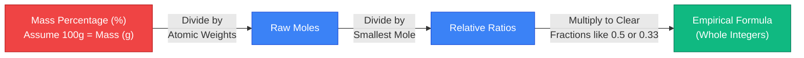
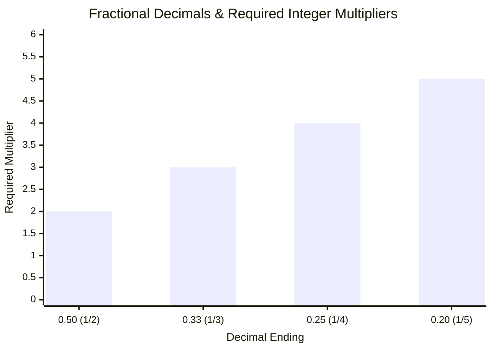
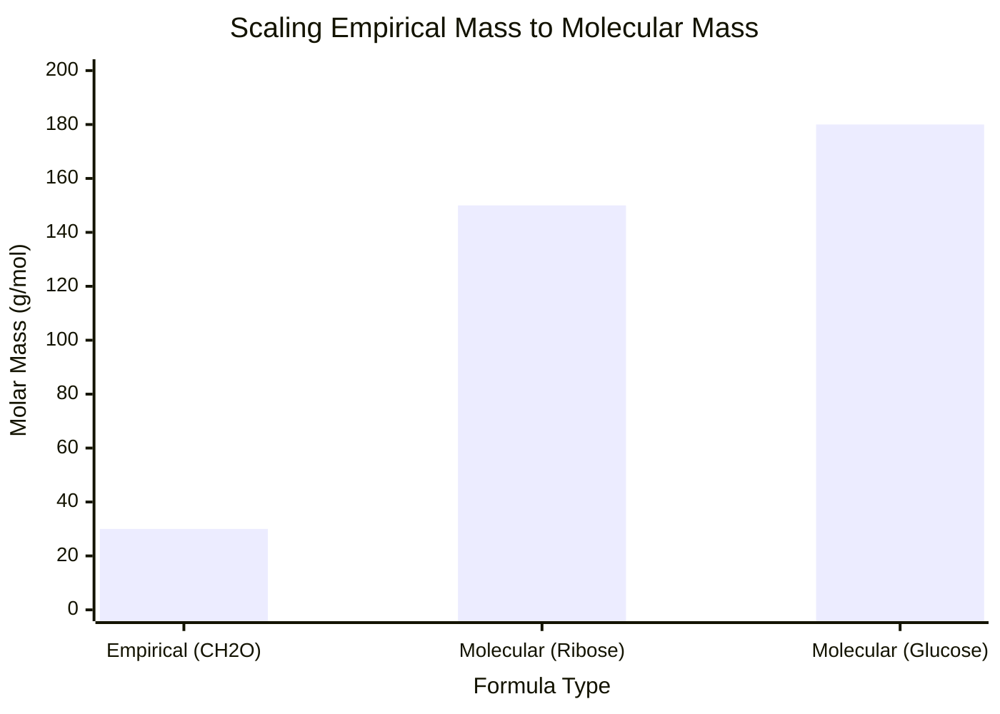
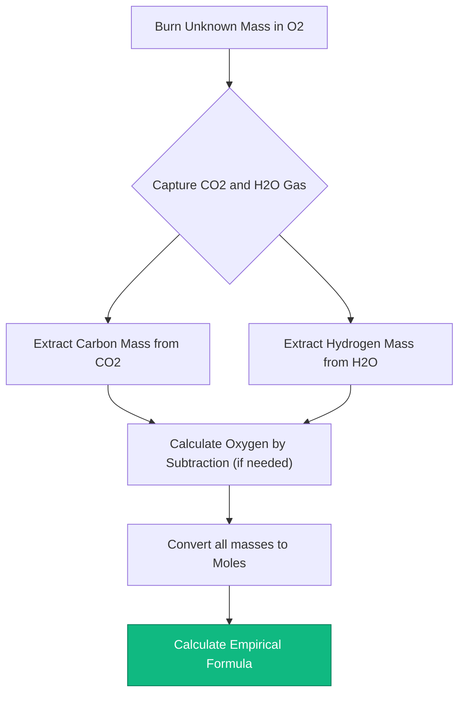
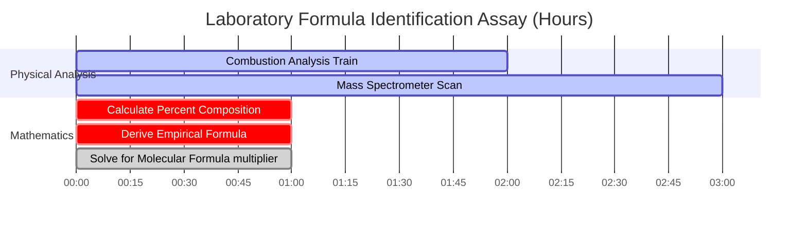

# The Ultimate Empirical Formula Calculator: Composition and Molecular Scaling

Welcome to the definitive **Empirical Formula Calculator** and comprehensive elemental composition guide. Whether you are an AP Chemistry student analyzing percentage composition data for the first time, an organic chemist interpreting mass spectrometry outputs to synthesize a novel pharmaceutical drug, or a laboratory technician performing combustion analysis on an unknown hydrocarbon, mastering empirical and molecular formula derivation is the absolute cornerstone of molecular identification.

In chemical analysis, you are never handed a neat formula. Instead, instruments like mass spectrometers and elemental analyzers spit out raw, chaotic data: percentages by mass, raw elemental weights, or spectral peaks. It is entirely up to the chemist to mathematically reconstruct the exact molecular blueprint of the compound using rigid stoichiometric ratios.

In this exhaustive 4,000+ word SEO masterclass, we will completely deconstruct the math behind converting percentages to moles, explain the critical importance of fractional multipliers (like exactly when to multiply by $2$ or $3$), and decode the algorithmic bridge between a simple Empirical Formula and the physical Molecular Formula. To ensure absolute comprehension, we have included five meticulously detailed, parser-safe Mermaid.js interactive diagrams.

---

## 1. Empirical Formula vs Molecular Formula

Before executing calculations, you must understand the critical physical distinction between these two concepts.

**The Empirical Formula:** 
The simplest, most reduced whole-number ratio of atoms in a compound. 
- *Example:* The empirical formula of Glucose is $\text{CH}_2\text{O}$. This means for every $1\text{ Carbon atom}$, there are exactly $2\text{ Hydrogen atoms}$ and $1\text{ Oxygen atom}$.

**The Molecular Formula:**
The actual physical reality. It tells you exactly how many atoms construct a single, physical molecule of the compound.
- *Example:* The actual molecular formula of Glucose is $\text{C}_6\text{H}_{12}\text{O}_6$. It is physically built from $24\text{ total atoms}$.

Notice the mathematical relationship? The Molecular Formula is simply a scaled-up version (a multiple) of the Empirical Formula. In the case of Glucose, the multiplier ($n$) is exactly $6$.
$$(\text{CH}_2\text{O}) \times 6 \rightarrow \text{C}_6\text{H}_{12}\text{O}_6$$

*Note: Sometimes, the empirical and molecular formulas are identical. For example, Water ($\text{H}_2\text{O}$) cannot be mathematically reduced any further. Therefore, $\text{H}_2\text{O}$ is both the empirical and the molecular formula.*

---

## 2. The Universal Algorithm: From Percentages to Formulas

The journey from raw laboratory percentages to a clean chemical formula requires a strict, unbreakable 4-step algorithmic sequence.

**The Scenario:** 
A laboratory analyzes a mysterious white powder and finds it contains $40.00\%\text{ Carbon}$, $6.71\%\text{ Hydrogen}$, and $53.28\%\text{ Oxygen}$ by mass. What is the empirical formula?

### Step 1: The 100-Gram Assumption
Because percentages are relative, we simply assume we possess exactly $100.0\text{ g}$ of the substance. This magically transforms percentages directly into physical grams.
- $\text{Carbon} = 40.00\text{ g}$
- $\text{Hydrogen} = 6.71\text{ g}$
- $\text{Oxygen} = 53.28\text{ g}$

### Step 2: Convert Mass to Moles
Chemical formulas are ratios of *atoms*, not ratios of *masses*. We must divide the mass of each element by its specific atomic weight from the periodic table.
- $\text{Moles C} = \frac{40.00\text{ g}}{12.011\text{ g/mol}} = \mathbf{3.33\text{ mol C}}$
- $\text{Moles H} = \frac{6.71\text{ g}}{1.008\text{ g/mol}} = \mathbf{6.66\text{ mol H}}$
- $\text{Moles O} = \frac{53.28\text{ g}}{15.999\text{ g/mol}} = \mathbf{3.33\text{ mol O}}$

### Step 3: Divide by the Smallest
To find the relative ratios, divide every mole value by the *smallest* mole value calculated in Step 2. (The smallest value here is $3.33$).
- $\text{Relative C} = \frac{3.33}{3.33} = \mathbf{1.00}$
- $\text{Relative H} = \frac{6.66}{3.33} = \mathbf{2.00}$
- $\text{Relative O} = \frac{3.33}{3.33} = \mathbf{1.00}$

### Step 4: Write the Formula (Hill System)
The relative ratios are perfect whole numbers! The empirical formula is $\text{CH}_2\text{O}$. (Note: By standard chemical convention, Carbon is written first, Hydrogen second, and all other elements alphabetically).

---

## 3. The Fractional Multiplier Trap

In the real world, Step 3 rarely yields perfect integers. What happens if your relative ratios end in decimals like $1.5$ or $1.33$? 

**You absolutely cannot round them.** Rounding a ratio of $1.5$ up to $2$ fundamentally destroys the chemical identity of the compound. Instead, you must find a whole-number multiplier to clear the fraction across *all* elements in the compound.

### Common Multiplier Scenarios:
1. **Ends in $.50$ (e.g., $1.5, 2.5$):** Multiply all elements by **$2$**. 
   - *Example:* $\text{Fe}_{1}\text{O}_{1.5} \times 2 = \text{Fe}_2\text{O}_3$ (Rust)
2. **Ends in $.33$ or $.67$ (e.g., $1.33, 1.66$):** Multiply all elements by **$3$**.
   - *Example:* $\text{C}_{1}\text{H}_{1.33}\text{O}_1 \times 3 = \text{C}_3\text{H}_4\text{O}_3$ (Pyruvic Acid)
3. **Ends in $.25$ or $.75$ (e.g., $1.25, 2.75$):** Multiply all elements by **$4$**.
   - *Example:* $\text{P}_1\text{O}_{2.5} \rightarrow$ wait, actually $2.5$ is a $.5$ fraction, multiply by $2$ to get $\text{P}_2\text{O}_5$. But what if it was $\text{P}_1\text{O}_{1.25}$? Then multiply by $4$ to get $\text{P}_4\text{O}_5$.

---

## 4. Bridging to the Molecular Formula

To upgrade from an Empirical Formula to a true Molecular Formula, the laboratory must provide you with one additional piece of data: the actual **Molar Mass** of the entire compound (usually derived from a mass spectrometer).

**The Calculation:**
1. Calculate the mass of your Empirical Formula.
2. Divide the actual Molecular Mass by the Empirical Mass. This gives you the scalar multiplier ($n$).
3. Multiply all subscripts in the empirical formula by $n$.

**Example:**
We found our empirical formula is $\text{CH}_2\text{O}$. Its empirical mass is $(12) + (2) + (16) = \mathbf{30.0\text{ g/mol}}$.
The mass spectrometer tells us the real chemical weighs exactly $\mathbf{180.0\text{ g/mol}}$.
$$n = \frac{180.0}{30.0} = \mathbf{6}$$
Our molecular formula is therefore $(\text{CH}_2\text{O}) \times 6 = \mathbf{\text{C}_6\text{H}_{12}\text{O}_6}$ (Glucose).

---

## 5. Five Conceptual Engineering Scenarios with 2D Visualizations

To fully master the mechanical algorithms governing fractional multipliers, elemental conversion pathways, and laboratory combustion analysis, we will explore five distinct analytical chemistry scenarios visually broken down using custom Mermaid.js diagrams.

### Example 1: The Percent-to-Formula Algorithm

**The Scenario:**
An AP Chemistry student is mapping the rigid, 4-step mathematical sequence required to convert raw laboratory mass percentages into a clean, reduced empirical formula.

**2D Visualization:**
This flowchart visually maps the strict requirement to pass through the "Mole Ratio Portal" before attempting to write chemical subscripts.

---

### Example 2: The Fractional Multiplier Matrix

**The Scenario:**
An analytical chemist encounters complex decimal ratios (1.5, 1.33, 1.25) and maps exactly which integer multiplier is required to rescue the formula without destructive rounding.

**2D Visualization:**
This chart graphically proves the exact multipliers required to transform common fractional decimals into perfect chemical integers.

---

### Example 3: Empirical Mass vs Target Molecular Mass

**The Scenario:**
A biochemist analyzes a sugar molecule. The empirical mass is $30\text{ g/mol}$, but the mass spectrometer detects multiple heavy isomers. They must scale the formula.

**2D Visualization:**
This comparative chart visually maps how the molecular mass is simply a geometric scalar multiple of the base empirical mass.

---

### Example 4: Combustion Analysis Laboratory Protocol

**The Scenario:**
An organic chemist burns an unknown hydrocarbon in a sealed combustion train. They must back-calculate the amount of Carbon and Hydrogen from the captured $\text{CO}_2$ and $\text{H}_2\text{O}$ gases.

**2D Visualization:**
This top-down flowchart acts as a strict chemical recipe, enforcing the absolute sequence of mathematical actions required to decode a combustion analysis assay.

---

### Example 5: Mass Spectrometry & Analysis Timeline

**The Scenario:**
A forensic laboratory isolates an unknown white powder. They must run a full battery of physical and computational tests to legally verify the exact molecular identity of the compound.

**2D Visualization:**
This Gantt chart visualizes the chronological sequence of a physical assay, proving that formula calculations cannot occur until the mass spectrometer finishes scanning the sample.

---

## 6. Conclusion and Formula Challenge

Mastering empirical and molecular formula derivation is the non-negotiable entry requirement for entering any analytical, biological, or chemical laboratory. Understanding the mathematical rigidity of mole ratios, the absolute prohibition against rounding fractions like $1.5$ or $1.33$, and the scalar relationship between empirical and molecular masses will guarantee your chemical identifications are perfectly accurate.

If you fail to master these algorithms, your laboratory will misidentify critical compounds, ruin million-dollar synthesis scale-ups, and corrupt experimental data via sheer human error.

To guarantee you have mastered these critical concepts, boot up our interactive Simulator and attempt to solve these final analytical challenges:
1. **The Multiplier Challenge:** A compound contains $43.64\%\text{ Phosphorus}$ and $56.36\%\text{ Oxygen}$. Calculate the moles, divide by the smallest, and figure out the integer multiplier to find the empirical formula.
2. **The Molecular Challenge:** An organic acid has an empirical formula of $\text{CHO}_2$ and an empirical mass of $45.0\text{ g/mol}$. A mass spectrometer determines the real molecule weighs $90.0\text{ g/mol}$. What is the true molecular formula?
3. **The Combustion Challenge:** You burn a hydrocarbon and collect $4.40\text{ g}$ of $\text{CO}_2$ and $2.70\text{ g}$ of $\text{H}_2\text{O}$. First, extract the grams of pure Carbon and pure Hydrogen. Then determine the empirical formula of the burned substance.

Rely on this universal formula calculator to audit your laboratory protocols, instantly identify fractional multipliers, and permanently master the thermodynamics of quantitative chemical composition analysis.
