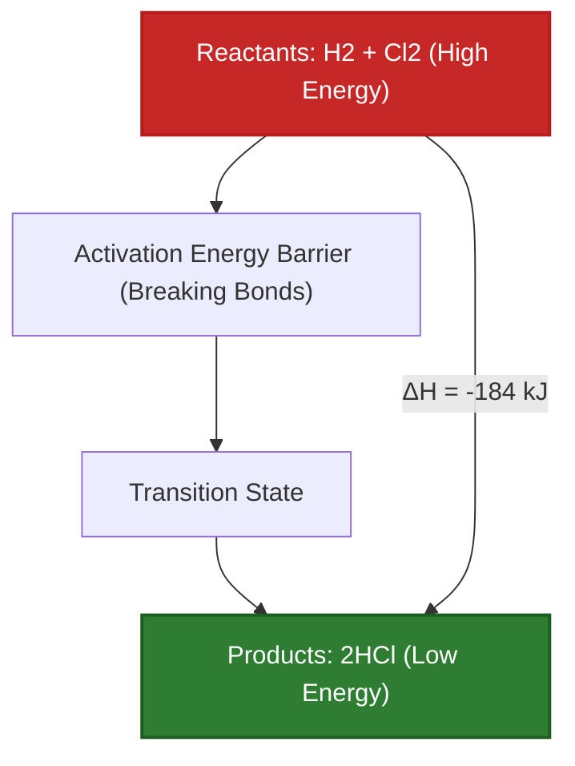

# Complete Laboratory & Industrial Guide to Enthalpy & Thermochemistry

In physical chemistry, chemical engineering, and combustion engineering, **Enthalpy Change ($\Delta H$)** quantifies the net heat energy absorbed or released during chemical reactions at constant pressure:

$$\Delta H = H_{\text{products}} - H_{\text{reactants}}$$

$$\Delta H^\circ_{\text{reaction}} = \sum n \cdot \Delta H^\circ_f(\text{products}) - \sum n \cdot \Delta H^\circ_f(\text{reactants})$$

$$q = m \cdot c \cdot \Delta T \quad \left(\text{Calorimetry Heat Equation}\right)$$

$$\Delta H \approx \sum \text{Bond Energies}_{\text{broken}} - \sum \text{Bond Energies}_{\text{formed}}$$

$$\Delta H_{\text{total}} = \sum \Delta H_i \quad \left(\text{Hess's Law}\right)$$

---

## 1. Exothermic vs. Endothermic Reaction Comparison

| Feature | Exothermic Reaction ($\Delta H < 0$) | Endothermic Reaction ($\Delta H > 0$) |
| :--- | :--- | :--- |
| **Heat Flow Direction** | **Released to Surroundings** | **Absorbed from Surroundings** |
| **Enthalpy Comparison** | $H_{\text{products}} < H_{\text{reactants}}$ | $H_{\text{products}} > H_{\text{reactants}}$ |
| **Surroundings Temp** | **Increases (Warms Up)** | **Decreases (Cools Down)** |
| **Bond Energy Rule** | Energy Released Forming Bonds > Energy to Break Bonds | Energy Required Breaking Bonds > Energy Released Forming Bonds |
| **Common Examples** | Methane Combustion, Neutralization (HCl + NaOH) | Water Vaporization, Dissolution of $\text{NH}_4\text{NO}_3$ |

---

## 2. Thermochemistry Calculation Methods Matrix

```
1. Direct Enthalpy Difference: ΔH = H_products - H_reactants
2. Standard Formation Enthalpies: ΔH°_rxn = Σ n * ΔH°f(products) - Σ n * ΔH°f(reactants)
3. Hess's Law Additivity: ΔH_total = ΔH_1 + ΔH_2 + ΔH_3 + ...
4. Average Bond Energies: ΔH = Σ BE(broken) - Σ BE(formed)
5. Solution Calorimetry: q = m * c * ΔT  (q_reaction = -q_solution)
```

---

## 3. Educational & Laboratory Disclaimer
*This Enthalpy calculator provides theoretical thermochemical predictions for educational, physical chemistry research, and process engineering applications. Real calorimetric measurements should account for calorimeter heat capacity ($C_{\text{cal}}$), heat loss to surroundings, and non-ideal solution mixing.*

## 4. The Complete Guide to Enthalpy and Thermochemistry

Welcome to the definitive physical chemistry guide on **Enthalpy ($\Delta H$)**. Before you can determine if a reaction is spontaneous (using Gibbs Free Energy) or measure absolute chaos (Entropy), you must first balance the universe's ultimate thermal checkbook: Heat. 

In this exhaustive 4000+ word manual, we will rigorously define the physical mechanisms behind **Exothermic and Endothermic** reactions. We will master five distinct mathematical pathways to calculate $\Delta H$, including Hess's Law, Standard Enthalpies of Formation ($\Delta H_f^\circ$), Bond Energies, and Calorimetry ($q = mc\Delta T$). Finally, we will visualize heat transfer and stepwise reaction coordination using high-fidelity Mermaid diagrams.

### 4.1 What is Enthalpy?

Enthalpy ($H$) is a thermodynamic state function that represents the total heat content of a system at constant pressure. Because it is impossible to measure the absolute total energy of an atom, we only care about the **Enthalpy Change ($\Delta H$)**: the exact amount of heat that enters or leaves a system during a chemical reaction.

### 4.2 Exothermic vs. Endothermic: The Physics of Bonds

Why does burning methane release massive amounts of heat? It all comes down to the physics of chemical bonds.
1.  **Breaking Bonds:** Ripping two atoms apart requires you to input energy into the system (Endothermic).
2.  **Forming Bonds:** When two atoms crash together and form a stable bond, they release energy into the universe (Exothermic).

If the energy released by forming the new product bonds is *greater* than the energy it took to break the old reactant bonds, the net result is a massive release of fire and heat. This is an **Exothermic Reaction ($\Delta H < 0$)**. If the opposite is true, the reaction will literally suck heat out of the air, freezing the beaker. This is an **Endothermic Reaction ($\Delta H > 0$)**.

### 4.3 The Five Pathways of Thermochemistry

Chemical engineers use five distinct mathematical methods to calculate Enthalpy, depending on what data they have:
1.  **Standard Enthalpies of Formation ($\Delta H_f^\circ$):** Using a textbook table of how much energy it takes to build a molecule from its elemental atoms.
2.  **Hess's Law:** Treating chemical equations like algebraic puzzles, adding and subtracting steps until they equal your target reaction.
3.  **Bond Energies:** Estimating the reaction heat by summing up the raw textbook strengths of every single $\text{C-H}$ or $\text{O=O}$ bond broken and formed.
4.  **Calorimetry ($q = mc\Delta T$):** Physically measuring the temperature change of water in a lab bucket when a reaction occurs inside it.
5.  **Phase Changes:** Using latent heat ($\Delta H_{\text{vap}}$ or $\Delta H_{\text{fus}}$) to calculate the energy required to boil or melt substances without changing temperature.

---

## 5. Usage Guide: Mastering the Enthalpy Calculator

Our calculator acts as a universal thermochemical solver.

### 5.1 Mode: Calorimetry ($q = mc\Delta T$)

1.  **Select Target:** Choose "Calorimetry Heat (q)".
2.  **Input Parameters:** Enter the mass of the water ($m$), the specific heat capacity ($c$, usually $4.184\text{ J/g}^\circ\text{C}$), and the temperature change ($\Delta T$).
3.  **Execute:** The tool calculates the total Joules of heat absorbed by the water, which directly equals the heat released by your reaction.

### 5.2 Mode: Standard Formation Enthalpies

1.  **Select Target:** Choose "Calculate $\Delta H^\circ_{\text{rxn}}$ via Formation".
2.  **Input Parameters:** Enter the stoichiometric coefficients and the $\Delta H_f^\circ$ values for all reactants and products.
3.  **Execute:** The tool applies the "Products minus Reactants" rule to calculate the precise thermodynamic heat of the overall reaction.

### 5.3 Mode: Hess's Law Additivity

1.  **Select Target:** Choose "Hess's Law Solver".
2.  **Input Parameters:** Input $\Delta H$ values for multiple intermediate reaction steps.
3.  **Execute:** The tool sums the steps (accounting for any reversed reactions) to find the net $\Delta H$ of the global pathway.

---

## 6. Five Real-World Thermochemical Derivations

Let's ground this theory by solving five rigorous, practical thermochemistry scenarios.

### Example 1: Calculating $\Delta H^\circ$ of Methane Combustion

**Scenario:** 
You burn methane gas: $\text{CH}_4(g) + 2\text{O}_2(g) \to \text{CO}_2(g) + 2\text{H}_2\text{O}(l)$
Given Standard Formation Enthalpies ($\Delta H_f^\circ$ in $\text{kJ/mol}$):
*   $\text{CH}_4(g)$: $-74.8$
*   $\text{O}_2(g)$: $0$ (elements in standard state are always zero)
*   $\text{CO}_2(g)$: $-393.5$
*   $\text{H}_2\text{O}(l)$: $-285.8$

**Mathematical Derivation:**

1.  **Apply Formula:**
    $$ \Delta H^\circ_{\text{rxn}} = \sum n\Delta H_f^\circ(\text{products}) - \sum n\Delta H_f^\circ(\text{reactants}) $$
2.  **Calculate Products:**
    $$ H_{\text{prod}} = [1 \times (-393.5)] + [2 \times (-285.8)] = -393.5 - 571.6 = -965.1\text{ kJ} $$
3.  **Calculate Reactants:**
    $$ H_{\text{react}} = [1 \times (-74.8)] + [2 \times 0] = -74.8\text{ kJ} $$
4.  **Final Subtraction:**
    $$ \Delta H^\circ_{\text{rxn}} = -965.1 - (-74.8) = -890.3\text{ kJ/mol} $$

**Conclusion:** The reaction is highly exothermic ($\Delta H < 0$), releasing massive heat.

### Example 2: Coffee Cup Calorimetry ($q = mc\Delta T$)

**Scenario:**
You dissolve $5.00\text{ g}$ of $\text{NaOH}$ into $100.0\text{ g}$ of water in a coffee cup calorimeter. The water temperature violently shoots up from $25.0^\circ\text{C}$ to $37.5^\circ\text{C}$. The specific heat of the solution is $4.18\text{ J/g}^\circ\text{C}$. Calculate the heat released ($q$) in kiloJoules.

**Mathematical Derivation:**

1.  **Determine Total Mass:**
    $m = 100.0\text{ g (water)} + 5.00\text{ g (NaOH)} = 105.0\text{ g total}$
2.  **Determine Temperature Change ($\Delta T$):**
    $\Delta T = 37.5 - 25.0 = 12.5^\circ\text{C}$
3.  **Apply Calorimetry Equation:**
    $$ q_{\text{solution}} = m \cdot c \cdot \Delta T $$
    $$ q_{\text{solution}} = 105.0 \times 4.18 \times 12.5 = 5486.25\text{ Joules} $$
4.  **Determine Reaction Heat:**
    Because the water *absorbed* the heat, the reaction *released* it.
    $$ q_{\text{reaction}} = -q_{\text{solution}} = -5486.25\text{ J} = -5.49\text{ kJ} $$

**Conclusion:** The dissolution of $5\text{ grams}$ of $\text{NaOH}$ released $5.49\text{ kJ}$ of thermal energy.

### Example 3: Estimating $\Delta H$ using Bond Energies

**Scenario:**
Calculate the enthalpy of the reaction: $\text{H}_2(g) + \text{Cl}_2(g) \to 2\text{HCl}(g)$
Given Average Bond Energies ($\text{kJ/mol}$):
*   $\text{H-H}$ bond: $436$
*   $\text{Cl-Cl}$ bond: $242$
*   $\text{H-Cl}$ bond: $431$

**Mathematical Derivation:**

1.  **Apply Bond Energy Formula:**
    $$ \Delta H \approx \sum(\text{Bonds Broken}) - \sum(\text{Bonds Formed}) $$
2.  **Calculate Bonds Broken (Energy IN, Positive):**
    Break $1\text{ H-H}$ ($436$) and $1\text{ Cl-Cl}$ ($242$)
    Total In $= 436 + 242 = +678\text{ kJ}$
3.  **Calculate Bonds Formed (Energy OUT, Negative):**
    Form $2\text{ H-Cl}$ bonds ($2 \times 431$)
    Total Out $= -862\text{ kJ}$
4.  **Final Sum:**
    $$ \Delta H = 678 - 862 = -184\text{ kJ/mol} $$

**Conclusion:** Forming the two strong $\text{H-Cl}$ bonds released more energy than was required to shatter the reactant bonds, resulting in a net exothermic release of $-184\text{ kJ}$.

**Visualization: Exothermic Energy Profile**


*This energy profile demonstrates an exothermic reaction, where products physically sit at a lower, more stable energy tier than the reactants.*

### Example 4: Hess's Law Algebraic Solver

**Scenario:**
Find the $\Delta H$ for the target reaction: $C(s) + \frac{1}{2}\text{O}_2(g) \to \text{CO}(g)$
Given these two known steps:
Step 1: $C(s) + \text{O}_2(g) \to \text{CO}_2(g) \quad (\Delta H_1 = -393.5\text{ kJ})$
Step 2: $\text{CO}(g) + \frac{1}{2}\text{O}_2(g) \to \text{CO}_2(g) \quad (\Delta H_2 = -283.0\text{ kJ})$

**Mathematical Derivation:**

1.  **Manipulate Step 2:**
    Our target reaction has $\text{CO}$ as a *product*. Step 2 has $\text{CO}$ as a *reactant*. We must reverse Step 2.
    Reversed Step 2: $\text{CO}_2(g) \to \text{CO}(g) + \frac{1}{2}\text{O}_2(g)$
    **Rule:** When you reverse a reaction, flip the sign of $\Delta H$.
    New $\Delta H_2 = +283.0\text{ kJ}$
2.  **Add the Steps Together:**
    Step 1: $C(s) + \text{O}_2(g) \to \text{CO}_2(g)$
    Rev Step 2: $\text{CO}_2(g) \to \text{CO}(g) + \frac{1}{2}\text{O}_2(g)$
    The $\text{CO}_2$ cancels out on both sides. $\frac{1}{2}\text{O}_2$ cancels from the left.
    Target Achieved: $C(s) + \frac{1}{2}\text{O}_2(g) \to \text{CO}(g)$
3.  **Sum the Enthalpies:**
    $$ \Delta H_{\text{target}} = \Delta H_1 + \text{New }\Delta H_2 $$
    $$ \Delta H_{\text{target}} = -393.5 + 283.0 = -110.5\text{ kJ} $$

**Conclusion:** Using Hess's law, we calculated the enthalpy of Carbon Monoxide formation without actually running the highly toxic reaction in the lab.

### Example 5: Phase Change Enthalpy (Vaporization)

**Scenario:**
You need to boil $500\text{ g}$ of liquid water at $100^\circ\text{C}$ entirely into steam. 
Given: $\Delta H_{\text{vap}}$ for water is $40.7\text{ kJ/mol}$. Water Molar Mass = $18.02\text{ g/mol}$. Calculate the absolute heat required ($q$).

**Mathematical Derivation:**

1.  **Convert Mass to Moles:**
    $$ n = \frac{500\text{ g}}{18.02\text{ g/mol}} = 27.75\text{ moles of }\text{H}_2\text{O} $$
2.  **Apply Phase Change Equation:**
    $$ q = n \cdot \Delta H_{\text{vap}} $$
3.  **Calculate:**
    $$ q = 27.75\text{ mol} \times 40.7\text{ kJ/mol} = 1129\text{ kJ} $$

**Conclusion:** It takes $1129\text{ kJ}$ of pure thermal energy to snap the hydrogen bonds and force $500\text{ g}$ of water into the gas phase.

**Visualization: Industrial Calorimetry Data Log**

```mermaid
gantt
    title Bomb Calorimeter Temperature Profile
    dateFormat  HH:mm:ss
    axisFormat  %H:%M
    section Baseline
    Thermal Equilibration :00:00:00, 00:05:00
    section Ignition
    Sample Combustion (Exothermic) :active, 00:05:00, 00:07:00
    Rapid Temperature Spike :crit, 00:05:00, 00:07:00
    section Cooling
    Heat Dissipation to Water Jacket :00:07:00, 00:30:00
```


*This Gantt chart visualizes the strict time-course data logging of an industrial bomb calorimeter tracking a highly exothermic combustion reaction.*

---

## 7. Deep Dive FAQ and Advanced Troubleshooting

**Q: If a reaction is Endothermic ($\Delta H > 0$), does that mean it's impossible?**
**A:** No! Endothermic reactions happen all the time (like instant cold packs). They just require the universe to prioritize Entropy ($\Delta S$) over Enthalpy, which happens readily at high temperatures according to the Gibbs Free Energy equation.

**Q: Why do Bond Energy calculations differ from Standard Formation ($\Delta H_f^\circ$) calculations?**
**A:** Bond energies are *averages* taken across thousands of different organic molecules. The $\text{C-H}$ bond in methane is slightly different than the $\text{C-H}$ bond in chloroform. $\Delta H_f^\circ$ uses exact, experimentally measured thermodynamic data for that specific molecule, making it much more accurate.

**Q: What is a "Standard State"?**
**A:** The little degree symbol ($\circ$) in $\Delta H^\circ$ means standard state. It requires gases to be at exactly $1.0\text{ atm}$, solutions to be exactly $1.0\text{ M}$, and elements to be in their most stable physical form at $298.15\text{ K}$ (like solid Carbon graphite or diatomic Oxygen gas).

By mastering Hess's algebraic law, coffee cup calorimetry, and the physics of bond breaking, you can track the invisible flow of heat through any chemical system. Rely on this Enthalpy Calculator for instant, thermodynamically perfect process modeling!
