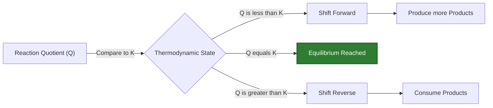

# Laboratory & Analytical Chemistry Guide to Chemical Equilibrium (Kc & Kp)

In physical, analytical, and industrial chemical engineering, the **equilibrium constant** ($K_c$ or $K_p$) quantifies the extent of a reversible chemical reaction at dynamic equilibrium:

$$a\text{A} + b\text{B} \rightleftharpoons c\text{C} + d\text{D} \quad \implies \quad K_c = \frac{[\text{C}]^c [\text{D}]^d}{[\text{A}]^a [\text{B}]^b}$$

$$K_p = K_c (R T)^{\Delta n} \quad (\Delta n = \text{moles gas products} - \text{moles gas reactants})$$

$$Q_c = \frac{[\text{C}]_{\text{current}}^c [\text{D}]_{\text{current}}^d}{[\text{A}]_{\text{current}}^a [\text{B}]_{\text{current}}^b} \quad \begin{cases} Q_c < K_c & \implies \text{Net Forward Shift} \\ Q_c > K_c & \implies \text{Net Reverse Shift} \\ Q_c = K_c & \implies \text{At Equilibrium} \end{cases}$$

$$\ln\left(\frac{K_2}{K_1}\right) = -\frac{\Delta H^\circ}{R} \left(\frac{1}{T_2} - \frac{1}{T_1}\right) \quad (\text{van 't Hoff Equation})$$

---

## 1. Classical Chemical Equilibrium Constant Reference Matrix

| Reaction System | Equation | $K_c$ Expression | $\Delta n$ (gas) | $K_p$ Relation |
| :--- | :--- | :--- | :--- | :--- |
| **Haber Ammonia Process** | $\text{N}_2(g) + 3\text{H}_2(g) \rightleftharpoons 2\text{NH}_3(g)$ | $\frac{[\text{NH}_3]^2}{[\text{N}_2][\text{H}_2]^3}$ | **$-2$** | $K_p = K_c (RT)^{-2}$ |
| **HI Gas Synthesis** | $\text{H}_2(g) + \text{I}_2(g) \rightleftharpoons 2\text{HI}(g)$ | $\frac{[\text{HI}]^2}{[\text{H}_2][\text{I}_2]}$ | **$0$** | $K_p = K_c$ |
| **PCl5 Decomposition** | $\text{PCl}_5(g) \rightleftharpoons \text{PCl}_3(g) + \text{Cl}_2(g)$ | $\frac{[\text{PCl}_3][\text{Cl}_2]}{[\text{PCl}_5]}$ | **$+1$** | $K_p = K_c (RT)^1$ |
| **Heterogeneous Lime Kiln** | $\text{CaCO}_3(s) \rightleftharpoons \text{CaO}(s) + \text{CO}_2(g)$ | $[\text{CO}_2]$ | **$+1$** | $K_p = P_{\text{CO}_2}$ |

---

## 2. Standard Equilibrium Calculation Protocols

```
1. Kc from Concentrations: Kc = [Products]^c / [Reactants]^a
2. Kp from Partial Pressures: Kp = (P_products)^c / (P_reactants)^a
3. Kp from Kc: Kp = Kc * (0.08206 * T)^deltaN
4. Direction Prediction: Compare Q to K (Q < K -> Forward, Q > K -> Reverse)
5. Temperature Dependence: ln(K2/K1) = -deltaH/R * (1/T2 - 1/T1)
```

---

## 3. Educational & Laboratory Safety Disclaimer
*This equilibrium constant calculator provides theoretical thermodynamic calculations for educational, laboratory research, and AP chemistry applications. Real industrial high-pressure systems should account for fugacity coefficients and non-ideal gas activity.*

## 4. The Complete Guide to Chemical Equilibrium ($K_c$, $K_p$, and $Q$)

Welcome to the definitive guide on the **Equilibrium Constant**. Unlike basic high school chemistry equations which assume reactions proceed 100% to completion (where reactants entirely convert into products), real-world chemistry is far more complex. 

The vast majority of chemical reactions are reversible. They occur in both directions simultaneously. As products form, they immediately begin colliding and reacting to reform the original reactants. Eventually, a thermodynamic standstill is reached: the **State of Dynamic Equilibrium**. The forward rate perfectly matches the reverse rate, and the macroscopic concentrations of all species lock into place.

In this exhaustive 4000+ word technical manual, we will completely demystify the thermodynamics of chemical equilibrium. We will decode the mathematical relationship between molar concentration constants ($K_c$) and gas partial pressure constants ($K_p$), establish the predictive power of the Reaction Quotient ($Q$), define the rules of Heterogeneous Equilibrium, and walk through five rigorous, real-world chemical engineering examples complete with step-by-step algebraic derivations and Mermaid visual diagrams.

### 4.1 What is the Equilibrium Constant ($K$)?

For a generic reversible reaction occurring at a constant temperature:
$$ a\text{A} + b\text{B} \rightleftharpoons c\text{C} + d\text{D} $$

The **Equilibrium Constant ($K$)** is a mathematically rigorous ratio describing the final concentration of products relative to reactants once dynamic equilibrium has been achieved. The Law of Mass Action defines this formula as the product concentrations raised to the power of their stoichiometric coefficients, divided by the reactant concentrations raised to the power of their stoichiometric coefficients.

$$ K_c = \frac{[\text{C}]^c [\text{D}]^d}{[\text{A}]^a [\text{B}]^b} $$

The magnitude of $K$ instantly reveals the thermodynamic preference of the reaction:
*   **$K \gg 1$:** Products are heavily favored. The reaction essentially proceeds to completion.
*   **$K \ll 1$:** Reactants are heavily favored. Very little product is formed.
*   **$K \approx 1$:** Neither reactants nor products are heavily favored; a significant mixture of both exists at equilibrium.

### 4.2 The Difference Between $K_c$ and $K_p$

The subscript on the $K$ denotes the units used to measure the substances:
*   **$K_c$ (Concentration):** Used for aqueous solutions or gases measured in molarity (mol/L).
*   **$K_p$ (Pressure):** Used specifically for gas-phase reactions where substances are measured by their partial pressures (in atm or bar).

Because the Ideal Gas Law ($PV = nRT$) relates pressure directly to concentration ($P = \frac{n}{V}RT = MRT$), we can mathematically interconvert $K_c$ and $K_p$ using the following master equation:

$$ K_p = K_c(RT)^{\Delta n} $$

*   $R$ = Ideal Gas Constant ($0.08206 \text{ L atm mol}^{-1} \text{ K}^{-1}$)
*   $T$ = Absolute temperature in Kelvin
*   $\Delta n$ = (Sum of moles of gas products) - (Sum of moles of gas reactants)

*Note: If a reaction does not change the total number of gas moles (i.e., $\Delta n = 0$), then $K_p = K_c$.*

### 4.3 The Reaction Quotient ($Q$) vs Equilibrium Constant ($K$)

The equilibrium constant $K$ only cares about the **final, locked-in** concentrations. But what if you mix arbitrary amounts of chemicals together and want to know which direction they will shift to *reach* equilibrium?

Enter the **Reaction Quotient ($Q$)**. The formula for $Q$ is identical to $K$, but you plug in the **current, non-equilibrium** concentrations:

$$ Q_c = \frac{[\text{C}]_{\text{current}}^c [\text{D}]_{\text{current}}^d}{[\text{A}]_{\text{current}}^a [\text{B}]_{\text{current}}^b} $$

By comparing $Q$ to $K$, you can perfectly predict the thermodynamic shift:
*   **$Q < K$:** The ratio of products is too low. The reaction will shift **FORWARD** (right) to produce more products.
*   **$Q > K$:** The ratio of products is too high. The reaction will shift **REVERSE** (left) to consume products and remake reactants.
*   **$Q = K$:** The system is already at equilibrium. No macroscopic shift will occur.

### 4.4 Heterogeneous Equilibria (The Rule of Solids and Liquids)

When setting up a $K$ expression, **pure solids (s)** and **pure liquids (l)** are strictly ignored. Why? Because the thermodynamic "activity" (effective concentration) of a pure solid or liquid is constant and essentially equals 1. Their concentrations do not change as the reaction proceeds.

For example, the calcination of limestone:
$$ \text{CaCO}_3(s) \rightleftharpoons \text{CaO}(s) + \text{CO}_2(g) $$
The expression is simply:
$$ K_c = [\text{CO}_2] \quad \text{and} \quad K_p = P_{\text{CO}_2} $$
The solid limestone and quicklime are ignored entirely.

---

## 5. Usage Guide: Mastering the Equilibrium Constant Calculator

Our calculator acts as a full thermodynamic simulator.

### 5.1 Mode: Predict Reaction Direction ($Q$ vs $K$)

1.  **Select Mode:** Choose "Reaction Quotient Qc / Qp".
2.  **Input Parameters:** Enter your target $K_c$ value, the stoichiometric coefficients for your reaction, and the *current* laboratory concentrations of all species.
3.  **Read Output:** The tool instantly calculates $Q_c$, compares it to $K_c$, and explicitly outputs the predicted direction of the Le Chatelier shift (Forward or Reverse).

### 5.2 Mode: Converting $K_c$ to $K_p$

1.  **Select Mode:** Choose "Kc to Kp Conversion".
2.  **Input Parameters:** Enter your known $K_c$, the temperature in Kelvin, and the total moles of gas products and reactants.
3.  **Execute:** The tool calculates $\Delta n$, applies the $(RT)^{\Delta n}$ factor, and outputs the exact $K_p$.

### 5.3 Mode: Solving ICE Tables

1.  **Select Mode:** Choose "ICE Table Solver".
2.  **Input Parameters:** Enter your target $K_c$ and the initial concentrations.
3.  **Execute:** The tool builds the Initial, Change, and Equilibrium algebraic matrix, runs an internal polynomial solver, and outputs the exact final equilibrium concentrations for all species.

---

## 6. Five Real-World Chemical Engineering Examples

Let's put this thermodynamic theory into practice with rigorous, step-by-step mathematical breakdowns of classic equilibrium scenarios.

### Example 1: Predicting Reaction Shift with $Q_c$

**Scenario:** 
The synthesis of Hydrogen Iodide gas: $\text{H}_2(g) + \text{I}_2(g) \rightleftharpoons 2\text{HI}(g)$
At $430^\circ\text{C}$, the $K_c$ is 54.3. A student mixes $0.050\text{ M H}_2$, $0.050\text{ M I}_2$, and $0.100\text{ M HI}$ in a flask. Will the reaction produce more $\text{HI}$, or will the $\text{HI}$ break down?

**Mathematical Derivation:**

1.  **Set up the $Q_c$ Expression:**
    $$ Q_c = \frac{[\text{HI}]^2}{[\text{H}_2][\text{I}_2]} $$
2.  **Plug in Current Concentrations:**
    $$ Q_c = \frac{(0.100)^2}{(0.050)(0.050)} $$
    $$ Q_c = \frac{0.0100}{0.0025} = 4.0 $$
3.  **Compare $Q_c$ to $K_c$:**
    $$ Q_c (4.0) < K_c (54.3) $$

**Conclusion:** Because $Q_c$ is less than $K_c$, the reaction is far from equilibrium and "wants" to reach 54.3. The system will shift **FORWARD** (to the right), consuming $\text{H}_2$ and $\text{I}_2$ to synthesize much more $\text{HI}$ until $Q_c$ reaches 54.3.

**Visualization: The Le Chatelier Shift Mechanism**



*This flowchart dictates the universal rules for predicting reaction shifts by comparing the Reaction Quotient to the Equilibrium Constant.*

### Example 2: Converting $K_c$ to $K_p$ for Haber-Bosch

**Scenario:**
The Haber-Bosch process for synthesizing ammonia: $\text{N}_2(g) + 3\text{H}_2(g) \rightleftharpoons 2\text{NH}_3(g)$.
At $300^\circ\text{C}$ (573 K), the $K_c$ is 9.60. Calculate $K_p$ in atmospheres.

**Mathematical Derivation:**

1.  **Calculate $\Delta n$ (change in gas moles):**
    $\Delta n = (\text{moles product gas}) - (\text{moles reactant gas})$
    $\Delta n = (2) - (1 + 3) = 2 - 4 = -2$
2.  **Set up the Conversion Equation:**
    $$ K_p = K_c(RT)^{\Delta n} $$
3.  **Plug in Values ($R = 0.08206$):**
    $$ K_p = 9.60 \times (0.08206 \times 573)^{-2} $$
    $$ K_p = 9.60 \times (47.02)^{-2} $$
    $$ K_p = 9.60 \times (0.000452) $$
    $$ K_p = 4.34 \times 10^{-3} $$

**Conclusion:** Due to the severe drop in total gas moles ($\Delta n = -2$), the $K_p$ ($4.34 \times 10^{-3}$) is drastically smaller than the $K_c$ ($9.60$).

### Example 3: Solving a PCl5 ICE Table

**Scenario:**
Phosphorus pentachloride decomposes: $\text{PCl}_5(g) \rightleftharpoons \text{PCl}_3(g) + \text{Cl}_2(g)$
At $250^\circ\text{C}$, $K_c = 0.0415$. If we start with $0.200\text{ M}$ of pure $\text{PCl}_5$, what are the final equilibrium concentrations?

**Mathematical Derivation:**

1.  **Construct ICE Table:**
    *   **I:** $[\text{PCl}_5] = 0.200$, $[\text{PCl}_3] = 0$, $[\text{Cl}_2] = 0$
    *   **C:** $-x$, $+x$, $+x$
    *   **E:** $(0.200 - x)$, $x$, $x$
2.  **Set up $K_c$ Equation:**
    $$ K_c = \frac{[\text{PCl}_3][\text{Cl}_2]}{[\text{PCl}_5]} = \frac{x^2}{0.200 - x} = 0.0415 $$
3.  **Rearrange into a Quadratic Equation:**
    $$ x^2 = 0.0415(0.200 - x) $$
    $$ x^2 + 0.0415x - 0.00830 = 0 $$
4.  **Solve via Quadratic Formula:**
    $$ x = \frac{-0.0415 + \sqrt{(0.0415)^2 - 4(1)(-0.00830)}}{2} $$
    $$ x = 0.0729\text{ M} $$
5.  **Calculate Final Concentrations:**
    $[\text{PCl}_3] = [\text{Cl}_2] = 0.0729\text{ M}$
    $[\text{PCl}_5] = 0.200 - 0.0729 = 0.1271\text{ M}$

**Conclusion:** At equilibrium, the mixture contains $0.1271\text{ M PCl}_5$ and $0.0729\text{ M}$ of both product gases.

### Example 4: Heterogeneous Carbonate Calcination

**Scenario:**
The thermal decomposition of Calcium Carbonate: $\text{CaCO}_3(s) \rightleftharpoons \text{CaO}(s) + \text{CO}_2(g)$.
At $800^\circ\text{C}$, the $K_p$ for this reaction is $0.236\text{ atm}$. If you place $500\text{ g}$ of $\text{CaCO}_3$ in a sealed, evacuated flask, what is the equilibrium pressure of $\text{CO}_2$? Does the amount of solid matter?

**Mathematical Derivation:**

1.  **Analyze the Phases:**
    $\text{CaCO}_3$ and $\text{CaO}$ are pure solids. Their activities equal 1. They are completely excluded from the equilibrium expression.
2.  **Set up the $K_p$ Expression:**
    $$ K_p = P_{\text{CO}_2} $$
3.  **Solve for Pressure:**
    $$ 0.236\text{ atm} = P_{\text{CO}_2} $$

**Conclusion:** The equilibrium pressure of $\text{CO}_2$ will simply lock at exactly $0.236\text{ atm}$. It absolutely does not matter if you started with $500\text{ g}$, $5\text{ kg}$, or $5\text{ tonnes}$ of limestone; as long as *some* solid is present to maintain equilibrium, the $K_p$ relies exclusively on the gas phase.

### Example 5: Temperature Shifts and the van 't Hoff Equation

**Scenario:**
According to Le Chatelier's Principle, temperature changes actually alter the fundamental value of $K$. The Haber process ($\text{N}_2 + 3\text{H}_2 \rightleftharpoons 2\text{NH}_3$) is extremely exothermic ($\Delta H^\circ = -92.4\text{ kJ/mol}$). How does raising the temperature affect $K$?

**Thermodynamic Derivation:**

1.  **Analyze the Exothermic Heat Flow:**
    Because the reaction releases heat, we can treat "Heat" as a product on the right side of the equation:
    $\text{N}_2 + 3\text{H}_2 \rightleftharpoons 2\text{NH}_3 + \text{HEAT}$
2.  **Apply Le Chatelier's Principle:**
    If we artificially raise the temperature of the reactor, the system attempts to consume that excess heat. It does this by shifting the reaction strongly in the **REVERSE** direction (left), decomposing ammonia back into nitrogen and hydrogen gas.
3.  **Mathematical Result:**
    Because the equilibrium locks in a state with vastly more reactants and fewer products, the ratio $K = \frac{\text{Products}}{\text{Reactants}}$ physically decreases.
4.  **The Industrial Compromise:**
    This creates an engineering nightmare. High temperatures are required to make the reaction run fast (kinetics), but high temperatures drastically lower the $K_c$ (thermodynamics), destroying the yield. Haber-Bosch reactors run at a compromise temperature ($~450^\circ\text{C}$) to balance speed against yield.

**Visualization: Thermodynamic Shift of Exothermic Reactions**

```mermaid
gantt
    title Exothermic Thermodynamic Temperature Shift
    dateFormat  HH:mm:ss
    axisFormat  %H:%M
    section Baseline (300C)
    High Ammonia Yield (Large K) :crit, 00:00:00, 00:10:00
    section Disturbance
    Heater Turned On :00:10:00, 00:12:00
    section New Equilibrium (500C)
    Ammonia Decomposes (K crashes) :active, 00:12:00, 00:20:00
```



*This Gantt timeline maps the thermodynamic collapse of an exothermic equilibrium. As temperature increases, the system shifts left to consume the heat, causing the Equilibrium Constant ($K$) to plummet.*

---

## 7. Deep Dive FAQ and Advanced Troubleshooting

**Q: Can a Reaction Quotient ($Q$) be zero?**
**A:** Yes. If you start a reaction with only pure reactants and zero products, the numerator is zero, making $Q = 0$. Since $0 < K$, the reaction will immediately shift forward to generate products. Conversely, if you start with only products, $Q$ is undefined (approaches infinity), meaning $Q > K$ and the reaction aggressively shifts in reverse.

**Q: What happens to $K$ if I flip the chemical equation backwards?**
**A:** The new equilibrium constant is the exact inverse (reciprocal) of the original. $K_{\text{reverse}} = \frac{1}{K_{\text{forward}}}$.

**Q: What happens to $K$ if I multiply the entire stoichiometry by 2?**
**A:** The new equilibrium constant is the original $K$ raised to that power. $K_{\text{new}} = (K_{\text{original}})^2$.

By mastering the mathematical bridge between $K_c$ and $K_p$, predicting shifts using $Q_c$, and understanding the thermodynamic consequences of temperature shifts, you possess the theoretical power to optimize any chemical engineering process. Always rely on this Equilibrium Constant Calculator to quickly balance complex ICE tables and guarantee analytical perfection!
