# Laboratory & Industrial Guide to Faraday's Laws of Electrolysis

In industrial electroplating, extractive metallurgy, and analytical electrochemistry, **Faraday's Laws of Electrolysis** quantify the relationship between electric charge, chemical stoichiometry, and electrodeposited mass:

$$m = \frac{M \cdot I \cdot t}{n \cdot F} = Z \cdot Q$$

$$Q = I \cdot t \quad \left(\text{Amperes} \times \text{Seconds} = \text{Coulombs}\right)$$

$$n_e = \frac{Q}{F} = \frac{I \cdot t}{F} \quad \left(\text{Moles of Electrons}\right)$$

$$Z = \frac{M}{n \cdot F} \quad \left(\text{Electrochemical Equivalent in g/C}\right)$$

$$\text{Faraday's Second Law: } \frac{m_1}{m_2} = \frac{E_1}{E_2} = \frac{M_1 / n_1}{M_2 / n_2}$$

$$\text{Electroplating Layer Thickness: } h = \frac{m}{\rho \cdot A} \quad \left(\text{where } \rho = \text{density}, A = \text{surface area}\right)$$

---

## 1. Industrial Metal Electrodeposition Reference Matrix

| Metal System | Half-Reaction | Molar Mass ($M$) | Valency ($n$) | Density ($\rho$) | Electrochemical Equivalent ($Z$) |
| :--- | :--- | :--- | :--- | :--- | :--- |
| **Silver (Ag)** | $\text{Ag}^+ + e^- \to \text{Ag}(s)$ | **$107.87 \text{ g/mol}$** | **$1$** | **$10.49 \text{ g/cm}^3$** | **$1.1180 \text{ mg/C}$** |
| **Copper (Cu)** | $\text{Cu}^{2+} + 2e^- \to \text{Cu}(s)$ | **$63.55 \text{ g/mol}$** | **$2$** | **$8.96 \text{ g/cm}^3$** | **$0.3294 \text{ mg/C}$** |
| **Gold (Au)** | $\text{Au}^{3+} + 3e^- \to \text{Au}(s)$ | **$196.97 \text{ g/mol}$** | **$3$** | **$19.32 \text{ g/cm}^3$** | **$0.6805 \text{ mg/C}$** |
| **Aluminum (Al)**| $\text{Al}^{3+} + 3e^- \to \text{Al}(s)$ | **$26.98 \text{ g/mol}$** | **$3$** | **$2.70 \text{ g/cm}^3$** | **$0.0932 \text{ mg/C}$** |
| **Nickel (Ni)** | $\text{Ni}^{2+} + 2e^- \to \text{Ni}(s)$ | **$58.69 \text{ g/mol}$** | **$2$** | **$8.90 \text{ g/cm}^3$** | **$0.3041 \text{ mg/C}$** |

---

## 2. Standard Electrolysis & Electroplating Calculation Protocols

```
1. Mass Deposited: m = (M * I * t) / (n * F)
2. Charge: Q = I * t  (Coulombs)
3. Moles of Electrons: n_e = Q / F
4. Actual Mass (Efficiency %): m_actual = m_theoretical * (Efficiency / 100)
5. Plating Thickness: h = m_actual / (density * surface_area)
```

---

## 3. Educational & Laboratory Safety Disclaimer
*This Faraday's law calculator provides theoretical thermodynamic and stoichiometric calculations for educational, electroplating laboratory research, and chemical engineering applications. Real industrial electrodeposition cells should account for current efficiency losses, overpotentials, and gas evolution side-reactions.*

## 4. The Complete Guide to Faraday's Laws of Electrolysis

Welcome to the definitive laboratory and industrial guide on **Faraday's Laws of Electrolysis**. In 1834, Michael Faraday discovered that the physical mass of metal plated onto an electrode is perfectly, mathematically proportional to the absolute number of electrons you force through the circuit.

In this exhaustive 4000+ word manual, we will rigorously define the First and Second Laws of Electrolysis, break down the physical meaning of the Faraday Constant ($F$), and explore the critical concept of **Current Efficiency** in industrial electroplating. We will then walk through five complex, real-world analytical derivations ranging from jewelry silver plating to industrial aluminum smelting. Furthermore, we will visualize the stoichiometry of electrodeposition using high-fidelity Mermaid diagrams.

### 4.1 Faraday's First Law

**"The mass of any substance deposited or liberated at an electrode is directly proportional to the quantity of electricity (charge) passed through the electrolyte."**

Electricity is not continuous; it is quantized into individual electrons. Current ($I$) is simply the rate of electron flow (Amperes = Coulombs per second). If you multiply Current by Time ($t$), you get the total Charge ($Q$ in Coulombs). 

Since every metal ion requires a very specific integer number of electrons ($n$) to reduce into solid metal (e.g., $\text{Cu}^{2+}$ needs 2 electrons, $\text{Ag}^+$ needs 1), you can predict the exact mass deposited down to the microgram if you know the current and the time.

### 4.2 The Master Equation and the Faraday Constant ($F$)

The proportionality constant that bridges macroscopic Amperes with microscopic moles is the **Faraday Constant ($F$)**.
$F = 96485\text{ Coulombs/mole of electrons}$.

The master equation for Faraday's First Law is:
$$m = \frac{M \cdot I \cdot t}{n \cdot F}$$

Where:
*   **$m$** = Mass of the metal deposited (grams)
*   **$M$** = Molar mass of the metal (grams/mole)
*   **$I$** = Electrical current (Amperes)
*   **$t$** = Time (seconds)
*   **$n$** = Number of electrons required per ion (valency)
*   **$F$** = Faraday's constant ($96485\text{ C/mol}$)

### 4.3 Faraday's Second Law

**"When the same quantity of electricity is passed through several electrolytes in series, the masses of the substances deposited are proportional to their chemical equivalent weights."**

The "Equivalent Weight" ($E$) is simply the Molar Mass divided by the valency ($E = M / n$). If you hook up a silver plating bath ($n=1$) and a copper plating bath ($n=2$) in series so they receive the exact same current, you will deposit significantly more silver mass than copper mass because silver only requires one electron per atom, whereas copper requires two.

### 4.4 Current Efficiency and Parasitic Reactions

In a textbook, 100% of your electrical current goes toward plating your target metal.
In a real industrial factory, water is often simultaneously splitting into Hydrogen gas at the cathode alongside your metal. This "parasitic side reaction" steals electrons. 

If your calculation predicts $10.0\text{ grams}$ of copper should plate, but you only weigh $8.5\text{ grams}$, your **Current Efficiency** is $85\%$. The missing $15\%$ of your electricity was wasted generating hydrogen gas.

---

## 5. Usage Guide: Mastering the Electrolysis Calculator

Our calculator acts as a universal stoichiometric solver for electroplating.

### 5.1 Mode: Mass Deposited

1.  **Select Target:** Choose "Calculate Mass (m)".
2.  **Input Parameters:** Enter the Molar Mass ($M$), Valency ($n$), Current ($I$ in Amps), and Time ($t$ in Seconds).
3.  **Execute:** The tool applies the master equation and outputs the theoretical mass deposited in grams.

### 5.2 Mode: Time Required for Plating

1.  **Select Target:** Choose "Calculate Time (t)".
2.  **Input Parameters:** Enter the exact mass of metal you want to plate, along with the Current ($I$) your power supply can handle.
3.  **Execute:** The tool algebraically rearranges Faraday's law to solve for $t = (m \cdot n \cdot F) / (M \cdot I)$, telling you exactly how many seconds (or hours) to run the machine.

### 5.3 Mode: Electroplating Coating Thickness

1.  **Select Target:** Choose "Calculate Thickness (h)".
2.  **Input Parameters:** Input the mass deposited, the density of the metal ($\rho$), and the physical Surface Area ($A$) of the object you are plating.
3.  **Execute:** The tool calculates the volume of the plated metal ($V = m/\rho$) and divides by the area to output the microscopic coating thickness in micrometers ($\mu\text{m}$).

---

## 6. Five Real-World Industrial Electrolysis Examples

Let's ground this theory by solving five rigorous, practical electroplating scenarios.

### Example 1: Silver Plating Jewelry

**Scenario:** 
You are silver plating a brass pendant. You run a steady current of $2.50\text{ Amperes}$ for exactly $45.0\text{ minutes}$ through an $\text{AgNO}_3$ solution. 
Given: Silver Molar Mass $M = 107.87\text{ g/mol}$, Valency $n = 1$.
Calculate the theoretical mass of solid silver deposited on the pendant.

**Mathematical Derivation:**

1.  **Standardize Units (Time to Seconds):**
    $$ t = 45.0\text{ min} \times 60\text{ s/min} = 2700\text{ s} $$
2.  **Apply Master Equation:**
    $$ m = \frac{M \cdot I \cdot t}{n \cdot F} $$
3.  **Calculate:**
    $$ m = \frac{107.87 \times 2.50 \times 2700}{1 \times 96485} $$
    $$ m = \frac{728122.5}{96485} = 7.546\text{ g} $$

**Conclusion:** Exactly $7.55\text{ grams}$ of pure silver will perfectly coat the pendant.

### Example 2: Determining Required Current for Copper Electrorefining

**Scenario:**
An industrial copper refinery needs to deposit $500.0\text{ kg}$ of pure Copper from a $\text{CuSO}_4$ bath over a single $8.0\text{ hour}$ shift.
Given: Copper $M = 63.55\text{ g/mol}$, Valency $n = 2$.
What massive electrical current ($I$) must their power supplies maintain?

**Mathematical Derivation:**

1.  **Standardize Units:**
    $$ m = 500,000\text{ g} $$
    $$ t = 8.0\text{ hr} \times 3600\text{ s/hr} = 28800\text{ s} $$
2.  **Rearrange Master Equation for Current ($I$):**
    $$ I = \frac{m \cdot n \cdot F}{M \cdot t} $$
3.  **Calculate:**
    $$ I = \frac{500000 \times 2 \times 96485}{63.55 \times 28800} $$
    $$ I = \frac{9.6485 \times 10^{10}}{1830240} = 52717\text{ Amperes} $$

**Conclusion:** The refinery must pump a staggering $52,717\text{ Amps}$ of continuous direct current to achieve this production rate.

### Example 3: Factoring in Current Efficiency (Chromium Plating)

**Scenario:**
Chrome plating is notoriously inefficient due to massive hydrogen gas evolution. You run $15.0\text{ A}$ for $2.0\text{ hours}$ through a $\text{Cr}^{3+}$ bath ($M = 52.00\text{ g/mol}$, $n = 3$). The factory knows the current efficiency of this specific bath is only $18.0\%$. Calculate the *actual* mass of chromium plated.

**Mathematical Derivation:**

1.  **Calculate Theoretical Mass First:**
    $t = 7200\text{ s}$
    $$ m_{\text{theo}} = \frac{52.00 \times 15.0 \times 7200}{3 \times 96485} $$
    $$ m_{\text{theo}} = \frac{5616000}{289455} = 19.40\text{ g} $$
2.  **Apply Current Efficiency Factor:**
    $$ m_{\text{actual}} = m_{\text{theo}} \times 0.18 $$
3.  **Calculate:**
    $$ m_{\text{actual}} = 19.40 \times 0.18 = 3.49\text{ g} $$

**Conclusion:** Even though you paid for enough electricity to plate $19.4\text{ grams}$, $82\%$ of your energy was wasted boiling water into explosive hydrogen gas. You only yielded $3.49\text{ g}$ of chrome.

**Visualization: Stoichiometric Conversion Flow**


*This flowchart breaks down the master Faraday equation into its logical, step-by-step stoichiometric conversions, from Amperes to physical Grams.*

### Example 4: Calculating Electroplating Layer Thickness

**Scenario:**
You gold-plate a smartphone chassis with a surface area of $120\text{ cm}^2$. The electroplating bath deposited $0.45\text{ grams}$ of Gold ($\text{Au}$). The density of Gold is $19.32\text{ g/cm}^3$. Calculate the exact thickness of the gold layer in micrometers ($\mu\text{m}$).

**Mathematical Derivation:**

1.  **Calculate Total Volume of Gold:**
    $$ V = \frac{m}{\rho} = \frac{0.45\text{ g}}{19.32\text{ g/cm}^3} = 0.02329\text{ cm}^3 $$
2.  **Calculate Thickness (Height) in cm:**
    $$ \text{Volume} = \text{Area} \times \text{Thickness} \implies h = \frac{V}{A} $$
    $$ h = \frac{0.02329}{120} = 0.0001941\text{ cm} $$
3.  **Convert to Micrometers ($\mu\text{m}$):**
    $1\text{ cm} = 10,000\text{ }\mu\text{m}$
    $$ h = 0.0001941 \times 10000 = 1.94\text{ }\mu\text{m} $$

**Conclusion:** The phone has a beautiful, uniform gold coating that is $1.94$ microns thick—standard for premium consumer electronics.

### Example 5: Faraday's Second Law in Series Circuits

**Scenario:**
You connect a Nickel(II) bath ($n=2$, $M=58.69$) and an Aluminum(III) bath ($n=3$, $M=26.98$) in series. You turn on the power, and after a few hours, you observe exactly $15.0\text{ g}$ of Nickel has deposited. Without knowing the current or the time, calculate exactly how much Aluminum was deposited in the second beaker.

**Mathematical Derivation:**

1.  **Identify Equivalent Weights ($E = M/n$):**
    $$ E_{\text{Ni}} = \frac{58.69}{2} = 29.345\text{ g/equivalent} $$
    $$ E_{\text{Al}} = \frac{26.98}{3} = 8.993\text{ g/equivalent} $$
2.  **Apply Faraday's Second Law:**
    $$ \frac{m_{\text{Ni}}}{m_{\text{Al}}} = \frac{E_{\text{Ni}}}{E_{\text{Al}}} $$
3.  **Calculate:**
    $$ \frac{15.0}{m_{\text{Al}}} = \frac{29.345}{8.993} = 3.263 $$
    $$ m_{\text{Al}} = \frac{15.0}{3.263} = 4.60\text{ g} $$

**Conclusion:** Because the cells were in series, they received the exact same number of electrons. Because Aluminum requires 3 electrons per atom and is a lighter element, it deposits significantly less mass ($4.60\text{ g}$) compared to the heavier, 2-electron Nickel ($15.0\text{ g}$).

**Visualization: Industrial Electrorefining Timeline**

```mermaid
gantt
    title Copper Refining Batch Cycle
    dateFormat  HH:mm:ss
    axisFormat  %H:%M
    section Prep
    Bath Heating & Anode Loading :00:00:00, 01:00:00
    section Electrolysis
    Constant Current Applied :active, 01:00:00, 08:00:00
    Cathode Mass Deposition :active, 01:00:00, 08:00:00
    section Harvesting
    Power Down & Cathode Extraction :crit, 08:00:00, 09:00:00
    Water Wash and Weighing :09:00:00, 09:30:00
```


*This timeline illustrates a standard 8-hour industrial batch electrorefining process, strictly controlled by Faraday's constant current application.*

---

## 7. Deep Dive FAQ and Advanced Troubleshooting

**Q: Can Faraday's Law calculate the volume of gas produced at an electrode?**
**A:** Yes! For gases like Chlorine ($\text{Cl}_2$) or Hydrogen ($\text{H}_2$), you use Faraday's law to calculate the *moles* of gas produced ($m/M$). Then, you use the Ideal Gas Law ($PV = nRT$) to convert those moles into liters of gas at your specific pressure and temperature.

**Q: Why does my silver plating look black and powdery instead of shiny?**
**A:** This is called "burning." It means your Current ($I$) is way too high. The silver ions are being reduced so fast that they form chaotic dendrites instead of a smooth, flat crystal lattice. You are pushing electrons faster than the liquid can physically diffuse new ions to the surface.

**Q: Does temperature affect Faraday's Law?**
**A:** Theoretically, no. $m = MIt/nF$ has no temperature variable. However, in practice, heating the bath increases ion diffusion rates, allowing you to use a higher Current ($I$) without burning the deposit, thereby increasing your plating speed.

By mastering the calculation of Coulombs, identifying equivalent weights via Faraday's Second Law, and accounting for parasitic Current Efficiency losses, you can engineer flawless electrochemical manufacturing processes. Rely on this Faraday's Law Calculator for instant, stoichiometric electroplating precision!
