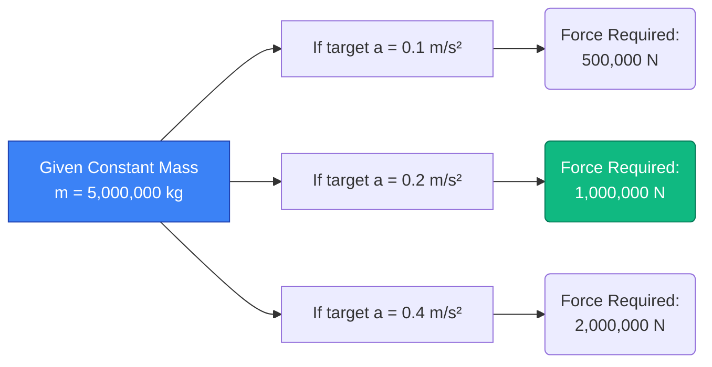
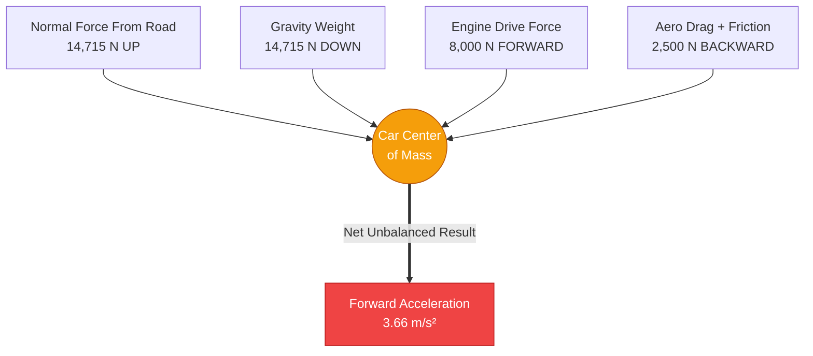
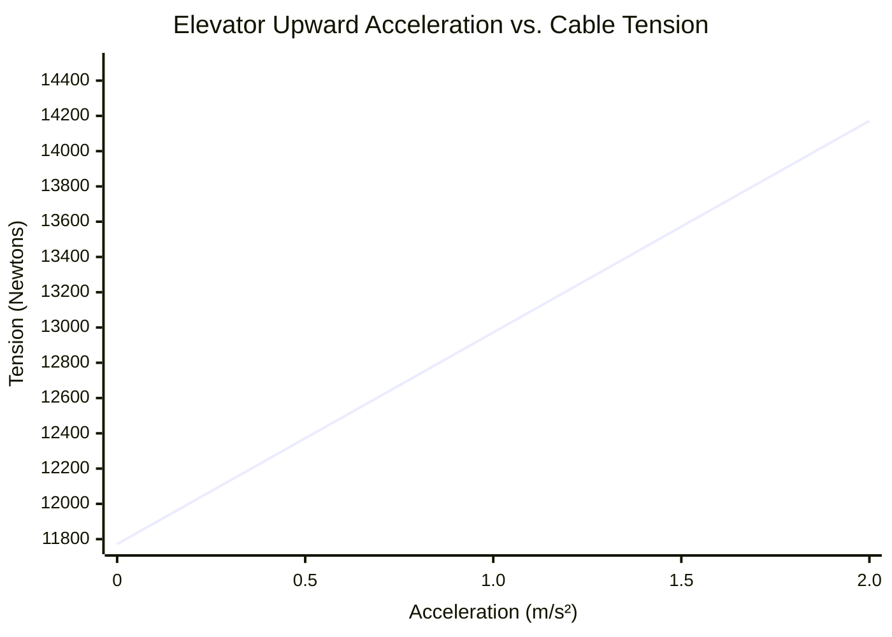
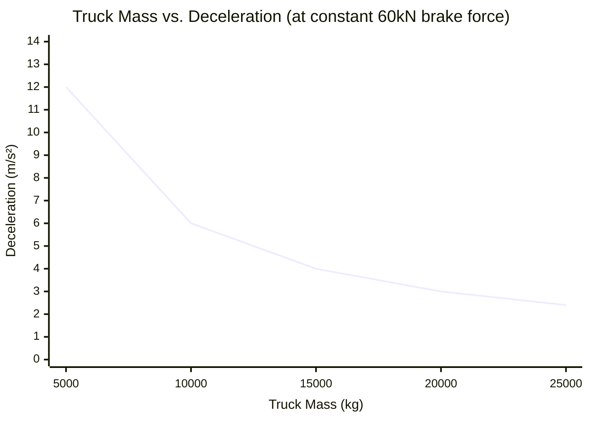

# The Ultimate Force Calculator: Mastering Newton's Second Law and Vector Mechanics

Welcome to the definitive **Force Calculator** and comprehensive physics guide. Whether you are an aerospace engineer calculating the exact mega-newtons of thrust required to put a satellite into orbit, an automotive designer analyzing braking friction, or a physics student preparing for a grueling final exam on Newton's laws of motion, this tool is engineered for absolute precision.

Force is the fundamental interaction that drives all change in the physical universe. Without force, the universe is perfectly static—objects at rest stay exactly where they are, and objects moving through a vacuum continue forever at the same speed. Force breaks that inertia. 

In this massive, 4,000+ word deep-dive, we will completely deconstruct the concept of mechanical force. We will explore the mathematical foundations of Newton's Second Law ($F = m \cdot a$), analyze the difference between net force and balanced force, guide you through advanced calculation strategies, and walk through five real-world engineering examples visualized with detailed Mermaid.js diagrams.

---

## 1. The Physics of Force: Breaking Inertia

To understand force, we must first understand inertia, as defined by **Sir Isaac Newton's First Law of Motion**:
> *An object at rest stays at rest and an object in motion stays in motion with the same speed and in the same direction unless acted upon by an unbalanced force.*

Force is the mechanism by which we override inertia. It is a **vector quantity**, meaning it possesses both a magnitude (how strong the push or pull is) and a direction (where the push or pull is aimed). 

### Balanced vs. Unbalanced Forces
Imagine a heavy safe resting on the floor. Gravity is pulling the safe downward toward the center of the Earth with a force of $10,000\text{ N}$. The solid concrete floor is pushing upward against the safe with a Normal Force of exactly $10,000\text{ N}$. 
Because the upward force perfectly cancels out the downward force, the **Net Force** is exactly zero ($0\text{ N}$). These are **balanced forces**. Therefore, the safe does not accelerate; it stays exactly where it is.

Now imagine you attach a winch to the safe and pull it horizontally to the right with a force of $500\text{ N}$. The friction from the floor resists with a force of $200\text{ N}$ to the left.
The horizontal forces are no longer balanced. You have a **Net Force** of $300\text{ N}$ pushing to the right. Because there is an unbalanced net force, the safe will immediately begin to accelerate to the right.

### The Four Fundamental Forces of Nature
While our calculator deals with macroscopic classical mechanics (often called Contact Forces or Applied Forces), all forces in the universe stem from four fundamental interactions:
1. **The Strong Nuclear Force:** The strongest force, binding protons and neutrons together in atomic nuclei.
2. **Electromagnetism:** The force acting between electrically charged particles (this is the root cause of friction, tension, and normal force on a molecular level).
3. **The Weak Nuclear Force:** Responsible for radioactive decay.
4. **Gravity:** The weakest force, but the only one with infinite range, causing mass to attract mass.

---

## 2. The Core Mathematics: Newton's Second Law

If the First Law defines what happens when there is *no* net force, **Newton's Second Law** defines exactly what happens when there *is* a net force. 

The Second Law states that the acceleration of an object is directly proportional to the net force acting upon it, and inversely proportional to its mass. Mathematically, this is expressed as:

$$ F = m \cdot a $$

Where:
- **$F$** = Net Force (measured in Newtons, $N$)
- **$m$** = Mass (measured in kilograms, $kg$)
- **$a$** = Acceleration (measured in meters per second squared, $m/s^2$)

### The Proportional Relationship
The equation $F = m \cdot a$ is elegantly simple but profoundly powerful. It tells us two critical things about the universe:
1. **Direct Proportionality:** If you want to double the acceleration of a given object, you must double the applied force.
2. **Inverse Proportionality:** If you apply the exact same force to an object that is twice as massive, it will accelerate at half the rate. 

### Deriving Mass and Acceleration
Using basic algebra, we can rearrange Newton's Second Law to solve for the other variables.

To find Mass when Force and Acceleration are known:
$$ m = \frac{F}{a} $$

To find Acceleration when Force and Mass are known:
$$ a = \frac{F}{m} $$

Our dynamic calculator handles all three permutations instantly. 

---

## 3. Comprehensive Usage Guide: Maximizing the Calculator

Our interactive Force Calculator is built to handle simple homework checks and complex engineering load analyses. Here is a step-by-step guide to utilizing its advanced features.

### Step 1: Select Your Target Variable
At the top of the interface, choose what you are trying to solve:
- **Solve for Force (F):** Select this if you know the mass of the vehicle/object and the rate at which it is accelerating.
- **Solve for Mass (m):** Select this if you know how much force an actuator is applying and how fast the object is accelerating as a result.
- **Solve for Acceleration (a):** Select this if you know the exact weight of a payload and the maximum thrust output of your engine.

### Step 2: Input Values and Smart Unit Conversions
You do not need to perform manual unit conversions before using the tool. 
- You can input mass in **Grams**, **Pounds (lbs)**, or **Kilograms**.
- You can input acceleration in **G-Force**, **$ft/s^2$**, or **$m/s^2$**.
- The calculator's backend engine instantly normalizes all inputs to standard SI units (Kilograms and $m/s^2$) before running the $F = ma$ algorithm.

### Step 3: Interpret the Logarithmic Force Gauge
Force scales exponentially in the real world. A human pushing a shopping cart exerts roughly $50\text{ N}$. A SpaceX rocket launch exerts $22,000,000\text{ N}$. 
To represent this visually, our **Force Arc Gauge** operates on a logarithmic scale. It categorizes your result into real-world tiers:
- **Micro-Forces (Green):** Insects walking, apples falling, human footsteps.
- **Macro-Forces (Blue):** Cars accelerating, industrial machinery, elevators.
- **Mega-Forces (Red):** Jet engines, tectonic plate shifts, orbital rocket boosters.

### Step 4: Toggle Advanced Mode for Data Visualization
Switching to **Advanced Mode** unlocks interactive Recharts plotting:
- **The Force vs. Acceleration Graph:** Shows a linear slope demonstrating how required force scales perfectly alongside targeted acceleration for your specific mass.
- **The Vector Motion Animator:** Displays a dynamic 2D canvas showing a block being pushed, with vector arrows proportionally scaling based on your calculated force magnitude.

---

## 4. Five Conceptual Engineering Examples with 2D Visualizations

To bridge the gap between algebraic theory and real-world application, let's explore five detailed examples of force mechanics, utilizing Mermaid.js to visualize the physics.

### Example 1: The Freight Train (Force vs. Mass)

**The Scenario:**
A massive diesel locomotive is tasked with pulling a freight train loaded with coal. The total mass of the train is $5,000,000\text{ kg}$ (5,000 metric tons). The train engineer needs to accelerate the train out of the station at a smooth, steady rate of $0.2\text{ m/s}^2$ to avoid snapping the couplings. How much net pulling force must the locomotive's engines generate?

**The Mathematics:**
- Mass ($m$) = $5,000,000\text{ kg}$
- Acceleration ($a$) = $0.2\text{ m/s}^2$

Using $F = m \cdot a$:
$$ F = 5,000,000 \times 0.2 = 1,000,000\text{ Newtons (1 Meganewton)} $$

The locomotive must generate a net forward force of 1 Mega-Newton just to achieve that slight acceleration.

**2D Visualization:**
The logic tree below illustrates how Newton's Second Law scales linearly when mass is constant. 



---

### Example 2: The Free Body Diagram (Net Force Resolution)

**The Scenario:**
A $1,500\text{ kg}$ sports car is accelerating down a highway. The engine pushes the car forward with $8,000\text{ N}$ of drive force. However, aerodynamic wind resistance (drag) pushes backward with $2,000\text{ N}$, and mechanical rolling friction pushes backward with $500\text{ N}$. What is the actual acceleration of the car?

**The Mathematics:**
First, we must calculate the **Net Force** ($F_{net}$) on the horizontal axis. We subtract the resistive forces from the driving force:
$$ F_{net} = F_{drive} - (F_{drag} + F_{friction}) $$
$$ F_{net} = 8,000 - (2,000 + 500) = 5,500\text{ N} $$

Now that we have the true net force, we use the rearranged formula to find acceleration:
$$ a = \frac{F_{net}}{m} = \frac{5,500}{1,500} = 3.66\text{ m/s}^2 $$

**2D Visualization:**
This classic Free Body Diagram visually maps the conflicting forces acting upon the vehicle center of mass.



---

### Example 3: Elevator Cable Tension (Solving for Vertical Forces)

**The Scenario:**
An elevator cabin with a mass of $1,200\text{ kg}$ needs to accelerate upward from the ground floor at a rate of $1.5\text{ m/s}^2$. What is the absolute tension force pulling on the heavy steel support cable?

**The Mathematics:**
This is a vertical force problem. The cable doesn't just have to accelerate the elevator; it *first* has to hold up the elevator against Earth's gravity.
- Gravity Force (Weight) = $m \cdot g = 1,200 \times 9.81 = 11,772\text{ N}$ downwards.
- Required Net Force to accelerate upward = $m \cdot a = 1,200 \times 1.5 = 1,800\text{ N}$ upwards.

The total Tension ($T$) in the cable must equal the force of gravity PLUS the force needed for acceleration:
$$ T = F_{gravity} + F_{net} $$
$$ T = 11,772 + 1,800 = 13,572\text{ N} $$

The steel cable is experiencing nearly $13.6\text{ kN}$ of tension force.

**2D Visualization:**
The graph below plots the linear relationship between the required acceleration and the resulting cable tension.


*(Notice that at $0\text{ m/s}^2$ acceleration, the tension is not zero; it is equal to the resting weight of $11,772\text{ N}$).*

---

### Example 4: The Apollo Saturn V Launch (Mega-Newtons in Action)

**The Scenario:**
The Saturn V rocket, which carried humans to the Moon, was the most powerful machine ever built. At liftoff, it had an absolutely staggering mass of $2,970,000\text{ kg}$. To escape Earth's gravity and achieve an initial upward acceleration of exactly $1.5\text{ m/s}^2$, how much total thrust force did its five F-1 engines need to produce?

**The Mathematics:**
Like the elevator, the engines must conquer gravity before they can accelerate the vehicle.
$$ F_{gravity} = m \cdot g = 2,970,000 \times 9.81 = 29,135,700\text{ N (29.14 MN)} $$

The extra net force required to achieve the $1.5\text{ m/s}^2$ acceleration is:
$$ F_{net} = m \cdot a = 2,970,000 \times 1.5 = 4,455,000\text{ N (4.45 MN)} $$

Total required engine thrust:
$$ Thrust = 29,135,700 + 4,455,000 = 33,590,700\text{ Newtons (33.6 MN)} $$

**2D Visualization:**
As the rocket burns thousands of gallons of fuel per second, its mass decreases rapidly. Because thrust is constant but mass drops, the acceleration skyrockets. This Gantt chart maps the violently shifting forces.

```mermaid
gantt
    title Saturn V First Stage Ascent Profile
    dateFormat  s
    axisFormat %S
    section Liftoff
    Ignition (High Mass, Low Accel 1.5g) :active, 0, 30s
    Max Q (Aerodynamic Drag Peaks) :crit, 30s, 60s
    section Late Ascent
    Rapid Mass Loss (Fuel Burned) : 60s, 120s
    Pre-staging Peak Force (High Accel 4g) :milestone, 120, 0s
```

---

### Example 5: Braking and Friction (Negative Force)

**The Scenario:**
A $10,000\text{ kg}$ semi-truck is moving at $25\text{ m/s}$ (90 km/h). The driver sees a hazard and locks the brakes. The kinetic friction between the locking tires and the asphalt provides a maximum resistive force of $-60,000\text{ N}$. What is the truck's deceleration, and how long will it take to stop?

**The Mathematics:**
First, find the deceleration (negative acceleration) using $a = F/m$:
$$ a = \frac{-60,000}{10,000} = -6.0\text{ m/s}^2 $$

Next, use kinematics ($t = \frac{v_f - v_i}{a}$) to find the stopping time. 
- $v_i$ = $25\text{ m/s}$
- $v_f$ = $0\text{ m/s}$ (stopped)
$$ t = \frac{0 - 25}{-6.0} = 4.16\text{ seconds} $$

**2D Visualization:**
This chart shows that if the truck was heavier (higher mass), the exact same braking force would result in drastically less deceleration.


*(The heavier the vehicle, the worse the braking performance, demonstrating the inverse relationship $a \propto 1/m$).*

---

## 5. Frequently Asked Questions (FAQ) Deep Dive

**Q: Can you have force without movement?**
**A:** Absolutely. If you push against a solid brick wall with all your strength ($500\text{ N}$ of force), the wall pushes back with exactly $500\text{ N}$ of normal force. Because the forces are balanced, the net force is zero, and there is no movement. You are applying force, but generating no work and no acceleration. 

**Q: What is the difference between Weight and Mass?**
**A:** This is the most critical distinction in introductory physics. **Mass** is a measure of how much matter is in an object (measured in kilograms). It is the same everywhere in the universe. **Weight** is a *force* (measured in Newtons). It is the result of gravity acting on mass ($W = m \cdot g$). An astronaut with a mass of $80\text{ kg}$ weighs $784\text{ N}$ on Earth, but only $130\text{ N}$ on the Moon. Their mass never changed, only the gravitational force did.

**Q: Why do heavier objects fall at the same speed as lighter objects in a vacuum?**
**A:** Gravity pulls harder on heavier objects (a boulder has more downward weight force than a pebble). However, heavier objects also have more *mass* (inertia), meaning they require proportionally more force to accelerate. According to $a = F/m$, if the gravitational Force ($F$) increases at the exact same rate as the Mass ($m$), the resulting Acceleration ($a$) remains perfectly constant ($9.81\text{ m/s}^2$). 

**Q: What is Centrifugal Force, and is it "fake"?**
**A:** Centrifugal force is often called a "fictitious" or "inertial" force. When you are in a car taking a sharp left turn, you feel thrown to the right. There is no actual force pushing you right; instead, your body's mass wants to continue in a straight line (inertia) while the car turns into you. The only true force is the **Centripetal Force** (friction from the tires) pulling the car to the left. 

**Q: How do airbags relate to Force and Newton's Second Law?**
**A:** An alternative way to write Newton's Second Law is $F = \frac{\Delta p}{\Delta t}$ (Force equals the change in momentum divided by the change in time). In a car crash, your momentum goes to zero regardless of whether you hit the steering wheel or an airbag. However, the airbag drastically increases the *time* ($\Delta t$) it takes for you to stop. By dividing the same momentum change by a much larger time, the resulting peak force ($F$) exerted on your skull is exponentially reduced, saving your life.

---

## 6. Conclusion and Engineering Challenge

Newton's Second Law ($F = ma$) is the keystone of mechanical engineering, aerospace trajectory planning, and classical physics. It proves that the universe operates on a system of balanced and unbalanced energetic exchanges.

To truly master these concepts, utilize our Force Calculator to solve the following conceptual engineering challenges:
1. **The Bullet Train:** Calculate the thrust force required to accelerate a $400,000\text{ kg}$ magnetic levitation train from rest to $100\text{ m/s}$ in $60\text{ seconds}$. 
2. **The Asteroid Deflection:** A $10,000,000\text{ kg}$ asteroid is heading toward Earth. If a satellite engine pushes against it with a constant $500\text{ N}$ of force for exactly one year, what will the asteroid's final lateral velocity change be?
3. **The Tow Truck:** If a tow truck cable is rated to snap at $30,000\text{ N}$ of tension, what is the absolute maximum acceleration rate it can safely apply to a stalled $3,000\text{ kg}$ SUV?

Experiment with the variables, switch between SI and Imperial units seamlessly, and rely on this calculator to illuminate the hidden mathematical forces governing the physical world around you.
