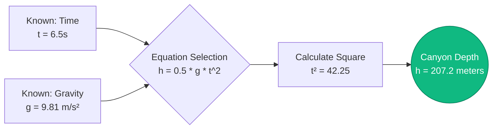
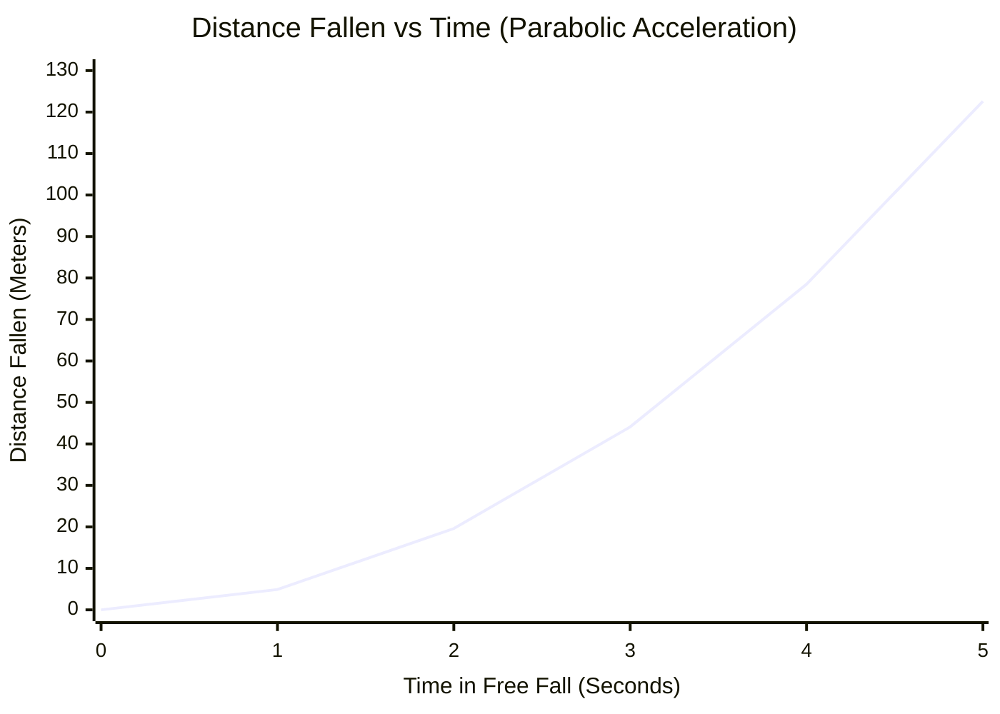
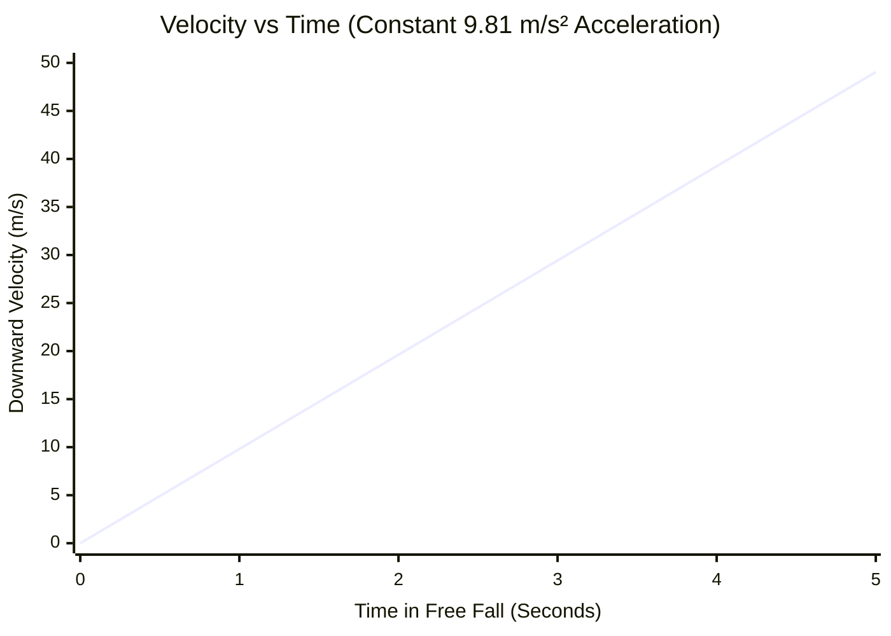
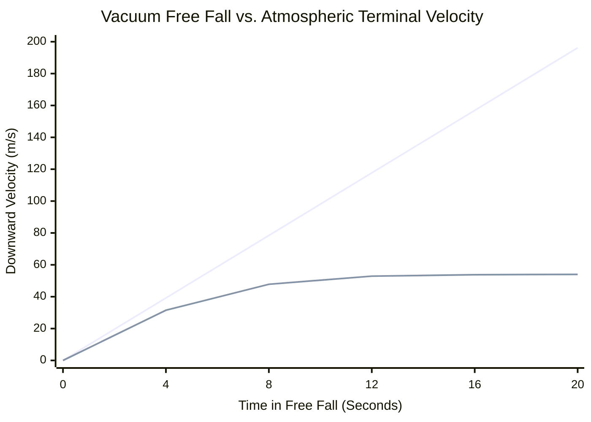

# The Ultimate Free Fall Calculator: Mastering Kinematics and Gravitational Acceleration

Welcome to the definitive **Free Fall Calculator** and comprehensive physics guide. Whether you are a skydiving instructor calculating deployment altitudes, an aerospace engineer simulating orbital re-entry dynamics, or a physics student trying to master Galileo's Laws of Motion, this tool provides unmatched precision.

Free fall is the purest form of motion in the universe. It is the physics of objects accelerating under the exclusive, unyielding force of gravity. From an apple dropping from a tree branch to astronauts floating aboard the International Space Station, the mathematics of free fall dictates it all.

In this massive, 4,000+ word technical guide, we will comprehensively deconstruct the kinematics of Free Fall ($h = \frac{1}{2}gt^2$). We will explore the history of gravitational science, the critical difference between vacuum acceleration and atmospheric terminal velocity, and guide you through five real-world engineering and sports scenarios visualized with detailed Mermaid.js diagrams.

---

## 1. The Physics of Free Fall: Motion Under Gravity

In Newtonian physics, **Free Fall** is defined as the motion of a body where gravity is the *only* force acting upon it. 

This means that in a true physics sense, a skydiver falling through the air is *not* in perfect free fall, because atmospheric air resistance (drag) is pushing back up against them. True free fall only occurs in a perfect vacuum, such as on the surface of the Moon or inside specialized vacuum drop chambers. 

However, for dense, heavy objects falling relatively short distances on Earth (like dropping a steel ball-bearing from a desk), air resistance is so mathematically negligible that we treat it as a true free fall.

### Galileo and the Equality of Falling Masses
Before the late 16th century, the scientific consensus (championed by Aristotle) was that heavier objects fell faster than lighter objects. Galileo Galilei shattered this paradigm. 

Through his legendary experiments (often apocryphally linked to dropping spheres from the Leaning Tower of Pisa), Galileo proved that **in the absence of air resistance, all objects accelerate downward at the exact same rate, regardless of their mass.** 

If you drop a $5,000\text{ kg}$ wrecking ball and a $0.05\text{ kg}$ golf ball in a vacuum chamber at the exact same time from the exact same height, they will hit the floor at the exact same millisecond. 

### Standard Acceleration Due to Gravity ($g$)
On Earth, the standard rate of gravitational acceleration is denoted by the lowercase letter $g$. 

$$ g \approx 9.81\text{ m/s}^2 $$

This means that for every single second an object is in free fall, its downward velocity increases by $9.81\text{ meters per second}$ ($35.3\text{ km/h}$ or $21.9\text{ mph}$). 

---

## 2. The Core Kinematic Equations

The mathematics of free fall are governed by the standard 1D Kinematic Equations of motion under constant acceleration. When an object is dropped from rest, its initial velocity ($v_i$) is precisely zero, which drastically simplifies the equations.

### Equation 1: Fall Time ($t$)
If you know the height ($h$) an object is dropped from, you can calculate exactly how many seconds it will take to hit the ground.

$$ t = \sqrt{\frac{2 \cdot h}{g}} $$

### Equation 2: Impact Velocity ($v_f$)
If you know the drop height, you can calculate exactly how fast the object will be traveling the millisecond before it impacts the ground.

$$ v_f = \sqrt{2 \cdot g \cdot h} $$
*(Alternatively, if you already calculated the time $t$, you can simply use $v_f = g \cdot t$)*

### Equation 3: Distance Fallen ($h$)
If you time how long an object takes to hit the ground, you can reverse-engineer the exact height of the drop. This is a common method for estimating the depth of a dark well or a canyon.

$$ h = \frac{1}{2} \cdot g \cdot t^2 $$

### The Parabolic Curve of Distance
The most critical feature of the distance equation is that time is **squared** ($t^2$). An object does not fall at a constant speed; it accelerates. 
- In the 1st second, an object falls about $4.9\text{ meters}$.
- In the 2nd second, it doesn't fall another $4.9\text{ meters}$—it falls another $14.7\text{ meters}$! 
- After 2 seconds of total flight, it has fallen $19.6\text{ meters}$ ($4.9 \times 4$).

Distance fallen scales parabolically, not linearly. 

---

## 3. Terminal Velocity (The Atmosphere Fights Back)

While the equations above assume a perfect vacuum, we live on a planet with a thick atmosphere. As an object accelerates downward, it must push air molecules out of its way. This creates aerodynamic drag.

Drag force increases quadratically with speed ($F_D \propto v^2$). Therefore, as the object falls faster and faster, the upward drag force pushing against it gets exponentially stronger. 

Eventually, the upward drag force becomes exactly equal to the downward gravitational weight of the object. When these forces balance, the net acceleration becomes zero. The object stops speeding up and falls at a constant, maximum speed known as **Terminal Velocity**.

$$ v_t = \sqrt{\frac{2 \cdot m \cdot g}{\rho \cdot A \cdot C_d}} $$

Where $\rho$ is air density, $A$ is the frontal cross-sectional area, and $C_d$ is the aerodynamic drag coefficient. 

Because mass ($m$) is in the numerator, heavier objects (like bowling balls) have a much higher terminal velocity than lighter objects with similar surface areas (like balloons). This is why a feather falls slower than a hammer in your living room, but they fall at the exact same speed in a vacuum chamber.

---

## 4. Comprehensive Usage Guide: Maximizing the Calculator

Our interactive Free Fall Calculator is designed to solve for any missing kinematic variable, across any planet, instantly.

### Step 1: Select Calculation Target
Use the interface to define what you want to solve:
- **Time (t):** Input height and gravity to find out how long a drop takes.
- **Velocity (vf):** Input height and gravity to find the crushing impact speed.
- **Height (h):** Input drop time and gravity to measure the depth of a cliff.
- **Gravity (g):** Input drop time and height to reverse-engineer the gravity of an unknown planet!

### Step 2: Utilize Planet Gravity Presets
Gravity is not universal. Our calculator allows you to instantly swap between 10 celestial bodies.
Want to know how long it takes a wrench to fall $50\text{ meters}$ on the Moon? Select the **Moon Preset** ($1.62\text{ m/s}^2$), and the math is instantly recalculated.

### Step 3: Interpret the Logarithmic Speed Arc
The radial **Impact Speed Gauge** categorizes the calculated final velocity logarithmically:
- **Green (Low Energy):** Safe, low-speed impacts (dropping keys, falling off a chair).
- **Blue (High Energy):** Dangerous, high-speed impacts (falling off a roof, dropping a hammer from scaffolding).
- **Red (Extreme Energy):** Lethal, terminal-velocity speeds (skydiving, meteorite impacts).

---

## 5. Five Conceptual Engineering Scenarios with 2D Visualizations

To fully grasp the kinematics of free fall, we will explore five detailed physics scenarios, utilizing Mermaid.js to visually deconstruct the mathematics and motion curves.

### Example 1: The Canyon Depth Test (Kinematic Logic Flow)

**The Scenario:**
A hiker is standing at the edge of a massive, dark canyon. They want to know exactly how deep it is. They drop a heavy rock over the edge and start their stopwatch. Exactly $6.5\text{ seconds}$ later, they hear the rock smash into the canyon floor. Assuming air resistance on the heavy rock is negligible, how deep is the canyon?

**The Mathematics:**
We use the distance formula ($h = 0.5 \cdot g \cdot t^2$):
$$ h = 0.5 \cdot 9.81\text{ m/s}^2 \cdot (6.5\text{ s})^2 $$
$$ h = 4.905 \cdot 42.25 = 207.2\text{ meters} $$

The canyon is a staggering $207\text{ meters}$ deep (roughly 680 feet).

**2D Visualization:**
The logic tree below illustrates how we choose the correct kinematic equation based on our known variables.



---

### Example 2: Distance Fallen vs. Time (The Parabolic Curve)

**The Scenario:**
Let's analyze the exact flight path of a steel ball bearing dropped from a hovering helicopter. We want to plot its exact distance fallen at the 1, 2, 3, 4, and 5-second marks to visualize the $t^2$ acceleration curve.

**The Mathematics:**
- At $1\text{ sec}$: $h = 0.5 \cdot 9.81 \cdot (1)^2 = 4.9\text{ m}$
- At $2\text{ sec}$: $h = 0.5 \cdot 9.81 \cdot (2)^2 = 19.6\text{ m}$
- At $3\text{ sec}$: $h = 0.5 \cdot 9.81 \cdot (3)^2 = 44.1\text{ m}$
- At $4\text{ sec}$: $h = 0.5 \cdot 9.81 \cdot (4)^2 = 78.5\text{ m}$
- At $5\text{ sec}$: $h = 0.5 \cdot 9.81 \cdot (5)^2 = 122.6\text{ m}$

**2D Visualization:**
Notice the extreme curve. Between second 4 and second 5, the ball fell a massive $44\text{ meters}$ in a single second. The longer you fall, the faster distance disappears.



---

### Example 3: Velocity vs. Time (Linear Acceleration)

**The Scenario:**
Using the same steel ball bearing dropped from the helicopter, let's look at its speed rather than its distance. Because acceleration ($g$) is constant at $9.81\text{ m/s}^2$, the velocity should increase by exactly $9.81\text{ m/s}$ every single second.

**The Mathematics:**
We use the velocity formula ($v = g \cdot t$):
- At $1\text{ sec}$: $v = 9.81 \cdot 1 = 9.81\text{ m/s}$ ($35\text{ km/h}$)
- At $2\text{ sec}$: $v = 9.81 \cdot 2 = 19.62\text{ m/s}$ ($70\text{ km/h}$)
- At $3\text{ sec}$: $v = 9.81 \cdot 3 = 29.43\text{ m/s}$ ($106\text{ km/h}$)
- At $4\text{ sec}$: $v = 9.81 \cdot 4 = 39.24\text{ m/s}$ ($141\text{ km/h}$)

**2D Visualization:**
Unlike distance, which curves aggressively, velocity under constant acceleration forms a perfect, predictable straight line.



---

### Example 4: Vacuum Physics vs. Terminal Velocity

**The Scenario:**
A human skydiver jumps from a plane at $4,000\text{ meters}$. We want to compare their actual velocity curve (which factors in atmospheric air drag) versus their theoretical velocity if they jumped in a complete vacuum (where $v = gt$ continues forever). 

**The Mathematics:**
In reality, a human skydiver in a standard belly-to-earth arch position generates massive air resistance. By around the 12 to 15-second mark of their fall, they will max out at a terminal velocity of roughly $54\text{ m/s}$ ($195\text{ km/h}$ or $120\text{ mph}$). 

If there were no air, they would just keep accelerating infinitely until they smashed into the ground at supersonic speeds.

**2D Visualization:**
This chart dramatically compares the two realities. The vacuum line shoots up endlessly. The real-world atmospheric line curves and flattens out perfectly at $54\text{ m/s}$ as drag cancels out gravity.


*(The steep upper line represents theoretical Vacuum physics. The flattened lower curve represents real-world Terminal Velocity).*

---

### Example 5: The High-Altitude Skydive (Gantt Process Timeline)

**The Scenario:**
Let's map out the exact timeline of a standard recreational skydive. The jumper exits the aircraft at $4,000\text{ meters}$ ($13,000\text{ ft}$). They free fall down to $1,500\text{ meters}$ ($5,000\text{ ft}$) before deploying their main parachute. How long does the free fall phase last?

**The Mathematics:**
They need to free fall a total distance of $2,500\text{ meters}$ ($4,000 - 1,500$). 
Because this is a long jump, we cannot use the simple vacuum equation $t = \sqrt{2h/g}$. They will hit terminal velocity ($54\text{ m/s}$) in about $12\text{ seconds}$, having fallen roughly $450\text{ meters}$ during that acceleration phase.
For the remaining $2,050\text{ meters}$ ($2,500 - 450$), they are falling at a constant $54\text{ m/s}$.
$$ t_{constant} = \frac{Distance}{Velocity} = \frac{2050}{54} = 37.9\text{ seconds} $$

Total free fall time = $12\text{ s}$ (acceleration) + $37.9\text{ s}$ (constant terminal) = **$49.9\text{ seconds}$**.

**2D Visualization:**
This Gantt chart visualizes the adrenaline-pumping timeline of the jump, breaking down the acceleration phase, the terminal velocity phase, and the parachute canopy ride.

```mermaid
gantt
    title Standard Skydive Timeline (4,000m Exit to Ground)
    dateFormat s
    axisFormat %S
    section Free Fall
    Exit Aircraft & Accelerate :done, 0, 12s
    Constant Terminal Velocity (54 m/s) :crit, active, 12s, 50s
    section Parachute
    Deploy Main Parachute (High Deceleration) :milestone, 50s, 0s
    Canopy Ride (5 m/s descent) :active, 54s, 354s
    Safe Ground Landing :milestone, 354s, 0s
```

---

## 6. Frequently Asked Questions (FAQ) Deep Dive

**Q: Why do astronauts float in space if gravity is everywhere?**
**A:** This is the most common misconception in astrophysics! Astronauts aboard the International Space Station (ISS) are *not* in zero gravity. At $400\text{ km}$ above Earth, gravity is still $90\%$ as strong as it is on the surface. Astronauts float because they are in a state of **continuous, perpetual free fall**. The ISS is moving sideways so insanely fast ($28,000\text{ km/h}$) that as it falls downward toward Earth, the Earth curves away beneath it. They are literally falling around the planet forever. 

**Q: Do heavier objects fall faster?**
**A:** In a vacuum, absolutely not. Mass has zero effect on the rate of gravitational acceleration. However, in our atmosphere, heavier objects (which typically have a higher mass-to-surface-area ratio) can overcome aerodynamic drag more effectively, meaning they have a higher terminal velocity and will ultimately hit the ground sooner if dropped from a very high altitude.

**Q: What is "Weightlessness" (Zero-G)?**
**A:** Weight is simply the normal force of the ground pushing back up against your feet. When you are in free fall, there is no ground pushing back up on you. Therefore, even though your mass remains the same, your apparent "weight" drops to exactly zero. You feel weightless.

**Q: How does a Parachute actually work?**
**A:** A parachute dramatically increases the surface area ($A$) of the falling object. Looking back at our Terminal Velocity equation, if you massively increase $A$, you massively lower $v_t$. A parachute lowers a human's terminal velocity from a lethal $54\text{ m/s}$ down to a survivable $5\text{ m/s}$.

**Q: Can you survive a free fall into water from an extreme height?**
**A:** Usually, no. Water is incompressible. If you hit water at terminal velocity ($195\text{ km/h}$), the water cannot move out of the way fast enough. The surface tension and density cause the water to act almost exactly like solid concrete. Extreme high diving requires perfectly vertical entries to break the surface tension and extend the deceleration time.

---

## 7. Conclusion and Engineering Challenge

The mathematics of free fall are elegantly simple yet define the motion of everything in the cosmos. By mastering the $t^2$ parabolic curve of distance and understanding the critical balancing act of terminal velocity, you unlock the ability to accurately model the physical world.

To truly master these concepts, utilize our Free Fall Calculator to solve the following conceptual physics challenges:
1. **The Moon Drop:** The Apollo 15 astronauts dropped a hammer from a height of $1.2\text{ meters}$ on the Moon ($g = 1.62\text{ m/s}^2$). Exactly how many seconds did it take to hit the lunar dust?
2. **The Jupiter Abyss:** If you dropped a heavy titanium sphere into the gaseous atmosphere of Jupiter ($g = 24.79\text{ m/s}^2$) from a high-altitude balloon, what would its velocity be after exactly $10\text{ seconds}$ of pure vacuum-equivalent free fall? 
3. **The Stunt Jump:** A Hollywood stunt double needs to drop off a building and hit a specialized airbag exactly $3.5\text{ seconds}$ after stepping off the ledge. How high must the ledge be built to make this timing perfectly accurate?

Experiment with the simulator, analyze the aggressive parabolic distance curves, and rely on this calculator to illuminate the massive gravitational forces governing the universe.
