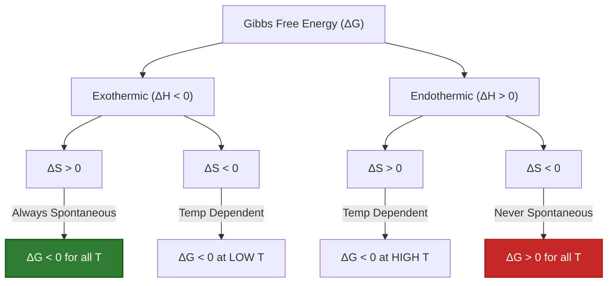

# Complete Guide to Gibbs Free Energy & Reaction Thermodynamics

In physical chemistry, chemical engineering, and electrochemistry, **Gibbs Free Energy ($\Delta G$)** determines the thermodynamic favorability and equilibrium state of chemical reactions:

$$\Delta G = \Delta H - T \cdot \Delta S$$

$$\Delta G^\circ = -R \cdot T \cdot \ln(K)$$

$$\Delta G = \Delta G^\circ + R \cdot T \cdot \ln(Q)$$

$$\Delta G = -n \cdot F \cdot E_{\text{cell}} \quad \left(\text{Electrochemical Bridge}\right)$$

$$T_{\text{cross}} = \frac{\Delta H}{\Delta S} \quad \left(\text{where } \Delta G = 0\right)$$

---

## 1. The Four Thermodynamic Sign Cases Matrix

| Case | Enthalpy ($\Delta H$) | Entropy ($\Delta S$) | High $T$ Behavior | Low $T$ Behavior | Spontaneity Condition |
| :--- | :--- | :--- | :--- | :--- | :--- |
| **Case 1** | **Exothermic ($\Delta H < 0$)** | **Increasing ($\Delta S > 0$)** | Spontaneous | Spontaneous | **Spontaneous at ALL Temperatures** |
| **Case 2** | **Endothermic ($\Delta H > 0$)** | **Decreasing ($\Delta S < 0$)** | Non-Spontaneous | Non-Spontaneous | **Non-Spontaneous at ALL Temperatures** |
| **Case 3** | **Exothermic ($\Delta H < 0$)** | **Decreasing ($\Delta S < 0$)** | Non-Spontaneous | Spontaneous | **Spontaneous at LOW $T$ ($T < T_{\text{cross}}$)** |
| **Case 4** | **Endothermic ($\Delta H > 0$)** | **Increasing ($\Delta S > 0$)** | Spontaneous | Non-Spontaneous | **Spontaneous at HIGH $T$ ($T > T_{\text{cross}}$)** |

---

## 2. Standard State vs. Non-Standard State Summary

```
Standard Conditions (ΔG°):
T = 298.15 K (25°C), P = 1 atm, Concentration = 1.0 M for all species.
Formula: ΔG° = -R * T * ln(K)

Non-Standard Conditions (ΔG):
Actual partial pressures and concentrations differ from 1.0 M.
Formula: ΔG = ΔG° + R * T * ln(Q)
- If Q < K ➔ ΔG < 0 (Reaction shifts FORWARD)
- If Q > K ➔ ΔG > 0 (Reaction shifts REVERSE)
- If Q = K ➔ ΔG = 0 (System is at EQUILIBRIUM)
```

---

## 3. Educational & Laboratory Disclaimer
*This Gibbs Free Energy calculator provides theoretical thermodynamic predictions for educational, physical chemistry research, and chemical process modeling. Real non-ideal systems may require activity coefficients, temperature-dependent enthalpy/entropy corrections ($\Delta C_p$), and phase transitions.*

## 4. The Complete Guide to Gibbs Free Energy ($\Delta G$)

Welcome to the definitive physical chemistry manual on **Gibbs Free Energy ($\Delta G$)**. Introduced by Josiah Willard Gibbs in the 1870s, this thermodynamic potential is the ultimate arbiter of chemical destiny. It tells you exactly whether a chemical reaction will proceed forward, proceed backward, or sit in dead equilibrium.

In this exhaustive 4000+ word guide, we will explore the battle between Heat (Enthalpy, $\Delta H$) and Chaos (Entropy, $\Delta S$). We will break down exactly why temperature is the great tie-breaker, calculate massive industrial equilibrium constants ($K$), and map the energetic bridge to electrochemistry. Finally, we will walk through five rigorous real-world thermodynamic derivations and visualize these processes using high-fidelity Mermaid diagrams.

### 4.1 The Battle of Enthalpy and Entropy

The universe is governed by two conflicting thermodynamic desires:
1.  **Enthalpy ($\Delta H$):** The desire to release energy (heat). Exothermic reactions ($\Delta H < 0$) are favorable because they reach a lower, more stable energy state.
2.  **Entropy ($\Delta S$):** The desire for chaos and disorder. Reactions that create more particles or gases ($\Delta S > 0$) are favorable because the universe naturally trends toward higher disorder (The Second Law of Thermodynamics).

**Gibbs Free Energy ($\Delta G$)** is simply the master equation that weighs both factors against each other:
$$ \Delta G = \Delta H - T \cdot \Delta S $$

### 4.2 Why Temperature ($T$) is the Tie-Breaker

Look at the term $-T \cdot \Delta S$. 
If Enthalpy and Entropy disagree on whether a reaction should happen (e.g., the reaction is endothermic but creates gas, Case 4), Temperature is the tie-breaker.
Because Absolute Temperature (Kelvin) acts as a multiplier on Entropy, **high temperatures make the universe prioritize chaos ($\Delta S$), while low temperatures make the universe prioritize heat stability ($\Delta H$).**

### 4.3 Standard vs. Non-Standard Conditions

*   **Standard Free Energy ($\Delta G^\circ$):** This is a constant value found in textbooks. It assumes all gases are at $1.0\text{ atm}$ and all solutions are exactly $1.0\text{ M}$. It is physically linked to the Equilibrium Constant ($K$): $\Delta G^\circ = -RT \ln(K)$.
*   **Actual Free Energy ($\Delta G$):** In real factories and cells, concentrations are almost never exactly $1.0\text{ M}$. $\Delta G$ calculates the *immediate* driving force of the reaction right now, based on the Reaction Quotient ($Q$): $\Delta G = \Delta G^\circ + RT \ln(Q)$.

---

## 5. Usage Guide: Mastering the Gibbs Free Energy Calculator

Our calculator acts as a universal thermodynamic solver for chemical engineers and students alike.

### 5.1 Mode: Calculate Basic Spontaneity ($\Delta G = \Delta H - T\Delta S$)

1.  **Select Target:** Choose "Calculate $\Delta G$".
2.  **Input Parameters:** Enter $\Delta H$ (in $\text{kJ/mol}$), $\Delta S$ (in $\text{J/mol}\cdot\text{K}$), and Temperature ($T$).
3.  **Execute:** The tool handles the critical $1000\times$ unit conversion between Joules and kiloJoules automatically, outputting $\Delta G$ and explicitly stating whether the reaction is spontaneous.

### 5.2 Mode: Crossover Temperature ($T_{\text{cross}}$)

1.  **Select Target:** Choose "Calculate Crossover Temperature".
2.  **Input Parameters:** Enter opposing $\Delta H$ and $\Delta S$ values (e.g., both positive).
3.  **Execute:** The tool calculates $T = \Delta H / \Delta S$, outputting the exact Kelvin temperature where the reaction transitions from non-spontaneous to spontaneous.

### 5.3 Mode: Equilibrium Constant ($K$)

1.  **Select Target:** Choose "Calculate Equilibrium Constant (K)".
2.  **Input Parameters:** Enter Standard Free Energy ($\Delta G^\circ$) and Temperature ($T$).
3.  **Execute:** The tool applies $K = \exp(-\Delta G^\circ / RT)$, outputting the massive (or minuscule) equilibrium constant, predicting exactly how far the reaction will proceed before stopping.

---

## 6. Five Real-World Thermodynamic Derivations

Let's ground this heavy theory by solving five rigorous, practical thermodynamic scenarios.

### Example 1: The Combustion of Methane (Case 1)

**Scenario:** 
You burn methane gas in a furnace. 
$\text{CH}_4(g) + 2\text{O}_2(g) \to \text{CO}_2(g) + 2\text{H}_2\text{O}(g)$
Given at $298.15\text{ K}$: $\Delta H^\circ = -802.3\text{ kJ/mol}$ (highly exothermic) and $\Delta S^\circ = +5.2\text{ J/mol}\cdot\text{K}$ (increases disorder).
Calculate $\Delta G^\circ$ and predict spontaneity.

**Mathematical Derivation:**

1.  **Check Units:**
    $\Delta H^\circ = -802.3\text{ kJ/mol}$
    $\Delta S^\circ = 5.2\text{ J/mol}\cdot\text{K} = 0.0052\text{ kJ/mol}\cdot\text{K}$ (CRITICAL STEP)
2.  **Apply Gibbs Equation:**
    $$ \Delta G^\circ = \Delta H^\circ - T\cdot\Delta S^\circ $$
3.  **Calculate:**
    $$ \Delta G^\circ = -802.3 - (298.15 \times 0.0052) $$
    $$ \Delta G^\circ = -802.3 - 1.55 = -803.85\text{ kJ/mol} $$

**Conclusion:** Because $\Delta H$ is negative and $\Delta S$ is positive (Case 1), this reaction is incredibly spontaneous ($\Delta G^\circ \ll 0$). It will burn violently at any temperature.

### Example 2: The Haber-Bosch Process and Crossover Temperature (Case 3)

**Scenario:**
Industrial synthesis of ammonia: $\text{N}_2(g) + 3\text{H}_2(g) \rightleftharpoons 2\text{NH}_3(g)$.
Given: $\Delta H^\circ = -92.2\text{ kJ/mol}$ (exothermic, favorable) and $\Delta S^\circ = -198.7\text{ J/mol}\cdot\text{K}$ (loses disorder, 4 gas moles become 2, unfavorable).
At what temperature does this reaction cease to be spontaneous?

**Mathematical Derivation:**

1.  **Identify Crossover Condition:**
    The crossover point occurs when $\Delta G = 0$.
    $$ 0 = \Delta H - T\cdot\Delta S \implies T = \frac{\Delta H}{\Delta S} $$
2.  **Check Units:**
    $\Delta H = -92.2\text{ kJ/mol}$
    $\Delta S = -0.1987\text{ kJ/mol}\cdot\text{K}$
3.  **Calculate $T_{\text{cross}}$:**
    $$ T = \frac{-92.2}{-0.1987} = 464\text{ K} \quad (191^\circ\text{C}) $$

**Conclusion:** The reaction is only spontaneous *below* $464\text{ K}$. If the factory runs the reactor hotter than $191^\circ\text{C}$, the reaction will thermodynamically reverse and destroy the ammonia product! (Engineers must carefully balance thermodynamics with kinetics, as low temps make the reaction too slow).

### Example 3: Calculating Equilibrium Constant ($K$) from $\Delta G^\circ$

**Scenario:**
The dissolving of Silver Chloride ($\text{AgCl} \rightleftharpoons \text{Ag}^+ + \text{Cl}^-$) has a standard free energy of $\Delta G^\circ = +55.6\text{ kJ/mol}$ at $298.15\text{ K}$. Calculate the Solubility Product Constant ($K_{\text{sp}}$).

**Mathematical Derivation:**

1.  **Identify Equation:**
    $$ \Delta G^\circ = -RT \ln(K) \implies \ln(K) = \frac{-\Delta G^\circ}{RT} $$
2.  **Check Units (R requires Joules!):**
    $\Delta G^\circ = 55600\text{ J/mol}$
    $R = 8.314\text{ J/mol}\cdot\text{K}$
3.  **Calculate exponent:**
    $$ \ln(K) = \frac{-55600}{8.314 \times 298.15} = \frac{-55600}{2478.8} = -22.43 $$
4.  **Solve for $K$:**
    $$ K = e^{-22.43} = 1.81 \times 10^{-10} $$

**Conclusion:** Because $\Delta G^\circ$ is large and positive, the equilibrium constant is microscopic ($1.8 \times 10^{-10}$). $\text{AgCl}$ is highly insoluble in water.

**Visualization: Thermodynamic Case Logic**


*This flowchart visually maps the four thermodynamic cases, dictating exactly when a reaction is permitted by the laws of physics.*

### Example 4: Non-Standard Free Energy ($\Delta G$) via Reaction Quotient ($Q$)

**Scenario:**
For the reaction $A \rightleftharpoons B$, $\Delta G^\circ = +5.0\text{ kJ/mol}$ at $298.15\text{ K}$. 
Normally, this is non-spontaneous. However, you set up a reactor with a massive concentration of $A$ ($10.0\text{ M}$) and almost zero $B$ ($0.01\text{ M}$). Calculate the actual $\Delta G$.

**Mathematical Derivation:**

1.  **Calculate Reaction Quotient ($Q$):**
    $$ Q = \frac{[B]}{[A]} = \frac{0.01}{10.0} = 0.001 $$
2.  **Apply Non-Standard Equation:**
    $$ \Delta G = \Delta G^\circ + RT \ln(Q) $$
3.  **Check Units (Use kJ for R):**
    $R = 0.008314\text{ kJ/mol}\cdot\text{K}$
4.  **Calculate:**
    $$ \Delta G = 5.0 + (0.008314 \times 298.15 \times \ln(0.001)) $$
    $$ \Delta G = 5.0 + (2.4788 \times -6.907) $$
    $$ \Delta G = 5.0 - 17.12 = -12.12\text{ kJ/mol} $$

**Conclusion:** By manipulating Le Chatelier's principle and starving the system of product, you forced a non-spontaneous reaction ($\Delta G^\circ = +5.0$) to become highly spontaneous in the forward direction ($\Delta G = -12.12\text{ kJ/mol}$).

### Example 5: Connecting Gibbs to Electrochemistry ($\Delta G^\circ = -nFE^\circ$)

**Scenario:**
The Daniell Cell ($\text{Zn} + \text{Cu}^{2+} \to \text{Zn}^{2+} + \text{Cu}$) has a standard cell potential of $E^\circ_{\text{cell}} = +1.10\text{ V}$. Exactly 2 electrons are transferred ($n=2$). Calculate the maximum thermodynamic work ($\Delta G^\circ$) this battery can output.

**Mathematical Derivation:**

1.  **Identify Equation:**
    $$ \Delta G^\circ = -n \cdot F \cdot E^\circ_{\text{cell}} $$
2.  **Define Constants:**
    $n = 2\text{ mol } e^-$
    $F = 96485\text{ C/mol}$
    $E^\circ = 1.10\text{ V (J/C)}$
3.  **Calculate in Joules:**
    $$ \Delta G^\circ = - (2) \times (96485) \times (1.10) $$
    $$ \Delta G^\circ = -212267\text{ Joules/mol} $$
4.  **Convert to kJ:**
    $$ \Delta G^\circ = -212.3\text{ kJ/mol} $$

**Conclusion:** A simple $1.10\text{ V}$ battery outputs an immense $212.3\text{ kiloJoules}$ of thermodynamic free energy, proving exactly why electrochemical batteries are so powerful.

**Visualization: Thermodynamic Shift Timeline**

```mermaid
gantt
    title Temperature Shift Batch Reaction
    dateFormat  HH:mm:ss
    axisFormat  %H:%M
    section Ambient Phase
    T=298K Non-Spontaneous (ΔG > 0) :active, 00:00:00, 02:00:00
    section Heating Phase
    Ramping T to 600K :02:00:00, 03:00:00
    section High Temp Phase
    T=600K Spontaneous (ΔG < 0) :crit, 03:00:00, 06:00:00
```


*This Gantt chart visualizes an endothermic, entropy-driven industrial reaction (Case 4). It sits dormant at room temperature, but proceeds violently once the crossover temperature is breached via heating.*

---

## 7. Deep Dive FAQ and Advanced Troubleshooting

**Q: Can a reaction be spontaneous if both $\Delta H$ and $\Delta S$ are negative?**
**A:** Yes, but ONLY at low temperatures (Case 3). If $\Delta S$ is negative, the $-T\Delta S$ term becomes positive. If temperature is too high, this positive term overpowers the negative $\Delta H$, killing the spontaneity. 

**Q: Why do my textbook $\Delta G$ calculations never match the lab results?**
**A:** Textbooks calculate $\Delta G^\circ$ at standard states ($1.0\text{ M}$ concentration). In your lab beaker, your concentrations might be $0.05\text{ M}$, shifting the Reaction Quotient ($Q$). You must calculate the non-standard $\Delta G = \Delta G^\circ + RT \ln(Q)$ to find the true spontaneity in your beaker.

**Q: Is $\Delta G$ the same as Activation Energy?**
**A:** Absolutely NOT. $\Delta G$ measures the difference in height between the starting point and finishing point of a mountain. Activation energy ($E_a$) measures the height of the mountain peak in the middle. $\Delta G$ tells you if you can roll down the hill (thermodynamics); $E_a$ dictates how hard you have to push to get it started (kinetics).

By mastering the mathematical tug-of-war between Enthalpy and Entropy, identifying crossover temperatures, and linking Standard Free Energy to equilibrium constants, you can map the thermodynamic destiny of any chemical system. Rely on this Gibbs Free Energy Calculator for instant, physically perfect thermodynamic predictions!
