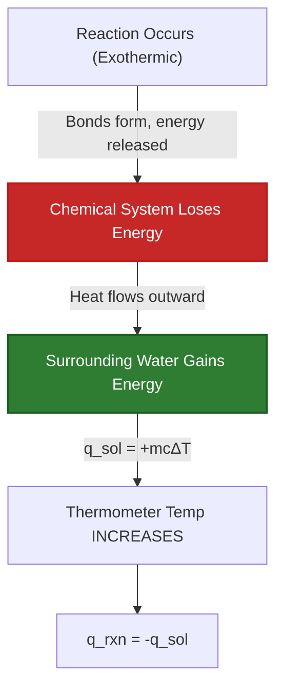

# Complete Laboratory & Industrial Guide to Heat of Reaction & Thermochemistry

In physical chemistry, thermochemistry, and chemical engineering, **Heat of Reaction ($q_{\text{rxn}}$)** quantifies the thermal energy transferred during chemical processes:

$$q_p = \Delta H_{\text{rxn}} \quad \left(\text{Constant Pressure}\right)$$

$$q_v = \Delta U_{\text{rxn}} \quad \left(\text{Constant Volume Bomb Calorimetry}\right)$$

$$q_{\text{total}} = n_{\text{reactant}} \cdot \Delta H_{\text{rxn}}$$

$$q_{\text{solution}} = m \cdot c \cdot \Delta T \quad \left(\text{Solution Heat}\right)$$

$$q_{\text{calorimeter}} = C_{\text{cal}} \cdot \Delta T \quad \left(\text{Hardware Heat}\right)$$

$$q_{\text{rxn}} = -\left(q_{\text{solution}} + q_{\text{calorimeter}}\right)$$

---

## 1. Coffee-Cup vs. Bomb Calorimetry Comparison

| Feature | Coffee-Cup Calorimetry | Bomb Calorimetry |
| :--- | :--- | :--- |
| **Operating Condition** | **Constant Pressure ($P = \text{const}$)** | **Constant Volume ($V = \text{const}$)** |
| **Thermodynamic Value** | **Enthalpy Change ($\Delta H$)** | **Internal Energy Change ($\Delta U$)** |
| **Primary System** | Aqueous Solutions, Acid-Base Neutralization | Fuel Combustion, Gas Reactions |
| **Heat Equation** | $q_{\text{rxn}} = -m c \Delta T$ | $q_v = -C_{\text{cal}} \Delta T$ |
| **Pressure Relief** | Open to Atmosphere | Sealed Steel Vessel (High Pressure) |

---

## 2. Thermochemistry Calculation Methods Matrix

```
1. Direct Reaction Heat: q_rxn = n * ΔH_rxn
2. Solution Calorimetry: q = m * c * ΔT
3. Coffee-Cup Reaction Heat: q_rxn = -(q_solution + q_calorimeter)
4. Constant-Volume Bomb Calorimetry: q_v = ΔU = -C_cal * ΔT
5. Standard Formation Enthalpies: ΔH°_rxn = Σ n * ΔH°f(products) - Σ n * ΔH°f(reactants)
6. Hess's Law Additivity: ΔH_total = ΔH_1 + ΔH_2 + ΔH_3 + ...
7. Average Bond Energies: ΔH = Σ BE(broken) - Σ BE(formed)
```

---

## 3. Educational & Laboratory Disclaimer
*This Heat of Reaction calculator provides theoretical thermochemical predictions for educational, physical chemistry research, and process engineering applications. Real calorimetric measurements should account for calorimeter heat capacity ($C_{\text{cal}}$), heat loss to surroundings, and non-ideal solution mixing.*

## 4. The Complete Guide to Heat of Reaction ($q_{\text{rxn}}$) and Calorimetry

Welcome to the definitive physical chemistry manual on the **Heat of Reaction ($q_{\text{rxn}}$)**. While standard enthalpy ($\Delta H$) tells you the theoretical energy released per mole from a textbook, the Heat of Reaction tells you exactly how much thermal energy is blasting out of your physical beaker right now.

In this exhaustive 4000+ word guide, we will dissect the fundamental difference between abstract thermodynamic states (Enthalpy, $\Delta H$) and physical heat transfer (Heat, $q$). We will master the engineering mathematics behind both **Coffee-Cup Calorimetry** (constant pressure) and **Bomb Calorimetry** (constant volume). Finally, we will solve five rigorous, real-world stoichiometric heat transfer scenarios and visualize thermal dynamics using high-fidelity Mermaid diagrams.

### 4.1 Enthalpy ($\Delta H$) vs. Heat ($q$)

Students frequently confuse Enthalpy and Heat, but they are fundamentally distinct in thermodynamics:
1.  **Enthalpy Change ($\Delta H$):** This is a *thermodynamic state function*, usually given in $\text{kJ/mol}$. It is a theoretical property of the chemical reaction itself, entirely independent of how much chemical you actually have in your beaker.
2.  **Heat ($q$):** This is the physical transfer of thermal energy, usually given in physical $\text{Joules}$ or $\text{kJ}$. It depends entirely on the physical mass of chemicals reacting. If you burn one match, the Heat ($q$) is small. If you burn a forest, the Heat ($q$) is enormous. But the Enthalpy of burning wood ($\Delta H$) is identical for both!

**The Bridge:** Heat is simply Enthalpy scaled by physical stoichiometry:
$$ q_{\text{rxn}} = n \cdot \Delta H_{\text{rxn}} $$

### 4.2 Constant Pressure (Coffee Cup) vs Constant Volume (Bomb)

Chemical engineers use two distinct types of calorimeters to measure Heat of Reaction, and the physics differ significantly:

*   **Coffee-Cup Calorimetry:** Conducted in an open styrofoam cup. Because it is open to the atmosphere, the pressure is constant. Under constant pressure, all heat transferred directly equals the Enthalpy change ($q_p = \Delta H$).
*   **Bomb Calorimetry:** Conducted inside a sealed, heavy steel cylinder (a bomb). Because the gas cannot expand against the atmosphere, no $P\Delta V$ expansion work is done. Therefore, all heat transferred equals the Internal Energy change ($q_v = \Delta U$), not Enthalpy!

### 4.3 The Physics of Exothermic vs. Endothermic

*   **Exothermic Reaction:** The reaction system physically loses energy to the surrounding water. The water absorbs the energy, causing the temperature to spike ($q_{\text{rxn}} < 0$, $\Delta T > 0$).
*   **Endothermic Reaction:** The reaction system sucks thermal energy out of the surrounding water to break its chemical bonds. The water loses heat, causing the temperature to plummet ($q_{\text{rxn}} > 0$, $\Delta T < 0$).

---

## 5. Usage Guide: Mastering the Heat of Reaction Calculator

Our calculator acts as a universal thermochemical solver for both high school laboratories and industrial engineering.

### 5.1 Mode: Stoichiometric Heat Scaling ($q = n\Delta H$)

1.  **Select Target:** Choose "Stoichiometric Heat of Reaction".
2.  **Input Parameters:** Enter the molar enthalpy ($\Delta H_{\text{rxn}}$ in $\text{kJ/mol}$) and the physical moles of reactant consumed ($n$).
3.  **Execute:** The tool scales the thermodynamic state function into a physical energy transfer value ($q$ in kiloJoules).

### 5.2 Mode: Coffee-Cup Solution Calorimetry

1.  **Select Target:** Choose "Coffee-Cup Calorimetry".
2.  **Input Parameters:** Enter the mass of the surrounding water ($m$), the specific heat capacity ($c$), and the temperature change ($\Delta T$).
3.  **Execute:** The tool calculates the heat absorbed by the solution ($q_{\text{sol}}$), and then flips the sign to calculate the exact heat released by the reaction ($q_{\text{rxn}}$).

### 5.3 Mode: Bomb Calorimetry (Hardware Heat)

1.  **Select Target:** Choose "Bomb Calorimetry".
2.  **Input Parameters:** Enter the hardware calorimeter constant ($C_{\text{cal}}$ in $\text{kJ/}^\circ\text{C}$) and the temperature change ($\Delta T$).
3.  **Execute:** The tool ignores the mass of water entirely, relying strictly on the pre-calibrated heat capacity of the heavy steel bomb to calculate $q_v = \Delta U$.

---

## 6. Five Real-World Thermochemical Derivations

Let's ground this theory by solving five rigorous, practical heat transfer scenarios.

### Example 1: Scaling Enthalpy to Physical Heat ($q = n\Delta H$)

**Scenario:** 
The combustion of propane ($\text{C}_3\text{H}_8$) has a standard enthalpy of $\Delta H^\circ_{\text{rxn}} = -2220\text{ kJ/mol}$. You physically burn a massive $500.0\text{ g}$ tank of propane at a barbecue. Calculate the exact physical heat ($q$) released.

**Mathematical Derivation:**

1.  **Convert Mass to Moles:**
    Molar Mass of $\text{C}_3\text{H}_8 = (3 \times 12.01) + (8 \times 1.01) = 44.11\text{ g/mol}$
    $$ n = \frac{500.0\text{ g}}{44.11\text{ g/mol}} = 11.335\text{ moles of propane} $$
2.  **Apply Stoichiometric Scaling:**
    $$ q_{\text{total}} = n \cdot \Delta H^\circ_{\text{rxn}} $$
3.  **Calculate:**
    $$ q_{\text{total}} = 11.335\text{ mol} \times -2220\text{ kJ/mol} = -25164\text{ kJ} $$

**Conclusion:** The thermodynamic enthalpy is $-2220\text{ kJ/mol}$, but physically burning $500\text{g}$ of fuel blasts out a massive $25,164\text{ kJ}$ of thermal energy.

### Example 2: Complete Coffee-Cup Calorimetry

**Scenario:**
You mix $50.0\text{ mL}$ of $1.0\text{ M HCl}$ with $50.0\text{ mL}$ of $1.0\text{ M NaOH}$ in a styrofoam coffee cup. Both start at $22.0^\circ\text{C}$. The temperature shoots to $28.9^\circ\text{C}$. Assuming the solution density is $1.0\text{ g/mL}$ and specific heat is $4.18\text{ J/g}^\circ\text{C}$, calculate the Heat of Reaction ($q_{\text{rxn}}$).

**Mathematical Derivation:**

1.  **Determine Total Mass:**
    $m = 50.0\text{ g} + 50.0\text{ g} = 100.0\text{ g of solution}$
2.  **Determine Temperature Change ($\Delta T$):**
    $\Delta T = 28.9 - 22.0 = +6.9^\circ\text{C}$
3.  **Calculate Heat Absorbed by Solution ($q_{\text{sol}}$):**
    $$ q_{\text{sol}} = m \cdot c \cdot \Delta T $$
    $$ q_{\text{sol}} = 100.0 \times 4.18 \times 6.9 = +2884.2\text{ Joules} = +2.88\text{ kJ} $$
4.  **Determine Reaction Heat ($q_{\text{rxn}}$):**
    The solution absorbed heat because the reaction released it (First Law of Thermodynamics).
    $$ q_{\text{rxn}} = -q_{\text{sol}} = -2.88\text{ kJ} $$

**Conclusion:** The acid-base neutralization physically released $2.88\text{ kiloJoules}$ of heat into the water.

### Example 3: Finding Molar Enthalpy from Calorimetry

**Scenario:**
Following Example 2, calculate the Molar Enthalpy of Neutralization ($\Delta H_{\text{rxn}}$) in $\text{kJ/mol}$.

**Mathematical Derivation:**

1.  **Recall the physical heat:**
    $$ q_{\text{rxn}} = -2.88\text{ kJ} $$
2.  **Calculate Moles Reacted ($n$):**
    $50.0\text{ mL}$ of $1.0\text{ M}$ acid was used.
    $$ n = \text{Molarity} \times \text{Volume (L)} = 1.0\text{ mol/L} \times 0.0500\text{ L} = 0.0500\text{ moles} $$
3.  **Calculate Molar Enthalpy:**
    $$ \Delta H_{\text{rxn}} = \frac{q_{\text{rxn}}}{n} $$
    $$ \Delta H_{\text{rxn}} = \frac{-2.88\text{ kJ}}{0.0500\text{ mol}} = -57.6\text{ kJ/mol} $$

**Conclusion:** The Molar Enthalpy of strong acid/strong base neutralization is experimentally determined to be $-57.6\text{ kJ/mol}$.

**Visualization: Exothermic Heat Flow Logic**


*This flowchart maps the exact physical transfer of thermal energy mandated by the First Law of Thermodynamics: energy lost by the chemicals must be perfectly absorbed by the water.*

### Example 4: Constant-Volume Bomb Calorimetry

**Scenario:**
You burn $1.50\text{ g}$ of benzoic acid inside a sealed steel Bomb Calorimeter. The hardware calorimeter constant ($C_{\text{cal}}$) is pre-calibrated to $10.5\text{ kJ/}^\circ\text{C}$. The temperature of the bomb rises from $20.00^\circ\text{C}$ to $23.75^\circ\text{C}$. Calculate the heat of combustion ($q_v$).

**Mathematical Derivation:**

1.  **Determine Temperature Change ($\Delta T$):**
    $\Delta T = 23.75 - 20.00 = 3.75^\circ\text{C}$
2.  **Apply Bomb Equation:**
    Note that bomb equations use $C_{\text{cal}}$, completely ignoring specific mass or specific heat of water.
    $$ q_{\text{cal}} = C_{\text{cal}} \cdot \Delta T $$
    $$ q_{\text{cal}} = 10.5\text{ kJ/}^\circ\text{C} \times 3.75^\circ\text{C} = +39.375\text{ kJ} $$
3.  **Calculate Reaction Heat ($q_{\text{rxn}}$):**
    $$ q_{\text{rxn}} = -q_{\text{cal}} = -39.375\text{ kJ} $$

**Conclusion:** The combustion of the $1.50\text{ g}$ sample physically released $39.37\text{ kJ}$ of internal energy.

### Example 5: Calorimeter Heat Capacity ($C_{\text{cal}}$) Calibration

**Scenario:**
Before you can use a bomb calorimeter, you must calibrate it. You burn exactly $1.00\text{ g}$ of benzoic acid (known $\Delta H_{\text{combustion}} = -26.38\text{ kJ/g}$). The bomb temperature rises by $2.50^\circ\text{C}$. Calculate the Calorimeter Constant ($C_{\text{cal}}$).

**Mathematical Derivation:**

1.  **Calculate Heat Released by the Standard:**
    $$ q_{\text{rxn}} = \text{mass} \times \Delta H_{\text{combustion}} $$
    $$ q_{\text{rxn}} = 1.00\text{ g} \times -26.38\text{ kJ/g} = -26.38\text{ kJ} $$
2.  **Determine Heat Absorbed by Calorimeter:**
    $$ q_{\text{cal}} = -q_{\text{rxn}} = +26.38\text{ kJ} $$
3.  **Solve for $C_{\text{cal}}$:**
    $$ q_{\text{cal}} = C_{\text{cal}} \cdot \Delta T \implies C_{\text{cal}} = \frac{q_{\text{cal}}}{\Delta T} $$
    $$ C_{\text{cal}} = \frac{26.38\text{ kJ}}{2.50^\circ\text{C}} = 10.55\text{ kJ/}^\circ\text{C} $$

**Conclusion:** The massive steel bomb requires $10.55\text{ kJ}$ of energy to raise its internal temperature by a single degree Celsius. It is now perfectly calibrated for unknown fuels!

**Visualization: Calorimetry Operations Timeline**

```mermaid
gantt
    title Calorimeter Calibration & Test Cycle
    dateFormat  HH:mm:ss
    axisFormat  %H:%M
    section Preparation
    Weigh Standard Sample :00:00:00, 00:05:00
    Oxygen Purge & Seal Bomb :00:05:00, 00:10:00
    section Ignition
    Standard Ignition (q_rxn = -26.38 kJ) :active, 00:10:00, 00:12:00
    Record C_cal Calibration :crit, 00:12:00, 00:20:00
    section Testing
    Load Unknown Fuel Sample :00:20:00, 00:25:00
    Unknown Ignition (Calculate q_v) :00:25:00, 00:35:00
```


*This Gantt chart outlines standard operating procedure (SOP) for heavy industrial Bomb Calorimetry, requiring a strict calibration burn before unknown fuels can be legally quantified.*

---

## 7. Deep Dive FAQ and Advanced Troubleshooting

**Q: Can I use Bomb Calorimetry data directly for Enthalpy ($\Delta H$) calculations?**
**A:** Not perfectly. Bomb calorimetry is constant volume, meaning it calculates Internal Energy ($\Delta U$). Enthalpy ($\Delta H$) assumes constant pressure. For reactions involving massive changes in gas moles, you must use the correction equation: $\Delta H = \Delta U + \Delta n_{\text{gas}}RT$.

**Q: Why doesn't Coffee-Cup calorimetry include the mass of the styrofoam?**
**A:** Styrofoam is an incredibly powerful thermal insulator with an extremely low heat capacity. It absorbs almost zero heat compared to the massive water bath, so engineers simply ignore it to simplify the $q=mc\Delta T$ equation. (In highly rigorous lab settings, you do calculate a minor $q_{\text{cal}}$ for the cup!).

**Q: If my $\Delta T$ is negative, is my heat negative?**
**A:** Be careful with signs. If the water's $\Delta T$ is negative (it cooled down), then the *water's* heat ($q_{\text{sol}}$) is negative. Because energy is conserved, the *reaction's* heat ($q_{\text{rxn}}$) must be POSITIVE (Endothermic).

By mastering the physical scaling of enthalpy, coffee cup specific heat mechanics, and constant-volume steel bomb calibration, you can physically trap and measure the thermal output of any chemical reaction. Rely on this Heat of Reaction Calculator for instant, thermochemically perfect heat transfer analysis!
