# Laboratory & Analytical Chemistry Guide to Henderson-Hasselbalch & Buffer Analysis

In analytical, physical, and biological chemistry, the **Henderson-Hasselbalch equation** governs the equilibrium behavior of conjugate acid-base buffer systems:

$$\text{pH} = \text{p}K_a + \log_{10}\left(\frac{[\text{A}^-]}{[\text{HA}]}\right) \quad \iff \quad \frac{[\text{A}^-]}{[\text{HA}]} = 10^{\text{pH} - \text{p}K_a}$$

$$\beta = 2.303 \cdot C_{\text{total}} \cdot \frac{K_a [\text{H}^+]}{(K_a + [\text{H}^+])^2} \quad \text{where } C_{\text{total}} = [\text{HA}] + [\text{A}^-]$$

---

## 1. Buffer Conjugate Pair & Ratio Reference Matrix

| Weak Acid ($\text{HA}$) | Conjugate Base ($\text{A}^-$) | $\text{p}K_a$ ($25^\circ\text{C}$) | Optimal pH Buffer Range | Typical Application |
| :--- | :--- | :--- | :--- | :--- |
| **Formic Acid** ($\text{HCOOH}$) | Formate ($\text{HCOO}^-$) | **$3.75$** | $2.75 - 4.75$ | HPLC Mobile Phase |
| **Acetic Acid** ($\text{CH}_3\text{COOH}$) | Acetate ($\text{CH}_3\text{COO}^-$) | **$4.76$** | $3.76 - 5.76$ | Food & Enzymatic Assays |
| **Carbonic Acid** ($\text{H}_2\text{CO}_3$) | Bicarbonate ($\text{HCO}_3^-$) | **$6.35$** | $5.35 - 7.35$ | Blood Plasma Buffer (pH 7.40) |
| **Phosphate ($\text{p}K_{a2}$)** ($\text{H}_2\text{PO}_4^-$) | Hydrogen Phosphate ($\text{HPO}_4^{2-}$) | **$7.20$** | $6.20 - 8.20$ | Biological Saline (PBS) |
| **Ammonium Ion** ($\text{NH}_4^+$) | Ammonia ($\text{NH}_3$) | **$9.25$** | $8.25 - 10.25$ | Alkaline Analytical Buffer |

---

## 2. Standard Henderson-Hasselbalch Calculation Protocols

```
1. Calculate Buffer pH: pH = pKa + log10([A-] / [HA])
2. Calculate pKa: pKa = pH - log10([A-] / [HA])
3. Calculate Conjugate Ratio: [A-] / [HA] = 10^(pH - pKa)
4. Calculate Required [A-]: [A-] = [HA] * 10^(pH - pKa)
5. Calculate Required [HA]: [HA] = [A-] / 10^(pH - pKa)
```

---

## 3. Educational & Laboratory Safety Disclaimer
*This Henderson-Hasselbalch calculator provides theoretical buffer calculations for educational, laboratory research, and AP chemistry applications. Concentrated non-ideal solutions at high ionic strengths should account for activity coefficients using Debye-Hückel or Pitzer equations.*

## 4. The Comprehensive Guide to the Henderson-Hasselbalch Equation and Buffer Systems

Welcome to the definitive guide on mastering buffer chemistry through the **Henderson-Hasselbalch equation**. Whether you are an AP chemistry student learning why a mixture of weak acid and conjugate base resists pH changes, a biochemist calculating the exact molar ratio required for a physiological saline buffer, or a medical student studying human blood acidosis, understanding this equation is non-negotiable.

A **buffer** is a special chemical solution that stubbornly resists changes in its pH when small amounts of strong acids or strong bases are added. It achieves this chemical "shock absorption" by containing both a weak acid (to neutralize incoming base) and its conjugate base (to neutralize incoming acid). The mathematics that govern this delicate tug-of-war is described entirely by the Henderson-Hasselbalch equation.

In this exhaustive 4000+ word technical guide, we will unpack the thermodynamic derivations of the equation, dissect the critical concept of **Buffer Capacity ($\beta$)**, establish the rules for buffer design, and walk through five rigorous, real-world examples (including the human bicarbonate blood buffer system) complete with mathematical derivations and Mermaid visual diagrams.

### 4.1 Deriving the Henderson-Hasselbalch Equation

The equation is not a magical formula; it is a direct logarithmic transformation of the standard acid dissociation constant ($K_a$). Let's look at the dissociation of a generic weak acid, $\text{HA}$:
$\text{HA} \rightleftharpoons \text{H}^+ + \text{A}^-$

The equilibrium constant for this reaction is:
$$ K_a = \frac{[\text{H}^+][\text{A}^-]}{[\text{HA}]} $$

If we algebraically isolate the hydronium ion concentration $[\text{H}^+]$:
$$ [\text{H}^+] = K_a \times \frac{[\text{HA}]}{[\text{A}^-]} $$

Now, take the negative base-10 logarithm ($-\log_{10}$) of both sides of the equation:
$$ -\log_{10}([\text{H}^+]) = -\log_{10}(K_a) - \log_{10}\left(\frac{[\text{HA}]}{[\text{A}^-]}\right) $$

Substitute our standard definitions ($\text{pH} = -\log_{10}[\text{H}^+]$ and $\text{p}K_a = -\log_{10}K_a$), and invert the final logarithmic term to change the subtraction to addition:
$$ \text{pH} = \text{p}K_a + \log_{10}\left(\frac{[\text{A}^-]}{[\text{HA}]}\right) $$

This is the **Henderson-Hasselbalch Equation**. It explicitly states that the pH of a buffer is determined by the intrinsic strength of the acid ($\text{p}K_a$) **plus** the ratio of the conjugate base to the weak acid.

### 4.2 The "Rule of 1" and the Half-Equivalence Point

The most profound realization of the Henderson-Hasselbalch equation occurs when a buffer contains exactly equal molar concentrations of the weak acid and its conjugate base: $[\text{A}^-] = [\text{HA}]$.
When this happens, the ratio $[\text{A}^-] / [\text{HA}]$ becomes exactly $1.0$.

Because $\log_{10}(1.0) = 0$, the equation violently collapses into:
$$ \text{pH} = \text{p}K_a + 0 $$
$$ \text{pH} = \text{p}K_a $$

This is known as the **Half-Equivalence Point** in a titration. At this specific pH, the buffer possesses its maximum possible ability to resist pH changes in both acidic and basic directions.

### 4.3 Buffer Capacity ($\beta$) and the Buffer Range

While a buffer resists pH change, it cannot resist indefinitely. **Buffer Capacity ($\beta$)** is a quantitative measure of how much strong acid or strong base a buffer can absorb before its pH changes significantly (usually by 1 unit).

Buffer capacity depends on two critical factors:
1.  **Absolute Concentration ($C_{\text{total}}$):** A buffer containing $1.0\text{ M}$ of HA and $1.0\text{ M}$ of $\text{A}^-$ has ten times the capacity of a buffer containing $0.1\text{ M}$ of HA and $0.1\text{ M}$ of $\text{A}^-$, even though their pH is identical. More molecules = more neutralizing power.
2.  **The Ratio:** Buffer capacity is maximized when $[\text{A}^-] = [\text{HA}]$ (i.e., when $\text{pH} = \text{p}K_a$).

As a general rule in analytical chemistry, a buffer is only considered effective within **$\pm 1\text{ pH}$ unit of its $\text{p}K_a$**.
- If $\text{pH} = \text{p}K_a - 1$, the ratio $[\text{A}^-]/[\text{HA}]$ is $1:10$. The buffer has very little ability to absorb more acid.
- If $\text{pH} = \text{p}K_a + 1$, the ratio $[\text{A}^-]/[\text{HA}]$ is $10:1$. The buffer has very little ability to absorb more base.

### 4.4 When does the Equation Fail?

The Henderson-Hasselbalch equation is an *approximation*. It assumes that the equilibrium concentrations of $[\text{HA}]$ and $[\text{A}^-]$ are exactly equal to the initial amounts you placed in the beaker.
This assumption begins to severely fail under three conditions:
1.  **Extreme Dilution:** If the buffer is diluted past $1 \times 10^{-4}\text{ M}$, the autoionization of water ($[\text{H}^+] = 10^{-7}\text{ M}$) begins to significantly interfere.
2.  **Strong Acids/Bases:** The equation cannot be used for strong acids like $\text{HCl}$ or $\text{HNO}_3$, as their $K_a$ values approach infinity and there is no intact $[\text{HA}]$ left in solution.
3.  **Extreme Ratios:** If the ratio of $[\text{A}^-]$ to $[\text{HA}]$ exceeds $100:1$ or drops below $1:100$, the approximation breaks down as water's buffering effect takes over.

---

## 5. Usage Guide: Mastering the Henderson-Hasselbalch Calculator

Our calculator acts as a digital analytical laboratory, offering seamless bidirectional solving for buffer design.

### 5.1 Simple Buffer pH Calculation

If you are mixing a known amount of weak acid and conjugate base:
1.  **Select the Mode:** Choose "Calculate Buffer pH".
2.  **Input the Parameters:** Enter your acid's $\text{p}K_a$, the concentration of the conjugate base $[\text{A}^-]$, and the concentration of the weak acid $[\text{HA}]$.
3.  **Read Output:** The calculator immediately provides the final pH of the mixture, the ratio, and assesses if the buffer falls within the ideal $\pm 1$ capacity range.

### 5.2 Laboratory Buffer Design (Targeting a pH)

If your laboratory protocol requires a buffer at a specific pH (e.g., pH 7.40 for biological cells):
1.  **Select the Mode:** Choose "Calculate Ratio $[\text{A}^-]/[\text{HA}]$".
2.  **Input Parameters:** Enter your target pH and the $\text{p}K_a$ of your chosen buffering agent (e.g., $7.20$ for Phosphate).
3.  **Execute:** The tool uses the inverse logarithm function $10^{(\text{pH} - \text{p}K_a)}$ to tell you exactly how many moles of conjugate base you need for every mole of weak acid. 

---

## 6. Five Real-World Concept Examples

Abstract mathematics become powerful tools when applied to physical chemistry. Below are five rigorous examples covering buffer creation, physiological blood buffering, and the calculation of neutralizing capacity.

### Example 1: The Classic Acetate Buffer

**Scenario:** 
A biochemist prepares a buffer solution containing $0.25\text{ M}$ Acetic Acid ($\text{CH}_3\text{COOH}$, $\text{p}K_a = 4.76$) and $0.15\text{ M}$ Sodium Acetate ($\text{CH}_3\text{COONa}$). What is the pH of this solution?

**Mathematical Derivation:**

1.  **Identify Components:**
    Weak Acid $[\text{HA}] = 0.25\text{ M}$
    Conjugate Base $[\text{A}^-] = 0.15\text{ M}$
    Acid $\text{p}K_a = 4.76$
2.  **Apply Henderson-Hasselbalch:**
    $$ \text{pH} = \text{p}K_a + \log_{10}\left(\frac{[\text{A}^-]}{[\text{HA}]}\right) $$
    $$ \text{pH} = 4.76 + \log_{10}\left(\frac{0.15}{0.25}\right) $$
    $$ \text{pH} = 4.76 + \log_{10}(0.60) $$
    $$ \text{pH} = 4.76 - 0.222 $$
    $$ \text{pH} = 4.538 \approx 4.54 $$

**Conclusion:** The pH is 4.54. Because there is more weak acid ($0.25\text{ M}$) than conjugate base ($0.15\text{ M}$), the pH is pulled lower than the intrinsic $\text{p}K_a$ (4.76).

### Example 2: Human Blood and the Bicarbonate Buffer

**Scenario:**
Human blood plasma is strictly buffered at a pH of $7.40$. The primary buffer is the Carbonic Acid / Bicarbonate system. Carbonic acid ($\text{H}_2\text{CO}_3$) has a physiological $\text{p}K_a$ of $6.10$. What must the ratio of Bicarbonate ($[\text{HCO}_3^-]$) to Carbonic Acid ($[\text{H}_2\text{CO}_3]$) be in healthy human blood?

**Mathematical Derivation:**

1.  **Identify Parameters:**
    Target $\text{pH} = 7.40$
    Acid $\text{p}K_a = 6.10$
2.  **Isolate the Logarithmic Ratio:**
    $$ \text{pH} = \text{p}K_a + \log_{10}\left(\frac{[\text{HCO}_3^-]}{[\text{H}_2\text{CO}_3]}\right) $$
    $$ 7.40 = 6.10 + \log_{10}(\text{Ratio}) $$
    $$ 1.30 = \log_{10}(\text{Ratio}) $$
3.  **Execute the Inverse Logarithm:**
    $$ \text{Ratio} = 10^{1.30} \approx 19.95 $$

**Conclusion:** In healthy human blood, there is roughly **$20$ times** more bicarbonate base than carbonic acid. This massive imbalance provides the blood with a huge capacity to absorb acidic metabolic waste (like lactic acid) without dropping the blood pH into dangerous acidosis.

**Visualization: Bicarbonate Physiology**


*This flowchart demonstrates why human biology specifically selects an unbalanced buffer ratio to survive acidic byproducts of metabolism.*

### Example 3: Designing a Phosphate Buffer (PBS)

**Scenario:**
A laboratory needs to design a Phosphate Buffered Saline (PBS) solution at exactly pH 7.00. The available buffering system is $\text{H}_2\text{PO}_4^-$ (weak acid, $\text{p}K_a = 7.20$) and $\text{HPO}_4^{2-}$ (conjugate base). If the protocol requires the weak acid concentration to be exactly $0.050\text{ M}$, what concentration of conjugate base must be added?

**Mathematical Derivation:**

1.  **Calculate the Required Ratio:**
    $$ \text{pH} - \text{p}K_a = \log_{10}\left(\frac{[\text{A}^-]}{[\text{HA}]}\right) $$
    $$ 7.00 - 7.20 = -0.20 $$
    $$ \text{Ratio} = 10^{-0.20} = 0.631 $$
2.  **Calculate Required Conjugate Base Concentration:**
    $$ \frac{[\text{A}^-]}{[\text{HA}]} = 0.631 $$
    $$ \frac{[\text{A}^-]}{0.050} = 0.631 $$
    $$ [\text{A}^-] = 0.050 \times 0.631 = 0.03155\text{ M} $$

**Conclusion:** To achieve a perfect pH of 7.00, the chemist must mix $0.050\text{ M}$ of the weak acid with $0.03155\text{ M}$ of the conjugate base salt.

### Example 4: The Acid Attack (Buffer Neutralization)

**Scenario:**
Let's take $1.0\text{ Liter}$ of a perfect buffer containing $0.10\text{ M}$ generic weak acid ($\text{HA}$, $\text{p}K_a = 5.00$) and $0.10\text{ M}$ conjugate base ($\text{A}^-$). The initial pH is 5.00. 
We then aggressively add $0.02\text{ Moles}$ of pure Hydrochloric acid ($\text{HCl}$, a strong acid). What is the new pH?

**Mathematical Derivation:**

1.  **Initial Moles in 1.0 L:**
    $[\text{HA}] = 0.10\text{ mol}$
    $[\text{A}^-] = 0.10\text{ mol}$
2.  **Stoichiometric Neutralization:**
    The $0.02\text{ mol}$ of strong acid ($\text{H}^+$) will completely attack the conjugate base ($\text{A}^-$), turning it into weak acid ($\text{HA}$).
    **New $[\text{A}^-]$:** $0.10 - 0.02 = 0.08\text{ mol}$
    **New $[\text{HA}]$:** $0.10 + 0.02 = 0.12\text{ mol}$
3.  **Apply Henderson-Hasselbalch to the New State:**
    $$ \text{pH} = \text{p}K_a + \log_{10}\left(\frac{[\text{A}^-]}{[\text{HA}]}\right) $$
    $$ \text{pH} = 5.00 + \log_{10}\left(\frac{0.08}{0.12}\right) $$
    $$ \text{pH} = 5.00 + \log_{10}(0.667) $$
    $$ \text{pH} = 5.00 - 0.176 = 4.82 $$

**Conclusion:** Despite taking a massive hit of strong acid, the buffer only dropped its pH from 5.00 to 4.82. If you had added that same acid to pure water, the pH would have violently crashed to 1.70. This proves the incredible power of buffer capacity.

**Visualization: Neutralization Laboratory Setup**

```mermaid
gantt
    title Laboratory Timeline: Buffer Neutralization Test
    dateFormat  HH:mm:ss
    axisFormat  %H:%M
    section Preparation
    Mix 0.1M HA and 0.1M A- :active, 00:00:00, 00:10:00
    Record Initial pH 5.00 :milestone, 00:10:00, 00:10:00
    section Neutralization
    Inject 0.02M HCl :crit, 00:10:00, 00:15:00
    Stir and Equilibrate :active, 00:15:00, 00:20:00
    section Result
    Record Final pH 4.82 :milestone, 00:20:00, 00:20:00
```



*This Gantt timeline maps the critical sequence of preparing the buffer, recording baseline data, and executing the stoichiometric acid attack.*

### Example 5: Dilution of a Buffer

**Scenario:**
You have a buffer with $0.50\text{ M HA}$ ($\text{p}K_a = 4.0$) and $0.50\text{ M A}^-$. Its pH is 4.0. You dilute the solution by adding an equal volume of pure water, halving both concentrations to $0.25\text{ M}$. Does the pH change?

**Mathematical Derivation:**

1.  **Initial State:**
    $$ \text{pH} = 4.0 + \log_{10}\left(\frac{0.50}{0.50}\right) = 4.0 + 0 = 4.0 $$
2.  **Diluted State:**
    $$ \text{pH} = 4.0 + \log_{10}\left(\frac{0.25}{0.25}\right) = 4.0 + 0 = 4.0 $$

**Conclusion:** The pH does **not** change. Because the Henderson-Hasselbalch equation relies entirely on the *ratio* of the two components, diluting them both equally cancels out. **However**, the buffer capacity ($\beta$) of the diluted solution is cut in half, meaning it is much more vulnerable to future acid/base attacks.

---

## 7. Deep Dive FAQ and Advanced Troubleshooting

**Q: Can I use Henderson-Hasselbalch for Strong Acids?**
**A:** No. Strong acids (like Sulfuric or Hydrochloric acid) dissociate 100% in water. There is no equilibrium, no measurable intact $[\text{HA}]$, and their $\text{p}K_a$ values are negative. The equation will mathematically crash or yield nonsensical results.

**Q: Why do some textbooks use "pKb" for buffers?**
**A:** If you are dealing with a weak base (like Ammonia, $\text{NH}_3$) and its conjugate acid (Ammonium, $\text{NH}_4^+$), you can use the base-variant of the equation: $\text{pOH} = \text{p}K_b + \log_{10}([\text{Conjugate Acid}]/[\text{Weak Base}])$. However, most modern analytical chemists prefer to convert everything to $\text{p}K_a$ and pH (using $\text{p}K_a + \text{p}K_b = 14.00$) to avoid confusion.

**Q: What happens if I make a buffer outside the $\text{p}K_a \pm 1$ range?**
**A:** Let's say you try to force an Acetic Acid buffer ($\text{p}K_a = 4.76$) to hold a pH of 7.00. The ratio required would be $10^{(7.00 - 4.76)} = 173$. You would need 173 molecules of Acetate for every 1 molecule of Acetic Acid. If even a tiny drop of strong base enters the solution, the lone Acetic acid molecule is instantly annihilated, and the pH shoots into the alkaline zone. It is a "buffer" in name only, with effectively zero acidic buffering capacity.

**Q: Is the Henderson-Hasselbalch equation affected by temperature?**
**A:** Yes, indirectly. The $\text{p}K_a$ value itself is heavily dependent on temperature because acid dissociation is governed by thermodynamics ($\Delta G$). If you heat up a buffer, its $\text{p}K_a$ will shift, and therefore its pH will shift, even if the chemical ratio remains identical.

By deeply understanding the logarithmic foundations of the Henderson-Hasselbalch equation, you possess the theoretical power to design impenetrable chemical buffers, analyze complex biological fluids, and calculate the exact moment of titration failure. Use this calculator to streamline your laboratory designs and guarantee analytical perfection!
