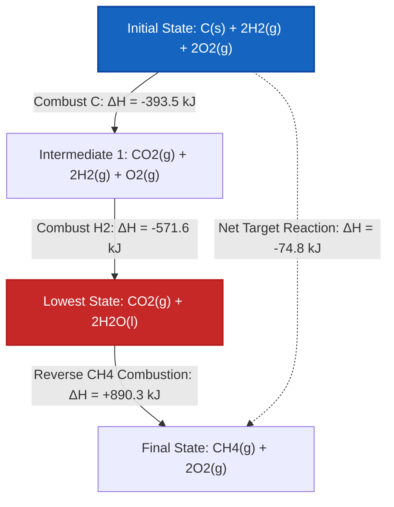

# Complete Laboratory & University Guide to Hess's Law & Reaction Algebra

In physical chemistry, thermochemistry, and chemical thermodynamics, **Hess's Law of Constant Heat Summation** provides a fundamental mathematical bridge for calculating reaction enthalpies ($\Delta H$) of reactions that are difficult, dangerous, or slow to measure directly in a calorimeter:

$$\Delta H_{\text{target}} = \sum_{i=1}^{k} x_i \cdot \Delta H_i$$

$$\vec{R}_{\text{target}} = \sum_{i=1}^{k} x_i \cdot \vec{R}_i \quad \left(\text{Reaction Vector Linear Combination}\right)$$

$$\Delta H_{\text{reversed}} = -\Delta H_{\text{forward}}$$

$$\Delta H_{n \cdot \text{reaction}} = n \cdot \Delta H_{\text{original}}$$

---

## 1. Hess's Law Reaction Transformation Rules

| Transformation | Chemical Equation Action | Enthalpy Change ($\Delta H$) Action |
| :--- | :--- | :--- |
| **Reverse Reaction** | Swap Reactants and Products ($A + B \to C \implies C \to A + B$) | **Flip Sign ($\Delta H \to -\Delta H$)** |
| **Multiply by $n$** | Multiply all coefficients by $n$ ($2A \to 2B$) | **Multiply $\Delta H$ by $n$ ($n \cdot \Delta H$)** |
| **Divide by $n$** | Divide all coefficients by $n$ ($0.5A \to 0.5B$) | **Divide $\Delta H$ by $n$ ($\Delta H / n$)** |
| **Add Equations** | Sum all reactants and all products; cancel common intermediates | **Sum all adjusted enthalpies ($\Delta H_{\text{total}} = \sum \Delta H_i$)** |

---

## 2. Linear Algebra Vector Solver Engine Matrix

```
1. Vectorize Target Reaction: R_target = [c_1, c_2, ..., c_m]
2. Vectorize Step Reactions: R_1, R_2, ..., R_k
3. Form Matrix Equation: A * x = b  (where A = [R_1 | R_2 | ... | R_k], b = R_target)
4. Solve Multiplier Vector x = [x_1, x_2, ..., x_k]
5. Calculate Target Enthalpy: ΔH_target = x_1*ΔH_1 + x_2*ΔH_2 + ... + x_k*ΔH_k
```

---

*This Hess's Law calculator provides theoretical thermochemical predictions for educational, physical chemistry research, and process engineering applications. Real thermochemical cycles should ensure phase consistency (e.g. H2O(l) vs H2O(g)) and standard-state pressure (1 bar / 1 atm).*

## 4. The Complete Guide to Hess's Law and Reaction Enthalpy

Welcome to the definitive physical chemistry manual on **Hess's Law of Constant Heat Summation**. In thermochemistry, measuring the enthalpy change ($\Delta H$) of every chemical reaction physically is impossible. Some reactions are too slow, some are explosively dangerous, and some yield massive amounts of unwanted side-products. 

How do chemical engineers calculate the heat released by these impossible reactions? They use Hess's Law—a powerful mathematical framework that treats chemical equations like algebraic vectors.

In this exhaustive 4000+ word guide, we will master the logic of state functions, the strict rules of stoichiometric algebra (reversing reactions, multiplying scaling coefficients), phase state consistency, and advanced linear combination algorithms. Finally, we will solve five rigorous, real-world thermochemical cycles and map enthalpy state pathways using high-fidelity Mermaid diagrams.

### 4.1 Enthalpy as a State Function

Hess's Law is mathematically guaranteed by the First Law of Thermodynamics, specifically the fact that **Enthalpy (H) is a State Function**.

A state function depends *only* on the current thermodynamic state of the system (temperature, pressure, composition), and is entirely independent of the pathway taken to reach that state. 
Consider climbing a mountain. Your total change in altitude (Enthalpy) is identical whether you take a direct helicopter flight to the peak (the target reaction), or if you hike up winding trails, camp halfway, and zigzag your way up (the intermediate step reactions).

Because of this, we can mathematically combine any sequence of measurable chemical reactions to calculate the $\Delta H$ of an unmeasurable target reaction!

### 4.2 The Rules of Chemical Equation Algebra

To utilize Hess's Law, you must manipulate intermediate step equations so that they add up perfectly to your target equation. 

**Rule 1: Reversing Reactions Flips the Enthalpy Sign**
If a reaction is exothermic (releases heat) in the forward direction, it must be endothermic (absorbs the exact same amount of heat) in the reverse direction.
*   Forward: $A \to B \quad \Delta H = -50\text{ kJ}$
*   Reversed: $B \to A \quad \Delta H = +50\text{ kJ}$

**Rule 2: Multiplying Equations Scales the Enthalpy**
Enthalpy is an extensive property. If you burn twice as much fuel, you release twice as much heat. If you multiply the stoichiometric coefficients of an equation by $n$, you must multiply the $\Delta H$ by $n$.
*   Original: $A \to B \quad \Delta H = -50\text{ kJ}$
*   Scaled ($x2$): $2A \to 2B \quad \Delta H = -100\text{ kJ}$

**Rule 3: Intermediate Species Must Cancel Out**
Intermediate species are molecules that appear in the step equations but NOT in the final target equation. To cancel them, they must appear on opposite sides of the chemical arrow in equal molar amounts.

### 4.3 Phase States: The Hidden Pitfall

A common error in Hess's Law is ignoring phase states: solid ($s$), liquid ($l$), gas ($g$), and aqueous ($aq$). 
You **cannot** cancel $H_2O(l)$ on the reactant side with $H_2O(g)$ on the product side. They contain different amounts of enthalpy (separated by the Latent Heat of Vaporization). You must introduce an additional phase-change step reaction to resolve them!

---

## 5. Usage Guide: Mastering the Hess's Law Calculator

Our Hess's Law calculator is engineered for both educational problem-solving and rapid industrial thermochemistry.

### 5.1 Mode: Manual Reaction Manipulation

1.  **Define Target Reaction:** Input or select a target reaction preset (e.g. Synthesis of Carbon Monoxide).
2.  **Inspect Steps:** Load the available intermediate step reactions and their baseline $\Delta H_i$ values.
3.  **Apply Algebraic Rules:** 
    *   Click "Reverse" to swap reactants/products and flip the enthalpy sign.
    *   Adjust the "Multiplier" (e.g. $1, 2, 0.5$) to scale the stoichiometry and enthalpy.
4.  **Verify Cancellation:** The engine will dynamically display the sum of your manipulated steps, highlighting any intermediate species that failed to cancel.
5.  **Calculate Net Enthalpy:** Once the sum perfectly matches the target, the tool displays the final $\Delta H_{\text{target}}$.

### 5.2 Mode: Automatic Linear Combination Solver

1.  **Input System:** Provide the target reaction and all available intermediate step equations.
2.  **Execute Solver:** The tool vectorizes the stoichiometry into a linear algebra matrix and solves for the optimal combination multipliers automatically.

---

## 6. Five Rigorous Hess's Law Derivations

Let's master the algebra by manually solving five complex, multi-step thermochemical cycles.

### Example 1: Synthesis of Carbon Monoxide (Intermediate Reversal)

**Target Reaction:**
$$C(s) + \frac{1}{2}O_2(g) \to CO(g) \quad \Delta H = ?$$
*(This is difficult to measure because CO often combusts further into CO2 in a calorimeter)*

**Available Step Reactions:**
1.  $C(s) + O_2(g) \to CO_2(g) \quad \Delta H_1 = -393.5\text{ kJ}$
2.  $CO(g) + \frac{1}{2}O_2(g) \to CO_2(g) \quad \Delta H_2 = -283.0\text{ kJ}$

**Mathematical Derivation:**

1.  **Align Reactants:** We need $C(s)$ on the left. Step 1 has $C(s)$ on the left. 
    *   **Keep Step 1 exactly as is:**
    *   $C(s) + O_2(g) \to CO_2(g) \quad \Delta H = -393.5\text{ kJ}$
2.  **Align Products:** We need $CO(g)$ on the right. Step 2 has $CO(g)$ on the left. 
    *   **Reverse Step 2 (Flip $\Delta H$ sign):**
    *   $CO_2(g) \to CO(g) + \frac{1}{2}O_2(g) \quad \Delta H = +283.0\text{ kJ}$
3.  **Sum Equations and Cancel:**
    *   Left side: $C(s) + O_2(g) + CO_2(g)$
    *   Right side: $CO_2(g) + CO(g) + \frac{1}{2}O_2(g)$
    *   The intermediate $CO_2(g)$ cancels out completely. 
    *   The $\frac{1}{2}O_2(g)$ on the right cancels half of the $O_2(g)$ on the left.
    *   Net: $C(s) + \frac{1}{2}O_2(g) \to CO(g)$ (Matches Target!)
4.  **Sum Enthalpies:**
    $$ \Delta H_{\text{target}} = -393.5\text{ kJ} + 283.0\text{ kJ} = -110.5\text{ kJ} $$

**Conclusion:** The synthesis of Carbon Monoxide is exothermic, releasing $-110.5\text{ kJ/mol}$.

### Example 2: Synthesis of Methane (Scaling and Reversing)

**Target Reaction:**
$$C(s) + 2H_2(g) \to CH_4(g) \quad \Delta H = ?$$

**Available Step Reactions:**
1.  $C(s) + O_2(g) \to CO_2(g) \quad \Delta H_1 = -393.5\text{ kJ}$
2.  $H_2(g) + \frac{1}{2}O_2(g) \to H_2O(l) \quad \Delta H_2 = -285.8\text{ kJ}$
3.  $CH_4(g) + 2O_2(g) \to CO_2(g) + 2H_2O(l) \quad \Delta H_3 = -890.3\text{ kJ}$

**Mathematical Derivation:**

1.  **Align $C(s)$:** Keep Step 1 as is.
    *   $C(s) + O_2(g) \to CO_2(g) \quad \Delta H = -393.5\text{ kJ}$
2.  **Align $H_2(g)$:** We need $2H_2$. Step 2 has $1H_2$. 
    *   **Multiply Step 2 by 2:**
    *   $2H_2(g) + 1O_2(g) \to 2H_2O(l) \quad \Delta H = 2 \times (-285.8) = -571.6\text{ kJ}$
3.  **Align $CH_4(g)$:** We need $CH_4$ on the right. Step 3 has it on the left.
    *   **Reverse Step 3 (Flip sign):**
    *   $CO_2(g) + 2H_2O(l) \to CH_4(g) + 2O_2(g) \quad \Delta H = +890.3\text{ kJ}$
4.  **Sum and Cancel:**
    *   Intermediates $CO_2(g)$ and $2H_2O(l)$ cancel perfectly.
    *   The $2O_2(g)$ on the right perfectly cancels the $1O_2 + 1O_2 = 2O_2$ on the left.
5.  **Sum Enthalpies:**
    $$ \Delta H_{\text{target}} = -393.5 - 571.6 + 890.3 = -74.8\text{ kJ} $$

**Conclusion:** The standard enthalpy of formation for Methane is $-74.8\text{ kJ/mol}$.

**Visualization: Enthalpy State-Function Pathway Diagram**


*This diagram illustrates why Hess's Law works: whether you calculate the direct path (dotted line) or the deeply exothermic 3-step pathway (solid lines), the final net energy state is identical.*

### Example 3: Sublimation of Carbon (Phase State Algebra)

**Target Reaction:**
$$C(\text{graphite}) \to C(g) \quad \Delta H = ?$$

**Available Step Reactions:**
1.  $C(\text{graphite}) + O_2(g) \to CO_2(g) \quad \Delta H = -393.5\text{ kJ}$
2.  $C(g) + O_2(g) \to CO_2(g) \quad \Delta H = -1108\text{ kJ}$

**Mathematical Derivation:**

1.  **Keep Step 1:** $C(\text{graphite})$ is on the left.
    *   $C(\text{graphite}) + O_2(g) \to CO_2(g) \quad \Delta H = -393.5\text{ kJ}$
2.  **Reverse Step 2:** Move $C(g)$ to the right.
    *   $CO_2(g) \to C(g) + O_2(g) \quad \Delta H = +1108\text{ kJ}$
3.  **Sum Enthalpies:**
    $$ \Delta H_{\text{target}} = -393.5 + 1108 = +714.5\text{ kJ} $$

**Conclusion:** Vaporizing solid graphite into a gas is massively endothermic, requiring $+714.5\text{ kJ/mol}$. 

### Example 4: Formation of Hydrogen Peroxide

**Target Reaction:**
$$H_2(g) + O_2(g) \to H_2O_2(l) \quad \Delta H = ?$$

**Available Step Reactions:**
1.  $H_2(g) + \frac{1}{2}O_2(g) \to H_2O(l) \quad \Delta H_1 = -285.8\text{ kJ}$
2.  $2H_2O_2(l) \to 2H_2O(l) + O_2(g) \quad \Delta H_2 = -196.0\text{ kJ}$

**Mathematical Derivation:**

1.  **Align $H_2(g)$:** Keep Step 1 as is.
    *   $H_2(g) + \frac{1}{2}O_2(g) \to H_2O(l) \quad \Delta H = -285.8\text{ kJ}$
2.  **Align $H_2O_2(l)$:** We need $1H_2O_2$ on the right. Step 2 has $2H_2O_2$ on the left.
    *   **Reverse AND Divide Step 2 by 2:**
    *   $H_2O(l) + \frac{1}{2}O_2(g) \to H_2O_2(l) \quad \Delta H = +196.0 / 2 = +98.0\text{ kJ}$
3.  **Sum and Cancel:**
    *   $H_2O(l)$ intermediates cancel perfectly.
    *   The $\frac{1}{2}O_2$ from Step 1 and the $\frac{1}{2}O_2$ from the reversed Step 2 add together to form exactly $1 O_2$ on the left!
4.  **Sum Enthalpies:**
    $$ \Delta H_{\text{target}} = -285.8 + 98.0 = -187.8\text{ kJ} $$

**Conclusion:** The enthalpy of formation for Hydrogen Peroxide is $-187.8\text{ kJ/mol}$.

### Example 5: Industrial Nitric Acid Process (Ostwald)

**Target Reaction:**
$$4NH_3(g) + 5O_2(g) \to 4NO(g) + 6H_2O(g) \quad \Delta H = ?$$

**Available Step Reactions:**
1.  $N_2(g) + 3H_2(g) \to 2NH_3(g) \quad \Delta H_1 = -91.8\text{ kJ}$
2.  $N_2(g) + O_2(g) \to 2NO(g) \quad \Delta H_2 = +180.6\text{ kJ}$
3.  $2H_2(g) + O_2(g) \to 2H_2O(g) \quad \Delta H_3 = -483.6\text{ kJ}$

**Mathematical Derivation:**

1.  **Align $NH_3(g)$:** We need $4NH_3$ on the left. Step 1 has $2NH_3$ on the right.
    *   **Reverse and Multiply Step 1 by 2:**
    *   $4NH_3(g) \to 2N_2(g) + 6H_2(g) \quad \Delta H = 2 \times (+91.8) = +183.6\text{ kJ}$
2.  **Align $NO(g)$:** We need $4NO$ on the right. Step 2 has $2NO$ on the right.
    *   **Multiply Step 2 by 2:**
    *   $2N_2(g) + 2O_2(g) \to 4NO(g) \quad \Delta H = 2 \times (180.6) = +361.2\text{ kJ}$
3.  **Align $H_2O(g)$:** We need $6H_2O$ on the right. Step 3 has $2H_2O$ on the right.
    *   **Multiply Step 3 by 3:**
    *   $6H_2(g) + 3O_2(g) \to 6H_2O(g) \quad \Delta H = 3 \times (-483.6) = -1450.8\text{ kJ}$
4.  **Sum and Cancel:**
    *   $2N_2(g)$ intermediates cancel out.
    *   $6H_2(g)$ intermediates cancel out.
    *   Reactant Oxygen sums perfectly: $2O_2 + 3O_2 = 5O_2$.
5.  **Sum Enthalpies:**
    $$ \Delta H_{\text{target}} = +183.6 + 361.2 - 1450.8 = -906.0\text{ kJ} $$

**Conclusion:** The first step of the Ostwald process for generating industrial nitric acid is massively exothermic ($-906.0\text{ kJ}$).

---

## 7. Deep Dive FAQ and Advanced Troubleshooting

**Q: Does Hess's Law only apply to Enthalpy?**
**A:** No! Because Hess's Law relies strictly on state function mathematics, it applies equally to standard Entropy ($\Delta S$), Gibbs Free Energy ($\Delta G$), and Internal Energy ($\Delta U$).

**Q: What if I multiply by a fraction, does that break the chemistry?**
**A:** No, fractional stoichiometry (like $1/2O_2$) is completely valid in thermochemistry. It simply means "half a mole" of Oxygen, which physically exists.

**Q: Why does my solver say "No Solution Found"?**
**A:** This means the intermediate step equations provided are *linearly independent* from your target equation. You are missing a critical intermediate step reaction (often a phase change like vaporization) required to span the vector space of the target reaction.

By mastering the strict rules of stoichiometric algebra—reversing reactions, multiplying coefficients, and tracking intermediate species—you unlock the mathematical power to solve the enthalpy of the universe. Rely on this Hess's Law Calculator to automate vector combinations and eliminate intermediate algebraic errors instantly!
