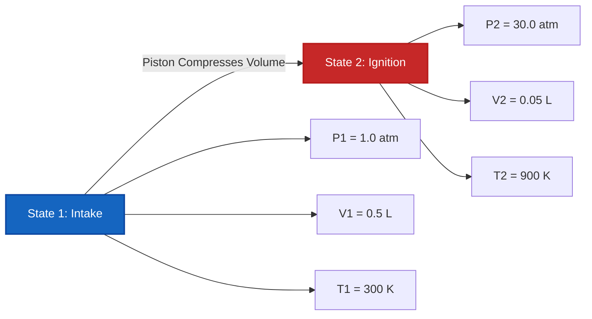

# Complete Laboratory & Industrial Guide to the Ideal Gas Law & Gas Thermodynamics

In physical chemistry, gas dynamics, and chemical process engineering, the **Ideal Gas Law** defines the state behavior of gaseous matter:

$$P \cdot V = n \cdot R \cdot T \quad \left(\text{Ideal Gas Equation}\right)$$

$$\rho = \frac{P \cdot M}{R \cdot T} \quad \left(\text{Gas Density Formula}\right)$$

$$M = \frac{\rho \cdot R \cdot T}{P} \quad \left(\text{Molar Mass from Gas Density}\right)$$

$$V_m = \frac{V}{n} = \frac{R \cdot T}{P} \quad \left(\text{Molar Volume}\right)$$

$$\frac{P_1 \cdot V_1}{T_1} = \frac{P_2 \cdot V_2}{T_2} \quad \left(\text{Combined Gas Law for Fixed } n\right)$$

$$Z = \frac{P \cdot V}{n \cdot R \cdot T} \quad \left(\text{Compressibility Factor}\right)$$

---

## 1. Values of the Universal Gas Constant $R$ Across Unit Systems

| Pressure Unit ($P$) | Volume Unit ($V$) | Amount ($n$) | Temp ($T$) | Gas Constant Value ($R$) |
| :--- | :--- | :--- | :--- | :--- |
| **Atmospheres ($\text{atm}$)** | **Liters ($\text{L}$)** | **$\text{mol}$** | **$\text{K}$** | **$0.082057\text{ L}\cdot\text{atm/(mol}\cdot\text{K)}$** |
| **Pascals ($\text{Pa}$)** | **Cubic Meters ($\text{m}^3$)** | **$\text{mol}$** | **$\text{K}$** | **$8.314462\text{ J/(mol}\cdot\text{K)}$** |
| **Bar ($\text{bar}$)** | **Liters ($\text{L}$)** | **$\text{mol}$** | **$\text{K}$** | **$0.083145\text{ L}\cdot\text{bar/(mol}\cdot\text{K)}$** |
| **Torr / $\text{mmHg}$** | **Liters ($\text{L}$)** | **$\text{mol}$** | **$\text{K}$** | **$62.3637\text{ L}\cdot\text{mmHg/(mol}\cdot\text{K)}$** |

---

## 2. Gas Law Solvers & Thermodynamic Relations Matrix

```
1. Calculate Pressure: P = (n * R * T) / V
2. Calculate Volume: V = (n * R * T) / P
3. Calculate Moles: n = (P * V) / (R * T)
4. Calculate Absolute Temp: T_K = (P * V) / (n * R)
5. Calculate Gas Density: ρ = (P * M) / (R * T)
6. Calculate Molar Mass: M = (ρ * R * T) / P
7. Two-State Combined Gas Law: P2 = (P1 * V1 * T2) / (V2 * T1)
8. Compressibility Factor: Z = (P * V) / (n * R * T)
```

---

*This Ideal Gas Law calculator provides theoretical thermodynamic predictions for educational, physical chemistry research, and gas process engineering applications. Real gas dynamics at extreme pressures ($P > 100\text{ atm}$) or low temperatures ($T \approx T_{\text{boil}}$) should use Van der Waals or Redlich-Kwong real-gas equations of state.*

## 4. The Complete Guide to the Ideal Gas Law and Gas Thermodynamics

Welcome to the definitive physical chemistry manual on the **Ideal Gas Law ($PV = nRT$)**. Why does a hot air balloon rise in the cold morning sky? Why do deep-sea scuba tanks hold lethal pressure? Why does a sealed bag of potato chips expand and pop on a high-altitude airplane flight?

The mathematical answer to all these phenomena lies in the flawless algebraic balance of gas thermodynamics. In this exhaustive 4000+ word guide, we will dissect the kinetic molecular theory underpinning $PV=nRT$, rigorously define the absolute Kelvin temperature scale, derive molar mass and gas density formulas, and solve five rigorous real-world thermodynamic engineering scenarios.

### 4.1 The Kinetic Molecular Theory of Ideal Gases

The Ideal Gas Law is a mathematical model that perfectly describes the macroscopic properties of a gas (Pressure, Volume, Temperature) by making a few critical assumptions about its microscopic behavior:
1.  **Point Masses:** Gas molecules are infinitesimally small. Their physical volume is zero compared to the massive empty space of the container.
2.  **No Intermolecular Forces:** Gas molecules do not attract or repel each other. They behave like perfect, independent billiard balls.
3.  **Elastic Collisions:** When gas molecules collide with the walls of the container (creating Pressure), they bounce off with zero loss of kinetic energy.
4.  **Temperature equals Kinetic Energy:** The absolute Kelvin Temperature ($T$) is directly, linearly proportional to the average kinetic energy of the speeding molecules.

### 4.2 The Crucial Importance of Absolute Kelvin ($K$)

The most common catastrophic failure in gas law calculations is using Celsius ($^\circ\text{C}$) or Fahrenheit ($^\circ\text{F}$). **You must strictly use Kelvin ($K$).**

Why? Because the Ideal Gas Law is a ratio of absolute magnitudes. If you use Celsius, $0^\circ\text{C}$ would mathematically result in $0\text{ Volume}$ and $0\text{ Pressure}$! Worse, negative Celsius temperatures would result in *negative* Volumes—a physical impossibility.
Kelvin fixes this. $0\text{ K}$ (Absolute Zero) is the true state where all molecular kinetic motion stops.
**Conversion:** $T_{\text{K}} = T_{^\circ\text{C}} + 273.15$

### 4.3 Standard Conditions (STP vs SATP)

Chemists use baseline states to standardize gas measurements:
*   **STP (Standard Temperature and Pressure):** Historically defined as $0^\circ\text{C}$ ($273.15\text{ K}$) and exactly $1\text{ atm}$. At STP, exactly $1\text{ mole}$ of an ideal gas occupies $22.414\text{ Liters}$.
*   **SATP (Standard Ambient Temperature and Pressure):** Defined as $25^\circ\text{C}$ ($298.15\text{ K}$) and exactly $1\text{ bar}$ ($0.9869\text{ atm}$). At SATP, exactly $1\text{ mole}$ of an ideal gas occupies $24.789\text{ Liters}$.

---

## 5. Usage Guide: Mastering the Ideal Gas Calculator

Our calculator acts as a universal algebraic solver for high-pressure gas cylinders, weather balloons, and chemical reactors.

### 5.1 Mode: Isolating Missing State Variables

1.  **Select Target:** Need to find pressure inside a tank? Choose "Calculate Pressure ($P$)". Need to find how much space a reaction produces? Choose "Calculate Volume ($V$)".
2.  **Input State Data:** Enter the known variables. Make sure your unit system matches your chosen $R$ constant (e.g., if you use $0.08206$, use Liters and Atmospheres).
3.  **Execute:** The engine algebraically rearranges $PV = nRT$ to isolate and solve the unknown variable instantly.

### 5.2 Mode: Gas Density and Molar Mass Identification

1.  **Select Target:** Choose "Calculate Gas Density ($\rho$)" or "Calculate Molar Mass ($M$)".
2.  **Input Parameters:** Enter the pressure, temperature, and molar mass (if solving for density) or density (if solving for molar mass).
3.  **Execute:** The tool applies $\rho = \frac{PM}{RT}$. This is extremely powerful for identifying unknown gases in a forensic laboratory. If an unknown gas has a density of $1.78\text{ g/L}$ at STP, the engine will reveal a molar mass of $\approx 40\text{ g/mol}$, perfectly identifying it as Argon.

---

## 6. Five Rigorous Ideal Gas Law Derivations

Let's master the algebra of $PV=nRT$ by isolating all variables across five real-world engineering scenarios.

### Example 1: Isolating Pressure for a Scuba Tank

**Scenario:** 
An aluminum scuba diving tank with an internal volume of exactly $11.0\text{ Liters}$ is pumped full of $100.0\text{ moles}$ of breathable air. The tank is stored in a shed at $35.0^\circ\text{C}$. What is the internal pressure of the tank in atmospheres?

**Mathematical Derivation:**

1.  **Convert Temperature to Kelvin:**
    $T = 35.0 + 273.15 = 308.15\text{ K}$
2.  **Select Gas Constant ($R$):**
    Because we want pressure in `atm` and volume in `Liters`, we use $R = 0.082057\text{ L}\cdot\text{atm/(mol}\cdot\text{K)}$.
3.  **Isolate Pressure ($P$):**
    $$ P \cdot V = n \cdot R \cdot T \implies P = \frac{n \cdot R \cdot T}{V} $$
4.  **Calculate:**
    $$ P = \frac{100.0 \times 0.082057 \times 308.15}{11.0} $$
    $$ P = \frac{2528.6}{11.0} = 229.87\text{ atm} $$

**Conclusion:** The internal pressure is a crushing $229.87\text{ atm}$ (roughly $3,378\text{ PSI}$). The aluminum tank walls must be incredibly thick to prevent catastrophic rupture!

### Example 2: Determining Volume of a Weather Balloon

**Scenario:**
A meteorological research team releases a high-altitude weather balloon filled with $50.0\text{ moles}$ of Helium gas. As it ascends into the stratosphere, the ambient pressure drops to a microscopic $0.050\text{ atm}$, and the temperature plunges to $-60.0^\circ\text{C}$. What is the volume of the balloon at this altitude?

**Mathematical Derivation:**

1.  **Convert Temperature to Kelvin:**
    $T = -60.0 + 273.15 = 213.15\text{ K}$
2.  **Isolate Volume ($V$):**
    $$ P \cdot V = n \cdot R \cdot T \implies V = \frac{n \cdot R \cdot T}{P} $$
3.  **Calculate:**
    $$ V = \frac{50.0 \times 0.082057 \times 213.15}{0.050} $$
    $$ V = \frac{874.5}{0.050} = 17490\text{ Liters} $$

**Conclusion:** The balloon expands to a massive $17,490\text{ Liters}$! This is exactly why weather balloons are launched looking flabby and under-inflated on the ground—if they were launched fully tight, they would instantly pop in the low-pressure upper atmosphere.

### Example 3: Molar Mass Identification in a Lab

**Scenario:**
An unknown colorless gas is collected in a $2.50\text{ Liter}$ glass flask. The pressure gauge reads $0.850\text{ atm}$ at a lab temperature of $22.0^\circ\text{C}$. The gas is weighed and has a physical mass of $3.82\text{ grams}$. Identify the molar mass of the gas to determine its chemical identity.

**Mathematical Derivation:**

1.  **Convert Temperature to Kelvin:**
    $T = 22.0 + 273.15 = 295.15\text{ K}$
2.  **Isolate Moles ($n$):**
    $$ n = \frac{P \cdot V}{R \cdot T} $$
3.  **Calculate Moles:**
    $$ n = \frac{0.850 \times 2.50}{0.082057 \times 295.15} $$
    $$ n = \frac{2.125}{24.219} = 0.08774\text{ moles} $$
4.  **Determine Molar Mass ($M$):**
    $M = \frac{\text{Mass}}{\text{Moles}} = \frac{3.82\text{ g}}{0.08774\text{ mol}} = 43.5\text{ g/mol}$

**Conclusion:** The molar mass is $43.5\text{ g/mol}$. This is an almost perfect match for **Carbon Dioxide ($\text{CO}_2$)** which has a theoretical molar mass of $44.01\text{ g/mol}$.

### Example 4: Two-State Combined Gas Law Compression

**Scenario:**
An internal combustion engine cylinder sucks in $0.500\text{ Liters}$ of air ($V_1$) at $1.00\text{ atm}$ ($P_1$) and $300\text{ K}$ ($T_1$). The piston fires upward, crushing the volume down to $0.050\text{ Liters}$ ($V_2$). The intense compression causes the temperature to spike to $900\text{ K}$ ($T_2$). What is the new peak pressure ($P_2$) right before the spark plug fires?

**Mathematical Derivation:**

1.  **Understand Two-State Logic:**
    Because the valve is closed, the amount of gas ($n$) is constant. Therefore, we can bypass $R$ entirely and use the Combined Gas Law:
    $$ \frac{P_1 \cdot V_1}{T_1} = \frac{P_2 \cdot V_2}{T_2} $$
2.  **Isolate $P_2$:**
    $$ P_2 = \frac{P_1 \cdot V_1 \cdot T_2}{V_2 \cdot T_1} $$
3.  **Calculate:**
    $$ P_2 = \frac{1.00 \times 0.500 \times 900}{0.050 \times 300} $$
    $$ P_2 = \frac{450}{15} = 30.0\text{ atm} $$

**Conclusion:** The compression stroke violently multiplies the pressure to $30.0\text{ atm}$ right before ignition.

**Visualization: Two-State Cylinder Compression**


*This flowchart illustrates the inverse relationship between volume and pressure/temperature during rapid mechanical compression.*

### Example 5: Calculating Gas Density ($\rho$)

**Scenario:**
Sulfur Hexafluoride ($\text{SF}_6$) is an incredibly heavy gas (Molar Mass = $146.06\text{ g/mol}$). If you release it at Standard Ambient Temperature and Pressure (SATP: $1.0\text{ bar}$ and $298.15\text{ K}$), what is its density in $\text{g/L}$?

**Mathematical Derivation:**

1.  **Select $R$:**
    Because pressure is in `bar`, we must use $R = 0.083145\text{ L}\cdot\text{bar/(mol}\cdot\text{K)}$.
2.  **Apply Density Equation:**
    $$ \rho = \frac{P \cdot M}{R \cdot T} $$
3.  **Calculate:**
    $$ \rho = \frac{1.0 \times 146.06}{0.083145 \times 298.15} $$
    $$ \rho = \frac{146.06}{24.789} = 5.89\text{ g/L} $$

**Conclusion:** The density is a staggering $5.89\text{ g/L}$. For comparison, normal air has a density of about $1.18\text{ g/L}$. This is why $\text{SF}_6$ sinks to the floor and can literally float a light tinfoil boat in a fish tank!

---

## 7. Deep Dive FAQ and Advanced Thermodynamics

**Q: Does $PV=nRT$ work for all gases?**
**A:** It works incredibly well for almost all gases at room temperature and normal atmospheric pressures (like Oxygen, Nitrogen, Air). It begins to fail under two conditions:
1. **Ultra-High Pressure:** When gases are compressed into tiny volumes (like in Example 1), the physical size of the gas molecules themselves begins to take up significant space, violating the "Point Mass" assumption.
2. **Ultra-Low Temperature:** As gases freeze toward condensation, their molecules slow down enough to begin gravitationally attracting each other, violating the "No Intermolecular Forces" assumption.

**Q: What is the Compressibility Factor ($Z$)?**
**A:** The Compressibility Factor mathematically measures how much a gas disobeys the Ideal Gas Law. $Z = \frac{PV}{nRT}$. For a perfectly ideal gas, $Z = 1.000$. If a real-world measurement yields $Z = 0.85$, it means the gas is acting non-ideally (likely due to intermolecular attractions shrinking the volume).

**Q: Why do my calculations result in negative volumes?**
**A:** You forgot to convert Celsius to Kelvin! $PV=nRT$ is strictly an absolute temperature equation. Add $273.15$ to all Celsius inputs!

By mastering the mathematical symmetries of $PV=nRT$, you gain total control over pneumatic engineering, weather balloon tracking, and reaction vessel stoichiometry. Rely on this Ideal Gas Law Calculator to instantly isolate and solve any missing thermodynamic variable!
