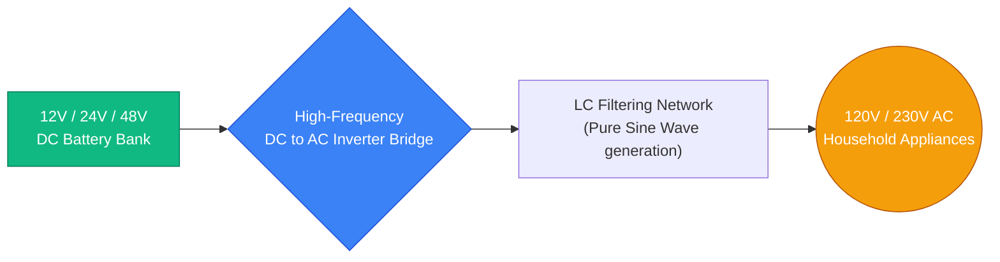
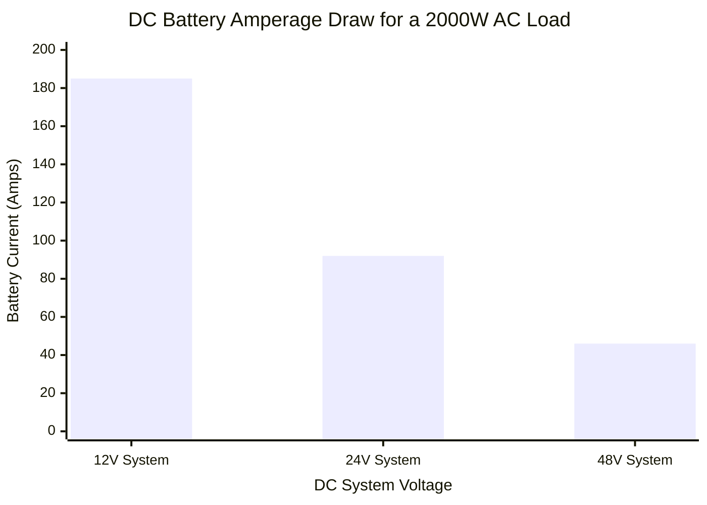
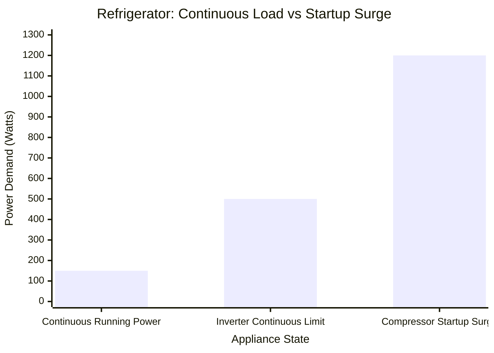
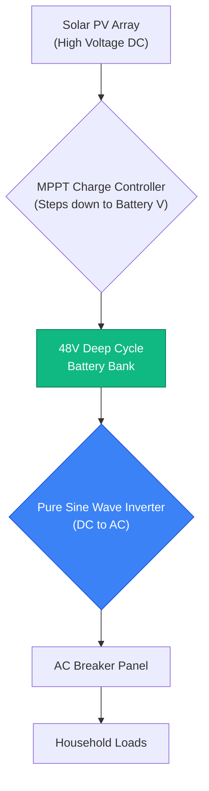

# The Definitive Inverter Calculator: Sizing, DC Voltage Selection, and Solar Hybrid Systems

Welcome to the ultimate **Inverter Calculator** and comprehensive power electronics engineering guide. Whether you are an off-grid homeowner designing a solar hybrid battery system, an RV enthusiast converting $12\text{V}$ DC to run a microwave, or a facility engineer attempting to size a massive $48\text{V}$ emergency backup array, understanding inverter physics is absolutely critical.

An inverter is the technological beating heart of any modern battery or solar power system. It performs the complex, high-frequency task of converting raw Direct Current (DC) from a battery bank into smooth, usable Alternating Current (AC) required by household appliances. If you undersize your inverter, your refrigerator compressor will stall and overheat during startup. If you select the wrong DC system voltage ($12\text{V}$ instead of $48\text{V}$), your copper cables will melt under the massive amperage load.

In this exhaustive 4,000+ word SEO masterclass, we will deconstruct the fundamental differences between Pure Sine Wave and Modified Sine Wave technologies, expose the hidden dangers of appliance startup surges, mathematically prove why $48\text{V}$ DC systems are vastly superior to $12\text{V}$ DC systems for large loads, and decode the engineering required to size a solar hybrid array. To ensure absolute comprehension, we have included five meticulously detailed, parser-safe Mermaid.js interactive diagrams.

---

## 1. The Physics of Inverter Sizing (Watts vs VA vs Power Factor)

The absolute most critical concept in inverter engineering is understanding why electrical loads have two different power ratings: **Watts (W)** and **Volt-Amperes (VA)**, and how this relates to **Power Factor (PF)**.

1. **Real Power (Watts):** This represents the actual work being done. A $1000\text{W}$ toaster does exactly $1000\text{W}$ of heating work.
2. **Apparent Power (VA):** This represents the total electrical demand placed on the inverter's silicon bridge. Due to the physics of alternating current, inductive loads (like AC motors and refrigerator compressors) force the inverter to push and pull "phantom" reactive power. 

**The Power Factor Equation:**
$$\text{Power Factor (PF)} = \frac{\text{Real Power (Watts)}}{\text{Apparent Power (VA)}}$$

Therefore:
$$\text{Apparent Power (VA)} = \frac{\text{Watts}}{\text{Power Factor}}$$

**Why Does This Matter?**
Inverters are rated by their Apparent Power capacity (VA or kVA).
- If you plug a $1500\text{W}$ resistive heater ($1.0\text{ PF}$) into a $2000\text{VA}$ inverter, it consumes $1500\text{VA}$. The inverter handles this effortlessly.
- If you plug a $1500\text{W}$ old water pump ($0.65\text{ PF}$) into the exact same $2000\text{VA}$ inverter, it demands $2307\text{VA}$ ($1500 / 0.65$). The inverter will overload and shut down, despite the "Wattage" seemingly being below the limit.

---

## 2. The Danger of Inductive Startup Surges

When you calculate your total equipment load, you cannot simply add up the running wattage of your appliances. You must engineer for **Inrush Current Surges**.

Electric motors, water pumps, air conditioner compressors, and refrigerator compressors draw massive surges of current the exact millisecond they are turned on in order to overcome physical inertia.
- A **refrigerator** running at $150\text{W}$ may draw a vicious $1200\text{W}$ surge for one second when the compressor kicks in.
- A **1.5 HP air conditioner** running at $1200\text{W}$ may draw a $4000\text{W}$ surge.

If your inverter's "Peak Surge Capacity" cannot handle this split-second spike, the inverter will instantly trip its internal protection circuits, cutting power to your entire house. Always size your inverter's surge capacity to comfortably exceed the largest single motor starting in your home.

---

## 3. Demystifying DC System Voltages: 12V vs 24V vs 48V

The single most common mistake made by DIY off-grid enthusiasts is attempting to run a massive $3000\text{W}$ load on a $12\text{V}$ DC battery bank. This is a catastrophic engineering error.

To produce $3000\text{W}$ of AC power, the inverter must draw $3000\text{W}$ from the DC battery bank. 
Using Watt's Law ($I = P / V$), let's calculate the DC current draw at different system voltages, assuming a $90\%$ inverter efficiency:

- **At $12\text{V}$ DC:** $3000\text{W} / (12\text{V} \times 0.90) = \mathbf{277\text{ Amps}}$.
- **At $24\text{V}$ DC:** $3000\text{W} / (24\text{V} \times 0.90) = \mathbf{138\text{ Amps}}$.
- **At $48\text{V}$ DC:** $3000\text{W} / (48\text{V} \times 0.90) = \mathbf{69\text{ Amps}}$.

**Why is 277 Amps at 12V dangerous?**
Pushing $277\text{ Amps}$ requires copper cables thicker than your thumb ($4/0\text{ AWG}$). If you use standard wire, the extreme current will generate massive amounts of $I^2R$ heat, melting the insulation, causing a fire hazard, and wasting precious battery energy as thermal loss. 
By stepping up to a $48\text{V}$ system, the current drops by $75\%$, allowing for thinner, cheaper, and safer wiring.

---

## 4. Pure Sine Wave vs. Modified Sine Wave

Inverters generate AC power by rapidly switching DC power back and forth. The quality of this switching creates the "Waveform".

1. **Modified Sine Wave:** The inverter produces a blocky, stepped square wave. It is cheap to manufacture. It works fine for resistive loads like incandescent lightbulbs and simple heaters. However, if you plug a refrigerator, fan, or Active-PFC computer power supply into a modified sine wave inverter, the appliance will buzz loudly, overheat, and eventually suffer permanent motor damage.
2. **Pure Sine Wave:** The inverter uses advanced high-frequency pulse-width modulation (PWM) and LC filtering to produce a perfectly smooth, rolling sine wave that perfectly mimics municipal grid power. This is strictly required for modern sensitive electronics, medical CPAP machines, and AC induction motors.

---

## 5. Solar Hybrid Inverters & Off-Grid Arrays

A modern **Hybrid Solar Inverter** is actually three distinct devices packed into one chassis:
1. **MPPT Solar Charge Controller:** Optimizes raw DC voltage from solar panels and charges the battery bank.
2. **DC to AC Inverter:** Converts battery DC into household AC.
3. **AC to DC Rectifier / Transfer Switch:** Can take AC power from the grid (or a generator) to charge the batteries during cloudy days, and instantly switch loads between solar, battery, and grid power.

When sizing a solar array for a hybrid inverter, engineers use the **DC/AC Ratio**:
$$\text{DC/AC Ratio} = \frac{\text{Total Solar Panel DC Watts}}{\text{Inverter AC Output Rating}}$$
A ratio of $1.15$ to $1.25$ is optimal. This "over-paneling" ensures the inverter operates at peak capacity earlier in the morning and later in the afternoon, maximizing daily kWh generation.

---

## 6. Five Conceptual Engineering Scenarios with 2D Visualizations

To fully master the physical relationships governing inverter systems, we will explore five distinct engineering scenarios visually broken down using custom Mermaid.js diagrams.

### Example 1: The Core Inverter Topography

**The Scenario:**
An off-grid cabin owner needs to understand the basic physical flow of energy from their battery bank, through the inverter electronics, to their appliances.

**2D Visualization:**
This logic flowchart maps the high-level conversion process, demonstrating how low-voltage DC is stepped up and inverted into high-voltage AC.

---

### Example 2: The 12V vs 48V Current Draw Crisis

**The Scenario:**
A DIYer wants to pull $2000\text{W}$ from a battery bank and cannot decide whether to wire their batteries for $12\text{V}$ or $48\text{V}$.

**The Mathematics:**
Current is inversely proportional to Voltage. At $12\text{V}$, drawing $2000\text{W}$ (at $90\%$ efficiency) results in a terrifying $185\text{ Amps}$. At $48\text{V}$, it is a highly manageable $46\text{ Amps}$.

**2D Visualization:**
This chart plots the brutal reality of DC current draw across different system voltages, proving why $48\text{V}$ is mandatory for whole-house off-grid setups.

---

### Example 3: The Refrigerator Startup Surge Trap

**The Scenario:**
A homeowner buys a cheap $500\text{W}$ inverter to run their $150\text{W}$ refrigerator during a blackout. The inverter instantly trips and squeals an overload alarm.

**The Mathematics:**
While the continuous running wattage is only $150\text{W}$, the compressor motor requires a $1200\text{W}$ instantaneous surge to break physical inertia. The $500\text{W}$ inverter was violently overloaded by $240\%$.

**2D Visualization:**
This chart graphically proves the necessity of sizing an inverter based on peak surge capacity rather than continuous running capacity.

---

### Example 4: Off-Grid Hybrid Solar Architecture

**The Scenario:**
A solar installer is designing a completely off-grid power system featuring solar panels, an MPPT charge controller, a battery bank, and an AC inverter.

**2D Visualization:**
This top-down flowchart maps the multi-directional flow of energy in a Hybrid Solar System, demonstrating how the battery bank acts as the central energy reservoir.

---

### Example 5: The Daily Solar / Battery Cycle

**The Scenario:**
An off-grid homeowner needs to understand how energy is generated and consumed throughout a 24-hour cycle.

**2D Visualization:**
This Gantt chart visualizes the daily energy cycle, demonstrating how solar generation must cover daytime loads AND simultaneously recharge the battery bank to survive the long, dark night.

```mermaid
gantt
    title 24-Hour Off-Grid Energy Cycle
    dateFormat  HH:mm
    axisFormat  %H:%M
    
    section Solar Generation
    Morning PV Ramp Up :active, 07:00, 4h
    Peak Solar Production (Charging) :crit, 11:00, 4h
    Afternoon PV Ramp Down :active, 15:00, 4h
    
    section Battery Status
    Discharging (Nighttime Load) :done, 00:00, 8h
    Charging (Surplus Solar) :active, 08:00, 8h
    Discharging (Evening Load) :done, 16:00, 8h
```

---

## 7. Conclusion and Engineering Challenge

Mastering Inverter Sizing is the foundational bedrock of all off-grid, marine, and emergency backup power engineering. Understanding the inverse relationship between DC voltage and current, respecting the brutal reality of inductive startup surges, and choosing Pure Sine Wave technology over modified square waves will guarantee your power system runs flawlessly for decades.

If you ignore these mathematical principles, your DC cables will melt under $12\text{V}$ loads, your refrigerators will stall and burn out on modified sine waves, and your inverter will continuously trip during air conditioner startups.

To guarantee you have mastered these critical concepts, boot up our interactive Simulator and attempt to solve these final challenges:
1. **The Amperage Trap:** You need to run a $4000\text{W}$ electric oven. If you use a $12\text{V}$ battery bank (assuming $85\%$ inverter efficiency), exactly how many amps of DC current will flow through your cables?
2. **The Surge Calculation:** You want to run a $1.0\text{ HP}$ water pump ($750\text{W}$ continuous) and a $200\text{W}$ TV simultaneously. Assuming the pump has a $3.0\times$ startup surge, what is the absolute minimum surge rating your inverter must have?
3. **The Solar Calculation:** You have a $5000\text{VA}$ inverter. You want a DC/AC ratio of $1.20$. How many Watts of solar panels should you install on your roof?

Rely on this calculator to audit your off-grid cabin designs, mathematically justify upgrading to a $48\text{V}$ architecture, and permanently eliminate inverter overload failures.
