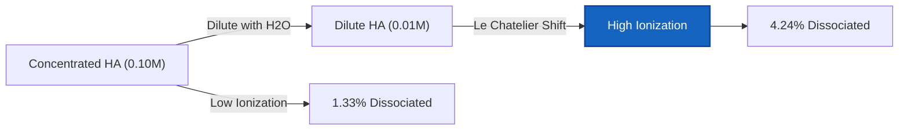

# Laboratory & Analytical Chemistry Guide to Ka & Weak Acid Equilibrium

In analytical, physical, and biological chemistry, the **acid dissociation constant** ($K_a$) measures the quantitative strength of a weak acid in aqueous solution:

$$K_a = \frac{[\text{H}^+][\text{A}^-]}{[\text{HA}]} \quad \iff \quad \text{p}K_a = -\log_{10}(K_a)$$

$$x^2 + K_a x - K_a C = 0 \quad \implies \quad [\text{H}^+] = \frac{-K_a + \sqrt{K_a^2 + 4 K_a C}}{2}$$

$$\text{Percent Ionization} = \frac{[\text{H}^+]_{\text{eq}}}{C_{\text{initial}}} \times 100\% \le 5\% \quad (\text{5\% Approximation Rule})$$

---

## 1. Common Weak Acid Dissociation Constants Reference Matrix

| Weak Acid | Formula | $K_a$ ($25^\circ\text{C}$) | $\text{p}K_a$ | Percent Ionization ($0.10\,\text{M}$) |
| :--- | :--- | :--- | :--- | :--- |
| **Trichloroacetic Acid** | $\text{CCl}_3\text{COOH}$ | **$3.0 \cdot 10^{-1}$** | **$0.52$** | $\sim 80\%$ |
| **Formic Acid** | $\text{HCOOH}$ | **$1.8 \cdot 10^{-4}$** | **$3.75$** | $\sim 4.2\%$ |
| **Benzoic Acid** | $\text{C}_6\text{H}_5\text{COOH}$ | **$6.3 \cdot 10^{-5}$** | **$4.20$** | $\sim 2.5\%$ |
| **Acetic Acid** | $\text{CH}_3\text{COOH}$ | **$1.8 \cdot 10^{-5}$** | **$4.76$** | $\sim 1.3\%$ |
| **Hydrocyanic Acid** | $\text{HCN}$ | **$6.2 \cdot 10^{-10}$** | **$9.21$** | $\sim 0.008\%$ |

---

## 2. Standard $K_a$ Calculation Protocols

```
1. Ka from pH: x = 10^(-pH), Ka = x^2 / (C - x)
2. Ka from [H+]: x = [H+], Ka = x^2 / (C - x)
3. Ka from % Ionization: x = (% / 100) * C, Ka = x^2 / (C - x)
4. Ka from pKa: Ka = 10^(-pKa)
5. Equilibrium Concentrations from Ka: Solve quadratic x^2 + Ka*x - Ka*C = 0
```

---

## 3. Educational & Laboratory Safety Disclaimer
*This Ka calculator provides theoretical equilibrium calculations for educational, laboratory research, and AP chemistry applications. Concentrated non-ideal solutions at high ionic strengths should account for activity coefficients using Debye-Hückel or Pitzer equations.*

## 4. The Comprehensive Guide to Acid Dissociation ($K_a$) and ICE Tables

Welcome to the definitive guide on the Acid Dissociation Constant ($K_a$). In the realm of aqueous chemistry, not all acids are created equal. While strong acids recklessly abandon all their protons the moment they touch water, weak acids are cautious. They establish a delicate thermodynamic balance—an equilibrium—where only a fraction of their molecules dissociate.

Understanding, calculating, and predicting this exact fraction is the core of analytical chemistry, pharmacology, and environmental science. The mathematical key to this prediction is the $K_a$ value, which strictly dictates the equilibrium ratio of broken acid molecules to intact acid molecules.

In this exhaustive 4000+ word technical manual, we will completely demystify the thermodynamics of weak acid dissociation, break down the construction of ICE (Initial, Change, Equilibrium) tables, establish the exact mathematical boundaries of the "5% Rule", and walk through five rigorous, real-world chemical examples complete with step-by-step algebraic derivations and Mermaid visual diagrams.

### 4.1 What is $K_a$ (The Acid Dissociation Constant)?

When a weak generic acid ($\text{HA}$) is dissolved in water, it undergoes a reversible reaction:
$$ \text{HA (aq)} \rightleftharpoons \text{H}^+\text{(aq)} + \text{A}^-\text{(aq)} $$

Because this reaction is reversible, it eventually reaches a state of dynamic equilibrium where the forward rate of dissociation exactly matches the reverse rate of recombination. The **Acid Dissociation Constant ($K_a$)** is the strict mathematical ratio of the products to the reactants at this exact state of equilibrium:

$$ K_a = \frac{[\text{H}^+][\text{A}^-]}{[\text{HA}]} $$

This simple fraction tells us everything about the acid's strength:
*   **Large $K_a$:** The numerator (products) is large. The acid is relatively strong and dissociates heavily.
*   **Small $K_a$:** The denominator (intact acid) is large. The acid is very weak and prefers to remain whole.

### 4.2 Converting between $K_a$ and $\text{p}K_a$

Because $K_a$ values are typically very small, cumbersome scientific notation numbers (e.g., $1.8 \times 10^{-5}$), chemists universally convert them into a logarithmic scale known as $\text{p}K_a$.

$$ \text{p}K_a = -\log_{10}(K_a) \quad \text{and} \quad K_a = 10^{-\text{p}K_a} $$

**The Golden Rule of Acid Strength:** Because of the negative logarithm, the relationship is inverted. A **lower** $\text{p}K_a$ means a **stronger** weak acid. For example, Formic Acid ($\text{p}K_a = 3.75$) is stronger than Acetic Acid ($\text{p}K_a = 4.76$).

### 4.3 The Anatomy of an ICE Table

An **ICE Table** (Initial, Change, Equilibrium) is the foundational bookkeeping tool used to solve weak acid dissociation problems. 

Let's assume we start with an initial concentration ($C$) of the weak acid $\text{HA}$, and zero products.
Let $x$ be the unknown molarity of $\text{HA}$ that successfully dissociates.

| Species | $\text{HA}$ | $\text{H}^+$ | $\text{A}^-$ |
| :--- | :--- | :--- | :--- |
| **I**nitial | $C$ | $0$ | $0$ |
| **C**hange | $-x$ | $+x$ | $+x$ |
| **E**quilibrium | $C - x$ | $x$ | $x$ |

By plugging the bottom "Equilibrium" row into our $K_a$ expression, we generate the master equation:
$$ K_a = \frac{x \cdot x}{C - x} = \frac{x^2}{C - x} $$

### 4.4 The 5% Rule and the Quadratic Equation

To find the final pH, we must solve for $x$ (which is $[\text{H}^+]$). Rearranging the master equation yields a quadratic:
$$ x^2 + K_a x - K_a C = 0 $$

Historically, before computers and online calculators, students were taught to use the **Small-x Approximation** to avoid the quadratic formula. If the acid is very weak (small $K_a$), then the amount that dissociates ($x$) is so tiny compared to $C$ that we can pretend $(C - x) \approx C$.
This simplifies the math beautifully to:
$$ x = \sqrt{K_a \cdot C} $$

**The 5% Rule:** This approximation is only mathematically valid if the final calculated $x$ is less than 5% of the initial concentration $C$. If the ionization exceeds 5%, the approximation creates unacceptable analytical errors, and the exact quadratic formula must be used:
$$ x = \frac{-K_a + \sqrt{K_a^2 - 4(1)(-K_a C)}}{2} $$

Our $K_a$ Calculator always uses the exact quadratic solver to guarantee precision, regardless of whether the 5% rule is passed or failed.

---

## 5. Usage Guide: Mastering the Ka Calculator

Our tool operates bi-directionally: you can either input a $K_a$ to find the resulting pH, or input experimental pH data to determine an unknown acid's $K_a$.

### 5.1 Mode: Calculating pH from a known $K_a$

1.  **Select Mode:** Choose "Equilibrium Concentrations from Ka".
2.  **Input Parameters:** Enter the Initial Concentration ($C$) and the known $K_a$ (or $\text{p}K_a$) of your acid.
3.  **Read Output:** The calculator generates the complete ICE table, runs the exact quadratic solver, and outputs the final pH, exact $[\text{H}^+]$, and the Percent Ionization.

### 5.2 Mode: Discovering an unknown $K_a$ from pH data

1.  **Select Mode:** Choose "Ka from pH".
2.  **Input Parameters:** Enter the Initial Concentration ($C$) of the acid you prepared in the lab, and the final pH you measured with your pH meter.
3.  **Execute:** The tool inverse-calculates $x$ ($[\text{H}^+] = 10^{-\text{pH}}$) and plugs it directly into the $K_a = x^2 / (C - x)$ formula to reveal the acid's identity.

### 5.3 Mode: Percent Ionization

1.  **Select Mode:** Choose "Ka from Percent Ionization".
2.  **Input Parameters:** Enter the Initial Concentration ($C$) and the percentage of the acid that ionized.
3.  **Execute:** The tool calculates $x$ by taking that percentage of $C$, and then solves for the $K_a$.

---

## 6. Five Real-World Concept Examples

Let's apply these mathematical frameworks to real-world analytical chemistry scenarios, complete with step-by-step algebraic breakdowns.

### Example 1: Finding Ka from Laboratory pH Data

**Scenario:** 
A researcher synthesizes a novel weak monoprotic acid. She creates a $0.250\text{ M}$ solution of it in the lab and measures the pH with a calibrated probe. The pH reads 3.45. What is the $K_a$ and $\text{p}K_a$ of this new acid?

**Mathematical Derivation:**

1.  **Calculate $x$ ($[\text{H}^+]$) from pH:**
    $$ [\text{H}^+] = 10^{-\text{pH}} $$
    $$ x = 10^{-3.45} = 3.55 \times 10^{-4}\text{ M} $$
2.  **Establish ICE Variables:**
    $[\text{H}^+] = x = 3.55 \times 10^{-4}\text{ M}$
    $[\text{A}^-] = x = 3.55 \times 10^{-4}\text{ M}$
    $[\text{HA}] = C - x = 0.250 - (3.55 \times 10^{-4}) = 0.2496\text{ M}$
3.  **Calculate $K_a$:**
    $$ K_a = \frac{x^2}{C - x} $$
    $$ K_a = \frac{(3.55 \times 10^{-4})^2}{0.2496} $$
    $$ K_a = \frac{1.26 \times 10^{-7}}{0.2496} = 5.05 \times 10^{-7} $$
4.  **Calculate $\text{p}K_a$:**
    $$ \text{p}K_a = -\log_{10}(5.05 \times 10^{-7}) = 6.30 $$

**Conclusion:** The newly synthesized acid has a $K_a$ of $5.05 \times 10^{-7}$ and a $\text{p}K_a$ of 6.30.

### Example 2: The Exact Quadratic pH of Acetic Acid

**Scenario:**
Calculate the exact pH of a $0.100\text{ M}$ solution of Acetic Acid ($\text{CH}_3\text{COOH}$). The $K_a$ is $1.80 \times 10^{-5}$.

**Mathematical Derivation:**

1.  **Set up the Quadratic Equation:**
    $$ x^2 + K_a x - K_a C = 0 $$
    $$ x^2 + (1.80 \times 10^{-5})x - (1.80 \times 10^{-5})(0.100) = 0 $$
    $$ x^2 + 1.80 \times 10^{-5}x - 1.80 \times 10^{-6} = 0 $$
2.  **Solve via Quadratic Formula:**
    $$ x = \frac{-1.80 \times 10^{-5} + \sqrt{(1.80 \times 10^{-5})^2 - 4(1)(-1.80 \times 10^{-6})}}{2} $$
    $$ x = \frac{-1.80 \times 10^{-5} + \sqrt{3.24 \times 10^{-10} + 7.20 \times 10^{-6}}}{2} $$
    $$ x = 1.33 \times 10^{-3}\text{ M } [\text{H}^+] $$
3.  **Calculate pH:**
    $$ \text{pH} = -\log_{10}(1.33 \times 10^{-3}) = 2.88 $$

**Conclusion:** The pH of the $0.100\text{ M}$ acetic acid solution is 2.88.

### Example 3: Percent Ionization and Dilution

**Scenario:**
Taking the $0.100\text{ M}$ acetic acid from Example 2 ($[\text{H}^+] = 1.33 \times 10^{-3}\text{ M}$). Let's calculate its percent ionization. Then, according to Ostwald's Dilution Law, if we dilute the acid, the percent ionization should *increase*. Let's prove it.

**Mathematical Derivation:**

1.  **Calculate initial % Ionization (at $0.100\text{ M}$):**
    $$ \% \text{ Ionized} = \left(\frac{1.33 \times 10^{-3}}{0.100}\right) \times 100 = 1.33\% $$
2.  **Dilute by 10x (New $C = 0.010\text{ M}$):**
    Using the small-x approx for speed: $x \approx \sqrt{K_a \cdot C} = \sqrt{(1.8 \times 10^{-5})(0.010)} = 4.24 \times 10^{-4}\text{ M}$
3.  **Calculate new % Ionization (at $0.010\text{ M}$):**
    $$ \% \text{ Ionized} = \left(\frac{4.24 \times 10^{-4}}{0.010}\right) \times 100 = 4.24\% $$

**Conclusion:** By diluting the acid 10-fold, the percent ionization more than tripled (from 1.33% to 4.24%). This physically proves Le Chatelier's Principle: diluting the solution adds water, which shifts the equilibrium to the side with more aqueous particles (the dissociated products) to compensate for the lost concentration.

**Visualization: Ostwald Dilution Law**



*This flowchart visualizes Ostwald's Dilution Law: as concentration drops, the thermodynamic equilibrium is forced to shift right, aggressively increasing the percentage of molecules that dissociate.*

### Example 4: When the 5% Rule Fails Catastrophically

**Scenario:**
Calculate the $[\text{H}^+]$ of a highly dilute $0.0050\text{ M}$ solution of Chloroacetic Acid, a relatively strong weak acid with a $K_a$ of $1.4 \times 10^{-3}$. Compare the Small-x Approximation to the Exact Quadratic.

**Mathematical Derivation (Small-x Approximation):**

1.  **Assume $C - x \approx C$:**
    $$ x = \sqrt{K_a \cdot C} $$
    $$ x = \sqrt{(1.4 \times 10^{-3})(0.0050)} $$
    $$ x = \sqrt{7.0 \times 10^{-6}} = 2.65 \times 10^{-3}\text{ M H}^+ $$
2.  **Check the 5% Rule:**
    $$ \% \text{ Ionized} = \left(\frac{2.65 \times 10^{-3}}{0.0050}\right) \times 100 = 53\% $$
    The rule is violently broken (53% $\gg$ 5%). The approximation is completely invalid.

**Mathematical Derivation (Exact Quadratic):**

1.  **Use the full Quadratic:**
    $$ x^2 + (1.4 \times 10^{-3})x - 7.0 \times 10^{-6} = 0 $$
2.  **Solve via Quadratic Formula:**
    $$ x = 2.05 \times 10^{-3}\text{ M H}^+ $$

**Conclusion:** The approximation guessed $2.65 \times 10^{-3}\text{ M}$, while the true exact answer is $2.05 \times 10^{-3}\text{ M}$. The approximation caused a massive **29% error** in the hydrogen ion concentration.

### Example 5: Polyprotic Acid Approximations ($K_{a1}$ vs $K_{a2}$)

**Scenario:**
Phosphoric acid ($\text{H}_3\text{PO}_4$) is a triprotic acid, meaning it drops 3 protons in stages.
$K_{a1} = 7.5 \times 10^{-3}$
$K_{a2} = 6.2 \times 10^{-8}$
When calculating the pH of a $0.10\text{ M}$ Phosphoric acid solution, do we need to calculate all three steps?

**Mathematical Derivation:**

1.  **Compare $K_{a1}$ and $K_{a2}$:**
    The first dissociation constant ($7.5 \times 10^{-3}$) is roughly **100,000 times larger** than the second ($6.2 \times 10^{-8}$).
2.  **The Polyprotic Rule:**
    Because the first proton comes off so much easier than the second, virtually 100% of the $\text{H}^+$ ions in the beaker come from the first dissociation step. The contribution from the second step is mathematically invisible.
3.  **Calculation:**
    You simply treat Phosphoric acid as a monoprotic acid using only $K_{a1}$.
    $$ x^2 + (7.5 \times 10^{-3})x - 7.5 \times 10^{-4} = 0 $$
    $$ x = 0.0239\text{ M H}^+ \implies \text{pH} = 1.62 $$

**Visualization: Polyprotic Dissociation Steps**

```mermaid
gantt
    title Thermodynamic Dominance of Ka1 in Polyprotic Acids
    dateFormat  HH:mm:ss
    axisFormat  %H:%M
    section Step 1 (Ka1)
    H3PO4 => H+ + H2PO4- :crit, 00:00:00, 00:15:00
    section Step 2 (Ka2)
    H2PO4- => H+ + HPO4(2-) :active, 00:15:00, 00:16:00
    section Step 3 (Ka3)
    HPO4(2-) => H+ + PO4(3-) :00:16:00, 00:16:10
```



*This Gantt timeline illustrates how $K_{a1}$ completely dominates the dissociation process, generating the vast majority of the protons and rendering subsequent steps negligible.*

---

## 7. Deep Dive FAQ and Advanced Troubleshooting

**Q: Can a weak acid have a $K_a$ greater than 1?**
**A:** Technically, yes, though we rarely call them "weak" at that point. Acids with a $K_a > 1$ (meaning products are favored over reactants) are generally classified as Strong Acids. For example, the $K_a$ of Hydrochloric Acid ($\text{HCl}$) is estimated to be around $1.3 \times 10^6$. The equilibrium lies so far to the right that the intact $[\text{HA}]$ is effectively zero.

**Q: Why does the 5% Rule exist at all if it can cause errors?**
**A:** Before computers, solving quadratic equations with decimal scientific notation by hand was incredibly tedious and error-prone. The 5% rule was a pragmatic compromise to save time for students and lab technicians. Today, our calculators instantly solve the exact quadratic, rendering the approximation obsolete.

**Q: Does $K_a$ change if I add more acid?**
**A:** No. $K_a$ is a strict thermodynamic constant. It does not change with concentration or volume. The only thing that can change the physical value of $K_a$ is changing the **Temperature** of the solution.

By deeply understanding the thermodynamic mechanisms behind ICE tables, $K_a$ values, and exact quadratic derivations, you possess the theoretical power to predict the pH and speciation of any weak electrolyte in existence. Always rely on this $K_a$ Calculator to bypass the dangerous "small-x" approximations and guarantee analytical perfection!
