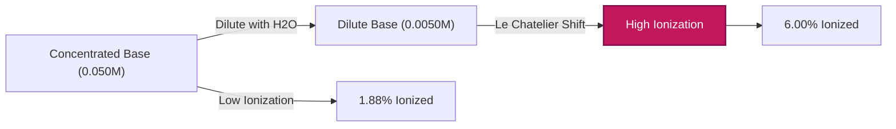

# Laboratory & Analytical Chemistry Guide to Kb & Weak Base Equilibrium

In analytical, physical, and pharmaceutical chemistry, the **base dissociation constant** ($K_b$) measures the quantitative strength of a weak base in aqueous solution:

$$K_b = \frac{[\text{BH}^+][\text{OH}^-]}{[\text{B}]} \quad \iff \quad \text{p}K_b = -\log_{10}(K_b)$$

$$K_a \times K_b = K_w \quad \iff \quad \text{p}K_a + \text{p}K_b = \text{p}K_w \quad (14.00 \text{ at } 25^\circ\text{C})$$

$$x^2 + K_b x - K_b C = 0 \quad \implies \quad [\text{OH}^-] = \frac{-K_b + \sqrt{K_b^2 + 4 K_b C}}{2}$$

$$\text{Percent Ionization} = \frac{[\text{OH}^-]_{\text{eq}}}{C_{\text{initial}}} \times 100\% \le 5\% \quad (\text{5\% Approximation Rule})$$

---

## 1. Common Weak Base Dissociation Constants Reference Matrix

| Weak Base | Formula | $K_b$ ($25^\circ\text{C}$) | $\text{p}K_b$ | Conjugate Acid $\text{p}K_a$ | Percent Ionization ($0.10\,\text{M}$) |
| :--- | :--- | :--- | :--- | :--- | :--- |
| **Ethylamine** | $\text{C}_2\text{H}_5\text{NH}_2$ | **$5.6 \cdot 10^{-4}$** | **$3.25$** | **$10.75$** | $\sim 7.2\%$ |
| **Methylamine** | $\text{CH}_3\text{NH}_2$ | **$4.4 \cdot 10^{-4}$** | **$3.36$** | **$10.64$** | $\sim 6.4\%$ |
| **Ammonia** | $\text{NH}_3$ | **$1.8 \cdot 10^{-5}$** | **$4.75$** | **$9.25$** | $\sim 1.3\%$ |
| **Pyridine** | $\text{C}_5\text{H}_5\text{N}$ | **$1.7 \cdot 10^{-9}$** | **$8.77$** | **$5.23$** | $\sim 0.013\%$ |
| **Aniline** | $\text{C}_6\text{H}_5\text{NH}_2$ | **$4.3 \cdot 10^{-10}$** | **$9.37$** | **$4.63$** | $\sim 0.0065\%$ |

---

## 2. Standard $K_b$ Calculation Protocols

```
1. Kb from pOH: x = 10^(-pOH), Kb = x^2 / (C - x)
2. Kb from pH: pOH = pKw - pH, x = 10^(-pOH), Kb = x^2 / (C - x)
3. Kb from [OH-]: x = [OH-], Kb = x^2 / (C - x)
4. Kb from Conjugate Ka: Kb = Kw / Ka & pKb = pKw - pKa
5. Equilibrium Concentrations from Kb: Solve quadratic x^2 + Kb*x - Kb*C = 0
```

---

## 3. Educational & Laboratory Safety Disclaimer
*This Kb calculator provides theoretical equilibrium calculations for educational, laboratory research, and AP chemistry applications. Concentrated non-ideal solutions at high ionic strengths should account for activity coefficients using Debye-Hückel or Pitzer equations.*

## 4. The Comprehensive Guide to Base Dissociation ($K_b$) and ICE Tables

Welcome to the definitive guide on the Base Dissociation Constant ($K_b$). When learning about acid-base equilibria, much of the spotlight is unfairly placed on acids. However, understanding weak bases—such as ammonia, pharmaceutical amines, and biological alkaloids—is arguably even more critical for medicine, drug design, and physiological buffer systems.

When a weak base is added to water, it doesn't just fall apart. Instead, it actively attacks water molecules, stealing a proton to form a conjugate acid and leaving behind a hydroxide ion ($\text{OH}^-$). Because the base is "weak," it lacks the thermodynamic strength to steal protons from *every* water molecule, resulting in a delicate state of chemical equilibrium.

In this massive 4000+ word technical manual, we will completely decode the thermodynamics of weak base equilibrium, explore the exact inverse mathematical relationship between conjugate $K_a$ and $K_b$ pairs, establish the strict boundaries of the "5% Rule", and walk through five rigorous, real-world analytical chemistry examples complete with step-by-step algebraic derivations and Mermaid visual diagrams.

### 4.1 What is $K_b$ (The Base Dissociation Constant)?

When a weak generic base ($\text{B}$) is dissolved in water, it reacts according to the following reversible equation:
$$ \text{B (aq)} + \text{H}_2\text{O (l)} \rightleftharpoons \text{BH}^+\text{(aq)} + \text{OH}^-\text{(aq)} $$

Once this reaction reaches dynamic equilibrium (where the forward proton-stealing rate equals the reverse proton-returning rate), we define its thermodynamic position using the **Base Dissociation Constant ($K_b$)**:

$$ K_b = \frac{[\text{BH}^+][\text{OH}^-]}{[\text{B}]} $$

*(Note: Water is a pure liquid solvent and its concentration is effectively constant, so it is strictly excluded from the equilibrium expression.)*

The $K_b$ value immediately tells us the strength of the base:
*   **Large $K_b$:** The numerator is large. The base is relatively strong and successfully produces a lot of $\text{OH}^-$.
*   **Small $K_b$:** The denominator is large. The base is very weak and most of it remains in its neutral $\text{B}$ form.

### 4.2 Converting between $K_b$ and $\text{p}K_b$

Just like with $K_a$, base dissociation constants are often exceedingly small numbers (e.g., $1.8 \times 10^{-5}$ for Ammonia). To make the math manageable, chemists use the logarithmic $\text{p}K_b$ scale.

$$ \text{p}K_b = -\log_{10}(K_b) \quad \text{and} \quad K_b = 10^{-\text{p}K_b} $$

**The Golden Rule of Base Strength:** Because of the negative logarithm, a **lower** $\text{p}K_b$ equates to a **stronger** weak base. For example, Methylamine ($\text{p}K_b = 3.36$) is stronger than Ammonia ($\text{p}K_b = 4.75$).

### 4.3 The $K_a \times K_b = K_w$ Relationship (Conjugate Pairs)

This is arguably the most important thermodynamic rule in all of acid-base chemistry: **The strength of a weak base is inversely proportional to the strength of its conjugate acid.** 

If you know the $K_a$ of an acid, you instantly know the $K_b$ of its conjugate base through the autoionization constant of water ($K_w$):
$$ K_a \times K_b = K_w = 1.0 \times 10^{-14} \quad (\text{at } 25^\circ\text{C}) $$
$$ \text{p}K_a + \text{p}K_b = \text{p}K_w = 14.00 $$

If you have a moderately strong weak acid, its conjugate base will be incredibly weak. Conversely, an incredibly weak acid will have a relatively strong conjugate base.

### 4.4 The Anatomy of an ICE Table for Weak Bases

An **ICE Table** (Initial, Change, Equilibrium) is the standard method for solving weak base dissociation problems. 

Let's start with an initial concentration ($C$) of the weak base $\text{B}$, and assume initial product concentrations are zero. Let $x$ be the unknown molarity of $\text{B}$ that successfully reacts with water.

| Species | $\text{B}$ | $\text{BH}^+$ | $\text{OH}^-$ |
| :--- | :--- | :--- | :--- |
| **I**nitial | $C$ | $0$ | $0$ |
| **C**hange | $-x$ | $+x$ | $+x$ |
| **E**quilibrium | $C - x$ | $x$ | $x$ |

Plugging the "Equilibrium" row into our $K_b$ expression yields the master equation:
$$ K_b = \frac{x \cdot x}{C - x} = \frac{x^2}{C - x} $$

### 4.5 The 5% Rule and the Quadratic Equation

To find the final $\text{pOH}$ (and thus pH), we must solve for $x$ (which is $[\text{OH}^-]$). This rearranges into a quadratic:
$$ x^2 + K_b x - K_b C = 0 $$

To save time, chemists often use the **Small-x Approximation**. If $K_b$ is very small, we assume the amount that dissociates ($x$) is insignificant compared to $C$, meaning $(C - x) \approx C$. The equation simplifies to:
$$ x = \sqrt{K_b \cdot C} $$

**The 5% Rule:** This approximation is only mathematically permitted if the calculated $x$ is less than 5% of the initial concentration $C$. If the ionization is greater than 5%, the exact quadratic formula MUST be used to avoid unacceptable errors:
$$ x = \frac{-K_b + \sqrt{K_b^2 - 4(1)(-K_b C)}}{2} $$

Our $K_b$ Calculator never uses the small-x approximation. It runs the exact quadratic solver 100% of the time to guarantee absolute precision.

---

## 5. Usage Guide: Mastering the Kb Calculator

Our tool operates bi-directionally: you can either input a $K_b$ to predict the resulting pH, or input experimental pH/pOH data to reverse-engineer an unknown base's $K_b$.

### 5.1 Mode: Calculating pH from a known $K_b$

1.  **Select Mode:** Choose "Equilibrium Concentrations from Kb".
2.  **Input Parameters:** Enter the Initial Concentration ($C$) and the known $K_b$ (or $\text{p}K_b$) of your weak base.
3.  **Read Output:** The calculator generates the complete ICE table, runs the exact quadratic solver for $[\text{OH}^-]$, and outputs the final $\text{pOH}$, equilibrium pH, exact $[\text{OH}^-]$, and Percent Ionization.

### 5.2 Mode: Discovering an unknown $K_b$ from pH data

1.  **Select Mode:** Choose "Kb from pH".
2.  **Input Parameters:** Enter the Initial Concentration ($C$) of the base, and the final pH you measured.
3.  **Execute:** The tool first converts your pH into pOH ($\text{pOH} = 14 - \text{pH}$). It inverse-calculates $x$ ($[\text{OH}^-] = 10^{-\text{pOH}}$) and plugs it directly into the $K_b = x^2 / (C - x)$ formula to reveal the base's identity.

### 5.3 Mode: Percent Ionization

1.  **Select Mode:** Choose "Kb from Percent Ionization".
2.  **Input Parameters:** Enter the Initial Concentration ($C$) and the percentage of the base that ionized.
3.  **Execute:** The tool calculates $x$ by taking that percentage of $C$, and then solves for the $K_b$.

---

## 6. Five Real-World Concept Examples

Let's apply these mathematical frameworks to real-world laboratory scenarios, complete with step-by-step algebraic breakdowns.

### Example 1: Finding Kb from Laboratory pH Data

**Scenario:** 
A pharmacologist creates a $0.150\text{ M}$ solution of an unknown biological amine (a weak base) and measures the pH with a calibrated probe. The pH reads 11.20. What is the $K_b$ and $\text{p}K_b$ of this amine?

**Mathematical Derivation:**

1.  **Calculate pOH from pH:**
    $$ \text{pOH} = 14.00 - \text{pH} = 14.00 - 11.20 = 2.80 $$
2.  **Calculate $x$ ($[\text{OH}^-]$) from pOH:**
    $$ [\text{OH}^-] = 10^{-\text{pOH}} $$
    $$ x = 10^{-2.80} = 1.58 \times 10^{-3}\text{ M} $$
3.  **Establish ICE Variables:**
    $[\text{OH}^-] = x = 1.58 \times 10^{-3}\text{ M}$
    $[\text{BH}^+] = x = 1.58 \times 10^{-3}\text{ M}$
    $[\text{B}] = C - x = 0.150 - (1.58 \times 10^{-3}) = 0.1484\text{ M}$
4.  **Calculate $K_b$:**
    $$ K_b = \frac{x^2}{C - x} $$
    $$ K_b = \frac{(1.58 \times 10^{-3})^2}{0.1484} $$
    $$ K_b = \frac{2.51 \times 10^{-6}}{0.1484} = 1.69 \times 10^{-5} $$
5.  **Calculate $\text{p}K_b$:**
    $$ \text{p}K_b = -\log_{10}(1.69 \times 10^{-5}) = 4.77 $$

**Conclusion:** The unknown amine has a $K_b$ of $1.69 \times 10^{-5}$, meaning it is likely ammonia ($\text{NH}_3$).

### Example 2: The Exact Quadratic pH of Ammonia

**Scenario:**
Calculate the exact pH of a $0.050\text{ M}$ solution of Ammonia ($\text{NH}_3$). The $K_b$ is $1.80 \times 10^{-5}$.

**Mathematical Derivation:**

1.  **Set up the Quadratic Equation:**
    $$ x^2 + K_b x - K_b C = 0 $$
    $$ x^2 + (1.80 \times 10^{-5})x - (1.80 \times 10^{-5})(0.050) = 0 $$
    $$ x^2 + 1.80 \times 10^{-5}x - 9.00 \times 10^{-7} = 0 $$
2.  **Solve via Quadratic Formula:**
    $$ x = \frac{-1.80 \times 10^{-5} + \sqrt{(1.80 \times 10^{-5})^2 - 4(1)(-9.00 \times 10^{-7})}}{2} $$
    $$ x = 9.39 \times 10^{-4}\text{ M } [\text{OH}^-] $$
3.  **Calculate pOH and pH:**
    $$ \text{pOH} = -\log_{10}(9.39 \times 10^{-4}) = 3.03 $$
    $$ \text{pH} = 14.00 - 3.03 = 10.97 $$

**Conclusion:** The pH of the $0.050\text{ M}$ ammonia solution is exactly 10.97.

### Example 3: Percent Ionization and Dilution of Bases

**Scenario:**
Using the $0.050\text{ M}$ ammonia from Example 2 ($[\text{OH}^-] = 9.39 \times 10^{-4}\text{ M}$). Let's calculate its percent ionization. Then, according to Ostwald's Dilution Law, if we dilute the base by adding pure water, the percent ionization should *increase*.

**Mathematical Derivation:**

1.  **Calculate initial % Ionization (at $0.050\text{ M}$):**
    $$ \% \text{ Ionized} = \left(\frac{9.39 \times 10^{-4}}{0.050}\right) \times 100 = 1.88\% $$
2.  **Dilute by 10x (New $C = 0.0050\text{ M}$):**
    Using the small-x approx for speed: $x \approx \sqrt{K_b \cdot C} = \sqrt{(1.8 \times 10^{-5})(0.0050)} = 3.00 \times 10^{-4}\text{ M}$
3.  **Calculate new % Ionization (at $0.0050\text{ M}$):**
    $$ \% \text{ Ionized} = \left(\frac{3.00 \times 10^{-4}}{0.0050}\right) \times 100 = 6.00\% $$

**Conclusion:** By diluting the base 10-fold, the percent ionization surged from 1.88% to over 6.00%. Just like with acids, diluting a weak base forces the equilibrium to shift to the right to produce more dissociated particles.

**Visualization: Ostwald Dilution Law for Bases**



*This flowchart visualizes Ostwald's Dilution Law for bases: as concentration drops, the thermodynamic equilibrium shifts right, vastly increasing the percentage of molecules that react with water.*

### Example 4: The Conjugate $K_a \times K_b$ See-Saw

**Scenario:**
You need to find the $K_b$ of the Pyridine base ($\text{C}_5\text{H}_5\text{N}$). You check a textbook, but the table only lists the $K_a$ of its conjugate acid, the Pyridinium ion ($\text{C}_5\text{H}_5\text{NH}^+$), which is $K_a = 5.9 \times 10^{-6}$.

**Mathematical Derivation:**

1.  **Use the Conjugate Autoionization Formula:**
    $$ K_a \times K_b = K_w $$
2.  **Solve for $K_b$:**
    $$ K_b = \frac{K_w}{K_a} $$
    $$ K_b = \frac{1.0 \times 10^{-14}}{5.9 \times 10^{-6}} = 1.7 \times 10^{-9} $$
3.  **Solve for $\text{p}K_b$:**
    $$ \text{p}K_b = -\log_{10}(1.7 \times 10^{-9}) = 8.77 $$

**Conclusion:** The $K_b$ of Pyridine is $1.7 \times 10^{-9}$. Since the Pyridinium ion is a moderately weak acid, its conjugate Pyridine is an incredibly weak base.

### Example 5: When the 5% Rule Fails Catastrophically for Bases

**Scenario:**
Calculate the $[\text{OH}^-]$ of a highly dilute $0.0010\text{ M}$ solution of Ethylamine, a relatively strong weak base with a $K_b$ of $5.6 \times 10^{-4}$. Compare the Small-x Approximation to the Exact Quadratic.

**Mathematical Derivation (Small-x Approximation):**

1.  **Assume $C - x \approx C$:**
    $$ x = \sqrt{K_b \cdot C} $$
    $$ x = \sqrt{(5.6 \times 10^{-4})(0.0010)} $$
    $$ x = \sqrt{5.6 \times 10^{-7}} = 7.48 \times 10^{-4}\text{ M OH}^- $$
2.  **Check the 5% Rule:**
    $$ \% \text{ Ionized} = \left(\frac{7.48 \times 10^{-4}}{0.0010}\right) \times 100 = 74.8\% $$
    The rule is violently broken (75% $\gg$ 5%). The approximation is completely invalid.

**Mathematical Derivation (Exact Quadratic):**

1.  **Use the full Quadratic:**
    $$ x^2 + (5.6 \times 10^{-4})x - 5.6 \times 10^{-7} = 0 $$
2.  **Solve via Quadratic Formula:**
    $$ x = 5.17 \times 10^{-4}\text{ M OH}^- $$

**Conclusion:** The approximation guessed $7.48 \times 10^{-4}\text{ M}$, while the true exact answer is $5.17 \times 10^{-4}\text{ M}$. The approximation caused a massive **45% analytical error** in the hydroxide concentration.

**Visualization: The Inverse Conjugate Relationship**

```mermaid
gantt
    title Conjugate Acid-Base Strength Dominance
    dateFormat  HH:mm:ss
    axisFormat  %H:%M
    section HCl / Cl-
    Strong Acid Ka >> 1 :crit, 00:00:00, 00:05:00
    Useless Base Kb ~ 0 :00:00:00, 00:05:00
    section NH4+ / NH3
    Weak Acid Ka (5e-10) :00:05:00, 00:10:00
    Weak Base Kb (2e-5) :active, 00:05:00, 00:10:00
```



*This Gantt timeline maps out the inverse relationship of $K_a$ and $K_b$. When the acid is incredibly strong (like $\text{HCl}$), the conjugate base ($\text{Cl}^-$) is so weak it has virtually zero basicity. When the acid is weak (like $\text{NH}_4^+$), the conjugate base ($\text{NH}_3$) gains functional thermodynamic strength.*

---

## 7. Deep Dive FAQ and Advanced Troubleshooting

**Q: Do I need to include Water in the $K_b$ expression?**
**A:** No. In dilute aqueous solutions, the concentration of water is staggeringly high ($\sim 55.5\text{ M}$) and remains effectively constant during the reaction. It is mathematically integrated into the $K_b$ constant itself, so we never write $[\text{H}_2\text{O}]$ in the denominator.

**Q: Can a weak base have a pH lower than 7?**
**A:** No, not if it is the only thing dissolved in water. If you dissolve any pure weak base in pure water, it will produce $\text{OH}^-$ and drive the pH above 7.00. However, if the base is added to an acidic buffer, the resulting solution can have a pH below 7.

**Q: Does $K_b$ change if I add more base?**
**A:** No. $K_b$ is a strict thermodynamic constant. It does not change with concentration or volume. Just like with $K_a$, the only thing that can change the physical value of $K_b$ is a change in the **Temperature** of the solution.

By deeply understanding the thermodynamic mechanisms behind ICE tables, conjugate pair relationships ($K_w = K_a \times K_b$), and exact quadratic derivations, you possess the theoretical power to predict the pH and speciation of any weak base in existence. Always rely on this $K_b$ Calculator to bypass the dangerous "small-x" approximations and guarantee analytical perfection!
