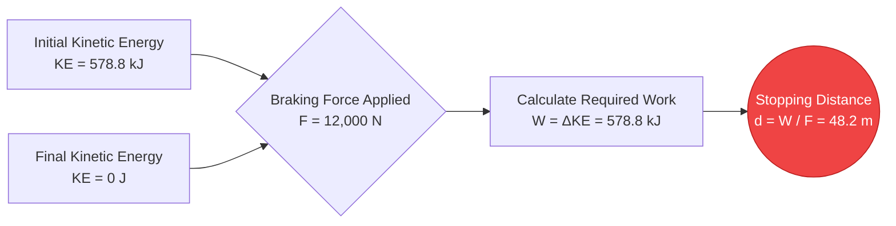
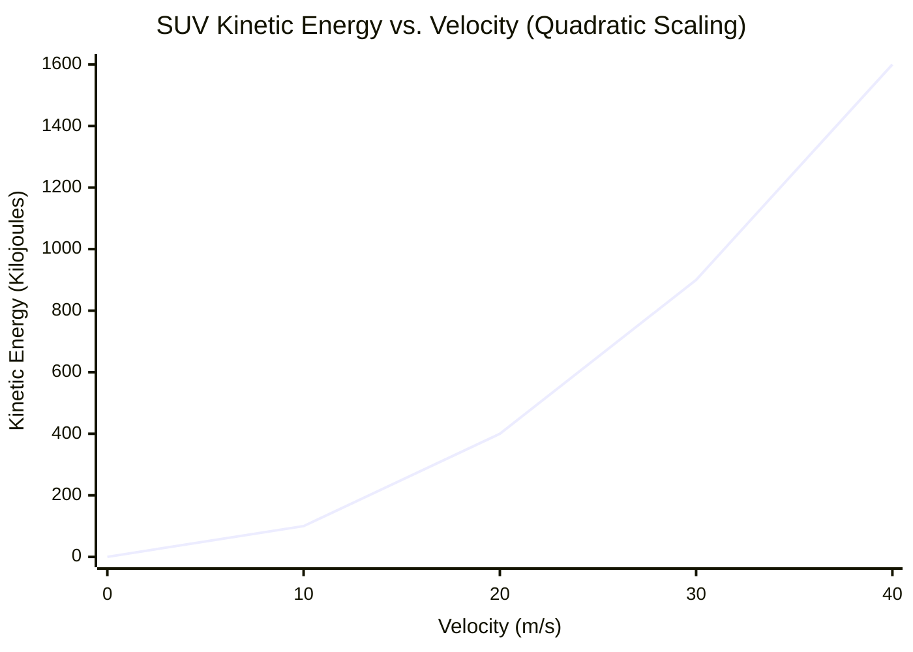
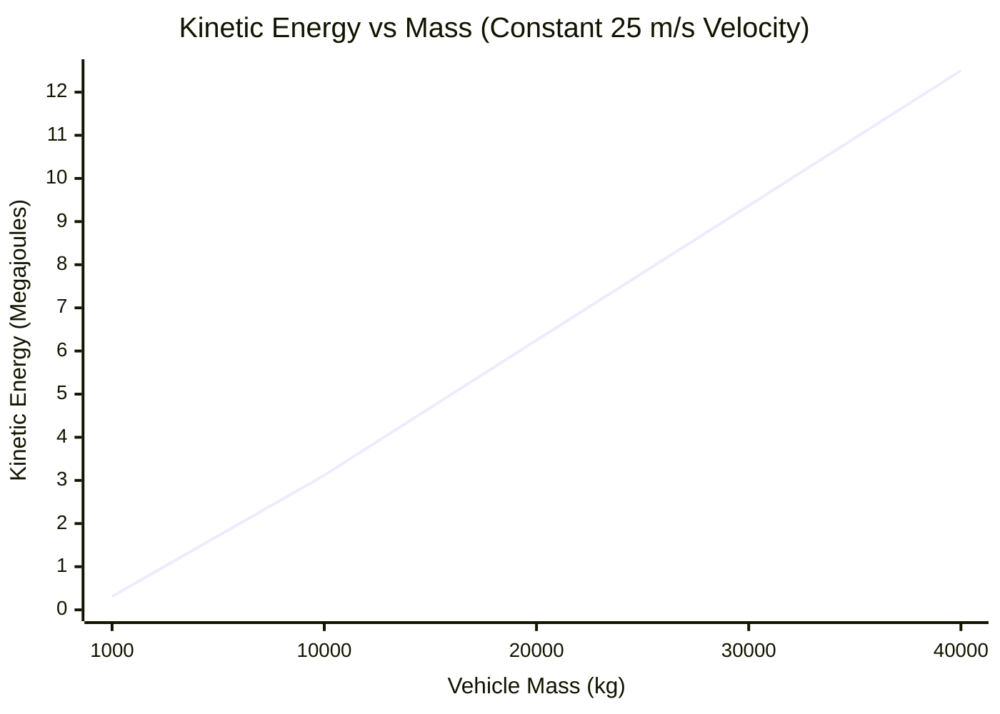
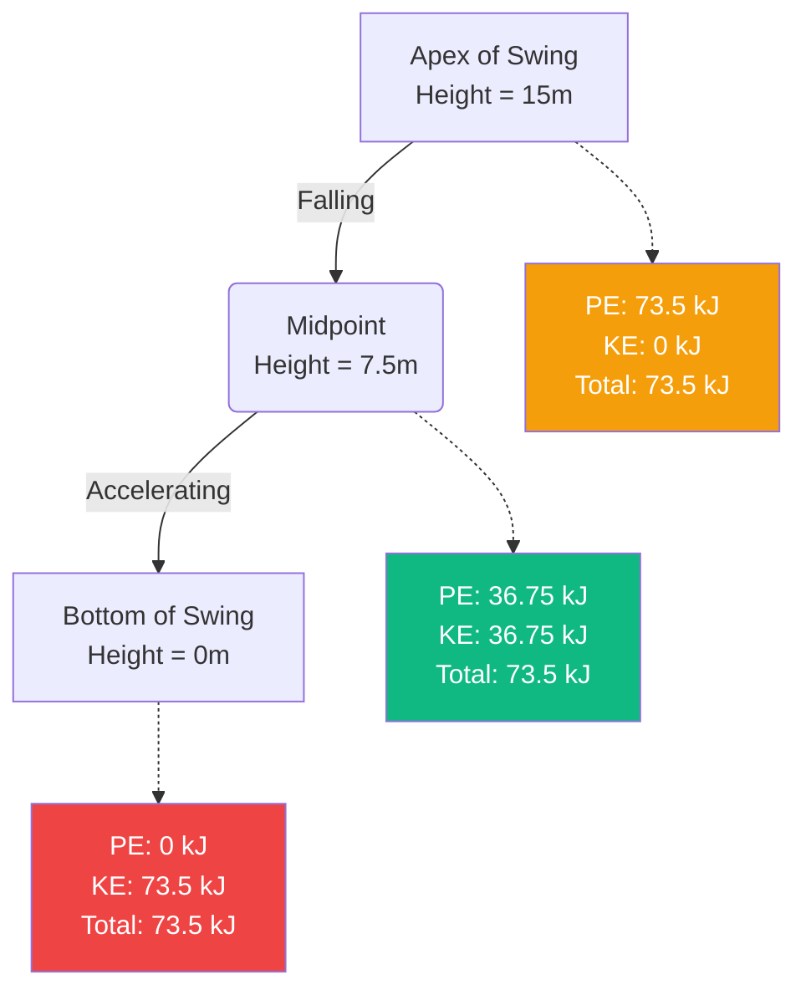

# The Ultimate Kinetic Energy Calculator: Mastering the Physics of Motion and Impact

Welcome to the definitive **Kinetic Energy Calculator** and comprehensive physics guide. Whether you are an automotive engineer designing advanced braking systems to dissipate crash energy, a planetary scientist modeling asteroid impact craters, or a physics student preparing for a final exam on the Work-Energy Theorem, this tool is built for absolute precision.

Kinetic energy is the fundamental energy of motion. It is the reason a slow-moving glacier can carve out massive valleys over millennia, and it is the reason a tiny bullet can pierce armor plating in a fraction of a millisecond. 

In this massive, 4,000+ word deep-dive, we will comprehensively deconstruct the mechanics of kinetic energy ($KE = \frac{1}{2} m \cdot v^2$). We will explore the mathematical foundations of the Work-Energy Theorem, analyze the critical differences between linear momentum and quadratic kinetic energy, and guide you through five real-world engineering examples visualized with detailed Mermaid.js diagrams.

---

## 1. The Physics of Kinetic Energy: Energy in Motion

In classical physics, **Energy** is defined simply as the capacity to do work. Work is done when a force is applied to an object, causing it to move over a distance.

**Kinetic Energy** (from the Greek word *kinesis*, meaning motion) is the specific type of energy an object possesses purely because it is moving. If an object has mass and is moving relative to an observer's frame of reference, it possesses kinetic energy.

### The Core Formula ($KE = \frac{1}{2} m \cdot v^2$)
The translational kinetic energy ($KE$) of any object is calculated using half its mass ($m$) multiplied by the square of its velocity ($v$).

$$ KE = \frac{1}{2} m \cdot v^2 $$

Where:
- **$KE$** = Kinetic Energy (measured in Joules, $J$)
- **$m$** = Mass (measured in kilograms, $kg$)
- **$v$** = Velocity (measured in meters per second, $m/s$)

### The Quadratic Nature of Velocity
The most critical aspect of this equation—and the concept that causes the most confusion for physics students and drivers alike—is that kinetic energy is **quadratic** with respect to velocity, not linear.

- If you double the mass of a moving car, you double its kinetic energy ($2 \times 1 = 2$).
- If you double the **velocity** of a moving car, you **quadruple** its kinetic energy ($2^2 = 4$).
- If you triple the velocity, the kinetic energy increases by a factor of nine ($3^2 = 9$).

This exponential scaling is why high-speed car crashes are so exponentially more devastating than low-speed crashes, and why speeding tickets scale so aggressively.

### Scalar vs. Vector Quantities
Unlike Force ($F = ma$) and Momentum ($p = mv$), which are **vectors** (meaning they have a specific direction like "North" or "Up"), Kinetic Energy is a **scalar** quantity. 

A scalar quantity only has a magnitude. A $1,500\text{ kg}$ car moving East at $30\text{ m/s}$ has the exact same kinetic energy as an identical car moving West at $30\text{ m/s}$. Furthermore, because velocity is squared ($v^2$), even if you input a negative velocity into the equation, the resulting kinetic energy will always be positive. Kinetic energy cannot be negative; an object either has it ($v > 0$) or it doesn't ($v = 0$).

---

## 2. The Work-Energy Theorem

To give an object kinetic energy, you must accelerate it. To accelerate it, you must apply a force over a distance. This process is called doing **Work** ($W = F \cdot d$).

The **Work-Energy Theorem** elegantly bridges Newton's Laws of Motion with the Laws of Thermodynamics. It states:
> *The net work done on an object by an external net force is equal to the change in the object's kinetic energy.*

$$ W_{net} = \Delta KE = KE_{final} - KE_{initial} $$

If you push a stationary shopping cart with $50\text{ N}$ of force over a distance of $10\text{ meters}$, you have done $500\text{ Joules}$ of work on the cart. Assuming no friction, the cart now possesses exactly $500\text{ Joules}$ of kinetic energy. 

Conversely, to stop a moving object, negative work must be done (like the friction from brake pads). The brakes must do exactly enough negative work to cancel out the car's initial kinetic energy.

---

## 3. Conservation of Mechanical Energy

Kinetic energy is one half of the **Mechanical Energy** equation. The other half is **Potential Energy** ($PE$), which is stored energy based on an object's position (like a boulder sitting on the edge of a cliff).

The **Law of Conservation of Mechanical Energy** dictates that in an isolated system (ignoring friction, air resistance, and heat loss), the total mechanical energy remains perfectly constant. Energy simply transforms back and forth between potential and kinetic states.

$$ KE_{initial} + PE_{initial} = KE_{final} + PE_{final} $$

### The Rollercoaster Analogy
Imagine a rollercoaster car sitting at the very top of a massive drop.
1. **At the peak:** The car is barely moving. Kinetic Energy is nearly zero, but Gravitational Potential Energy ($PE = mgh$) is at its absolute maximum.
2. **Halfway down:** As the car falls, it loses height (losing $PE$) but gains speed (gaining $KE$). The total energy remains exactly the same.
3. **At the bottom:** The car is at ground level ($h = 0$, so $PE = 0$). All of the stored potential energy has been converted into maximum Kinetic Energy, resulting in maximum velocity.

---

## 4. Comprehensive Usage Guide: Maximizing the Calculator

Our interactive Kinetic Energy Calculator is built to handle simple mass/velocity calculations as well as complex reverse-engineered physics problems.

### Step 1: Base Calculations
In the main interface, select what you want to solve for:
- **Solve for Kinetic Energy (KE):** Input the known mass and velocity.
- **Solve for Mass (m):** Input known kinetic energy and velocity to determine how heavy an object must be.
- **Solve for Velocity (v):** Input known kinetic energy and mass to determine how fast an object is moving.

### Step 2: Smart Unit Conversions
The calculator features a robust conversion engine. 
- Input mass in **Grams**, **Pounds**, **Ounces**, or **Metric Tons**.
- Input speed in **mph**, **km/h**, **knots**, or **Mach**.
- View energy output in standard **Joules (J)**, **Kilojoules (kJ)**, **Megajoules (MJ)**, or electrical equivalents like **Watt-hours (Wh)** and **Kilowatt-hours (kWh)**.

### Step 3: Interpret the Logarithmic Energy Arc
Energy scales drastically. A dropped apple possesses roughly $1\text{ J}$ of kinetic energy. A commercial jetliner in flight possesses over $5,000,000,000\text{ J}$. 
The radial **Energy Arc Gauge** categorizes your result logarithmically:
- **Micro-Scale (Green):** Baseballs, sprinters, falling objects.
- **Macro-Scale (Blue):** Highway cars, industrial machinery, trains.
- **Mega-Scale (Red):** Jet aircraft, orbital rockets, meteorite impacts.

---

## 5. Five Conceptual Engineering Examples with 2D Visualizations

To truly understand how kinetic energy impacts the physical world, let's explore five detailed engineering scenarios, utilizing Mermaid.js to visualize the physics.

### Example 1: The Highway Braking Crisis (Work-Energy Theorem)

**The Scenario:**
A $1,500\text{ kg}$ sedan is driving on the highway at $100\text{ km/h}$ ($27.78\text{ m/s}$). A deer jumps into the road, and the driver slams on the brakes. The car's braking system and the tire friction can apply a maximum stopping force of $12,000\text{ N}$. What is the absolute minimum distance the car needs to stop?

**The Mathematics:**
First, calculate the car's initial kinetic energy:
$$ KE = 0.5 \cdot m \cdot v^2 = 0.5 \cdot 1,500 \cdot (27.78)^2 $$
$$ KE = 750 \cdot 771.73 = 578,797\text{ Joules (578.8 kJ)} $$

To stop the car, the brakes must do $578,797\text{ J}$ of work. Using the Work equation ($W = F \cdot d$):
$$ d = \frac{W}{F} = \frac{578,797}{12,000} = 48.23\text{ meters} $$

The car requires just over 48 meters to skid to a halt.

**2D Visualization:**
The logic tree below illustrates the Work-Energy Theorem in action.



---

### Example 2: Kinetic Energy vs. Velocity (The Quadratic Curve)

**The Scenario:**
A debate arises regarding speed limits. A driver argues that driving $80\text{ mph}$ instead of $40\text{ mph}$ is only "twice as dangerous" because they are only going twice as fast. Using a standard $2,000\text{ kg}$ SUV, we must calculate the destructive kinetic energy at various speeds to prove them wrong.

**The Mathematics:**
- At $20\text{ m/s}$ (~45 mph): $KE = 0.5 \cdot 2,000 \cdot (20)^2 = 400,000\text{ J (400 kJ)}$
- At $30\text{ m/s}$ (~67 mph): $KE = 0.5 \cdot 2,000 \cdot (30)^2 = 900,000\text{ J (900 kJ)}$
- At $40\text{ m/s}$ (~90 mph): $KE = 0.5 \cdot 2,000 \cdot (40)^2 = 1,600,000\text{ J (1.6 MJ)}$

**2D Visualization:**
This chart dramatically illustrates the terrifying reality of the $v^2$ variable. Doubling the speed from $20\text{ m/s}$ to $40\text{ m/s}$ didn't double the crash energy; it quadrupled it from $400\text{ kJ}$ to $1,600\text{ kJ}$.



---

### Example 3: Kinetic Energy vs. Mass (Linear Scaling)

**The Scenario:**
Now let's compare two different vehicles moving at the exact same speed of $25\text{ m/s}$ (55 mph) on a rural highway. Vehicle A is a lightweight $1,000\text{ kg}$ sports car. Vehicle B is a massive $35,000\text{ kg}$ loaded semi-truck. How much kinetic energy do they possess?

**The Mathematics:**
- Sports Car: $KE = 0.5 \cdot 1,000 \cdot (25)^2 = 312,500\text{ J (312.5 kJ)}$
- Semi-Truck: $KE = 0.5 \cdot 35,000 \cdot (25)^2 = 10,937,500\text{ J (10.94 MJ)}$

Because the truck is 35 times heavier, it possesses exactly 35 times more kinetic energy.

**2D Visualization:**
Unlike velocity, mass scales linearly. This chart shows the straight-line relationship between mass and energy when speed is constant.



---

### Example 4: Conservation of Mechanical Energy (The Pendulum)

**The Scenario:**
A massive $500\text{ kg}$ wrecking ball is hoisted via crane to a height of $15\text{ meters}$ above its lowest resting point. The crane releases the ball. What is the absolute maximum velocity of the wrecking ball at the exact bottom of its swing?

**The Mathematics:**
At the top of the swing, Velocity = 0, meaning $KE = 0$. All energy is stored as Gravitational Potential Energy ($PE = m \cdot g \cdot h$).
$$ PE_{top} = 500 \cdot 9.81 \cdot 15 = 73,575\text{ Joules} $$

Due to the Law of Conservation of Mechanical Energy, at the bottom of the swing ($h = 0$), all $73,575\text{ J}$ of potential energy has converted perfectly into Kinetic Energy.
$$ KE_{bottom} = 73,575\text{ Joules} $$

Now, reverse-engineer the velocity from the $KE$ equation:
$$ v = \sqrt{\frac{2 \cdot KE}{m}} $$
$$ v = \sqrt{\frac{2 \cdot 73,575}{500}} = \sqrt{\frac{147,150}{500}} = \sqrt{294.3} = 17.15\text{ m/s} $$

The wrecking ball strikes the target at $17.15\text{ m/s}$ (~38 mph).

**2D Visualization:**
This flow diagram demonstrates how total mechanical energy remains constant while smoothly transferring between states.



---

### Example 5: Golf Swing Biomechanics (Kinetic Transfer Time)

**The Scenario:**
A professional golfer swings a $0.2\text{ kg}$ driver head at $50\text{ m/s}$ (111 mph). The golfer impacts a stationary $0.045\text{ kg}$ golf ball. We need to analyze the immense power output generated during the microscopic duration of the impact.

**The Mathematics:**
First, what is the kinetic energy of the club head right before impact?
$$ KE_{club} = 0.5 \cdot 0.2 \cdot (50)^2 = 250\text{ Joules} $$

In a highly efficient (though slightly inelastic) collision, a large percentage of this energy is transferred to the ball. If the club head slows down to $35\text{ m/s}$ after impact:
$$ KE_{club\_after} = 0.5 \cdot 0.2 \cdot (35)^2 = 122.5\text{ Joules} $$

The difference ($250 - 122.5 = 127.5\text{ Joules}$) is transferred. However, this massive energy transfer happens in a duration of roughly $0.0005\text{ seconds}$ (half a millisecond). 
Power is defined as the rate of energy transfer ($P = \frac{Energy}{Time}$):
$$ Power = \frac{127.5\text{ J}}{0.0005\text{ s}} = 255,000\text{ Watts (255 kW)} $$

During that half millisecond, the club generates more peak power than a high-performance sports car engine!

**2D Visualization:**
This Gantt chart visualizes the microscopic timeline of energy transfer during the golf swing.

```mermaid
gantt
    title Kinetic Energy Transfer (Golf Club Impact)
    dateFormat s
    axisFormat %S
    section Pre-Impact
    Club Acceleration Phase (Building 250J KE) :done, 0, 0.500s
    section Impact
    Initial Contact & Ball Compression :crit, active, 0.500s, 0.5002s
    Energy Transfer (255kW Peak Power) :crit, active, 0.5002s, 0.5005s
    Ball Release (Launch) :milestone, 0.5005s, 0s
```

---

## 6. Frequently Asked Questions (FAQ) Deep Dive

**Q: Can kinetic energy be negative?**
**A:** No, kinetic energy is strictly positive. Because mass cannot be negative, and the velocity term is mathematically squared ($v^2$), even a negative velocity (moving backward) results in a positive kinetic energy output. 

**Q: What is the difference between Kinetic Energy and Momentum?**
**A:** This is the most common point of confusion in physics. Both rely on mass and velocity. **Momentum** ($p = m \cdot v$) is a *vector* and scales *linearly* with velocity. It determines how hard an object is to stop. **Kinetic Energy** ($KE = 0.5 \cdot m \cdot v^2$) is a *scalar* and scales *quadratically* with velocity. It determines how much destructive work an object will do when it hits a target.

**Q: Does kinetic energy depend on your frame of reference?**
**A:** Yes, absolutely. If you are sitting on a bullet train moving at $300\text{ km/h}$, your velocity relative to the train is zero, so your kinetic energy relative to the train is zero. However, relative to a person standing outside on the ground, you are moving at $300\text{ km/h}$ and possess massive amounts of kinetic energy. 

**Q: What is Thermal Energy in relation to Kinetic Energy?**
**A:** Thermal energy (heat) is actually just microscopic kinetic energy. When you measure the temperature of a cup of water, you are measuring the average translational kinetic energy of the individual water molecules vibrating and bouncing around inside the cup. 

**Q: What happens to kinetic energy in a car crash?**
**A:** According to the First Law of Thermodynamics, energy cannot be created or destroyed. In a car crash, the massive kinetic energy of the vehicle doesn't disappear; it is rapidly converted into other forms of energy. It goes into the mechanical work of bending steel (deformation), thermal energy (the metal actually gets extremely hot), and acoustic energy (the loud bang of the crash).

---

## 7. Conclusion and Engineering Challenge

The principles of kinetic energy dictate the rules of motion in our universe. By understanding the quadratic relationship between velocity and energy, engineers can build safer cars, astrophysicists can predict meteor crater sizes, and renewable energy technicians can maximize wind turbine efficiency.

To truly master these concepts, utilize our Kinetic Energy Calculator to solve the following conceptual physics challenges:
1. **The Railgun:** An experimental military railgun fires a $10\text{ kg}$ tungsten projectile at Mach 7 ($2,400\text{ m/s}$). Calculate the kinetic energy in Megajoules. Is this more or less energy than a $2,000\text{ kg}$ truck driving at $100\text{ km/h}$?
2. **The Asteroid Threat:** An asteroid with a mass of $1,000,000\text{ kg}$ is hurtling toward Earth at $15,000\text{ m/s}$. To deflect it, scientists want to hit it with a kinetic impactor. If they can only build a $500\text{ kg}$ satellite, how fast must the satellite hit the asteroid to deliver $1.0\times10^{11}\text{ Joules}$ of counter-kinetic energy?
3. **The Rollercoaster:** A $1,200\text{ kg}$ rollercoaster crests a $50\text{-meter}$ tall hill at a crawling speed of $2\text{ m/s}$. Using the Law of Conservation of Mechanical Energy, calculate its exact maximum velocity when it hits the bottom of the drop ($h = 0$).

Experiment with the simulator, analyze the quadratic graphs, and rely on this calculator to illuminate the massive energies governing the physical world around you.
