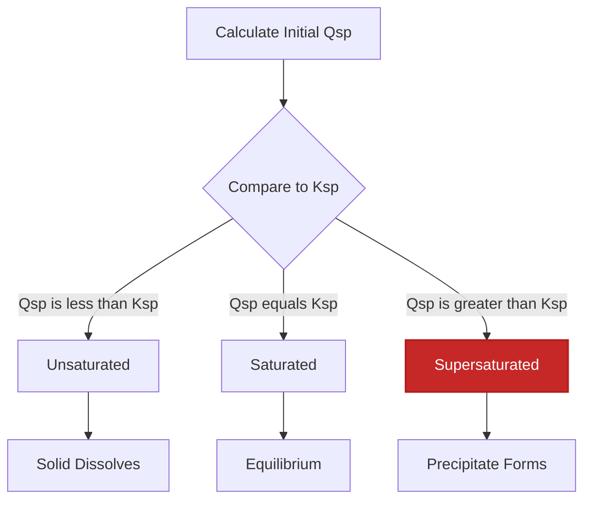

# Laboratory & Analytical Chemistry Guide to Ksp & Solubility Equilibrium

In analytical, environmental, and pharmaceutical chemistry, the **solubility product constant** ($K_{sp}$) measures the equilibrium position of a sparingly soluble ionic compound in water:

$$\text{M}_m\text{X}_n(s) \rightleftharpoons m\text{M}^{n+}(aq) + n\text{X}^{m-}(aq) \quad \implies \quad K_{sp} = [\text{M}^{n+}]^m [\text{X}^{m-}]^n$$

$$\text{Molar Solubility } s \implies \begin{cases} \text{1:1 Salt (AgCl): } & K_{sp} = s^2 \implies s = \sqrt{K_{sp}} \\ \text{1:2 / 2:1 Salt (CaF}_2, \text{Ag}_2\text{CrO}_4): & K_{sp} = (s)(2s)^2 = 4s^3 \implies s = \sqrt[3]{\frac{K_{sp}}{4}} \\ \text{1:3 Salt (Al(OH)}_3): & K_{sp} = (s)(3s)^3 = 27s^4 \implies s = \sqrt[4]{\frac{K_{sp}}{27}} \end{cases}$$

$$Q_{sp} = [\text{M}^{n+}]_{\text{init}}^m [\text{X}^{m-}]_{\text{init}}^n \quad \begin{cases} Q_{sp} < K_{sp} & \implies \text{Unsaturated (No Precipitate)} \\ Q_{sp} = K_{sp} & \implies \text{Saturated (Equilibrium)} \\ Q_{sp} > K_{sp} & \implies \text{Supersaturated (Precipitates)} \end{cases}$$

$$\text{Mass Solubility } (\text{g/L}) = s \, (\text{mol/L}) \times M \, (\text{g/mol})$$

---

## 1. Common Sparingly Soluble Salts Reference Matrix

| Compound | Formula | Stoichiometry | $K_{sp}$ ($25^\circ\text{C}$) | Molar Solubility $s$ ($\text{M}$) | Mass Solubility ($\text{g/L}$) |
| :--- | :--- | :--- | :--- | :--- | :--- |
| **Silver Chloride** | $\text{AgCl}$ | **1:1** | **$1.77 \cdot 10^{-10}$** | **$1.33 \cdot 10^{-5}$** | **$0.00191$** |
| **Barium Sulfate** | $\text{BaSO}_4$ | **1:1** | **$1.08 \cdot 10^{-10}$** | **$1.04 \cdot 10^{-5}$** | **$0.00243$** |
| **Calcium Fluoride** | $\text{CaF}_2$ | **1:2** | **$3.45 \cdot 10^{-11}$** | **$2.05 \cdot 10^{-4}$** | **$0.0160$** |
| **Lead(II) Iodide** | $\text{PbI}_2$ | **1:2** | **$9.8 \cdot 10^{-9}$** | **$1.35 \cdot 10^{-3}$** | **$0.622$** |
| **Silver Chromate** | $\text{Ag}_2\text{CrO}_4$ | **2:1** | **$1.12 \cdot 10^{-12}$** | **$6.54 \cdot 10^{-5}$** | **$0.0217$** |
| **Aluminum Hydroxide**| $\text{Al(OH)}_3$ | **1:3** | **$1.3 \cdot 10^{-33}$** | **$2.63 \cdot 10^{-9}$** | **$2.05 \cdot 10^{-7}$** |

---

## 2. Standard $K_{sp}$ Calculation Protocols

```
1. Sol from Ksp (1:1): s = sqrt(Ksp)
2. Sol from Ksp (1:2 / 2:1): s = (Ksp / 4)^(1/3)
3. Sol from Ksp (1:3): s = (Ksp / 27)^(1/4)
4. Mass Solubility: MassSol (g/L) = s (mol/L) * MolarMass (g/mol)
5. Qsp Comparison: Compare Qsp to Ksp (Qsp > Ksp -> Precipitate)
```

---

## 3. Educational & Laboratory Safety Disclaimer
*This Ksp calculator provides theoretical equilibrium calculations for educational, laboratory research, and AP chemistry applications. Concentrated solutions or ionic solutions with high background electrolytes should account for activity coefficients using Debye-Hückel or Pitzer equations.*

## 4. The Complete Guide to Solubility Product Constant ($K_{sp}$)

Welcome to the definitive guide on the **Solubility Product Constant ($K_{sp}$)**. A common misconception in introductory chemistry is that ionic compounds are either "soluble" or "insoluble." In reality, virtually all ionic compounds dissolve in water to *some* extent. Even a heavy, seemingly impervious solid like rock-hard Marble ($\text{CaCO}_3$) will dissolve slightly, releasing microscopic amounts of $\text{Ca}^{2+}$ and $\text{CO}_3^{2-}$ ions until dynamic equilibrium is reached.

In this exhaustive 4000+ word technical manual, we will completely decode the mathematics of heterogeneous solubility equilibrium. We will define the stoichiometric relationship between $K_{sp}$ and molar solubility ($s$), explain why you cannot simply look at a $K_{sp}$ value to know which salt is more soluble, and dive deeply into the Common-Ion Effect. Finally, we will execute five rigorous, step-by-step mathematical derivations covering 1:1, 1:2, and 1:3 salts, mass solubility conversion, and predicting precipitation using the Reaction Quotient ($Q_{sp}$).

### 4.1 What is $K_{sp}$ (Solubility Product Constant)?

When a solid ionic compound dissolves in water, it dissociates into its constituent aqueous cations and anions. Once the solution becomes saturated, a state of dynamic equilibrium is reached: the rate at which the solid dissolves perfectly equals the rate at which the dissolved ions recombine and precipitate out as solid.

For a generic sparingly soluble salt:
$$ \text{M}_m\text{X}_n(s) \rightleftharpoons m\text{M}^{n+}(aq) + n\text{X}^{m-}(aq) $$

The equilibrium expression for this dissolution is the **Solubility Product Constant ($K_{sp}$)**:
$$ K_{sp} = [\text{M}^{n+}]^m [\text{X}^{m-}]^n $$

**CRITICAL RULE:** Notice that the solid reactant ($\text{M}_m\text{X}_n(s)$) is completely excluded from the denominator. This is because pure solids have a constant thermodynamic activity equal to 1. Their mass does not affect the concentration of the dissolved ions at equilibrium.

### 4.2 Molar Solubility ($s$) vs $K_{sp}$

$K_{sp}$ is a unitless constant that applies at a specific temperature. But what chemists usually want to know is the **Molar Solubility ($s$)**: the maximum number of moles of the solid that will dissolve in one liter of water.

The relationship between $s$ and $K_{sp}$ depends entirely on the stoichiometry of the salt:
*   **1:1 Salts (e.g., AgCl):** $s$ moles dissolve to yield $s$ moles of $\text{Ag}^+$ and $s$ moles of $\text{Cl}^-$.
    $K_{sp} = (s)(s) = s^2 \implies s = \sqrt{K_{sp}}$
*   **1:2 or 2:1 Salts (e.g., $\text{CaF}_2$):** $s$ moles dissolve to yield $s$ moles of $\text{Ca}^{2+}$ and $2s$ moles of $\text{F}^-$.
    $K_{sp} = (s)(2s)^2 = 4s^3 \implies s = \sqrt[3]{\frac{K_{sp}}{4}}$
*   **1:3 or 3:1 Salts (e.g., $\text{Al(OH)}_3$):** $s$ moles dissolve to yield $s$ moles of $\text{Al}^{3+}$ and $3s$ moles of $\text{OH}^-$.
    $K_{sp} = (s)(3s)^3 = 27s^4 \implies s = \sqrt[4]{\frac{K_{sp}}{27}}$

**Why you cannot directly compare $K_{sp}$ values:** If you want to know which salt is more soluble, you can only compare $K_{sp}$ directly if the salts share the same stoichiometry. A 1:2 salt might have a smaller $K_{sp}$ than a 1:1 salt, but actually have a *larger* molar solubility $s$ due to the cube root mathematics. Always calculate $s$ to determine true solubility!

### 4.3 Predicting Precipitation: The Reaction Quotient ($Q_{sp}$)

If you mix two clear solutions together, will a solid precipitate form? We predict this by calculating the **Reaction Quotient ($Q_{sp}$)**. $Q_{sp}$ uses the exact same formula as $K_{sp}$, but we plug in the *initial* concentrations of the mixed ions before any reaction has occurred.

By comparing $Q_{sp}$ to $K_{sp}$:
*   **$Q_{sp} < K_{sp}$ (Unsaturated):** The solution can hold more ions. No precipitate will form. Any existing solid will continue to dissolve.
*   **$Q_{sp} = K_{sp}$ (Saturated):** The solution is perfectly at equilibrium.
*   **$Q_{sp} > K_{sp}$ (Supersaturated):** The ion concentration is too high. The system will shift in reverse, and a solid precipitate **WILL FORM** until $Q_{sp}$ drops to equal $K_{sp}$.

### 4.4 The Common-Ion Effect (Le Chatelier in Action)

The Common-Ion Effect states that adding an ion already involved in the equilibrium will drastically suppress the solubility of the solid.

If you have a saturated solution of $\text{AgCl}$ and you dump in highly soluble $\text{NaCl}$, the massive influx of $\text{Cl}^-$ ions violently disturbs the equilibrium. According to Le Chatelier's Principle, the system shifts left to consume the excess $\text{Cl}^-$, causing huge amounts of $\text{AgCl}(s)$ to crash out of solution. The solubility of a salt is always vastly lower in a solution containing a common ion than it is in pure water.

---

## 5. Usage Guide: Mastering the Ksp Calculator

Our Ksp Calculator is a full analytical toolkit for solubility.

### 5.1 Mode: Calculate Solubility from $K_{sp}$

1.  **Select Mode:** Choose "Molar Solubility from Ksp".
2.  **Select Salt:** Choose from the presets (like $\text{CaF}_2$) or enter a custom stoichiometry (like 1:2).
3.  **Input:** Enter the $K_{sp}$ value.
4.  **Read Output:** The tool instantly runs the algebraic root calculation ($s = \sqrt[3]{K_{sp}/4}$) and outputs the Molar Solubility $s$, the equilibrium ion concentrations, and converts it to Mass Solubility (g/L).

### 5.2 Mode: Qsp Precipitation Predictor

1.  **Select Mode:** Choose "Qsp Precipitation Predictor".
2.  **Input:** Enter the target $K_{sp}$, the stoichiometry, and the initial concentration of the Cation and the Anion.
3.  **Execute:** The tool calculates $Q_{sp}$, compares it to $K_{sp}$, and declares whether a solid precipitate will form.

### 5.3 Mode: Common-Ion Effect Simulator

1.  **Select Mode:** Choose "Common-Ion Effect".
2.  **Input:** Enter the $K_{sp}$ and the concentration of the added common ion (e.g., $0.10\text{ M}$ of added $\text{Cl}^-$).
3.  **Execute:** The tool sets up the modified ICE table algebraic expression, ignores the negligible '+s' term via the small-x approximation, and computes the drastically reduced molar solubility.

---

## 6. Five Real-World Analytical Chemistry Examples

Let's ground this theory in absolute mathematical reality by solving five classic, rigorous solubility scenarios.

### Example 1: The 1:1 Salt (Silver Chloride)

**Scenario:** 
Silver Chloride ($\text{AgCl}$) is a classic sparingly soluble salt used in photography. Its $K_{sp}$ at $25^\circ\text{C}$ is $1.77 \times 10^{-10}$. Calculate its molar solubility in pure water, and find the concentration of $\text{Ag}^+$ ions.

**Mathematical Derivation:**

1.  **Equilibrium Equation:**
    $\text{AgCl}(s) \rightleftharpoons \text{Ag}^+(aq) + \text{Cl}^-(aq)$
2.  **Define $K_{sp}$ Expression:**
    $K_{sp} = [\text{Ag}^+][\text{Cl}^-]$
3.  **Define Molar Solubility ($s$):**
    Let $s$ be the amount of $\text{AgCl}$ that dissolves.
    $[\text{Ag}^+] = s$
    $[\text{Cl}^-] = s$
4.  **Substitute and Solve:**
    $1.77 \times 10^{-10} = (s)(s) = s^2$
    $s = \sqrt{1.77 \times 10^{-10}}$
    $s = 1.33 \times 10^{-5}\text{ M}$
5.  **Calculate Ion Concentrations:**
    $[\text{Ag}^+] = 1.33 \times 10^{-5}\text{ M}$

**Conclusion:** Only $1.33 \times 10^{-5}$ moles of $\text{AgCl}$ will dissolve per liter of pure water.

### Example 2: The 1:2 Salt (Calcium Fluoride)

**Scenario:**
Calcium Fluoride ($\text{CaF}_2$) forms the mineral fluorite. Its $K_{sp}$ is $3.45 \times 10^{-11}$. Calculate its molar solubility and the final concentration of Fluoride ions.

**Mathematical Derivation:**

1.  **Equilibrium Equation:**
    $\text{CaF}_2(s) \rightleftharpoons \text{Ca}^{2+}(aq) + 2\text{F}^-(aq)$
2.  **Define $K_{sp}$ Expression:**
    $K_{sp} = [\text{Ca}^{2+}][\text{F}^-]^2$
3.  **Define Molar Solubility ($s$):**
    For every 1 mole of $\text{CaF}_2$ that dissolves, it yields 1 mole of $\text{Ca}^{2+}$ and **2 moles** of $\text{F}^-$.
    $[\text{Ca}^{2+}] = s$
    $[\text{F}^-] = 2s$
4.  **Substitute and Solve:**
    $3.45 \times 10^{-11} = (s)(2s)^2$
    $3.45 \times 10^{-11} = 4s^3$
    $s^3 = 8.625 \times 10^{-12}$
    $s = \sqrt[3]{8.625 \times 10^{-12}}$
    $s = 2.05 \times 10^{-4}\text{ M}$
5.  **Calculate Ion Concentrations:**
    $[\text{Ca}^{2+}] = 2.05 \times 10^{-4}\text{ M}$
    $[\text{F}^-] = 2(2.05 \times 10^{-4}) = 4.10 \times 10^{-4}\text{ M}$

**Conclusion:** The molar solubility is $2.05 \times 10^{-4}\text{ M}$, and the fluoride concentration is exactly twice that amount.

### Example 3: Converting to Mass Solubility (g/L)

**Scenario:**
Using the results from Example 2, what is the solubility of $\text{CaF}_2$ in terms of grams per liter? The molar mass of $\text{CaF}_2$ is $78.07\text{ g/mol}$.

**Mathematical Derivation:**

1.  **Retrieve Molar Solubility ($s$):**
    $s = 2.05 \times 10^{-4}\text{ mol/L}$
2.  **Multiply by Molar Mass:**
    $\text{Mass Solubility} = \left(2.05 \times 10^{-4} \frac{\text{mol}}{\text{L}}\right) \times \left(78.07 \frac{\text{g}}{\text{mol}}\right)$
    $\text{Mass Solubility} = 0.0160\text{ g/L}$
3.  **Convert to Milligrams per Liter (mg/L):**
    $0.0160\text{ g/L} \times 1000\text{ mg/g} = 16.0\text{ mg/L}$

**Conclusion:** You can dissolve exactly 16 milligrams of Calcium Fluoride in one liter of pure water.

### Example 4: Predicting Precipitation with $Q_{sp}$

**Scenario:**
You mix $50.0\text{ mL}$ of $0.0010\text{ M BaCl}_2$ with $50.0\text{ mL}$ of $0.00010\text{ M Na}_2\text{SO}_4$. The $K_{sp}$ for Barium Sulfate ($\text{BaSO}_4$) is $1.08 \times 10^{-10}$. Will a white precipitate of $\text{BaSO}_4$ form?

**Mathematical Derivation:**

1.  **Calculate New Diluted Concentrations:**
    Because you doubled the total volume (from 50 mL to 100 mL), the concentrations of the ions are cut in half immediately upon mixing.
    $[\text{Ba}^{2+}]_{\text{init}} = \frac{0.0010}{2} = 0.00050\text{ M}$
    $[\text{SO}_4^{2-}]_{\text{init}} = \frac{0.00010}{2} = 0.000050\text{ M}$
2.  **Calculate $Q_{sp}$:**
    $Q_{sp} = [\text{Ba}^{2+}]_{\text{init}} [\text{SO}_4^{2-}]_{\text{init}}$
    $Q_{sp} = (0.00050)(0.000050) = 2.5 \times 10^{-8}$
3.  **Compare $Q_{sp}$ to $K_{sp}$:**
    $Q_{sp} (2.5 \times 10^{-8}) > K_{sp} (1.08 \times 10^{-10})$

**Conclusion:** Because $Q_{sp}$ is significantly greater than $K_{sp}$, the solution is supersaturated. A solid white precipitate of Barium Sulfate **WILL FORM**.

**Visualization: The Precipitation Prediction Matrix**


*This flowchart illustrates the universal logic for determining if two mixed clear solutions will spontaneously form an insoluble solid.*

### Example 5: The Common-Ion Effect (Crushing Solubility)

**Scenario:**
Recall Example 1: The solubility of $\text{AgCl}$ in pure water is $1.33 \times 10^{-5}\text{ M}$. Now, calculate the molar solubility of $\text{AgCl}$ in a solution that already contains $0.10\text{ M NaCl}$. 
($K_{sp} = 1.77 \times 10^{-10}$)

**Mathematical Derivation:**

1.  **Identify the Common Ion:**
    $\text{NaCl}$ completely dissolves, filling the solution with $0.10\text{ M}$ of $\text{Cl}^-$ ions.
2.  **Construct ICE Table:**
    *   **I:** $[\text{Ag}^+] = 0$, $[\text{Cl}^-] = 0.10$
    *   **C:** $+s$, $+s$
    *   **E:** $s$, $(0.10 + s)$
3.  **Set up $K_{sp}$ Equation:**
    $K_{sp} = [\text{Ag}^+][\text{Cl}^-]$
    $1.77 \times 10^{-10} = (s)(0.10 + s)$
4.  **Apply Small-x Approximation:**
    Because $K_{sp}$ is incredibly small ($10^{-10}$), the amount of solid that dissolves ($s$) will be minuscule compared to the massive $0.10\text{ M}$ already present. Therefore, we assume $(0.10 + s) \approx 0.10$.
5.  **Solve Simplified Equation:**
    $1.77 \times 10^{-10} = (s)(0.10)$
    $s = \frac{1.77 \times 10^{-10}}{0.10}$
    $s = 1.77 \times 10^{-9}\text{ M}$

**Conclusion:** In pure water, the solubility was $13,300 \times 10^{-9}\text{ M}$. In the presence of the common chloride ion, it crashed to $1.77 \times 10^{-9}\text{ M}$. The Common-Ion Effect decreased the solubility of the Silver Chloride by a factor of nearly 10,000!

**Visualization: Common Ion Effect Dynamics**

```mermaid
gantt
    title The Common Ion Effect on AgCl Solubility
    dateFormat  HH:mm:ss
    axisFormat  %H:%M
    section Baseline
    Solubility in Pure Water :00:00:00, 00:10:00
    section Common Ion Added
    NaCl Dumped into Beaker :crit, 00:10:00, 00:12:00
    section Le Chatelier Shift
    Massive Precipitation Shift Left :active, 00:12:00, 00:20:00
    Solubility Crushed by 10,000x :00:20:00, 00:30:00
```


*This timeline illustrates how the sudden influx of a common ion forces a violent Le Chatelier shift in reverse, causing massive precipitation and permanently crippling the molar solubility of the solid.*

---

## 7. Deep Dive FAQ and Advanced Troubleshooting

**Q: If I increase the amount of solid sitting at the bottom of the beaker, does it increase the concentration of ions in the water?**
**A:** Absolutely not. The solid is not part of the $K_{sp}$ expression. Whether you have 1 gram or 1 kilogram of undissolved solid at the bottom of the beaker, the concentration of the dissolved ions in the water above it remains perfectly locked at the saturation point dictated by $K_{sp}$.

**Q: Are there any limitations to $K_{sp}$ calculations?**
**A:** Yes. Simple $K_{sp}$ calculations assume ideal behavior. In solutions with extremely high concentrations of other, non-common ions (high "ionic strength"), the water molecules become organized around those foreign ions, making it *easier* for the sparingly soluble solid to dissolve. This is called the "Diverse Ion Effect" or "Salt Effect," and it actually *increases* solubility, requiring advanced Debye-Hückel Activity calculations to model accurately.

**Q: Can $Q_{sp}$ ever be exactly zero?**
**A:** Yes, if you place a pure solid into 100% pure distilled water, before a single atom dissolves, the initial concentration of the ions is exactly zero. $Q_{sp} = (0)(0) = 0$. Since $0 < K_{sp}$, the solid begins dissolving immediately to reach equilibrium.

Mastering the mathematical nuances of stoichiometric exponents, the mass solubility conversion, and the brutal impact of the common-ion effect gives you total control over analytical precipitation chemistry. Whenever you are faced with a heterogeneous ionic equilibrium, rely on this Ksp Calculator to provide immediate, mathematically perfect solutions.
