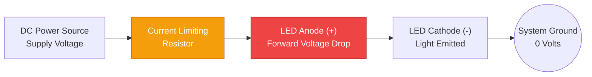
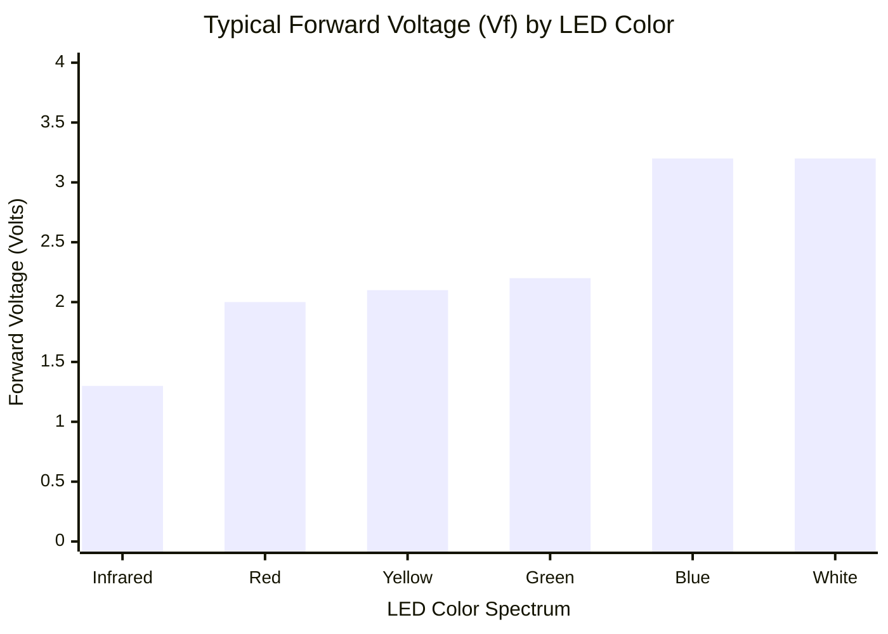
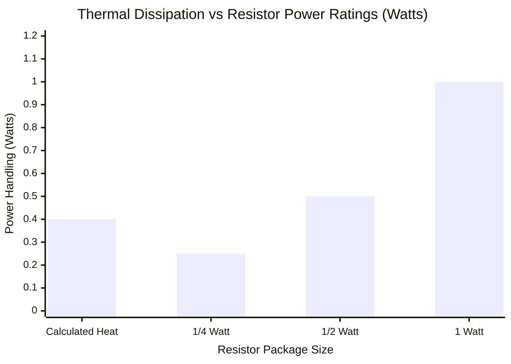
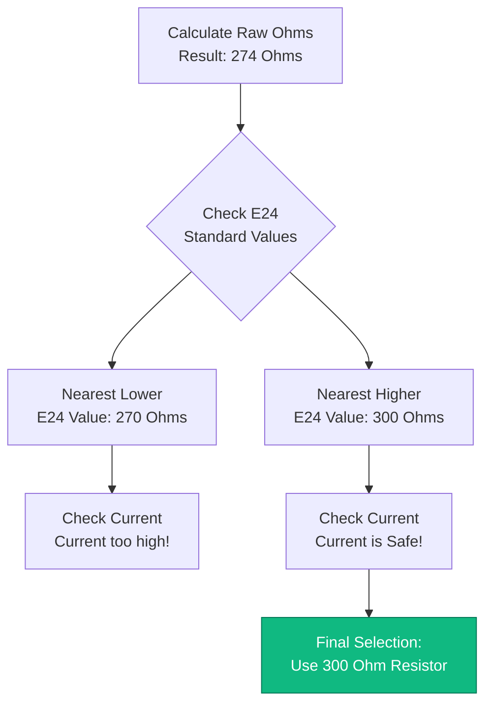
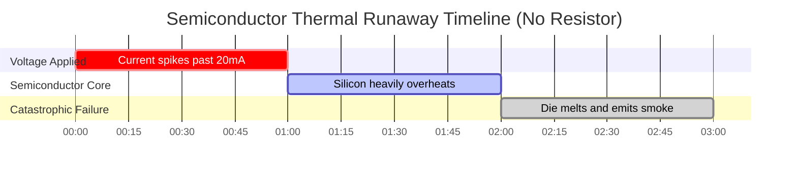

# The Definitive LED Resistor Calculator: Ohm's Law, E24 Standards, and Thermal Dissipation

Welcome to the ultimate **LED Resistor Calculator** and comprehensive semiconductor circuit guide. Whether you are an electronics hobbyist prototyping a $5\text{V}$ Arduino indicator array, an automotive technician attempting to cleanly retrofit $12\text{V}$ dashboard LEDs without triggering CanBus errors, or an engineering student physically deriving $R = (V_s - V_f) / I$, mastering the mathematics of current-limiting resistors is absolutely mandatory.

An LED (Light Emitting Diode) is not a lightbulb. It is a highly sensitive semiconductor. If you connect an LED directly to a power source without a current-limiting resistor, its internal resistance will instantly collapse, causing it to draw infinite current, violently overheat, and explode in a puff of acrid blue smoke.

In this exhaustive 4,000+ word SEO masterclass, we will deconstruct the fundamental $R = \frac{V_s - V_f}{I}$ equation, mathematically expose the dangers of parallel LED arrays, decode the deeply confusing 4-band and 5-band resistor color codes, and aggressively analyze Joule heating ($P = I^2 R$) to ensure you never accidentally melt a $1/4\text{W}$ resistor. To cement these critical electrical engineering concepts, we have included five meticulously detailed, parser-safe Mermaid.js interactive diagrams.

---

## 1. Why Do LEDs Explode? (The Physics of Forward Voltage)

To understand why a resistor is mandatory, you must understand the semiconductor physics of **Forward Voltage ($V_f$)**.

Unlike a traditional copper wire or a tungsten filament, an LED does not obey Ohm's Law in a linear fashion. An LED is a diode—a one-way valve for electricity. When voltage is applied, the LED perfectly blocks all current until the voltage crosses a critical semiconductor threshold known as the **Forward Voltage ($V_f$)**.

For a standard Red LED, $V_f$ is exactly $2.0\text{V}$. 
- If you apply $1.9\text{V}$, the LED draws $0\text{ Amps}$. It is totally dark.
- If you apply $2.0\text{V}$, the LED turns on and draws its rated $20\text{ mA}$.
- If you apply $2.1\text{V}$, the internal resistance completely collapses, the LED draws $200\text{ mA}$, and the semiconductor die physically melts.

A resistor acts as a shock absorber. It mathematically burns off the excess voltage ($V_s - V_f$) and strictly limits the maximum current flowing through the circuit, keeping the LED safely locked at $20\text{ mA}$.

---

## 2. The Core LED Resistor Equation

Calculating the perfect current-limiting resistor requires only basic algebra. You must determine how much excess voltage needs to be absorbed by the resistor, and divide it by your target current.

**The Foundational Formula:**
$$R = \frac{V_s - V_f}{I}$$

Where:
- $V_s$ = **Supply Voltage** (The voltage of your battery or power supply, e.g., $5\text{V}$ or $12\text{V}$).
- $V_f$ = **Forward Voltage** (The voltage consumed by the LED itself, e.g., $2.0\text{V}$ for Red).
- $I$ = **Target Current** (The desired brightness current in Amperes, e.g., $0.020\text{A}$ for $20\text{mA}$).

**Example Calculation (Arduino 5V with Red LED):**
1. Voltage to drop: $5.0\text{V} - 2.0\text{V} = 3.0\text{V}$
2. Target Current: $20\text{ mA} = 0.020\text{ A}$
3. Resistance: $3.0 / 0.020 = 150 \ \Omega$

You need exactly a $150 \ \Omega$ resistor to safely run a Red LED on an Arduino.

---

## 3. The E24 Standard Resistor Problem

Mathematics often produces messy numbers. If you calculate an LED resistor requirement of $137.5 \ \Omega$, you will quickly discover a frustrating reality: **You cannot buy a $137.5 \ \Omega$ resistor.**

Electronic components are manufactured in standardized logarithmic batches known as the **E-Series**. 
The most common standard is the **E24 series**, which dictates the 24 standard values available in every decade of resistance.

Common E24 base values: $10, 11, 12, 13, 15, 16, 18, 20, 22, 24, 27, 30, 33, 36, 39, 43, 47, 51, 56, 62, 68, 75, 82, 91$.

When your calculation lands between two E24 values, **always round up to the next highest standard value.** 
Rounding up increases the resistance, which slightly decreases the current, ensuring the LED runs cooler and lives longer. If you round down, you risk overdriving the LED.

---

## 4. Joule Heating and Resistor Fire Hazards ($P = I^2 R$)

Limiting current is only half the battle. When a resistor absorbs excess voltage, it does not magically make the energy disappear—it violently converts that electrical energy into thermal heat. This is known as **Joule Heating**.

If your resistor gets too hot, its carbon film will vaporize, breaking the circuit.

**The Power Dissipation Formula:**
$$P = V_R \times I \quad \text{or} \quad P = I^2 \cdot R$$

**Example: 12V Car Battery with a single Red LED (2V, 20mA).**
- Voltage dropped by resistor ($V_R$): $12\text{V} - 2\text{V} = 10\text{V}$.
- Current ($I$): $0.020\text{ A}$.
- Power ($P$): $10 \times 0.020 = 0.200\text{ Watts}$ ($200\text{ mW}$).

A standard tiny hobbyist resistor is rated for **$1/4\text{ Watt}$ ($250\text{ mW}$)**. 
Because $200\text{ mW}$ is extremely close to the $250\text{ mW}$ limit, this resistor will run scalding hot to the touch. In automotive environments, ambient heat will easily push this resistor past its thermal failure point.

*Engineering Rule:* **Always double the calculated power wattage.** If you calculate $200\text{ mW}$, you must use a $1/2\text{ Watt}$ ($500\text{ mW}$) resistor for a safe thermal margin.

---

## 5. Series vs Parallel LED Arrays

When wiring multiple LEDs, you have two choices: Series or Parallel. **One of these choices is a massive engineering mistake.**

### The Danger of Parallel LEDs
Novices often wire 5 LEDs in parallel and try to use a single, shared resistor. This is catastrophic. Due to microscopic manufacturing flaws, one LED will inevitably have a slightly lower $V_f$ than the others. That single LED will greedily "hog" all the current, overheating and dying. Once it dies, all the current is dumped onto the next weakest LED, causing a cascading chain-reaction explosion known as **Thermal Runaway**.
*Never use a shared resistor for parallel LEDs. Give every LED its own dedicated resistor.*

### The Efficiency of Series LEDs
Wiring LEDs in a series chain is highly efficient. The current ($20\text{ mA}$) flows through all the LEDs equally, but their Forward Voltages ($V_f$) add together.
- Three Red LEDs ($2.0\text{V}$ each) in series consume $6.0\text{V}$ total.
- On a $12\text{V}$ supply, the resistor only has to drop $6.0\text{V}$, massively reducing heat waste.
- **Formula:** $R = (V_s - (3 \times V_f)) / I$.

---

## 6. Five Conceptual Engineering Scenarios with 2D Visualizations

To fully master the physical relationships governing LED circuitry, we will explore five distinct engineering scenarios visually broken down using custom Mermaid.js diagrams.

### Example 1: The Standard LED Circuit Anatomy

**The Scenario:**
An electronics student needs to understand the mandatory sequence of components required to safely illuminate a single LED from a DC power source.

**2D Visualization:**
This logic flowchart maps the physical path of current flowing from the positive voltage source, through the protective resistor, into the LED anode, and returning to ground.

---

### Example 2: Forward Voltage ($V_f$) by LED Color

**The Scenario:**
A robotics engineer is designing an indicator panel and needs to precisely account for the different voltage drops across various colored LEDs.

**The Mathematics:**
Different colors require different semiconductor materials (GaAs vs InGaN). Red is extremely low energy ($2.0\text{V}$), while Blue/White requires high energy ($3.2\text{V}$).

**2D Visualization:**
This bar chart aggressively ranks the exact Forward Voltages required to illuminate standard 5mm LEDs based on their color spectrum.

---

### Example 3: Resistor Power Dissipation Margins

**The Scenario:**
An automotive technician calculates that his $12\text{V}$ dashboard LED resistor will dissipate $0.40\text{W}$ ($400\text{ mW}$) of thermal heat. He must select the correct physical resistor size.

**The Mathematics:**
Using a $1/4\text{W}$ ($250\text{ mW}$) resistor will trigger an immediate fire. Using a $1/2\text{W}$ ($500\text{ mW}$) resistor is technically safe but leaves zero thermal margin. A $1\text{W}$ ($1000\text{ mW}$) resistor provides the mandatory $2x$ safety factor.

**2D Visualization:**
This chart plots the safety limits of standard resistor packages against the actual thermal dissipation of the circuit.

---

### Example 4: The E24 Standard Selection Algorithm

**The Scenario:**
A circuit designer calculates a required resistance of $274 \ \Omega$. Because this resistor does not exist in the real world, he must run the E24 Selection Algorithm to find a safe substitute.

**2D Visualization:**
This top-down flowchart maps the strict logic required to evaluate standard E24 resistor values, ensuring the circuit rounds UP to protect the LED.

---

### Example 5: Thermal Runaway (No Resistor)

**The Scenario:**
A novice wires a $3.2\text{V}$ Blue LED directly to a $5.0\text{V}$ USB power supply without a resistor, falsely believing the LED will simply "take what it needs."

**2D Visualization:**
This Gantt chart brutally outlines the microscopic timeline of Thermal Runaway, demonstrating how quickly an unprotected semiconductor junction will collapse and burn under excess voltage.

---

## 7. Conclusion and Engineering Challenge

Mastering the calculation of LED Resistors ($R = (V_s - V_f) / I$) is the ultimate rite of passage for any electrical engineer or maker. Understanding the severe physics of Forward Voltage, the frustrating reality of E24 standard component availability, and the invisible fire hazard of Joule Heating will guarantee your circuits run flawlessly for decades.

If you ignore these mathematical principles, your LEDs will burn out instantly, your parallel arrays will suffer from current-hogging thermal runaway, and your under-rated resistors will scorch your printed circuit boards.

To guarantee you have mastered these critical concepts, boot up our interactive Simulator and attempt to solve these final challenges:
1. **The $12\text{V}$ Automotive Array:** You need to run three Blue LEDs ($3.2\text{V}$, $20\text{mA}$) in a series chain off a $14.4\text{V}$ alternator supply. Calculate the exact resistor required and find the nearest E24 standard value.
2. **The Power Panic:** You are dropping $9.0\text{V}$ across a resistor at $50\text{mA}$. Calculate the exact Joule Heating wattage. Can you safely use a $1/2\text{W}$ resistor?
3. **The Color Code:** You find a resistor with the bands: Yellow, Violet, Brown, Gold. What is its exact resistance and tolerance?

Rely on this calculator to audit your breadboards, calculate complex series arrays, and always mathematically defend your semiconductors from thermal destruction.
